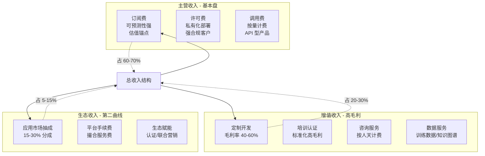

# 盈利策略：定价模型与规模化路径

定价不是单点决策，而是贯穿产品全生命周期的经济系统设计。一个健康的盈利策略需要同时回答三个问题：**怎么收钱**（定价模型与收入结构）、**怎么长大**（规模化路径）、**怎么赚钱**（单位经济模型）。本章将这三层逻辑串联成可操作的决策框架。

## 1. 定价模型

定价模型决定了价值如何被计量与回收。AI 产品的特殊性在于其边际成本（算力、Token、推理资源）随用量波动，因此定价既要覆盖成本，又要匹配客户的支付意愿与使用节奏。

### 1.1 四类定价模型对比

| 维度 | 成本加成定价 | 价值定价 | 竞争定价 | 动态定价 |
|---|---|---|---|---|
| **核心逻辑** | 在单位成本上叠加固定毛利率 | 以客户感知价值为锚点定价 | 参照竞品价格带制定自身价格 | 依据实时供需与用户画像调整价格 |
| **计算/决策方法** | 价格 = 单位成本 × (1 + 目标毛利率) | 量化客户节省的成本或创造的收入，按比例分成 | 选定基准竞品，定位溢价/平价/低价区间 | 算法输入用量预测、负载、用户价格敏感度 |
| **适用场景** | 成本透明且可预测的基础设施型服务（GPU 租赁、算力包） | 价值可量化的高 ROI 场景（风控、营销优化、收入提升） | 同质化程度高、竞争格局稳定的市场（通用 Chat API） | 高并发、库存时效性强的场景（推理峰值调度、限时额度） |
| **优势** | 简单透明，毛利可控，财务可预测 | 单价天花板高，能捕获真实创造的价值 | 市场进入阻力小，定价决策成本低 | 资源利用率最大化，峰谷收益均衡 |
| **劣势** | 忽略客户支付意愿，易低估价值导致利润流失 | 价值量化依赖客户数据，销售周期长且需 ROI 证明 | 陷入价格战，毛利被竞品压缩 | 算法复杂，用户感知不透明易引发信任问题 |
| **AI 产品典型应用** | 算力租赁、Token 调用按成本 + 20% | 风控模型按挽回损失 10% 分成 | 通用对话 API 对标 GPT-4 价格 80% | 推理高峰期按负载上浮 30% |

**选型建议**：早期产品采用"成本加成保底 + 价值定价探索"的双轨制——用成本加成确保毛利安全垫，同时在头部客户中试点价值定价以验证价格天花板。同质化红海市场才退守竞争定价，动态定价仅适用于具备充足用量数据与算法能力的成熟期产品。

### 1.2 AI 产品定价层级设计示例

多层级定价（Tiered Pricing）是 AI 产品的主流形态，通过功能与用量切分覆盖从免费体验到企业级的全谱系需求。以下是一个面向 ToB 的 AI 内容生成产品的层级设计示例：

| 层级 | 月费（人民币） | 核心功能 | 用量配额 | 协作席位 | 适用客户 |
|---|---|---|---|---|---|
| **免费版** | 0 | 基础对话、3 个模板、水印导出 | 100 次/月 | 1 | 个人尝鲜、口碑传播 |
| **基础版** | 99 | 去水印、20 个模板、PDF 导出 | 1,000 次/月 | 1 | 自由职业者、小微团队 |
| **专业版** | 399 | 自定义模板、品牌库、API 调用 | 10,000 次/月 | 5 | 中小企业市场团队 |
| **企业版** | 1,999 起 | 私有化部署、SSO、审计日志、专属模型微调 | 不限（按 QPS 计） | 不限 | 中大型企业、强合规需求 |

**切分原则**：

- **免费版做获客漏斗**：功能足够好用以产生口碑，但用量与导出限制构成升级动力
- **基础版做转化**：价格敏感型用户的首个付费台阶，去除免费版痛点（水印、用量限制）
- **专业版做利润**：毛利最高的层级，目标客户付费意愿与能力匹配，是收入主力
- **企业版做锚点与定制**：高客单价拉高 ARPU，同时为增值服务（定制、培训）创造入口

层级之间的价差建议控制在 3-5 倍，过低则升级动力不足，过高则形成断层。每个层级必须有一个"杀伤性功能"——即下一层级用户最渴望但被锁定的能力，驱动自然向上销售。

## 2. 收入结构设计

单一收入来源的 AI 产品抗风险能力弱。健康的收入结构应有三层：主营收入提供基本盘，增值收入提升客单价与毛利，生态收入打开第二增长曲线。

### 2.1 三层收入结构

**主营收入**——产品核心能力的直接变现：

- **订阅费**：按月/年收取固定费用，对应功能层级。可预测性强，是估值锚点
- **许可费**：私有化部署的一次性或年度许可，适合强合规客户
- **调用费**：按 Token、次数、QPS 计量收费，适合 API 型产品与重度用户

**增值收入**——围绕主营能力延伸的高毛利服务：

- **定制开发**：针对客户场景的模型微调、流程集成、私有化适配，毛利率 40-60%
- **培训认证**：产品使用培训、最佳实践工作坊、官方认证体系
- **咨询服务**：AI 战略咨询、落地实施、效果优化，按人天计费
- **数据服务**：高质量训练数据、行业知识图谱、标注服务

**生态收入**——基于平台化能力的网络效应变现：

- **应用市场抽成**：第三方插件/模板/Agent 的交易分成（典型 15-30%）
- **平台手续费**：连接供需双方的撮合服务费
- **生态赋能**：认证伙伴计划、技术支持包、联合营销

### 2.2 收入组合可视化

**结构配比建议**：早期阶段主营收入应占 80% 以上以确保生存，成熟期逐步调整为 60% 主营 + 25% 增值 + 15% 生态的稳健结构。增值收入毛利高但难规模化，生态收入规模化但需先建平台，二者皆不可过早投入。

## 3. 规模化盈利路径

盈利规模化的本质是让收入增速快于成本增速。三条路径对应三种增长引擎，各有前提、动作与风险。

### 3.1 横向扩展：多行业、多场景、多地域

**核心逻辑**：将已验证的产品能力复制到新市场，做广度扩张。

**前提条件**：

- 核心产品在原市场已跑通 PMF，有可复制的标准交付流程
- 模型/能力具备跨行业通用性，定制成本低
- 组织具备多线作战能力（销售、交付、支持）

**关键动作**：

- 拆解原市场成功要素，提炼可移植的方法论与配置模板
- 选择相邻行业优先扩展（能力重叠度高、定制成本低）
- 建立行业 BD 团队与本地化交付能力
- 通过渠道伙伴加速地域覆盖，降低直营成本

**风险**：

- 定制需求爆炸，每个新行业都要重做一遍，沦为项目制公司
- 组织摊薄过快，核心能力被稀释
- 跨地域合规、语言、文化成本被低估

### 3.2 纵向深耕：单客户价值提升

**核心逻辑**：在同一客户内做深做透，提升 ARPU 与续费率。

**前提条件**：

- 客户基数足够，且头部客户有扩展空间
- 产品矩阵丰富，能覆盖客户更多业务环节
- 客户成功体系健全，能识别扩展机会

**关键动作**：

- **交叉销售**：向现有客户销售互补产品线（如已购内容生成，再推数字人）
- **向上销售**：推动客户从基础版升级到专业版/企业版
- **用量深耕**：通过最佳实践咨询提升客户使用深度，增加调用与续费
- **续费保障**：建立健康度监控与流失预警，年续费率目标 >90%

**风险**：

- 过度依赖少数头部客户，议价权下降
- 增收不增利（为提客单价给过多定制折扣）
- 单客户增长见顶后缺乏新引擎

### 3.3 平台化：开放生态与网络效应

**核心逻辑**：从单一产品升级为平台，让第三方贡献能力，形成网络效应。

**前提条件**：

- 产品已是细分领域标杆，具备吸引第三方的流量与信任
- 具备开放 API、SDK、应用市场等基础设施
- 平台治理能力强（审核、分成、纠纷处理）

**关键动作**：

- 开放核心能力 API，吸引开发者基于平台构建应用
- 建立应用市场与分成机制，让生态伙伴获利
- 培育标杆案例与认证体系，扩大生态影响力
- 设计数据飞轮：更多用户→更多数据→更强模型→更多用户

**风险**：

- 平台冷启动难，前期投入大且见效慢
- 生态伙伴与平台争利，治理成本高
- 开放带来的安全与质量风险（恶意插件、数据泄露）

### 3.4 三条路径对比

| 维度 | 横向扩展 | 纵向深耕 | 平台化 |
|---|---|---|---|
| **增长引擎** | 市场广度 | 客户深度 | 网络效应 |
| **见效速度** | 中（6-18 个月） | 快（3-12 个月） | 慢（18-36 个月） |
| **投入重点** | 销售/交付/本地化 | 客户成功/产品矩阵 | 平台基建/生态治理 |
| **毛利影响** | 中（定制拉低毛利） | 高（增值服务高毛利） | 长期高，短期低 |
| **核心风险** | 沦为项目制 | 大客户依赖 | 冷启动失败 |
| **适用阶段** | PMF 后 1-3 年 | 任何阶段 | 细分领先后 |
| **典型指标** | 行业覆盖数、地域数 | ARPU、续费率、NRR | 开发者数、GMV、抽成收入 |

**组合策略**：三条路径并非互斥，而是阶段性叠加。早期以纵向深耕为主（快速增收、验证产品矩阵），中期叠加横向扩展（做大基本盘），晚期才尝试平台化（构建护城河）。过早平台化是 AI 创业公司最常见的战略失误。

## 4. 单位经济模型优化

定价与规模化路径回答"怎么收钱、怎么长大"，单位经济模型（Unit Economics）回答"每一笔生意是否真的赚钱"。LTV（客户终身价值）与 CAC（获客成本）的比率是衡量商业模型健康度的核心指标。

### 4.1 LTV/CAC 健康标准

| LTV:CAC 比率 | 健康度 | 含义与建议 |
|---|---|---|
| < 1 | 危险 | 每获一客即亏损，商业模式不成立，需立即止血 |
| 1 - 3 | 亚健康 | 勉强覆盖获客成本，回收期长，抗风险能力弱 |
| **> 3** | **健康** | 行业公认的健康基线，每投入 1 元获客可回收 3 元以上 |
| > 5 | 优秀 | 单位经济极佳，可加大获客投入加速增长 |
| > 10 | 警惕 | 可能是获客投入不足（增长过慢）或定价过高（市场天花板低） |

**补充指标**：LTV:CAC 之外还需关注 **NRR（净收入留存率）**。NRR >120% 表明即便不获新客，现有客户也能持续增收；NRR <100% 则客户流失快于扩展，需优先修产品而非扩销售。

### 4.2 提升 LTV 的方法

LTV = ARPU × 毛利率 × (1 / 流失率)，提升 LTV 有三条杠杆：

- **提价**：通过价值量化证据支撑涨价，年均提价 5-10% 可显著提升 LTV。前提是产品已具备不可替代性，否则涨价即流失
- **降流失**：年流失率从 20% 降到 10%，LTV 近乎翻倍。建立健康度评分模型，对低分客户主动干预
- **增购（Expansion）**：通过用量增长、席位扩展、模块加购提升 ARPU，是 NRR >120% 的核心驱动力

### 4.3 降低 CAC 的方法

CAC = 销售与市场总投入 / 新获客户数，降低 CAC 的方法：

- **自然流量**：SEO、内容营销、开源版本、社区运营，CAC 趋近于 0 但见效慢
- **口碑与转介绍**：老客户推荐获客成本极低，设计转介绍激励（如双方各得 1 个月免费）
- **渠道优化**：通过归因分析砍掉低效渠道，将预算向高转化渠道集中
- **产品自传播**：在产品中嵌入传播机制（如生成内容带水印与产品链接），让使用即获客

### 4.4 回收期计算

回收期（Payback Period）= CAC / (ARPU × 毛利率)，指收回单客获客成本所需的月数。

**计算示例**：

- CAC = 3,000 元/客
- ARPU = 500 元/月
- 毛利率 = 70%
- 月毛利贡献 = 500 × 70% = 350 元
- 回收期 = 3,000 / 350 ≈ 8.6 个月

**健康标准**：AI 产品回收期应控制在 12 个月以内，意味着客户在第一年内即可回本，第二年开始产生纯利。回收期超过 18 个月需要警惕现金流压力。

### 4.5 优化前后对比示例

以某 AI 内容生成 SaaS 为例，对比单位经济模型优化前后：

| 指标 | 优化前 | 优化后 | 优化手段 |
|---|---|---|---|
| ARPU（月） | 300 元 | 450 元 | 推出专业版 + 用量增购 |
| 毛利率 | 60% | 75% | 推理成本优化 + 自有模型替换 API |
| 年流失率 | 25% | 12% | 客户成功体系 + 健康度预警 |
| CAC | 2,400 元 | 1,800 元 | 自然流量占比从 20% 提至 40% |
| **LTV** | 300×60%×(1/25%)×12 = **864 元** | 450×75%×(1/12%)×12 = **3,375 元** | LTV 提升 290% |
| **LTV:CAC** | 864/2400 = **0.36** | 3375/1800 = **1.88** | 从危险提升至亚健康 |
| **回收期** | 2400/(300×60%) = 13.3 月 | 1800/(450×75%) = 5.3 月 | 回收期缩短 60% |

**进一步优化方向**：上述示例优化后 LTV:CAC 为 1.88，仍未达健康线（>3）。继续优化路径：

- 将年流失率再降至 8%，LTV 提升至 5,063 元，LTV:CAC 达 2.81
- 配合年度订阅（预收 12 个月）改善现金流，回收期按现金计即为 0
- 增购 Expansion 收入计入后，NRR 提升至 115%，实际 LTV 进一步放大

**关键洞察**：单位经济优化是系统工程，单一杠杆效果有限。提价、降流失、降 CAC 三者协同才能将 LTV:CAC 推过健康线。优化顺序建议为：**先降流失（最快见效）→ 再提 ARPU（产品成熟后）→ 后降 CAC（规模化后）**，避免在产品未成熟时盲目获客导致 CAC 浪费。

## 5. 本章小结

盈利策略是一个三层嵌套的决策系统：

1. **定价层**：四类定价模型各有适用场景，AI 产品推荐"成本加成保底 + 价值定价探索"双轨制，配合多层级订阅覆盖全谱系客户
2. **收入结构层**：主营 + 增值 + 生态三层结构，早期主营为主，成熟期逐步向增值与生态倾斜
3. **规模化层**：纵向深耕、横向扩展、平台化三路径阶段性叠加，避免过早平台化
4. **单位经济层**：LTV:CAC > 3 为健康基线，通过降流失、提 ARPU、降 CAC 三杠杆协同优化，回收期控制在 12 个月以内

定价是艺术，规模化是工程，单位经济是科学。三者协同才能让 AI 产品从"能卖出去"走向"能赚得到"。

---

**上一章**：[06 - 市场推广：AI产品的GTM策略](06-marketing-strategy.md)  
**下一章**：[08 - 企业服务场景：ToB AI应用变现路径](08-scenario-enterprise.md)  
**返回目录**：[00 - 总览](00-overview.md)
