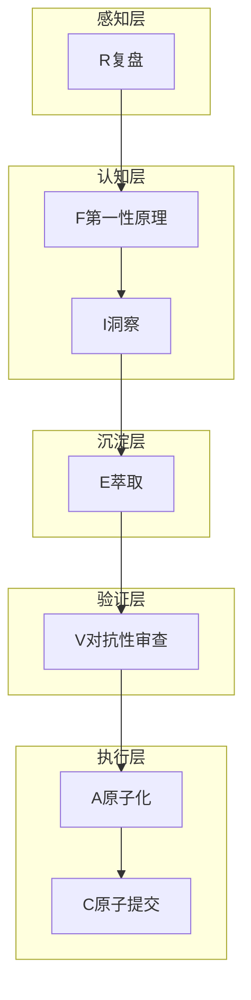

# 理论框架：七概念理论详解

## 概述

七概念理论是一套系统化的分析方法论，包含七个核心概念，按顺序应用于分析过程，确保分析的完整性和可靠性。

## 七概念速查表

| 缩写 | 概念 | 英文 | 层级定位 | 核心作用 |
|------|------|------|---------|---------|
| R | 复盘 | Retrospective | 感知层 | 收集客观事实 |
| F | 第一性原理 | First Principles | 认知层 | 追溯本质原因 |
| I | 洞察 | Insight | 认知层 | 发现核心结论 |
| E | 萃取 | Extraction | 沉淀层 | 提炼可复用模式 |
| V | 对抗性审查 | Verification | 验证层 | 检验结论可靠性 |
| A | 原子化 | Atomization | 执行层 | 拆分可执行任务 |
| C | 原子提交 | Commit | 执行层 | 验证交付成果 |

## 概念详解

### R - 复盘（Retrospective）

**定义**：收集客观事实，不包含因果词，用于构建分析的基础。

**核心原则**：
- 只收集客观事实，不进行因果推断
- 事实必须可验证（包含时间、地点、人物、数据等要素）
- 避免主观判断和推测

**在供应链风险分析中的应用**：
- 收集事件的基本信息（时间、地点、涉及方）
- 整理事件的时间线
- 汇总相关数据和统计信息

**示例**：
```
- 2026年X月X日，印度塔塔电子发生数据泄露事件
- 泄露文件涉及1.2TB数据
- 涉及苹果、特斯拉等多家企业
```

### F - 第一性原理（First Principles）

**定义**：追溯事物本质，使用5Why追问法，直达根本原因。

**核心方法**：
- 连续追问5层"为什么"
- 从表面现象追溯到根本原因
- 识别核心假设

**在供应链风险分析中的应用**：
- 追问事件发生的根本原因
- 识别供应链中的核心风险点
- 检验假设的有效性

**示例**：
```
Why 1：数据为何泄露？→ 员工违规操作
Why 2：员工为何违规操作？→ 安全培训不足
Why 3：为何培训不足？→ 安全投入优先级低
Why 4：为何优先级低？→ 成本压力大
Why 5：为何成本压力大？→ 印度制造业成本竞争激烈
```

### I - 洞察（Insight）

**定义**：从事实和本质分析中发现的有价值的结论，包含陈述、证据、反常识、行动四元组。

**核心结构（洞察四元组）**：
- **陈述**：核心结论
- **证据**：事实依据
- **反常识**：与普遍认知相悖的地方
- **行动**：具体行动建议

**在供应链风险分析中的应用**：
- 发现供应链风险的核心洞察
- 识别潜在的风险模式
- 提供决策依据

**示例**：
```
陈述：印度制造业的成本优势不足以抵消安全风险
证据：塔塔电子发生多次数据泄露事件，涉及多家跨国企业
反常识：低成本不等于低风险，印度制造业的安全能力尚未成熟
行动：企业应重新评估印度供应商的安全能力
```

### E - 萃取（Extraction）

**定义**：将洞察升华为可复用的模式，实现知识沉淀和迁移。

**核心原则**：
- 模式必须脱离具体场景，具有通用性
- 模式必须包含适用条件和限制
- 模式必须可迁移到其他类似场景

**在供应链风险分析中的应用**：
- 萃取供应链风险评估的通用框架
- 提炼供应商安全评估的标准流程
- 总结新兴市场进入的风险模式

**示例**：
```
模式：新兴市场数据安全风险评估框架
适用场景：企业进入印度、越南等新兴制造业市场时的安全评估
核心要素：安全能力评估、历史事故记录、合规要求、应急预案
```

### V - 对抗性审查（Verification）

**定义**：从对立视角挑战分析结论，检验结论的可靠性。

**核心方法**：
- 假设自己是反对者，质疑分析结论
- 从多个角度进行审查
- 识别潜在的盲点和偏见

**在供应链风险分析中的应用**：
- 审查风险评估结论的可靠性
- 挑战供应链多元化策略的合理性
- 识别分析中的潜在偏差

**示例**：
```
审查意见1：是否过于低估印度制造业的进步速度？
审查意见2：是否忽略了中国制造业的成本上升趋势？
审查意见3：是否考虑了地缘政治因素的影响？
```

### A - 原子化（Atomization）

**定义**：将复杂任务拆分为最小可执行单元，确保单一职责、可验证、有Owner、有时间。

**核心标准**：
- **单一职责**：只做一件事
- **可验证**：有明确的完成标准
- **有Owner**：明确责任人
- **有时间**：明确完成时限
- **可独立交付**：不需要依赖其他行动项完成

**在供应链风险分析中的应用**：
- 将风险评估任务拆分为可执行的步骤
- 制定具体的行动项清单
- 明确责任人和时间安排

**示例**：
```
行动项1：2026年8月底前完成所有印度供应商的安全审计
行动项2：2026年9月前制定供应商安全评估标准
行动项3：2026年10月前完成供应链多元化方案
```

### C - 原子提交（Commit）

**定义**：验证交付，确保行动项按计划完成并产生预期效果。

**核心原则**：
- 验证所有行动项的完成情况
- 评估分析结论的正确性
- 形成完整的交付物清单

**在供应链风险分析中的应用**：
- 验证风险评估报告的完整性
- 检查行动项的执行情况
- 评估风险管理措施的效果

**示例**：
```
交付物清单：
1. 供应商安全审计报告
2. 风险评估报告
3. 供应链多元化方案
4. 应急预案
```

## 概念间关系



## 质量门定义

| 质量门 | 检查内容 | 通过标准 |
|-------|---------|---------|
| G1 | R阶段事实无因果词 | 事实清单中不包含"因为"、"导致"、"由于"等因果词 |
| G2 | I阶段洞察四元组完整 | 每个洞察包含陈述、证据、反常识、行动四个要素 |
| G3 | E阶段模式可迁移 | 模式脱离具体场景，可应用于其他类似场景 |
| G4 | A阶段行动项原子化 | 行动项符合单一职责、可验证、有Owner、有时间标准 |

## 顺序不可颠倒原则

七概念理论的应用顺序必须严格遵循R→F→I→E→V→A→C，原因如下：

1. **认知逻辑**：从事实到本质，从分析到行动，符合人类认知规律
2. **质量保证**：每个阶段的产出是下一阶段的输入，跳过会导致分析不完整
3. **风险控制**：对抗性审查（V）必须在行动（A/C）之前，避免基于不可靠结论行动

---

**上一章**：[Wiki教程首页](README.md) | **下一章**：[事件分析](02-event-analysis.md)
