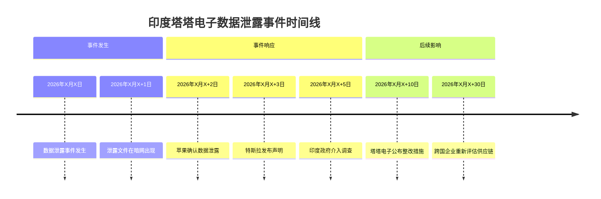
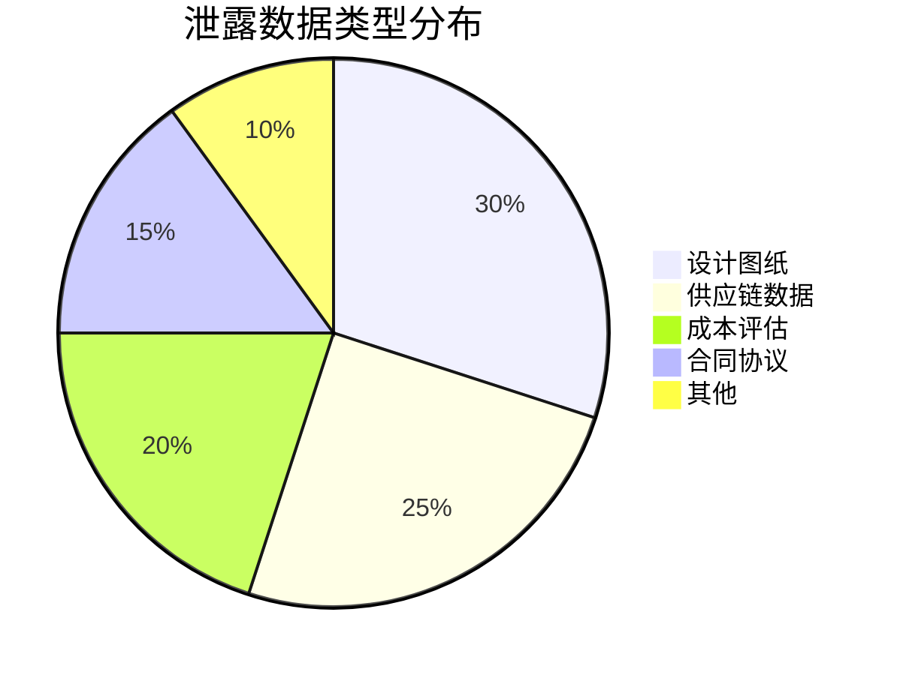

# 事件分析：印度塔塔电子泄密事件详解

## 概述

印度塔塔电子（Tata Electronics）数据泄露事件是近年来全球供应链安全领域的重大事件，涉及苹果、特斯拉等多家跨国企业的敏感信息，对全球供应链格局产生了深远影响。

## 事件时间线



## 涉及企业与泄露内容

### 苹果（Apple）

- **泄露内容**：新产品设计图纸、供应链布局、成本数据
- **影响范围**：iPhone、Mac等产品线
- **潜在损失**：商业机密泄露可能影响产品竞争力

### 特斯拉（Tesla）

- **泄露内容**：印度建厂计划、电池供应链、成本评估
- **影响范围**：特斯拉印度市场战略
- **潜在损失**：市场竞争优势可能受损

### 其他企业

| 企业 | 泄露内容 | 影响程度 |
|------|---------|---------|
| 三星 | 零部件供应计划 | 中等 |
| 富士康 | 代工协议细节 | 中等 |
| 其他供应商 | 合同条款、报价数据 | 低 |

## 泄露规模数据



| 指标 | 数据 |
|------|------|
| 总文件数 | 超过10,000份 |
| 数据总量 | 约1.2TB |
| 涉及企业 | 20+家 |
| 影响国家 | 10+个 |

## 事件背景

### 印度制造业崛起

近年来，印度制造业快速发展，吸引了大量外资企业投资：

- **人口红利**：印度拥有庞大的年轻劳动力资源
- **成本优势**：劳动力成本低于中国约20-30%
- **政策支持**：印度政府推出"印度制造"计划
- **市场潜力**：印度是全球增长最快的消费市场之一

### 塔塔电子的角色

塔塔电子是印度塔塔集团旗下的电子制造子公司，是苹果、特斯拉等企业的重要供应商：

- **苹果供应商**：负责iPhone部分零部件的制造
- **特斯拉合作伙伴**：参与特斯拉印度建厂计划
- **印度制造业标杆**：被视为印度制造业升级的代表

## 历史事故记录

塔塔电子在此次事件之前已有多次安全事故记录：

| 时间 | 事故类型 | 影响 |
|------|---------|------|
| 2025年Q1 | 网络攻击 | 部分系统瘫痪 |
| 2025年Q3 | 内部数据泄露 | 员工信息泄露 |
| 2026年Q1 | 供应链中断 | 影响苹果产品交付 |

## 影响分析

### 对苹果的影响

- **短期影响**：新产品发布计划可能受到影响
- **中期影响**：供应链安全评估和整改需要时间和成本
- **长期影响**：可能重新评估印度供应商的角色

### 对特斯拉的影响

- **短期影响**：印度建厂计划可能推迟
- **中期影响**：成本优势可能被安全风险抵消
- **长期影响**：可能调整全球供应链布局

### 对印度制造业的影响

- **短期影响**：外资信心受挫
- **中期影响**：安全标准提升压力增大
- **长期影响**：可能加速印度制造业的安全能力建设

### 对全球供应链的影响

- **短期影响**：供应链多元化策略重新评估
- **中期影响**：跨国企业可能调整供应商选择标准
- **长期影响**：全球供应链格局可能发生结构性变化

## 成本对比：印度 vs 中国

| 成本要素 | 印度 | 中国 | 差异 |
|---------|------|------|------|
| 劳动力成本 | 低 | 中高 | -20~30% |
| 基础设施 | 中 | 高 | -15% |
| 物流成本 | 中高 | 低 | +20% |
| 安全投入 | 低 | 高 | -30% |
| 综合成本 | 低 | 中 | -10~15% |

## 事件关键事实清单（R阶段）

```markdown
1. 2026年X月X日，印度塔塔电子发生数据泄露事件
2. 泄露文件涉及约1.2TB数据，超过10,000份文件
3. 涉及苹果、特斯拉、三星、富士康等20+家企业
4. 泄露内容包括设计图纸、供应链数据、成本评估、合同协议等
5. 塔塔电子此前已有多次安全事故记录
6. 印度制造业近年来快速发展，成本优势明显
7. 塔塔电子是苹果和特斯拉在印度的重要供应商
8. 印度政府已介入调查
9. 苹果和特斯拉已发布声明
10. 跨国企业正在重新评估印度供应链
```

---

**上一章**：[理论框架](01-theory-framework.md) | **下一章**：[七概念理论应用](03-concepts-application.md)
