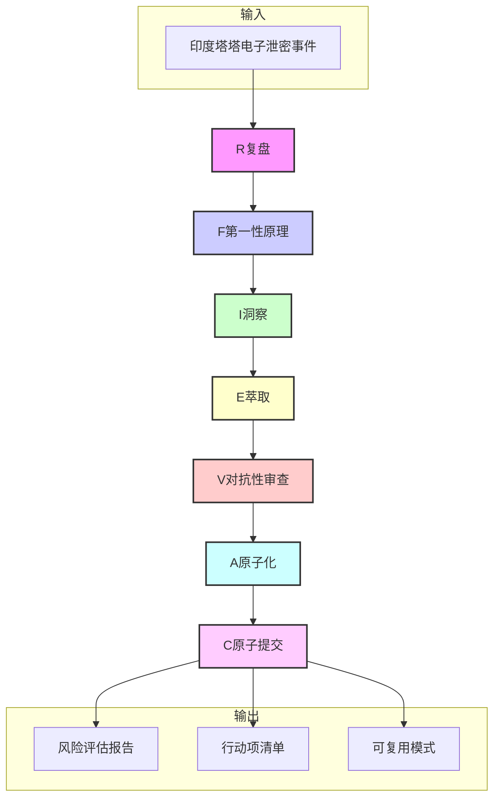

# 七概念理论应用指南

## 概述

本章将七概念理论框架应用于印度塔塔电子泄密事件分析，展示如何从复盘事实收集到原子提交交付的完整分析流程。

## 应用流程图



## R阶段：复盘

### 操作步骤

1. 收集事件的基本信息（时间、地点、涉及方）
2. 整理事件的时间线
3. 汇总相关数据和统计信息
4. 确保所有事实不包含因果词

### 在印度泄密事件中的应用

```markdown
## R阶段：事实收集清单

1. 2026年X月X日，印度塔塔电子发生数据泄露事件
2. 泄露文件涉及约1.2TB数据，超过10,000份文件
3. 涉及苹果、特斯拉、三星、富士康等20+家企业
4. 泄露内容包括设计图纸、供应链数据、成本评估、合同协议等
5. 塔塔电子此前已有多次安全事故记录（2025年Q1网络攻击、2025年Q3内部泄露、2026年Q1供应链中断）
6. 印度制造业近年来快速发展，劳动力成本低于中国约20-30%
7. 塔塔电子是苹果和特斯拉在印度的重要供应商
8. 印度政府已介入调查
9. 苹果和特斯拉已发布声明
10. 跨国企业正在重新评估印度供应链
```

### 质量门检查（G1）

- [x] 事实清单中不包含"因为"、"导致"、"由于"等因果词
- [x] 每条事实都包含时间、地点、人物、数据等要素

---

## F阶段：第一性原理

### 操作步骤

1. 选择一个核心问题进行追问
2. 连续追问5层"为什么"
3. 追溯到根本原因
4. 识别核心假设

### 在印度泄密事件中的应用

```markdown
## F阶段：5Why追问

### 问题：印度塔塔电子为何会发生大规模数据泄露？

**Why 1**：数据为何泄露？→ 员工违规操作，未遵守安全协议
**Why 2**：员工为何违规操作？→ 安全培训不足，安全意识薄弱
**Why 3**：为何培训不足？→ 安全投入优先级低，成本压力大
**Why 4**：为何优先级低？→ 印度制造业成本竞争激烈，企业更关注成本控制
**Why 5**：为何成本竞争激烈？→ 全球制造业产能过剩，印度试图通过低成本吸引外资

### 核心假设识别

1. 印度制造业的成本优势是真实的（劳动力成本低）
2. 安全能力建设需要长期投入
3. 跨国企业对成本的敏感度高于安全风险
```

---

## I阶段：洞察

### 操作步骤

1. 基于事实和5Why分析，构建洞察四元组
2. 确保每个洞察包含陈述、证据、反常识、行动四个要素
3. 验证洞察的可靠性

### 在印度泄密事件中的应用

```markdown
## I阶段：洞察四元组

### 洞察1：印度制造业的成本优势不足以抵消安全风险

- **陈述**：印度制造业的成本优势（劳动力成本低10-15%）不足以抵消其安全风险带来的潜在损失
- **证据**：塔塔电子发生多次数据泄露事件，涉及苹果、特斯拉等多家跨国企业的敏感信息
- **反常识**：低成本不等于低风险，印度制造业的安全能力尚未成熟到能支撑跨国企业的安全要求
- **行动**：企业应重新评估印度供应商的安全能力，将安全评估纳入供应商选择标准

### 洞察2：供应链多元化策略需要重新平衡成本与安全

- **陈述**：单纯追求成本降低的供应链多元化策略存在安全隐患
- **证据**：塔塔电子作为印度制造业的标杆企业，仍无法满足跨国企业的安全要求
- **反常识**：供应链多元化不应仅仅是地理上的分散，更应考虑安全能力的均衡
- **行动**：制定供应商安全评估标准，将安全能力作为供应商选择的核心指标

### 洞察3：新兴市场进入需要建立完整的安全评估体系

- **陈述**：进入印度等新兴制造业市场需要建立完整的安全评估体系
- **证据**：印度制造业快速发展，但安全基础设施和管理水平滞后
- **反常识**：新兴市场的发展速度不等于安全能力的提升速度
- **行动**：建立新兴市场供应商安全评估框架，包含安全能力、历史记录、合规要求等维度
```

### 质量门检查（G2）

- [x] 每个洞察包含陈述、证据、反常识、行动四个要素
- [x] 洞察有事实支撑，不是主观猜测

---

## E阶段：萃取

### 操作步骤

1. 将洞察升华为可复用的模式
2. 确保模式脱离具体场景，具有通用性
3. 包含适用条件和限制说明

### 在印度泄密事件中的应用

```markdown
## E阶段：可复用模式

### 模式1：新兴市场数据安全风险评估框架

**适用场景**：企业进入印度、越南等新兴制造业市场时的供应商安全评估

**核心要素**：
1. 安全能力评估：IT基础设施安全、数据保护措施、安全管理体系
2. 历史事故记录：过去3年的安全事故记录及处理情况
3. 合规要求：是否符合GDPR、ISO 27001等国际安全标准
4. 应急预案：数据泄露事件的应急响应能力

**应用步骤**：
1. 收集供应商的安全能力信息
2. 评估历史事故记录
3. 检查合规认证
4. 审查应急预案
5. 综合评估并给出安全等级

### 模式2：供应链多元化成本-安全平衡模型

**适用场景**：企业制定供应链多元化策略时的成本与安全权衡

**核心要素**：
1. 成本优势：劳动力成本、物流成本、基础设施成本
2. 安全风险：数据安全、供应链中断、合规风险
3. 风险容忍度：企业对安全风险的接受程度

**应用步骤**：
1. 评估各潜在供应商的成本优势
2. 评估各潜在供应商的安全风险
3. 根据风险容忍度制定平衡策略
4. 定期重新评估

### 模式3：供应商安全审计标准流程

**适用场景**：企业对供应商进行定期安全审计

**核心要素**：
1. 审计频率：至少每年一次，高风险供应商每季度一次
2. 审计内容：安全政策、技术措施、员工培训、应急演练
3. 审计标准：符合国际安全标准和企业内部要求
4. 整改跟进：审计发现问题的整改跟踪

**应用步骤**：
1. 制定审计计划
2. 执行审计
3. 出具审计报告
4. 跟踪整改措施
5. 验证整改效果
```

### 质量门检查（G3）

- [x] 模式脱离具体场景，可应用于其他类似场景
- [x] 模式包含适用条件和限制说明

---

## V阶段：对抗性审查

### 操作步骤

1. 假设自己是反对者，质疑分析结论
2. 从多个角度进行审查（成本、时间、可行性、替代方案）
3. 识别潜在的盲点和偏见
4. 根据审查意见修正洞察

### 在印度泄密事件中的应用

```markdown
## V阶段：对抗性审查

### 审查意见1：是否过于低估印度制造业的进步速度？

**审查角度**：时间维度
**审查意见**：印度制造业近年来发展迅速，安全能力可能正在快速提升，当前分析可能过于保守
**修正方案**：增加对印度制造业安全能力发展趋势的分析，评估其未来1-3年的提升潜力

### 审查意见2：是否忽略了中国制造业的成本上升趋势？

**审查角度**：竞争维度
**审查意见**：中国制造业成本正在上升，印度的成本优势可能进一步扩大，安全风险的权重可能需要重新评估
**修正方案**：增加成本趋势分析，评估未来成本差异的变化趋势

### 审查意见3：是否考虑了地缘政治因素的影响？

**审查角度**：宏观维度
**审查意见**：地缘政治因素可能迫使企业进行供应链多元化，安全风险可能需要在更大的战略框架下考虑
**修正方案**：增加地缘政治因素分析，将安全风险置于战略框架下评估

### 审查意见4：是否低估了企业的安全投入能力？

**审查角度**：企业能力维度
**审查意见**：跨国企业可以帮助供应商提升安全能力，安全风险可以通过合作降低
**修正方案**：增加供应商安全能力提升路径分析，评估企业帮助供应商提升安全能力的可行性

### 审查意见5：是否考虑了数据本地化要求的影响？

**审查角度**：合规维度
**审查意见**：印度的数据本地化要求可能影响企业的数据存储策略，安全风险的评估需要考虑合规因素
**修正方案**：增加数据本地化合规分析，评估其对安全风险的影响

### 修正后洞察

经过对抗性审查，核心洞察保持不变，但补充了以下考量：
1. 需关注印度制造业安全能力的发展趋势
2. 需在战略框架下评估安全风险与地缘政治因素的平衡
3. 需考虑企业帮助供应商提升安全能力的可行性
```

---

## A阶段：原子化

### 操作步骤

1. 将分析结论转化为可执行的行动项
2. 确保每个行动项符合原子化标准（单一职责、可验证、有Owner、有时间）
3. 制定行动项清单

### 在印度泄密事件中的应用

```markdown
## A阶段：原子化行动项

| 序号 | 行动项 | Owner | 截止日期 | 状态 | 完成标准 |
|------|--------|-------|---------|------|---------|
| 1 | 2026年8月底前完成所有印度供应商的安全审计 | 供应链安全团队 | 2026-08-31 | □ | 完成审计报告，包含安全等级评估 |
| 2 | 2026年9月前制定供应商安全评估标准 | 供应链管理团队 | 2026-09-30 | □ | 发布正式的供应商安全评估标准文档 |
| 3 | 2026年10月前完成供应链多元化方案 | 战略规划团队 | 2026-10-31 | □ | 完成多元化方案，包含成本-安全平衡分析 |
| 4 | 2026年11月前建立供应商安全能力提升计划 | 供应链安全团队 | 2026-11-30 | □ | 发布供应商安全能力提升计划，包含培训和技术支持方案 |
| 5 | 2026年12月前完成应急预案更新 | 风险管理团队 | 2026-12-31 | □ | 更新应急预案，增加新兴市场场景的应对措施 |
| 6 | 每季度进行供应商安全状况回顾 | 供应链管理团队 | 持续 | □ | 每季度发布供应商安全状况报告 |
| 7 | 每年进行供应链风险全面评估 | 风险管理团队 | 每年12月 | □ | 完成年度供应链风险评估报告 |
| 8 | 建立供应商安全能力跟踪数据库 | IT团队 | 2026-9-30 | □ | 完成数据库建设，实现供应商安全能力的持续跟踪 |
```

### 质量门检查（G4）

- [x] 行动项符合单一职责、可验证、有Owner、有时间标准
- [x] 行动项有明确的完成标准

---

## C阶段：原子提交

### 操作步骤

1. 验证所有行动项的完成情况
2. 评估分析结论的正确性
3. 形成完整的交付物清单

### 在印度泄密事件中的应用

```markdown
## C阶段：交付物清单

| 序号 | 交付物名称 | 描述 | 状态 |
|------|-----------|------|------|
| 1 | 事实清单 | R阶段收集的客观事实列表 | □ |
| 2 | 5Why分析报告 | F阶段的根本原因分析 | □ |
| 3 | 洞察四元组 | I阶段的核心洞察 | □ |
| 4 | 可复用模式 | E阶段萃取的模式（3个） | □ |
| 5 | 对抗性审查报告 | V阶段的审查意见和修正方案 | □ |
| 6 | 原子化行动项 | A阶段的行动项清单（8个） | □ |
| 7 | 风险评估报告 | 完整的供应链风险评估报告 | □ |
| 8 | 供应商安全评估标准 | 正式发布的供应商安全评估标准文档 | □ |
```

---

## 完整应用流程总结

七概念理论框架为供应链风险分析提供了系统化的方法论：

1. **R阶段**：收集客观事实，构建分析基础
2. **F阶段**：追溯根本原因，识别核心假设
3. **I阶段**：发现核心洞察，提供决策依据
4. **E阶段**：萃取可复用模式，实现知识沉淀
5. **V阶段**：检验结论可靠性，避免决策失误
6. **A阶段**：拆分可执行任务，确保落地执行
7. **C阶段**：验证交付成果，完成分析闭环

通过严格遵循这七个步骤，企业可以系统化地分析供应链风险，做出更明智的决策。

---

**上一章**：[事件分析](02-event-analysis.md) | **下一章**：[学习路径与操作指南](04-learning-path.md)
