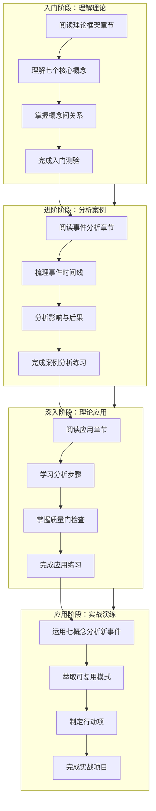

# 学习路径与操作指南

## 概述

本章提供系统化的学习路径和操作指南，帮助读者循序渐进地掌握七概念理论框架及其在供应链风险分析中的应用。

## 学习路径总览

## 入门阶段（1-2小时）

### 学习目标

- 理解七概念理论的七个核心概念
- 掌握概念间的层级关系和顺序原则
- 能够识别每个概念的核心作用

### 学习步骤

**步骤1：阅读理论框架章节**

阅读 [01-theory-framework.md](01-theory-framework.md)，重点关注：
- 七概念速查表
- 每个概念的定义和核心原则
- 概念间关系图
- 质量门定义

**步骤2：制作概念卡片**

为每个概念制作一张卡片，包含：
- 概念名称和缩写
- 定义
- 核心原则
- 在供应链分析中的应用场景

**步骤3：绘制概念关系图**

根据章节内容，手绘或使用工具绘制七概念之间的关系图，标注：
- 层级定位（感知层/认知层/沉淀层/执行层/验证层）
- 概念间的流向关系
- 顺序不可颠倒原则

**步骤4：完成入门测验**

回答以下问题，检验理解程度：

1. 七概念分别是什么？各自的英文和缩写是什么？
2. 每个概念的层级定位是什么？
3. R阶段的核心原则是什么？为什么不能包含因果词？
4. F阶段使用什么方法？为什么需要追问5层？
5. 质量门G1到G4分别检查什么？

### 实践任务

**任务：识别日常生活中的七概念应用**

选择一个日常决策场景（如购买手机、选择餐厅），尝试用七概念框架分析：
- R：收集客观事实（价格、配置、评价等）
- F：追问本质需求（为什么需要这款产品？）
- I：发现洞察（性价比最高的选择？）
- E：萃取模式（购买决策的通用框架）
- V：对抗审查（这个选择有什么风险？）
- A：原子化行动（对比、咨询、购买等步骤）
- C：验证交付（购买后的使用体验）

---

## 进阶阶段（2-3小时）

### 学习目标

- 深入理解印度塔塔电子泄密事件的全貌
- 能够独立分析事件的时间线和影响
- 掌握事实收集的方法和技巧

### 学习步骤

**步骤1：阅读事件分析章节**

阅读 [02-event-analysis.md](02-event-analysis.md)，重点关注：
- 事件时间线
- 涉及企业与泄露内容
- 影响分析
- 事件关键事实清单

**步骤2：梳理事件时间线**

根据章节内容，整理事件的完整时间线，包含：
- 事件发生阶段
- 事件响应阶段
- 后续影响阶段

**步骤3：分析影响网络**

绘制事件的影响网络图，展示：
- 对苹果的影响
- 对特斯拉的影响
- 对印度制造业的影响
- 对全球供应链的影响

**步骤4：完成案例分析练习**

回答以下问题，检验分析能力：

1. 事件的核心数据是什么？（泄露规模、涉及企业等）
2. 塔塔电子的历史事故记录说明了什么？
3. 印度制造业与中国制造业的主要差距是什么？
4. 事件对全球供应链的结构性影响是什么？

### 实践任务

**任务：事实收集练习**

选择一个近期的商业事件，按照R阶段的要求收集20条客观事实，确保：
- 不含因果词
- 包含时间、地点、人物、数据等要素
- 每条事实都是客观陈述

---

## 深入阶段（3-4小时）

### 学习目标

- 掌握七概念理论的完整应用流程
- 能够独立运用七概念分析供应链风险事件
- 掌握质量门检查的方法和标准

### 学习步骤

**步骤1：阅读应用章节**

阅读 [03-concepts-application.md](03-concepts-application.md)，重点关注：
- 每个概念的操作步骤
- 印度泄密事件的具体应用
- 质量门检查要点
- 可复用模式的萃取方法

**步骤2：演练5Why追问**

选择印度泄密事件中的一个问题，进行5Why追问：
- Why 1：表面现象
- Why 2：直接原因
- Why 3：间接原因
- Why 4：根本原因
- Why 5：系统性原因

**步骤3：构建洞察四元组**

基于事件分析，构建一条洞察四元组，包含：
- 陈述：核心结论
- 证据：事实依据
- 反常识：与普遍认知相悖的地方
- 行动：具体行动建议

**步骤4：完成应用练习**

回答以下问题，检验应用能力：

1. 在供应链风险分析中，R阶段的具体操作步骤是什么？
2. 如何进行对抗性审查？审查的维度有哪些？
3. 原子化行动项需要符合哪些标准？
4. 从印度泄密事件中萃取了哪些可复用模式？

### 实践任务

**任务：七概念应用演练**

选择一个你关注的供应链风险事件，运用七概念理论进行完整分析：
1. R：收集20条客观事实
2. F：进行5Why追问
3. I：构建3条洞察四元组
4. E：萃取1-2个可复用模式
5. V：进行对抗性审查（至少5条审查意见）
6. A：制定5个原子化行动项
7. C：形成交付物清单

---

## 应用阶段（4-6小时）

### 学习目标

- 能够独立运用七概念理论分析和解决实际问题
- 能够从事件中萃取可复用的方法论和模式
- 能够制定可执行的行动项并验证交付

### 学习步骤

**步骤1：选择实战项目**

选择一个与供应链风险相关的实战项目，例如：
- 分析公司现有供应链的风险状况
- 评估潜在供应商的安全能力
- 制定供应链多元化策略

**步骤2：运用七概念分析**

按照七概念框架进行完整分析：
1. R：收集客观事实
2. F：追溯本质原因
3. I：发现核心洞察
4. E：萃取可复用模式
5. V：进行对抗性审查
6. A：制定原子化行动项
7. C：验证交付

**步骤3：产出分析报告**

撰写完整的分析报告，包含：
- 事件概述
- 事实清单
- 分析过程
- 核心洞察
- 可复用模式
- 行动项清单
- 交付物清单

**步骤4：验证与优化**

邀请同事或导师进行审查，根据反馈进行优化，确保：
- 事实无因果词（G1）
- 洞察四元组完整（G2）
- 模式可迁移（G3）
- 行动项原子化（G4）

### 实践任务

**任务：供应链风险评估项目**

假设你是某企业的供应链风险管理负责人，运用七概念理论完成以下任务：

1. **现状分析**：收集公司供应链的客观事实（供应商分布、历史事故、成本数据等）
2. **风险识别**：运用第一性原理识别核心风险
3. **洞察发现**：构建3条核心洞察
4. **模式萃取**：萃取2个可复用模式
5. **对抗审查**：邀请同事进行审查，至少5条意见
6. **行动规划**：制定8个原子化行动项
7. **交付验证**：形成完整的风险评估报告

---

## 学习进度跟踪表

| 阶段 | 章节 | 预计时间 | 实践任务 | 完成标记 |
|------|------|----------|---------|----------|
| 入门 | [01-theory-framework.md](01-theory-framework.md) | 1-2小时 | 概念卡片制作 | □ |
| 进阶 | [02-event-analysis.md](02-event-analysis.md) | 2-3小时 | 事实收集练习 | □ |
| 深入 | [03-concepts-application.md](03-concepts-application.md) | 3-4小时 | 七概念应用演练 | □ |
| 应用 | 实战项目 | 4-6小时 | 供应链风险评估项目 | □ |

## 学习资源推荐

| 资源类型 | 推荐资源 | 用途 |
|---------|---------|------|
| 理论基础 | [01-theory-framework.md](01-theory-framework.md) | 七概念理论的详细解释 |
| 案例分析 | [02-event-analysis.md](02-event-analysis.md) | 印度泄密事件详细分析 |
| 实践指南 | [03-concepts-application.md](03-concepts-application.md) | 七概念应用的具体步骤 |
| 参考资料 | [06-resources.md](06-resources.md) | 相关参考资料和术语表 |
| 常见问题 | [05-faq-notes.md](05-faq-notes.md) | 常见问题解答 |

## 学习技巧

### 技巧1：循序渐进，不要跳跃

七概念理论有严格的顺序要求，学习时应按照R→F→I→E→V→A→C的顺序，不要跳过任何一个概念。

### 技巧2：多做练习，注重实践

理论学习后，一定要通过实际案例进行练习，巩固理解和应用能力。

### 技巧3：使用可视化工具

绘制概念关系图、流程图等可视化工具，帮助理解和记忆。

### 技巧4：与人交流，接受反馈

邀请他人进行对抗性审查，接受不同视角的反馈，提升分析质量。

### 技巧5：持续迭代，不断优化

分析不是一次性的过程，应根据新的信息和反馈持续迭代优化。

---

**上一章**：[七概念理论应用指南](03-concepts-application.md) | **下一章**：[常见问题与注意事项](05-faq-notes.md)
