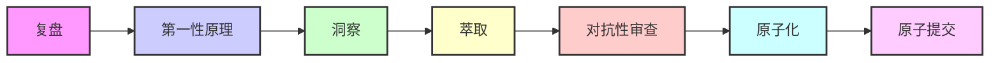

# 常见问题与注意事项

## 概述

本章汇总了学习和应用七概念理论框架过程中常见的问题、误区和注意事项，帮助读者避免错误，提高分析质量。

---

## 常见问题（FAQ）

### Q1：七概念理论的顺序为什么不能颠倒？

**A**：七概念理论有严格的顺序要求（R→F→I→E→V→A→C），这是由其认知逻辑决定的：



- **R阶段**：收集客观事实，是后续分析的基础
- **F阶段**：在事实基础上追溯本质，避免主观臆断
- **I阶段**：基于本质分析发现洞察，是分析的核心产出
- **E阶段**：将洞察升华为可复用模式，实现知识沉淀
- **V阶段**：检验洞察的可靠性，避免决策失误
- **A阶段**：将决策转化为可执行的行动项
- **C阶段**：验证交付，确保行动落地

如果跳过某个阶段或颠倒顺序，会导致分析不完整或结论不可靠。

### Q2：R阶段为什么不能包含因果词？

**A**：R阶段的核心原则是"只收集客观事实，不进行因果推断"，原因如下：

1. **避免偏见**：过早引入因果关系会影响后续分析的客观性
2. **防止遗漏**：因果词可能掩盖其他可能性
3. **保证基础**：事实是后续分析的基石，必须纯粹客观

**错误示例**："因为塔塔电子管理不善，导致数据泄露"

**正确示例**："塔塔电子发生数据泄露事件，涉及1.2TB文件"

### Q3：5Why追问必须追问5层吗？

**A**：5Why是一种方法论，核心目的是追溯到根本原因，不一定严格限定为5层：

- **少于5层**：可能停留在表面原因，未触及根本
- **多于5层**：可能过度分析，陷入细节
- **最佳实践**：追问到"系统性原因"或"可干预的根本原因"为止

**示例**：
```
Why 1：数据为何泄露？→ 因为员工违规操作
Why 2：员工为何违规操作？→ 因为安全培训不足
Why 3：为何培训不足？→ 因为安全投入优先级低
Why 4：为何优先级低？→ 因为成本压力大
Why 5：为何成本压力大？→ 因为印度制造业成本竞争激烈
```

追问到第5层时，已经触及系统性原因，可以停止。

### Q4：洞察和事实有什么区别？

**A**：事实是客观陈述，洞察是基于事实的深度发现：

| 特征 | 事实（R阶段） | 洞察（I阶段） |
|------|-------------|-------------|
| 性质 | 客观陈述 | 主观提炼 |
| 形式 | 描述性语句 | 分析性结论 |
| 来源 | 直接观察/数据 | 基于事实的推理 |
| 价值 | 信息基础 | 决策依据 |
| 示例 | "印度制造成本比中国低20%" | "成本优势不足以抵消安全风险" |

### Q5：对抗性审查和批判性思维有什么区别？

**A**：对抗性审查是一种结构化的方法，与普通批判性思维不同：

| 特征 | 对抗性审查（V阶段） | 批判性思维 |
|------|-------------------|-----------|
| 目的 | 检验洞察的可靠性 | 质疑和评估信息 |
| 方法 | 角色扮演（假设自己是反对者） | 逻辑分析和评估 |
| 输出 | 审查意见和修正方案 | 评估结论 |
| 深度 | 多角度、系统性挑战 | 单一角度质疑 |
| 应用 | 七概念框架中的特定阶段 | 通用思维方式 |

### Q6：原子化行动项的"原子"是什么意思？

**A**：原子化行动项的"原子"指最小可执行单元，符合以下标准：

1. **单一职责**：只做一件事
2. **可验证**：有明确的完成标准
3. **有Owner**：明确责任人
4. **有时间**：明确完成时限
5. **可独立交付**：不需要依赖其他行动项完成

**错误示例**："加强供应链安全"

**正确示例**："2026年8月底前完成所有供应商的安全审计"

### Q7：如何判断模式是否可迁移？

**A**：判断模式可迁移性的标准：

1. **抽象程度**：是否脱离具体场景，具有通用性
2. **适用范围**：是否适用于其他类似场景
3. **可操作性**：是否可以在其他场景中实际应用
4. **验证性**：是否可以通过实践验证其有效性

**示例**："新兴市场数据安全风险评估框架"可以迁移到越南、印尼等其他新兴市场。

### Q8：七概念理论只适用于供应链分析吗？

**A**：不是。七概念理论是一种通用的分析方法论，可应用于多个领域：

| 应用领域 | 具体场景 |
|---------|---------|
| 供应链管理 | 风险分析、供应商评估、策略制定 |
| 产品管理 | 需求分析、竞品分析、产品规划 |
| 项目管理 | 问题分析、风险评估、决策制定 |
| 市场分析 | 趋势分析、竞争对手分析 |
| 个人决策 | 职业规划、投资决策 |

### Q9：如何快速上手七概念理论？

**A**：建议按照以下步骤快速上手：

1. **理解核心概念**：阅读理论框架章节，掌握七个概念的定义和核心原则
2. **学习案例分析**：通过印度泄密事件案例，理解理论如何应用
3. **完成实践任务**：按照学习路径完成各阶段的实践任务
4. **实战演练**：选择一个实际问题进行完整分析
5. **持续迭代**：根据反馈不断优化分析方法

### Q10：应用七概念理论需要多长时间？

**A**：时间取决于分析的深度和复杂度：

| 场景 | 预计时间 |
|------|---------|
| 简单问题分析 | 1-2小时 |
| 中等复杂度分析 | 4-6小时 |
| 复杂项目分析 | 1-2天 |
| 团队协作分析 | 2-3天 |

---

## 注意事项

### 注意事项1：避免过度分析

在F阶段和I阶段，容易陷入过度分析的误区。应遵循以下原则：

- **适可而止**：追溯到根本原因即可，不要无限追问
- **聚焦核心**：关注关键问题，不要被细节干扰
- **保持平衡**：分析深度与实际需求匹配

### 注意事项2：防止主观偏见

在整个分析过程中，主观偏见是最大的敌人：

- **R阶段**：严格区分事实和观点
- **F阶段**：基于事实追问，不预设答案
- **I阶段**：洞察必须有事实支撑
- **V阶段**：主动寻找反面证据

### 注意事项3：重视数据质量

分析的质量取决于数据的质量：

- **事实来源**：优先选择权威、可靠的信息来源
- **数据验证**：对关键数据进行交叉验证
- **时效性**：确保数据是最新的
- **完整性**：尽量收集全面的信息

### 注意事项4：避免模式僵化

萃取模式是为了复用，但不要僵化应用：

- **灵活调整**：根据具体场景调整模式
- **持续优化**：根据实践反馈改进模式
- **避免教条**：模式是参考，不是铁律

### 注意事项5：重视对抗性审查

对抗性审查是提升分析质量的关键步骤：

- **不要跳过**：V阶段是质量门G3的关键，不可省略
- **多角度审查**：从不同视角进行审查
- **认真对待**：对审查意见进行认真分析和修正
- **持续审查**：分析不是一次性的，应持续接受审查

### 注意事项6：确保行动项可执行

原子化行动项必须具备可执行性：

- **明确责任**：每个行动项必须有明确的Owner
- **设定时限**：每个行动项必须有明确的完成时间
- **可验证**：每个行动项必须有明确的完成标准
- **资源保障**：确保行动项所需的资源和支持

### 注意事项7：验证交付的重要性

C阶段是分析闭环的最后一步，不可忽视：

- **验证成果**：检查行动项是否按计划完成
- **评估效果**：评估分析结论是否正确
- **总结经验**：总结成功经验和失败教训
- **持续改进**：基于验证结果优化分析方法

---

## 常见误区

### 误区1：混淆事实和观点

**表现**：在R阶段引入主观判断

**后果**：影响后续分析的客观性

**纠正**：严格区分事实（可验证的陈述）和观点（主观判断）

### 误区2：跳过质量门检查

**表现**：在未通过质量门的情况下进入下一阶段

**后果**：分析不完整，结论不可靠

**纠正**：在进入下一阶段前，必须通过当前阶段的质量门检查

### 误区3：洞察缺乏证据支撑

**表现**：洞察只是主观猜测，没有事实依据

**后果**：决策风险高，可能导致错误判断

**纠正**：每个洞察必须有对应的证据支持（洞察四元组）

### 误区4：模式过于具体

**表现**：模式只适用于特定场景，无法迁移

**后果**：无法实现知识复用

**纠正**：萃取模式时应提升抽象程度，使其具有通用性

### 误区5：行动项过于模糊

**表现**：行动项缺乏具体的执行标准

**后果**：无法验证完成情况，难以落地

**纠正**：确保每个行动项符合原子化标准（单一职责、可验证、有Owner、有时间）

### 误区6：忽视对抗性审查

**表现**：认为自己的分析已经很完美，不需要审查

**后果**：可能遗漏重要风险和问题

**纠正**：主动邀请他人进行对抗性审查，接受不同视角的反馈

---

## 问题排查指南

### 问题：分析结论不可靠

**可能原因**：
1. R阶段事实收集不完整或不准确
2. F阶段追问不够深入
3. I阶段洞察缺乏证据支撑
4. V阶段对抗性审查不充分

**排查步骤**：
1. 检查事实清单是否包含因果词（G1）
2. 检查5Why追问是否触及根本原因
3. 检查每个洞察是否有完整的四元组（G2）
4. 检查对抗性审查意见数量和质量（G3）

### 问题：行动项无法落地

**可能原因**：
1. 行动项不符合原子化标准
2. 缺乏明确的责任人
3. 缺乏必要的资源支持
4. 时间安排不合理

**排查步骤**：
1. 检查行动项是否符合原子化标准（G4）
2. 检查每个行动项是否有明确的Owner
3. 检查资源需求是否已确认
4. 检查时间安排是否合理可行

### 问题：模式无法迁移

**可能原因**：
1. 模式抽象程度不够
2. 模式描述过于具体
3. 缺乏适用条件说明

**排查步骤**：
1. 检查模式是否脱离具体场景
2. 检查模式是否可以应用于其他类似场景
3. 检查模式是否包含适用条件和限制说明（G3）

---

**上一章**：[学习路径与操作指南](04-learning-path.md) | **下一章**：[参考资料与附录](06-resources.md)
