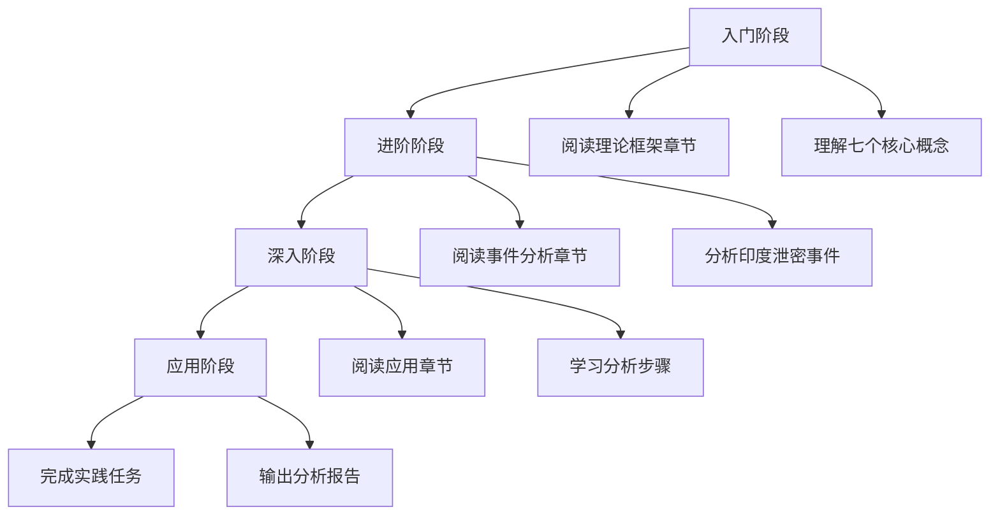
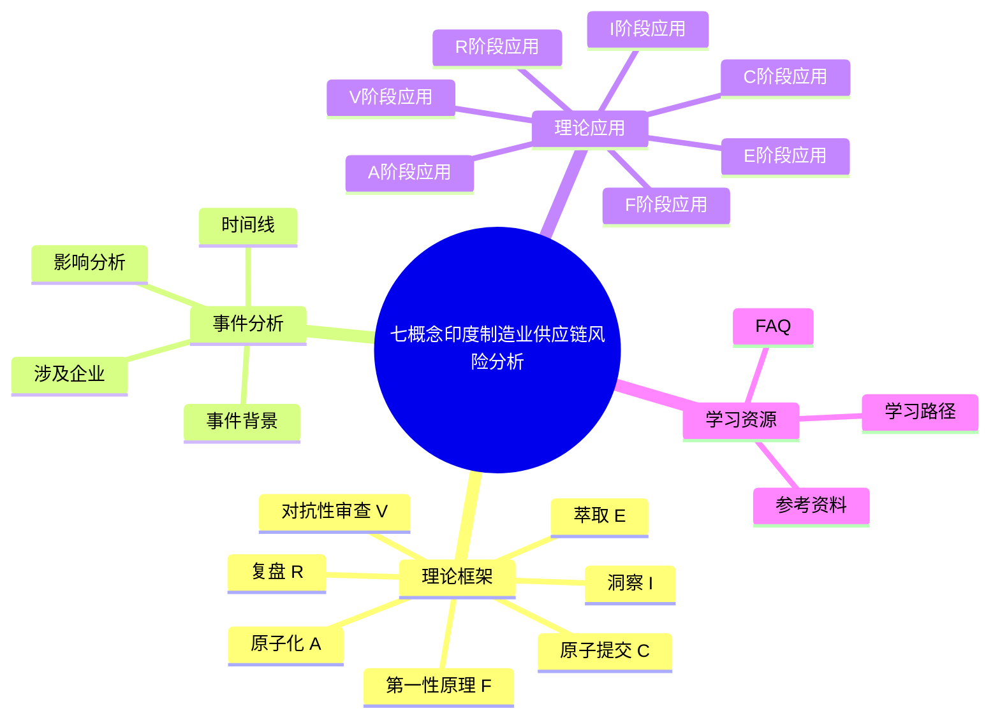

# 七概念印度制造业供应链风险分析教程

## 教程概述

本教程基于"七概念"理论框架，深入分析印度塔塔电子数据泄露事件，帮助读者掌握供应链风险分析的方法论。

## 教程目标

1. **理解七概念理论**：掌握复盘（R）、第一性原理（F）、洞察（I）、萃取（E）、对抗性审查（V）、原子化（A）、原子提交（C）七个核心概念
2. **分析真实案例**：深入理解印度塔塔电子泄密事件的背景、过程和影响
3. **应用方法论**：学会运用七概念理论框架分析供应链风险事件
4. **构建思维模型**：形成系统化的分析思维，提升决策质量

## 适用人群

| 人群 | 收益 |
|------|------|
| 供应链管理人员 | 掌握风险分析方法，提升供应链安全管理能力 |
| 企业决策者 | 学会系统化分析，做出更明智的战略决策 |
| 商业分析师 | 掌握七概念理论，提升分析深度和质量 |
| 学生/研究者 | 理解理论框架在实际案例中的应用 |
| 对供应链风险感兴趣的读者 | 了解印度制造业崛起背后的安全挑战 |

## 学习路径

## 导航表

| 章节 | 标题 | 说明 |
|------|------|------|
| [01](01-theory-framework.md) | 理论框架 | 七概念理论详解（R/F/I/E/V/A/C） |
| [02](02-event-analysis.md) | 事件分析 | 印度塔塔电子泄密事件详解 |
| [03](03-concepts-application.md) | 理论应用 | 七概念理论在事件分析中的应用 |
| [04](04-learning-path.md) | 学习路径 | 分步骤的学习指南和操作手册 |
| [05](05-faq-notes.md) | FAQ | 常见问题解答与注意事项 |
| [06](06-resources.md) | 参考资料 | 参考资料、术语表与附录 |

## 教程概览

---

**下一章**：[理论框架](01-theory-framework.md)
