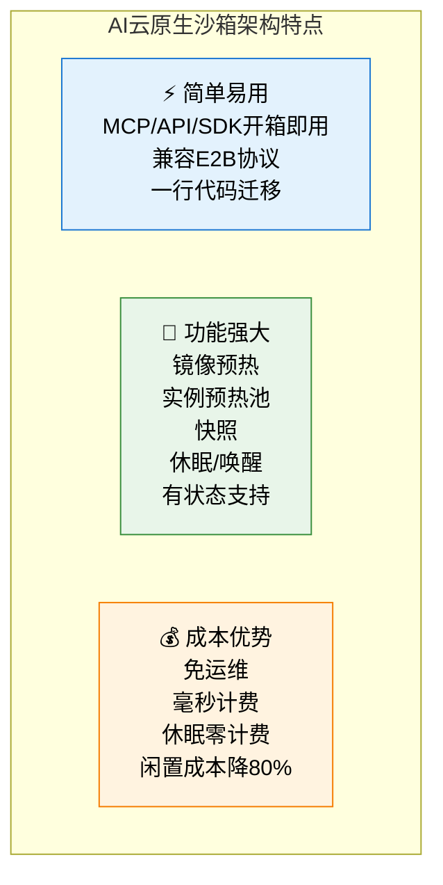
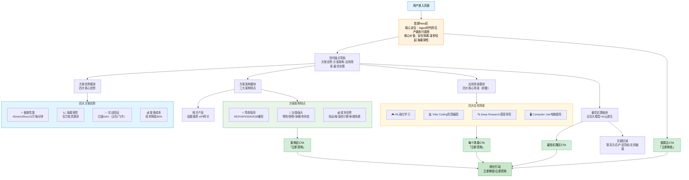

# 火山引擎AI云原生沙箱解决方案深度分析

> **产品介绍页**: https://www.volcengine.com/solutions/ai-cloud-native-sandbox
> **产品定位**: Agent时代的生产级执行底座——面向Agent全场景，提供安全隔离、毫秒拉起、海量弹性的云端沙箱环境
> **核心验证**: 经豆包、飞书等产品亿级DAU业务规模化验证

---

## 📋 目录导航

- [一、产品概述与定位](#一产品概述与定位)
- [二、核心技术能力深度解析](#二核心技术能力深度解析)
- [三、技术架构与实现路径](#三技术架构与实现路径)
- [四、典型应用场景详解](#四典型应用场景详解)
- [五、竞争优势与差异化分析](#五竞争优势与差异化分析)
- [六、业务价值与市场机会分析](#六业务价值与市场机会分析)
- [七、网页信息架构与内容组织分析](#七网页信息架构与内容组织分析)
- [八、技术见解与行业发展趋势](#八技术见解与行业发展趋势)
- [九、专业术语表](#九专业术语表)
- [十、相关资源链接](#十相关资源链接)
- [十一、开放问题](#十一开放问题)

---

## 一、产品概述与定位

### 1.1 产品定位："Agent时代的生产级执行底座"

AI云原生沙箱定位为**Agent时代的生产级执行底座**，其核心内涵包含三个维度：

| 维度 | 内涵说明 |
|------|----------|
| **Agent时代** | 明确产品面向AI Agent这一新兴场景，而非传统云计算场景，回应大模型时代代码执行、工具调用、安全隔离的新需求 |
| **生产级** | 强调不是玩具级解决方案，而是经过亿级DAU验证、可承载大规模业务的稳定可靠基础设施 |
| **执行底座** | 定位为AI应用栈的底层基础设施，向上为各类AI应用提供安全可靠的代码执行环境，类似操作系统中的"进程执行层" |

### 1.2 核心价值支柱

产品价值主张可拆解为四大支柱，对应方案四大优势：

| 价值支柱 | 核心内涵 | 关键指标 |
|---------|---------|---------|
| ⚡ **极致性能** | 毫秒级启动速度，应对Agent流量洪峰 | 预热40ms、冷启动100ms、12万沙箱/分钟拉起 |
| 📈 **海量弹性** | 百万核资源池按需扩缩，承载大规模并发 | 百万核资源池、稳定承载大规模并发 |
| ✅ **实战验证** | 字节内部亿级DAU业务打磨，生产可用 | 豆包、飞书验证、支撑AI应用快速交付 |
| 💰 **普惠成本** | 按需启停、毫秒计费，闲置零成本 | 整体成本降低80%、闲置成本降低80% |

### 1.3 目标客户画像

基于产品特性和应用场景推断，目标客户包括：

| 客户类型 | 典型场景 | 核心诉求 |
|---------|---------|---------|
| **AI Agent平台/框架厂商** | 为Agent提供代码执行、工具调用环境 | 安全隔离、快速启动、弹性伸缩、低成本 |
| **大模型应用开发者** | 代码解释器、在线编程、数据分析 | 易集成、多语言支持、稳定可靠 |
| **AI创业公司** | RL训练、Vibe Coding、Deep Research | 免运维、按需付费、快速上线 |
| **在线教育/编程平台** | 在线编程环境、代码评测 | 隔离性、并发能力、多语言支持 |
| **企业IT部门** | 不可信代码执行、数据处理沙箱 | 安全合规、审计能力、可管控 |
| **云原生/Serverless开发者** | 函数计算、事件驱动执行 | 冷启动快、成本低、与现有云服务集成 |

### 1.4 与传统方案对比：为什么需要AI云原生沙箱？

| 对比维度 | 传统虚拟机(VM) | 传统Docker容器 | 开源沙箱方案 | 火山引擎AI云原生沙箱 |
|---------|--------------|---------------|-------------|-------------------|
| **冷启动时间** | 秒级~分钟级 | 数百毫秒~秒级 | 数百毫秒 | **100ms（冷启动）、40ms（预热）** |
| **隔离强度** | 强（硬件级） | 中（内核共享） | 中~强（因方案而异） | **强（推测MicroVM级）** |
| **弹性能力** | 弱（扩容慢） | 中 | 弱（需自建集群） | **12万/分钟拉起、百万核池** |
| **运维成本** | 高（需管理OS） | 中（需管理K8s） | 极高（需自研运维） | **免运维、全托管** |
| **计费粒度** | 按小时/分钟 | 按分钟/秒 | 自建无计费 | **毫秒级精准计费** |
| **闲置成本** | 100%（运行即付费） | 高（预留资源付费） | 100%（服务器一直运行） | **休眠零计费、闲置成本降80%** |
| **生产验证** | 成熟但非AI场景优化 | 成熟但冷启动问题 | 多为实验室/小规模 | **亿级DAU（豆包/飞书）** |
| **AI场景适配** | ❌ 启动太慢 | ⚠️ 隔离不足+启动偏慢 | ⚠️ 需大量自研 | ✅ 专为AI Agent场景设计 |

**核心洞察**：传统云计算基础设施是为"长运行服务"设计的（如Web服务、数据库，运行数小时/数天），而AI Agent场景需要"短生命周期、高并发、强隔离、快速启动"的执行环境（运行数秒/数分钟，瞬时拉起成千上万个实例）——这是两种完全不同的工作负载特征，传统方案无法高效满足。

---

## 二、核心技术能力深度解析

### 2.1 优势一：⚡ 极致性能——毫秒级启动应对流量洪峰

**官方表述**：预热时间40ms、冷启动时间100ms、12万沙箱/分钟级拉起，从容应对Agent流量洪峰

**性能指标深度解析**：

| 指标项 | 数值 | 对比基准 | 技术意义 |
|-------|------|---------|---------|
| **预热时间** | 40ms | 传统容器冷启动约500-2000ms | 预热池中的实例可在40ms内就绪，用户几乎无感知 |
| **冷启动时间** | 100ms | 传统VM冷启动约30-60秒 | 即使无预热，冷启动也仅需100ms，达到"即时响应"级别 |
| **拉起能力** | 12万沙箱/分钟 | 传统K8s集群约数千Pod/分钟 | 每分钟可拉起12万个沙箱实例，足以应对AI应用的突发流量洪峰 |

**性能背后的技术逻辑推断**：

要实现40ms预热、100ms冷启动的性能，需要多层技术优化：

```
┌─────────────────────────────────────────────────────────────────┐
│                      极致性能技术栈（推断）                        │
├─────────────────────────────────────────────────────────────────┤
│  1. MicroVM轻量化：使用精简版虚拟机（如Firecracker风格），         │
│     而非完整VM，减少启动时需要加载的内核和设备数量                   │
├─────────────────────────────────────────────────────────────────┤
│  2. 实例预热池：维护预热状态的实例池，用户请求到来时直接分配，       │
│     省去初始化时间（40ms预热即从此来）                              │
├─────────────────────────────────────────────────────────────────┤
│  3. 镜像预热：常用镜像提前加载和缓存，避免拉起时拉取镜像            │
├─────────────────────────────────────────────────────────────────┤
│  4. 快照/恢复：利用快照技术快速恢复到某个预置状态，而非从零启动      │
├─────────────────────────────────────────────────────────────────┤
│  5. 内核优化：定制精简内核，去掉不必要的模块和驱动                 │
├─────────────────────────────────────────────────────────────────┤
│  6. 调度优化：分布式调度器+资源预分配，避免调度瓶颈                │
└─────────────────────────────────────────────────────────────────┘
```

**性能的业务价值**：

为什么毫秒级启动对AI场景至关重要？

1. **用户体验**：代码解释器、在线编程场景下，用户点击"运行"后100ms内启动环境，等待时间远小于传统方案，体验流畅
2. **并发成本**：RL强化学习等场景需要瞬时启动数万个并发环境，启动越快，整体训练迭代周期越短
3. **资源利用率**：快速启停意味着可以"用的时候才启动，用完立刻释放"，不需要为了"避免启动慢"而长时间运行实例
4. **流量应对**：AI应用流量波动极大（如大模型回复触发工具调用是突发的），12万/分钟的拉起能力可从容应对洪峰

### 2.2 优势二：📈 海量弹性——百万核资源池按需伸缩

**官方表述**：百万核资源池按需弹性扩缩，稳定承载大规模并发，满足Agent规模化执行需求

**弹性能力矩阵**：

| 弹性维度 | 能力说明 | 业务价值 |
|---------|---------|---------|
| **资源池规模** | 百万核级别的共享资源池 | 超大容量，可支撑超大规模并发场景 |
| **扩缩速度** | 分钟级12万实例拉起 | 快速响应流量变化，不用提前几小时扩容 |
| **按需分配** | 根据实际负载自动扩缩 | 无需提前预估容量、预留资源 |
| **稳定承载** | 大规模并发下性能稳定 | 不因为实例多而出现调度排队、启动变慢 |

**AI场景弹性需求的特殊性**：

AI Agent场景的弹性需求与传统Web服务有本质区别：

| 弹性特征 | 传统Web服务 | AI Agent场景 |
|---------|------------|-------------|
| **流量模式** | 相对平稳，有早晚高峰 | 极端突发，一次交互可能触发N个工具调用 |
| **实例生命周期** | 长（数小时~数天） | 极短（数秒~数分钟） |
| **并发波动** | 数倍波动 | 数十~数百倍瞬时波动 |
| **单请求资源** | 相对固定 | 差异极大（简单代码vs复杂RL环境） |

百万核资源池+12万/分钟拉起，正是为了应对AI场景这种"极端突发、短生命周期、高并发"的弹性需求。

### 2.3 优势三：✅ 实战验证——亿级DAU业务打磨

**官方表述**：经豆包、飞书等产品亿级DAU场景验证，支撑AI应用快速交付与稳定演进

**实战验证的分量**：

| 验证维度 | 具体内容 | 重要性 |
|---------|---------|-------|
| **业务规模** | 亿级DAU（日活跃用户） | 说明系统在超大规模流量下经过检验，不是实验室产品 |
| **业务类型** | 豆包（大模型对话）、飞书（企业协作） | 覆盖C端大流量和B端企业级场景，场景通用性强 |
| **验证时长** | 字节内部业务长期运行 | 不是POC或短期测试，是长期生产验证 |
| **验证深度** | 支撑AI应用"快速交付与稳定演进" | 不仅能跑，还能支撑业务迭代和持续演进 |

**为什么"字节自用先行"是重要背书？**

火山引擎的很多产品都是"字节内部先用→打磨成熟→对外输出"的路径（如火山引擎的很多产品都源自字节内部基础设施）：

1. **内部场景更苛刻**：豆包、飞书这种亿级DAU产品对性能、稳定性、成本的要求远高于大多数外部客户
2. **大规模问题暴露充分**：亿级用户下会遇到各种极端case、边缘场景、性能瓶颈，这些问题小规模测试遇不到
3. **迭代速度快**：内部业务倒逼基础设施快速迭代优化，产品成熟度高
4. **技术经过实战检验**：不是PPT技术，是真正扛过流量洪峰的技术

**对比**：很多开源或创业公司的沙箱方案，往往只在小规模场景测试过，真正到大规模生产环境容易出各种问题（调度瓶颈、资源泄漏、隔离逃逸等）。

### 2.4 优势四：💰 普惠成本——毫秒计费，闲置零成本

**官方表述**：按需启停、毫秒级精准计费，闲置资源无需付费，助力业务整体成本降低达80%

**成本优势拆解**：

| 成本优化机制 | 具体说明 | 节省比例 |
|------------|---------|---------|
| **毫秒级精准计费** | 按实际执行时间计费，不是按分钟/小时 | 避免"用了1秒付1分钟钱"的浪费 |
| **按需启停** | 用的时候启动，用完立刻释放 | 不用为空闲时间付费 |
| **休眠零计费** | 实例休眠期间不收费 | 有状态场景可休眠保留状态，同时不付费 |
| **闲置成本降低** | 综合以上机制 | 可达80% |
| **整体成本降低** | 相比传统方案整体TCO | 达80% |

**成本对比测算（示例场景）**：

假设一个在线编程场景，日均10万次代码执行，每次执行平均5秒：

| 方案 | 计算方式 | 估算成本 | 成本倍数 |
|-----|---------|---------|---------|
| **传统VM** | 24小时运行N台VM预留 | 极高（需预留峰值容量） | ~10x |
| **传统容器/K8s** | 按节点预留+自动扩缩（按分钟计费） | 高（分钟计费+预留节点） | ~5x |
| **自建开源沙箱** | 服务器成本+运维成本+闲置成本 | 中~高（服务器24小时运行） | ~3-5x |
| **火山引擎AI沙箱** | 10万×5秒=50万秒≈139小时实际执行时间，毫秒计费 | **低** | **1x（基准）** |

**80%成本降低的商业逻辑**：

传统云计算的计费模型是"资源占用计费"——你占用了资源（VM/容器），不管用不用都要付钱；而AI沙箱是"执行计费"——只有真正在执行代码的时候才计费，休眠、等待、闲置都不付费。

这对于**短生命周期、突发流量、低谷明显**的AI Agent场景，成本优势是数量级的。

---

## 三、技术架构与实现路径

### 3.1 架构特点：简单易用、功能强大、成本优势

从页面信息看，AI云原生沙箱的架构设计围绕三大特点：



### 3.2 核心功能模块解析

#### 3.2.1 简单易用层：降低接入门槛

| 功能特性 | 具体说明 | 开发者价值 |
|---------|---------|-----------|
| **MCP支持** | 支持MCP（Model Context Protocol）协议 | 可直接接入MCP生态的AI Agent框架/工具，无需额外适配 |
| **API/SDK** | 提供标准API和多语言SDK | 可通过API调用或SDK集成，适配各种技术栈 |
| **多模板开箱即用** | 预置多种运行环境模板 | 不用自己构建镜像，常用环境（Python/Node.js/Go等）直接可用 |
| **兼容E2B协议** | 兼容E2B（E2B是知名AI沙箱服务商）协议 | 现有基于E2B开发的应用可一行代码迁移，避免锁定 |
| **一行代码迁移** | 极简迁移路径 | 降低从其他方案迁移的成本，存量应用快速上云 |

**E2B兼容的战略意义**：

E2B（e2b.dev）是AI沙箱领域的先行者，在AI开发者群体中有一定影响力。兼容E2B协议意味着：

1. **生态复用**：所有基于E2B SDK开发的应用可以无缝切换到火山引擎
2. **降低迁移成本**：用户不用重写代码，换个endpoint就行
3. **借势生态**：不需要从零教育市场，直接承接E2B培育的用户习惯
4. **开放姿态**：表明不做封闭生态，愿意兼容事实标准

#### 3.2.2 功能强大层：满足复杂场景需求

| 功能特性 | 技术说明 | 应用场景 |
|---------|---------|---------|
| **镜像预热** | 常用镜像提前缓存到计算节点 | 避免冷启动时拉取镜像，加速实例启动 |
| **实例预热池** | 维护已初始化完成的实例池 | 请求到来直接分配，实现40ms级预热启动 |
| **快照（Snapshot）** | 可将运行中实例状态保存为快照 | 快速恢复到预置环境、RL场景快速重置状态、有状态应用快速启动 |
| **休眠/唤醒** | 实例可暂停休眠，需要时快速唤醒 | 保留状态的同时节省成本、长会话场景无需重新初始化 |
| **有状态支持** | 支持持久化存储、状态保留 | 不是纯无状态函数，可支持需要状态的复杂场景（如长时运行的开发环境） |

**快照+休眠/唤醒：有状态Serverless的关键**

传统Serverless函数（如AWS Lambda）是纯无状态的，执行完就销毁，这对于AI场景是不够的：
- Vibe Coding场景：用户写代码需要一个持久的开发环境，不能每次运行都重新安装依赖
- RL场景：需要快速重置到初始状态开始下一轮episode
- Deep Research场景：长时研究任务需要保留中间状态

快照+休眠/唤醒正是解决这个问题：既保留了状态，又在休眠时不收费，完美平衡了"有状态需求"和"成本控制"。

#### 3.2.3 成本优势层：极致成本控制

（在2.4节已详细分析，此处补充架构层面的成本设计）

| 架构设计 | 成本逻辑 |
|---------|---------|
| **免运维** | 全托管服务，用户不需要管理服务器、K8s集群、操作系统，运维人力成本为0 |
| **多租户共享** | 百万核资源池是多租户共享的，通过分时复用提升资源利用率 |
| **快速回收** | 实例用完立刻回收资源给其他租户，资源周转率高 |
| **休眠不计费** | 从计费系统层面设计休眠状态零费用，鼓励用户用休眠替代长运行 |
| **分层调度** | 预热池+热池+冷池分层调度，平衡性能和成本 |

### 3.3 相关产品生态

AI云原生沙箱不是孤立产品，而是火山引擎AI云生态的一部分：

| 相关产品 | 与沙箱的关系 | 协同场景 |
|---------|------------|---------|
| **函数服务（veFaaS）** | 页面直接展示的相关产品 | 函数服务提供事件驱动的函数计算，沙箱提供更强隔离的代码执行环境，二者互补 |
| **API网关** | 页面直接展示的相关产品 | API网关作为流量入口，可将请求路由到沙箱执行，提供鉴权、限流、监控等能力 |
| **AgentKit** | 顶部导航快捷入口 | Agent开发工具包，沙箱作为Agent的执行环境底座 |
| **火山方舟** | 顶部导航快捷入口 | 大模型服务平台，方舟上的大模型应用可调用沙箱执行代码/工具 |
| **豆包语音** | 顶部导航快捷入口 | 语音能力与沙箱结合可实现语音交互的代码执行等场景 |
| **HiAgent** | （推测）同生态产品 | HiAgent智能体平台可使用沙箱作为Agent的安全执行环境 |
| **节省计划** | 顶部导航快捷入口 | 用户可购买节省计划进一步降低沙箱使用成本 |

**生态协同逻辑**：

火山引擎正在打造"豆包大模型 + AI云原生 = 智能时代新引擎"的组合（页面最佳实践板块slogan）：
- **豆包大模型**：提供"大脑"（推理、理解、决策能力）
- **AI云原生沙箱**：提供"手脚"（安全执行代码、操作环境的能力）
- **其他云服务**（函数、网关、存储等）：提供配套支撑

这是一个完整的AI应用技术栈，沙箱是其中连接"模型决策"和"实际执行"的关键环节。

### 3.4 技术栈推测（基于公开信息分析）

> ⚠️ **注意**：以下为基于行业技术趋势和公开性能指标的合理推测，不代表火山引擎官方实现。

| 技术层级 | 推测技术选型 | 推测依据 |
|---------|------------|---------|
| **隔离技术** | MicroVM（基于Firecracker或自研类似技术） | 40ms/100ms启动+强隔离是MicroVM的典型特征，传统容器和gVisor都难以同时达到这个启动速度和隔离性；字节在gVisor/Kata/Firecracker方面都有技术积累 |
| **运行时** | 轻量级容器运行时+精简内核 | 定制精简内核（去掉不需要的驱动/模块）才能实现毫秒启动 |
| **调度系统** | 分布式大规模集群调度器（类似K8s但深度优化） | 12万/分钟拉起能力需要调度器极高的吞吐量，原生K8s调度器难以达到，需要自研深度优化 |
| **镜像管理** | 按需加载+镜像分层缓存+P2P分发 | 百万核规模下镜像拉取是瓶颈，需要特殊优化 |
| **存储层** | 分层存储+快照支持+持久化卷 | 快照和有状态支持需要存储层深度配合 |
| **网络** | 轻量级网络虚拟化+快速网络栈 | MicroVM需要配套的轻量级网络方案，传统OVS/bridge太重 |
| **计费系统** | 高精度毫秒级计量+实时计费 | 毫秒计费需要高精度的用量采集和计费系统 |
| **控制面** | 多租户管理+API/SDK/MCP/E2B多协议接入 | 兼容多协议需要控制面做协议适配和转换 |

**隔离技术选型分析**：

为什么推测是MicroVM而非其他？

| 隔离方案 | 启动速度 | 隔离强度 | 成熟度 | 适用性 |
|---------|---------|---------|-------|-------|
| **传统VM（KVM/QEMU）** | 慢（秒级） | 很强 | 高 | ❌ 启动太慢 |
| **Docker容器（runc）** | 快（百毫秒级） | 弱（内核共享） | 高 | ❌ 隔离性不足，多租户风险大 |
| **gVisor（用户态内核）** | 中（数百毫秒） | 中~强 | 中 | ⚠️ 性能有损耗，系统调用兼容性问题 |
| **Kata Containers** | 中~慢 | 强 | 中 | ⚠️ 相对偏重，启动速度不够极致 |
| **Firecracker MicroVM** | 极快（~125ms官方数据） | 强 | 中高 | ✅ 启动快+隔离强，符合指标 |
| **Wasm（WebAssembly）** | 极快（毫秒级） | 强 | 中 | ⚠️ 需要Wasm编译，现有应用迁移成本高 |

火山引擎100ms冷启动甚至比Firecracker官方的125ms还快，说明可能做了进一步优化，或在Firecracker基础上有自研改进。

---

## 四、典型应用场景详解

页面展示了4个核心应用场景，覆盖AI Agent最主流的落地场景。

### 4.1 场景一：🎮 RL强化学习——数以万计并发沙箱运行评估

**场景描述**：支持数以万计的并发沙箱来运行和评估奖励函数。

| 维度 | 详细说明 |
|-----|---------|
| **场景痛点** | 强化学习训练需要与环境大量交互，每次episode都需要一个干净、隔离的环境；传统方案启动慢、并发上不去，训练迭代周期长；环境隔离不好会导致训练不稳定 |
| **核心需求** | 极高并发（数万同时运行）、极快重置（快速开始下一轮）、强隔离（环境互不干扰）、低成本（训练任务运行时间长，成本敏感） |
| **沙箱价值** | 12万/分钟拉起支撑数万并发、快照快速重置环境、强隔离保证训练稳定性、毫秒计费+休眠大幅降低训练成本 |
| **典型用户** | AI研究机构、大模型公司（RLHF/RLAIF训练）、游戏AI公司、机器人公司、自动驾驶仿真 |

**RL场景对沙箱的核心要求**：

RL场景是沙箱性能的"试金石"：
1. **并发量极大**：PPO等算法需要同时收集成千上万条轨迹，需要数万并发环境
2. **环境重置极频繁**：每个episode结束都要重置环境，重置速度直接影响训练吞吐量
3. **环境必须隔离**：不同rollout worker的环境不能互相干扰，否则训练数据会被污染
4. **成本敏感**：RL训练通常需要运行数天甚至数周，成本是重要考量
5. **快照至关重要**：很多场景需要从固定初始状态开始，快照可以秒级恢复

### 4.2 场景二：💻 Vibe Coding氛围编程——AI生成代码的运行时

**场景描述**：使用沙箱作为AI生成的应用程序的代码运行时。

| 维度 | 详细说明 |
|-----|---------|
| **场景痛点** | Vibe Coding/AI编程场景下，AI会实时生成代码，需要即时运行反馈；用户本地环境配置复杂、依赖冲突多；在本地运行AI生成的代码有安全风险（恶意代码、删文件等） |
| **核心需求** | 快速启动（用户等待时间短）、强隔离（代码不能访问用户本地数据）、多语言支持（Python/JS/TS/Go等）、有状态环境（保留依赖和文件）、预装常用环境 |
| **沙箱价值** | 100ms冷启动即时运行、云端隔离环境安全无风险、多模板开箱即用、快照/休眠保留开发环境状态 |
| **典型用户** | AI编程工具（Cursor/GitHub Copilot Workspace类）、在线IDE、代码生成平台、AI编程助手 |

**Vibe Coding场景深度解析**：

"Vibe Coding"（氛围编程）是AI时代的新编程范式——开发者用自然语言描述需求，AI生成代码，开发者专注于创意和"感觉"而非语法细节。这种模式下：

1. **代码执行频率极高**：每改几行代码就要运行看效果
2. **环境一致性要求高**：AI生成的代码必须在一个干净、可预测的环境中运行
3. **安全风险大**：AI生成的代码可能有bug甚至恶意行为（特别是从公开网页/数据训练的模型）
4. **体验要求流畅**：运行按钮按下后必须立刻有反馈，不能让用户等几秒加载环境

云端沙箱正是Vibe Coding的理想运行时——安全、快速、一致、即开即用。

### 4.3 场景三：🔍 Deep Research深度研究——扩展工具的运行环境

**场景描述**：为深度研究提供扩展工具的运行环境。

| 维度 | 详细说明 |
|-----|---------|
| **场景痛点** | Deep Research类AI Agent（如Perplexity、各类研究助手）需要调用各种工具完成复杂研究任务——网页爬取、数据分析、文件处理、可视化、计算等；工具运行需要依赖环境，且不能影响主服务安全；工具调用可能是并发的、突发的 |
| **核心需求** | 安全的工具执行环境、按需启动、可安装任意依赖、可访问网络/文件（受控）、并发执行多个工具、低成本 |
| **沙箱价值** | 每个工具调用在独立沙箱中运行互不干扰、强隔离防止工具滥用、按需启动不用预留资源、毫秒计费降低成本 |
| **典型用户** | Deep Research产品、AI搜索引擎、数据分析助手、企业知识助手、自动化研究工具 |

**Deep Research场景的技术挑战**：

Deep Research Agent的工作流通常是：
1. 理解用户研究问题
2. 拆解成多个子任务
3. **并发调用多个工具**（搜索、爬取、数据分析、计算...）
4. 整合结果生成报告

每个工具调用都需要一个执行环境：
- 爬虫需要运行Python+requests/beautifulsoup
- 数据分析需要运行pandas/numpy
- 可视化需要matplotlib/plotly
- 可能还要运行自定义脚本

沙箱让每个工具都在独立、安全、隔离的环境中运行，互不影响，且不用的时候不占资源。

### 4.4 场景四：🖥️ Computer Use电脑使用——LLM的云上虚拟计算机

**场景描述**：使用桌面沙箱为LLM提供安全的云上虚拟计算机。

| 维度 | 详细说明 |
|-----|---------|
| **场景痛点** | Computer Use（电脑使用）是大模型最前沿的能力之一——LLM可以像人一样操作计算机：点击、输入、浏览、使用软件；但在本地运行有极大安全风险（LLM可能误操作删文件、访问敏感数据、执行危险操作）；需要一个隔离的虚拟桌面环境 |
| **核心需求** | 完整的桌面环境（GUI）、强隔离（完全与宿主机隔离）、可快照重置（出问题一键恢复）、可访问网络（受控）、支持VNC/RDP远程访问、持久化存储 |
| **沙箱价值** | 桌面沙箱提供完整虚拟计算机、强隔离保证宿主机安全、快照一键重置环境、休眠保留桌面状态 |
| **典型用户** | Computer Use Agent、浏览器自动化、RPA+AI、GUI测试、安全研究、远程浏览器 |

**Computer Use：沙箱的终极形态**

Computer Use场景对沙箱的要求最高：
1. **不是轻量级代码执行**，而是完整的桌面环境（OS+GUI+浏览器+各类软件）
2. **隔离性要求最高**：LLM操作计算机不可预测性极强，必须完全隔离
3. **快照是刚需**：LLM操作"搞坏"环境是常态，需要一键重置
4. **状态保留需求**：登录状态、打开的文件、安装的软件需要能保留

火山引擎沙箱支持"桌面沙箱"，说明其隔离技术不仅能跑代码，还能跑完整的OS+GUI，技术栈比较完整。

### 4.5 场景-能力映射表

| 应用场景 | 核心痛点 | 关键沙箱能力依赖 | 核心价值指标 |
|---------|---------|----------------|-------------|
| **🎮 RL强化学习** | 并发低、重置慢、成本高 | 海量弹性、快照、毫秒计费、强隔离 | 训练吞吐量提升、训练成本降低、迭代周期缩短 |
| **💻 Vibe Coding** | 本地环境不安全、启动慢、状态丢失 | 快速启动、多模板、快照/休眠、强隔离 | 运行等待时间、开发体验流畅度、安全风险降低 |
| **🔍 Deep Research** | 工具执行不安全、并发差、成本高 | 按需启停、强隔离、毫秒计费、多语言支持 | 研究任务成功率、工具并发能力、单任务成本 |
| **🖥️ Computer Use** | 本地操作风险高、重置难、环境不隔离 | 桌面沙箱、强隔离、快照、休眠/唤醒 | 操作安全性、环境重置速度、状态持久化 |

**四个场景的共性规律**：

仔细观察会发现，四个场景虽然看起来差异很大（RL/编程/研究/桌面），但它们对沙箱的核心需求是高度一致的：

1. **强隔离**：代码/操作不可信，必须与宿主环境隔离
2. **快启动**：用户体验或训练效率不允许等待
3. **弹性好**：并发量波动大，需要能伸能缩
4. **快照/状态**：需要快速重置或保留状态
5. **成本低**：用量大、运行时间长，成本敏感

这正是AI云原生沙箱四大优势的精准命中——不是巧合，是产品设计时就瞄准了这些场景的共性需求。

---

## 五、竞争优势与差异化分析

### 5.1 多维度竞争对比

| 对比维度 | 传统容器(Docker/K8s) | 传统虚拟机(VM) | 开源沙箱(自建) | E2B(海外同类) | 火山引擎AI云原生沙箱 |
|---------|-------------------|--------------|--------------|-------------|-------------------|
| **冷启动** | ⚠️ 数百ms~秒级 | ❌ 秒~分钟级 | ⚠️ 数百ms | ✅ 快 | ✅ **100ms（极致）** |
| **预热启动** | ❌ 无原生支持 | ❌ 无 | ⚠️ 需自建 | ✅ 支持 | ✅ **40ms（最快）** |
| **拉起速度** | ⚠️ 数千/分钟 | ❌ 极慢 | ❌ 难规模化 | ✅ 有弹性 | ✅ **12万/分钟（超大规模）** |
| **隔离强度** | ⚠️ 中（内核共享） | ✅ 强 | ⚠️ 中~强 | ✅ 强 | ✅ **强（MicroVM级）** |
| **弹性规模** | ⚠️ 中 | ❌ 弱 | ❌ 自建有限 | ⚠️ 海外资源 | ✅ **百万核池** |
| **生产验证** | ✅ 通用场景 | ✅ 通用场景 | ❌ 多为小规模 | ⚠️ 创业公司规模 | ✅ **亿级DAU（豆包/飞书）** |
| **E2B兼容** | ❌ 不兼容 | ❌ 不兼容 | ⚠️ 需自建 | ✅ 原生 | ✅ **兼容，一行迁移** |
| **MCP支持** | ❌ 需自建 | ❌ 需自建 | ❌ 需自建 | ⚠️ 生态适配中 | ✅ **原生支持** |
| **毫秒计费** | ❌ 按秒/分钟 | ❌ 按小时/分钟 | ❌ 无 | ✅ 细粒度 | ✅ **毫秒级精准计费** |
| **休眠零计费** | ❌ 运行即付费 | ❌ 运行即付费 | ❌ 服务器一直跑 | ⚠️ 有类似能力 | ✅ **原生支持** |
| **成本降幅** | 基准 | -80%（更贵） | -30~50%（运维贵） | -50~70% | ✅ **-80%（最大降幅）** |
| **免运维** | ❌ 需运维K8s | ❌ 需运维VM | ❌ 全自建 | ✅ 全托管 | ✅ **全托管免运维** |
| **国内合规** | ✅ | ✅ | ⚠️ 自建合规成本高 | ❌ 海外服务 | ✅ **国内合规、火山引擎背书** |
| **桌面沙箱** | ⚠️ 可实现但重 | ⚠️ 可实现但慢 | ❌ 自研难度大 | ✅ 支持 | ✅ **支持** |
| **生态集成** | ✅ 云生态完整 | ✅ 云生态完整 | ❌ 孤立 | ⚠️ 海外生态 | ✅ **火山引擎AI生态完整** |

### 5.2 核心差异化优势总结

基于以上对比，火山引擎AI云原生沙箱的核心差异化体现在五个方面：

| 差异化维度 | 具体表现 | 竞争壁垒 |
|-----------|---------|---------|
| **🔧 技术性能极致** | 40ms预热、100ms冷启动、12万/分钟拉起 | 字节在虚拟化、调度、内核领域的长期技术积累，不是小团队能快速复制的 |
| **🏭 规模化生产验证** | 豆包、飞书亿级DAU内部打磨 | 大规模场景暴露的问题、踩过的坑是最大的壁垒，这是靠时间和流量磨出来的 |
| **💰 成本优势显著** | 毫秒计费+休眠零计费+整体降80% | 依托火山引擎百万核资源池的规模效应+多租户分时复用，小厂难以匹敌 |
| **🔌 生态兼容开放** | 兼容E2B+支持MCP+多接入方式 | 不做封闭生态，降低用户迁移成本，快速承接已有开发者群体 |
| **🇨🇳 本土合规优势** | 国内部署、火山引擎品牌、合规资质 | 对于国内企业，海外服务（E2B等）存在数据合规、网络延迟、服务稳定性问题 |

### 5.3 与火山引擎其他计算产品的定位差异（推测）

| 产品 | 核心定位 | 适用场景 | 生命周期 | 隔离级别 | 启动速度 |
|-----|---------|---------|---------|---------|---------|
| **云服务器ECS** | 通用虚拟机 | 长运行服务、数据库、企业应用 | 数天~数月 | 强（VM） | 分钟级 |
| **容器服务VKE** | Kubernetes容器管理 | 微服务、Web应用、长运行服务 | 数小时~数天 | 中（容器） | 数百ms~秒级 |
| **函数服务veFaaS** | 事件驱动Serverless函数 | 事件处理、Webhook、数据处理 | 毫秒~分钟 | 中（容器） | 数百ms |
| **AI云原生沙箱** | AI Agent安全执行底座 | 代码执行、RL、Vibe Coding、Computer Use | 毫秒~小时 | 强（MicroVM） | **40ms/100ms** |

**定位差异逻辑**：
- ECS是"通用服务器"——什么都能跑，但什么都不够极致
- VKE是"容器编排"——适合微服务和长运行应用
- veFaaS是"函数计算"——适合事件驱动的短函数
- AI沙箱是"AI执行环境"——专为AI场景优化的、强隔离、极速启动的短生命周期执行环境

它们不是替代关系，而是互补关系，覆盖不同的工作负载特征。

---

## 六、业务价值与市场机会分析

### 6.1 客户价值分维度阐述

#### 6.1.1 对AI应用开发者的价值

| 价值点 | 具体说明 |
|-------|---------|
| **专注业务，不用造轮子** | 沙箱是AI应用的"水电煤"，自研难度大、坑多，用成熟云服务可以聚焦在AI业务逻辑本身 |
| **快速上线** | MCP/API/SDK/E2B兼容，几行代码就能接入，不用花几个月自建沙箱基础设施 |
| **安全放心** | 专业团队做的隔离方案，比自己写的更安全，避免安全事故 |
| **成本可控** | 按实际用量付费，不用提前投入服务器成本，初创公司也能用得起 |
| **弹性无忧** | 流量突增不用半夜扩容，平台自动处理，不用为峰值预留大量资源 |

#### 6.1.2 对企业IT/安全团队的价值

| 价值点 | 具体说明 |
|-------|---------|
| **降低安全风险** | 不可信代码、AI生成代码都在沙箱里跑，不会影响企业内部系统和数据 |
| **简化运维** | 全托管服务，不用维护沙箱集群、不用升级补丁、不用处理资源调度 |
| **合规可控** | 火山引擎合规资质齐全，数据在国内，满足金融/政府等强监管要求 |
| **审计可追溯** | （推测）沙箱执行日志可审计，满足企业安全合规要求 |

#### 6.1.3 对AI创业公司的价值

| 价值点 | 具体说明 |
|-------|---------|
| **零启动成本** | 不用买服务器、不用招基础设施工程师，按用量付费，早期成本极低 |
| **快速验证MVP** | 几天内就能做出带代码执行/Computer Use能力的产品原型，快速验证想法 |
| **天然可扩展** | 从第一天的几个用户到几十万用户，不用重构基础设施，平台自动扩展 |
| **转移成本低** | 兼容E2B协议，未来如果想迁移也很容易，不被锁定 |

#### 6.1.4 对RL/AI研究团队的价值

| 价值点 | 具体说明 |
|-------|---------|
| **提升训练吞吐量** | 12万/分钟拉起+快照快速重置，RL训练迭代速度更快 |
| **降低训练成本** | 按需付费+毫秒计费，训练成本相比自建集群大幅降低 |
| **环境一致性** | 标准化沙箱环境保证实验可复现，不会出现"我这能跑"的问题 |
| **免运维集群** | 不用管理SLURM/K8s集群，专注在算法研究上 |

### 6.2 市场机会分析

#### 6.2.1 AI Agent沙箱——新兴的基础设施赛道

AI Agent的爆发式增长正在催生一个新的基础设施品类——"AI执行环境/Agent沙箱"。

| 市场驱动因素 | 具体表现 |
|------------|---------|
| **Agent从对话走向行动** | 早期大模型只会"说"（对话），现在Agent需要"做"（执行代码、调用工具、操作电脑），执行环境成为刚需 |
| **代码解释器成为标配** | ChatGPT Code Interpreter带火了代码执行能力，几乎所有大模型产品都在跟进 |
| **AI安全意识提升** | 大家逐渐意识到在本地运行AI生成的代码风险极大，隔离沙箱成为安全最佳实践 |
| **Vibe Coding兴起** | AI编程从"补全代码"走向"生成完整应用"，需要云端运行时来即时运行调试 |
| **Computer Use突破** | 多模态大模型具备操作电脑能力后，虚拟桌面沙箱需求爆发 |

**市场规模判断**：这是一个典型的"AI催生的新基础设施"赛道，类似云计算早期的Serverless，随着AI应用渗透率提升，市场规模会快速增长。

#### 6.2.2 Serverless计算的AI场景延伸

Serverless概念提出多年，但一直没有真正"爆发"，原因之一是传统Web/企业场景的Serverless需求不够刚性。AI场景可能是Serverless真正落地的 killer app：

| Serverless特性 | AI场景匹配度 |
|---------------|------------|
| **按需执行** | ✅ AI工具调用是按需的，不是一直运行 |
| **快速扩缩** | ✅ AI流量极端突发，需要快速弹性 |
| **按用量付费** | ✅ AI创业公司成本敏感，按用量付费模式友好 |
| **免运维** | ✅ AI团队专注算法，不想运维基础设施 |
| **短生命周期** | ✅ 代码执行、工具调用都是短生命周期的 |

火山引擎AI沙箱可以看作"**AI原生Serverless**"——不是把传统Serverless包装一下给AI用，而是从底层开始就为AI场景重新设计。

#### 6.2.3 在线编程/教育市场升级

在线编程、编程教育、代码评测是一个成熟市场，但AI正在重塑这个市场：
- AI辅助编程让更多人开始写代码（包括非专业开发者）
- Vibe Coding模式下，代码运行频率极高
- 传统在线编程环境（JupyterHub等）启动慢、并发差、成本高

AI云原生沙箱可以为在线编程市场提供新一代基础设施——更快、更便宜、弹性更好。

#### 6.2.4 安全计算与代码隔离市场

不只是AI场景，传统安全领域也需要沙箱：
- 不可信代码分析（恶意软件分析、用户上传代码执行）
- 多租户SaaS应用的自定义逻辑执行
- 函数计算的强隔离需求
- CTF竞赛、编程比赛环境

沙箱是一个通用基础设施，AI是当前最大的增量市场，但传统安全市场的需求也存在。

### 6.3 商业模式推断

从页面信息推断，AI云原生沙箱的商业模式应该包括：

| 计费模式 | 说明 | 适用客户 |
|---------|------|---------|
| **按需付费（毫秒计费）** | 按实际执行时间×资源规格计费，用多少付多少 | 创业公司、中小客户、波动大的业务 |
| **节省计划/资源包** | 预付一定费用享受折扣，类似其他云服务的节省计划 | 稳定用量的大客户、长期运行的业务 |
| **企业版/私有化部署** | （推测）面向大型企业提供专属部署或私有化方案 | 金融、政府、大型企业对数据隔离有高要求的客户 |
| **免费额度** | （推测）提供一定免费额度吸引开发者试用 | 个人开发者、初创团队、POC验证 |

---

## 七、网页信息架构与内容组织分析

### 7.1 页面信息架构

AI云原生沙箱页面是典型的B端解决方案落地页，信息组织遵循"价值→能力→架构→场景→转化"的营销逻辑：



### 7.2 AIDA转化模型分析

页面内容组织遵循AIDA营销漏斗模型，但B端解决方案页有其自身特点：

| AIDA阶段 | 对应页面模块 | 核心策略 |
|---------|------------|---------|
| **Attention（注意）** | 首屏Hero区 | 用"Agent时代的生产级执行底座"定调，配合"安全隔离·毫秒拉起·海量弹性"三个关键词快速传达核心价值，首屏CTA是「立即体验」（区别于HiAgent的「立即咨询」，说明沙箱有可自助体验的入口） |
| **Interest（兴趣）** | 四大方案优势 | 用具体数据说话（40ms/100ms/12万/80%成本降低），硬核技术指标建立产品认知，让技术决策者产生兴趣 |
| **Desire（欲望）** | 方案架构+应用场景 | 先讲架构特点说明"好用、易用"，再讲四个场景让不同类型客户都能找到"这就是我需要的"代入感，每个场景都配CTA |
| **Trust（信任）** | 实战验证+最佳实践 | "经豆包、飞书等亿级DAU验证"是核心信任背书，字节内部自用是最强信任信号 |
| **Action（行动）** | 多触点CTA | 首屏「立即体验」（低门槛、自助式）+ 多处「立即咨询」（高意向、销售介入），双CTA策略覆盖不同决策阶段用户 |

### 7.3 CTA策略分析：「立即体验」vs「立即咨询」双轨制

页面最值得注意的CTA策略是**双CTA设计**，这与HiAgent页面只有「立即咨询」形成对比：

| CTA按钮 | 位置 | 目标用户 | 转化路径 | 设计意图 |
|---------|------|---------|---------|---------|
| **「立即体验」** | 首屏Banner | 开发者、技术人员、想快速试试的用户 | 点击→进入控制台/体验环境→自助试用→付费转化 | 降低门槛，让用户先体验产品价值，适合产品化程度高、可自助服务的场景 |
| **「立即咨询」** | 架构区、每个场景、最佳实践区 | 企业客户、决策者、大客户 | 点击→联系销售→方案沟通→POC→签约 | 针对需要定制方案、商务洽谈、批量采购的大客户 |

**双CTA策略的商业逻辑**：

AI沙箱是一个**开发者友好+企业级**的产品：
- 开发者/创业公司喜欢"先试再说"，自助体验是最好的转化方式
- 大企业/传统客户需要销售介入、方案定制、合同签署，适合"咨询"路径

同时提供两种CTA，同时覆盖PLG（产品驱动增长）和SLG（销售驱动增长）两种模式，这是比较成熟的To B产品设计。

### 7.4 B端解决方案页设计特点总结

| 设计特点 | 具体表现 | 分析 |
|---------|---------|------|
| **数据说话** | 四大优势全部配具体数字（40ms/100ms/12万/80%） | B端技术决策者吃这一套，数字比形容词有说服力 |
| **内部背书** | 强调"豆包、飞书亿级DAU验证" | 字节自用是最强的信任背书，比客户Logo还有说服力（自己都用的产品不会差） |
| **场景聚焦** | 只选4个核心场景（RL/Vibe Coding/Deep Research/Computer Use），不贪多 | AI沙箱是新产品，场景讲多了用户反而不知道怎么用，聚焦4个最主流场景更清晰 |
| **协议兼容放显眼位置** | 明确写"兼容E2B协议"、"支持MCP" | 降低开发者迁移顾虑，这是开发者选型时非常关心的点 |
| **锚点导航清晰** | 方案优势/方案架构/应用场景/最佳实践四个锚点 | B端页面内容较多，锚点导航让用户可以快速跳到感兴趣的部分 |
| **页内导航双入口** | 顶部导航（产品/解决方案/定价/文档）+ 页内锚点导航 | 既方便用户在火山引擎全站导航，也方便在本页内跳转 |
| **相关产品导流** | 展示函数服务、API网关作为相关产品 | 形成产品矩阵协同，引导用户使用更多云服务 |
| **最佳实践板块升华** | "豆包大模型+AI云原生=智能时代新引擎" | 不只是卖单个产品，而是卖整体AI云战略，拔高定位 |

### 7.5 页面可改进点（客观分析）

| 优先级 | 改进方向 | 具体建议 |
|--------|---------|---------|
| 🔴 高 | 定价信息缺失 | 页面完全没有定价信息，即使是"查看定价"的链接也应该有；技术决策者非常关心成本，应该给出定价页面入口或简单的价格示例 |
| 🔴 高 | 架构图缺失 | 没有技术架构图，对于基础设施产品，一张清晰的架构图胜过千言万语；建议增加架构图展示沙箱与周边系统的关系 |
| 🔴 高 | 文档/快速开始链接 | 没有看到明显的"文档中心"、"快速开始"、"API参考"链接；开发者想深入了解时找不到入口，建议增加开发者入口 |
| 🟠 中高 | 客户案例更具体 | 只提了"豆包、飞书验证"，没有具体的外部客户案例；可以补充1-2个外部客户案例（如果已有）或更具体的使用场景数据 |
| 🟠 中高 | 语言/运行时支持说明 | 没有说明支持哪些编程语言和运行时环境，这是开发者非常关心的点；建议列出支持的语言列表和预置环境 |
| 🟠 中高 | 安全合规资质 | 没有提安全合规认证（等保、SOC2等），企业客户尤其是金融/政府客户很看重这个 |
| 🟡 中 | 与其他产品关系 | 没有说明与函数服务veFaaS、容器VKE的区别和关系；开发者可能会困惑"我该用哪个"，建议增加对比说明或FAQ |
| 🟡 中 | 场景内容更丰富 | 每个场景只有一句话描述，内容偏薄；可以增加每个场景的痛点→解决方案→价值的简要说明 |
| 🟢 低 | 产品截图/Demo | 没有产品界面截图或快速体验Demo的预览；如果有控制台截图或Demo gif会更直观 |

---

## 八、技术见解与行业发展趋势

### 8.1 隔离技术演进趋势：从容器到MicroVM到下一代沙箱

隔离技术正在经历新一轮演进，AI场景是核心驱动力：

| 隔离技术时代 | 主流技术 | 核心特征 | 代表场景 |
|------------|---------|---------|---------|
| **物理机时代** | 物理隔离 | 强隔离、成本极高、弹性为0 | 早期数据中心 |
| **VM时代** | KVM/VMware | 强隔离、分钟启动、资源利用率低 | 传统企业应用、数据库 |
| **容器时代** | Docker/K8s | 中等隔离、数百ms启动、资源利用率高 | Web服务、微服务、云原生应用 |
| **MicroVM时代** | Firecracker/Kata | 强隔离、毫秒启动、轻量级 | Serverless、AI沙箱、多租户 |
| **AI沙箱时代（现在）** | MicroVM+快照+休眠 | 强隔离+极速启动+有状态+毫秒计费 | AI Agent、代码执行、Computer Use |
| **未来：Wasm/库沙箱** | Wasm/应用级沙箱 | 极快启动、语言受限 | 特定场景（边缘、嵌入式、轻量函数） |

**核心洞察**：隔离技术的演进方向是**"隔离强度不降低的前提下，启动越来越快、开销越来越小、功能越来越丰富"**。AI场景既要求VM级别的强隔离（代码不可信），又要求容器级别的启动速度（体验要求），这正是MicroVM+沙箱优化的黄金赛道。

### 8.2 AI+Serverless深度融合：AI原生Serverless时代到来

Serverless提出十几年，但真正的killer scenario一直不明确，AI可能就是那个答案：

| 传统Serverless痛点 | AI场景如何解决/匹配 |
|------------------|-------------------|
| 冷启动慢影响体验 | AI沙箱100ms冷启动，用户无感知 |
| 无状态限制多 | 快照+休眠/唤醒支持有状态场景 |
| 适用场景有限 | RL/Vibe Coding/Deep Research/Computer Use都是天然Serverless场景 |
| 成本优势不明显 | AI场景短生命周期+高波动，毫秒计费成本优势巨大 |
| 开发者心智弱 | AI开发者天然接受"云端执行"概念，没有历史包袱 |

**判断**：未来2-3年，"AI原生Serverless"会成为一个独立的产品品类，AI沙箱是这个品类的核心代表。

### 8.3 安全左移：隔离成为AI应用的默认配置

AI时代安全正在"左移"——从"事后防护"变成"事前隔离"：

| 安全范式 | 核心思路 | 问题 |
|---------|---------|------|
| **传统安全** | 网络隔离、WAF、权限控制 | 假设边界内是可信的，但AI生成代码本身就是不可信的 |
| **运行时防护** | 检测异常行为、阻断攻击 | 检测有滞后性，0day攻击防不住 |
| **安全左移（沙箱）** | 默认在隔离沙箱中执行，不可信代码根本碰不到敏感资源 | 从架构上解决问题，即使代码有恶意也影响有限 |

**趋势判断**：未来所有执行不可信代码、AI生成代码、用户自定义逻辑的场景，默认都应该跑在沙箱里——就像今天所有互联网服务默认都跑HTTPS一样，沙箱会成为AI时代的默认安全配置。

### 8.4 字节技术外溢模式：内部打磨→对外输出的飞轮效应

火山引擎AI云原生沙箱是典型的"字节技术外溢"模式：

```
字节内部业务需求（豆包/飞书）
    ↓
内部自研基础设施解决需求
    ↓
亿级流量打磨、踩坑、优化
    ↓
产品化、标准化
    ↓
通过火山引擎对外输出
    ↓
更多客户使用→更多场景反馈→进一步优化
    ↺
```

这种模式的优势：
1. **产品成熟度高**：内部场景比大多数外部客户更苛刻，打磨过的产品更稳定
2. **需求理解深刻**：自己就是用户，知道痛点在哪，不是闭门造车
3. **技术壁垒高**：大规模场景积累的经验和优化是小团队难以复制的
4. **成本有优势**：内部已经在用，资源池规模大，边际成本低

类似的成功案例还有AWS（源自亚马逊内部基础设施）、GCP（源自谷歌内部基础设施），云服务本质上就是"把自己内部用的基础设施卖给别人"。火山引擎正在走同样的路径。

### 8.5 开放协议的胜利：MCP+E2B兼容的生态战略

火山引擎选择兼容E2B协议+支持MCP，而不是搞私有协议，这是非常正确的生态战略：

| 生态策略 | 短期收益 | 长期结果 |
|---------|---------|---------|
| **私有协议** | 锁定用户、迁移成本高 | 生态建设慢、开发者抵触、容易被开放生态边缘化 |
| **兼容开放标准** | 快速承接已有用户、降低迁移顾虑 | 生态快速做大、成为事实标准的选择之一、享受社区红利 |

在快速发展的早期市场，**开放比控制更重要**——先把蛋糕做大，再考虑差异化。这一点从HiAgent支持MCP到沙箱兼容E2B+MCP，火山引擎的战略是一致的。

### 8.6 对不同角色的启示

#### 对架构师的启示

| 启示 | 说明 |
|-----|------|
| **AI工作负载需要重新设计基础设施** | 不要用传统Web服务的基础设施来跑AI工作负载——长运行服务和短生命周期突发任务的架构需求完全不同 |
| **隔离是架构层面要考虑的，不是事后加的** | 设计AI应用架构时，第一天就要考虑：不可信代码在哪跑？隔离级别够不够？而不是上线前才想安全 |
| **MicroVM应该进入你的技术选型雷达** | 不要只盯着Docker/K8s，MicroVM在强隔离+极速启动场景有不可替代的优势 |
| **有状态Serverless是未来方向** | 纯无状态函数满足不了复杂AI场景，快照+休眠+持久化是Serverless演进方向 |
| **成本模型要重新思考** | 从"资源占用计费"转向"执行计费"，毫秒计费+休眠免费会改变很多架构决策 |

#### 对开发者的启示

| 启示 | 说明 |
|-----|------|
| **不要自研沙箱，尽量用成熟云服务** | 沙箱看起来简单（不就是跑个代码吗？），但隔离、调度、性能、冷启动优化坑极多，自研成本远高于预期 |
| **优先选择支持开放协议的平台** | MCP/E2B等开放协议可以避免锁定，未来迁移成本低 |
| **Vibe Coding时代，云端运行时是标配** | 做AI编程工具、代码解释器类产品，不要让用户在本地跑代码（安全风险+环境问题），云端沙箱是更好的选择 |
| **关注Computer Use场景** | 这是下一个爆发点，桌面沙箱是关键基础设施，现在布局可以抢占先机 |
| **成本优化从设计开始** | 设计系统时就考虑用多少沙箱、运行多久、什么时候休眠，架构设计对成本的影响远大于后期优化 |

#### 对安全工程师的启示

| 启示 | 说明 |
|-----|------|
| **沙箱是AI安全的第一道防线** | 不要只盯着Prompt注入、内容安全，代码执行隔离才是最可能出严重安全事故的地方 |
| **默认零信任：所有代码都不可信** | 不管是用户写的、AI生成的还是第三方工具的，默认都应该在沙箱里跑，不要假设"这个代码是安全的" |
| **MicroVM比容器更适合多租户不可信场景** | 容器隔离性对于不可信代码是不够的，多租户场景优先考虑MicroVM级隔离 |
| **快照和审计要配套** | 沙箱不是用完就扔，执行日志、快照留存是审计和溯源的关键 |
| **安全左移到基础设施层** | 不要在应用层做"安全检查"（检查代码有没有恶意），这根本防不住；要在基础设施层做隔离，即使恶意代码跑起来也造成不了多大破坏 |

#### 对技术决策者/CTO的启示

| 启示 | 说明 |
|-----|------|
| **AI基础设施不要从零自建** | 沙箱、大模型推理这些基础设施，云厂商已经做到亿级DAU验证了，自建ROI极低，用成熟云服务让团队聚焦业务 |
| **成本要算TCO，不只算资源费** | 自建沙箱不只是服务器成本，还有研发人力成本、运维成本、故障损失成本、机会成本，加起来远高于云服务费用 |
| **避免锁定：开放协议优先** | 选型时优先支持MCP/E2B等开放协议的厂商，不要被私有协议绑定 |
| **安全合规不能赌** | AI代码执行的安全事故可能是灾难性的（删库、数据泄露、横向移动），不要在安全上省钱，选经过大规模验证的方案 |
| **关注AI原生基础设施，不是传统云服务包装** | 很多云厂商把传统容器/函数换个名字叫"AI沙箱"，要看核心指标（冷启动时间、拉起速度、隔离技术、是否支持快照/休眠）是不是真为AI优化了 |

---

## 九、专业术语表

| 术语 | 英文 | 简明解释 |
|------|------|----------|
| **云原生** | Cloud Native | 为云环境设计的软件架构和方法论，强调容器、微服务、DevOps、持续交付、弹性伸缩 |
| **沙箱** | Sandbox | 一种隔离的执行环境，程序在其中运行不会影响外部系统，常用于运行不可信代码 |
| **MicroVM** | Micro Virtual Machine | 轻量级虚拟机，相比传统VM大幅裁剪功能和开销，实现毫秒级启动同时保留强隔离性（代表：Firecracker） |
| **Serverless** | Serverless Computing | 无服务器计算，用户无需管理服务器，按实际执行用量付费，云厂商自动负责扩缩容和运维 |
| **冷启动** | Cold Start | 服务/实例从零开始启动到可以处理请求的时间，冷启动慢是Serverless的经典痛点 |
| **预热** | Warm Start/Pre-warming | 提前启动并初始化好实例等待请求，请求到来时直接分配已就绪实例，大幅降低响应时间 |
| **弹性伸缩** | Auto Scaling | 根据负载自动增加或减少计算资源，流量高时扩容、流量低时缩容，保证性能同时控制成本 |
| **MCP** | Model Context Protocol | 模型上下文协议，由Anthropic提出的开放协议，标准化大模型与外部工具/数据源的连接方式 |
| **E2B** | E2B（e2b.dev） | 知名AI沙箱云服务商，提供专为AI Agent设计的代码执行环境，火山引擎兼容其协议 |
| **RL** | Reinforcement Learning | 强化学习，机器学习的一种，通过智能体与环境交互获得奖励来学习策略，常用于游戏AI、机器人、大模型对齐（RLHF） |
| **Vibe Coding** | Vibe Coding | "氛围编程"，AI时代的新编程范式，开发者用自然语言描述需求和"感觉"，AI生成代码，开发者专注创意而非语法细节 |
| **Deep Research** | Deep Research | 深度研究AI Agent，能够自主完成复杂研究任务（搜索、数据分析、整理、写作），类似AI研究员 |
| **Computer Use** | Computer Use | 大模型操作计算机的能力，LLM可以像人一样看屏幕、点击、输入、使用软件，完成GUI操作任务 |
| **快照** | Snapshot | 将实例某一时刻的状态（内存、磁盘、运行状态）保存下来，需要时可以快速恢复到该状态 |
| **休眠/唤醒** | Hibernate/Resume | 暂停实例运行并保存状态（休眠），需要时快速恢复运行（唤醒），休眠期间不占用资源或不收费 |
| **多租户** | Multi-tenancy | 一套基础设施为多个客户（租户）提供服务，各租户数据和执行逻辑隔离，通过资源共享降低成本 |
| **毫秒计费** | Millisecond-level Billing | 按毫秒为单位计算实际执行时间并收费，相比按分钟/小时计费更精细，避免浪费 |
| **RLHF** | Reinforcement Learning from Human Feedback | 基于人类反馈的强化学习，大模型对齐的主流技术之一，需要大量并发环境运行奖励模型 |
| **DAU** | Daily Active Users | 日活跃用户数，衡量产品规模的核心指标，亿级DAU意味着超大规模流量验证 |
| **TCO** | Total Cost of Ownership | 总拥有成本，不只计算资源费用，还包括人力、运维、故障、机会等所有成本 |
| **PLG** | Product-Led Growth | 产品驱动增长，通过产品本身的体验（自助试用、免费额度等）获客和转化，而非依赖销售 |
| **gVisor** | gVisor | Google开源的用户态内核沙箱，通过在用户空间实现Linux内核API提供隔离，无需VM |
| **Kata Containers** | Kata Containers | 开源轻量级VM容器 runtime，将容器放入轻量级VM中运行，兼顾容器速度和VM隔离性 |
| **Firecracker** | Firecracker | AWS开源的MicroVM实现，专为Serverless设计，启动快、开销小，是AWS Lambda和Fargate的底层技术 |
| **WebAssembly/Wasm** | WebAssembly | 为栈式虚拟机设计的二进制指令格式，启动极快、安全沙箱、跨平台，最初用于浏览器，现在也用于服务端 |
| **代码解释器** | Code Interpreter | 大模型的一种能力，可以生成并执行代码来解决问题（数学计算、数据分析、文件处理等），ChatGPT率先推出 |
| **容器** | Container | 操作系统级虚拟化技术，共享宿主机内核但隔离进程和资源，启动快、开销小，代表：Docker |
| **K8s** | Kubernetes | Google开源的容器编排系统，是云原生时代容器管理的事实标准，负责容器的部署、扩缩容、运维 |
| **镜像** | Image/Container Image | 容器/沙箱运行环境的只读模板，包含操作系统、依赖、代码等，实例从镜像启动 |
| **有状态/无状态** | Stateful/Stateless | 无状态指实例不保留数据，每次请求独立；有状态指实例保留数据和状态，适合长会话场景 |

---

## 十、相关资源链接

### 10.1 官方入口

| 资源类型 | 链接/入口 | 说明 |
|---------|----------|------|
| **产品官网** | https://www.volcengine.com/solutions/ai-cloud-native-sandbox | 火山引擎AI云原生沙箱解决方案主页 |
| **立即体验** | 首屏「立即体验」按钮 | 自助体验沙箱服务（需登录火山引擎账号） |
| **立即咨询** | 页面多处「立即咨询」按钮 | 联系商务咨询企业方案、定价、POC等 |

### 10.2 相关产品

| 产品名称 | 说明 | 关联关系 |
|---------|------|---------|
| **函数服务（veFaaS）** | 火山引擎事件驱动Serverless函数计算服务 | 互补产品，沙箱提供更强隔离的AI场景执行环境 |
| **API网关** | 火山引擎API网关服务，提供鉴权、限流、监控等 | 可作为沙箱服务的流量入口 |
| **AgentKit** | 火山引擎Agent开发工具包 | 可使用沙箱作为Agent的执行环境 |
| **火山方舟** | 火山引擎大模型服务平台 | 方舟上的大模型应用可调用沙箱执行代码/工具 |
| **HiAgent** | 火山引擎智能体平台 | （推测）可集成沙箱作为Agent安全执行环境 |
| **节省计划** | 火山引擎节省计划 | 购买节省计划可降低沙箱使用成本 |

### 10.3 支持与服务

| 服务类型 | 联系方式 | 说明 |
|---------|---------|------|
| **业务咨询** | service@volcengine.com | 产品咨询、商务合作 |
| **市场合作** | marketing@volcengine.com | 市场合作、品牌活动 |
| **客服电话** | 400-034-7888 | 7×24小时客服热线 |
| **在线咨询** | 页面「在线咨询」入口 | 7×24小时专业工程师在线服务，秒级应答 |
| **公司地址** | 北京市海淀区北三环西路甲18号院大钟寺广场1号楼 | 火山引擎办公地址 |

### 10.4 文档与导航

| 资源 | 入口位置 |
|-----|---------|
| 文档中心 | 顶部导航→文档 |
| 控制台 | 顶部导航→控制台 |
| 定价页面 | 顶部导航→定价 |
| 全部产品 | 页脚→产品→全部产品 |

---

## 十一、开放问题

以下问题基于公开页面信息尚无法完全回答，列出供进一步调研和验证：

- [ ] AI云原生沙箱的具体定价策略与计费维度（按CPU/内存/时间？是否有不同规格套餐？）
- [ ] 底层隔离技术的具体实现（是基于Firecracker、Kata Containers、gVisor还是完全自研？）
- [ ] 支持哪些编程语言和运行时环境？是否支持自定义镜像？
- [ ] 与火山引擎容器服务（VKE）、函数服务（veFaaS）的详细定位差异与选型建议
- [ ] 除了豆包和飞书，是否有外部可公开的客户案例？
- [ ] 安全合规资质情况（是否通过等保三级、SOC2、ISO27001等认证？）
- [ ] 如何与火山方舟、HiAgent等AI平台进行深度集成？是否有开箱即用的集成方案？
- [ ] 开源生态策略：是否有开源SDK、示例代码、开发者社区？
- [ ] 边缘节点部署情况：除了中心机房，是否支持边缘节点上的沙箱部署？
- [ ] 桌面沙箱的具体技术实现：基于什么技术提供桌面环境？支持哪些操作系统？
- [ ] 持久化存储方案：有状态支持的具体实现方式，存储性能和可靠性如何？
- [ ] SLA服务等级协议：可用性承诺、故障赔偿策略是什么？
- [ ] 网络访问策略：沙箱的网络访问是默认通还是默认断？是否支持VPC网络打通？
- [ ] 是否提供私有化部署/专属可用区方案给大型企业客户？

---

> **分析完成时间**：2026-07-06
> **分析依据**：火山引擎AI云原生沙箱解决方案公开页面（提取时间：2026-07-06）
> **免责声明**：本分析基于公开可获取信息撰写，技术架构部分为合理推测，不代表火山引擎官方技术实现；性能数据、产品能力以官方文档和实际产品为准。
