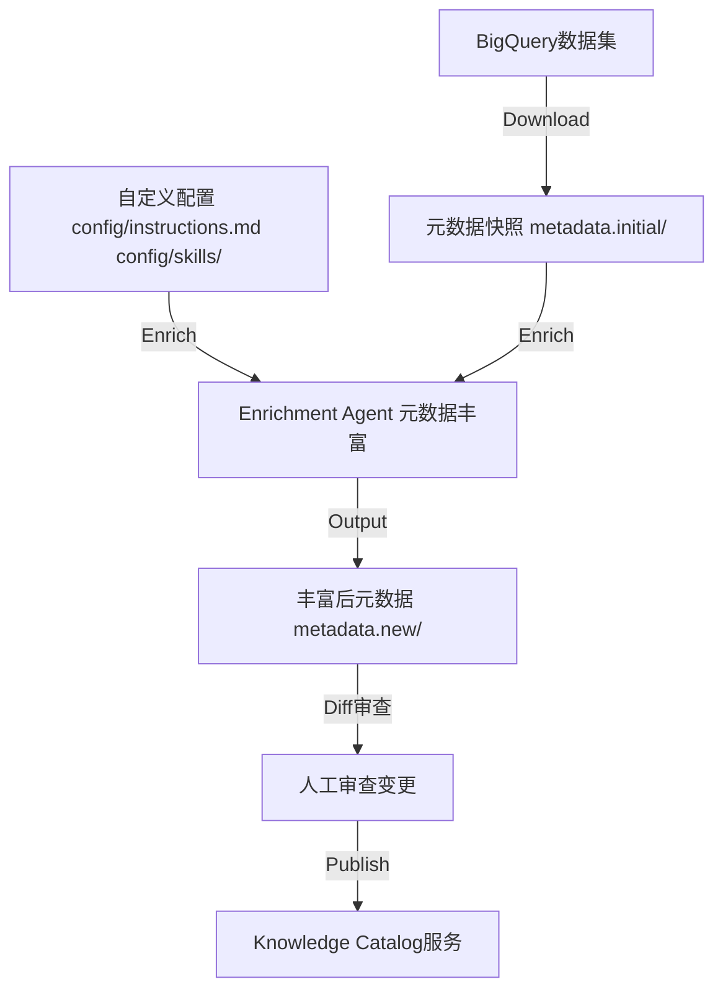
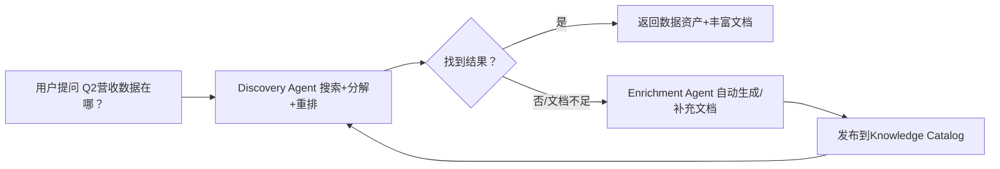

# 04 - 示例智能体实战

> samples/目录包含两个完整的示例智能体：Discovery Agent（语义搜索发现）和Enrichment Agent（元数据自动丰富），展示如何在实际应用中使用Knowledge Catalog API为AI Agent赋能。

---

## 一、两个示例智能体概览

| 示例 | 目录 | 核心功能 | 使用API |
|------|------|---------|---------|
| **Discovery Agent** | `samples/discovery/` | AI驱动的数据资产语义搜索助手 | Knowledge Catalog Search API + Vertex AI |
| **Enrichment Agent** | `samples/enrichment/` | 自动为数据资产生成文档并丰富元数据 | Knowledge Catalog metadata API + LLM |

---

## 二、Discovery Agent（发现智能体）

### 2.1 功能定位

Knowledge Catalog Discovery Agent是一个AI驱动的搜索助手，用于在Google Cloud中发现数据资产。

**与标准语义搜索的区别**：
标准语义搜索仅匹配语义相似的文本，而Discovery Agent更进一步：
1. 对复杂问题进行**语义分解**
2. 生成**多个相关搜索查询**
3. 对最终结果进行**重排序**
4. 提供**全面的综合答案**

### 2.2 前置条件

**需要启用的GCP API**：
- Knowledge Catalog（`dataplex.googleapis.com`）
- Vertex AI（`aiplatform.googleapis.com`）
- Service Usage API（`serviceusage.googleapis.com`）

**需要的IAM权限**：
- `dataplex.projects.search` — 可通过`roles/dataplex.viewer`等角色获得
- `aiplatform.endpoints.predict` — 可通过`roles/aiplatform.user`角色获得
- `serviceusage.services.use` — 需要使用当前项目作为配额项目，可通过`roles/serviceusage.serviceUsageConsumer`获得

### 2.3 环境搭建

```bash
# 克隆仓库
git clone https://github.com/GoogleCloudPlatform/knowledge-catalog.git

# 创建Python虚拟环境并安装依赖
python3 -m venv /tmp/kcsearch
source /tmp/kcsearch/bin/activate

cd samples/discovery
pip3 install -r requirements.txt
```

**设置环境变量**：
```bash
# 将<PROJECT_ID>替换为你的消费者项目ID
export GOOGLE_CLOUD_PROJECT=<PROJECT_ID>
export GOOGLE_GENAI_USE_VERTEXAI=True
```

### 2.4 运行方式

有两种方式运行Discovery Agent：

#### 方式1：作为根Agent运行
将`agent.py`中的`discovery_agent`变量重命名为`root_agent`，然后使用ADK CLI运行。

#### 方式2：作为子Agent运行（推荐）
导入Discovery Agent并将其作为`AgentTool`使用。官方ADK文档中有示例：[多Agent协作](https://adk.dev/agents/multi-agents/#c-explicit-invocation-agenttool)。

**推荐的父目录结构**：
```
my_custom_agent/
├── agent.py
└── knowledge_catalog_discovery_agent/
    ├── SKILL.md
    ├── agent.py
    ├── tools.py
    └── utils.py
```

#### 使用ADK CLI运行

无论选择哪种路径，都可以使用以下ADK CLI命令运行Agent：
```bash
adk run path/to/agent/parent/folder
```
将`path/to/agent/parent/folder`替换为包含Agent源代码的目录的**父目录**的相对或绝对路径。

### 2.5 文件结构

```
samples/discovery/
├── README.md
├── SKILL.md          # Agent Skill描述文件（ADK格式）
├── agent.py          # Agent定义（查询分解、多查询生成、重排逻辑）
├── requirements.txt  # Python依赖
├── tools.py          # Knowledge Catalog Search API工具封装
└── utils.py          # 工具函数
```

---

## 三、Enrichment Agent（丰富智能体）

### 3.1 功能定位

Knowledge Catalog管理数据资产（如BigQuery表）的元数据。这些元数据为搜索和Agent发现、理解数据资产提供动力。

Enrichment Agent示例演示如何使用外部信息源，以Agent方式增强Knowledge Catalog中的元数据：
- 查找与数据资产相关的信息
- 生成文档
- 使用Knowledge Catalog API将文档作为丰富元数据发布

**可定制性**：用户可以使用自定义指令、访问组织内信息源的工具、以及描述这些工具使用的skills来自定义此丰富智能体。

### 3.2 端到端工作流



四个核心步骤：
1. **Download**：下载元数据快照到本地
2. **Enrich**：Agent根据配置丰富元数据
3. **Review**：用git diff审查变更
4. **Publish**：发布更新后的元数据到目录服务

### 3.3 环境搭建

```bash
git clone https://github.com/googlecloudplatform/knowledge-catalog
cd samples/enrichment
```

确保已安装并配置GCloud CLI：

```bash
export CLOUD_PROJECT=<cloud-project-id>

gcloud auth application-default login
gcloud config set core/project $CLOUD_PROJECT
gcloud auth application-default set-quota-project $CLOUD_PROJECT
```

设置Python环境：
```bash
cd src
source env.sh --install
```

### 3.4 设置示例数据

示例会在你的项目中创建一个示例BigQuery数据集，其元数据将被策展：

```bash
python3 ../sample/data/create_data.py
```

### 3.5 丰富步骤

现在可以运行丰富工作流了。

#### 步骤1：下载元数据快照

```bash
python3 -m enrichment.download \
  --dir ../sample/metadata.initial \
  --dataset ${KC_ENRICH_SAMPLE_PROJECT}.kc_enrich_sample_data
```

#### 步骤2：丰富元数据

```bash
python3 -m enrichment.enrich \
  --dir ../sample/metadata.initial \
  --output-dir ../sample/metadata.new \
  --config-dir ../sample/config
```

配置目录`sample/config/`包含：
- `instructions.md`：Agent指令
- `mcp.json`：MCP工具配置
- `skills/kb-search/`：自定义Skill（如知识库搜索）

#### 步骤3：审查元数据更新

```bash
git diff --no-index \
  ../sample/metadata.initial ../sample/metadata.new
```

这一步非常重要——在发布到生产目录之前，人工审查Agent生成的变更，确保质量。

#### 步骤4：发布更新后的元数据

```bash
python3 -m enrichment.publish \
  --dir ../sample/metadata.new
```

### 3.6 文件结构

```
samples/enrichment/
├── README.md
├── .gitignore
├── sample/                          # 示例配置和数据
│   ├── config/
│   │   ├── instructions.md          # Agent自定义指令
│   │   ├── mcp.json                 # MCP服务器配置
│   │   └── skills/
│   │       └── kb-search/
│   │           └── SKILL.md         # 示例Skill
│   ├── data/
│   │   └── create_data.py           # 创建示例BigQuery数据集
│   └── docs/                        # 示例参考文档
│       ├── events.md
│       ├── example1-4.md
│       ├── overview.md
│       └── usage.md
└── src/                             # Enrichment Agent源码
    ├── env.sh                       # 环境设置脚本
    ├── requirements.txt
    └── enrichment/
        ├── __init__.py
        ├── download.py              # 元数据下载
        ├── enrich.py                # LLM丰富逻辑
        ├── publish.py               # 发布到Catalog
        ├── documentation/           # 文档生成Agent
        │   ├── agent.py
        │   ├── agent.md
        │   └── sources.py
        ├── metadata/                # 元数据操作
        │   ├── catalog.py
        │   └── snapshot.py
        └── util/
            └── markdown.py
```

---

## 四、toolbox/enrichment（TypeScript版）

toolbox/目录下还有一个TypeScript实现的Enrichment Agent，与samples中的Python版本定位不同：

```
toolbox/enrichment/
├── src/
│   ├── agent/enrich/        # ADK TypeScript Agent
│   │   ├── agent.ts
│   │   ├── command.ts
│   │   ├── main.ts
│   │   └── tools.ts
│   ├── tools/md/            # Markdown文件知识库工具
│   │   ├── fileset.ts
│   │   ├── main.ts
│   │   └── server.ts
│   └── utils/
│       ├── patchadk.ts
│       └── patchpb.ts
├── package.json
└── tsconfig.json
```

这是生产级TypeScript实现，包含：
- 基于ADK TypeScript的enrich agent
- Markdown文件集MCP工具（将本地Markdown文件作为知识库供Agent使用）

---

## 五、两个Agent的组合使用场景

Discovery Agent和Enrichment Agent形成一个闭环：



**典型使用场景**：
1. 新员工入职：通过Discovery Agent自然语言搜索公司数据资产
2. 数据治理：Enrichment Agent定期扫描未文档化的表，自动生成文档
3. Agent-to-Agent：上层Agent调用Discovery Agent作为工具发现数据，再用Enrichment Agent补充上下文
4. CI/CD集成：数据Pipeline上线时自动触发Enrichment生成文档

---

## 六、关键参考链接

- [Knowledge Catalog Search API文档](http://docs.cloud.google.com/dataplex/docs/reference/rest/v1/projects.locations.searchEntries)
- [ADK文档 - 运行Agent](https://adk.dev/get-started/python/#run-your-agent)
- [ADK文档 - 多Agent协作](https://adk.dev/agents/multi-agents/#c-explicit-invocation-agenttool)
- [预定义IAM角色](https://docs.cloud.google.com/iam/docs/roles-permissions)

---

继续阅读：[05-best-practices.md - 最佳实践与反模式](./05-best-practices.md)
