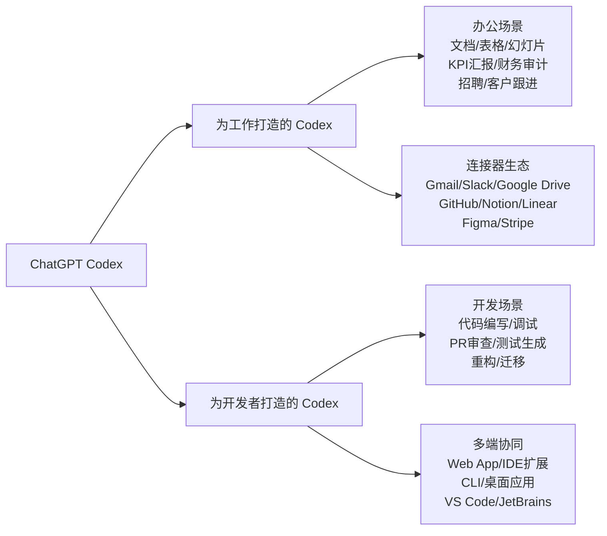

## 一、概述：你的 AI 工作助手

> **"Codex — 你的 AI 工作助手"**
>
> —— ChatGPT Codex 官方核心定位

### 1.1 产品简介

ChatGPT Codex 是 OpenAI 推出的**AI编程智能体与工作助手**，是 ChatGPT 产品体系中面向专业工作场景的核心产品。它不仅仅是一个代码补全工具，而是一个能够理解上下文、连接工作工具、自主执行多步骤任务、直接交付完成工作成果的**全栈AI智能体**。

与传统的AI编程助手不同，Codex 采用**双轨产品策略**：

Codex 的核心价值在于：它不是简单地回答问题，而是**直接完成工作**——基于你已有的文件、笔记、数据、决策和代码，产出你可以直接评审、完善并投入使用的成果。

### 1.2 学习目标

本Wiki教程旨在通过系统性的产品分析，实现以下学习目标：

1. **理解产品定位**：深入理解Codex作为"AI工作助手"的核心定位，掌握其与传统ChatGPT对话、普通代码补全工具的本质区别
2. **掌握核心功能**：系统梳理Codex的五大核心能力模块（研究助手、成果交付、流程自动化、团队工作、可控性）
3. **分析设计策略**：拆解Codex官网的信息架构、视觉设计、文案策略，学习顶级SaaS产品的落地页设计方法论
4. **理解多端协同**：掌握Codex在Web/IDE/CLI/桌面端等多界面的协同策略，理解"同一智能体，多端联动"的设计哲学
5. **学习工具集成**：研究Codex连接器（Connectors）生态设计，理解AI产品如何融入现有工作流而非替代它
6. **提炼可复用经验**：总结Codex在产品定义、信息架构、用户引导、商业化设计等方面的可借鉴设计理念

### 1.3 学习路径

建议按以下顺序学习本教程：

| 阶段 | 章节 | 学习重点 | 预计时长 |
|---|---|---|---|
| **入门认知** | [01 产品定位](01-product-positioning.md) | 理解Codex解决什么问题、为谁解决、独特价值 | 15分钟 |
| | [02 核心功能](02-core-features.md) | 掌握五大功能模块的详细设计 | 25分钟 |
| **设计分析** | [03 界面设计](03-interface-design.md) | 分析视觉层级、布局结构、组件设计 | 20分钟 |
| | [04 信息架构](04-information-architecture.md) | 理解导航系统、内容组织、用户路径 | 20分钟 |
| | [05 用户体验](05-user-experience.md) | 学习文案策略、信任建立、CTA设计 | 25分钟 |
| **深度拆解** | [06 用户流程](06-user-flow.md) | 追踪从访客到用户的完整转化路径 | 20分钟 |
| | [07 双轨策略](07-dual-track-strategy.md) | 理解面向办公/开发者的双轨产品设计 | 20分钟 |
| | [08 多端协同](08-multi-platform.md) | 掌握Web/IDE/CLI/桌面端的协同设计 | 20分钟 |
| | [09 工具集成](09-tool-integration.md) | 学习连接器生态与MCP扩展机制 | 20分钟 |
| | [10 商业模式](10-pricing-model.md) | 分析免费增值模式与五档定价策略 | 20分钟 |
| **洞察提炼** | [11 技术推测](11-technology-speculation.md) | 推测Agent架构、沙箱执行、上下文工程 | 25分钟 |
| | [12 可借鉴设计](12-design-insights.md) | 提炼10+可直接复用的设计理念 | 25分钟 |
| | [13 功能启发](13-feature-inspiration.md) | 获得AI产品功能设计的具体启发 | 20分钟 |
| | [14 经验总结](14-lessons-learned.md) | 总结产品思维、设计哲学、商业化思考 | 20分钟 |
| **收尾** | [15 相关资源](15-resources.md) | 官方文档、开发者资源、扩展阅读 | 10分钟 |

#### 学习路径全景图

```mermaid
flowchart TB
    START(["🚀 开始学习"])
    FINISH(["✅ 学习完成<br/>返回概述"])
    subgraph P1 ["第一阶段：产品认知（约40分钟）"]
        C00["00 概述与学习路径<br/>产品简介·学习目标·章节导航"]
        C01["01 产品定位与价值主张<br/>目标用户·核心痛点·差异化"]
        C02["02 核心功能详解<br/>五大功能模块深度拆解"]
    end
    subgraph P2 ["第二阶段：设计分析（约65分钟）"]
        C03["03 界面设计与视觉分析<br/>色彩体系·布局结构·组件设计"]
        C04["04 信息架构与导航设计<br/>导航系统·内容组织·渐进披露"]
        C05["05 用户体验策略分析<br/>文案策略·信任漏斗·CTA设计"]
    end
    subgraph P3 ["第三阶段：深度拆解（约100分钟）"]
        C06["06 用户交互流程分析<br/>转化漏斗·决策路径·移动端适配"]
        C07["07 双轨产品策略解析<br/>办公用户vs开发者·双轨叙事"]
        C08["08 多端协同策略分析<br/>Web/IDE/CLI/桌面/移动端联动"]
        C09["09 工具集成与生态系统<br/>连接器设计·MCP协议·读写触发"]
        C10["10 定价策略与商业模式<br/>六档套餐·配额机制·定价心理学"]
    end
    subgraph P4 ["第四阶段：洞察启发（约100分钟）"]
        C11["11 技术实现推测<br/>Agent五层架构·沙箱·上下文工程"]
        C12["12 可借鉴的设计理念<br/>12条可复用设计原则"]
        C13["13 AI产品功能启发<br/>连接器·自动化·成果交付·配额管理"]
        C14["14 设计启示与经验总结<br/>产品思维·设计哲学·商业化思考"]
        C15["15 相关资源链接<br/>官方文档·下载链接·学习建议"]
    end
    START --> C00
    C00 --> C01
    C01 --> C02
    C02 -->|"进入设计分析"| C03
    C03 --> C04
    C04 --> C05
    C05 -->|"进入深度拆解"| C06
    C06 --> C07
    C07 --> C08
    C08 --> C09
    C09 --> C10
    C10 -->|"进入洞察提炼"| C11
    C11 --> C12
    C12 --> C13
    C13 --> C14
    C14 --> C15
    C15 -->|"闭环回顾"| C00
    C15 --> FINISH
    style START fill:#10a37f,color:#fff,stroke:#0d8a6a,stroke-width:2px
    style FINISH fill:#f5f5f5,color:#333,stroke:#999,stroke-width:2px,stroke-dasharray:5 5
    style P1 fill:#e8f5e9,stroke:#4caf50,stroke-width:2px
    style P2 fill:#e3f2fd,stroke:#2196f3,stroke-width:2px
    style P3 fill:#fff3e0,stroke:#ff9800,stroke-width:2px
    style P4 fill:#f3e5f5,stroke:#9c27b0,stroke-width:2px
    style C00 fill:#c8e6c9,stroke:#4caf50
    style C01 fill:#c8e6c9,stroke:#4caf50
    style C02 fill:#c8e6c9,stroke:#4caf50
    style C03 fill:#bbdefb,stroke:#2196f3
    style C04 fill:#bbdefb,stroke:#2196f3
    style C05 fill:#bbdefb,stroke:#2196f3
    style C06 fill:#ffe0b2,stroke:#ff9800
    style C07 fill:#ffe0b2,stroke:#ff9800
    style C08 fill:#ffe0b2,stroke:#ff9800
    style C09 fill:#ffe0b2,stroke:#ff9800
    style C10 fill:#ffe0b2,stroke:#ff9800
    style C11 fill:#e1bee7,stroke:#9c27b0
    style C12 fill:#e1bee7,stroke:#9c27b0
    style C13 fill:#e1bee7,stroke:#9c27b0
    style C14 fill:#e1bee7,stroke:#9c27b0
    style C15 fill:#e1bee7,stroke:#9c27b0
```

> **图例说明**：🟢绿色=产品认知阶段、🔵蓝色=设计分析阶段、🟠橙色=深度拆解阶段、🟣紫色=洞察启发阶段。每章末尾均有"下一步"链接串联，15章结束后可闭环回到00章回顾。总学习时长约5小时。

### 1.4 章节导航

本教程共分为16个章节（含本章），遵循"从认知到分析、从产品到设计、从拆解到洞察"的逻辑递进结构：

**第一部分：产品认知（00-02章）**
- [00 概述与学习路径](00-overview.md)（本章）：产品简介、学习目标、章节导航
- [01 产品定位与价值主张](01-product-positioning.md)：目标用户、核心痛点、价值主张、差异化定位
- [02 核心功能详解](02-core-features.md)：五大核心功能模块的逐项拆解

**第二部分：设计分析（03-05章）**
- [03 界面设计与视觉分析](03-interface-design.md)：视觉风格、色彩体系、布局结构、组件设计
- [04 信息架构与导航设计](04-information-architecture.md)：导航系统、内容组织、页面层级、搜索策略
- [05 用户体验策略分析](05-user-experience.md)：文案策略、信任建立、渐进式披露、CTA设计

**第三部分：深度拆解（06-10章）**
- [06 用户交互流程分析](06-user-flow.md)：访客旅程、转化路径、关键决策点
- [07 双轨产品策略解析](07-dual-track-strategy.md)：办公用户vs开发者的差异化设计
- [08 多端协同策略分析](08-multi-platform.md)：Web/IDE/CLI/桌面端/移动端的协同设计
- [09 工具集成与生态系统](09-tool-integration.md)：连接器设计、第三方集成、MCP协议
- [10 定价策略与商业模式](10-pricing-model.md)：免费增值模式、五档套餐设计、配额管理

**第四部分：洞察与启发（11-15章）**
- [11 技术实现推测](11-technology-speculation.md)：Agent架构、沙箱执行、上下文工程、模型策略
- [12 可借鉴的设计理念](12-design-insights.md)：可直接复用的设计原则与模式
- [13 AI产品功能启发](13-feature-inspiration.md)：功能设计的具体启发与落地建议
- [14 设计启示与经验总结](14-lessons-learned.md)：产品思维、设计哲学、商业化思考
- [15 相关资源链接](15-resources.md)：官方资源、开发者文档、扩展阅读

### 1.5 研究方法论

本教程采用多维度系统性分析方法：

| 分析维度 | 研究方法 | 研究内容 |
|---|---|---|
| **产品定位分析** | 价值主张画布、用户画像建模 | 目标用户、核心痛点、差异化优势、市场卡位 |
| **功能模块拆解** | 功能-价值映射、使用场景还原 | 五大功能模块的设计目的、用户价值、场景覆盖 |
| **界面设计分析** | 视觉层次拆解、组件逆向工程 | 色彩体系、排版系统、布局网格、组件模式 |
| **信息架构分析** | 站点地图逆向、导航路径追踪 | 内容组织逻辑、导航系统设计、信息层级 |
| **用户体验分析** | 用户旅程地图、文案语义分析 | 信任建立路径、转化漏斗设计、CTA策略 |
| **商业模式分析** | 定价模型解构、配额梯度设计 | 免费增值策略、套餐分层逻辑、使用量管理 |
| **技术架构推测** | 基于公开文档与行为观察的合理推测 | Agent执行模型、沙箱机制、工具调用架构 |

### 1.6 页面基本信息

| 项目 | 信息 |
|---|---|
| **产品名称** | ChatGPT Codex |
| **页面标题** | Codex - 你的 AI 工作助手 |
| **页面URL** | https://chatgpt.com/zh-Hans-CN/codex/ |
| **语言** | 简体中文（支持15+种语言） |
| **开发公司** | OpenAI |
| **产品类型** | AI编程智能体 / AI工作助手 |
| **信任背书** | Cisco、Instacart、Duolingo、Vanta、Virgin Atlantic |
| **核心入口** | Web App、IDE扩展（VS Code/JetBrains）、CLI、桌面应用、移动端 |
| **定价模式** | 免费增值（Free/Go/Plus/Pro/Business/Enterprise） |

---

**下一步**：继续阅读 [01 产品定位与价值主张](01-product-positioning.md)，深入理解Codex为谁解决什么问题。
