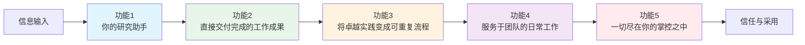
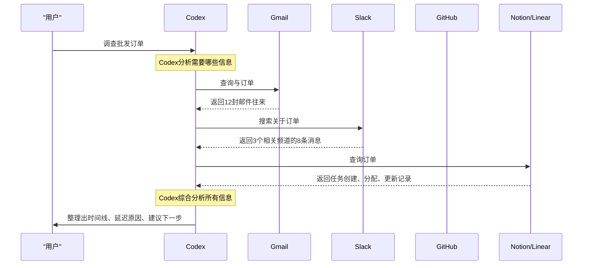
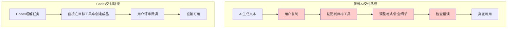
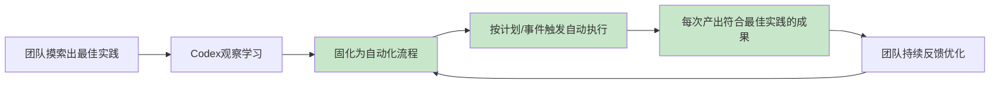
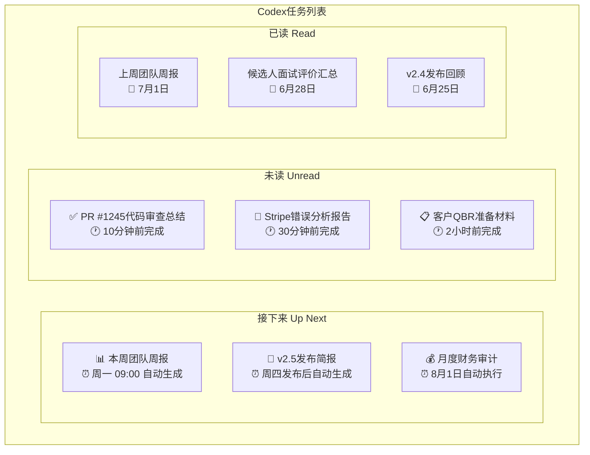
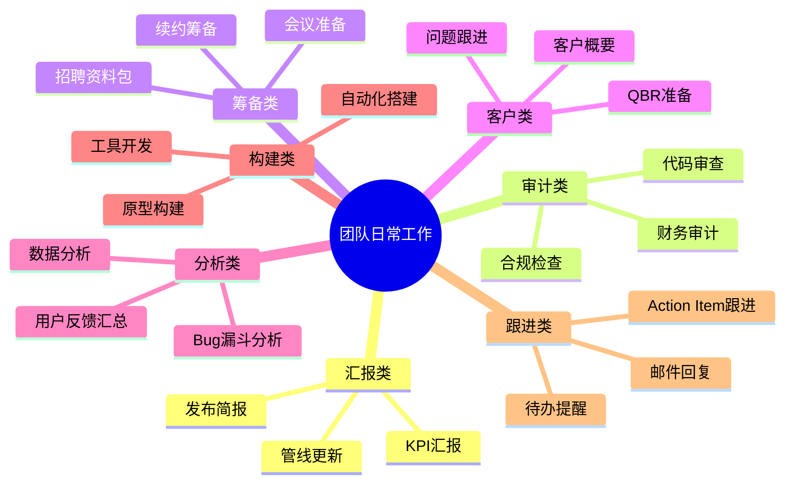
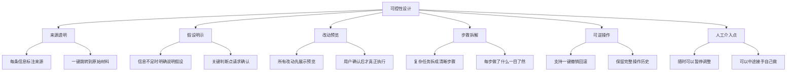
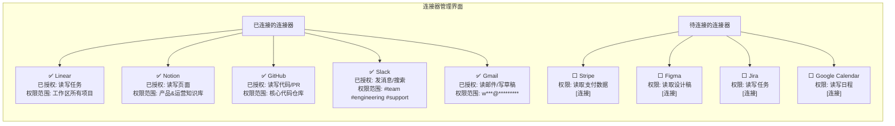
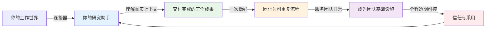

## 一、核心功能体系概览

Codex的产品功能不是零散的工具堆砌，而是围绕"AI工作助手"这一定位，构建了一套**环环相扣、层层递进**的五大核心功能体系。这五大功能从信息输入到成果输出，从个人效率到团队协作，从自动化到可控性，形成了一个完整的工作闭环。

| 功能序号 | 功能名称 | 核心定位 | 解决的核心痛点 | 关键能力 |
|---|---|---|---|---|
| **功能1** | 你的研究助手 | 信息获取层 | 信息碎片化 | 连接器生态、跨工具信息检索、上下文理解 |
| **功能2** | 直接交付完成的工作成果 | 成果输出层 | 成果交付不直接 | 多类型成品生成、原地交付、无需复制粘贴 |
| **功能3** | 将卓越实践变成可重复流程 | 效率放大层 | 重复工作繁重 | 流程固化、自动执行、持续优化 |
| **功能4** | 服务于团队的日常工作 | 场景落地层 | AI脱离真实工作 | 团队场景覆盖、日常高频工作、协作支持 |
| **功能5** | 一切尽在你的掌控之中 | 信任保障层 | 信任缺失 | 来源透明、假设明示、改动预览、可逆操作 |

这五大功能不是独立存在的：**研究助手是基础**（没有真实信息输入，后面都是空的），**成果交付是核心价值**（用户最终要的是成品），**流程自动化是效率放大器**（让一次优秀变成次次优秀），**团队日常是落地场景**（不只是Demo而是每天都能用），**可控性是信任基石**（没有信任就没人敢用）。

---

## 二、功能一：你的研究助手

"你的研究助手"是Codex的入口功能，也是其他所有功能的基础。它解决的是"AI如何获取真实工作上下文"这一根本问题——如果AI不了解你的真实工作环境、不掌握最新信息、不知道你的项目背景，那么它输出的一切都是空中楼阁。

### 2.1 功能核心理念

传统AI工具的工作模式是"Garbage In, Garbage Out"——你给它什么信息，它才能基于什么信息工作。这意味着用户必须自己充当"人肉路由器"：
1. 先去各个工具把需要的信息找出来
2. 整理、筛选、压缩成一段提示词
3. 喂给AI，希望它能理解
4. 如果AI还需要更多信息，再重复1-3步

Codex的研究助手彻底颠覆了这个模式：**它主动连接你的工具，自己去找需要的信息，就像一个真正的人类助理那样**。

### 2.2 连接器生态：连接你的工作世界

Codex通过"连接器"（Connectors）来实现与各种工具的集成。连接器不是简单的API对接，而是深度理解每个工具的数据结构、语义、上下文关系，能够像人类一样在工具中查找、理解、整合信息。

**已支持/规划中的连接器分类**：

| 连接器类别 | 代表工具 | 连接后Codex能做什么 |
|---|---|---|
| **邮件通讯** | Gmail、Outlook | 查找邮件往来、理解邮件对话脉络、提取邮件中的承诺和行动项、生成邮件草稿 |
| **即时通讯** | Slack、Microsoft Teams、Discord | 搜索聊天记录、理解讨论上下文、总结会议讨论、准备好要发送的消息 |
| **文档协作** | Google Drive、Notion、Confluence、Microsoft 365 | 读取文档内容、理解文档结构、查找相关文档、在文档中插入内容、生成新文档 |
| **项目管理** | Linear、Jira、Asana、Trello | 查询任务状态、理解项目进度、查找相关任务、创建新任务、更新任务状态 |
| **代码托管** | GitHub、GitLab、Bitbucket | 读取代码、理解PR、查找相关提交、分析代码变更、创建PR、评论代码 |
| **设计工具** | Figma | 查看设计稿、理解设计系统、提取设计规范、对比设计与实现 |
| **支付/数据** | Stripe、数据库、BI工具 | 查询交易记录、分析数据异常、生成数据报告、理解业务指标 |
| **日历会议** | Google Calendar、Zoom、Meet | 查看日程安排、提取会议纪要、准备会议材料、跟进会议Action Item |

### 2.3 场景还原：调查批发订单物流延迟

让我们通过一个具体场景来理解研究助手的工作方式：

**场景描述**：你是一家B2B批发公司的运营经理，早上收到客户投诉说订单#1234还没收到货，已经延迟了5天。你需要搞清楚发生了什么、为什么延迟、现在状态如何、怎么跟客户解释。

**传统工作方式**：
1. 打开Gmail，搜索"订单#1234"，找到20封相关邮件，逐一阅读——15分钟
2. 打开Slack，在#物流、#客户支持频道搜索#1234，找到一堆碎片讨论——10分钟
3. 打开物流系统，查询订单轨迹，发现卡在海关，但不知道原因——5分钟
4. 打开Linear，查找有没有关于这个订单的问题单——5分钟
5. 打开Notion，查找SOP看这种情况怎么处理——5分钟
6. 综合所有信息，理出时间线——10分钟
**总计：50分钟，而且可能遗漏关键信息**

**Codex工作方式**：
你只需要说一句："帮我调查一下订单#1234为什么延迟了，现在什么状态，给我一个完整的时间线和处理建议"。然后你去倒杯咖啡。

**3分钟后Codex给你返回**：

> **订单#1234物流延迟调查报告**
>
> **时间线**：
> - 6月25日：订单确认，原定7月1日送达
> - 6月27日：货物从仓库发出
> - 6月29日：货物到达港口，报关提交
> - 7月1日：海关抽检，要求补充原产地证明（邮件见[此处链接到Gmail]）
> - 7月2日：物流团队在Slack#物流频道讨论此事，@了张三跟进（消息链接）
> - 7月3日：张三请假，这件事没有被交接，Linear上没有创建任务
> - 7月5日：客户发邮件询问，尚未回复
>
> **延迟原因**：海关要求补充文件，但负责人请假未交接，导致文件未及时提交
>
> **当前状态**：货物仍在港口，已滞留4天
>
> **建议下一步**：
> 1. 立即让李四提交原产地证明（我已经准备好邮件草稿在Gmail草稿箱）
> 2. 给客户回复解释情况并提供补偿方案（我准备了两版回复，你选一下）
> 3. 在Linear创建任务并指派给李四跟进（我已经填好了任务内容，确认后创建）
> 4. 建议增加"请假时待办交接"的流程检查项

这就是研究助手的价值：你不需要知道信息在哪里，不需要在十几个工具间切换，不需要手动整理——Codex替你做了所有信息搜集和初步分析，你只需要做判断和决策。

---

## 三、功能二：直接交付完成的工作成果

如果说"研究助手"解决的是"信息进来"的问题，那么"直接交付完成的工作成果"解决的就是"成果出去"的问题——这是Codex与传统AI最本质的区别之一。

### 3.1 功能核心理念

传统AI的输出是"半成品"：
- 它给你一段写周报的文字，但你要自己复制到Google Docs/Word里，调整格式
- 它给你一段代码片段，但你要自己复制到IDE里，处理依赖，调试运行
- 它给你一个幻灯片大纲，但你要自己打开PPT，一页一页做
- 它给你一封邮件草稿，但你要自己复制到Gmail，填收件人，加附件

这就是AI的"最后一公里"问题：AI做了前面30%，但最后最烦的70%还是要你自己来。很多时候，"把AI的输出变成真正能用的东西"花的时间，并不比"从头开始做"少多少。

Codex的理念是：**AI交付的不是"建议"，而是"可以直接评审和使用的成品"——而且这个成品直接就在你要用的地方，不需要复制粘贴**。

### 3.2 可交付成果类型详解

Codex能够交付的成果覆盖了知识工作者日常需要的绝大多数产出物类型，而且每种类型都不是简单的文本，而是符合对应工具格式规范、可以直接使用的成品。

| 成果大类 | 具体成果类型 | 交付位置 | 完成度说明 |
|---|---|---|---|
| **文档类** | 周报/月报/季报 | Google Docs/Notion | 格式排版完成，有数据支撑，有结论有建议 |
| | 会议纪要 | Google Docs/Notion | 按议题整理，区分决策/待办/讨论，标注责任人 |
| | 项目方案/报告 | Google Docs/Notion | 完整结构（背景/目标/方案/风险/时间表） |
| | 客户邮件/正式信函 | Gmail草稿箱 | 语气得体，信息完整，附件提示，可直接发送 |
| **数据类** | 电子表格/分析表 | Google Sheets/Excel | 公式已写好，格式已设好，数据透视表/图表已生成 |
| | KPI看板/数据报告 | Google Sheets/BI工具 | 关键指标突出，趋势图清晰，异常点标注 |
| | 财务分析/审计报告 | Google Sheets/Docs | 勾稽关系正确，公式链接完整，注释清晰 |
| **演示类** | 汇报幻灯片 | Google Slides/PPT | 每页内容完整，排版美观，有视觉层次 |
| | 产品演示原型 | HTML/Figma集成 | 可交互原型，核心流程走得通 |
| | 架构图/流程图 | Mermaid/绘图工具 | 逻辑正确，符号规范，可直接用于文档 |
| **沟通类** | Slack/Teams消息 | Slack/Teams输入框 | 语气适当，@对人，链接正确，可直接发送 |
| | 会议议程/邀请 | Calendar/邮件 | 时间合理，议题清晰，材料链接附上 |
| | PR描述/Code Review意见 | GitHub/GitLab | 格式规范，变更点清晰，测试说明完整 |
| **执行类** | 自动化工作流 | n8n/Zapier/Codex内置 | 触发器/动作配置完成，可直接启用 |
| | 数据录入/表单填写 | 对应业务系统 | 字段填好，校验通过，可直接提交 |
| | 任务创建/更新 | Linear/Jira | 标题/描述/优先级/指派人都填好 |
| **代码类** | 完整功能代码 | GitHub PR/IDE | 可运行，有测试，符合代码规范 |
| | Bug修复 | GitHub PR | 问题定位准确，修复经过测试，无回归 |
| | 测试用例 | 代码库 | 覆盖主要场景，断言合理，可直接运行 |
| | 脚手架/工具脚本 | 代码库 | 可执行，有文档，参数配置合理 |

### 3.3 场景还原：调试Stripe扣费问题

让我们通过一个开发者场景来理解"直接交付成果"的价值：

**场景描述**：你是一家SaaS公司的后端工程师，早上过来发现很多用户反馈Stripe扣费失败，错误日志里有一堆报错，Slack#support频道炸了，Linear上有5个相关Bug单。你需要定位问题、修复Bug、通知相关团队。

**传统工作方式**：
1. 打开日志系统，搜索Stripe相关错误，筛选最近1小时的日志，翻来覆去看——20分钟
2. 打开Slack，看用户和客服反馈的具体现象，汇总问题模式——10分钟
3. 打开Linear，看这5个Bug单分别是什么情况，判断是不是同一个问题——10分钟
4. 打开GitHub，看最近有没有相关代码提交，可能是昨天上线的改动引起的——15分钟
5. 终于定位到是昨天的PR #1234改了webhook处理逻辑，有个边界情况没处理——10分钟
6. 本地复现问题，写修复代码——20分钟
7. 写测试用例——15分钟
8. 提交PR，写PR描述，@相关人Review——10分钟
9. 在Slack同步进展，在Linear关联PR，回复客服问题——10分钟
**总计：2小时左右，中间不断切换工具，上下文反复中断**

**Codex工作方式**：
你在Codex里说："Stripe扣费出问题了，帮我debug一下，定位原因，修复它，同步给相关团队。"

**Codex开始工作（你可以去做别的）**：
1. 自动去日志系统拉取最近1小时Stripe相关错误日志，分析错误模式
2. 自动去Slack#support搜索Stripe相关讨论，汇总用户反馈现象
3. 自动去Linear查找所有Stripe相关的open Bug单，判断相关性
4. 自动去GitHub查看最近3天的合并PR，重点看支付相关改动
5. 定位到PR #1234引入的问题：当用户使用旧版支付方式时，webhook payload缺少新字段导致空指针
6. 在代码库中创建修复分支，写好修复代码
7. 为修复编写对应的单元测试和集成测试，确保覆盖边界情况
8. 本地跑一遍测试，全部通过
9. 创建PR，填写详细的PR描述：问题根因、修复方案、测试覆盖、风险评估
10. 在Linear的5个Bug单下都评论，关联这个PR，说明修复进展
11. 在Slack#engineering和#support频道发消息同步问题进展和ETA
12. 准备好给客户的回复模板

**15分钟后Codex通知你**：
> "问题已定位并修复。PR #1245已创建，所有测试通过。我已经在相关Bug单下同步了进展，Slack也发了消息。你可以评审一下PR，没问题就可以合并。客户回复模板也准备好了，你看看要不要调整。"

这就是"直接交付完成的工作成果"的真正含义：不是给你一段代码说"你可以这样改"，而是**真的改完、测完、提完PR、同步完所有人**——你只需要做最终评审和合入。

---

## 四、功能三：将卓越实践变成可重复流程

一次性把事做好很厉害，但更厉害的是：**让这件事每次都能被做好，而且不需要每次都让人重新想一遍怎么做**。这就是Codex第三个核心功能的价值：将卓越实践变成可重复流程。

### 4.1 功能核心理念

在任何团队里，都会有一些"做得特别好的人"：
- 某个运营写的周报特别清晰，老板每次都夸
- 某个工程师写的PR特别规范，测试覆盖全，描述清晰，Review起来很舒服
- 某个客服回复客户特别得体，问题解决率高
- 某个项目经理做的发布筹备特别周全，很少出线上问题

但问题是：
1. **依赖个人**：只有这个人做得好，其他人做就打折扣
2. **不可持续**：这个人请假、离职，这套好做法就没了
3. **重复劳动**：即使是这个人，每次做同样的事也要从头来一遍，只是因为熟练所以快一点，但还是花时间
4. **难以迭代**：好的经验只在这个人脑子里，团队没法一起优化

Codex的解决方案是：**当你或你的团队完成一次优秀的工作后，Codex可以学习这套工作方式，把它固化成一个可重复执行的自动化流程。之后不需要人再手动做，Codex会按照这套最佳实践自动执行，而且每次都保持同样的高质量。**

### 4.2 流程自动化的工作机制

Codex的流程自动化不是传统RPA那种"录制固定操作步骤"的死板自动化，而是**基于上下文理解的智能自动化**——它知道流程的目标是什么，知道在什么情况下该做什么判断，能够根据每次的最新数据调整输出。

**流程创建方式**：

| 创建方式 | 适用场景 | 说明 |
|---|---|---|
| **观察学习** | 已经在手动做的流程 | 你做一次（或几次），Codex观察你怎么做的，学习流程步骤、判断标准、输出格式，然后自动生成可重复的流程 |
| **自然语言描述** | 还没开始做的新流程 | 你用自然语言描述"我希望每周一早上自动帮我做XXX"，Codex理解后配置好流程 |
| **模板库选择** | 通用常见流程 | Codex提供常见流程模板（周报、发布简报、Bug分析等），你选一个，简单配置就能用 |
| **导入现有文档** | 已有SOP的流程 | 把团队的SOP文档给Codex，它理解后把SOP转化为可执行的自动化流程 |

**流程触发方式**：
- **定时触发**：每天早上9点、每周一、每月1号等固定时间
- **事件触发**：当GitHub有新PR合并、当Stripe有扣费失败、当Slack有人发特定关键词、当Linear有高优先级Bug创建
- **手动触发**：需要的时候点一下就跑
- **条件触发**：当满足某些条件时（如错误率超过5%时自动分析）

### 4.3 界面设计：任务列表三板块

在流程自动化功能中，Codex设计了一个清晰的任务管理界面，分为三个板块：**"接下来"（Up Next）、"未读"（Unread）、"已读"（Read）**。

**三个板块的设计逻辑**：

| 板块 | 内容 | 用户行为 | 设计目的 |
|---|---|---|---|
| **接下来** | 即将自动执行的流程 | 可以预览、调整、取消、立即执行 | 让用户对"接下来会发生什么"有预期和掌控感，不会觉得AI在偷偷做事 |
| **未读** | Codex已经完成但你还没看的成果 | 点进去看，评审、通过、要求修改、反馈 | 像收件箱一样，清晰告诉你有哪些AI完成的工作需要你处理 |
| **已读** | 你已经看过的历史成果 | 可以追溯、查看历史、复用、优化流程 | 保留完整的工作历史，方便回溯和审计 |

这个三板块设计非常聪明：它既实现了"自动化执行"，又通过"接下来"的预告和"未读"的评审环节，确保**人始终在循环中保持控制权**——AI不是在你不知道的情况下乱搞，而是透明地告诉你"我要做什么"、"我做完了什么"，你只需要评审和决策。

### 4.4 典型自动化流程示例

| 流程名称 | 触发条件 | Codex自动执行的动作 | 最终交付物 |
|---|---|---|---|
| **每周团队周报** | 每周一早上9点 | 1. 收集上周GitHub所有合并PR 2. 总结Slack#team频道关键讨论 3. 统计Linear上周完成/进行中/延期任务 4. 汇总关键指标变化 5. 识别风险和阻塞点 | Google Docs周报文档，Slack频道周报摘要，@相关人跟进待办 |
| **新PR代码审查助手** | 每次有新PR创建 | 1. 理解PR变更目的 2. 检查代码风格是否符合规范 3. 识别潜在bug和安全问题 4. 检查测试覆盖是否充分 5. 提供改进建议 | PR评论，包含审查意见、问题点、改进建议、测试建议 |
| **扣费失败自动分析** | Stripe webhook收到扣费失败事件 | 1. 分析失败原因（卡过期/余额不足/风控等） 2. 查找该用户历史支付情况 3. 判断是偶发还是系统性问题 4. 如果是偶发，生成用户回复 5. 如果是系统性问题，创建高优先级Bug | 用户邮件草稿（偶发）/ Linear高优先级Bug + Slack告警（系统性） |
| **面试评价汇总** | 所有面试官提交面试反馈后 | 1. 收集所有面试官的评价 2. 按维度（技术能力/沟通/文化匹配等）汇总 3. 识别共识点和分歧点 4. 给出综合推荐建议 5. 准备好招聘决策会议材料 | Notion面试评价汇总页，会议邀请，决策Checklist |
| **发布后回顾** | 每次生产发布完成24小时后 | 1. 收集发布后24小时的错误日志 2. 统计关键指标（错误率/延迟/转化率）变化 3. 收集Slack#release频道反馈 4. 识别是否有回滚或热修复 5. 总结发布成功点和待改进 | 发布回顾文档，Slack发布总结，改进项创建为Linear任务 |

---

## 五、功能四：服务于团队的日常工作

很多AI产品喜欢展示"炫酷Demo"——帮你写一首歌、画一幅画、解一道奥数题、做一个视频。这些Demo看起来很震撼，但问题是：普通用户一个月可能也不会做一次这些事。

Codex选择了一条更朴素但更有价值的路：**服务于团队每天都在做的、高频的、琐碎的、看起来不酷但非常重要的日常工作**。

### 5.1 功能核心理念

为什么聚焦"日常工作"？因为：
1. **高频才是真痛点**：每天都在做的事，哪怕每次只节省10分钟，一年下来也是巨大的时间节省
2. **琐碎才最消耗人**：真正让知识工作者疲惫的不是偶尔攻克一个难题，而是每天有一堆琐碎但又必须做好的小事
3. **日常才是工作流的核心**：AI只有融入日常工作流，才不会变成"想起来才用一下"的玩具，而是成为离不开的基础设施
4. **团队场景才有复利**：个人用AI提升10%效率是加法，团队用AI让所有人都按最佳实践工作是乘法

Codex覆盖了团队日常工作的十大典型场景，每个场景都做深做透，而不是浅尝辄止。

### 5.2 十大日常工作场景详解

让我们逐一拆解Codex覆盖的十大团队日常工作场景，以及在每个场景中它具体做什么：

| 场景类别 | 具体工作 | Codex如何帮你 | 交付物 |
|---|---|---|---|
| **KPI汇报** | 每周/每月/每季度整理业务指标，做汇报 | 自动从数据源拉取KPI数据，计算环比/同比，分析趋势和异常，生成汇报文档和幻灯片，识别需要关注的问题 | KPI报告文档+幻灯片，异常点预警，待跟进事项清单 |
| **管线更新** | 销售/项目/产品管线状态同步 | 自动从CRM/项目管理工具拉取管线数据，识别推进、停滞、风险项，生成管线更新报告，提醒高优先级跟进 | 管线状态表，风险项清单，跟进建议 |
| **财务审计** | 定期对账、费用审核、合规检查 | 自动比对银行流水和账目，识别异常交易，检查费用报销合规性，生成审计报告，标注需要人工复核的点 | 审计工作底稿，异常交易清单，合规报告 |
| **发布简报** | 每次产品发布后同步发布内容 | 自动从PR记录、Issue、Release Note提取发布内容，按模块分类，生成用户可读的发布简报，准备内部和外部沟通材料 | 内部发布简报，外部Changelog，客服FAQ更新建议 |
| **续约筹备** | 客户续约前的准备工作 | 自动收集客户使用数据、历史工单、沟通记录、健康度评分，识别续约风险和扩张机会，准备QBR材料和续约方案 | 客户健康度报告，续约谈判材料，风险和机会清单 |
| **招聘资料包** | 候选人面试、评估、Offer阶段的材料准备 | 自动收集候选人简历、面试评价、笔试结果、背景调查信息，生成面试包、评估对比表、Offer审批材料 | 候选人面试包，面试评价汇总，Offer审批材料 |
| **客户概要** | 新客户接手/客户拜访前的背景准备 | 自动汇总客户基本信息、历史沟通记录、合同情况、使用数据、未解决问题、关键联系人，生成客户概要 | 客户One Pager，历史沟通时间线，待跟进事项 |
| **Bug漏斗分析** | 定期分析Bug趋势、定位质量问题 | 自动从Jira/Linear拉取Bug数据，按模块/严重程度/解决时间分类，分析漏斗转化，识别质量薄弱点，生成质量报告 | Bug漏斗分析报告，质量热点模块，改进建议 |
| **原型构建** | 快速验证产品想法的原型 | 根据需求描述快速生成可交互的HTML原型，包含核心流程，可用于用户测试和内部评审 | 可交互HTML原型，原型说明文档，用户测试脚本 |
| **后续跟进** | 会议/客户沟通/项目中的Action Item跟进 | 自动从会议纪要、沟通记录中提取Action Item，追踪执行状态，到期提醒，汇总进展，识别逾期项 | Action Item跟踪表，逾期提醒，进展汇总报告 |

### 5.3 场景还原：团队周报自动生成+自动化流程创建

让我们通过一个组合场景来理解Codex如何服务团队日常工作：

**场景描述**：你们是一个10人的产品研发团队，每周一上午10点开周会，需要有团队周报同步上周进展、本周计划、风险阻塞。之前都是大家自己写，然后项目经理汇总，每次要花项目经理1-2小时，还经常有人忘记写、写得不全、格式不统一。

**第一步：你做一次，Codex学习（周日下午花10分钟）**
1. 你手动做了一次周报，过程中：
   - 去GitHub找上周大家合并的PR
   - 去Linear看上周完成的任务、进行中的任务
   - 去Slack看上周大家说的风险和阻塞
   - 整理成你喜欢的周报格式
   - 发到Slack#team频道，同时创建Google Docs归档
2. Codex全程观察你怎么做的，学会了：
   - 周报的结构应该是什么样（上周完成/本周计划/风险阻塞/数据指标）
   - 信息分别从哪里获取（GitHub/Linear/Slack）
   - 怎么筛选和分类信息
   - 输出格式和发送位置（Slack消息+Google Docs）

**第二步：Codex确认流程，你做微调（5分钟）**
Codex问你："我看到你这样做周报，我帮你把这个流程自动化好吗？以后每周一早上9点自动生成。我计划是这样：
1. 每周一8:30开始收集数据
2. 9点前生成周报草稿放到'未读'
3. 你评审没问题的话，我再发到Slack和创建文档
4. 你看哪里需要调整？"

你说："很好，加一点：风险项要直接@对应的负责人，数据指标部分要加上周的错误率和部署次数对比。"
Codex说："好的，已更新配置。"

**第三步：每周一自动运行，你只需要评审（5分钟）**
之后每周一早上8:30，Codex自动开始工作：
1. 拉取上周GitHub所有合并PR，按人按模块分类
2. 拉取Linear上周状态变更的任务，统计完成率、延期任务
3. 分析Slack#team频道上周的对话，提取大家提到的风险和阻塞
4. 从监控系统拉取上周错误率、延迟、部署次数数据
5. 按照你喜欢的格式生成周报草稿
6. 放到"未读"板块，给你发个通知："本周周报已生成，请评审。"

你9点到公司，打开Codex，看周报：
> **第27周团队周报（7月1日-7月7日）**
>
> **📊 关键指标**
> - 部署次数：12次（上周15次）
> - 线上错误率：0.12%（上周0.18%，↓33%）
> - 平均PR合并时间：1.2天（上周1.8天，↑33%）
> - Bug解决率：92%（上周88%）
>
> **✅ 上周完成**
> - 支付模块重构（张三，李四）：PR #1234, #1238, #1241
> - 用户中心优化（王五）：PR #1236, #1240
> - 移动端性能优化（赵六）：启动速度提升40%
> - ...
>
> **📅 本周计划**
> - 张三李四：继续支付模块灰度
> - 王五：启动消息中心项目
> - ...
>
> **⚠️ 风险与阻塞**
> - @孙七：第三方物流接口文档还没拿到，已经阻塞3天了，建议今天跟进
> - @周八：测试环境不稳定，影响测试进度，需要运维协助
> - ...

你看了看，发现有个地方赵六的工作写漏了，你说："加上赵六还做了推送通知优化的PR。"
Codex马上更新，然后你说"可以发了"。
Codex自动：
1. 创建正式的Google Docs文档归档
2. 把周报发到Slack#team频道
3. 在风险项那里@孙七和周八提醒他们跟进
4. 把周报移到"已读"板块

**结果**：以前项目经理每周花1-2小时做周报，现在你每周只花5分钟评审。而且周报质量更稳定、信息更全、格式更统一，不会有人忘交。这就是"服务团队日常工作"的价值——它不是做一件惊天动地的大事，而是把每天每周都在做的小事做好、做自动化，让团队把时间花在真正重要的事情上。

---

## 六、功能五：一切尽在你的掌控之中

AI能力越强，用户的信任焦虑就越强："它会不会乱改我的东西？""它的结论对不对？""它做了什么我怎么知道？""如果做错了能撤销吗？"

"一切尽在你的掌控之中"不是一句空口号，而是Codex贯穿所有功能的设计原则，是前面四个功能能够被用户放心使用的信任基石。

### 6.1 功能核心理念

AI助手的悖论：**能力越强，用户越不敢用**——因为能力越强意味着它能做的事情越多，如果出错造成的影响也越大。如果用户总是提心吊胆担心AI闯祸，那么再强的能力也无法真正落地。

Codex解决这个悖论的思路不是"限制AI能力让它不犯错"，而是**建立全方位的透明和控制机制，让用户始终能看到AI在做什么、为什么这么做、做了什么改动，并且随时可以介入、调整、撤销**。

人类助手也会犯错，但你敢用人类助手，是因为：
1. 你知道他做了什么，他会跟你汇报
2. 如果他不确定，他会问你，不会擅自做重大决定
3. 如果他做错了，你可以指出来，他可以改回来
4. 你知道他的信息来源是什么，如果有疑问你可以去查证

Codex做的，就是把人类助手这种"可控感"在产品设计中重现出来。

### 6.2 五大可控性设计机制

让我们详细拆解Codex如何从五个维度建立"掌控感"：

#### 6.2.1 来源透明：你知道信息从哪来

Codex给出的每一个结论、每一个数据、每一项陈述，都标注了**明确的来源**：
- 如果是来自邮件，会标注"来自张三6月30日发送的邮件《关于订单#1234的问题》"，并附上直接链接
- 如果是来自Slack消息，会标注"来自#物流频道7月2日李四的消息"，附上链接
- 如果是来自代码，会标注"来自payment/webhook_handler.py第145行的代码，PR #1234引入"
- 如果是来自文档，会标注"来自《2026Q2运营SOP》v3版第4.2节"

**设计价值**：
- 你不需要怀疑Codex是不是"编的"，有疑问一键就能跳转到原始材料查证
- 这也强迫Codex自己必须基于真实材料工作，而不是靠模型幻觉编造
- 当你要基于Codex的结论做决策时，你可以快速追溯原始信息，做出更准确的判断

#### 6.2.2 假设明示：它知道自己不知道什么

现实工作中，信息永远是不完整的，人类会做假设，AI也需要做假设。关键区别是：**好的助手会明确告诉你"我这里做了一个假设"，而不是把假设当事实告诉你**。

Codex遇到信息不完整需要假设时，会：
- 明确说："这里缺少XX信息，我假设XXX，如果不对请告诉我"
- 把关键的假设点列在报告开头或专门的"假设与局限"部分
- 如果是重大决策相关的假设，不会自己猜，而是直接问你："这一点我不确定，你能确认一下吗？"

**反例（不好的AI）**：
> "订单延迟原因是海关扣关，需要补交关税。建议你马上联系报关行。"
（实际上是因为缺少原产地证明，不是关税问题——AI编了个原因）

**正例（Codex）**：
> "我没有在邮件和Slack中看到海关明确说明扣关原因。
> **假设**：根据类似情况的历史记录，最常见的原因是缺少原产地证明（占80%案例），其次是关税问题（15%）。
> **建议**：先联系报关行确认具体原因，我已经帮你起草了询问邮件。如果你确认是其他原因，我可以重新调整方案。"

#### 6.2.3 改动预览：先看后改，确认才执行

Codex对你的文件、代码、工具做任何实质性改动之前，**一定会先给你看预览，等你确认后才会真正执行**：
- 要提交PR？先给你看完整的diff，你确认没问题再点"创建PR"
- 要发邮件？先存到草稿箱，你看过了点"发送"才发
- 要在Slack发消息？先在输入框准备好，你确认了再发
- 要更新任务状态？先给你看要改什么，你同意了再更新

**没有"先斩后奏"，没有"我已经帮你弄好了"——所有写操作都是"预览→确认→执行"的流程。**

这对建立信任至关重要：用户不需要战战兢兢担心"AI会不会偷偷改坏什么东西"，因为不管它想做什么改动，都会先拿给你看。

#### 6.2.4 步骤拆解：它是怎么做的你能看到

对于复杂的多步骤任务，Codex不会只给你一个黑盒的最终结果，而是**把整个执行过程拆解成清晰的步骤**，让你看到每一步它做了什么、找到了什么信息、做了什么判断。

例如"调查订单延迟"这个任务，你可以看到完整的执行轨迹：
> **执行步骤**：
> 1. ✅ 搜索Gmail中包含"订单1234"的邮件：找到12封
> 2. ✅ 搜索Slack中#物流、#客户支持频道关于1234的讨论：找到8条消息
> 3. ✅ 查询物流系统订单1234轨迹：发现7月1日后状态停留在"海关查验"
> 4. ✅ 查找Linear中与订单1234相关的任务：没有找到对应任务
> 5. ❌ 查找张三（订单负责人）最近的日程：发现张三7月2-4日请假
> 6. ✅ 综合以上信息分析延迟原因
> 7. ✅ 生成处理建议和后续步骤

你不仅能看到它做了什么，还能看到哪些步骤找到了信息、哪些没找到，如果结果不对，你可以快速定位是哪一步出了问题。

#### 6.2.5 可逆操作：做错了可以撤销

即使有前面所有机制，AI还是有可能犯错——人类助手也犯错，重要的是犯错了能不能改回来。Codex对重要操作都提供了**一键撤销/回滚**能力：
- 如果PR创建错了，可以一键关闭PR并恢复分支
- 如果邮件发出去了（你自己点的发送），可以召回（如果邮件系统支持）
- 如果文档改错了，可以恢复到之前的版本（对接Google Docs/Notion版本历史）
- 如果任务创建错了，可以一键删除或归档
- Codex保留所有操作的完整历史，你可以看到"AI在什么时间做了什么"，随时可以回退到任意时间点

### 6.3 界面设计：连接器集成列表

可控性不仅体现在执行过程中，也体现在"你可以决定Codex能访问什么"上。Codex设计了清晰的连接器管理界面，你可以完全控制它连接哪些工具、有什么权限。

**连接器管理的设计原则**：
1. **明确列出已连接/未连接**：你一眼就能看到Codex现在能访问哪些工具，不能访问哪些
2. **权限范围透明**：对于每个已连接的工具，清楚说明有什么权限（只读/读写）、能访问哪些范围（所有邮件还是特定标签，所有仓库还是特定仓库）
3. **你主动选择连接**：没有偷偷默认连接，你想连哪个就自己点"连接"，走OAuth授权流程
4. **随时可以断开**：如果你不想让Codex访问某个工具了，一键断开，它就再也访问不了
5. **最小权限原则**：Codex默认申请完成工作所需的最小权限，不会要不必要的权限

---

## 七、核心功能总结

Codex的五大核心功能构成了一个完整的AI工作助手价值闭环：

| 功能 | 它不是什么 | 它是什么 |
|---|---|---|
| **研究助手** | 不是需要你喂信息的聊天机器人 | 是主动去你工具里找信息的真实助手 |
| **成果交付** | 不是给你建议让你自己落地 | 是直接在你工具里交付可用成品 |
| **流程自动化** | 不是死板的固定步骤录制 | 是理解目标、能适应变化的智能自动化 |
| **团队日常** | 不是用来做炫酷Demo的玩具 | 是每天帮你处理琐碎工作的基础设施 |
| **可控性** | 不是黑盒式的AI魔法 | 是来源明、可预览、可撤销的可靠伙伴 |

这五大功能不是五个独立卖点，而是一套组合拳：没有研究助手拿不到真实信息，成果交付就是空谈；没有成果交付，流程自动化就没有内容；没有流程自动化，就无法规模化服务团队日常；没有全程可控，前面所有能力用户都不敢用。

理解了Codex"做什么"，下一章我们将分析它"长什么样"——Codex的官网是如何通过界面设计和视觉语言，把这些复杂的功能清晰、有说服力地传达给用户的。

---

**下一步**：继续阅读 [03 界面设计与视觉分析](03-interface-design.md)，深入拆解Codex官网的视觉风格、色彩体系、布局结构、组件设计。
