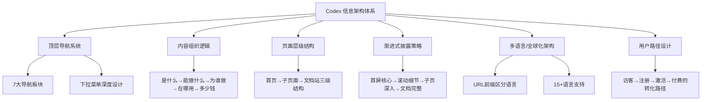
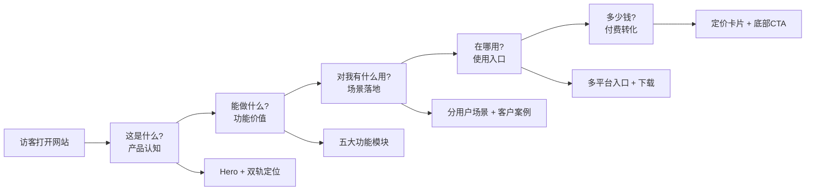
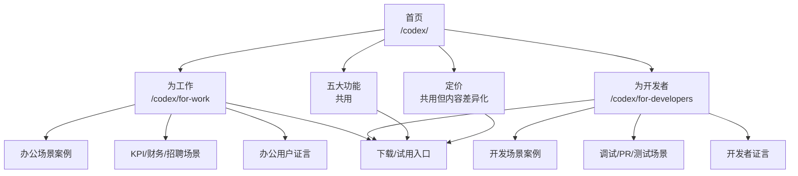
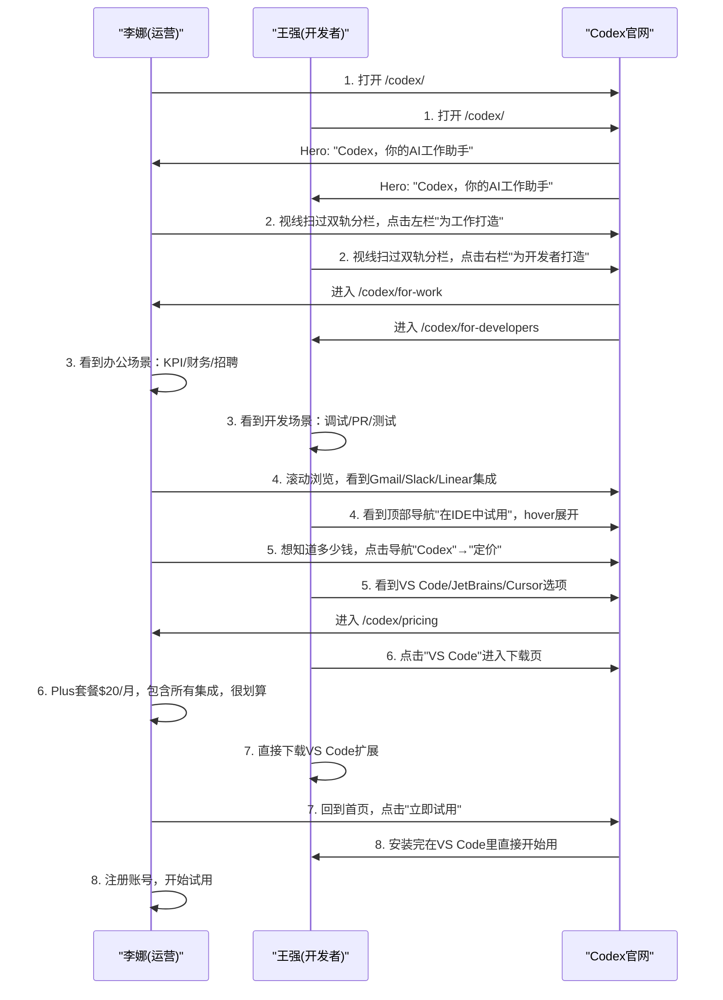
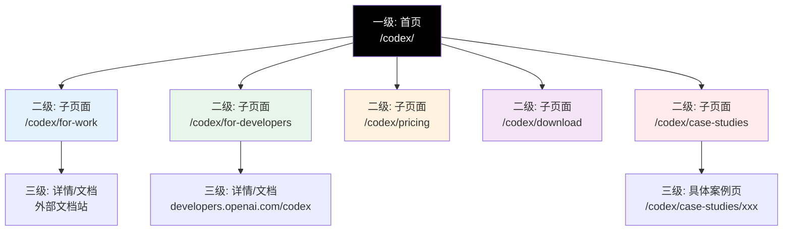
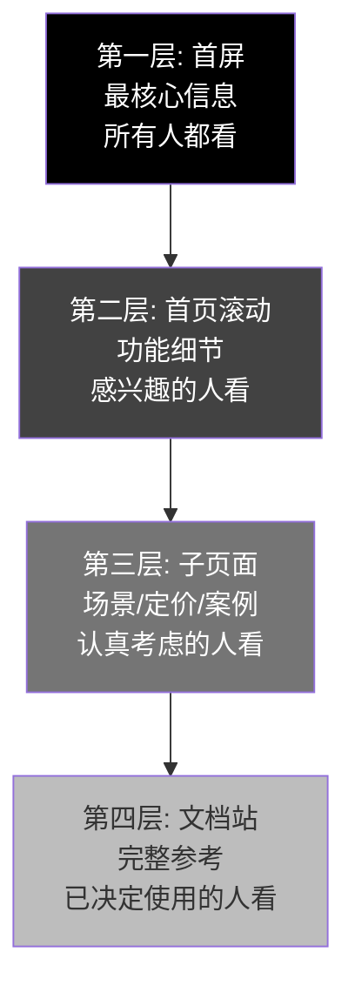
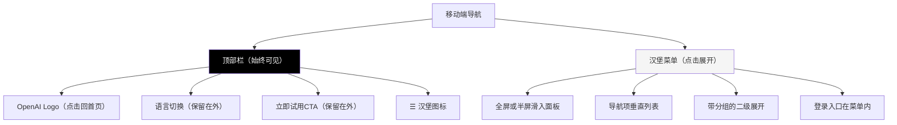
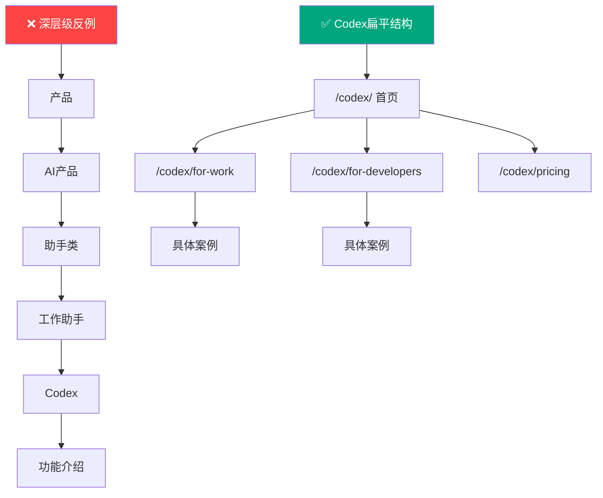
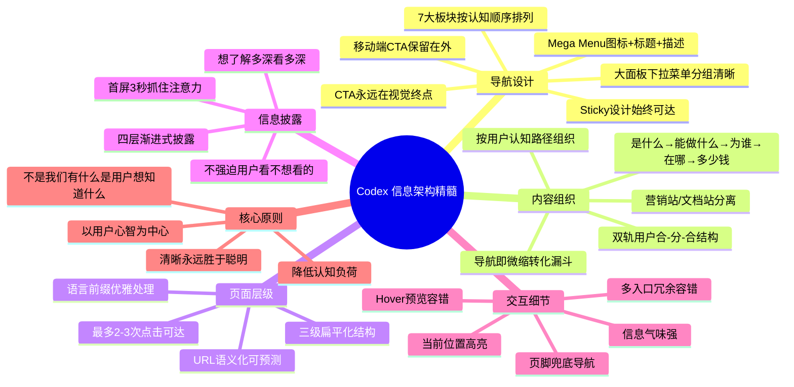

## 一、信息架构整体策略

信息架构（Information Architecture，IA）是产品的"骨架"——它决定了内容如何组织、分类、导航、搜索。好的信息架构让用户"想找什么就能找到什么，甚至不用想就知道在哪"；坏的信息架构让用户迷路、困惑、最终离开。

ChatGPT Codex 官网的信息架构设计，体现了**"渐进式披露"和"用户认知路径"两大核心原则**——不把所有信息一下子倒给用户，而是按照用户从"陌生访客"到"付费用户"的认知旅程，层层递进地展示信息。



OpenAI 作为一家产品驱动的顶尖科技公司，其信息架构不是"按公司组织结构"设计的，也不是"按技术模块"设计的，而是**完全按用户心智模型和认知路径设计**——用户先关心什么、后关心什么，信息就按这个顺序组织。

---

## 二、顶层导航：七大板块解析

Codex 采用**水平顶部导航栏**作为主导航系统，共包含 7 个核心板块，从左到右按用户认知顺序排列。导航栏是 sticky 设计，始终固定在页面顶部，用户随时可以跳转。

### 2.1 导航整体结构

| 导航顺序 | 导航项 | 类型 | 核心目的 | 目标用户阶段 |
|---|---|---|---|---|
| 1 | 功能 ▾ | 下拉菜单 | 告诉用户"我们有哪些产品和能力" | 初步了解，想知道能做什么 |
| 2 | 学习 ▾ | 下拉菜单 | 提供学习资源，帮助用户上手 | 有兴趣，想深入了解怎么用 |
| 3 | Codex ▾ | 下拉菜单 | Codex 产品专属入口和子页面 | 明确对 Codex 感兴趣的用户 |
| 4 | 商业应用 ▾ | 下拉菜单 | 面向企业/团队/教育客户 | 团队/企业采购决策阶段 |
| 5 | 在 IDE 中试用 ▾ | 下拉菜单 | 开发者多端入口 | 开发者，想马上试用 |
| 6 | 语言：中文 ▾ | 下拉选择 | 切换语言 | 所有用户，全球化支持 |
| 右侧 | 登录 | 文字链接 | 老用户入口 | 已有账号的用户 |
| 右侧 | 立即试用 | 主按钮 | 核心转化 CTA | 所有准备注册的用户 |

**导航排序逻辑解读**：
1. **先产品，后学习**：用户首先想知道"这是什么、能做什么"（功能），然后才想"我怎么学、怎么用"（学习）
2. **Codex 独立入口**：Codex 作为重点产品有自己的独立导航项，包含所有 Codex 子页面
3. **个人→团队**：先讲个人能用什么，再讲企业/团队能用什么（商业应用）
4. **了解→行动**：前面是了解信息，"在IDE中试用"是行动入口
5. **转化按钮永远在最右侧**：用户视线从左到右浏览，最后停在 CTA 上——这是视觉动线的终点，也是转化的最佳位置

### 2.2 "功能"下拉菜单详解

"功能"是导航的第一个选项，展示 OpenAI 完整的产品矩阵，让用户了解整个产品生态。这部分共包含 **10 个条目**，按产品类别分组组织：

| 分组 | 条目 | 说明 | 链接目标 |
|---|---|---|---|
| **核心对话产品** | ChatGPT | 旗舰聊天机器人产品，面向所有用户 | /chat/ 产品页 |
| | Codex | AI 工作助手，本产品 | /codex/（当前页） |
| | Sora | 视频生成模型 | /sora/ 产品页 |
| **前沿研究** | 研究预览 | 最新研究成果预览版 | /research/ 相关页面 |
| **端侧产品** | 桌面应用 | Windows/Mac 桌面客户端 | /download/ 下载页 |
| | 移动应用 | iOS/Android App | 各应用商店链接 |
| | Chrome 扩展 | 浏览器插件 | Chrome 应用商店 |
| **高级能力** | Atlas | OpenAI 的搜索/知识产品 | Atlas 产品页 |
| | 深度研究 | 深度研究模式 | 功能说明页 |
| | 智能体模式 | Agent 模式说明 | 功能说明页 |

**"功能"菜单设计观察**：
- **分组清晰**：不是 10 个条目平铺，而是按"核心产品/端/高级能力"分组，用户能快速理解
- **带图标和简短描述**：每个条目不只是文字链接，还有小图标和一句话说明——降低认知成本
- **产品矩阵完整展示**：即使用户是来找 Codex 的，也能看到 OpenAI 还有其他什么产品——这是生态展示
- **当前页高亮**：正在浏览 Codex 页时，导航中 Codex 项会高亮显示，告诉用户"你在这里"

### 2.3 "学习"下拉菜单详解

"学习"板块为用户提供从入门到精通的全链路学习资源，共 **8 个条目**：

| 条目 | 目标用户 | 内容类型 | 作用 |
|---|---|---|---|
| 帮助中心 | 所有用户 | 自助支持文档 | 解答常见问题，排查使用问题 |
| 教程与指南 | 新用户 |  step-by-step 教程 | 手把手教用户用起来 |
| OpenAI Academy | 系统性学习者 | 课程/学习路径 | 系统化学习AI和OpenAI产品 |
| Codex for Work 指南 | Codex 办公用户 | 专属使用指南 | 教办公用户怎么在工作中用 Codex |
| 开发者文档 | 开发者 | API/技术文档 | 开发者集成、开发参考 |
| 示例与用例 | 所有用户 | 案例库 | 展示真实使用场景，启发用户 |
| 博客 | 关注者/深度用户 | 文章/更新 | 深度文章、产品思考、技术分享 |
| 更新日志 | 现有用户 | 版本更新记录 | 告诉用户新功能、新变化 |

学习菜单的设计体现了**分层学习支持**：
1. **遇到问题** → 帮助中心
2. **刚入门想快速上手** → 教程与指南
3. **想系统学习** → OpenAI Academy
4. **用 Codex 工作** → Codex 专属指南
5. **要开发集成** → 开发者文档
6. **想看别人怎么用** → 示例与用例
7. **想深入了解** → 博客
8. **想知道更新了什么** → 更新日志

不同需求的用户都能在第一时间找到对应的资源，不会"想学的时候不知道去哪学"。

### 2.4 "Codex"下拉菜单详解

"Codex"导航项是本产品的专属入口，包含 Codex 产品线下的所有子页面，共 **7 个条目**：

| 条目 | URL | 内容 | 目标用户 |
|---|---|---|---|
| 主页 | /codex/ | Codex 首页（当前页），产品全景介绍 | 所有访客 |
| 为工作 | /codex/for-work | 面向办公用户的专属落地页 | 职场人士、运营、管理者 |
| 为开发者 | /codex/for-developers | 面向开发者的专属落地页 | 软件工程师、技术主管 |
| 定价 | /codex/pricing | 价格套餐详情 | 准备付费的用户 |
| 下载 | /codex/download | 各端下载入口 | 准备下载使用的用户 |
| 使用案例 | /codex/case-studies | 客户案例/用户故事 | 决策阶段，想看真实效果 |
| 文档 | developers.openai.com/codex | 外部开发者文档站 | 要深度使用/集成的开发者 |

**Codex 子页面设计逻辑**：
- **双轨入口**："为工作"和"为开发者"两个独立页面，对应双轨用户策略
- **从了解到使用**：主页 → 细分用户页 → 定价 → 下载/案例 → 文档——完整转化路径
- **内外结合**：产品页在 chatgpt.com 域名下，深度技术文档在 developers.openai.com——营销站和文档站分离
- **文档外链**：最深度的技术文档不在主站，而是跳转到专门的开发者站——因为主站目标是转化，文档站目标是深度使用

### 2.5 "商业应用"下拉菜单详解

"商业应用"板块面向 B 端客户（企业、团队、教育机构），共 **7 个条目**：

| 条目 | 目标客户 | 核心价值 |
|---|---|---|
| ChatGPT Business | 中小企业团队 | 团队版 ChatGPT，管理控制台、SSO等 |
| ChatGPT Enterprise | 大型企业 | 企业级，安全合规、SLA、定制化 |
| ChatGPT Edu | 教育机构/学校 | 教育场景，学生/教师优惠、管理功能 |
| 客户案例 | 所有 B 端客户 | 各行业客户成功案例 |
| 安全与合规 | 企业IT/安全团队 | 安全认证、数据隐私、合规说明 |
| 管理员控制 | IT管理员 | 团队管理、权限控制、审计能力 |
| API 平台 | 开发者/企业开发 | 开放API，自定义集成开发 |

商业应用菜单的设计体现了 B2B 采购决策链的考虑：
- **分版本**：Business（中小）→ Enterprise（大企）→ Edu（教育），不同规模客户对号入座
- **先客户，后安全**：先看产品版本，然后是客户案例建立信任，然后是安全合规——企业采购最关心安全
- **管理员单独列**：B2B 采购决策者很多时候是 IT 管理员，他们关心管控能力
- **API 单独入口**：要自己开发集成的企业客户有独立入口

### 2.6 "在 IDE 中试用"下拉菜单详解

"在 IDE 中试用"是开发者专属入口，展示 Codex 的多端支持能力，共 **7 个条目**：

| 条目 | 平台/工具 | 用户群体 |
|---|---|---|
| VS Code | Visual Studio Code | 最大众的 IDE，绝大多数开发者 |
| JetBrains | IntelliJ/PyCharm/WebStorm 等 | Java/Kotlin/Php 等技术栈开发者 |
| Cursor | AI 原生编辑器 | 追求极致 AI 体验的开发者 |
| Windsurf | Codeium 推出的 AI IDE | 新一代 AI 编辑器用户 |
| 终端 | CLI 命令行 | Vim/Emacs/终端重度用户 |
| 桌面应用 | Windows/Mac 桌面端 | 喜欢独立客户端的用户 |
| 云端 | Web 浏览器 | 不想安装软件、临时使用的用户 |

这个菜单传递的核心信息是：**不管你用什么编辑器、什么工作方式，Codex 都能在你习惯的地方陪着你**。覆盖主流 IDE + 终端 + 桌面 + 云端——不遗漏任何开发者群体。

这是一个非常聪明的竞争策略：当其他 AI 编程助手只支持 VS Code 时，Codex 宣布"你不用换工具，就在你已经在用的地方用我"——降低切换成本。

---

## 三、内容组织逻辑：用户认知路径

很多网站的内容是"按公司有什么"组织的：我们有 A 产品、B 功能、C 技术——这是"以我为主"的组织方式。Codex 的内容组织完全反过来，是**"以用户认知路径为主"**：用户在不同阶段想知道什么，就先讲什么。

### 3.1 五段式用户认知路径



| 用户疑问 | 对应页面区域 | 内容策略 |
|---|---|---|
| **"这是什么？"** | Hero 首屏 + 副标题 | 8个字回答："你的 AI 工作助手" |
| **"给谁用的？"** | 双轨分栏定位 | 左边给工作人士，右边给开发者，一目了然 |
| **"能做什么？"** | 五大功能模块 | 图文交替，每个功能讲清楚价值和场景 |
| **"真的好用吗？"** | Logo 墙 + 用户证言 + 案例 | 社会认同，真实客户和用户背书 |
| **"在哪能用？"** | 多平台入口 | 告诉你 Web/IDE/桌面/CLI 都能用 |
| **"多少钱？"** | 定价区域 | 清晰套餐对比，按需选择 |
| **"怎么开始？"** | 无处不在的 CTA | 任何时候想开始，"立即试用"就在那里 |

这就是为什么用户在浏览 Codex 页面时会感觉"很顺"——因为它完美回答了你脑海中依次冒出的问题，不等你问就给你答案。

### 3.2 双轨用户的路径分离

信息架构的一个重要决策是：**什么时候让不同用户分开看不同内容，什么时候让他们看同样内容？**

Codex 的策略是：
1. **首屏 Hero 共享**：不管什么用户，打开首页首先看到的是同一个 Hero——"Codex，你的 AI 工作助手"，这是统一品牌认知
2. **双轨分栏分流**：Hero 之后立刻分左右两栏，"为工作"和"为开发者"——让用户自己选择归属
3. **五大功能共享语境**：双轨分栏之后，五大功能模块是共用的——因为"研究助手""成果交付""可控性"这些价值两类用户都需要，只是具体场景不同
4. **子页面完全分离**：点击双栏 CTA 进入子页面后，内容完全定制——/for-work 全是办公场景，/for-developers 全是开发场景



这种"合-分-合"的结构既保证了品牌认知统一，又照顾了不同用户的差异化需求。

### 3.3 场景还原：两类用户的信息查找路径对比

好的信息架构应该让**不同类型的用户都能快速找到自己需要的信息**，而不是让所有人都走同一条路。我们对比两个典型用户的浏览路径：

**用户A：运营经理李娜（非技术背景）**，被同事推荐来了解 Codex 能不能帮她做周报和数据分析。

**用户B：后端工程师王强**，听说 Codex 能在 IDE 里辅助编程，想来看看能不能调试他的 Stripe 扣费 Bug。



**传统网站 vs Codex 信息架构对比**：

| 对比维度 | 传统产品官网（常见问题） | Codex 的做法 |
|---|---|---|
| **入口分流** | 所有用户看同一套内容，办公用户要翻很多页找办公场景 | Hero之后立刻双栏分流，2秒完成用户分类 |
| **导航术语** | "产品""解决方案""资源"这类模糊词汇，用户不知道里面有什么 | "功能""学习""在IDE中试用"——用用户的语言，不是公司语言 |
| **信息深度** | 首页就塞大量技术细节，非技术用户被吓跑；或者全是营销话，技术用户觉得没干货 | 渐进式披露，先浅后深，想深入的自己点进去 |
| **定价寻找** | 定价藏在三级页面或"联系销售"后面，用户找不到就走了 | 导航直接有"定价"入口，定价页也在下拉菜单中 |
| **下载入口** | 只有"下载"通用页面，进去再选平台 | 导航直接列出7个平台入口，一次点击直达 |
| **文档位置** | 文档和营销混在一起，查文档被营销内容干扰 | 营销站/文档站分离，各取所需 |
| **点击次数** | 5-8次点击才能找到想要的内容 | 2-3次点击到达任何目标页面 |
| **迷路概率** | 用户经常"不知道自己在哪"，频繁返回首页 | 面包屑(文档站)+导航高亮+扁平结构，始终知道位置 |

**关键洞察**：信息架构的好坏不在于"内容多不多"，而在于"对的人能不能在对的时间找到对的内容"。李娜和王强都在 30 秒内找到了自己的路径，整个过程没有多余点击、没有困惑、没有迷路——这就是优秀信息架构的体现。

---

## 四、页面层级结构：三级深度

Codex 的页面层级设计得非常扁平，遵循 **"三次点击原则"**——用户从首页出发，最多点击 3 次就能到达任何内容。整个站点分为三级：

### 4.1 三级页面结构



| 层级 | 类型 | URL 示例 | 目的 | 内容深度 |
|---|---|---|---|---|
| **一级：首页** | 营销主页 | /codex/ | 全景介绍、转化核心 | 概览级，点到为止，不说太细 |
| **二级：子页面** | 功能/场景/定价页 | /codex/for-work | 细分用户/主题深入 | 进阶级，讲清楚特定主题 |
| **三级：文档/详情** | 外部文档站/案例页 | developers.openai.com/codex | 完整参考/深度内容 | 完整级，细节齐全 |

### 4.2 营销站与文档站分离

一个关键的架构决策是：**营销性质的页面在 chatgpt.com 域名下，深度技术文档在 developers.openai.com 域名下**。

| 站点 | 域名 | 目标 | 设计风格 | 用户意图 |
|---|---|---|---|---|
| **营销站** | chatgpt.com/codex/ | 转化、说服、建立认知 | 视觉化、营销导向、大留白 | "我想了解这是什么，考虑要不要用" |
| **文档站** | developers.openai.com/codex | 学习、参考、解决问题 | 信息密集、实用导向、导航清晰 | "我已经决定用了，我要查怎么用" |

为什么要分开？因为两类用户、两种意图的需求完全不同：
- 还在考虑要不要用的用户，需要的是"被说服"——大图片、大标题、清晰价值主张，不要太多技术细节吓跑他
- 已经决定要用的用户，需要的是"快速找到答案"——信息密度要高，导航要清晰，搜索要好用，不要大图片占地方

如果把两者混在一起，想被说服的人被一堆技术参数吓跑，想查文档的人被一堆营销图片干扰——两边都不讨好。这是 SaaS 产品架构的经典最佳实践。

### 4.3 URL 结构设计

Codex 的 URL 设计遵循 **简洁、语义化、可预测** 原则：

| URL 模式 | 示例 | 设计含义 |
|---|---|---|
| `/codex/` | 主页 | 产品根路径，简洁好记 |
| `/codex/for-work` | 为工作页 | 语义化路径，看 URL 就知道是什么内容 |
| `/codex/for-developers` | 为开发者页 | 同上，不搞缩写、不用ID |
| `/codex/pricing` | 定价页 | 用最常用的词 `/pricing`，用户都知道 |
| `/codex/download` | 下载页 | 同上，`/download` 是通用惯例 |
| `/zh-Hans-CN/codex/` | 中文页面 | 语言前缀在最前面，不影响路径语义 |

URL 设计原则：
1. **小写字母，用连字符**：不用大写、不用下划线、不用驼峰
2. **语义化，不用数字ID**：用 `/for-work` 不用 `/product/2`
3. **层级浅**：最多两级路径（/codex/xxx），不搞 `/a/b/c/d/e.html` 这种深层级
4. **可预测**：用户能猜到"定价页应该是 /pricing"，猜中了——这就是好 URL
5. **语言前缀优雅**：多语言用 `/xx-YY/` 前缀，不破坏主路径语义

---

## 五、渐进式披露：信息分层策略

用户不想一打开网站就被 10000 字说明书淹没。Codex 采用**渐进式披露（Progressive Disclosure）**策略——信息分层，用户想了解多深就看多深，不强迫所有人都看所有细节。

### 5.1 四层信息披露模型



| 披露层级 | 位置 | 信息类型 | 内容量 | 用户状态 |
|---|---|---|---|---|
| **第一层：首屏** | Hero 区域 | 核心定位、价值主张、主CTA | 极少：1个标题、1个副标题、1段短文、1个按钮 | 刚打开，停留0-3秒，决定要不要继续看 |
| **第二层：首页滚动** | 五大功能等模块 | 功能介绍、价值点、场景截图 | 适中：每个功能1个标题+1段+1张图 | 有点兴趣，继续往下浏览 |
| **第三层：子页面** | /for-work、/pricing等 | 场景细节、定价对比、用户案例 | 较多：细分场景、详细对比、真实故事 | 认真考虑，在做购买决策 |
| **第四层：文档站** | developers.openai.com | API参考、教程、最佳实践 | 完整：所有技术细节、参数说明、示例代码 | 已决定使用，正在实施/集成 |

### 5.2 首屏：3秒抓住注意力

第一层是最严格的——用户打开页面，3秒内必须回答三个问题：
1. 这是什么？→ "Codex"
2. 对我有什么用？→ "你的 AI 工作助手"
3. 我接下来该做什么？→ "立即试用 Codex"

3秒内回答不了这三个问题，用户就走了。所以首屏没有任何多余信息——没有功能列表、没有客户Logo列表（放在CTA下方）、没有段落长文——只有品牌名、一句话定位、一个按钮。极简，但有效。

### 5.3 首页滚动：建立兴趣

用户愿意往下滚动，说明首屏勾起了兴趣。这时候再逐一展示五大功能：
- 每个功能只讲最核心的价值，不深挖技术实现
- 左文右图/左图右文交替，视觉不疲劳
- 每个功能配一张真实截图，"有图有真相"
- 有进一步兴趣的用户可以点链接进子页面，没兴趣的继续往下看

这里的关键是**"展示，不灌输"**——让用户看到"哦，它能做这个"，而不是写一大段文字教育用户。

### 5.4 子页面：深度说服

用户点击进入子页面（比如"了解 Codex for Work"），说明他有明确兴趣，这时候可以：
- 详细展开办公场景的具体应用：KPI汇报怎么做、财务审计怎么做、招聘怎么用
- 放办公用户的真实证言：运营经理怎么说、HR怎么说、财务总监怎么说
- 讲更具体的价值和ROI：节省多少时间、减少多少错误、提升多少效率

这一层的目标是"说服"——让用户从"有点兴趣"变成"我想试试"。

### 5.5 文档站：完整支持

用户最终决定用了，点击"立即试用"注册后，会进入产品或引导到文档站。这时候才给他完整的技术细节：
- 怎么连接Gmail？步骤是什么？
- API 怎么调用？参数有哪些？
- 最佳实践是什么？有哪些坑要注意？
- 错误码是什么意思？怎么排查？

这时候信息密度可以高，用户需要这些细节，他不会嫌多——因为他已经主动在找答案了。

**渐进式披露的精髓**：永远不要在用户还没准备好的时候给他太多信息。在正确的时间、给正确的用户、看正确深度的信息。

---

## 六、多语言与全球化架构

Codex 是面向全球的产品，支持 **15+ 种语言**，其全球化信息架构设计也很值得学习。

### 6.1 URL 语言前缀方案

Codex 采用 **语言路径前缀** 方案处理多语言：

| 语言 | URL前缀 | 示例URL |
|---|---|---|
| 简体中文 | /zh-Hans-CN/ | https://chatgpt.com/zh-Hans-CN/codex/ |
| 英语（美国） | /en-US/ 或无前缀（默认） | https://chatgpt.com/codex/ |
| 日语 | /ja-JP/ | https://chatgpt.com/ja-JP/codex/ |
| 韩语 | /ko-KR/ | https://chatgpt.com/ko-KR/codex/ |
| 德语 | /de-DE/ | https://chatgpt.com/de-DE/codex/ |
| 法语 | /fr-FR/ | https://chatgpt.com/fr-FR/codex/ |
| 西班牙语 | /es-ES/ | ... |
| 其他10+种语言 | /xx-YY/ | ... |

### 6.2 多语言设计要点

| 设计决策 | 具体做法 | 原因 |
|---|---|---|
| **语言前缀在最前面** | /zh-Hans-CN/codex/ 不是 /codex/zh-Hans-CN/ | 路由逻辑清晰，语言切换不影响路径 |
| **默认语言无前缀** | 英语直接是 /codex/ | 默认语言URL最简洁，符合大部分用户习惯 |
| **自动检测+手动切换** | 根据浏览器语言自动跳转，但用户可以随时手动切换 | 兼顾自动化和用户自主选择 |
| **导航栏语言切换器** | 导航右侧下拉菜单选择语言 | 切换入口清晰，随时可找 |
| **完全本地化，不是机器翻译** | 专业本地化翻译，包括文案、截图、日期格式等 | 不同语言用户体验一致，不是敷衍的机翻 |
| **语言不影响内容结构** | 不管什么语言，页面结构、导航、功能完全一样 | 全球用户体验一致，维护也简单 |
| **记住用户偏好** | 用户选过一次语言后记住偏好，下次自动用该语言 | 不用每次都选 |

---

## 七、导航交互设计细节

好的信息架构不仅是"内容怎么分"，还包括"交互怎么设计"。Codex 的导航交互有很多值得学习的细节：

### 7.1 下拉菜单交互模式

| 交互细节 | 设计做法 | 用户体验价值 |
|---|---|---|
| **Hover 触发，不是点击** | 鼠标移到导航项上就展开下拉，不用点击 | 减少一次点击，浏览更顺畅 |
| **大尺寸下拉面板** | 下拉不是窄条列表，而是宽面板，有分组、图标、描述 | 信息展示清晰，不拥挤，好找 |
| **延迟收起** | 鼠标移开下拉菜单后，延迟 100-200ms 才收起 | 防止用户鼠标不小心移开就收起，容错 |
| **当前页高亮** | 正在浏览的页面对应导航项高亮（加粗或变色） | 用户始终知道"我在哪" |
| **点击导航项也能跳转** | Hover 看菜单，点击导航项本身跳转到该板块主页 | 满足不同用户习惯（有人hover，有人直接点） |

### 7.2 面包屑导航的"缺失"

有意思的是，Codex 主站（营销页）**没有面包屑导航**——这是故意的。

面包屑适合层级深、内容多的站（如电商、文档站），但营销页本身层级很浅（最多两级），导航栏已经足够清晰，面包屑反而增加视觉噪音。

而在 **developers.openai.com 文档站**，面包屑是有的——因为文档站层级深、内容多，用户需要知道自己在哪、怎么回去。

这体现了一个设计原则：**导航元素不是越多越好，适合内容类型才最好**。

### 7.3 页脚导航：完整网站地图

页面底部的页脚（Footer）提供了完整的网站地图导航——这是给"滚动到底部还没找到想要内容"的用户的兜底。页脚通常包含：
- 所有产品链接
- 所有学习资源链接
- 公司信息（关于、博客、招聘）
- 法律条款（隐私、条款、安全）
- 社交媒体链接

页脚是"兜底导航"——不管首页导航怎么精简，页脚把所有链接都放出来，让任何想找东西的用户都能找到。

### 7.4 移动端导航：汉堡菜单的优化设计

在移动端（<768px），7项水平导航显然放不下，Codex 采用经典的**汉堡菜单（☰）**模式，但在细节上做了优化：



**移动端导航设计要点**：

| 设计决策 | 做法 | 原因 |
|---|---|---|
| **CTA保留在顶部栏外** | "立即试用"不藏在汉堡菜单里 | 转化按钮永远可见，哪怕牺牲其他导航项 |
| **语言切换保留在外** | 语言选择图标在顶部栏直接可点 | 多语言用户不需要先进菜单再找语言 |
| **汉堡面板足够大** | 展开后占屏幕80-90%宽度或全屏 | 触控区域大，不容易点错 |
| **导航项垂直排列** | 每个菜单项高度≥48px，适合手指点击 | 触控目标符合移动端可用性标准 |
| **支持二级展开** | 点击父项展开子项，不是全部堆出来 | 避免菜单太长，保持清晰 |
| **遮罩层点击关闭** | 点击面板外遮罩区域自动收起 | 符合用户直觉，不用专门找关闭按钮 |
| **登录入口移入菜单** | 桌面端登录是文字链接，移动端放在菜单内 | 顶部栏空间有限，登录不是移动端最高频操作 |

**关键洞察**：移动端导航的核心矛盾是"空间有限"和"入口不能丢"。Codex 的解决策略是**优先级排序**：CTA和语言切换必须可见（高频+转化核心），其他都可以收进汉堡菜单。

### 7.5 信息气味：让用户"闻得到"内容在哪

"信息气味（Information Scent）"是信息架构中的一个重要概念——用户点击一个链接前，是否能从链接的文字、图标、描述中"闻到"自己要找的内容在那边？气味越强，用户越能准确找到目标；气味弱，用户就会乱点或放弃。

Codex 在增强信息气味方面做了这些设计：

| 技术 | Codex 做法 | 如何增强气味 |
|---|---|---|
| **描述性导航标签** | 不用"产品""解决方案"，用"功能""在IDE中试用" | 用户一看就知道点进去会看到什么 |
| **图标+文字+描述** | Mega Menu 中每个菜单项都有图标+标题+一句话描述 | 三个信号同时传递，气味比纯文字强3倍 |
| **面包屑（文档站）** | 开发者文档站有完整面包屑：Docs > Codex > API > Connectors | 用户知道自己在哪，也知道上级页面有什么 |
| **链接文字具体** | 不用"了解更多"，用"查看定价方案"或"下载VS Code扩展" | 链接文字本身就告诉用户点了会发生什么 |
| **视觉反馈一致** | 可点击元素都有hover状态（色变/下划线/手型光标） | 用户学会"什么能点"的规律 |
| **当前位置高亮** | 当前页面在导航中高亮显示 | 用户知道"我在哪"，不迷路 |

**反例（弱信息气味）**：一个叫"资源"的导航项，用户完全不知道里面是博客、文档、视频还是客服——气味几乎为零，用户不敢点，因为点错了浪费时间。

### 7.6 导航中的用户路径意图管理

Codex 的导航设计不只解决"能找到"的问题，还在**主动引导用户走向转化**：

```mermaid
graph LR
    V["访客进入"] --> N["导航栏视线扫描"]
    N -->|" "看到第一个: 功能" "| I["兴趣建立"]
    I -->|" "往下看: 学习" "| L["学习意愿"]
    L -->|" "看到: Codex" "| C["聚焦产品"]
    C -->|" "看到: 商业应用" "| B["B端/团队考虑"]
    B -->|" "看到: 在IDE中试用" "| A["行动入口"]
    A -->|" "最后看到: 立即试用" "| F["转化点击"]
    style F fill:#00a67d,color:#fff
```

导航从左到右的排列顺序，实际上是一个**微缩的转化漏斗**：
1. **了解（功能→学习）**：先让用户理解产品是什么、怎么用
2. **聚焦（Codex→商业应用）**：然后引导到具体产品和企业场景
3. **行动（在IDE中试用→立即试用）**：最后给出行动入口和转化按钮

用户的视线自然从左扫到右，恰好经历"了解→考虑→行动"的决策过程——导航本身就是一个销售漏斗。

### 7.7 导航设计的容错性

好的导航系统允许用户"走错路"，并且容易"回到正轨"：

1. **始终可点击的Logo**：任何页面点击Logo都能回到首页——迷路了一键回到起点
2. **Sticky导航栏**：不管滚动到哪里，导航永远在顶部，不需要滚回顶部
3. **多个入口指向同一目标**：定价页在顶部导航、Codex下拉、底部CTA、页脚都有入口——找不到一个还有另一个
4. **浏览器后退友好**：每个页面是独立URL，浏览器后退按钮正常工作
5. **页脚兜底**：顶部导航找不到的，页脚里一定有
6. **Hover预览不跳转**：鼠标hover展开菜单只是预览，不直接跳转，用户可以"先看一眼再决定"

---

## 八、信息架构常见反模式与Codex的规避

学习优秀设计最好的方式之一是对比反面教材。以下是产品官网信息架构中最常见的 8 种反模式，以及 Codex 是如何规避它们的。

### 8.1 八大IA反模式对照表

| 反模式 | 具体表现 | 危害 | Codex的规避方式 |
|---|---|---|---|
| **🏢 公司组织架构式导航** | 导航按公司部门分："产品部""市场部""研发中心" | 用户不关心你们怎么组织的，只关心自己想找什么 | 按用户认知路径：功能→学习→产品→商业→行动 |
| **🗂️ 神秘肉类导航（Mystery Meat）** | 用模糊词汇："解决方案""资源""赋能""生态" | 用户不知道点进去会看到什么，不敢点 | 用明确词汇："在IDE中试用""定价""下载"，看词知意 |
| **🕳️ 深层级嵌套** | 内容藏在5-6级路径下：a.com/b/c/d/e.html | 用户没耐心挖，3次点击找不到就走了 | 三级扁平结构，最多2-3次点击到达任何内容 |
| **🌪️ 一切皆在首页** | 首页塞满所有内容：10个功能+定价+案例+博客+新闻 | 信息过载，用户被淹没，找不到重点 | 四层渐进披露，首页只讲核心，细节在子页面 |
| **🎭 营销与文档混站** | 产品页和API文档混在一起，查文档时看到大段营销文案 | 两类用户互相干扰，都不满意 | 营销站(chatgpt.com)和文档站(developers.openai.com)分离 |
| **🔒 定价藏起来** | 定价页要"联系销售"或藏在三级页面后 | 用户最关心的就是价格，找不到就直接走了 | 导航直接有"定价"入口，首页也能看到价格 |
| **📱 移动导航全收进汉堡** | 移动端连CTA都藏进汉堡菜单 | 转化按钮被埋没，移动端转化率暴跌 | CTA和语言切换保留在顶部栏外 |
| **🔄 无反馈迷路** | 点击后不知道是否成功，不知道当前在哪 | 用户焦虑，频繁点返回键 | 当前页导航高亮、独立URL、hover预览、Sticky导航 |

### 8.2 反模式深度解析："神秘肉类导航"

"神秘肉类导航"是最常见也最容易被忽视的反模式。这个名字来自学校食堂里的"神秘肉"——你不知道它是什么做的，不敢吃。

**典型的神秘肉类导航**：

```mermaid
graph LR
    Bad["❌ 反例导航"] --> B1["产品"]
    Bad --> B2["解决方案"]
    Bad --> B3["资源"]
    Bad --> B4["公司"]
    Bad --> B5["联系我们"]
    B1 -.->|" "点进去是什么?<br/>产品列表?介绍?定价?" "| Q1["❓"]
    B2 -.->|" "什么方案?<br/>行业方案?规模?" "| Q2["❓"]
    B3 -.->|" "博客?文档?下载?<br/>视频?培训?" "| Q3["❓"]
    B4 -.->|" "关于?招聘?新闻?<br/>文化?团队?" "| Q4["❓"]
    style Bad fill:#ff4444,color:#fff
    style Q1 fill:#fff3cd,stroke:#ffc107
    style Q2 fill:#fff3cd,stroke:#ffc107
    style Q3 fill:#fff3cd,stroke:#ffc107
    style Q4 fill:#fff3cd,stroke:#ffc107
```

**Codex 的导航**：

```mermaid
graph LR
    Good["✅ Codex导航"] --> G1["功能"]
    Good --> G2["学习"]
    Good --> G3["Codex"]
    Good --> G4["商业应用"]
    Good --> G5["在IDE中试用"]
    G1 -->|" "明确: 有哪些产品能力" "| G1a["产品列表"]
    G2 -->|" "明确: 学习资源入口" "| G2a["教程/文档/博客"]
    G3 -->|" "明确: Codex专属内容" "| G3a["子页面/定价/下载"]
    G4 -->|" "明确: B端相关内容" "| G4a["Enterprise/案例/安全"]
    G5 -->|" "明确: 开发者行动入口" "| G5a["7个平台直接下载"]
    style Good fill:#00a67d,color:#fff
```

**判断导航标签好坏的简单方法**：遮住页面其他内容，只看导航标签——如果一个第一次来的用户能猜对70%以上的链接里面有什么，这个导航就是好的。如果每个标签都要"猜一猜"，就是神秘肉类导航。

### 8.3 反模式深度解析：深层级陷阱

很多团队设计信息架构时按照"逻辑分类"不断往下细分，结果做成了一棵很深的树。但用户不会按你的分类逻辑去思考——他们只关心"我要的东西离我多远"。



**三次点击原则的真正含义**：不是"所有东西必须3次点击内到达"（那太绝对），而是**用户不应该被迫做超过3次"无意义的点击"**。如果用户每次点击都明确知道自己在往目标靠近，5次点击也不嫌多；如果每次点击都要"猜这是不是对的"，2次点击就让人崩溃。

### 8.4 IA自检清单

设计或审查一个产品官网的信息架构时，可以用以下清单自检：

- [ ] 导航标签是否足够明确？遮住其他内容，新用户能否猜到每个链接里面是什么？
- [ ] 最重要的3个用户任务（了解功能、看定价、注册/下载）能否在2次点击内完成？
- [ ] 首屏是否在3秒内回答了"这是什么"和"对我有什么用"？
- [ ] 不同类型的用户是否能快速找到自己的入口？
- [ ] 营销内容和参考文档是否分离？
- [ ] URL是否语义化？用户能否猜到"定价页是/pricing"？
- [ ] 移动端CTA是否保留在可见区域？
- [ ] 用户随时知道"我在哪"吗？有面包屑或导航高亮吗？
- [ ] 迷路了是否容易回到起点？（Logo回首页+页脚兜底）
- [ ] 信息密度是否随用户深入而增加？（渐进式披露）

---

## 九、信息架构总结

ChatGPT Codex 的信息架构设计可以用三个词概括：**用户中心、层次清晰、循序渐进**。



**信息架构设计可借鉴原则**：

1. **按用户认知顺序组织，不是按公司组织结构**：用户先关心"是什么"就先讲是什么，不要先讲公司简介。
2. **渐进式披露，不是一下子把所有信息倒出来**：首屏只讲最核心的，想深入了解的用户自己点进去看。
3. **导航排序就是用户关心程度排序**：最重要的放最左边，CTA放最右边——用户视线从左到右，自然按顺序浏览。
4. **不同意图用户分离站点**：想被说服的人去营销站，想查资料的人去文档站——不要混在一起两边不讨好。
5. **层级要扁平，最多2-3次点击**：用户没有耐心在深层级里挖东西，核心内容两三次点击必须到达。
6. **URL要语义化、可预测**：用户看到URL就知道是什么内容，甚至能猜到URL。
7. **多语言用前缀，不破坏主路径**：语言是"视图层"，不应该影响内容的路径结构。
8. **页脚是兜底的网站地图**：导航可以精简，但页脚要把所有入口都放上。
9. **导航标签必须无歧义**："功能""定价""下载"比"解决方案""资源""生态"好100倍。
10. **信息气味要浓**：菜单项带图标和描述，让用户在点击前就知道里面有什么。

### 信息架构 Do / Don't 速查表

| IA决策 | ✅ Do（Codex的做法） | ❌ Don't（常见错误） |
|---|---|---|
| **导航标签** | "功能""学习""定价""下载"——用户看词知意 | "解决方案""资源""赋能""生态"——神秘肉类导航 |
| **导航排序** | 按用户认知顺序：了解→学习→产品→商业→行动 | 按公司部门顺序：关于我们→产品→新闻→联系 |
| **内容组织** | 按用户疑问流：是什么→能做什么→多少钱 | 按产品功能清单：A模块→B模块→C模块 |
| **页面层级** | 三级扁平，最多2-3次点击到目标 | 5-6级深层嵌套，用户在迷宫中迷路 |
| **首屏信息** | 1个标题+1个副标题+1个CTA，3秒说清定位 | 塞满功能列表+Logo+视频+弹窗，信息爆炸 |
| **用户分流** | Hero后立刻双栏分轨，用户自选路径 | 所有用户看同一套内容，翻5页找自己的场景 |
| **定价入口** | 导航直接有"定价"，一次点击即达 | 藏在"联系销售"后面或三级页面下 |
| **营销vs文档** | 营销站(chatgpt.com)和文档站(developers.openai.com)分离 | 营销和文档混在一起，两边用户都不满意 |
| **URL设计** | /codex/pricing、/codex/for-work——语义化可预测 | /product?id=123&cat=4、/p/8x7f——不可读不可猜 |
| **多语言** | /zh-Hans-CN/codex/——语言前缀不影响主路径 | /codex/cn/、/codex/zh/——不标准的语言处理 |
| **移动端** | CTA和语言切换保留在顶部栏外 | 所有导航都收进汉堡，CTA也藏起来 |
| **位置感知** | 当前页导航高亮，文档站有面包屑 | 无高亮无面包屑，用户不知道自己在哪 |
| **容错设计** | Logo回首页+多入口冗余+Sticky导航+页脚兜底 | 只有一个路径到目标，走错了必须点返回键 |
| **页脚** | 放完整网站地图，作为兜底导航 | 页脚只有版权信息和法律条款 |
| **下拉菜单** | Mega Menu大面板，图标+标题+描述 | 窄条纯文字列表，10+项挤在一起 |

理解了"骨架"（信息架构），下一章我们将分析"血肉"——Codex 的文案、信任建立、CTA 设计等用户体验策略，看它是如何通过细节设计打动用户、促成转化的。

---

**下一步**：继续阅读 [05 用户体验策略分析](05-user-experience.md)，深入学习Codex的文案策略、信任建立路径、CTA设计、双入口策略等用户体验精髓。
