## 一、用户交互流程整体框架

用户交互流程（User Flow）不是页面跳转的流程图——它是**用户从进入网站到完成目标的完整心理和行为路径**。一个优秀的产品网站，会在这条路径的每一个节点上精心设计引导、消除阻力、提供激励，让用户自然地从"好奇的访客"变成"注册的用户"。

ChatGPT Codex 的用户交互流程设计是 SaaS 转化漏斗的典范：它从访客打开页面的第一秒开始，就沿着"认知→兴趣→欲望→信任→行动"的经典 AIDA 模型层层推进，每一个关键决策点都给出清晰的选项，每一次用户犹豫时都有 CTA 在旁边，最后无论用户从哪个角度被说服，都有顺畅的转化路径。

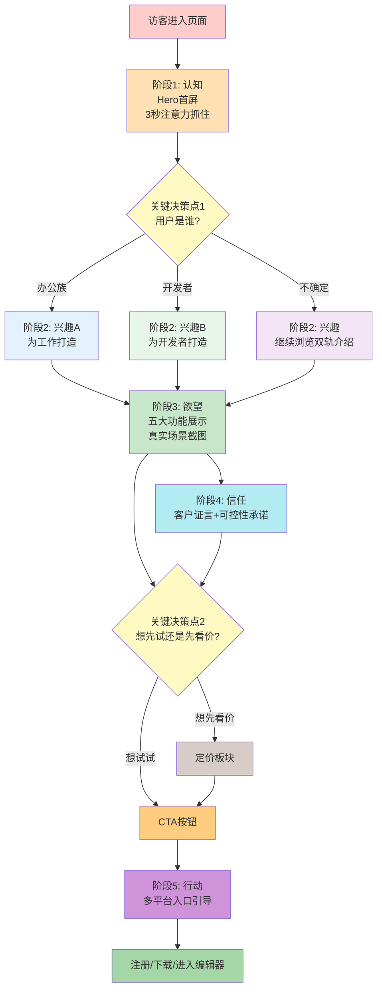

用户流程设计的核心目标是：**让用户在任何时候想行动，都有清晰的路径；让用户在任何时候犹豫，都有说服他的内容；让用户在任何时候想离开，都有一个理由让他再往下看看**。

---

## 二、访客旅程地图：AIDA五阶段转化路径

Codex 的访客旅程严格遵循 AIDA 模型（Attention 注意→Interest 兴趣→Desire 欲望→Action 行动），并在信任建立上额外增加了一个 Conviction（确信）阶段，形成完整的五阶段转化路径。

### 2.1 阶段一：认知（Attention）——首屏3秒抓住注意力

用户打开网页的前3秒是黄金时间——这3秒内他会决定"这个网站跟我有关系吗？我要不要继续往下看？"如果3秒内没抓住他，他就会关掉页面走了。

Codex 首屏（Hero 区域）的3秒注意力设计：

| 元素 | 位置 | 作用 | 用户心理反应 |
|---|---|---|---|
| **大标题：Codex** | 正中央最大字号 | 直接报品牌名，建立第一认知 | "哦，这是Codex，听过/没听过但记住了" |
| **副标题：你的AI工作助手** | 大标题下方 | 一句话说清产品是什么 | "AI工作助手——就是帮我干活的" |
| **客户Logo墙** | Hero区域下方 | 第一时间展示社会认同 | "Cisco/Duolingo这些大公司都在用，应该靠谱" |
| **主CTA按钮：立即试用 Codex** | Hero正中央，最醒目 | 给急性子用户立即行动的出口 | "看起来不错，我先点进去看看" |
| **双轨分流入口** | CTA下方 | 直接问"你是哪类用户？" | "我是开发者，点这边看看" |

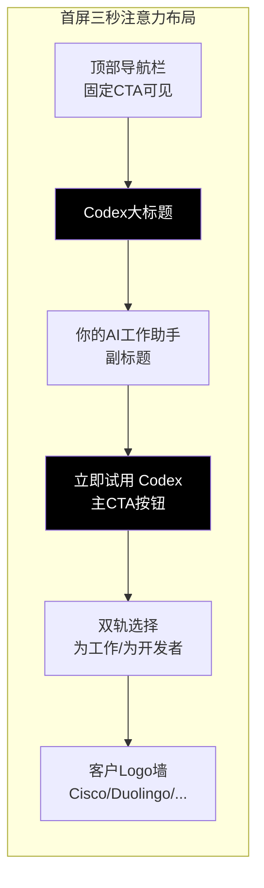

**首屏设计的关键原则**：
1. **信息极简**：首屏没有任何多余信息，用户3秒内就能看完并理解核心价值
2. **视觉聚焦**：大标题→副标题→CTA是一条清晰的视觉流，用户眼睛自然从上往下看
3. **风险提示前置**：Logo墙在第一屏就出现，立刻打消"这是不是小作坊"的疑虑
4. **出口随时在**：CTA在第一屏正中央，不需要往下翻就能点

很多产品网站首屏喜欢放"炫酷的动画""复杂的3D效果""大段的介绍文字"——这些都是错误的。首屏的唯一任务是"抓住注意力，说清是什么，给一个行动入口"，任何分散注意力的东西都是干扰。

### 2.2 阶段二：兴趣（Interest）——双轨定位让用户自选路径

抓住注意力之后，第二个任务是建立兴趣：让用户觉得"这东西跟我有关系，我想多了解一点"。

Codex 建立兴趣的方式不是"我给你看所有功能"，而是**立刻让用户自己选择路径**——"你是为工作来的，还是为写代码来的？"

#### 双轨分流设计细节

双轨选择区域就在首屏CTA下方，两栏并排，视觉权重完全相等：

| 轨道 | 左栏：为工作打造 | 右栏：为开发者打造 |
|---|---|---|
| **图标** | 文档/表格/幻灯片类办公图标 | 代码/终端/编辑器类开发图标 |
| **标题文案** | 为工作打造的 Codex | 为开发者打造的 Codex |
| **场景描述** | 几分钟内创建文档、电子表格和幻灯片，实现重复性任务自动化 | 在日常工作流中编写、理解和审查代码 |
| **典型场景列举** | 管理层简报、KPI汇报、财务审计、招聘资料包 | 跨团队重构、代码审查、调试修复、PR审查 |
| **用户看到后的反应** | "哦，这边是讲给我听的，我是做运营的" | "哦，这边是给程序员的，我是工程师，点这个" |

**为什么双轨分流在这个位置出现？**

这个时机非常关键：
- 用户刚看完"Codex是你的AI工作助手"，知道了产品大方向
- 他正在想"这个助手具体能帮我做什么？"
- 这时候立刻问"你是哪类用户？"，他会自然地选择和自己相关的那一栏
- 选完之后进入定制化页面，看到的全是和他相关的场景——兴趣瞬间建立

如果反过来，先放一大堆功能列表，再让用户选，效果就差很多——因为用户在看功能列表的时候已经在"筛选跟我有关的信息"，这个过程很费力，费力就会流失。

#### 关键决策点1：用户是办公族还是开发者？

这是整个用户流程中第一个也是最重要的决策点。Codex 的处理方式是"用户自我选择"，而不是"我们猜你是谁"。

```mermaid
graph TD
    V["访客"] --> ID{"自我识别"}
    ID -->|"我是职场人士<br/>非技术"| W["进入for-work页面<br/>办公场景专属内容"]
    ID -->|"我是开发者<br/>写代码"| D["进入for-developers页面<br/>开发场景专属内容"]
    ID -->|"我两者都是<br/>或不确定"| M["留在首页继续看<br/>或两边都看看"]
    W --> C1[看到KPI/财务/招聘场景<br/>"对，这就是我要做的事"]
    D --> C2[看到调试/PR/重构场景<br/>"对，这就是我的痛点"]
    M --> C1
    M --> C2
    C1 --> I["兴趣建立<br/>想继续了解"]
    C2 --> I
    style W fill:#e3f2fd
    style D fill:#e8f5e9
    style M fill:#f3e5f5
```

**为什么不做智能识别自动分流？**

很多产品会想："我们能不能根据用户UA、来源、IP自动判断他是开发者还是办公族，自动跳转到对应页面？"Codex 没有这么做，这是明智的：
1. **判断不准**：很多开发者上班也会看办公内容，很多产品经理也会关心开发功能——自动判断错误率很高
2. **剥夺控制权**：用户自己选的路径，他有掌控感；被强制跳转到某个页面，他会觉得"你怎么知道我要哪个？"
3. **降低认知**：让用户自己选，本身就是一个"这个产品懂我"的信号——"它知道有不同用户，为不同用户准备了不同内容"

### 2.3 阶段三：欲望（Desire）——五大功能模块建立具体价值

兴趣建立之后，需要把兴趣转化为"我想要"——这就是欲望阶段。欲望不是"这个东西不错"，而是"这个东西能解决我的具体痛点，我需要它"。

Codex 建立欲望的方式是**五大功能模块，每个配真实场景截图，展示具体价值**。不是抽象讲"AI很强大"，而是一个一个讲"它能帮你做什么具体的事，做完是什么样"。

#### 五大功能的欲望建立逻辑

五个功能按照"研究→产出→自动化→团队→可控"的逻辑顺序排列，层层递进建立欲望：

| 功能顺序 | 功能标题 | 解决的用户痛点 | 展示方式 | 欲望建立逻辑 |
|---|---|---|---|---|
| **功能1** | 把任务背后的文件、对话、代码关联起来 | "我要做一件事，需要在5个工具里找资料，来回切换烦死了" | 真实场景截图：调查物流延迟，Gmail+Drive+Slack内容汇总 | "它能帮我把散落在各处的信息拼起来，不用我自己找了" |
| **功能2** | 产出你可以直接评审、完善和使用的工作成果 | "AI生成的东西都不能直接用，还要我大改" | 真实截图：生成好的文档/表格/代码diff | "它产出的东西不是草稿，是差不多能用的，我只要审一下就行" |
| **功能3** | 自动抓取最新上下文，变成可重复流程 | "这件事我每周都要做，每次都要重复一遍" | 自动化流程示意图 | "我教它一次，以后它就能自动做了，不用我每次重复" |
| **功能4** | 服务于团队日常工作 | "AI是我一个人用的，团队协作怎么办？" | 多场景列举：KPI汇报、代码审查、管线更新 | "不是玩具，是真能在团队工作里用的" |
| **功能5** | 一切尽在你的掌控之中 | "AI会不会乱搞？做错了怎么办？" | 来源展示、diff预览、确认流程 | "不用担心，我始终有控制权" |

```mermaid
graph LR
    F1[功能1: 信息关联<br/>"不用我自己到处找资料"] --> F2[功能2: 直接产出<br/>"不是废稿，差不多能用"]
    F2 --> F3[功能3: 自动化<br/>"重复的事以后自动做"]
    F3 --> F4[功能4: 团队适用<br/>"不是个人玩具，团队能用"]
    F4 --> F5[功能5: 可控安全<br/>"不怕它乱搞，我说了算"]
    F1 --> D1["欲望开始: 这能省我时间"]
    F2 --> D2["欲望加深: 省的时间比我想的多"]
    F3 --> D3["欲望强化: 长期省时间"]
    F4 --> D4["欲望确认: 真的能用于工作"]
    F5 --> D5["欲望落地: 可以放心用"]
    style F1 fill:#ffe0b2
    style F2 fill:#ffcc80
    style F3 fill:#ffb74d
    style F4 fill:#ffa726
    style F5 fill:#ff9800
```

**每个功能模块的标准结构**：
1. **动词开头的标题**（我们在UX章节讲过）
2. **一句话解释**：这个功能是什么意思
3. **真实产品截图**：不是插画，不是概念图，是真实使用中的界面
4. **场景化描述**：具体在什么情况下你会用这个功能
5. **小CTA或过渡**：看完这个功能，引导继续看下一个，或者直接点击试用

这个结构的心理学逻辑是：**标题吸引注意→截图建立真实感→场景化描述让你代入→小CTA给冲动的用户出口**。

### 2.4 阶段四：信任（Conviction）——客户证言与可控性承诺

欲望建立起来了，用户已经"想要了"，但还有最后一道坎："我信得过吗？真的像说的那么好吗？"——这就是信任阶段，要把"我想要"变成"我相信它真的能做到，我敢试"。

Codex 的信任建立有两层：功能5的可控性承诺，以及客户证言板块。

| 信任层 | 内容 | 解决什么疑虑 |
|---|---|---|
| **功能5：可控性承诺** | 来源透明、假设明示、改动预览、确认后执行、可撤销 | "AI会不会自作主张搞砸我的东西？" |
| **客户Logo墙（重复出现）** | Cisco、Duolingo、Ramp、Wonderful等顶尖公司 | "大公司都在用，应该靠谱" |
| **开发者证言（for-developers页）** | 6位真实工程师的具体评价，带量化数据 | "和我一样的人用了真的觉得好" |
| **办公场景示例（for-work页）** | 具体的管理层简报、KPI汇报示例截图 | "不是概念，是真能做出这样的东西" |

```mermaid
graph TD
    D[用户有了欲望<br/>"我想要"] --> T1{"我还有什么顾虑?"}
    T1 -->|"AI乱搞怎么办"| C1[看功能5可控性<br/>"有预览,要我确认,能撤销"]
    T1 -->|"会不会是骗人的"| C2[看客户Logo<br/>"Cisco/Duolingo都在用"]
    T1 -->|"真的有说的那么好吗"| C3[看用户证言<br/>"跟我一样的人说真的好用"]
    T1 -->|"做出来的东西能用吗"| C4[看真实截图<br/>"真长这样,不是概念"]
    C1 --> CT[信任建立<br/>"可以试试"]
    C2 --> CT
    C3 --> CT
    C4 --> CT
    style D fill:#c8e6c9
    style CT fill:#a5d6a7
```

信任阶段的设计关键是**"打消最后的顾虑"**：用户到这一步已经想买/想试了，但他需要"最后一个理由"让他下定决心。不同用户的最后顾虑不一样，所以需要多个信任信号覆盖不同的顾虑——怕乱搞的看可控性，怕被骗的看Logo，怕不好用的看证言，怕假的看截图。

### 2.5 阶段五：行动（Action）——定价→CTA→多平台入口→注册

信任建立之后，用户准备采取行动了。行动阶段的设计目标是**"让行动尽可能简单，不要在最后一步设置障碍"**。

Codex 的行动路径不是"只有一个注册按钮"，而是设计了多层行动入口，覆盖不同用户的行动偏好：

| 行动路径 | 适合用户类型 | 设计位置 |
|---|---|---|
| **路径1：直接点CTA注册** | 冲动型、已经被说服的用户 | 导航栏、Hero、功能区之间、底部 |
| **路径2：先看定价再注册** | 理性型、关心价格的用户 | 导航栏有"定价"链接，功能区之后是定价板块 |
| **路径3：选平台再下载/进入** | 明确知道自己要用什么环境的开发者 | 多平台入口板块：Web/Editor/CLI/IDE/桌面/移动端 |
| **路径4：先看文档/指南再决定** | 谨慎型、想先了解清楚的用户 | 导航栏有"文档"链接，各板块有"了解更多" |

#### 关键决策点2：用户想先试还是先看价？

这是行动前的最后一个关键决策点。有些用户是"先试了再说，不好就走"，有些用户是"先看多少钱，值不值再试"——Codex 没有偏向任何一种，而是同时提供两个入口。

```mermaid
graph LR
    T["信任建立<br/>准备行动"] --> D{"决策类型"}
    D -->|"冲动型<br/>想直接试"| CTA[任意位置的<br/>"立即试用"按钮]
    D -->|"理性型<br/>先看价格"| PRICE["定价板块<br/>对比各套餐"]
    D -->|"明确工具链<br/>开发者"| PLAT["多平台入口<br/>选IDE/CLI/桌面"]
    D -->|"谨慎型<br/>先研究清楚"| DOC["文档/指南/<br/>了解更多"]
    PRICE --> CTA
    PLAT --> CTA
    DOC --> CTA
    CTA --> REG["注册/登录<br/>ChatGPT账号"]
    REG --> ONB["引导进入产品<br/>开始使用"]
    style CTA fill:#000000,color:#fff
    style REG fill:#a5d6a7
```

**为什么定价和CTA并列，而不是放在最后？**

很多网站的设计是"先讲完所有内容，最后才放定价"——这其实是错误的。理性用户在中途就会想"这个多少钱？"，如果这时候找不到定价，他可能会直接离开去搜价格，而不是继续往下翻。Codex 把"定价"放在导航栏里始终可见，同时在功能区之后立刻放定价板块——用户什么时候想看价格，什么时候就能看到。

---

## 三、转化漏斗设计：四次CTA重复覆盖所有决策类型

转化漏斗不是"一个大漏斗漏到底"，而是**在漏斗的每一层都有出口，让不同决策速度的用户都能在他想转化的时候转化**。

Codex 设计了四层CTA，形成一个"随处可见但不骚扰"的转化漏斗：

### 3.1 CTA四层漏斗结构

| CTA层级 | 位置 | 目标用户 | 转化时机 | 转化率预估 |
|---|---|---|---|---|
| **第一层：顶部固定CTA** | 导航栏右侧，滚动时始终固定在顶部 | 任何时候突然想试的用户、回头用户 | 用户在任何浏览位置突然决定"我要试试" | 5-10% |
| **第二层：Hero主CTA** | 首屏正中央，最醒目的位置 | 冲动型用户、已经听说过Codex慕名而来的用户 | 打开页面3秒内被说服 | 15-25% |
| **第三层：功能区后引导CTA** | 看完2-3个功能之后的板块间CTA | 兴趣被勾起来的用户、看到某个功能正好击中痛点的用户 | 看完某个功能，觉得"这个正是我需要的" | 20-30% |
| **第四层：底部重复CTA** | 页面最底部，大尺寸CTA区块 | 深思熟虑型用户、看完所有内容才做决定的用户 | 看完所有内容，信任完全建立 | 30-40% |

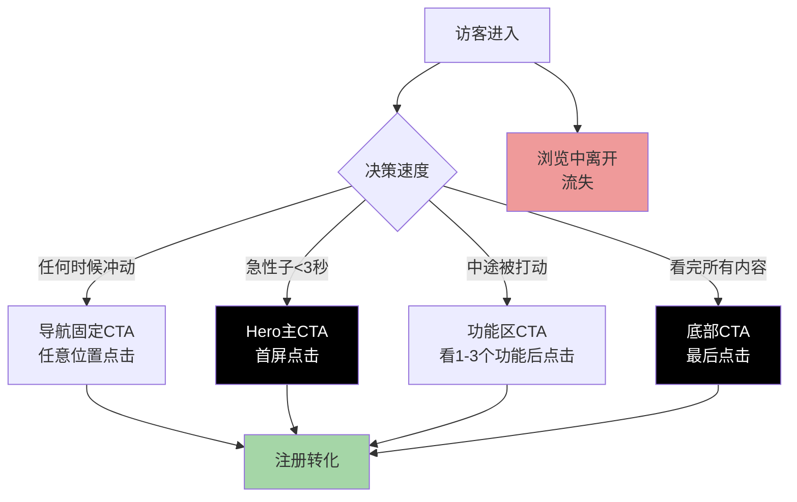

### 3.2 CTA漏斗设计的关键原则

**原则一：重复但不骚扰**

四次CTA看起来很多，但不会让用户觉得烦——因为：
- 每次出现都在"内容的自然终点"，不是突然弹出来挡路
- 同一屏永远只有一个主CTA是最醒目的，其他都是次要的
- 文案统一都是"立即试用 Codex"，重复加深记忆但不制造困惑
- 用户如果不想点，CTA就在那里不干扰阅读；想点的时候随时能找到

**原则二：不同位置CTA的视觉权重有区分**

不是所有CTA都一样大一样黑：
- Hero CTA最大最醒目——因为这是首屏的核心行动点
- 导航CTA稍小——因为它是"备用出口"，不抢Hero风头
- 板块间CTA中等大小——作为内容之间的过渡
- 底部CTA又变大——给看完所有内容的用户一个大的行动按钮

**原则三：给不点击的用户继续往下看的理由**

CTA不是"要么点要么走"——每个CTA旁边都有"继续了解"的暗示（比如下方就是下一个功能板块），用户不想点可以继续往下看，不会有压力。

---

## 四、导航交互设计

导航栏是网站的"地图"——用户任何时候迷路了，都会回到导航栏找方向。Codex 的导航设计简洁但功能完备，每一个交互细节都经过精心设计。

### 4.1 导航栏元素布局

Codex 导航栏采用经典的"左中右"布局，元素少而精：

| 位置 | 元素 | 交互方式 | 作用 |
|---|---|---|---|
| **左侧** | ChatGPT/Codex Logo | 点击回到ChatGPT首页 | 品牌识别，返回入口 |
| **中间/左侧** | 产品导航下拉 | hover展开下拉菜单 | 浏览ChatGPT其他产品 |
| **中间/右侧** | 主要导航项："在IDE中试用"下拉、定价、文档、更多 | hover展开/直接点击 | 核心功能入口 |
| **右侧** | 搜索图标 | 点击打开搜索框 | 搜索功能 |
| **右侧** | "登录"文字链接 | 点击跳转登录 | 已有账号用户入口 |
| **最右侧** | "立即试用"主CTA按钮 | 点击跳转注册/试用 | 主转化入口 |

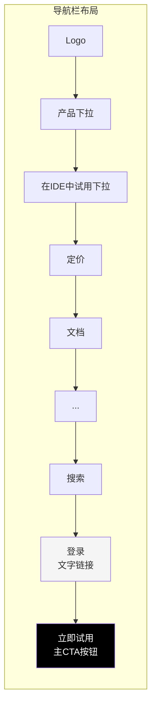

### 4.2 下拉菜单交互：hover展开

导航项的下拉菜单采用 **hover 触发**（鼠标移上去就展开，不需要点击），这是桌面端导航的最优交互：
- **效率高**：用户不需要点击，鼠标滑过就能看到下拉内容
- **符合预期**：绝大多数网站导航都是hover展开，用户已经形成习惯
- **可探索性**：用户随便滑一滑就能发现有哪些子项，鼓励探索

"在IDE中试用"下拉菜单是导航中最重要的下拉之一，我们在下文多平台入口部分详细讲。

### 4.3 语言切换

Codex 支持多语言，语言切换入口通常在页面底部或导航栏角落。语言切换的设计原则是：
- 不抢眼——不需要的用户不会注意到
- 好找——需要的用户能快速找到
- 保持选择——用户切换语言后，记住用户的偏好

### 4.4 登录vs试用双按钮设计

导航栏右侧两个行动按钮的设计非常讲究："登录"是低调的文字链接，"立即试用"是醒目的实心按钮——这个视觉层级差异是刻意的。

| 按钮 | 样式 | 为什么这么设计 |
|---|---|---|
| **登录** | 纯文字链接，无背景，黑色文字 | 登录是已有用户的行为，他们知道点哪里，不需要强调——如果把登录也做成按钮，会和"立即试用"抢注意力 |
| **立即试用** | 实心黑/白背景，白/黑文字，按钮样式 | 试用/注册是新用户的主要转化目标，需要最醒目——视觉上引导新用户点这个，老用户自然会找"登录" |

这个设计背后的逻辑是：**新用户是转化的主要目标，要引导他们点"试用"；老用户已经有账号，他们自己会找"登录"，不需要你把登录放得同样醒目**。很多网站把"登录"和"注册"做成两个一样大的按钮并排，结果是新用户犹豫点哪个，老用户也没觉得方便——两边不讨好。

---

## 五、多平台入口路径设计

Codex 不是只能在网页上用——它有完整的多平台支持。多平台入口板块是开发者转化的关键路径，因为开发者有强烈的工具链偏好（有人只在VS Code里写代码，有人离不开终端，有人用JetBrains）。

### 5.1 三大使用方式卡片入口

多平台板块首先展示三个大卡片，对应三种主要使用场景：

| 卡片 | 标题 | 描述 | 目标用户 |
|---|---|---|---|
| **卡片1** | 在 Codex 应用中开始 | 打开chatgpt.com/codex，在网页端开始 | 想快速体验、不想安装东西的用户、办公用户 |
| **卡片2** | 前往编辑器 | 进入代码审查/Diff界面，在编辑器中与Codex协同 | 想直接看代码审查功能的开发者 |
| **卡片3** | 在终端中继续操作 | 使用CLI工具，在命令行中工作 | 喜欢终端工作流、习惯命令行的高级开发者 |

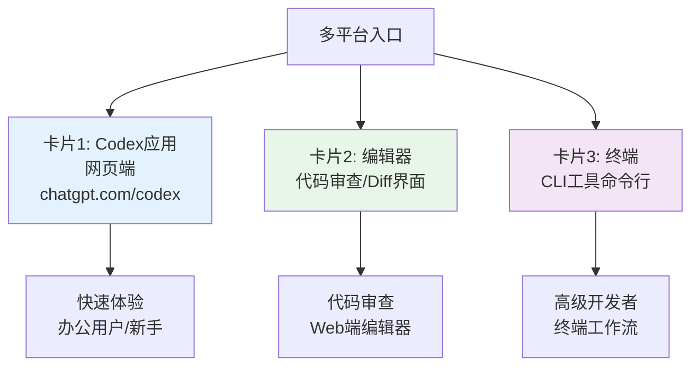

这三个卡片不是"平台列表"，而是"使用场景入口"——用户选择的不是"我要用网页"还是"我要用CLI"，而是"我想怎么开始工作"。

### 5.2 IDE快速入口：导航栏"在IDE中试用"下拉

对于已经明确知道自己要用什么IDE的开发者，Codex在导航栏设计了一个超级便捷的入口——"在IDE中试用"下拉菜单，直接列出7个入口：

| IDE/平台 | 入口链接 | 适合用户 |
|---|---|---|
| **VS Code** | marketplace.visualstudio.com/items?itemName=openai.chatgpt | 最大众化的IDE，绝大多数开发者 |
| **JetBrains IDEs** | JetBrains插件市场链接 | 用IntelliJ/PyCharm/WebStorm的Java/Python/前端开发者 |
| **Cursor** | Cursor内置/插件链接 | 用AI原生编辑器Cursor的开发者 |
| **Windsurf** | Windsurf内置/插件链接 | 用Windsurf编辑器的开发者 |
| **CLI** | npm安装指引 | 终端爱好者、Vim/Emacs用户 |
| **桌面应用** | 桌面版下载链接 | 喜欢独立桌面应用的用户 |
| **云端** | 云端开发环境入口 | 用Cloud IDE/远程开发的用户 |

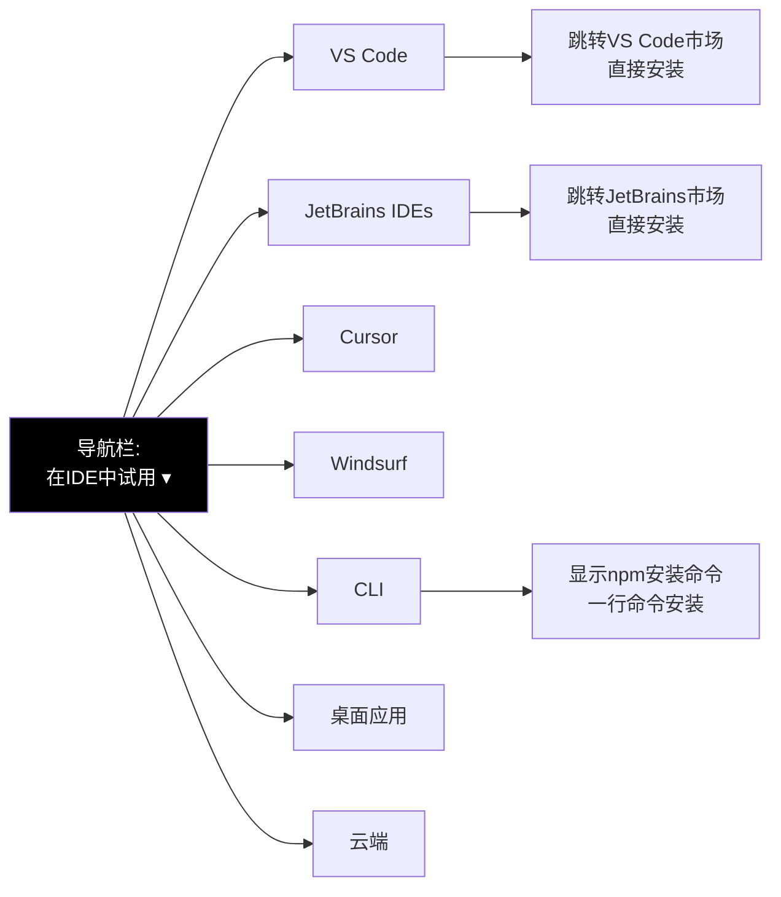

**为什么把IDE入口直接放在导航栏？**

这个设计极其方便开发者：
1. **不需要翻页找**——开发者打开网站，直接在导航栏点一下，选自己用的IDE，直接跳转到安装页面
2. **覆盖主流工具链**——VS Code/JetBrains/Cursor/Windsurf覆盖了90%以上的开发者
3. **零摩擦安装**——点一下直接到对应市场，点安装就好，不需要找下载链接
4. **传递信号**——"我们支持所有主流IDE，你不用换工具就能用"——这对开发者来说是非常重要的决策点

很多产品的IDE插件入口藏在"下载"页面的最底部，开发者找半天找不到——Codex把它放在最显眼的导航栏，就是告诉开发者："我们知道你想直接在你熟悉的工具里用，入口就在这里。"

---

## 六、移动端适配设计

超过一半的网页流量来自移动端，Codex 的移动端适配不是"把桌面版缩小"，而是**重新设计了移动端的交互逻辑，保证移动端体验同样顺畅**。

### 6.1 移动端导航：汉堡菜单

移动端屏幕小，放不下完整导航栏，所以导航折叠为汉堡菜单（右上角三条横线图标）：

| 移动端导航处理 | 设计细节 |
|---|---|
| **汉堡菜单按钮** | 右上角，点击展开全屏/侧滑导航菜单 |
| **Logo保留** | 左上角仍然显示Logo，保持品牌识别 |
| **CTA保留** | 导航栏右侧的"立即试用"CTA按钮保留——因为转化是核心目标，不能藏起来 |
| **展开后的菜单** | 所有导航项垂直排列，下拉变成折叠/展开的子项，方便手指点击 |

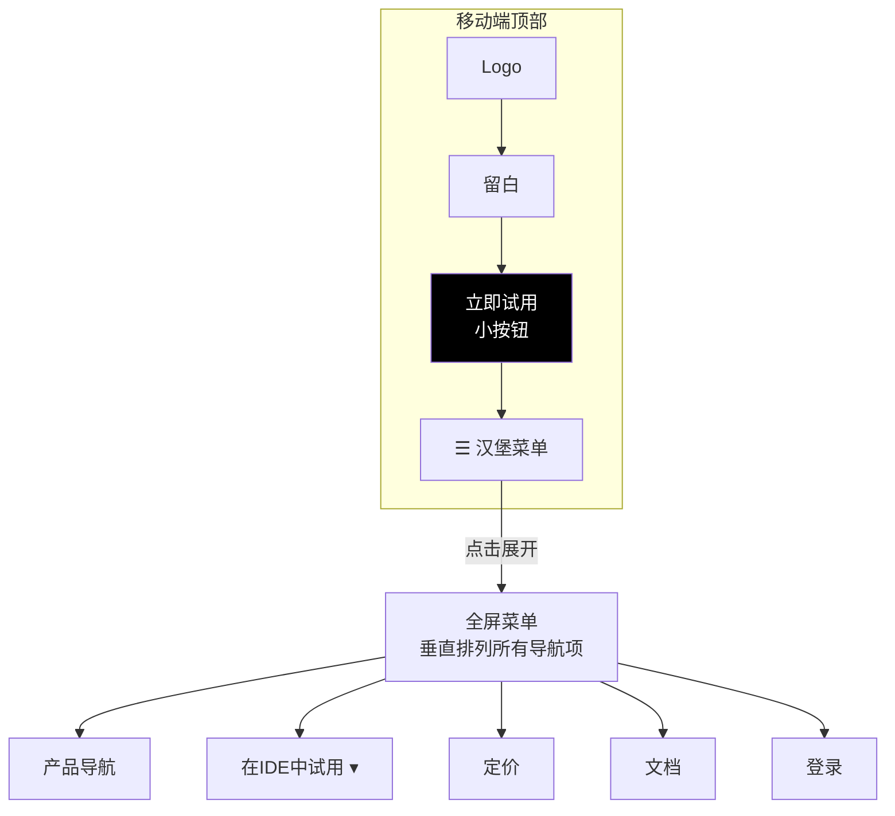

**移动端导航的关键原则：CTA永远不能藏**

很多移动端网站把所有东西都收进汉堡菜单，包括CTA——这是巨大的错误。用户在移动端想转化的时候，如果要先点汉堡、再找菜单项、再点CTA，三步操作会流失一半以上的人。Codex 保留"立即试用"在导航栏始终可见，就是为了让用户任何时候想试，点一下就好。

### 6.2 移动端内容布局：图片堆叠、单栏排列

桌面端的两栏布局、多列网格在移动端全部变成**单栏堆叠**，符合手机纵向阅读习惯：

| 元素 | 桌面端 | 移动端 |
|---|---|---|
| **双轨选择** | 左右两栏并排 | 上下堆叠，先"为工作"再"为开发者" |
| **多平台卡片** | 三栏并排 | 单列一个一个往下排 |
| **功能截图+文字** | 左右图文并排 | 上图下文/上文下图，单栏排列 |
| **客户Logo墙** | 一行5个Logo | 2个或3个一行，分多行排列 |
| **定价表** | 多档并排对比 | 单列，一档占一屏，左右滑动对比或上下排列 |

### 6.3 移动端CTA：保持可见、尺寸适合点击

移动端CTA设计有两个关键：
1. **始终可见**：和桌面端一样，滚动时CTA要么固定在顶部，要么在关键位置反复出现
2. **尺寸足够大**：按钮最小尺寸要符合手指点击标准（至少44x44像素），不能太小点不到

移动端用户的浏览习惯是"快速上下滑动"，所以Codex在移动端的内容之间、底部都放置了CTA，保证用户滑到那里，想点就能点到。

---

## 七、用户流程关键节点转化率分析

虽然我们没有Codex的真实数据，但基于SaaS行业最佳实践和页面设计分析，我们可以推断出各关键节点的典型转化率，并设计优化方向：

```mermaid
funnel
    title 用户转化漏斗典型转化率
    A["访客到达页面<br/>100%"]
    B["3秒内没有离开<br/>60-70%"]
    C["看到双轨分流并选择<br/>50-60%"]
    D["看完至少2个功能<br/>40-50%"]
    E["看到定价/证言板块<br/>30-40%"]
    F["点击任意CTA<br/>15-25%"]
    G["完成注册<br/>8-15%"]
    H["进入产品开始使用<br/>5-10%"]
```

| 漏斗节点 | 典型转化率 | 流失原因 | 优化设计（Codex已做的） |
|---|---|---|---|
| **到达→停留3秒** | 60-70% | 首屏不吸引人、加载慢、不是想看的内容 | 极简设计、秒开、一句话说清产品 |
| **停留→选双轨** | 50-60% | 不知道跟自己有没有关系、内容不相关 | 第一时间双轨分流，用户自己选 |
| **选双轨→看功能** | 40-50% | 内容无聊、没看到想看的场景 | 真实场景截图、场景化文案 |
| **看功能→看到定价** | 30-40% | 太长不想往下翻、没被说服 | 板块间CTA给中途退出、功能层层递进 |
| **看到定价→点CTA** | 15-25% | 价格不合适、信任还不够 | 免费试用入口、多层信任信号 |
| **点CTA→完成注册** | 8-15% | 注册流程太复杂、要填太多信息 | ChatGPT账号一键登录/注册，极简流程 |
| **注册→开始使用** | 5-10% | 不知道怎么开始、引导不好 | 多平台入口直接选环境、入门引导 |

---

## 八、场景还原：两条端到端完整用户旅程

前面分析了用户流程的各个阶段和节点，现在我们用两个典型用户的完整旅程，把所有元素串联起来，看Codex的流程设计如何在真实场景中发挥作用。

### 8.1 旅程一：回头用户陈磊的30秒快速转化

陈磊是一家SaaS公司的后端工程师，上周在同事那里听说了Codex，但当时忙着上线没仔细看。今天他的Stripe webhook又出问题了，想起同事说"Codex调试Stripe特别快"，于是直接打开chatgpt.com/codex。

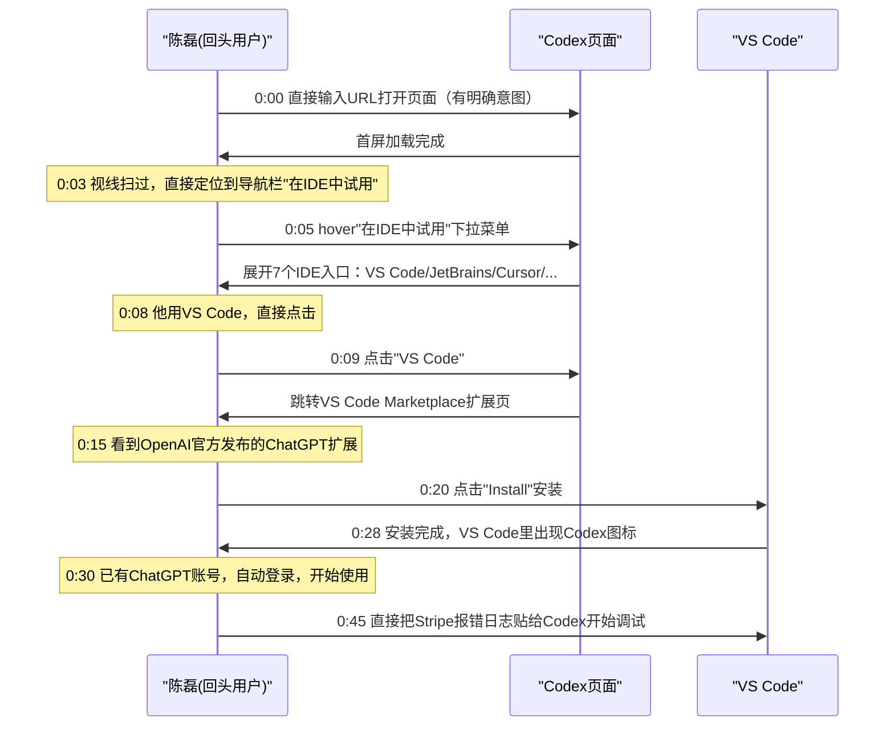

**这个旅程的设计关键点**：
1. **意图明确用户的路径极短**：陈磊已经知道自己要什么，Codex没有强迫他再看一遍功能介绍——导航栏的IDE入口直接满足了他的需求，从打开页面到开始使用仅30秒
2. **导航栏作为快捷入口**："在IDE中试用"放在导航栏最醒目的位置之一，目的用户一眼就能找到
3. **记住登录状态**：他已有ChatGPT账号，安装后自动登录，不需要重新注册——这是利用ChatGPT已有用户池的巨大优势
4. **全程零摩擦**：打开→点击→安装→使用，四步完成，中间没有任何弹窗、问卷、教程打断

**对比：传统产品的回头用户路径**

| 步骤 | 传统产品 | Codex |
|---|---|---|
| 找下载入口 | 进官网→找"产品"→找"下载"→选平台（5-8次点击） | 导航栏→hover→选VS Code（2次点击） |
| 注册/登录 | 下载完要重新注册/填信息 | 已有ChatGPT账号自动登录 |
| 开始使用 | 看完欢迎页→跳过教程→选模板→配置→开始 | 安装完直接在IDE里开始用 |
| 总时间 | 3-10分钟 | 30秒 |

### 8.2 旅程二：首次访客林晓的7分钟深度转化

林晓是一家电商公司的运营经理，在朋友圈看到有人分享"AI帮你做周报"，好奇点开链接。她之前从没听说过Codex，对AI工具半信半疑。

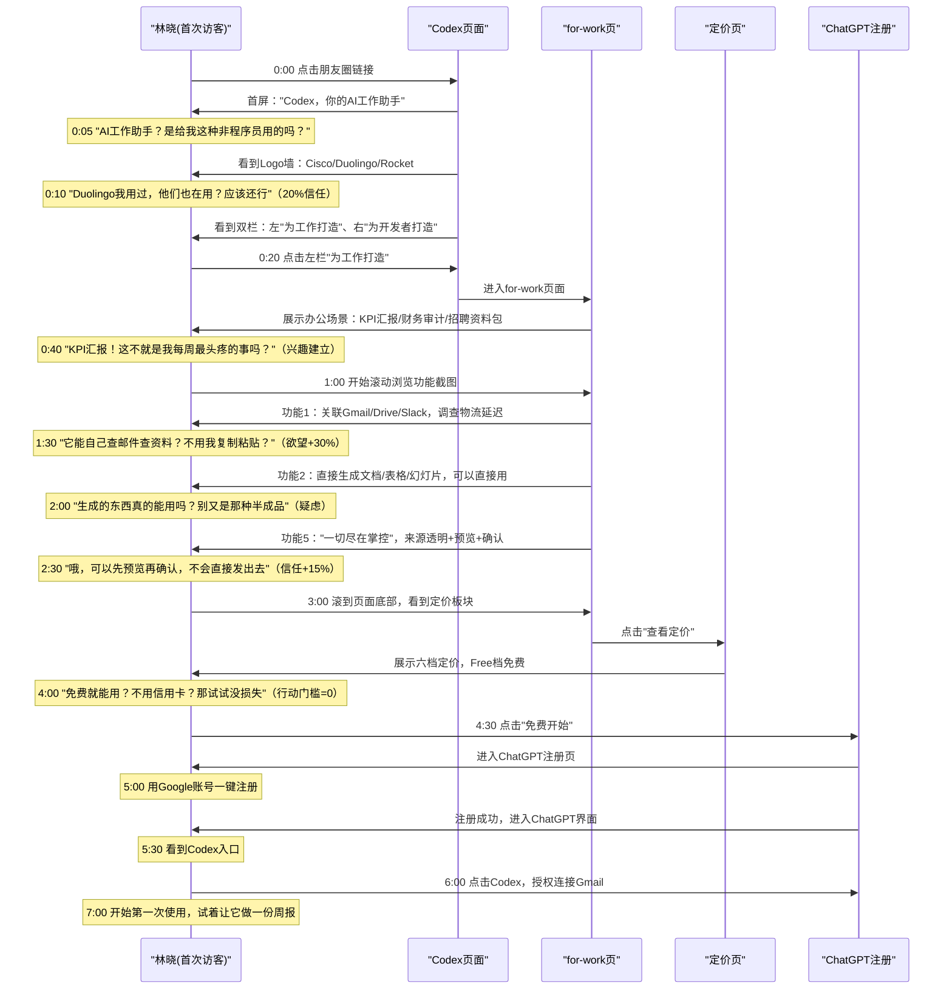

**林晓旅程的关键设计洞察**：
1. **每一个疑虑都被即时回应**："非程序员能用吗？"→双栏左栏；"做KPI？"→办公场景；"能用吗？"→真实截图；"会不会乱搞？"→可控性；"多少钱？"→免费档
2. **信任是逐步累积的**：从Logo墙的20%→场景共鸣→可控性+15%→免费零风险→最终行动，每一步都在加信任度
3. **好奇心驱动路径**：林晓没有被强迫走某条路，她是自然地从"这是什么"→"跟我有关吗"→"能做什么"→"靠谱吗"→"多少钱"→"试试"一路探索下来
4. **关键决策点都有分支路径**：想看场景点左栏、想知道多少钱点定价、想直接试点CTA——每条路径都通，不会卡住
5. **注册门槛极低**：Google/微软账号一键登录，不要填姓名、公司、手机号——摩擦最小化

---

## 九、注册与Onboarding流程：转化后的第一步

点击CTA不是旅程的终点——注册流程和新手引导决定了"注册了但没用"和"注册了就开始用"之间的差距。

### 9.1 注册流程极简设计

Codex利用ChatGPT的已有账号体系，注册流程设计得极其简单：

| 注册步骤 | 设计 | 为什么这样设计 |
|---|---|---|
| **点击CTA** | "立即试用 Codex" → 跳转到ChatGPT登录/注册页 | 统一账号体系，不需要新注册系统 |
| **注册方式** | Google一键登录 / 微软账号 / Apple ID / 邮箱注册 | 提供主流SSO，2秒注册完；邮箱作为备选 |
| **必填信息** | 几乎零必填：邮箱+密码即可 | 不要姓名、不要公司、不要手机号、不要职位 |
| **邮箱验证** | 可选或延后验证 | 不立刻拦在验证环节——让用户先进产品再验证 |
| **引导选择** | 注册后立刻进入产品界面，无强制问卷/引导页 | 不要打断用户的使用冲动 |

**常见注册流程反模式 vs Codex做法**：

| 反模式 | 危害 | Codex做法 |
|---|---|---|
| 必须填5+个字段（姓名/公司/职位/手机号/用途） | 每多一个字段流失10-15%用户 | 邮箱+密码即可，或SSO一键登录 |
| 注册前强制看教程视频/功能介绍 | 用户已经想试了，还被迫看内容，急躁 | 注册完直接进产品，需要时再看教程 |
| 邮箱验证必须先完成才能进产品 | 验证码延迟→用户去邮箱→忘了回来→流失 | 先进产品，友好提示验证，不强制阻断 |
| 注册完弹"选择套餐" | 用户还没开始用就让付费，直接吓跑 | Free档默认选择，付费功能自然露出 |
| 弹"邀请你的团队" | 自己还没用就叫拉人，用户反感 | 先用起来，团队功能自然呈现 |

### 9.2 首日体验（First-Day Experience）设计

注册完成后的第一次使用体验，决定了用户是否会在第二天回来：

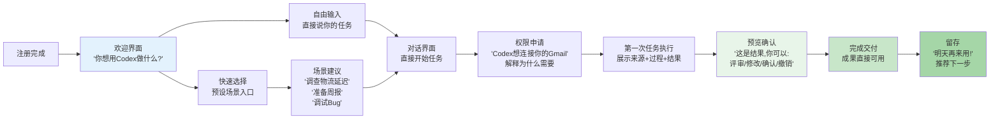

**首日体验的关键设计原则**：
1. **30秒内给出第一个价值**：用户注册完30秒内就要让他看到产品的价值——不要让他配置10分钟还没开始用
2. **预设场景降低空白页焦虑**：新用户面对空白输入框会不知道说什么——给预设场景建议（"准备周报""调试Bug"）
3. **解释权限请求**："Codex想连接你的Gmail"时要说明为什么——"这样我才能帮你查找邮件中的物流信息"，不要只说"需要权限"
4. **第一次任务选"容易赢"的**：让用户第一次就完成一个有成就感的小任务，不要一开始就做复杂的事
5. **结果展示强化可控性**：第一次展示结果就要让用户看到来源、过程、预览选项——从一开始就建立"尽在掌控"的信任

### 9.3 流失点分析与回拉策略

即使设计得再好，也会有用户在不同阶段流失。Codex在关键流失点设计了回拉策略：

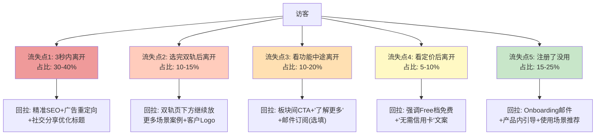

**最大流失点：3秒内离开（30-40%）**

这是所有网站最大的流失点，原因通常是：
- 进来发现不是自己要找的内容（来源误导）
- 页面加载太慢（3秒没加载完就走了）
- 首屏看不懂/不吸引

**Codex的应对**：
1. **极致的页面加载速度**：轻量页面、无大体积资源、系统字体——秒开
2. **一句话说清产品**："你的AI工作助手"——0.5秒理解
3. **SEO/分享标题优化**：确保搜索结果和社交分享的标题/描述准确，不误导用户
4. **精准投放**：广告和推荐来源精准，不让无关用户误点进来

**第二大流失点：注册了没用（15-25%）**

用户注册了但没真正使用产品，原因是：
- 不知道从何开始（空白页焦虑）
- 第一次使用体验不好
- 注册完就被别的事打断了，忘了回来

**Codex的应对**：
1. **预设场景快速启动**（前面讲过）
2. **欢迎邮件**：注册后第一封邮件给"3个你可以今天尝试的任务"
3. **产品内Nudge**：登录后有温和提示"试试连接你的第一个工具"
4. **浏览器通知（选opt-in）**：任务完成时通知，拉回产品

---

## 十、用户流程反模式：8个常见错误

优秀的用户流程不是"添加了什么好设计"，而是"避免了多少坏设计"。以下是产品官网最常见的8种用户流程反模式：

| 反模式 | 典型表现 | 危害 | Codex的规避 |
|---|---|---|---|
| **强制导览隧道** | 必须看完5页产品介绍才能点CTA注册 | 急性子用户直接走，转化率暴跌 | CTA随处可见，任何时候想试就试 |
| **注册墙阻断** | 想看到定价/功能必须先注册登录 | 用户还没被说服就要注册，80%流失 | 所有内容完全开放，想注册才注册 |
| **单一CTA路径** | 只有底部一个CTA，中途没有出口 | 急性子用户要翻到底才能转化，中途就走了 | 四层CTA漏斗，每层都有出口 |
| **不区分用户** | 所有用户看同一套内容 | 办公用户看到代码以为不是给自己的，反之亦然 | 双轨分流，用户自选路径 |
| **注册流程太长** | 5+字段+邮箱验证+选择套餐+邀请团队 | 每一步流失10-20%，最终注册率极低 | SSO一键登录+零必填字段 |
| **移动端CTA藏进汉堡** | 移动端所有导航和CTA都收进汉堡菜单 | 想转化要先点菜单再找CTA，流失严重 | CTA保留在导航栏外，始终可见 |
| **平台入口难找** | IDE/CLI/桌面入口藏在"下载"子页面 | 开发者找半天找不到安装入口 | 导航栏直接列出7个平台，一次点击 |
| **虚假紧迫感** | "仅剩2个名额！""优惠马上结束！" | 对B端/工具产品无效，损害品牌信任 | 无虚假营销，靠产品价值和信任转化 |

### 用户流程自检清单

设计或审查产品官网的用户流程时，可以用以下清单：

- [ ] 首屏3秒内是否说清了"这是什么、对我有什么用"？
- [ ] 不同类型的用户是否有独立路径？是否能在5秒内选择自己的路径？
- [ ] CTA是否覆盖了冲动型和深思熟虑型用户？导航/首屏/中途/底部都有吗？
- [ ] 所有功能/定价/文档是否完全开放，不强制登录？
- [ ] 注册流程是否可以用SSO一键完成？必填字段是否≤3个？
- [ ] 移动端CTA是否保留在菜单外，始终可见？
- [ ] 开发者/特殊用户群是否有直达入口（IDE下载/CLI安装等）？
- [ ] 用户每一个可能的疑虑是否都有对应内容去打消？
- [ ] 注册后30秒内用户是否能开始第一次有价值的使用？
- [ ] 最大的流失点（3秒离开+注册未用）是否有对应的回拉策略？

---

## 十一、用户交互流程设计总结

Codex 的用户交互流程是一套**精心编排的转化机器**——每一个元素、每一个位置、每一次交互，都经过深思熟虑，目的只有一个：让访客顺畅地从"进来看看"变成"开始使用"。

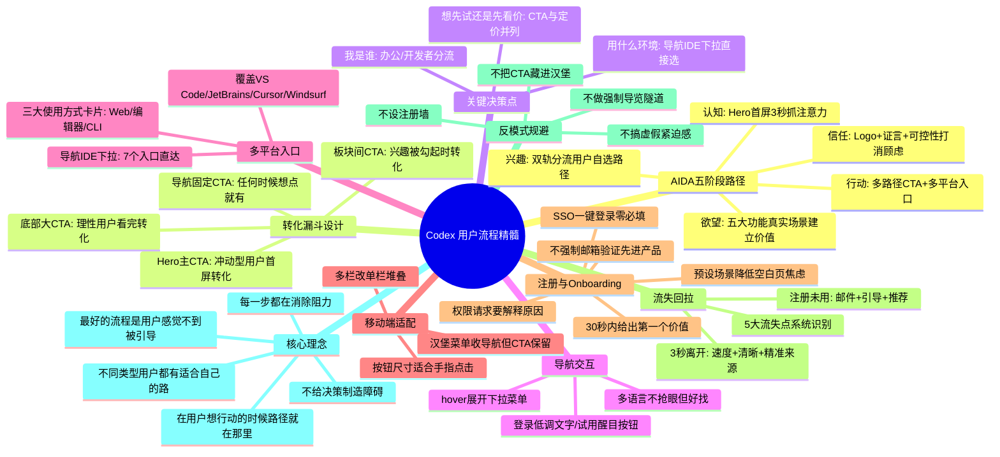

**可直接复用的用户流程设计原则**：

1. **首屏3秒定生死**：大标题+一句话说清是什么+社会认同+CTA——不要放多余的东西。
2. **用户分流要早**：用户知道"这东西跟我有关系"之后立刻让他选路径，不要让他在一堆不相关的信息里筛选。
3. **CTA要重复但不骚扰**：导航固定+Hero+板块间+底部——四个位置，覆盖急性子和慢性子。
4. **关键决策点给选项，不要替用户选**：是办公还是开发？想试还是想看价？让用户自己选，不要猜。
5. **导航要克制**：元素不要多，登录低调、CTA醒目、下拉hover展开、核心入口（如IDE）放在最显眼的地方。
6. **多平台/多工具用户要给直达入口**：不要让用VS Code的用户去"下载页面"找半天，直接在导航栏给他VS Code入口。
7. **移动端CTA不能藏**：哪怕所有导航都收进汉堡菜单，主CTA也要留在外面——那是转化的命门。
8. **转化漏斗要每层都有出口**：不要想着"所有人都看完所有内容再转化"——不同人决策速度不一样，每层都给出口。
9. **注册流程摩擦要最小化**：SSO一键登录、必填字段≤3个、邮箱验证延后、不强制选套餐/邀请团队——多一步就多一层流失。
10. **Onboarding要30秒内给价值**：新用户进来30秒内就要让他完成第一个有成就感的任务，预设场景、解释权限、第一次就展示"尽在掌控"。

### 用户流程 Do / Don't 速查表

| 流程决策 | ✅ Do（Codex的做法） | ❌ Don't（常见错误） |
|---|---|---|
| **首屏内容** | 标题+副标题+CTA+Logo+双轨分流，3秒看懂 | 视频背景+轮播图+弹窗+3屏高的Hero区域 |
| **用户分流** | Hero后立刻双栏等权重视觉分流，用户自选 | 所有用户看同一套内容，或用智能识别强制跳转 |
| **CTA策略** | 四层漏斗（导航/Hero/中途/底部），文案统一"立即试用" | 只在底部放CTA，或满屏都是大按钮让人选择困难 |
| **行动路径** | 4条行动路径（直接试/看定价/选平台/看文档），都通向注册 | 只有一个"注册"按钮，理性用户无处可去 |
| **平台入口** | 导航栏IDE下拉7个入口直达，一次点击到安装页 | 所有平台藏在"下载中心"里，要点3-5次才能找到 |
| **注册流程** | SSO一键登录，邮箱+密码即可，不强制验证 | 5+必填字段+强制邮箱验证+选套餐+邀请团队 |
| **定价位置** | 导航始终可见+功能区后立刻定价板块 | 定价藏在"联系销售"后或页面最底部 |
| **内容开放** | 所有功能/定价/文档完全开放，不注册也能看 | 强制注册/登录才能看功能和定价 |
| **移动端导航** | 汉堡收导航但CTA保留在外面，触控目标≥44px | 所有东西都收进汉堡，CTA要先开菜单再找 |
| **Onboarding** | 预设场景快速启动，30秒内完成第一个任务 | 强制5页欢迎教程+配置向导+功能介绍 |
| **紧迫感营造** | 靠产品价值和信任，不搞虚假倒计时 | "仅剩2个名额""优惠24小时后结束"虚假营销 |
| **回拉策略** | 精准SEO+重定向+欢迎邮件+产品内引导 | 弹"确定要离开吗？"弹窗、发垃圾营销邮件 |
| **登录入口** | 低调文字链接，与主CTA形成视觉对比 | "登录"和"注册"做成两个一样大的按钮并排 |
| **流失处理** | 识别5大流失点，每个都有对应的回拉策略 | 不分析流失原因，只怪"转化率低" |
| **权限请求** | 解释为什么需要权限（"帮你查找邮件中的物流信息"） | 只说"需要Gmail权限"不解释原因 |

Codex 的用户流程设计告诉我们：最好的用户流程不是"用户必须按我设计的路径一步一步走"，而是**无论用户想怎么走、想在哪里停、想在哪里行动，都有顺畅的路径等着他——整个过程自然得让他感觉不到"被引导"了**。这就是用户体验设计的"看不见的设计"。

---

**下一步**：继续阅读 [07 双轨产品策略解析](07-dual-track-strategy.md)，理解Codex如何用同一产品内核服务办公用户和开发者两大差异群体，掌握双轨叙事的设计方法。
