## 一、双轨策略核心：一个产品内核，两套价值叙事

在SaaS产品设计中，有一个经典难题：**当你的产品同时服务于差异极大的两类用户时，怎么讲产品故事？**

如果你只讲A用户的场景，B用户觉得"这不是给我用的"；如果你只讲B用户的场景，A用户走了；如果你混在一起讲，两边都觉得"好像跟我关系不大"。绝大多数产品在这个问题上的选择是"做两个独立产品"——但这意味着双倍的研发成本、双倍的维护成本、分裂的产品认知。

ChatGPT Codex给出了一个极其聪明的答案：**双轨策略——一个产品内核，两套价值叙事**。

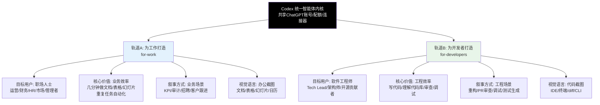

双轨策略的本质不是"做两个产品"，而是**"同一个底层能力，用两种语言讲给两种人听"**：

- 内核是同一个：同样的AI模型、同样的Agent能力、同样的连接器、同样的账号体系、同样的配额
- 包装是两套：不同的落地页、不同的场景案例、不同的视觉素材、不同的用户证言、不同的价值主张
- 入口是分流的：首页首屏就问"你是哪类用户？"，选完进入完全定制化的叙事空间
- 终点是同一个：无论从哪个轨道进来，最终都是注册ChatGPT账号，使用同一个Codex产品

这是产品策略上的"神来之笔"——它用一套研发成本，同时拿下了办公和开发两个巨大市场，又不会让任何一类用户觉得"这产品不是给我用的"。

---

## 二、轨道A：为工作打造的 Codex（for-work）

轨道A面向的是广阔的非技术职场用户市场——这是一个比开发者市场大得多，但也更难教育、更难说服的市场。Codex for-work 的核心是"用职场人听得懂的语言，讲清楚AI能帮他们做什么具体的工作"。

### 2.1 目标用户画像

for-work 页面的目标用户不是模糊的"白领"，而是非常具体的职场角色：

| 用户角色 | 典型痛点 | Codex能帮什么 |
|---|---|---|
| **管理者/总监** | 每周要准备管理层简报，要从Calendar、Slack、Drive里翻各种信息拼凑，太费时间 | 自动连接Calendar/Slack/Drive，基于最新的上下文生成管理层简报 |
| **运营人员** | 每周/每月要做KPI汇报，要从各个系统拉数据、做表格、写分析，重复劳动 | 自动拉取数据生成报表和分析，把卓越实践变成可重复流程 |
| **财务人员** | 财务审计要核对大量单据、找异常、写报告，枯燥但又不能出错 | 快速核对数据、识别异常项、生成审计初稿 |
| **HR/招聘** | 要整理招聘资料包、面试反馈、候选人评估，散落在各个工具里 | 自动汇总面试记录、生成候选人评估报告、整理招聘材料 |
| **市场/销售** | 客户跟进要准备QBR（季度业务回顾）、客户续约材料、跟进邮件 | 自动从邮件/CRM/文档里汇总客户信息，生成专业的汇报材料 |
| **产品经理** | 要写PRD、整理用户反馈、准备项目汇报、跟进工程进度 | 汇总用户反馈、生成需求文档初稿、同步工程进展 |

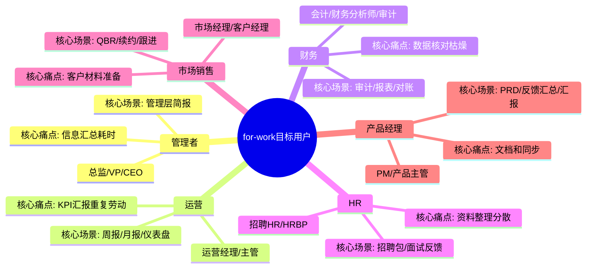

这些用户有几个共同特征：
1. **不写代码**——他们对"Agent""CLI""PR审查"这些词完全没概念，不要跟他们讲技术
2. **每天被重复劳动淹没**——他们不是不想做高价值的事，而是80%的时间花在找资料、拼表格、写格式固定的文档上
3. **对"AI能帮我做什么"没有想象力**——他们不知道AI能写文档做表格，需要你用具体场景展示给他们看
4. **决策偏感性**——他们不关心技术参数，关心"这能不能让我少加班""能不能让我在老板面前表现好"

### 2.2 核心价值主张

for-work 的核心价值主张用一句话概括就是：**"几分钟内创建文档、电子表格、幻灯片，实现重复性任务自动化，让你专注于真正重要的工作"**。

拆解一下这个价值主张的三层意思：

| 层次 | 文案 | 用户心理 |
|---|---|---|
| **第一层：具体产出** | "几分钟内创建文档、电子表格、幻灯片" | 不说"提高效率"这种虚的，直接说你能得到什么——文档、表格、幻灯片，都是他们每天做的东西 |
| **第二层：长期价值** | "实现重复性任务自动化" | 不只是一次帮你做，是教会它一次以后自动做——从"帮我干活"变成"有个助手" |
| **第三层：情感价值** | "专注于真正重要的工作" | 击中职场人的情感痛点：我不想把时间浪费在拼表格找资料上，我想做更有价值的事 |

这个价值主张没有一个技术词汇，全是职场人天天挂在嘴边的东西——文档、表格、幻灯片、重复性任务、重要的工作。每一个词都能让他们立刻联想到自己的日常工作。

### 2.3 典型工作场景

for-work 不是罗列功能，而是展示一个又一个"你在工作中一定会遇到的场景"，让用户看了觉得"对，这就是我每周/每天都要做的事"。

#### 场景1：管理层简报（核心演示场景）

这是for-work页面最核心的展示场景——基于Google Calendar、Slack、Google Drive的上下文创建管理层简报。

**场景描述**：
> "假设你是一个团队负责人，每周一要给管理层做周报。你需要翻过去一周的日历看开了什么会、去Slack找关键讨论、去Drive找相关文档，然后把这些信息拼起来写成一份简报——这个过程通常要花2-3个小时。"
>
> "有了Codex，你只需要说'帮我生成本周团队管理层简报'，它会自动去你的Calendar拿会议记录、去Slack找关键讨论、去Drive找相关文档，把这些信息汇总好，生成一份结构完整、数据准确的简报——你只需要花5分钟审核一下、改改细节，就能直接发出去。"

这个场景的配图是一个提示卡界面，展示了：
- 输入提示："生成本周管理层简报"
- 自动连接的工具图标：Calendar、Slack、Drive
- 生成好的简报预览：结构清晰、有要点、有数据

为什么"管理层简报"这个场景选得极好？
1. **几乎所有管理者都要做**——从组长到总监到VP，没有人逃得过写周报/简报
2. **痛点极痛**——收集信息、拼凑、格式化，非常耗时又没有成就感
3. **价值可感知**——从2-3小时到5分钟，这个时间差用户立刻能算出来"那我每周能省出大半天"
4. **展示了Codex的核心能力**：连接器、信息汇总、结构化产出——一个场景把多个核心能力都展示了

#### 其他典型场景

| 场景名称 | 具体描述 | 用户痛点 |
|---|---|---|
| **KPI汇报** | 自动拉取各系统数据，生成KPI完成情况报告，附趋势分析和异常说明 | 每月/每季度拉数据做图表，重复又机械 |
| **财务审计** | 核对交易记录、识别异常项、生成审计工作底稿和初步报告 | 对着一堆数字找问题，眼睛都花了还容易漏 |
| **招聘资料包** | 汇总候选人简历、面试记录、面试官反馈，生成统一的评估包 | 资料散在邮箱、文档、表格里，凑齐一套要半天 |
| **客户QBR准备** | 从邮件、CRM、支持工单里汇总客户使用情况、问题、进展，生成季度回顾材料 | 给大客户做QBR，材料准备就要一两天 |
| **周会纪要/行动项跟踪** | 自动整理会议记录，提取行动项、负责人、截止日期，自动同步到任务管理工具 | 开完会还要花半小时整理纪要和行动项 |

### 2.4 工作方式：四步建立信任

Codex for-work 不仅告诉用户"你能做什么"，还告诉用户"怎么开始用"——这对非技术用户尤其重要，因为他们面对AI会有点不知所措，不知道从哪里下手。

for-work 设计了非常清晰的"入门四步法"，从最简单的事开始，逐步建立信任：

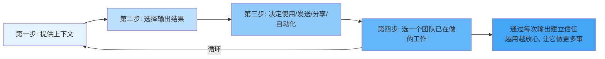

| 步骤 | 做什么 | 为什么这么设计 |
|---|---|---|
| **第一步：提供上下文** | 连接你正在用的工具（Gmail、Drive、Calendar、Slack），或者直接告诉Codex你要做什么 | 消除"我要怎么跟它说"的恐惧——不用学提示词，你连工具它自己找信息 |
| **第二步：选择输出结果** | 告诉它你想要什么：文档？表格？幻灯片？邮件？消息？ | 明确产出物，用户知道"我要的是这个"，不会觉得AI在瞎做 |
| **第三步：决定如何处理** | 看一下结果，你可以自己用、可以发邮件、可以分享到Slack、可以设置成自动化流程 | 控制权在用户——不是AI直接就发出去了，要用户决定怎么处理 |
| **第四步：从一件小事开始** | 不用一开始就把所有工作交给它，先选一件你们团队已经在做的重复性的小事试试 | 降低门槛——"先试一件小事，做好了再慢慢用更多"，消除"我要把所有工作都交给AI"的心理压力 |

这个四步法的设计精髓是**"低门槛起步，逐步建立信任"**：
- 不让用户一开始就"全面拥抱AI"——那太可怕了
- 从"一件小事"开始，做成了用户就会想"这个能帮我做周报，那能不能也帮我做月报？"
- 每一次成功的输出都在建立信任，信任越多用户越敢让它做更多事
- 最终结果是用户自然地把越来越多的重复工作交给Codex，而不是被强迫"你必须用AI"

### 2.5 配图与视觉语言

for-work 页面的视觉语言是纯办公场景，让用户一眼就觉得"这是我的世界"：

| 视觉元素 | 具体内容 | 为什么这么选 |
|---|---|---|
| **主要截图** | 文档、电子表格、幻灯片的界面——都是用户天天用的东西 | 熟悉感——"哦，生成的就是我平时用的文档/表格" |
| **工具图标** | Gmail、Google Calendar、Slack、Google Drive、Notion——都是办公族常用工具 | 认同感——"这些工具我每天都在用，它能连这些" |
| **场景配图** | 管理层简报的提示卡、生成好的文档预览、自动化流程设置 | 真实感——"真的长这样，不是概念图" |
| **配色风格** | 保持简洁专业，但更偏向柔和的商务色调 | 不那么"技术极客"，更亲和，适合办公用户 |

**核心原则：for-work 页面上看不到一行代码、看不到一个终端、看不到一个diff界面**——这些东西会让办公用户望而生畏，觉得"这不是给我用的"。整个页面全是他们熟悉的办公场景，代入感极强。

### 2.6 资源链接

在for-work页面的适当位置，会有几个关键的资源链接，引导用户继续深入：

| 链接 | 作用 |
|---|---|
| **Codex 指南** | 给想详细了解怎么用的用户——"想知道具体怎么操作？看指南" |
| **定价** | 给理性用户——"想知道多少钱？看定价" |
| **用例/客户案例** | 给还在犹豫的用户——"想看更多真实案例？看这里" |

这些链接都是"按需提供"——不会强推给你，但你想找的时候能找到。

---

## 三、轨道B：为开发者打造的 Codex（for-developers）

轨道B面向的是开发者市场——这是OpenAI的传统优势用户群，也是Codex最早的目标用户。但for-developers页面不是简单讲"Codex能写代码"，而是从开发者的真实工作痛点出发，用开发者听得懂的语言、用真实工程师的证言，讲清楚Codex在工程工作流中的价值。

### 3.1 目标用户画像

for-developers的目标用户覆盖了软件团队的各个角色：

| 用户角色 | 典型痛点 | Codex能帮什么 |
|---|---|---|
| **软件工程师** | 接陌生代码库看不懂、写重复代码烦、调试找Bug慢、写测试懒得写 | 快速理解陌生代码、写代码、调试Bug、自动生成测试 |
| **技术主管/Tech Lead** | 跨团队重构协调难、PR审查量大漏问题、团队代码质量参差不齐 | 跨文件重构+自动生成测试、PR审查发现漏洞、代码质量检查 |
| **架构师** | 评估技术方案、代码审查、理解大型系统 | 快速理解代码架构、审查关键代码、发现兼容性问题 |
| **开源贡献者/维护者** | 处理Issue、审查PR、写文档、多版本兼容 | 自动处理Issue、PR审查辅助、文档生成、兼容性问题发现 |
| **DevOps/SRE** | 写脚本、查日志、调试生产问题、自动化运维 | 日志分析、脚本生成、调试辅助、运维自动化 |

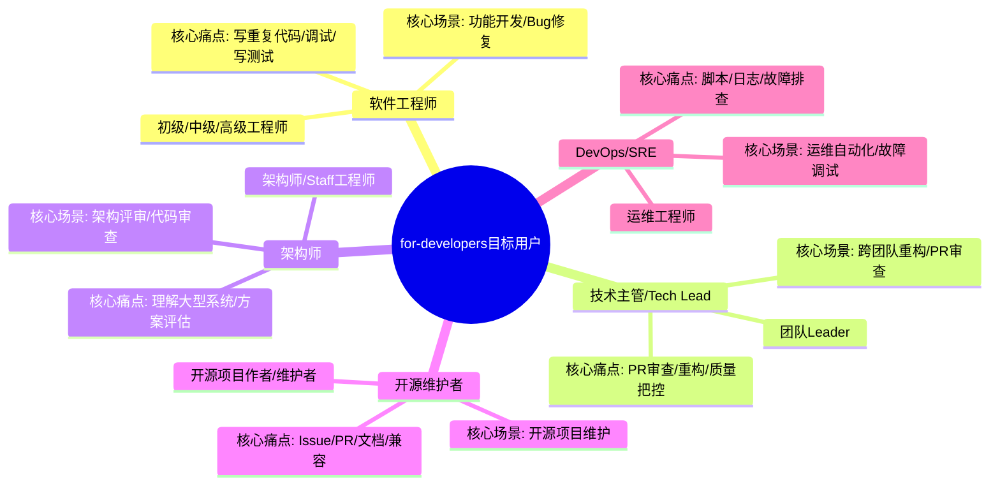

开发者用户有几个共同特征：
1. **懂技术**——他们知道CLI、IDE、PR、diff这些是什么，不用解释，甚至要讲得专业才信得过
2. **工具链固定**——他们有自己习惯用的编辑器（VS Code/JetBrains/Vim）、终端、工作流，不要让他们换工具
3. **看重真实案例和同行评价**——工程师不信广告，信其他工程师说的话——"这个跟我一样的人用了说好用，那可能真好用"
4. **决策偏理性**——他们会问"支持哪些IDE？""能不能接我现有的工作流？""CLI好用吗？"——要给出具体答案
5. **效率敏感**——时间是工程师最宝贵的资源，如果一个工具真能帮他们省时间，他们愿意学、愿意用、愿意付费

### 3.2 核心价值主张

for-developers的核心价值主张是：**"在日常工作流中编写代码、理解陌生代码库、进行代码审查、调试修复、开发任务自动化——不用换工具，在你已经在用的IDE/终端/编辑器里就能用"**。

拆解一下这个价值主张：

| 层次 | 文案 | 开发者心理 |
|---|---|---|
| **具体能力** | "编写代码、理解陌生代码库、进行代码审查、调试修复" | 列的全是工程师日常做的事——不是"AI写代码"这种空话，是具体的工作场景 |
| **工作流集成** | "在日常工作流中" | 最重要的一句话——不用换工作流，不是让你去某个新网页写代码 |
| **不换工具** | "在你已经在用的IDE/终端/编辑器里就能用" | 打消最大顾虑——"我不用换VS Code，我不用学新工具，在我熟悉的地方就能用" |

工程师对"让我换工具"这件事极其抵触——如果Codex说"来我们的网页编辑器写代码"，90%的工程师会直接关掉。但Codex说"在你已经用的VS Code、JetBrains、终端里就能用"，工程师的反应是"哦？那我试试，反正不用换工具"。

### 3.3 典型开发场景

for-developers展示的场景全是工程师日常工作中真实遇到的痛：

#### 场景1：跨团队代码重构+测试生成

**场景描述**：
> "你负责一个跨多个团队的大型重构——要改十几个文件、改API接口、保证向后兼容、还要给所有改动写测试。如果手动做，这件事可能要做一个季度，周末还要加班。"
>
> "用Codex，你可以在终端里告诉它要做什么重构，它会自动分析整个代码库、找出所有需要改的地方、进行改动、生成对应的测试——你只需要审查diff、跑测试、确认没问题，一个下午就能做完以前要一个季度的工作。"

这个场景直接对应后面Tres Wong-Godfrey（Cisco Meraki）的证言——"自动完成重构与测试生成，如期上线"。

#### 场景2：后端Python代码审查

**场景描述**：
> "你要审查一段后端Python代码，看起来没问题，但你担心有向后兼容性问题——手动审查很容易漏这种细节。"
>
> "Codex做代码审查能发现人类容易忽略的问题——Duolingo的高级工程师Aaron Wang说，在后端Python代码审查基准测试中，Codex是唯一能发现向后兼容性问题的工具。"

对应Aaron Wang（Duolingo）的证言——"后端Python代码审查基准测试表现最佳，唯一能发现向后兼容性问题"。

#### 场景3：PR审查发现漏洞

**场景描述**：
> "团队每天有十几个PR要审查，你根本看不过来——而且人类审查很容易漏掉安全漏洞和逻辑错误。"
>
> "Codex帮你做PR第一遍审查——它能发现安全漏洞、逻辑错误、边界情况，给你标注出来，你只需要审查它标记的问题。Ramp的Austin Ray说，Codex的PR审查能发现团队容易忽略的漏洞。"

对应Austin Ray（Ramp）的证言——"PR审查能发现团队容易忽略的漏洞"。

#### 其他开发场景

| 场景名称 | 具体描述 | 工程师痛点 |
|---|---|---|
| **理解陌生代码库** | 接手新项目/新模块，Codex帮你快速梳理代码结构、解释关键逻辑、画调用关系 | 看别人的代码像读天书，上手要一周 |
| **CLI融入工作流** | 在终端里直接用Codex——写代码、改代码、跑测试、提PR，不用离开终端 | 工程师喜欢待在终端，不想切来切去 |
| **调试Bug** | 把错误日志和相关代码贴给Codex，它帮你分析根因、给修复方案、甚至直接写修复代码 | 找Bug找半天，尤其是生产环境问题 |
| **写测试** | Codex写完代码自动生成单元测试、集成测试，覆盖边界情况 | 写测试是最枯燥的部分，没人愿意写但必须写 |
| **代码解释/文档** | 选中一段代码，Codex给你解释它在做什么；或者自动给代码生成文档和注释 | 没有文档的代码没人看得懂，写文档又烦 |

### 3.4 开发者客户证言：6位真实用户的信任背书

for-developers页面最有说服力的部分不是文案，不是功能介绍，而是**6位真实工程师的证言**——而且不是那种空泛的"这是革命性的产品"，是有名有姓、有公司、有职位、有具体场景、有量化数据的真实评价。

这6位证言用户不是随便选的，覆盖了不同类型的公司、不同角色、不同场景：

| 姓名 | 公司&职位 | 证言内容 | 场景类型 | 为什么有说服力 |
|---|---|---|---|---|
| **Daniel Sikorskiy** | Wonderful 首席架构师 | "Codex CLI已完全取代所有其他智能体框架" | CLI/工作流集成 | 首席架构师说的——技术决策者，他说"完全取代"分量很重 |
| **Joey Wang** | Harvey 移动端负责人 | "早期迭代时间缩短30%-50%" | 移动端开发效率 | 有具体数字——30%-50%，早期开发阶段，工程师能算出来"那能省多少时间" |
| **Tess Rosania** | Sierra 软件工程师 | "周末完成以往需要一个季度的工作" | 大型重构/生产力 | 有情感共鸣——"周末不加班"是所有工程师的梦想，"一个季度的工作周末做完"太有冲击力 |
| **Austin Ray** | Ramp AI开发者体验 | "PR审查能发现团队容易忽略的漏洞" | PR审查/代码质量 | 专门做开发者体验的人说的——他比谁都懂什么工具好用 |
| **Aaron Wang** | Duolingo 高级工程师 | "后端Python代码审查基准测试表现最佳，唯一能发现向后兼容性问题" | 代码审查/兼容性 | 有基准测试——"表现最佳""唯一能发现"，非常硬核的技术评价，工程师信这个 |
| **Tres Wong-Godfrey** | Cisco Meraki 技术主管 | "自动完成重构与测试生成，如期上线" | 重构/测试/交付 | 大公司技术主管说的——Cisco是企业级客户，"如期上线"是工程团队最关心的事 |

```mermaid
graph TD
    T["6位开发者证言"] --> R1["Daniel Sikorskiy<br/>Wonderful首席架构师<br/>CLI取代所有其他框架"]
    T --> R2["Joey Wang<br/>Harvey移动端负责人<br/>迭代时间缩短30-50%"]
    T --> R3["Tess Rosania<br/>Sierra软件工程师<br/>周末做完全季度工作"]
    T --> R4["Austin Ray<br/>Ramp开发者体验<br/>PR审查发现易忽略漏洞"]
    T --> R5["Aaron Wang<br/>Duolingo高级工程师<br/>唯一发现兼容性问题"]
    T --> R6["Tres Wong-Godfrey<br/>Cisco Meraki技术主管<br/>重构+测试生成如期上线"]
    R1 --> TR[建立技术信任<br/>"跟我一样的工程师说好用"]
    R2 --> TR
    R3 --> TR
    R4 --> TR
    R5 --> TR
    R6 --> TR
    style T fill:#000000,color:#fff
    style TR fill:#a5d6a7
```

**这些证言为什么比普通客户证言有力10倍？**

1. **有名有姓有公司有职位**——不是"某互联网公司工程师"，是Tess Rosania at Sierra——你可以去LinkedIn搜到这个人，真实性无可辩驳
2. **有具体场景**——不是"提高效率"，是"重构+测试生成""PR审查""后端Python兼容性"——每个工程师都遇到过这些事
3. **有量化数据**——"30%-50%""一个季度的工作周末做完""唯一能发现"——具体数字比空话有说服力100倍
4. **覆盖不同角色**——从普通工程师到Tech Lead到首席架构师，每个角色的人看了都能找到"和我一样的人"
5. **覆盖不同规模公司**——从Sierra、Harvey这种规模的，到Wonderful、Ramp、Duolingo，再到Cisco这种巨头——暗示"不管你在什么规模的公司都好用"

工程师不信广告，但他们信其他工程师说的话。当一个后端工程师看到Duolingo的高级工程师说"Codex是唯一能发现Python兼容性问题的工具"时，他的第一反应不是"这是广告"，而是"哦？连Duolingo都在用？那我也试试"。

### 3.5 配图与视觉语言

for-developers页面的视觉语言和for-work完全不同，全是工程师熟悉的"硬核"场景：

| 视觉元素 | 具体内容 | 为什么这么选 |
|---|---|---|
| **主要截图** | VS Code/JetBrains编辑器界面、终端CLI界面、代码diff界面 | 熟悉感——"这就是我每天用的编辑器/终端" |
| **代码内容** | 真实的代码（不是Hello World）、真实的diff、真实的错误日志 | 真实感——"真的能改真实代码，不是玩具demo" |
| **工具/IDE图标** | VS Code、JetBrains、Cursor、Windsurf、CLI、GitHub | 认同感——"这些编辑器/工具我都在用，它都支持" |
| **配色风格** | 保持简洁，但使用更多代码编辑器常见的深色/语法高亮风格 | 极客感——让工程师觉得"这是给我做的工具" |

**核心原则：for-developers页面上看不到一个电子表格、看不到一个幻灯片、看不到财务审计场景**——这些东西会让工程师觉得"这是办公软件，不是给我用的"。整个页面全是代码、终端、IDE、diff，工程师看了立刻有"回到主场"的感觉。

---

## 四、双轨协同：共享内核，统一生态

双轨策略不是"做两个独立产品"——恰恰相反，for-work和for-developers共享几乎所有的底层能力，只是上层叙事不同。这种"共享内核，分离叙事"的设计，既降低了研发成本，又保证了产品体验的一致性。

### 4.1 四个层面的共享

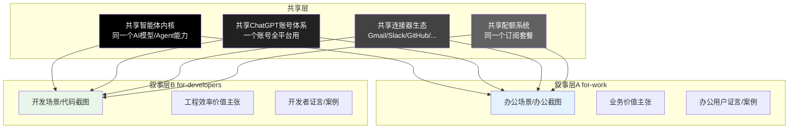

| 共享层面 | 具体内容 | 为什么重要 |
|---|---|---|
| **共享智能体内核** | 同样的GPT模型、同样的Agent推理能力、同样的工具调用机制、同样的可控性设计 | 一次研发，两边复用——不用为办公和开发做两套AI |
| **共享ChatGPT账号体系** | 无论你从for-work还是for-developers注册，都是同一个ChatGPT账号——ChatGPT Plus/Pro/Business用户直接就能用，不用重新注册 | 降低转化摩擦，利用ChatGPT已有的庞大用户基础 |
| **共享连接器生态** | Gmail、Drive、Calendar、Slack、GitHub、Linear、Notion、Figma、Stripe——所有连接器for-work和for-developers都能用 | 连接器开发一次两边用；而且办公用户可能也需要连GitHub，开发者也可能需要连Slack |
| **共享配额系统** | 同一个订阅套餐（Free/Go/Plus/Pro/Business/Enterprise），无论你是用来做文档还是写代码，都用同一个配额池 | 定价简单——用户不用纠结"我是买办公版还是开发版"，一个订阅全搞定 |

### 4.2 为什么不做两个独立产品？

很多人会问："既然办公用户和开发者差异这么大，为什么不干脆做两个独立产品——Codex for Work和Codex for Devs？"

答案是：双轨策略比两个独立产品好太多了，原因有五个：

| 原因 | 解释 |
|---|---|
| **1. 研发成本减半** | 一套内核、一套连接器、一套账号体系、一套多端应用——不需要做两套，研发和维护成本直接减半 |
| **2. 网络效应更强** | 用的人越多，产品越好——如果拆成两个产品，用户池、数据、反馈都拆成两半，迭代速度慢很多 |
| **3. 用户身份不是非此即彼** | 很多人既是办公用户也是开发者——上班写代码的工程师也要做周报写PPT，管理者有时候也要看懂代码。一个产品两边都能用，不用切换 |
| **4. 团队协作场景** | 一个团队里有产品、运营、工程师——如果拆成两个产品，团队协作就麻烦了。同一个产品大家都能用，协作才顺畅 |
| **5. 定价简单** | 一个订阅套餐所有功能都用，比"办公版$10/开发版$30"简单太多——用户不用纠结买哪个，决策门槛低 |

### 4.3 双轨页面设计差异总结

虽然底层是同一个产品，但两个落地页的设计从里到外都不一样，真正做到了"在商言商、在dev言dev"：

| 设计维度 | for-work 页面 | for-developers 页面 |
|---|---|---|
| **Hero标题侧重** | 几分钟创建文档/表格/幻灯片，专注真正重要的工作 | 在日常工作流中编写、理解和审查代码 |
| **场景类型** | 管理层简报、KPI汇报、财务审计、招聘资料包、客户跟进 | 代码重构、PR审查、调试Bug、测试生成、CLI工作流 |
| **截图内容** | 文档、电子表格、幻灯片、Calendar、Slack界面 | IDE编辑器、终端、代码diff、GitHub PR界面 |
| **视觉风格** | 柔和商务、办公感、非技术化 | 硬核极客、代码感、技术化 |
| **社会认同** | 企业Logo（跨行业）、办公场景案例 | 企业Logo（科技公司为主）、6位真实工程师具体证言 |
| **核心顾虑解决** | "AI会不会乱搞？""我不会写代码能用吗？""做出来的东西能直接用吗？" | "支持我用的IDE吗？""CLI好用吗？""能接我现有工作流吗？""真的比其他工具好吗？" |
| **CTA旁边的引导** | 引导看指南、看用例、看定价 | 引导选IDE（导航栏IDE下拉直接安装）、看CLI文档、下载桌面版 |
| **入门引导** | 四步法：提供上下文→选输出→决定处理→从小事开始 | 直接给安装命令/市场链接：装VS Code插件→`npm install -g @openai/codex` |

---

## 五、双轨策略的产品智慧

双轨策略看起来只是"做两个落地页"，但背后是非常深刻的产品智慧——它体现了OpenAI对用户、对市场、对产品的深刻理解。

### 5.1 用户分层不是用户分裂

很多公司做用户分层，会下意识地把用户分成互斥的几类——"这是A类用户，那是B类，A类用A产品，B类用B产品"。但真实世界里用户身份是流动的、重叠的：
- 一个Tech Lead，80%时间写代码（开发者身份），20%时间做管理汇报（办公身份）
- 一个产品经理，主要做办公场景，但有时候也要看代码、写SQL
- 一个创始人，既要写代码也要做PPT也要管财务

双轨策略承认这种重叠——分流只是"让你进入最适合你的叙事"，不是"把你锁死在某个轨道里"。你从for-work进来，也可以用CLI写代码；你从for-developers进来，也可以用它生成管理层简报。底层是同一个产品，只是入口不同、叙事不同。

### 5.2 不要教育用户，要说他们的语言

很多技术产品做非技术用户市场时，犯的最大错误是"教育用户"——"我们用了Agent技术，你知道Agent是什么吗？让我给你解释一下..."

Codex的选择是**完全不教育，彻底说用户的语言**：
- 对办公用户：不说Agent、不说工具调用、不说RAG——只说"帮你做文档、做表格、做幻灯片"
- 对开发者：不说"提高生产力"这种空话——直接说"PR审查能发现兼容性问题""CLI取代其他框架""重构+测试生成如期上线"

用户不需要知道你是怎么实现的，他们只需要知道"这能帮我解决我的问题"。说他们的语言，他们就懂了；说你的语言，他们就走了。

### 5.3 社会认同要精准匹配用户类型

社会认同不是"放一堆大公司Logo就完事了"——社会认同要精准，要让用户看到"和我一样的人"。

- 对办公用户：放跨行业的公司Logo（航空、教育、安全、互联网），暗示"哪个行业都能用"
- 对开发者：除了Logo，必须放真实工程师的具体证言——工程师只信其他工程师的话

如果在for-work页面放一堆工程师说"这个CLI很好用"，办公用户看不懂也不关心；如果在for-developers页面放一堆HR说"帮我做招聘包"，工程师会觉得"这不是给我用的"。社会认同要精准，要和你当前说话的对象匹配。

### 5.4 降低入门门槛，从用户舒适区开始

不同用户的"舒适区"不一样：
- 办公用户的舒适区是"从小事开始"——"先试一件你已经在做的小事"
- 开发者的舒适区是"直接装到我熟悉的工具里"——VS Code插件、CLI一行命令安装

双轨策略的入门引导完全不同，但核心逻辑一样：**不要让用户离开舒适区，让Codex走进他们的舒适区**。不要让办公用户学提示词，不要让开发者换编辑器——在他们已经熟悉的地方，用他们已经熟悉的方式开始用。

---

## 六、双轨分流交互设计：视觉等权，自我选择

双轨分流不是"放两个按钮就完了"——分流区域的交互细节设计，直接决定了有多少用户会正确选择自己的轨道，以及分流后的转化率。

### 6.1 分流区域的位置：为什么在Hero之后立刻出现？

双轨分流卡片出现的时机极其讲究——在Hero首屏CTA的正下方，用户看完"Codex，你的AI工作助手"之后，目光自然往下移动的第一个内容块就是双轨选择。

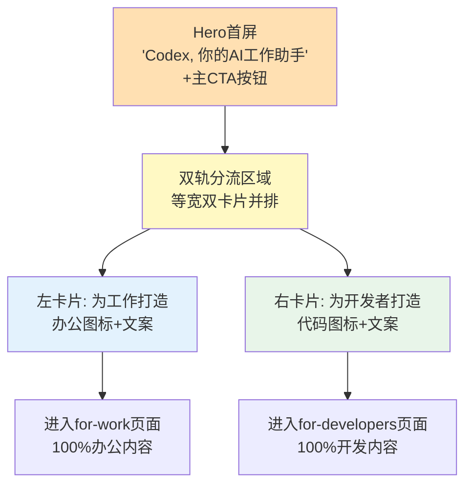

**为什么是这个位置？三个关键时机：**

1. **用户刚知道"这是什么"**——大标题+副标题回答了"Codex是AI工作助手"，用户正想问"这个助手能帮我做什么？"
2. **用户还没开始筛选信息**——如果先放一大堆功能列表，用户已经开始在信息里找"跟我有关的"，这个筛选过程是费力的，费力就会流失
3. **用户处于"开放选择"心态**——刚打开页面，还没有形成判断，这时候给他一个清晰的二选一，他会自然地做出选择

如果反过来，先讲10个功能再分流——办公用户看到前3个功能全是代码相关的，已经在心里判定"这是程序员的工具"，直接关掉页面走了，根本等不到你讲办公功能。

### 6.2 视觉等权设计：两栏权重完全相等

双轨卡片的视觉设计遵循严格的"等权原则"——两栏大小一样、位置对称、视觉重量相等，不暗示哪类用户"更重要"：

| 设计维度 | 左栏（for-work） | 右栏（for-developers） | 为什么等权？ |
|---|---|---|---|
| **宽度** | 50% | 50% | 不偏向任何一边 |
| **高度** | 完全相同 | 完全相同 | 卡片对齐，视觉平衡 |
| **图标大小** | 一样大 | 一样大 | 图标视觉权重相等 |
| **标题字号** | 相同字号 | 相同字号 | 文字层级一致 |
| **描述文字行数** | 差不多行数 | 差不多行数 | 不会一个长一个短显得一个更重要 |
| **hover效果** | 同样的阴影/上浮效果 | 同样的阴影/上浮效果 | 交互反馈一致 |
| **CTA样式** | 卡片本身可点击 | 卡片本身可点击 | 整个卡片都是点击区域 |

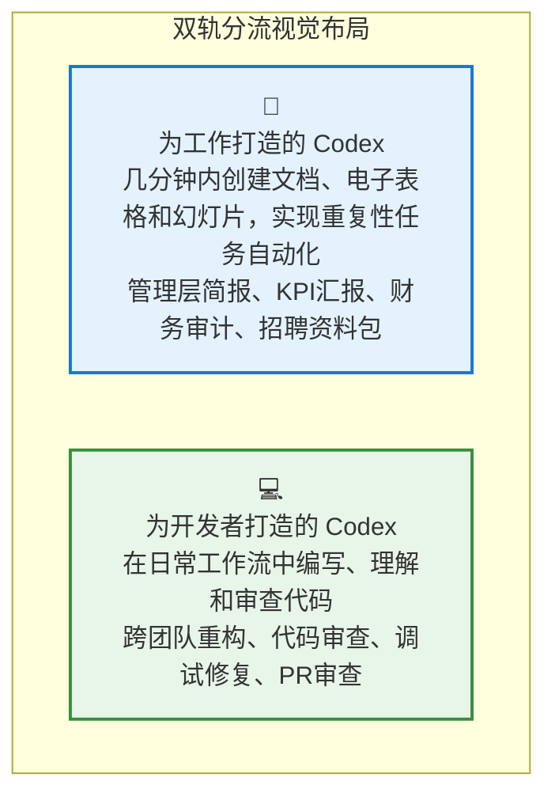

**为什么等权这么重要？**

如果两栏视觉权重不一样（比如左栏更大、颜色更亮、位置更突出），会发生三件坏事：
1. **另一类用户觉得被忽视**——"他们明显更重视那边，这边是次要功能"，信任感降低
2. **用户可能选错**——视觉突出的那一栏会吸引更多点击，不管用户是不是属于那类
3. **品牌传递错误信号**——暗示"我们主要服务A用户，B用户是顺便的"

Codex的双栏设计传递的信号非常清晰："这两类用户对我们同样重要，我们为两类用户都做了深度的产品设计。"

### 6.3 分流文案设计：让用户一秒对号入座

双轨卡片的文案不是写"解决方案A""解决方案B"这种模糊的分类，而是**直接用第二人称对目标用户说话**，让用户一秒钟就能判断"这是说给我听的"：

| 文案元素 | for-work文案 | for-developers文案 | 设计逻辑 |
|---|---|---|---|
| **卡片标题** | "为工作打造的 Codex" | "为开发者打造的 Codex" | 直接点名目标用户，"为X打造"让X用户立刻觉得"这是给我的" |
| **一句话描述** | "几分钟内创建文档、电子表格和幻灯片，实现重复性任务自动化" | "在日常工作流中编写、理解和审查代码" | 一句话说清核心价值，用的是目标用户的日常语言 |
| **场景列表** | "管理层简报、KPI汇报、财务审计、招聘资料包" | "跨团队重构、代码审查、调试修复、PR审查" | 4个具体场景，每个都是目标用户天天做的事，一看就知道"对，这就是我干的活" |

**文案设计的三个关键点：**

1. **不说"企业版""专业版"这种版本名**——版本名是厂商视角，用户不关心你叫什么版本，只关心"这是不是给我用的"
2. **场景名词要极端具体**——不说"办公自动化""开发效率提升"这种抽象词，说"KPI汇报""PR审查"这种具体到不能再具体的工作内容
3. **不用"如果你是XX，请点这里"这种命令式文案**——"为工作打造"是一种邀请，不是命令；用户自己判断自己是谁，比你教他"如果你是白领请点这边"体验好一万倍

### 6.4 "不确定"用户的处理：留在首页自由探索

双轨分流不是"你必须选一个才能继续"——它是一个友好的引导，不是强制的岔路口。

如果用户不确定自己属于哪一类（比如"我既是产品经理也要看代码"、"我想两边都看看"），他有两个选择：
1. **继续往下滚动首页**——首页下方有完整的五大功能介绍，既有办公场景也有开发场景，用户可以自己慢慢看
2. **两个轨道都点进去看**——看完for-work觉得"好像我也需要写代码的功能"，再回到首页点for-developers，路径完全通畅

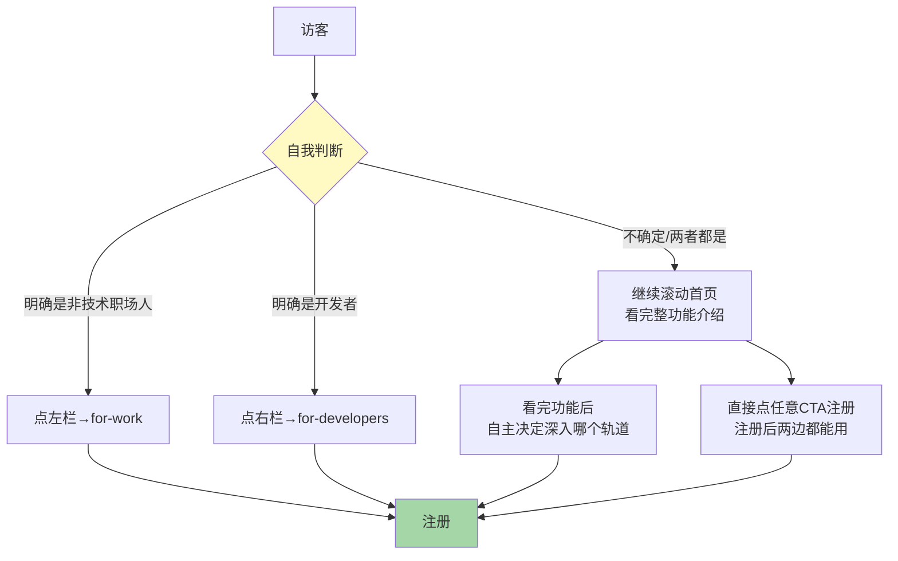

**为什么不强制分流？**

强制分流（"请选择您的用户类型"弹窗、必须选一个才能看内容）是最差的设计：
- 让用户觉得"你还没给我看任何东西就要我分类自己？"
- 选错了的用户进入错误的轨道，看到不相关的内容，直接流失
- - "不确定"的用户被卡住，不知道选什么，干脆走了

Codex的分流是"邀请式"而非"强制式"——你选，我给你定制化内容；你不选，你也可以自由探索所有内容。选择权完全在用户手里。

---

## 七、场景还原：双轨用户转化旅程对比

前面分析了双轨策略的各个维度，现在我们用两个典型用户的完整转化旅程，直观对比两条轨道的叙事差异，看同样的产品内核如何用完全不同的语言说服完全不同的两类人。

### 7.1 旅程A：运营经理林晓的for-work转化路径

林晓，28岁，电商公司运营经理，非技术背景，在朋友圈看到"AI帮你做周报"的分享链接点开。

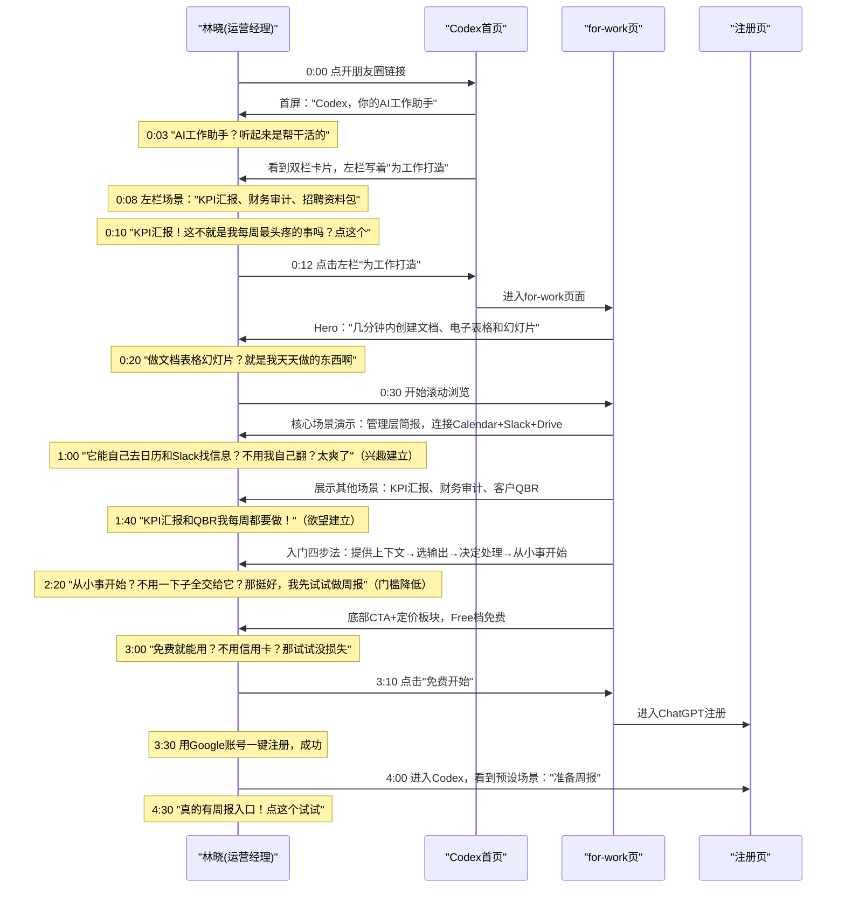

**for-work轨道的叙事节奏：**
1. **0-10秒**：用"KPI汇报"这种她天天做的事抓住注意力
2. **10秒-1分钟**：展示"自动连工具找信息"的核心价值，击中"找资料太费时间"的痛点
3. **1-2分钟**：用多个具体场景建立欲望——"这些事我都要做"
4. **2-3分钟**：用"从小事开始"降低心理门槛，用Free档降低行动门槛
5. **3-4分半**：一键注册，预设场景直接引导做周报——30秒内给出第一个价值

整个旅程中，林晓没有看到一个代码截图、没有看到一个技术术语、没有看到"CLI""Agent""PR"这些她不懂的词——全程都是她熟悉的办公语言和办公场景。

### 7.2 旅程B：后端工程师陈磊的for-developers转化路径

陈磊，32岁，SaaS公司后端工程师，从Hacker News看到讨论"OpenAI新出的Codex CLI怎么样"，好奇点开。

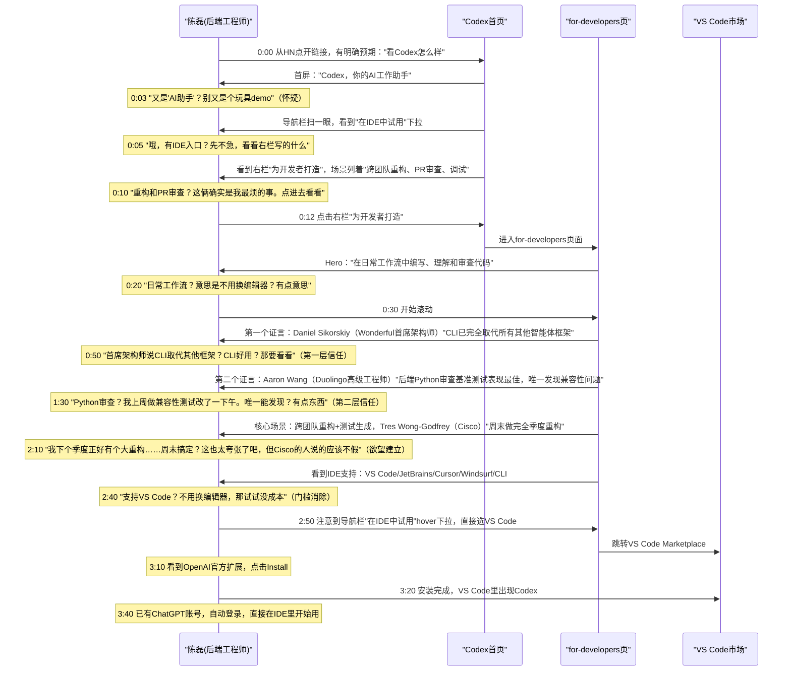

**for-developers轨道的叙事节奏：**
1. **0-10秒**：用"重构、PR审查、调试"这些他天天痛的事建立初步兴趣
2. **10秒-1分半**：先上硬核证言——首席架构师说CLI好、Duolingo工程师说Python审查最强，用同行评价打破怀疑
3. **1分半-2分半**：用"跨团队重构+周末搞定一个季度工作"这种强冲击力场景建立欲望
4. **2分半-3分钟**：用"支持VS Code/不换编辑器"消除最大的切换阻力
5. **3-3分40秒**：导航栏IDE下拉一键直达安装，已有账号自动登录，30秒内在熟悉的VS Code里开始用

整个旅程中，陈磊没有看到一个电子表格、没有看到一个幻灯片、没有看到"KPI汇报""财务审计"这些他不关心的事——全程都是代码、IDE、CLI、PR、重构，是他熟悉的工程师语言。

### 7.3 双轨旅程8维度对比表

| 对比维度 | 林晓（for-work） | 陈磊（for-developers） |
|---|---|---|
| **用户身份** | 运营经理，非技术 | 后端工程师，技术背景 |
| **进入来源** | 朋友圈分享，弱意图好奇 | Hacker News，强意图考察 |
| **初始心态** | 半信半疑，"AI真能帮我干活？" | 怀疑论者，"别又是个玩具demo" |
| **第一个抓住注意力的点** | "KPI汇报"——她每周最头疼的事 | "CLI取代所有框架"+"PR审查发现漏洞"——同行硬核评价 |
| **建立信任的方式** | 熟悉的办公场景+"从小事开始"低门槛 | 6位真实工程师的具体证言+量化数据 |
| **核心欲望触发点** | "自动连Calendar/Slack找信息做简报" | "周末搞定一个季度的重构工作" |
| **最大阻力消除** | "不用信用卡免费试+从小事开始" | "不用换编辑器，直接在VS Code里用" |
| **转化路径终点** | 注册→预设场景"准备周报"直接开始 | 导航栏IDE下拉→VS Code一键安装→IDE内直接用 |
| **从进入到开始使用** | ~4分30秒 | ~3分40秒 |
| **全程接触的语言** | 文档/表格/幻灯片/简报/KPI/周报 | 代码/IDE/CLI/PR/重构/diff/测试 |

两条路径差异巨大，但终点是同一个产品——这就是双轨叙事的魔力：同样的Codex，对林晓说"帮你做周报不用加班"，对陈磊说"帮你做重构周末不加班"，两个人都被说服了，两个人都觉得"这产品是为我做的"。

---

## 八、双轨策略反模式：8个常见错误

双轨策略看起来简单（"不就是做两个落地页吗？"），但实际上90%的团队做双轨/多轨定位时都会犯以下错误，导致转化率反而不如单页：

| 反模式 | 典型表现 | 危害 | Codex的规避 |
|---|---|---|---|
| **大杂烩首页** | 首页同时放办公截图和代码截图，混在一起讲 | 办公用户看到代码觉得是程序员工具，开发者看到表格觉得是办公软件，两边都觉得"不是给我的" | 首页只放统一品牌认知+双轨分流入口，具体场景留到分流后的定制页 |
| **智能识别强制跳转** | 根据UA/IP/来源自动判断用户类型，强制跳转到对应轨道 | 判断不准（开发者也会看办公内容）；剥夺用户控制权，用户觉得"你怎么知道我要哪个？"；选错了的用户直接流失 | 让用户自己选，不做智能判断不强制跳转 |
| **视觉权重偏向一边** | 一栏大一栏小、一个有CTA一个没有、颜色一明一暗 | 被偏向的一类用户觉得"这是主要用户"，另一类觉得"我是次要的"，信任感降低 | 双栏完全等宽等高、视觉权重完全相等、hover效果一致 |
| **分流后内容不彻底** | 点进for-work还能看到代码截图，点进for-dev还能看到财务审计 | 用户刚建立的"这是给我的"感觉被打破，产生噪音和困惑，代入感消失 | 分流后内容100%定制——for-work看不到一行代码，for-dev看不到一个表格 |
| **用厂商语言分类** | "企业版""专业版""团队版"这种版本名作为分流标签 | 用户不关心你叫什么版本，他只关心"这是不是给我用的"；版本名无法让用户对号入座 | 直接说"为工作打造""为开发者打造"——用用户身份而不是版本名分类 |
| **强制分流弹窗** | 打开网站先弹个窗"请选择您的用户类型"，必须选了才能看内容 | 用户还没看到任何价值就要分类自己，体验极差；不确定选什么的用户直接走掉 | 分流是页面内的邀请式卡片，不是强制弹窗；不选也可以继续看所有内容 |
| **双轨但不共享底层** | for-work和for-dev是两个独立产品，账号不互通、数据不互通、要分别买 | 跨身份用户（写代码的管理者）要注册两个账号买两个订阅，体验割裂；研发维护成本翻倍 | 完全共享底层——同一个账号、同一个配额、同一个产品、同一个内核，只是入口和叙事不同 |
| **社会认同错配** | for-work页面放工程师证言，for-dev页面放HR说好用 | 证言和目标用户不匹配，用户觉得"说这话的人跟我没关系，他说好不算数" | for-work用跨行业企业Logo+办公案例，for-dev用6位工程师的具体量化证言 |

### 双轨策略自检清单

设计或审查多用户类型产品的定位策略时，可以用以下清单：

- [ ] 首屏3秒内是否让用户知道"这个产品是做什么的"？
- [ ] 首屏之后立刻就有分流入口吗？还是让用户先在一堆功能里自己筛选？
- [ ] 不同用户类型的分流卡片视觉权重是否完全相等？
- [ ] 分流卡片的文案是否直接点名用户身份（"为X打造"），而不是模糊的版本名？
- [ ] 分流后的页面内容是否100%为目标用户定制？有没有另一类用户的内容噪音？
- [ ] 是否避免了强制分流/智能识别强制跳转？用户是否有"不选也能继续看"的自由？
- [ ] 不同轨道的社会认同（证言/Logo/案例）是否精准匹配目标用户类型？
- [ ] 不同轨道的入门引导是否匹配目标用户的舒适区？（办公用户从小事开始，开发者直接装工具）
- [ ] 底层是否完全打通？同一个账号/同一个产品/同一个配额，不用重复注册重复购买？
- [ ] 是否承认用户身份重叠？（不把用户锁死在某个轨道里，两边功能都能用）

---

## 九、双轨策略总结

ChatGPT Codex的双轨策略是SaaS产品定位的教科书级案例——它证明了**一个强大的产品内核，可以通过不同的价值叙事，同时拿下差异极大的多个用户市场**。

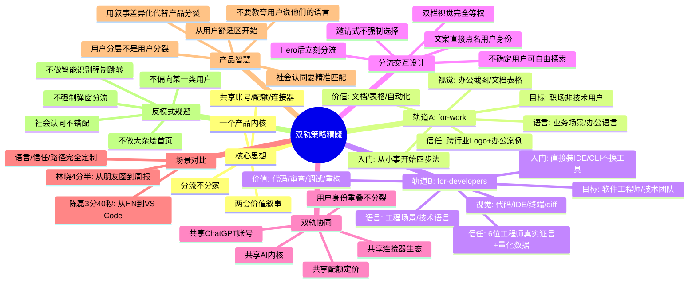

**可直接复用的双轨策略原则**：

1. **当你面对两类差异极大的用户时，不要做两个产品——做两套叙事，共享一个内核**。一次研发，覆盖两个市场，成本减半效果加倍。
2. **双轨分流要早，首屏就让用户自己选"你是谁"**。不要让用户在一堆不相关的信息里筛选，那是在消耗他们的耐心。
3. **分流卡片视觉权重必须完全相等**。等宽、等高、图标同大、交互一致——不要暗示哪类用户"更重要"。
4. **进入不同轨道后，内容要彻底定制**——视觉、语言、场景、案例、证言、入门引导，全部要匹配目标用户。不要留"另一个轨道"的痕迹，那会制造噪音。
5. **不要用你的语言教育用户，用他们的语言说话**。对非技术用户绝口不提技术术语，对技术用户就讲硬核的技术细节和同行评价。
6. **分流文案直接点名用户身份**——用"为工作打造""为开发者打造"，不用"企业版""专业版"这种厂商视角的版本名。
7. **社会认同要精准**——给什么用户看什么人的证言。开发者信工程师，职场人信同角色的管理者/运营/财务。
8. **双轨不是分裂**——底层要完全打通：同一个账号、同一个配额、同一个产品。用户身份是重叠的，不要把他们锁死在某个轨道里。
9. **分流是邀请不是强制**——不做弹窗强制选择、不做智能识别强制跳转，不确定的用户可以自由探索所有内容。
10. **入门路径要匹配用户舒适区**——办公用户从小事开始，开发者直接装到他们熟悉的IDE/终端里。不要让用户换习惯。

### 双轨策略 Do / Don't 速查表

| 策略决策 | ✅ Do（Codex的做法） | ❌ Don't（常见错误） |
|---|---|---|
| **首页内容策略** | 首屏统一品牌认知+双轨分流入口，具体场景留到定制页 | 首页同时放办公截图和代码截图混在一起讲，两边都看不懂 |
| **分流时机** | Hero首屏之后立刻出现分流卡片 | 讲完10个功能才让用户选，办公用户已经看到代码走了 |
| **分流视觉设计** | 双栏等宽等高、视觉权重完全相等、hover效果一致 | 一栏大一栏小、颜色一明一暗，暗示某类用户更重要 |
| **分流文案** | "为工作打造""为开发者打造"——直接点名用户身份 | "企业版""专业版""解决方案A/B"——厂商视角版本名 |
| **场景描述** | "KPI汇报""PR审查""调试"——极端具体的工作内容 | "办公自动化""开发效率提升"——抽象空话用户没感觉 |
| **分流强制性** | 页面内邀请式卡片，不选可以继续滚动看所有内容 | 弹窗强制选择用户类型，必须选了才能看内容 |
| **智能识别** | 不做智能判断，让用户自己选自己是谁 | 根据UA/IP/来源强制跳转，判断不准反增流失 |
| **定制页纯净度** | for-work看不到一行代码，for-dev看不到一个表格 | 点进去还能看到另一类用户的内容，产生噪音破坏代入感 |
| **社会认同** | for-work放跨行业Logo和办公案例；for-dev放6位工程师量化证言 | for-work放工程师说CLI好用，for-dev放HR说做招聘包快 |
| **入门引导** | 办公用户"从小事开始四步法"；开发者"VS Code一键安装+CLI一行命令" | 所有用户统一看5页欢迎教程+功能介绍 |
| **底层架构** | 同一账号、同一配额、同一产品、同一内核，只是叙事不同 | 两个独立产品、账号不互通、要分别注册分别买 |
| **用户身份观** | 承认身份重叠，分流只是入口不是牢笼，两边功能都能用 | 非此即彼分类，把用户锁死在某个轨道里不能跨界 |
| **技术语言使用** | 对办公用户零术语，对开发者讲硬核细节（基准测试、兼容性问题） | 对所有人讲"我们用了Agent架构""基于RAG技术"，非技术用户听不懂 |
| **信任建立方式** | 办公用户靠熟悉场景+低门槛；开发者靠同行证言+量化数据 | 所有用户用同一种信任方式——大公司Logo+空泛评价 |
| **价值主张表达** | "几分钟做文档""周末搞定季度重构""唯一发现兼容性问题" | "提高效率""提升生产力""革命性体验"——空洞无物 |

Codex的双轨策略告诉我们：**最好的产品策略不是"我做一个什么产品去找用户"，而是"我的用户是谁？他们说什么语言？他们关心什么？我怎么用他们的语言把我的产品价值讲给他们听"**。一个内核可以讲无数个故事，关键是你会不会讲。

---

**下一步**：继续阅读 [08 多端协同策略分析](08-multi-platform.md)，掌握Codex在Web/IDE/CLI/桌面/移动端六大平台的协同设计哲学与实现机制。
