## 一、连接器设计理念：融入而非颠覆

在企业级SaaS领域，有一个经典的"替换悖论"：**你越想替换用户正在用的工具，用户越抵触你；你越能连接用户正在用的工具，用户越容易接受你**。

绝大多数AI工具走的是"颠覆"路线——"别用你那些旧工具了，来我这个全新的AI平台，所有事都在这里做"。但现实是：企业和个人已经在Gmail、Slack、GitHub、Notion等工具里积累了几年甚至十几年的数据和工作流，让他们换工具是不可能的——迁移成本太高、习惯太难改、团队要重新培训。

ChatGPT Codex连接器（Connectors）的设计理念完全相反：**不是替代你现有的工具，而是连接你现有的工具——AI融入你的工作流，而不是让你的工作流迁就AI**。

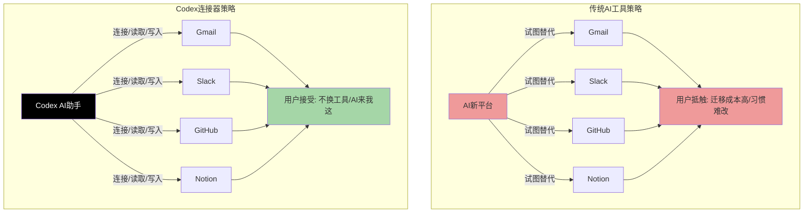

这个设计理念背后是对用户习惯的深刻尊重：
1. **工具是用户的舒适区**——你用了五年Gmail，所有邮件都在里面，所有过滤器、标签、习惯都在那里，让你换一个新的邮件客户端是不可能的
2. **数据在工具里**——你的沟通在Slack、代码在GitHub、文档在Notion、设计在Figma、钱在Stripe——AI要有用，必须能访问这些数据
3. **工作流跨工具**——真实工作从来不是在一个工具里完成的，调查一个问题要查邮件、看Slack讨论、找文档、看代码——AI必须能跨工具串联
4. **产出要回到工具里**——AI生成的邮件要能直接发，生成的文档要能直接存Drive，修复的代码要能直接提PR——产出必须回到用户已经在用的工具里，而不是存在AI自己的平台上

一句话：**Codex不做工具的替代者，做工具之间的连接者和智能层**。

---

## 二、已展示的连接器生态

Codex已经展示了一个覆盖生产力、开发、知识管理、设计、支付等多个领域的连接器矩阵——几乎覆盖了知识工作者和开发者日常使用的所有主流工具。

| 工具分类 | 连接器 | 工具类型 | 核心能力 |
|---|---|---|---|
| **生产力/沟通** | Gmail | 邮箱 | 读取邮件、发送邮件、搜索邮件内容、基于邮件内容生成回复/摘要 |
| **生产力/存储** | Google Drive | 云存储/文档 | 读取文档/表格/幻灯片、创建新文件、编辑已有文件、搜索文件 |
| **生产力/日历** | Google Calendar | 日历 | 读取日程、查找会议时间、查看会议参会人、基于日历生成议程/纪要 |
| **生产力/沟通** | Slack | 团队即时通讯 | 读取频道消息、搜索历史消息、发送消息、总结讨论、提取行动项 |
| **开发/代码** | GitHub | 代码托管/协作 | 读取PR/Issue、审查代码、创建PR、评论、合并、基于代码库工作 |
| **开发/项目管理** | Linear | 项目管理/Issue追踪 | 读取工单、更新状态、创建Issue、查询进度、自动更新任务 |
| **知识管理** | Notion | 知识库/文档 | 读取页面、创建页面、编辑页面、搜索知识库、生成文档 |
| **设计** | Figma | 设计协作 | 读取设计稿、查看设计变更、基于设计生成代码、理解设计上下文 |
| **支付/业务** | Stripe | 支付系统 | 查询支付记录、查看日志、调试支付问题、分析扣费异常 |

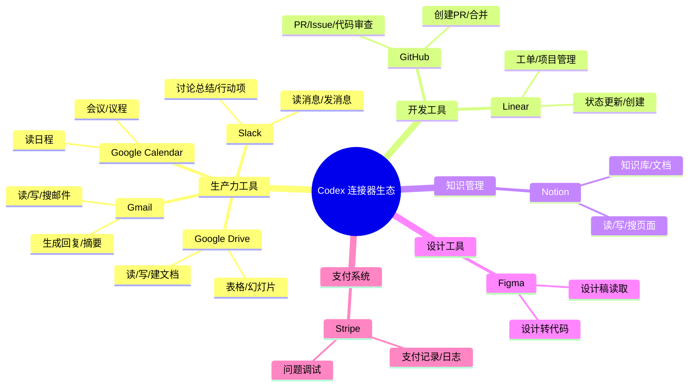

这个连接器矩阵选得非常精准——每一个都是对应领域的绝对领导者或主流选择：
- 办公沟通：Gmail + Slack 几乎是标配
- 办公生产力：Google Workspace（Drive/Calendar）是企业和个人最常用的
- 开发：GitHub 是代码托管的事实标准，Linear 是新兴的热门项目管理工具
- 知识管理：Notion 是现在最流行的知识库/文档工具
- 设计：Figma 几乎垄断了UI设计协作
- 支付：Stripe 是互联网公司支付的首选

你日常工作用的工具，Codex几乎都能连——这意味着你不用迁移任何数据、不用改变任何习惯，连一下就能用。

---

## 三、连接器交互模式

Codex连接器的交互设计非常直观——用户能清楚地看到哪些工具连了、哪些没连、能随时连随时断，完全在用户控制之下。

### 3.1 连接/断开开关设计

连接器管理界面采用最直观的**开关设计**——就像你手机上的权限开关一样简单：

| 状态 | 视觉表现 | 用户操作 |
|---|---|---|
| **已连接** | 开关显示"开启"状态（通常是绿色/蓝色高亮），显示"已连接"，旁边有"断开"选项 | 已经授权，可以读取/写入这个工具的数据；点击可以断开连接 |
| **未连接** | 开关显示"关闭"状态（灰色），显示明显的"连接"按钮 | 点击按钮，走OAuth授权流程（跳转到对应工具的授权页面，确认授权），完成后就连上了 |

从展示的界面示例来看：
- **Linear 和 Notion 显示为已开启**——说明这是演示场景中已经连接好的工具
- **Stripe 和 Figma 显示"连接"按钮**——说明这是还没连接，可以点击连接

这种设计的好处是：
1. **状态透明**——一眼就能看到哪些工具连了哪些没连，没有黑箱
2. **控制简单**——想连就连，想断就断，一个开关的事
3. **符合预期**——和手机App权限、SaaS应用集成的交互模式一致，用户不用学
4. **渐进式连接**——不用一开始就把所有工具都连上，用到哪个连哪个，降低心理门槛

### 3.2 自动抓取最新上下文

连接器不是"连一次，导一次数据"——是**实时、自动抓取最新上下文**：
- GitHub上有新的PR提交，Codex能立刻看到
- Slack上有新的讨论消息，Codex能自动获取
- Google Drive里文档更新了，Codex用的是最新版本
- Linear里工单状态变了，Codex知道最新进展

这意味着你不用手动"同步"、不用手动上传文件、不用复制粘贴给Codex——它和你用的工具是实时连通的，工具里有什么新情况，Codex自动就知道了。

### 3.3 基于连接工具的数据调研和产出

连接工具之后，Codex的工作模式不是"你问我答"，而是**主动跨工具调研，基于真实数据产出结果**：

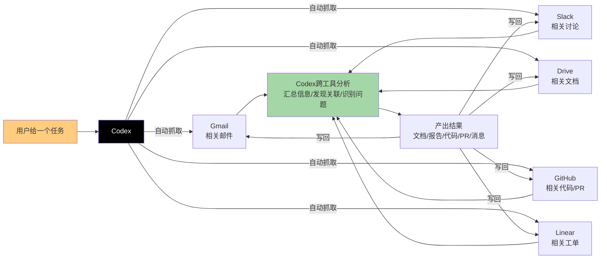

举个例子：你跟Codex说"帮我调查一下批发订单为什么延迟了"，它会自动：
1. 去Gmail找物流相关的邮件
2. 去Slack搜团队关于这个订单的讨论
3. 去Drive找库存数据文档
4. 把这些信息拼起来，分析时间线，找出延迟原因
5. 生成一份完整的调查报告文档
6. 你可以选择直接把报告存到Drive，或者发Slack消息通知团队

整个过程你不需要手动找任何东西、不需要复制粘贴任何内容——Codex自动跨工具把所有相关信息找齐、分析、产出。

---

## 四、连接器三大核心能力：读、写、触发

Codex连接器不是只能"读"数据——它有三大核心能力：**读取（Read）、写入（Write）、触发（Trigger）**，覆盖了从信息获取到产出落地到自动执行的完整闭环。

### 4.1 读取（Read）：访问你所有工具里的数据

读取是最基础的能力——Codex能获得你授权的工具里的数据访问权限，能搜索、读取、理解里面的内容：

| 工具 | 读取能力示例 |
|---|---|
| Gmail | 搜索邮件、读取邮件内容、查看附件、查找对话历史 |
| Slack | 读取频道消息、搜索历史、查看私信、获取文件共享 |
| Google Drive | 搜索文档、读取文档/表格/幻灯片内容、查看版本历史 |
| GitHub | 读取代码库、查看PR diff、读取Issue、查看代码评论 |
| Notion | 读取页面内容、搜索知识库、查看数据库、获取嵌入内容 |
| Figma | 读取设计稿、查看组件、获取设计标注、查看评论 |
| Stripe | 查询支付记录、读取日志、查看客户信息、查看发票 |

读取能力解决了"信息孤岛"问题——以前你要做一件事，需要打开5个工具自己找信息；现在Codex自动帮你跨工具找齐，你不用来回切换了。

### 4.2 写入（Write）：产出结果直接回到你的工具里

光读不写是不够的——AI生成的东西如果只能在Codex自己的界面里看，那你还是要手动复制粘贴到各个工具里，还是麻烦。写入能力让Codex能**直接把产出结果保存/发送/分享到你连接的工具里**：

| 工具 | 写入能力示例 |
|---|---|
| Gmail | 发送邮件回复、创建新邮件、保存草稿 |
| Slack | 发送消息到频道、回复讨论、创建新帖子 |
| Google Drive | 创建新文档/表格/幻灯片、更新已有文件、移动文件 |
| GitHub | 创建PR、提交代码、评论PR/Issue、合并PR |
| Linear | 创建新Issue、更新工单状态、添加评论、分配负责人 |
| Notion | 创建新页面、更新已有页面、添加评论、修改数据库条目 |

写入能力是关键——这意味着Codex的产出是"落地"的，不是飘在AI平台上。它生成的周报可以直接存到Drive，它写的修复代码可以直接提PR，它总结的行动项可以直接发到Slack——整个工作流最后一公里不用你手动做。

### 4.3 触发（Trigger）：创建自动化流程，定期自动工作

最强大的能力是**触发/自动化**——不是你每次叫Codex做它才做，而是你可以设置规则，让它**定期自动执行工作**：

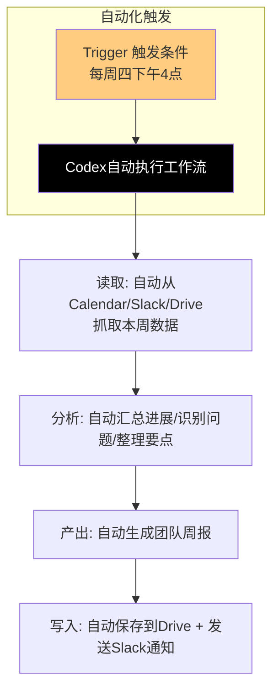

典型的自动化场景示例：
- **每周四下午4点**：自动从Calendar拿会议记录、从Slack提取关键讨论、从Drive找工作文档，自动生成团队周报，存到Drive，然后发Slack消息提醒大家查看
- **每天早上9点**：自动查看GitHub上有没有新的PR分配给我，做第一遍审查，标记问题，给我一个审查摘要
- **每小时**：自动检查Stripe日志有没有扣费错误，如果有异常自动分析原因，给我发Slack告警
- **新Issue创建时**：自动读取Linear新工单，尝试理解问题、找相关代码、给修复建议，作为评论贴到工单里

自动化能力把Codex从"你问它答的工具"变成了"7x24小时工作的数字员工"——重复性的、定期要做的事，设置一次它就自动做了，不用你每周/每天重复交代。

---

## 五、MCP（Model Context Protocol）：开放的工具扩展协议

连接器生态能做多大，取决于它有多开放——如果只有官方做连接器，覆盖的工具总是有限的；如果开放给第三方开发者做，生态才能爆发。

MCP（Model Context Protocol）就是OpenAI推出的**工具扩展开放协议**（基于公开信息）——它允许任何第三方工具开发者按照标准协议，把自己的工具接入Codex/ChatGPT生态。

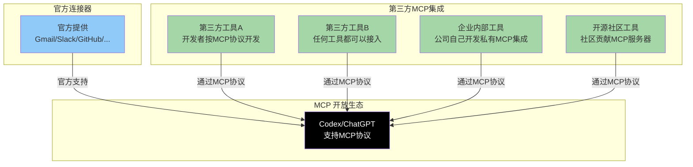

MCP的价值在于**生态的可扩展性**：
1. **官方不用做所有连接器**——官方只需要做最主流的，长尾工具让第三方自己做
2. **企业能接内部工具**——大公司有很多内部自研工具，不可能等官方做，企业可以自己按MCP协议开发内部集成
3. **社区驱动创新**——开源社区可以为各种小众工具、新兴工具开发MCP集成，生态会自动生长
4. **一次开发，全生态可用**——工具开发者按MCP协议开发一次，就能接入所有支持MCP的AI客户端，不用给每个AI平台单独做集成

MCP的思路和当年的HTTP协议有点像——HTTP协议标准化了网页的传输，才催生了整个Web生态；MCP试图标准化AI和工具之间的通信，才可能催生真正繁荣的AI工具生态。这是OpenAI在生态布局上非常有远见的一步棋。

---

## 六、集成场景示例：真实工作流中的Codex

连接器的价值在真实工作流中才能体现出来——单个连接器只是"能连某个工具"，多个连接器组合起来才能解决真实的、复杂的工作问题。Codex展示了几个非常典型的跨工具集成场景。

### 6.1 场景一：物流延迟调查（办公场景）

这是for-work页面核心展示的场景——调查批发订单物流为什么延迟。这个场景需要跨三个工具：

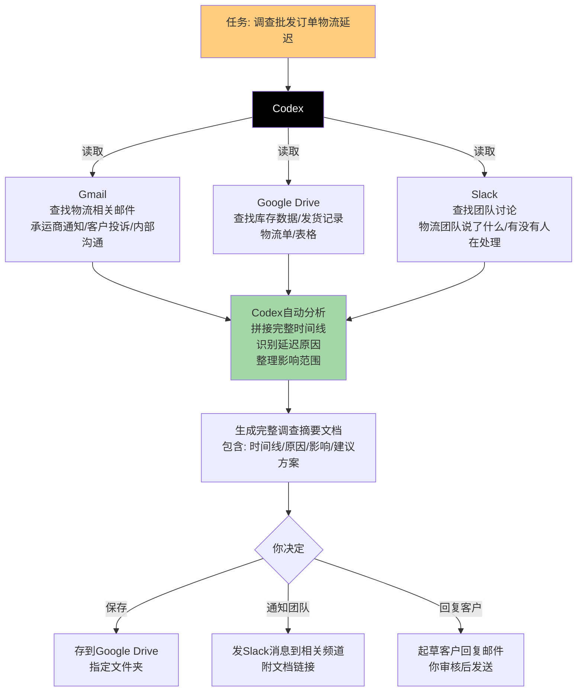

**没有Codex的时候你要怎么做？**
1. 打开Gmail，搜"批发订单 物流 延迟"，翻20封邮件找相关的
2. 打开Drive，找库存表、发货记录，核对数据
3. 打开Slack，搜这个订单号的讨论，看团队说了什么
4. 自己在脑子里拼时间线，找原因
5. 打开Docs，写调查报告
6. 写Slack消息通知团队
7. 写邮件回复客户——整个过程可能要2-3小时

**有Codex的时候：**
1. 跟Codex说"帮我调查一下批发订单XXX为什么物流延迟了"
2. 等2-3分钟，Codex自动从Gmail/Drive/Slack把所有相关信息找齐，分析原因，生成完整报告
3. 你花5分钟审核一下，改改细节
4. 点一下存到Drive，点一下发Slack，点一下发邮件——整个过程10分钟搞定

### 6.2 场景二：Stripe扣费Bug调试（开发场景）

这是for-developers页面展示的场景——调试Stripe支付扣费bug。这个场景跨四个工具：

| 步骤 | 涉及工具 | Codex做什么 |
|---|---|---|
| **1. 问题反馈** | Slack/Linear | 从Slack看到客服转发的用户投诉，从Linear找到对应的Bug工单，理解问题现象："有些用户被重复扣费了" |
| **2. 日志分析** | Stripe | 查询Stripe日志，找到扣费失败/重复扣费的具体事件，看错误码和请求参数 |
| **3. 截图/上下文** | （用户提供） | 分析用户提供的截图和错误信息，确认复现路径 |
| **4. 代码定位** | GitHub | 找到代码库里处理Stripe webhook/扣费逻辑的代码，定位问题——发现是重试机制没有做幂等性检查，导致重试时重复扣费 |
| **5. 修复代码** | GitHub/本地代码 | 写修复代码：加幂等性key检查，加重复扣费防护逻辑 |
| **6. 测试验证** | 本地/CI | 生成单元测试，验证修复正确，不会引入新问题 |
| **7. 提交PR** | GitHub | 创建PR，描述问题根因和修复方案，请求团队审查 |
| **8. 更新工单** | Linear/Slack | 更新Linear工单状态，在Slack同步进展，告诉大家修复已提交 |

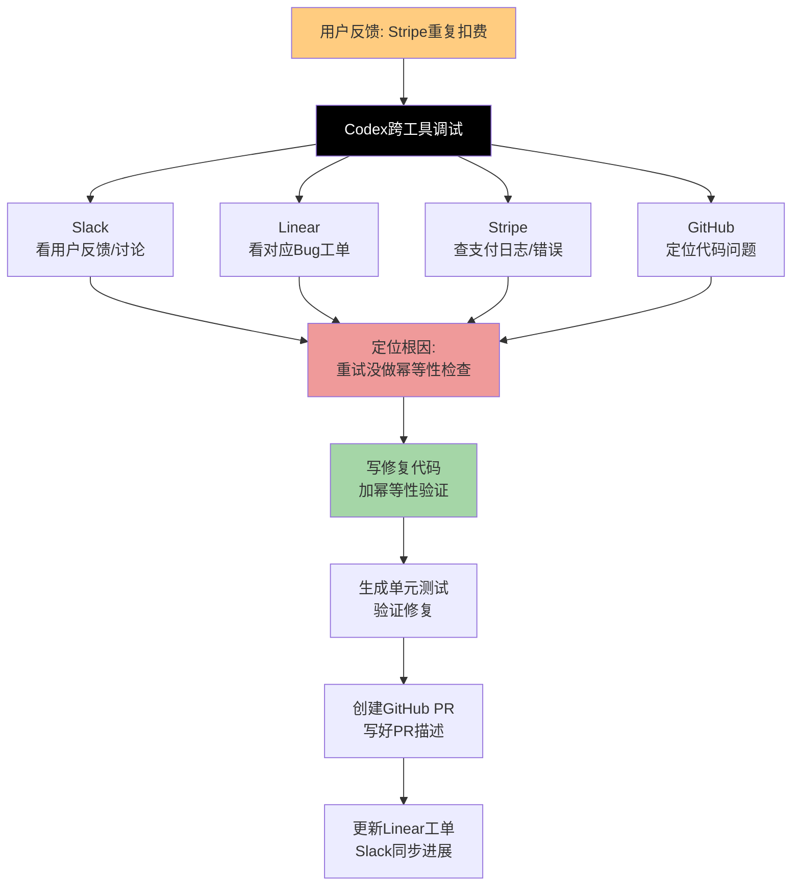

**没有Codex的时候：**
- 你要自己翻Slack找反馈、自己查Stripe日志、自己在代码里搜Stripe webhook处理逻辑、自己看代码找问题、自己想修复方案、自己写测试、自己提PR、自己更新工单——整个过程可能要大半天甚至一天

**有Codex的时候：**
- 你把问题告诉Codex，它自动跨工具查信息、定位根因、写修复、写测试、提PR——你只需要审查代码、确认没问题合并，可能1-2小时就搞定了

### 6.3 场景三：团队周报自动化（自动化场景）

这个场景展示了"触发"能力——不是每次手动让Codex做，而是设置自动化定期做：

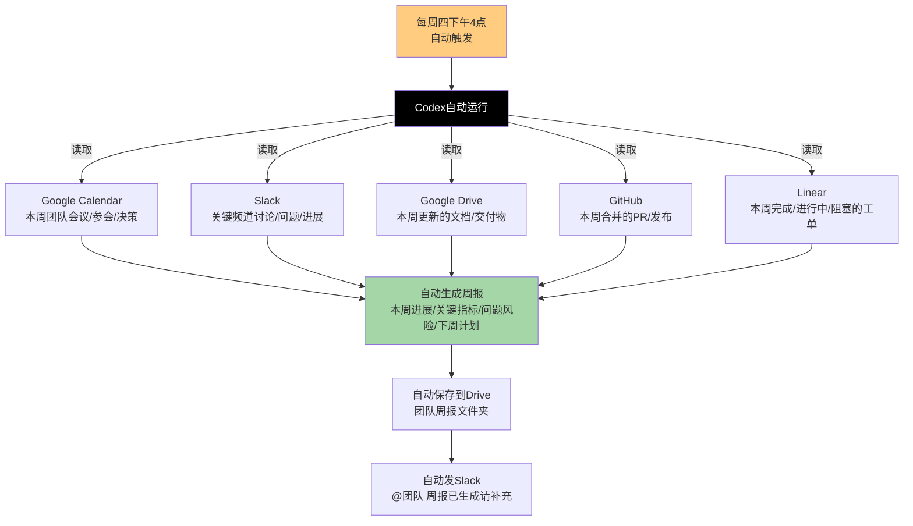

**设置一次，永久自动：**
1. 你设置好规则："每周四下午4点，自动生成团队周报"
2. Codex到点自动运行，从所有连接的工具里拉取本周的数据
3. 自动汇总成格式完整的周报
4. 自动存到Drive指定位置
5. 自动发Slack通知大家来补充/审阅
6. 你再也不用每周追着大家要进展、拼周报了——这件事完全自动化了

这就是连接器+自动化的真正威力：**把重复性的团队协作流程，变成Codex自动运行的流程**。

---

## 七、生态扩展路径：从官方到开放

Codex的工具生态不是一天建成的，它有一条清晰的三级扩展路径，从官方核心覆盖，到第三方扩展，再到自定义集成——逐步扩大生态边界。

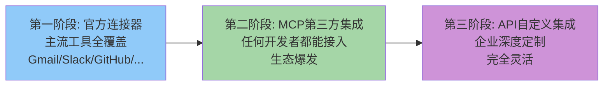

| 阶段 | 扩展方式 | 覆盖范围 | 适用用户 |
|---|---|---|---|
| **第一阶段：官方连接器** | OpenAI官方开发维护 | 最主流的通用工具——Gmail、Slack、GitHub、Notion、Figma、Stripe这些每类工具的Top 1-2 | 绝大多数普通用户和中小企业——大家用的主流工具官方都帮你连好了，开箱即用 |
| **第二阶段：MCP第三方集成** | 第三方开发者/工具厂商按MCP协议开发 | 长尾工具、垂直行业工具、新兴工具——比如特定行业的CRM、小众项目管理工具、新出的设计工具等 | 有特定工具需求的用户、垂直行业用户——官方没做的工具，第三方/厂商自己做MCP集成就能用 |
| **第三阶段：API自定义集成** | 通过OpenAI API自己开发定制集成 | 企业内部自研系统、高度定制化的工作流、特殊安全要求的私有部署 | 中大型企业——有自己的内部工具、有定制化需求、可以基于API开发完全适合自己的集成 |

这条扩展路径非常聪明：
1. **先抓主流**——第一方把主流工具做好，保证80%的用户开箱即用，不用折腾
2. **再放生态**——用MCP协议开放给第三方，剩下20%的长尾工具让生态来补，官方不用做所有事
3. **最后留出口**——给大企业留API自定义能力，满足最复杂、最定制化的需求

绝大多数用户在第一阶段就够用了；有特殊需求的用户等MCP生态起来也能满足；大企业有能力自己开发也完全可以——三类用户都照顾到了。

---

## 八、数据安全与隐私考量

连接器能访问这么多工具里的数据——邮件、代码、文档、支付记录——用户自然会担心安全和隐私问题。虽然官网展示的信息有限，但从产品设计逻辑可以推断Codex连接器应该遵循的安全原则：

| 安全原则 | 设计逻辑 |
|---|---|
| **OAuth授权，不碰密码** | 连接工具用标准OAuth流程——你跳转到工具官网授权，Codex拿不到你的工具密码，只拿到授权token |
| **权限最小化** | 申请的权限是完成工作所需的最小权限——不会要你给全盘访问权限，如果只需要读邮件不会要发邮件的权限 |
| **用户完全控制** | 随时可以断开连接，断开之后Codex就不能访问这个工具的数据了；连接状态透明可见 |
| **数据不滥用** | （基于OpenAI隐私政策）用户数据不会被用来训练模型（企业版），访问都有日志记录 |
| **操作可审计** | （企业版）管理员可以看到哪些人连了哪些工具、Codex做了哪些操作，有审计日志 |
| **写入操作要确认** | 所有写入操作（发邮件、提PR、改文档）都遵循"预览→确认→执行"流程，不会偷偷发出去 |

安全和隐私是企业级工具的生命线——Codex把"可控性"作为五大核心功能之一，本身就是对安全问题的回应：用户始终有控制权，AI不会自作主张，所有操作都是透明的、可预览的、可撤销的。

---

## 九、场景还原：连接器驱动的工作日

前面分析了连接器的设计理念、能力和场景，现在我们用两个典型用户一天中使用连接器的完整工作流，直观感受"AI融入工具"到底是什么体验。

### 9.1 场景A：运营经理王琳的"零手动"周报自动化旅程

王琳，31岁，SaaS公司运营总监，团队12人，每周四下午要发周报给管理层，以前要花3小时收集信息拼周报。用Codex连接器后，这件事完全自动化了。

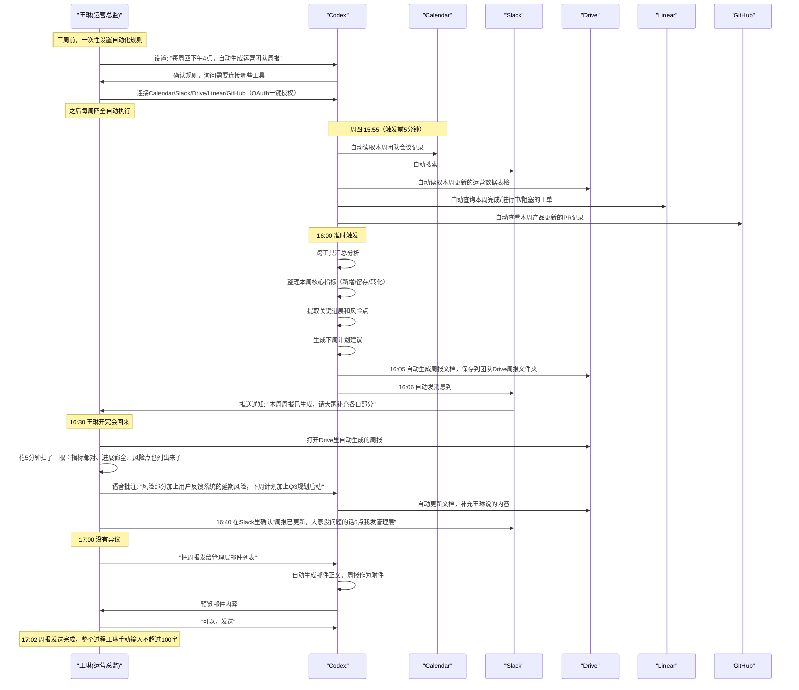

**王琳这个工作流的关键连接器价值：**

1. **设置一次，永久自动**：三周前花10分钟设置好自动化规则，之后每周四Codex自动跑，她不用再想这件事
2. **五工具数据自动汇总**：Calendar/Slack/Drive/Linear/GitHub五个工具的数据，Codex自动跨工具找齐、关联、分析，她不用打开五个工具自己找
3. **产出直接回工具**：周报自动存Drive、自动发Slack通知、最后自动发邮件——全程不用复制粘贴
4. **人保留最终控制权**：Codex生成初稿，王琳审核、补充、修改，确认后才发送——AI干活，但人拍板
5. **从3小时到10分钟**：以前每周四下午基本搭进去了，现在只需要花10分钟审核补充，省出一下午时间

最关键的是：她没有换任何工具——团队还在用Slack沟通、还在用Drive存文档、还在用Linear管项目、还在用GitHub看产品更新。Codex只是在这些工具之上加了一层智能，帮她把跨工具的重复性工作自动化了。

### 9.2 场景B：后端工程师赵宇的Stripe支付Bug跨工具调试旅程

赵宇，29岁，金融科技公司后端工程师，周三下午客服在Slack反馈"有用户被重复扣费了"，他用Codex连接器定位并修复了这个bug。

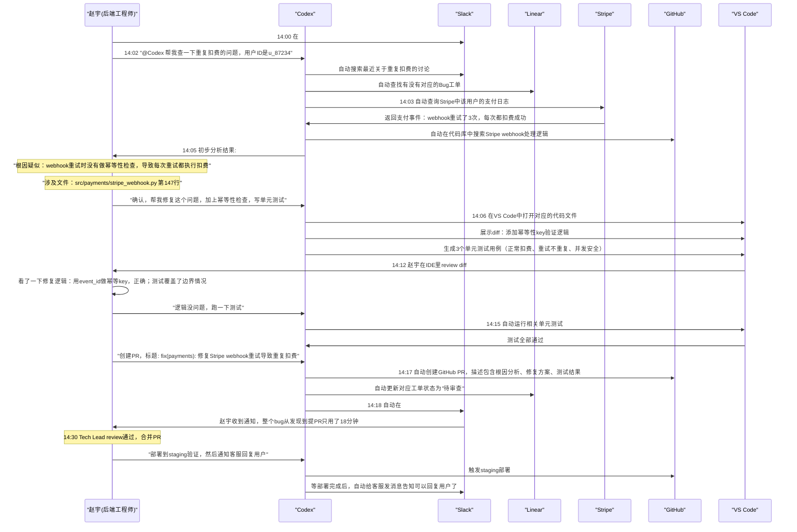

**赵宇这个工作流的关键连接器价值：**

1. **一句话启动，全链路自动**：他只说了一句"帮我查一下重复扣费的问题"，Codex自动跨Slack/Linear/Stripe/GitHub四个工具查信息、定位根因
2. **从反馈到根因3分钟**：以前他要自己翻Slack记录、查Stripe后台、在代码里搜webhook逻辑，可能要半小时才能定位问题；Codex3分钟就给出了根因和具体代码位置
3. **修复→测试→PR全自动**：定位问题后，Codex直接在IDE里写修复、生成测试、跑测试、提PR，他只需要review代码——这是最需要人判断的部分
4. **跨工具状态同步**：PR创建后自动更新Linear工单、自动发Slack通知，他不用手动去各个工具改状态
5. **不换工作流**：他还是在VS Code写代码、还是在GitHub提PR、还是在Slack沟通——Codex只是在这些工具之间跑腿、做重复劳动，他专注于核心判断（修复逻辑对不对）

从客服反馈到PR提交只用了18分钟——这在以前可能需要大半天。而这一切，他没有打开Stripe后台手动查日志，没有自己去Linear创建工单，没有自己写PR描述——连接器帮他把所有跨工具的"跑腿活"都干了。

### 9.3 两个场景8维度对比表

| 对比维度 | 王琳（运营/自动化场景） | 赵宇（工程师/Bug修复场景） |
|---|---|---|
| **核心身份** | 运营总监，非技术管理者 | 后端工程师，技术人员 |
| **触发方式** | 定时触发（每周四16:00） | 事件触发（Slack出现用户反馈） |
| **使用的连接器数量** | 5个（Calendar/Slack/Drive/Linear/GitHub） | 5个（Slack/Linear/Stripe/GitHub/IDE） |
| **核心能力** | 读取+触发+写入（自动化闭环） | 读取+写入（跨工具调研+代码修复） |
| **人的参与度** | 设置一次，之后10分钟审核 | 全程参与判断（review代码、确认方案），但跑腿活全自动化 |
| **时间节省** | 从3小时→10分钟（省95%时间） | 从半天→18分钟提PR（省90%时间） |
| **是否换工具** | 完全不换——还是用原来的Slack/Drive/Linear | 完全不换——还是用VS Code/GitHub/Slack |
| **价值核心** | 重复工作自动化，从"人做"变成"AI自动做" | 跨工具信息串联，从"人找信息"变成"信息找人" |

两个人做的是完全不同的工作，用的是不同的连接器组合，但享受到的核心价值是一样的：**Codex不改变他们用什么工具，只是把跨工具的、重复的、跑腿的工作自动化了，让人专注于真正需要判断力和创造力的部分**。

---

## 十、工具集成反模式：8个常见错误

工具集成/连接器是AI产品最容易做砸的部分之一——看起来简单（"不就是调API吗"），但90%的AI产品做集成时都会犯以下错误：

| 反模式 | 典型表现 | 危害 | Codex的规避 |
|---|---|---|---|
| **做全能平台替代一切** | "来我们的AI平台，所有事都在这里做，别用Slack/GitHub/Notion了" | 用户迁移成本极高，大企业几乎不可能迁移；数据在各个工具里积累了好几年，不可能说换就换 | 完全不替代——连接用户已经在用的工具，数据留在原工具里，Codex只是智能层 |
| **只读不写，半成品集成** | 只能读取工具数据，不能写回——AI生成的东西用户要自己复制粘贴回工具 | 最后一公里还要手动做，用户感知价值大打折扣，"还是要我自己贴啊？" | 读-写-触发三能力闭环——能读就能写，生成的文档直接存Drive、代码直接提PR、消息直接发Slack |
| **只能手动调用，不能自动化** | 每次都要用户主动叫AI做，不能设置定期自动执行 | 重复性工作还是要用户记得叫AI做，AI只是个"高级搜索"不是"助手" | 触发能力——支持定时/事件触发自动化，设置一次AI定期自动做 |
| **集成一堆工具但不做跨工具关联** | 能连Gmail、能连Slack、能连Drive，但查问题要用户自己说"去Gmail找这个、再去Slack找那个" | 用户还是要自己想"需要哪些信息、在哪个工具里"，AI只是个单工具查询器 | 自动跨工具关联——用户给一个任务，Codex自己判断需要哪些工具的信息、自动去取、自动关联分析 |
| **要用户给全盘权限** | 一连接就要求全盘访问权限——"连接Gmail就要能读所有邮件、能删所有邮件" | 用户不敢连——"凭什么你要能删我邮件？"；企业安全合规直接毙掉 | 最小权限原则——只申请完成工作需要的最小权限，用OAuth授权，不要密码；连接状态透明可控 |
| **连接状态不透明** | 用户不知道哪些工具连了、哪些没连、AI什么时候在访问数据、访问了什么 | 用户不信任——"它是不是在偷偷读我邮件？"；黑箱操作让人没有安全感 | 开关式管理——哪个连了哪个没连一眼看到；所有操作可预览可审计；写入操作必须确认 |
| **只做官方集成，生态封闭** | 只有官方做连接器，第三方/企业没法自己做集成 | 长尾工具永远连不上；企业内部工具完全没法用；生态做不大 | MCP开放协议——官方做主流工具，第三方可以做MCP集成，企业可以接内部工具，生态可扩展 |
| **连接器孤立展示，不讲跨工具场景** | 功能列表写"支持Gmail""支持Slack""支持GitHub"，但不展示组合起来能解决什么问题 | 用户不关心"你能连Gmail"，用户关心"我调查问题的时候能不能不用自己翻5个工具"；孤立讲连接器用户感知不到价值 | 展示真实跨工具场景——"物流延迟调查""Stripe Bug调试""周报自动化"，用场景让用户理解连接器组合的价值 |

### 工具集成自检清单

设计或审查AI产品的工具集成/连接器功能时，可以用以下清单：

- [ ] 是否在试图替代用户现有工具？还是连接它们？（替代=高摩擦，连接=低摩擦）
- [ ] 是否同时具备读、写、触发三种能力？还是只能读不能写、只能手动不能自动？
- [ ] 是否支持自动跨工具关联分析？还是需要用户手动告诉AI去哪个工具找什么？
- [ ] 连接授权是否用OAuth？是否遵循最小权限原则？有没有要用户的密码？
- [ ] 连接状态是否透明？用户能随时看到哪些连了哪些没连吗？能随时断开吗？
- [ ] 写入操作是否需要用户预览确认？会不会AI自作主张发消息/提PR/改文档？
- [ ] 展示连接器的时候，是孤立罗列"支持XX工具"，还是展示跨工具的真实工作场景？
- [ ] 生态是否开放？第三方开发者/企业能否自己开发集成？还是只有官方能做？
- [ ] 企业用户是否有操作审计日志？管理员能看到谁用了哪些连接器、做了什么操作吗？
- [ ] 数据是否留在用户原工具里？还是要迁移到AI厂商的平台上？

---

## 十一、工具集成策略总结

ChatGPT Codex的连接器和工具集成策略，代表了AI工具未来的方向——**AI不是一个新的工具孤岛，而是你现有所有工具之上的智能层，连接它们、理解它们、帮你在它们之间自动化工作**。

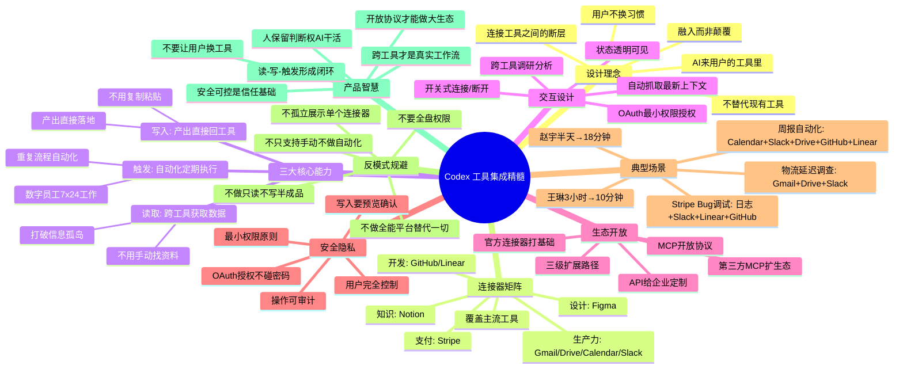

**可直接复用的工具集成原则**：

1. **不要试图替代用户已经在用的工具——去连接它们**。迁移成本是SaaS adoption最大的障碍，不换工具才能把adoption摩擦降到最低。
2. **连接器要覆盖用户的完整工作流，不是单点工具**。真实工作跨邮件、聊天、文档、代码、项目管理——你要能把这些都连起来，才能真正解决问题。
3. **读、写、触发三个能力缺一不可**。光读不写，用户还要手动复制；光写不读，没有上下文；没有触发，只能手动调用，不能自动化——三个能力形成闭环才是真正有用的集成。
4. **连接状态要透明，控制权要给用户**。哪个连了哪个没连一眼能看到，想连就连想断就断，所有写入操作要预览确认——用户对数据有控制权才敢用。
5. **生态要开放，不要自己做所有连接器**。官方做主流工具打基础，用开放协议（如MCP）让第三方和企业自己扩展长尾——生态才能爆发。
6. **展示真实的跨工具场景，不要孤立讲单个连接器**。用户不关心"我们能连Gmail"，用户关心"我调查物流延迟的时候，它能自动帮我找邮件、找聊天记录、找文档、写报告"——场景才是价值。
7. **自动化是终极价值**。把"人叫AI做一次"变成"AI定期自动做"，才能真正帮用户省时间，从工具变成"数字员工"。
8. **安全隐私是基础，不是加分项**。能访问用户这么多数据，必须把安全和可控性做好——OAuth授权、最小权限、操作审计、写入确认，一个都不能少。
9. **AI跑腿，人拍板**：最有价值的分工是——AI负责跨工具找信息、做分析、写初稿、跑测试、改状态这些重复性跑腿工作；人负责审核判断、做决策、定方向——人机协同各取所长。
10. **数据留在原工具是降低信任门槛的关键**：不要试图把用户数据迁移到你的平台上，让数据留在Gmail/Slack/GitHub里，你只是被授权访问——用户会觉得"数据还是我的，你只是帮我处理"，信任门槛大幅降低。

### 工具集成 Do / Don't 速查表

| 集成决策 | ✅ Do（Codex的做法） | ❌ Don't（常见错误） |
|---|---|---|
| **产品策略** | 连接用户现有工具，做工具之上的智能层 | 做一个新的全能平台，试图替代Slack/GitHub/Notion |
| **能力设计** | 读-写-触发三能力闭环：能读就能写，能写就能自动触发 | 只读不写，用户还要复制粘贴；只能手动调用不能自动化 |
| **跨工具关联** | 用户给一个任务，AI自动判断需要哪些工具、自动跨工具取数关联 | 用户要手动说"去Gmail找X、去Slack找Y"，AI只是单工具查询器 |
| **授权方式** | 标准OAuth授权，不要密码；只申请最小必要权限 | 一连接就要全盘访问权限，要用户账号密码 |
| **状态管理** | 开关式管理，哪个连了哪个没连一眼看到，随时可断开 | 连接状态黑箱，用户不知道AI能访问什么，没法取消授权 |
| **写入操作** | 所有写入（发邮件/提PR/改文档）先预览，用户确认后才执行 | AI自作主张发消息、提PR、改文档，出了问题用户背锅 |
| **生态策略** | MCP开放协议，官方做主流，第三方做长尾，企业可自定义 | 只有官方能做集成，生态封闭，长尾工具永远连不上 |
| **价值展示** | 展示跨工具真实场景："调查物流延迟自动找邮件+聊天+文档" | 功能列表孤立罗列："支持Gmail""支持Slack""支持GitHub" |
| **自动化设计** | 支持定时/事件触发自动化，设置一次定期自动执行 | 每次都要用户手动调用，重复工作还是要用户记得叫AI |
| **数据归属** | 数据留在用户原工具里，Codex只是被授权访问，不迁移数据 | 要求把所有数据同步/导入到AI平台，用户失去数据控制权 |
| **企业安全** | 企业版有操作审计日志，管理员能看到谁用了哪些连接器做了什么 | 没有审计，企业管理员不知道员工用AI访问了什么数据 |
| **入门门槛** | 渐进式连接——用到哪个连哪个，不用一开始就把所有工具连上 | 注册后强制要求连接5个工具才能开始用，用户吓跑了 |
| **场景设计** | 既有办公场景（周报自动化）也有开发场景（Bug调试），覆盖两类用户 | 只讲开发场景，办公用户看不懂；或只讲办公场景，开发者觉得玩具 |
| **用户定位** | AI是跑腿的，人是决策者——AI做重复劳动，人做判断决策 | AI替人做决策，自动发邮件自动合并PR，出了问题无法追溯 |
| **扩展路径** | 三级路径：官方连接器→MCP第三方→API企业定制，覆盖各类用户 | 只有官方集成一种方式，中小企业够了但大企业满足不了 |

Codex的工具集成策略告诉我们：**AI的终极形态不是一个新的应用，而是一层智能——它无处不在，存在于你已经在用的所有工具里，理解你的上下文，帮你串联工具之间的断层，自动完成重复性的工作，但你始终掌握控制权**。当AI真正融入你的工作流而不是让你迁就它的时候，AI的价值才能真正释放出来。

---

**下一步**：继续阅读 [10 定价策略与商业模式](10-pricing-model.md)，分析Codex免费增值模式、六档套餐设计、配额管理机制、以及定价心理学在SaaS产品中的应用。
