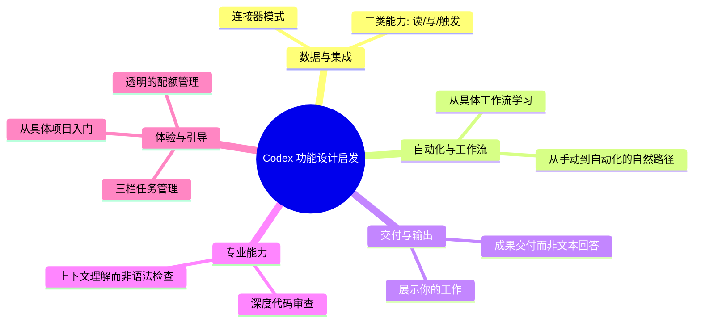
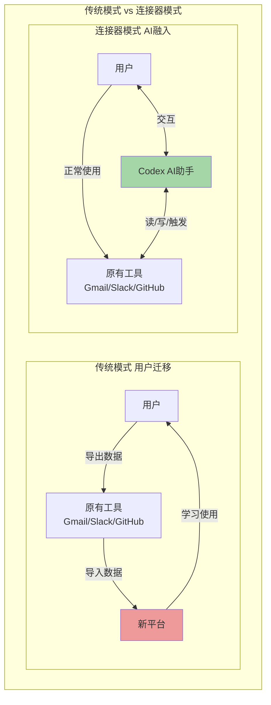
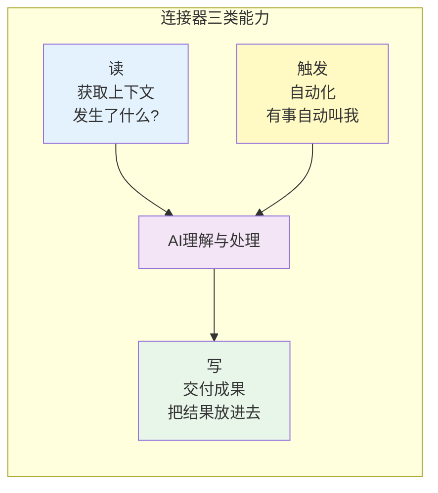
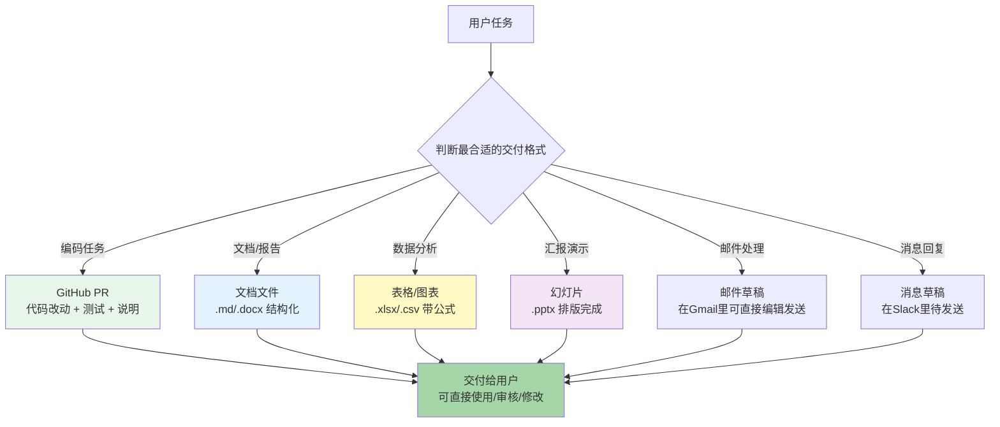
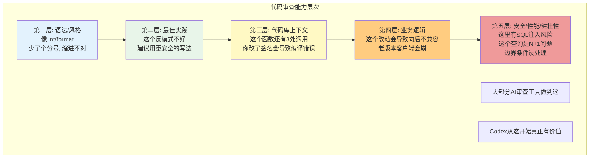
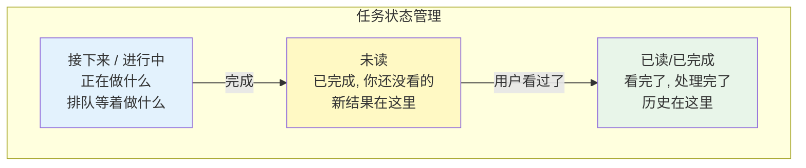
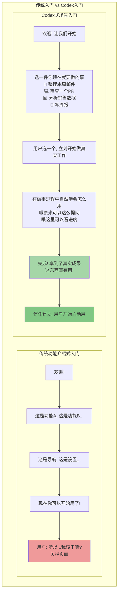
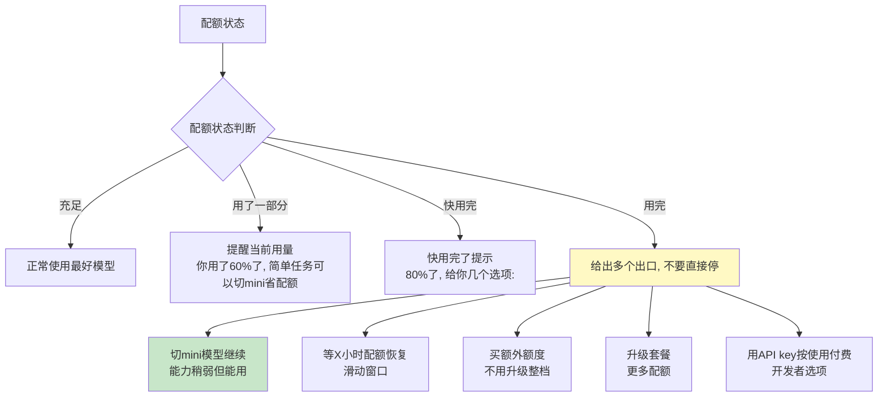
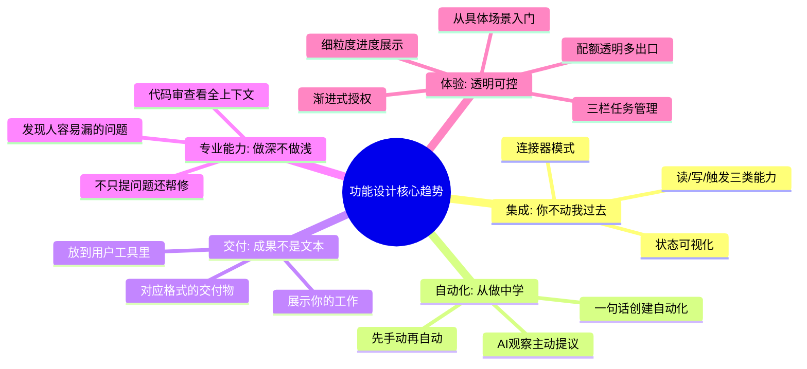

## 一、功能设计概述：从Codex功能中学到的可复用模式

ChatGPT Codex不仅是一个好用的产品，它的很多功能设计模式可以直接复用在AI产品、SaaS产品、自动化工具的设计中。本章不是讲"Codex有什么功能"，而是讲"这些功能背后的设计思路是什么，我们可以怎么把这种思路用在自己的产品里"。

这些功能设计模式不是Codex独有的——它们代表了下一代AI工具的共性设计方向：**从"工具"变成"助手"，从"回答问题"变成"完成工作"，从"让用户配置"变成"自然学习用户习惯"**。

---

## 二、连接器（Connectors）模式：不要让用户搬数据

连接器是Codex最核心的功能设计之一——它不是一个简单的"集成列表"，而是一套完整的"去用户已有工具里干活"的设计哲学。

### 2.1 核心设计理念：你不动，我过去

传统软件的思路是："把你的数据导入到我的平台来，在我这里处理"——用户需要导出、导入、迁移、学习新工具，摩擦极大。

Codex连接器的思路是：**"你不用动，我去你已经在用的工具里读数据、写结果"**——用户不需要改变任何习惯，不需要迁移任何数据，Codex"长"在用户已有的工具里。

### 2.2 连接器状态可视化：让用户知道什么连了什么没连

Codex的连接器设计有一个非常重要但容易被忽略的细节：**连接状态可视化**。在界面里，每个连接器都有清晰的状态指示：

| 状态 | 视觉表现 | 用户感知 |
|---|---|---|
| **未连接** | 灰色开关/未连接按钮 | "这个工具还没接，点一下就能连" |
| **已连接** | 绿色对勾/已连接标识/断开按钮 | "这个已经连好了，可以用" |
| **连接中** | 加载状态 | "正在连接，稍等" |
| **授权过期/出错** | 警告标识/重新连接按钮 | "这个连接有问题，需要重新授权" |

**功能启发**：
1. **连接器入口要显眼，不要藏在设置深处**——最好在主界面、侧边栏、或者第一次用到相关功能时就提示连接
2. **状态必须一目了然**——不要让用户猜"我连没连Gmail？"，用颜色和图标清晰显示
3. **连接流程要短**——OAuth授权，点2-3次就完成，不要让用户填API密钥搞半天（高级用户可以手动填，但默认要一键OAuth）
4. **断开连接要容易**——用户随时可以断开，不要让用户觉得"接上了就摘不下来"
5. **连接后立刻展示价值**——刚连完Gmail，不要只说"连接成功"，立刻说"我看到你有12封未读重要邮件，要不要我帮你总结一下？"，让用户立刻感受到连接的价值

### 2.3 连接器的三类能力：读、写、触发

一个设计良好的连接器不只是"读数据"——它应该具备三类能力，覆盖完整的工作流：

| 能力类型 | 说明 | 示例（Gmail连接器） | 产品价值 |
|---|---|---|---|
| **读（Read）** | 从工具中获取数据、获取上下文 | 读取未读邮件、读取邮件内容、搜索邮件 | 让AI了解用户正在做什么、有什么信息，不需要用户复制粘贴 |
| **写（Write）** | 把成果写回工具中，交付结果 | 创建邮件草稿、发送邮件、给邮件加标签、移动邮件 | AI不只是给你看结果，直接帮你把结果放到该放的地方 |
| **触发（Trigger）** | 监听工具中的事件，自动触发工作 | 收到新邮件时自动总结、邮件标记为重要时提醒、定时检查邮件 | 从"用户主动让AI做事"变成"AI主动帮你做事"，自动化的基础 |

**功能启发**：
1. **不要只做只读集成**——很多产品集成都只做"读数据展示给AI"，但"写回去"才是真正完成工作的关键。用户要的不是"AI告诉我邮件里有什么"，是"AI帮我写好回复草稿放到Gmail里"
2. **触发能力是自动化的基础**——有了触发，AI才能从"被动响应"变成"主动助手"。比如"每天早上9点自动总结Slack未读消息"就需要触发能力
3. **三类能力要渐进开放**——默认先开"读"，让用户觉得安全；用户用着觉得好，再开放"写"（而且写操作默认创建草稿不直接发送）；最后再开放"触发"做自动化，一步一步建立信任
4. **写操作默认要保守**——能创建草稿就不要直接发送，能创建PR就不要直接merge，给用户审核确认的机会
5. **不同连接器三类能力支持程度可以不同**——比如GitHub可以支持读代码、写PR、触发CI；Notion可以支持读页面、写页面、触发页面更新；根据工具特性来

### 2.4 第一批做哪些连接器？

不要一开始就做几十个连接器——先做2-3个目标用户最常用的，把体验做深：

| 用户类型 | 优先做的连接器 | 为什么是这些 |
|---|---|---|
| **开发者** | GitHub、Slack、VS Code（本地） | 开发者90%的时间在这三个地方，接好这三个，80%的场景就覆盖了 |
| **办公族/职场人** | Gmail/Outlook、Google Docs/Office、Notion、Slack | 邮件、文档、笔记、沟通是办公族每天用的 |
| **销售/营销** | Salesforce、HubSpot、Gmail、LinkedIn | CRM是核心，邮件和社交是沟通渠道 |
| **通用型AI助手** | Google Workspace、Microsoft 365、浏览器 | 覆盖最广的用户群体 |

**功能启发**：
1. **第一批连接器聚焦目标用户最高频使用的2-3个工具**——不要贪多，把这几个做深做透，比做10个浅的集成有用
2. **做连接器的时候站在用户工作流角度思考**——用户做"周报"这件事需要从哪拿数据？Slack讨论、Jira工单、GitHub提交、日历记录——这些就是你需要接的
3. **本地"连接器"也很重要**——本地文件系统、IDE、终端，这些虽然不是SaaS工具，但对很多用户来说是每天待最久的地方，IDE扩展和CLI就是"本地连接器"
4. **留出自定义连接器/开放生态的口子**——像MCP那样，让用户和第三方能自己做连接器，你不需要一个个做，生态会自己长出来

---

## 三、自动化流程创建启发：从手动到自动的自然路径

传统自动化工具（比如Zapier、Make）的思路是："先配置自动化规则：当A发生时，做B"——用户需要提前想清楚"我要自动化什么"，然后去配置触发器、动作、映射关系，门槛很高。

Codex的自动化思路完全不同。

### 3.1 设计理念：先手动做一次，满意了再自动化

Codex的自动化路径是：
1. **第一次：手动完成一次任务**——用户用自然语言说"帮我整理本周未读Gmail邮件，生成一份简报"，Codex做了，用户觉得结果不错
2. **时机到了主动问**——做了1-2次同样的任务后，Codex主动问："我注意到你每周五都会让我整理本周邮件，要不要我创建一个自动化流程，每周五下午自动帮你做？"
3. **用户说"好"就创建好了**——不用配置触发器，不用选工具，不用映射字段，自然语言确认一下，自动化就建好了
4. **自动化运行时可控**——自动跑的时候会通知用户，结果给用户审核，不满意可以调整，可以随时关掉

```mermaid
graph TD
    subgraph SG5 ["Codex 式自动化路径"]
        M1["用户手动发起任务<br/>帮我整理本周邮件"]
        M2["Codex执行任务, 用户满意"]
        M3["又手动做了1-2次同样的事"]
        M4["Codex主动识别模式<br/>你似乎每周都做这个,<br/>要不要自动执行?"]
        M5["用户确认"]
        AUTO["自动化创建完成<br/>定时/触发自动执行"]
        RUN["自动化运行<br/>通知用户, 结果可审核"]
        ADJUST["用户可以调整频率/内容<br/>可以随时暂停/删除"]
        M1 --> M2 --> M3 --> M4 --> M5 --> AUTO --> RUN --> ADJUST
    end
    subgraph SG6 ["传统自动化工具路径"]
        T1["用户想: 我要自动化什么?"]
        T2["找到自动化工具, 新建流程"]
        T3["选择触发器<br/>每周五下午5点"]
        T4["选择动作<br/>读取Gmail"]
        T5["配置参数, 映射字段<br/>把邮件正文放到这个变量"]
        T6["添加更多步骤, 测试"]
        T7["保存, 启用"]
        T1 --> T2 --> T3 --> T4 --> T5 --> T6 --> T7
    end
    style M4 fill:#fff9c4
    style AUTO fill:#a5d6a7
    style T3 fill:#ef9a9a
    style T5 fill:#ef9a9a
```

### 3.2 为什么这种方式好太多？

| 维度 | 传统配置式自动化 | Codex式"从做中学"自动化 |
|---|---|---|
| **门槛** | 高——需要用户提前想清楚规则，学习怎么配置 | 极低——用户只需要正常做事，AI观察学习 |
| **前提** | 用户要先知道"我要自动化什么" | 用户不用提前想，做了几次AI就发现了 |
| **配置** | 手动选触发器、动作、映射字段 | 一句话确认就行，AI已经知道怎么做了 |
| **准确性** | 配置错了就跑错，调半天 | 基于前几次成功执行的经验，AI知道你要什么样的结果 |
| **心理负担** | "配置自动化好麻烦，算了" | "哦AI帮我想到了，好啊" |
| **适用人群** | 高级用户/运营人员 | 所有用户 |

**功能启发**：
1. **不要让用户从"配置规则"开始自动化**——先让用户用自然语言手动完成任务，这是零门槛的
2. **AI要观察学习用户的重复行为**——同一个任务做了2次以上，就可以主动问"要不要自动化"
3. **主动提议，不要等用户来配置**——用户大部分时候不会主动去想"我要自动化这个"，AI观察到模式主动提议， adoption率高得多
4. **自动化创建流程要极简**——用户说"好"就够了，最多问一句"每周五下午5点可以吗？"，不要搞配置向导
5. **自动化运行结果要给用户审核**——尤其是早期版本，自动跑完给用户看"我按上次的方式做了，你看对不对"，用户可以纠正，AI越学越准
6. **自动化管理要简单**——要有一个地方能看到"我创建了哪些自动化"，能暂停、能编辑、能删除，不要让用户忘了自己开了什么自动化
7. **自动化可以有"建议"和"自动执行"两级**——一开始可以先"建议"，到点了提醒你"该整理邮件了，要不要我现在做？"；用户信任了再升级到全自动执行

### 3.3 自动化触发类型

除了"重复任务识别"，还有几类常见的触发场景：

| 触发类型 | 示例 | 用户价值 |
|---|---|---|
| **定时触发** | 每周五下午生成周报、每天早上9点总结未读消息 | 周期性固定工作自动做 |
| **事件触发** | GitHub收到新PR时自动做初步审查、收到重要邮件时自动提醒 | 有事发生时AI立刻处理 |
| **阈值触发** | 项目进度落后10%时预警、Slack提到你的关键词时通知 | 异常情况主动提醒 |
| **上下文触发** | 你打开一个PR时自动帮你审查、你写代码到某个文件时给建议 | 你在工作时AI恰到好处地帮忙 |

---

## 四、工作成果交付启发：交付能直接用的东西，不是一堆文字

传统聊天AI的交付方式是"给你一段文字回答"——这对于"回答问题"是够的，但对于"完成工作"是远远不够的。Codex的交付设计是**"直接产出你能直接用的成果物"**。

### 4.1 不同任务对应不同交付物格式

不是所有回答都是Markdown文本——根据任务类型，Codex会生成对应的、可直接使用的文件/成果：

| 任务类型 | 交付物格式 | 用户能直接用来做什么 |
|---|---|---|
| **写代码/改代码** | GitHub Pull Request（含改动、说明、测试结果） | 直接review、merge，不用自己复制粘贴 |
| **写文档/简报/报告** | .docx文档 / Markdown文档 / Google Docs | 直接编辑、发送、归档 |
| **数据分析** | .xlsx表格 / .csv数据文件 / 带图表的分析报告 | 直接拿去汇报、继续分析 |
| **做汇报/演示** | .pptx幻灯片 | 直接用，或者稍微改改就能演示 |
| **处理邮件** | 邮件草稿（在Gmail里） | 编辑一下直接发送 |
| **回复消息** | Slack/IM回复草稿 | 看一眼点发送 |
| **任何任务** | 结构化总结（做了什么、来源、假设、下一步） | 知道AI干了什么，心里有数 |

### 4.2 "展示你的工作"原则：透明化交付，建立信任

交付成果的时候，Codex不只给你最终结果——它还会"展示它的工作（Show Your Work）"：

1. **来源（Sources）**：这个结果基于哪些信息？哪个邮件、哪个Slack消息、哪个文件、哪个PR，给链接能溯源
2. **假设（Assumptions）**：有哪些不明确的地方？我做了什么假设？为什么这么假设？如果不对请告诉我
3. **改动（Changes）**：如果改了东西（代码、文件、文档），具体改了什么？diff给你看，为什么这么改
4. **推理过程（Reasoning）**：我是怎么一步步得出这个结论/做这个决定的？
5. **下一步建议（Next Steps）**：做完这个之后，建议你接下来做什么？

**为什么这很重要？**
- 用户不需要花时间猜"这东西是怎么来的"
- 如果结果有问题，能快速定位是哪里错了（是信息错了？假设错了？推理错了？）
- 用户有掌控感——知道AI做了什么，不是面对一个黑盒
- 错了用户能纠正，AI能越做越好

**功能启发**：
1. **根据任务类型选择合适的交付格式，不要默认都是文本**——做表格就生成xlsx，做演示就生成pptx，改代码就提交PR，用户拿到就能直接用，不用自己再复制粘贴排版
2. **交付物要放到用户本来就用的工具里**——邮件草稿放到Gmail，PR放到GitHub，文档放到Notion，不要让用户从你的平台再下载再上传
3. **永远展示来源**——AI说的任何结论、生成的任何内容，都要能溯源到原始信息，标注来源链接
4. **明确列出假设**——不要把假设当事实，不确定就说"我假设X，如果不对请告诉我"，给用户纠正的机会
5. **改动要透明**——修改了任何东西都要展示diff，告诉用户改了什么、为什么改
6. **给下一步建议**——做完一件事不要停，告诉用户"接下来你可能想做X/Y/Z"，主动引导工作流
7. **提供"导出/下载/发送"选项**——哪怕生成了文件，也要让用户能方便地下载、分享、发给别人
8. **成果要"基本可用"，不是"还需要大改"**——生成的文档、表格、幻灯片不是半成品，是排版工整、内容完整、用户最多改改细节就能用的成品

---

## 五、代码审查功能启发：不只是挑错，是理解上下文

很多AI代码审查工具只做"语法检查"、"风格检查"、"找lint错误"——这跟IDE自带的lint没本质区别，价值有限。Codex的代码审查之所以被Duolingo、Ramp高度评价，是因为它**理解业务上下文**，能发现人类容易遗漏的深层问题。

### 5.1 代码审查的五个层次

Codex的代码审查不是在一个层次上，是层层深入：

### 5.2 核心能力：全代码库上下文 + 历史理解

普通审查工具只看PR diff——这就是为什么它们发现不了向后兼容性问题：因为diff里只看得到改了什么，看不到谁在用这个东西。

Codex审查代码的时候：
1. **不只看diff，检索整个代码库**——这个函数被哪些地方调用了？改这个参数会不会影响其他地方？
2. **看历史PR和commit**——这个模块之前改过什么？之前踩过什么坑？为什么原来这么写？
3. **结合业务上下文**——这个PR对应的Jira工单是什么？Slack里怎么讨论的需求？理解"为什么要做这个改动"，而不只是"改了什么"
4. **看测试覆盖**——这个改动有没有对应的测试？现有测试覆盖到了吗？需要补什么测试？

Duolingo说Codex是"唯一能发现向后兼容性问题的工具"——就是因为它看得到整个代码库，知道哪些地方依赖这个改动，而人类审查者和其他工具只看diff，看不到这些。

### 5.3 审查结果不是只挑错，还要帮你修好

Codex的审查不是"这里有问题，你自己改吧"——它给出完整的解决方案：

| 审查结果项 | 内容 |
|---|---|
| **问题定位** | 精确到文件、行号，指出哪里有问题 |
| **问题解释** | 为什么这是问题？会导致什么后果？严重程度如何？ |
| **修复建议** | 具体应该怎么改，给出改好的代码片段 |
| **测试建议** | 应该加什么测试来覆盖这个问题，防止以后再出现 |
| **正向反馈** | 不只挑错，哪里写得好也指出来，鼓励好的实践 |

**功能启发**：
1. **不要只做语法/风格检查**——这些IDE都能做，AI要做IDE做不到的事：结合上下文找逻辑问题、业务问题、兼容性问题
2. **审查一定要看全上下文，不要只看diff**——看相关代码、看调用方、看历史、看需求文档，这才是AI审查的价值所在
3. **向后兼容性检测是特别有价值的差异化点**——这是人类审查者很容易漏掉但影响极大的问题，谁先做好谁就能脱颖而出
4. **给修复方案，不要只提问题**——用户要的不是"你告诉我这里错了"，是"你帮我修好"；指出问题+给出修复代码，这才是完整的体验
5. **自动生成测试是杀手级功能**——审查发现问题，同时帮你生成能复现问题的测试，帮你验证修复，这对开发者价值巨大
6. **严重程度分级**——Critical/High/Medium/Low，不要一堆问题让用户不知道先改哪个
7. **也要给正向反馈**——不要让审查变成"批斗大会"，好的代码也要表扬，开发者体验会好很多
8. **审查结果可以直接评论到PR上**——跟GitHub/GitLab集成，审查意见直接作为PR评论，不用从你的平台复制过去

---

## 六、任务管理与进度启发：透明化任务队列，让用户知道AI在干嘛

Codex不是"一问一答"——它可以同时处理多个任务，有长时运行的异步任务，因此需要清晰的任务管理界面。

### 6.1 三栏任务列表：接下来/未读/已读

Codex的任务管理采用非常经典的三栏布局（或者说三状态分组）：

| 状态 | 说明 | 用户能做什么 |
|---|---|---|
| **进行中/排队中** | AI正在处理的任务，或者等着处理的任务 | 看实时进度、取消任务、调整优先级 |
| **未读（已完成）** | AI做完了，但用户还没看的任务（有未读标记） | 点开看结果、审核、不满意让AI重做 |
| **已完成/已归档** | 用户已经看过、处理完的任务 | 回看历史结果、复用、重新执行 |

### 6.2 任务进度透明化：不要只给加载转圈

AI任务尤其是长任务（代码重构、深度研究、大型分析）可能需要几分钟甚至更久——这时候绝对不能只给一个加载转圈，用户会焦虑、会不知道它是不是卡住了、会关掉页面。

Codex的任务进度展示会告诉你：
1. **当前在做什么步骤**——"正在克隆代码仓库"、"正在分析相关文件"、"正在运行测试"、"正在生成PR描述"，而不是"加载中"
2. **已经完成了什么**——展示已经做完的步骤，让用户看到进展
3. **正在调用什么工具**——"正在读取GitHub PR #123"、"正在搜索代码库中的相关调用"
4. **实时流式输出**——思考过程、中间结果会实时流出来，用户能看到AI"在想什么"
5. **预计剩余时间（如果能估计）**——大概还需要多久，给用户预期

**功能启发**：
1. **支持多任务并行，要有任务队列/列表**——用户可能同时让AI做几件事，要有地方能看到所有任务的状态
2. **三栏/三状态管理是经过验证的经典模式**——"接下来做什么"、"有什么新结果"、"历史记录"，清晰明了
3. **未读标记很重要**——任务完成了要明显告诉用户"有新结果你没看"，用badge、高亮、通知
4. **长任务一定要有细粒度进度，不要只转圈圈**——告诉用户正在做什么步骤、完成了哪些、现在在调用什么工具，透明感能极大降低等待焦虑
5. **长任务要能后台运行**——用户不用停在这个页面等，可以去做别的事，完成了通知他（多端同步通知：IDE、网页、手机都能收到）
6. **任务可以取消、可以暂停、可以重试**——用户发现AI理解错了，能立刻停下来，不用等它做完
7. **失败了要告诉用户原因，给出重试/调整选项**——不要只说"任务失败"，要说"连接GitHub超时了，要不要重试？"或者"我理解错需求了，能不能再说明一下？"
8. **任务历史可搜索、可回看**——之前做过的任务能找到、能看结果、能"再做一次类似的"

---

## 七、入门引导启发：从具体项目开始，不是从功能介绍开始

很多产品的新手引导是"欢迎来到XX！我们有这些功能：A、B、C、D...点这里开始"——这是最差的入门方式，用户看完还是不知道"我具体能用来干嘛"。

Codex的入门引导思路完全不同。

### 7.1 设计理念："让我们开始构建"——从一个具体工作场景开始

Codex对新用户不说"让我给你介绍我们有10个功能"，而是说"让我们开始吧——选一个你现在就想做的事："

给出的选项是具体的、用户真实在做的工作：
- - "帮我审查一个GitHub PR"
- - "帮我整理本周未读邮件"
- - "帮我写一份项目周报"
- - "帮我分析这个KPI数据"
- - "帮我重构这段代码"

用户选一个，立刻开始做真实的事——在做事的过程中自然就学会产品怎么用了。

### 7.2 "通过每一次输出逐步建立信任"——渐进放权

Codex不要求新用户一开始就"把GitHub账号给我、把Gmail授权给我、让我随便改代码"——信任是逐步建立的：

1. **第一步：只读对话**——先在网页上问问题，不需要授权任何东西，先感受AI能力
2. **第二步：连接简单工具**——用户觉得"这东西还行"，引导连接Gmail看看，只读，帮你总结邮件
3. **第三步：写草稿**——用户觉得总结得不错，试试让它写回复草稿，但草稿要你确认才发送
4. **第四步：文件访问**——用IDE扩展了，先只读访问项目文件，帮你看代码
5. **第五步：修改代码/执行命令**——信任建立了，可以让它改代码，但改完给你diff确认
6. **第六步：自动化**——足够信任了，可以让它自动执行一些任务

**功能启发**：
1. **不要上来就做"产品介绍Tour"**——用户不想先读说明书再用产品，让他们立刻开始做真实的事
2. **入门选项要具体、要真实、要用户现在就有需求**——不要说"试试我们的AI能力"，要说"帮你整理本周邮件"——后者用户立刻知道是什么，知道自己有没有这个需求
3. **从一个高频、高价值、低风险的场景开始**——第一次任务不要让用户做"重构整个项目"这种大事，先做"总结未读邮件"这种低风险、很快出结果、用户立刻能感受到价值的事
4. **第一次体验必须快速出成果**——用户选了场景，1分钟内就要看到结果/看到进展，不要让新用户等5分钟加载
5. **授权和放权是渐进的**——第一次用不要弹一堆授权请求，用到哪个功能再请求哪个授权，而且先开只读，再开写，用户有安全感
6. **在使用过程中自然提示功能，不要一次性教完**——当用户做某件事的时候，恰到好处提示"你知道吗，你还可以这样..."，而不是一开始把所有功能都讲一遍
7. **第一个成果一定要让用户"哇"一下**——第一次任务做好了，用户立刻感受到价值，比10页功能介绍都有用；第一个任务做砸了，用户再也不会回来
8. **记住用户的入门选择**——用户第一次选了"开发者场景"，后续默认就给开发者相关的功能和建议，不要下次打开又重新问

---

## 八、配额管理启发：透明、灵活、用户友好

配额管理是AI产品体验的重要组成部分——做不好用户会觉得"怎么又没额度了"、"我还能干嘛"，体验极差；做好了用户心里有数，不会焦虑。

### 8.1 滑动窗口vs固定周期：用户体验差异巨大

Codex用5小时滑动窗口，而不是"每天重置"或"每月重置"：

| 机制 | 用户体验 | 问题 |
|---|---|---|
| **固定周期（每日重置）** | "今天配额用完了？等明天吧"——很挫败 | 开发者经常集中一下午写代码，可能上午就把额度用完了，下午没法干活 |
| **滑动窗口（5小时）** | "刚集中用了一波？等几小时额度就回来一部分，不用等到明天" | 更灵活，符合真实使用模式：用一阵，休息一下/开会，回来又有额度了 |

### 8.2 配额透明：告诉用户还能做什么，不要只说"用完了"

差的配额提示："您的额度已用完，请升级。"
好的配额提示："过去5小时你用了80%的Plus配额——你还可以：
- 让Codex审查约2个PR
- 生成约5份简短邮件回复
- 或者切换到GPT-5.4-mini，还能处理约20个简单任务"

| 维度 | 差的做法 | 好的做法（Codex式） |
|---|---|---|
| **配额展示** | 只在快用完了才提示 | 始终能看到当前用了多少，进度条/百分比 |
| **用完提示** | "额度用完了，请升级" | "你用完了5.5配额——你还可以：①切换到mini继续用 ②等2小时配额恢复 ③升级Pro ④买额外额度" |
| **计量方式** | 一个模糊的"点数" | 分维度计量：本地消息X条、云端任务Y个、代码审查Z次，清晰明了 |
| **降级选项** | 直接不让用了 | 自动/手动切到轻量模型，速度慢点但能继续干活 |

### 8.3 多维度计量，不同价值不同配额

Codex不是"一个配额打天下"——它分三种维度计量，因为不同类型的任务价值和成本差异很大：

| 配额维度 | 为什么单独计量 |
|---|---|
| **本地消息（IDE/CLI/桌面）** | 实时交互，延迟敏感，通常是比较小的快速任务 |
| **云端任务** | 长时间运行、可能用到很多工具、消耗资源多，所以单独配额 |
| **代码审查** | 专门的代码模型，独立配额，不跟普通聊天抢 |

**功能启发**：
1. **滑动窗口比固定周期用户体验好**——如果是高频使用场景，考虑几小时的滑动窗口而不是每日重置，更符合用户"集中用一阵"的使用模式
2. **配额状态要始终可见，不要藏着**——让用户随时知道用了多少、还剩多少，不要等用完了才告诉用户
3. **配额用尽不要"关门"，要给多个出口**——切轻量模型、等恢复、买额外额度、升级、API付费——至少给2-3个选项，让用户选适合自己的
4. **明确告诉用户"还能做什么"**——不要只说"用了80%"，要说"还能审查2个PR/写5封邮件"，给用户具体的预期
5. **不同类型的操作分开计量**——重任务（长时运行、高成本）和轻任务（快速问答、简单补全）不要抢同一个配额池，用户做轻任务不会因为重任务用完了额度而用不了
6. **提供"省配额模式"开关**——让用户选择"省配额（用mini模型）"还是"最佳质量（用顶配模型）"，给用户控制权
7. **额外额度购买要方便，不要逼用户升级整档**——用户只是偶尔超额，不要让他必须从$20升级到$200，可以单独买$5的额外额度
8. **配额计算不要太复杂让用户算不清**——虽然是多维度计量，但展示给用户要简单，不要让用户做数学题

---

## 九、功能设计启发总结

Codex的功能设计整体指向一个方向：**从"用户使用工具"变成"AI助手帮用户完成工作"**。

这些功能设计模式给我们的启发总结：

1. **不要让用户改变习惯来适应你的产品——你的产品要去适应用户已有的习惯**（连接器模式）
2. **自动化不要让用户从配置开始——让用户先正常做事，AI观察学习后主动提议**（自然自动化路径）
3. **AI的交付物是"能直接用的成果"，不是"一段需要复制粘贴的文字"**（成果交付）
4. **AI的专业能力要做深——要做人类做不到/做不好/容易漏的事，不要做工具已经能做的事**（深度代码审查）
5. **所有"黑盒"部分都要透明化——任务进度、AI在做什么、配额用了多少、结果怎么来的——透明带来信任**（进度、配额、来源展示）
6. **入门不要讲功能——给用户一个他现在就要做的具体任务，在做事的过程中学会用产品**（场景化入门）
7. **渐进式放权——不要一上来就要所有权限、让用户把最重要的事交给你，一步一步建立信任**（从只读到写、从建议到自动化）
8. **遇到限制给选项，不要给墙——配额用完、任务失败、权限不够，都要给用户解决方案，不要只是报错**（多出口设计）

这些不是"锦上添花"的功能细节——它们决定了你的AI产品是"感觉像个助手"还是"感觉像个难用的工具"。Codex之所以体验好，就是因为在这些点上都想清楚了，做对了。

---

**下一步**：继续阅读 [14 设计启示与经验总结](14-lessons-learned.md)，从产品思维、设计哲学、商业化、信息架构、UX写作五个维度系统性总结学习Codex获得的经验与启示。
