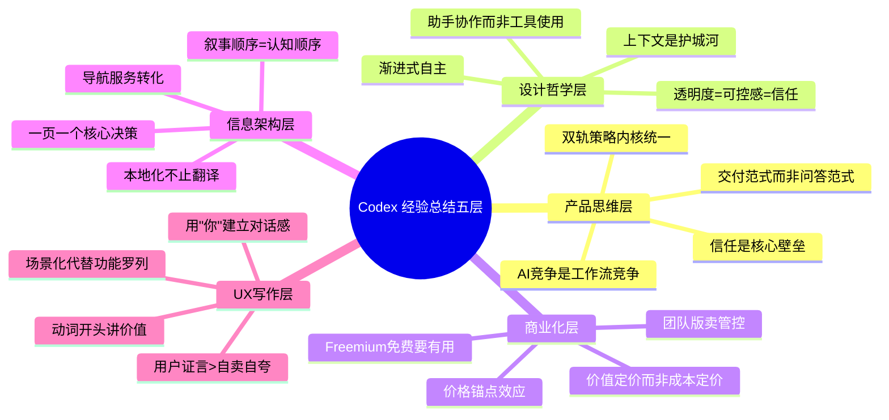
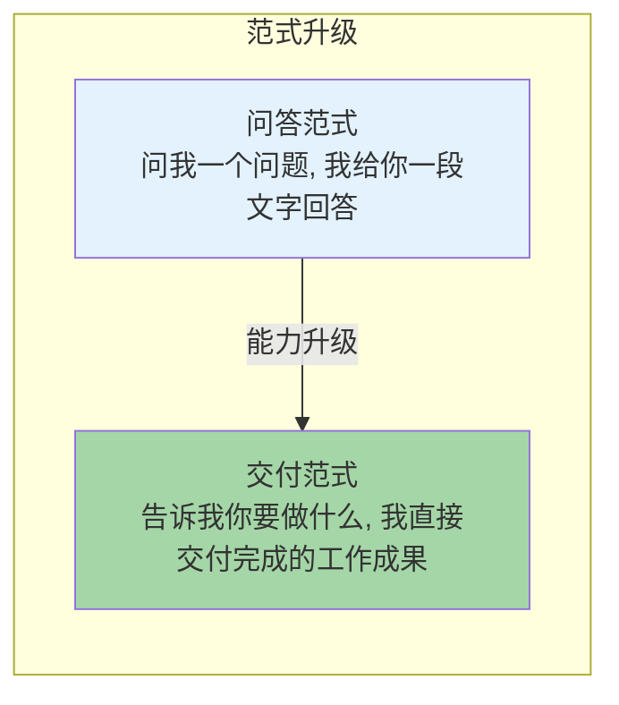
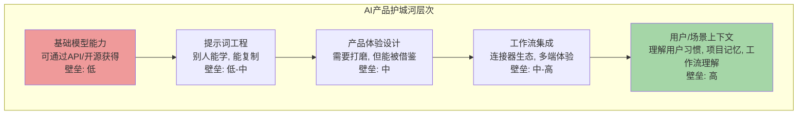
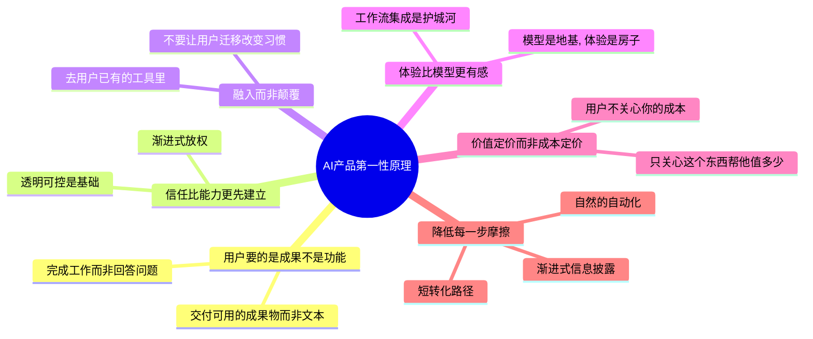

## 一、总结概述：从Codex学到的系统性经验

经过对ChatGPT Codex从产品定位、核心功能、界面设计、信息架构、用户体验、双轨策略、多端协同、工具集成、定价模型、技术架构、设计理念到功能启发的完整分析，我们可以提炼出一套系统性的AI产品设计方法论。这不是零散的技巧，而是一套环环相扣的思维框架——从产品定位，到设计哲学，到商业化，到信息架构，到文案写作，每一层都有清晰的原则和可验证的模式。



本章从这五个层面系统总结经验，最后提出一些值得反思和讨论的问题——没有完美的产品，Codex也不例外，批判性思考比全盘照搬更重要。

---

## 二、产品思维层面：AI产品的竞争本质变了

### 2.1 AI产品的竞争不是模型能力的竞争，是工作流集成和用户体验的竞争

2023-2024年大家都在卷"谁的模型更强"——MMLU跑分多少、上下文多长、推理多快。但到2025-2026年，基础模型能力的差距正在快速缩小：GPT、Claude、Gemini、国产大模型们在通用能力上的差距对于普通用户来说已经不明显了。

Codex告诉我们：**当模型能力趋同时，产品体验和工作流集成才是真正的差异化壁垒**。

| 竞争维度 | 早期AI产品竞争（2022-2024） | 现在/未来AI产品竞争（2025+） |
|---|---|---|
| **核心竞争点** | 谁的模型更强、跑分更高 | 谁融入用户工作流更深、体验更好 |
| **用户选择理由** | "这个AI回答更准确" | "这个AI直接在我用的工具里帮我把活干了" |
| **壁垒来源** | 模型训练能力、数据规模 | 用户习惯、集成深度、工作流理解、生态 |
| **可替代性** | 模型一升级就可能被替代 | 深度融入工作流后用户迁移成本极高 |

Codex的例子：
- 它不是模型最强的（至少不是所有维度），但它有最完整的多端体验（Web/IDE/CLI/桌面/移动端）
- 它有最成熟的连接器生态（Gmail/Slack/GitHub/Notion...）
- 它有最自然的自动化路径（从手动到自动）
- 它有最完善的信任建立机制（透明、可控、来源展示）
- 它直接交付成果（PR/文档/表格/幻灯片），而不是给一段文本

这些东西不是模型能力能解决的——这是产品能力、工程能力、设计能力的综合体现。**光有好模型是不够的，把模型能力包装进一个用户愿意用、敢用、用得爽的完整工作流体验里，才是真正的竞争力**。

**经验**：做AI产品，不要把所有精力放在"接更好的模型"上——模型是地基，但房子好不好住要看户型、装修、家具、物业。花70%的精力在工作流设计、用户体验、集成、信任建立上，这些才是用户真正感知到的东西。

### 2.2 从"问答范式"转向"交付范式"：AI的价值从"回答问题"升级为"完成工作"

这是AI产品最根本的范式转移——从ChatGPT刚出来时的"问答范式"，到Codex代表的"交付范式"。



| 维度 | 问答范式（Chatbot） | 交付范式（Codex/Agent） |
|---|---|---|
| **用户心智** | "我问AI一个问题" | "我让AI帮我干活" |
| **输出形式** | 一段文字 | 可直接使用的成果（代码PR、文档、表格、幻灯片、邮件草稿） |
| **交互模式** | 一问一答，用户主导每一步 | 给一个目标，AI自主规划、执行、纠错、交付 |
| **价值衡量** | "回答得准不准、好不好" | "工作有没有完成、省了多少时间" |
| **工具使用** | 基本不用工具，靠模型内部知识 | 主动调用工具、连接用户数据、在沙箱里执行 |
| **信任机制** | 回答看起来有道理就行 | 展示来源、展示过程、结果可审核可修改 |

问答范式下，AI是"更聪明的搜索引擎"；交付范式下，AI是"能干的助手"。

为什么这个转移这么重要？因为**用户要的不是"答案"，用户要的是"工作被完成"**。
- 用户问"帮我写周报"，他要的不是一段"周报怎么写"的文字说明，他要的是一份写好的、基于他本周工作数据的、可以直接发出去的周报
- 用户说"帮我审查这个PR"，他要的不是"代码审查注意事项"，他要的是PR上已经留好的审查评论、发现的bug、修复建议
- 用户说"帮我处理邮件"，他要的不是"邮件处理技巧"，他要的是整理好的未读摘要、写好的回复草稿

Codex从根上理解了这一点——它的整个产品设计（连接器、沙箱执行、多格式交付、自动化）都是为"交付工作成果"服务的，而不是为"回答问题"服务的。

**经验**：做AI产品，从第一天就要问自己："用户要完成的工作是什么？我的产品最终交付什么成果？"不要做一个"更聪明的聊天框"，要做一个"帮用户把事办成的助手"。

### 2.3 双轨策略验证：一个产品可以同时服务差异很大的用户群，只要叙事分离、内核统一

很多产品团队会纠结"我们到底是做给开发者还是做给办公族？"——觉得必须选一个，否则两边都做不好。Codex证明了**一个产品内核完全可以同时服务差异极大的用户群，前提是：叙事分离、入口分流、体验侧重不同，但底层能力统一**。

双轨策略的关键条件：
1. **底层能力确实能覆盖两类用户**——Codex的"理解任务→调用工具→执行→纠错→交付"这一套内核，既适合写代码也适合写周报，底层Agent架构是同一套
2. **入口和叙事明确分流**——导航里明确区分Work和Developers，两个页面用不同的语言、不同的截图、不同的案例，用户进来立刻选对自己的路径
3. **不要试图用一套话术打动所有人**——办公页面不要讲CLI、不要讲MCP；开发者页面不要讲KPI、不要讲幻灯片生成
4. **不要为了一类用户牺牲另一类**——办公场景需要的Gmail/Notion连接器做好，开发者需要的IDE/CLI/GitHub也做好，能力上都支持，但展示上有侧重

**经验**：如果你的产品能力确实能服务多类用户，不要害怕做双轨/多轨——只要做好分流，用不同的故事讲给不同的人听，底层内核复用，这是比"做多个独立产品"效率高得多的策略。反过来，如果你的底层能力只能服务一类人，不要硬凑双轨，专注把一类人服务好。

### 2.4 信任是AI产品的核心壁垒：比能力更重要的是让用户敢用、愿意用、持续用

传统软件不需要这么纠结信任问题——你点一个按钮它做一件事，因果关系明确，你有完全控制权。AI产品不一样：
- AI是"自主"的，你说一句话，它可能做一连串你没明确让它做的事
- AI会犯错，而且犯错的方式有时候出人意料
- AI能访问你的数据、你的邮件、你的代码，一旦搞砸后果可能很严重
- AI是黑盒，用户可能不清楚它为什么这么做、基于什么信息

所以对于AI产品，**能力是基础，信任是壁垒**。能力再强，用户不敢把重要工作交给你，你就没用；能力稍微弱一点但用户信你、敢用你，你就有价值。

Codex建立信任的系统性方法我们在前面几章反复讲过：
1. **透明化**——展示来源、展示假设、展示改动、展示过程，不做黑盒
2. **可控感**——危险操作需要确认，用户可以审核、修改、撤销，AI是助手不是替代者
3. **渐进式放权**——从只读对话到写草稿到修改到自动化，一步一步建立信任，不要一上来就要所有权限
4. **社会证明**——真实公司、真实用户、真实证言，让用户看到"别人用了没问题"
5. **容错设计**——做错了能撤销、能回滚、能重来，不要让用户承担AI犯错的后果

**经验**：AI产品设计的优先级应该是：**安全可控 → 建立信任 → 能力体验**。不要一上来就追求"AI全自动搞定一切"，那样用户只会害怕。先让用户敢用，再让用户觉得好用，最后用户才会放权让AI做更多事。

---

## 三、设计哲学层面：AI应该是什么样的存在

### 3.1 最好的AI设计是让用户感觉"和一个能干的助手协作"，而不是"使用一个强大的工具"

传统软件的设计哲学是"工具"——用户是操作者，工具是被操作的对象，用户必须学习怎么用这个工具，必须按工具的规则来，必须一步步操作。

AI产品的设计哲学应该是"助手"——用户是老板，助手是来帮忙的，助手会理解你的意图、会主动做事、会问清楚不清楚的地方、会把结果交给你审核，你不需要学习怎么"操作"助手，你像跟人说话一样跟它沟通就行。

| 维度 | 工具思维（传统软件） | 助手思维（AI产品） |
|---|---|---|
| **用户角色** | 操作者，必须学习怎么用工具 | 老板/指挥者，用自然语言交代任务 |
| **交互模式** | 用户点按钮、填表单、一步步操作 | 用户说要什么，助手去做，做完汇报 |
| **主动程度** | 完全被动，不点不动 | 可以主动观察、主动提议、主动提醒 |
| **责任归属** | 用户操作错了用户负责 | 助手做错了助手要能改，用户有最终决定权 |
| **学习成本** | 用户要学工具怎么用 | 助手去理解用户的意图和习惯 |
| **容错** | 操作错了用户要自己撤销/回滚 | 助手会自己检查错误，做错了能修复 |

Codex给人的感觉就是一个"能干的实习生/助手"：
- 你交代一个任务，它自己去想怎么做
- 需要什么信息它自己去找（连接你的Gmail/GitHub）
- 遇到不确定的它会问你、会告诉你它的假设
- 做错了它会自己发现、自己修正
- 做完了把结果给你，还告诉你它是怎么做的、基于什么
- 你觉得不对可以让它改，你觉得可以就用

这个感觉非常重要——用户不会觉得"我在使用一个软件"，会觉得"我在跟一个人协作"。前者是累的，后者是轻松的。

**经验**：设计AI产品的时候，不要想"这个功能怎么操作"，要想"如果这是一个能干的助手，这时候它会怎么做"。把交互从"人机操作"变成"人际协作"，用户体验会有质的飞跃。

### 3.2 渐进式自主：让用户逐步放权，从Chat到Agent到Full Access

用户不会一下子就敢把重要工作完全交给AI——信任是逐步建立的。Codex（和ChatGPT整体）设计了非常清晰的自主度梯度，用户可以根据自己的信任程度选择给AI多少自主权：

```mermaid
graph TD
    L1[Level 1: Chat<br/>AI给建议, 用户自己做<br/>"告诉我怎么改"]
    L2[Level 2: Suggest<br/>AI写好草稿/改动, 用户审核确认<br/>"我写好了, 你看可以吗?"]
    L3[Level 3: Agent<br/>AI自主执行, 关键节点确认<br/>"我去做了, 这步需要你确认下"]
    L4[Level 4: Full Autonomy<br/>AI全自动完成, 做完汇报<br/>"都做完了, 这是结果"]
    L1 -->|"信任建立"| L2
    L2 -->|"更多信任"| L3
    L3 -->|"充分信任"| L4
    style L1 fill:#e3f2fd
    style L2 fill:#e8f5e9
    style L3 fill:#fff9c4
    style L4 fill:#a5d6a7
```

| 自主级别 | 说明 | Codex中的例子 | 用户心理 |
|---|---|---|---|
| **Level 1：对话建议** | AI只给建议、给答案，不动任何东西 | 问Codex"这个bug怎么改"，它告诉你思路和代码片段，你自己复制过去改 | 最安全，完全可控，新用户从这开始 |
| **Level 2：草稿/预览** | AI生成结果，但不直接发送/提交，用户审核确认 | 写好邮件草稿放在Gmail里、生成代码改动给你看diff、写好PR描述你确认 | "它帮我写好了，我看看改改再用"，还是用户有最终控制权 |
| **Level 3：Agent执行+确认** | AI自主规划执行，但危险操作/关键节点停下来问你 | 帮你重构代码自动改文件，但每改一个文件给你看diff确认；帮你处理邮件，发送前问你 | "它去干活了，大事还是我拍板"，效率高但依然可控 |
| **Level 4：全自动** | AI全自动完成，做完通知你结果 | 定时自动化任务（每周五自动整理邮件生成周报）；后台运行的异步任务，做完告诉你 | "我完全信它能做好，不用盯着"，最高效率，但需要充分信任 |

关键是**用户可以自己选在哪个级别，而且可以随时调整**——不强制你一开始就用全自动，也不让想用全自动的人每次都点确认。随着用户用得越多、建立了信任，他会自然地从Level 1慢慢往Level 4走。

**经验**：AI自主度不是"全有或全无"的开关——要设计梯度，让用户自己决定给AI多少权力，并且随着信任增加可以逐步放权。新用户默认从最低自主度开始，不要一上来就默认全自动。

### 3.3 透明度=可控感=信任：黑盒再强用户也会焦虑

这一点我们在多个章节反复强调——因为它太重要了，值得在经验总结里再讲一次。

AI产品最大的敌人不是"能力不够强"，是"用户不知道你在干嘛"。你想想生活中：
- 你敢坐一个你能看到司机、看到路况、随时能踩刹车的车
- 你不敢坐一个门窗全黑、你不知道它往哪开、也没法停下来的车——哪怕这个车自动驾驶技术再好

AI产品也是一样的。黑盒感会直接触发用户的焦虑和防御心理："它在干嘛？它会不会乱改我的东西？它理解错了怎么办？"

解决黑盒焦虑的方法就是**透明**——透明到什么程度？透明到用户能清楚知道：
1. **你在做什么**——当前步骤、进度、调用了什么工具
2. **你基于什么信息**——来源、引用、数据从哪来
3. **你做了什么假设**——不确定的地方明确说出来
4. **你改了什么东西**——改动给我看diff
5. **你接下来要做什么**——下一步计划是什么
6. **我能怎么干预**——我能暂停、能修改、能撤销、能确认

Codex把"一切尽在你的掌控之中"作为核心卖点，不是因为它技术不够强需要用户盯着，恰恰是因为它足够透明足够可控，用户才敢放心用它的强大能力。

**经验**：透明不是"给技术用户看的高级功能"——透明是给所有用户的基础体验。不要怕"透明了会让用户觉得AI不可靠"——恰恰相反，你越透明，用户越觉得你可靠，因为他能验证你是对的。

### 3.4 上下文是AI产品的护城河：不是模型有多强，是对用户工作场景理解有多深

很多人以为AI产品的护城河是模型——但模型是别人也能调用的（OpenAI自己的API、Anthropic的API、开源模型）。真正的护城河是**上下文**：你对这个用户、这个项目、这个工作场景理解有多深。



Codex为什么好用？因为它：
- 记得你的代码风格偏好（用户记忆）
- 理解你的项目结构（项目上下文）
- 知道你团队的工作流程（工作流记忆）
- 能读取你Gmail里的邮件、Slack里的讨论、GitHub里的PR（工具上下文）
- 知道你之前做过什么、踩过什么坑（历史上下文）
- 明白你说"整理一下"具体是要整理成什么样（习惯上下文）

这些东西不是接一个GPT-4o就能有的——这是产品在用户使用过程中一点点积累、一点点学习、一点点构建起来的。用户用得越久，你的产品对他理解越深，他越离不开你，这才是真正的网络效应和护城河。

**经验**：从第一天就要设计记忆系统、上下文检索、项目理解能力——这些短期看起来"不酷炫"，但长期是你真正的壁垒。模型会变，但你积累的用户上下文和理解是别人带不走的。

---

## 四、商业化层面：AI产品怎么赚钱、怎么增长

### 4.1 免费增值的关键是免费版要真的有用，付费版要解决真实痛点

Freemium（免费增值）大家都在做，但90%的产品做得不好——常见错误是：免费版故意做得很难用，逼用户付费；或者免费版太好用，没人愿意付费。

Codex/ChatGPT的Freemium做得好，核心是两点：
1. **免费版真的有用**——Free档不是"演示版"，它给足够的配额让你真正体验产品价值、完成真实工作。新用户用免费版就能感受到"这东西真能帮我干活"，而不是"这东西功能受限啥也干不了"
2. **付费档解决真实痛点**——不是"付费了才能用"，而是"你用得越多，越会自然遇到免费版的限制（配额不够、高级功能没有），付费就是解决这些限制"

| 错误的Freemium | 正确的Freemium（Codex式） |
|---|---|
| 免费版各种功能锁住，啥也干不了 | 免费版能完成真实工作，真的有用 |
| 付费才能解锁基础功能 | 免费版基础功能全开，付费给更多配额、更强模型、高级功能 |
| 让免费用户觉得"这产品真难用" | 让免费用户觉得"这产品真好用，就是配额不够我想多用" |
| 付费是因为"不付费用不了" | 付费是因为"太好用了我不够用，我愿意花钱多用点" |

**经验**：免费版是你最好的获客工具——不要把它做成阉割版，要让免费用户成为你的产品粉丝，主动想付费。付费点要放在"更多配额、更强能力、团队协作"这些用户用得多了自然需要的东西上，而不是把基础功能锁起来收费。

### 4.2 价格锚点设计：高端档的存在很大程度是为了让中端档显得划算

我们在定价章节详细讲过锚定效应——Pro $200/月这个档位，真正买的人可能只有5%甚至更少，但它只要放在那里，就能让Plus $20/月看起来"太便宜了"。

这不是"欺骗"——这是消费心理学的基本规律：人类判断价值是相对的，不是绝对的。没有Pro $200，用户看Plus $20会想"20美元一个月，有点贵啊"；有Pro $200对比，用户看Plus $20会想"200块那个我用不上，这个才20，太划算了"。

Codex的定价梯度设计：
- Free：免费，获客
- Go：低价格，完成第一次付费转化
- Plus $20：主力档，绝大多数人在这，锚点衬托下显得超值
- Pro $200：锚点档+服务重度用户
- Business/Enterprise：团队/企业，向上销售

**经验**：设计定价的时候，不要只想着"每个档位我要赚多少钱"——要想着"档位之间怎么对比，能让更多人选择我想让他们选的档位"。放一个贵的锚点档，你的主力档转化率会显著提升。

### 4.3 团队版的价值不在功能多少，而在管理控制

个人版卖给"个人用户的生产力需求"，团队版卖给"管理者的管控需求"——这是两个完全不同的价值主张。

很多团队版错误地只加功能——"团队版有更多功能、更大配额"。但企业客户买团队版真正买的不是这些，买的是：
1. **管理员控制权**——谁能加入、谁能用什么功能、怎么统一付费
2. **安全合规**——数据不泄露、权限可控、合规认证、审计日志
3. **团队协作**——共享工作空间、共享模板、共享知识
4. **统一管理**——不用每个人自己买个人版，公司统一采购统一管理

Codex Business版的卖点就是：安全共享工作空间、管理员控制台、成员管理、团队适合多代码仓库使用——核心是"管"和"控"，不是"功能多"。

**经验**：做团队版不要只堆功能——要站在管理员、CTO、采购的角度想问题：他们关心什么？他们怕什么？他们要什么控制能力？解决好管控问题，比多加10个功能更能打动企业客户。

### 4.4 不按API调用收费，按"完成工作的价值"收费，用户感知价值更高

API按token收费是合理的——开发者按需使用，用多少付多少。但面向终端用户的产品，按token/按调用次数收费是最差的体验：
- 用户没有预期——"我做这件事要花多少钱？"
- 用户有心理负担——"我多问一句是不是又要花钱？这句话是不是太长了？"
- 用户感知不到价值——"我花了0.03美元，得到了什么？"

Codex用订阅制——固定月费，你可以放心用，不用算token，不用怕超预算。用户感知的是"我花$20雇了一个AI助手，这个月随便用"，价值感极强；而不是"我花$20买了一堆token，省着点用"。

| 计费方式 | 用户心理 | 用户体验 |
|---|---|---|
| **按token/调用量** | "这要花多少钱？省着点用" | 焦虑、抠搜、不敢放开用 |
| **订阅制固定费用** | "$20一个月，随便用，值" | 放松、无负担、放心用 |

**经验**：面向终端用户、轻量B端，优先用订阅制——固定费用给用户安全感和确定感，用户感知价值更高。只有超大规模企业级使用、或者开发者API场景，才适合按量计费。

---

## 五、信息架构层面：怎么组织内容引导用户决策

### 5.1 落地页的叙事顺序就是用户建立认知的顺序：是什么→能做什么→为什么可信→多少钱→怎么开始

很多落地页内容没少放，但顺序错了——一打开就弹定价、一上来就讲技术细节、功能列表堆一堆但不知道能干嘛——结果就是用户看得一头雾水，关掉走了。

Codex落地页的顺序是精心设计的，完全按照用户建立认知的心理顺序：

```mermaid
graph TD
    S1[1. Hero: 是什么, 核心价值是什么<br/>"为电脑工作的AI"]
    S2["2. 功能展示: 能帮我做什么, 具体场景<br/>邮件/代码/文档/PR... 每个配真实截图"]
    S3["3. 信任建立: 为什么我能信你<br/>Logo墙→用户证言→可控性承诺"]
    S4[4. 定价: 多少钱, 值不值<br/>这时候用户已经觉得"我需要", 看价格就会觉得值]
    S5["5. 平台入口: 怎么开始, 从哪用<br/>IDE/CLI/桌面/网页, 选你想用的"]
    S6["6. 最终CTA: 行动起来<br/>免费开始/立即试用"]
    S1 --> S2 --> S3 --> S4 --> S5 --> S6
    style S1 fill:#e3f2fd
    style S2 fill:#e8f5e9
    style S3 fill:#b2ebf2
    style S4 fill:#fff9c4
    style S5 fill:#f3e5f5
    style S6 fill:#a5d6a7
```

这个顺序绝对不能乱：
- **价值必须建立在价格之前**——先让用户觉得"这东西我需要，这东西真值"，再告诉他价格，他才会觉得"这个价格买这个价值，值"；如果先放价格，用户还不知道你是什么，第一反应就是"怎么还要钱"
- **信任必须建立在行动号召之前**——光觉得有用还不行，还要让用户觉得"靠谱、可信、不会坑我"，他才会敢注册敢付费
- **行动入口必须在价值和信任都建立之后**——但也要在顶部就给急性子用户一个免费入口，两条路径并行

**经验**：写落地页之前先列用户的问题清单——"用户打开页面会按什么顺序问问题？"——然后按这个顺序安排内容。用户先问"这是什么"，你就先回答是什么；用户问完"能做什么"再问"为什么信你"，你就接着展示信任；最后用户问"多少钱、怎么开始"，你再放定价和入口。

### 5.2 导航设计要服务于转化：最想让用户点的按钮始终可见

Codex导航栏右上角永远有一个"立即试用"按钮，固定在那里，不管你滚到页面哪里都能看到。这个小设计对转化率的提升比你想象的大得多。

导航设计的核心原则：
1. **主CTA固定在导航**——最想让用户点的按钮（免费开始、注册、试用）始终可见，不要让用户滚到底才找得到
2. **导航项按用户关心程度排序**——从左到右：Logo/首页→产品/功能→定价→文档→CTA按钮
3. **导航项文案要清晰直白**——"定价"就叫"定价"，不要叫"投资方案"；"下载"就叫"下载"，不要玩创意
4. **当前页面要高亮**——让用户知道自己在哪，不会迷路
5. **核心入口直接在导航给**——比如"在IDE中试用"这种用户最高频的需求，直接在导航下拉里给7个平台入口，不要让用户点进下载页再选

**经验**：不要让用户找按钮——转化按钮要像牛皮癣一样贴在导航上，用户什么时候被说服了，什么时候就能点。

### 5.3 一个页面对应一个核心决策：不要在一个页面让用户既想了解功能又想对比价格又想下载

渐进式披露我们在设计原则里讲过——这里从信息架构角度再强调一次：**不要把所有东西都堆在首页**。

每个页面应该只回答用户的一个核心问题，引导用户做出一个核心决策：
- 首页："我需要这个产品吗？"→ 核心决策：继续了解/立刻试用
- 功能/场景页："这个产品具体能帮我做什么，适合我吗？"→ 核心决策：这适合我
- 定价页："多少钱，我该买哪个档位？"→ 核心决策：选哪个套餐
- 下载/开始页："我从哪开始用，怎么安装？"→ 核心决策：开始使用
- 文档："具体怎么操作？"→ 核心决策：解决使用问题

如果一个页面又讲功能、又放定价表、又给下载入口——用户会信息过载，不知道该干嘛，哪个决策都做不好。

**经验**：做信息架构的时候先列出来用户有哪些决策要做，一个决策对应一个页面，把每个页面打透，不要混在一起。

### 5.4 多语言不是翻译，是本地化：URL前缀、内容适配都要考虑

Codex有`/zh-Hans-CN/`这样的URL前缀做中文版本，而且内容不是机翻——是真正的本地化，用中文用户习惯的表达方式、中文场景的案例。

很多产品做多语言就是把文案翻译成别的语言，其他什么都不变——这不是真正的本地化。真正的本地化包括：
- URL结构区分语言（`/zh/`、`/en/`等）
- 文案是母语使用者写的，不是机翻
- 案例、证言、用户Logo适配当地市场
- 定价货币适配当地货币
- 文化习惯适配——有些表达方式、颜色、意象在不同文化里含义不一样
- 合规适配——不同地区隐私政策、数据存储要求不一样

**经验**：做国际市场不要偷懒只做翻译——真正的本地化用户是能感觉到的，机翻的东西一看就很出戏，信任度会大打折扣。

---

## 六、UX写作层面：文案怎么写用户才会看、才会信、才会行动

### 6.1 用"你"而不是"用户"，建立对话感

看Codex的文案，你会发现它几乎全程用"你"——"帮你完成工作"、"在你熟悉的IDE里"、"一切尽在你的掌控之中"。这不是随便写的——用第二人称"你"能立刻建立对话感，让用户感觉"这是在跟我说话"，而不是"在看一份产品说明书"。

对比：
- ❌ "本产品支持用户连接Gmail等第三方工具"——冷冰冰的说明文档语气
- ✅ "你可以连接你的Gmail账户，让Codex帮你整理邮件"——对话感，像人在跟你说话

**经验**：写文案的时候想象你坐在用户对面，跟他介绍这个产品——你会怎么说就怎么写，不要用"用户"、"使用者"这种第三方称呼，直接用"你"。

### 6.2 动词开头描述价值，名词堆砌没人看

人对动词的反应远比对名词敏感——动词代表行动、代表结果、代表"你能做什么"；名词代表静态的、抽象的"功能名"。

| 名词堆砌（没用） | 动词开头（有效） |
|---|---|
| "多连接器支持" | "连接你的Gmail、Slack、GitHub" |
| "代码审查功能" | "发现人类审查容易遗漏的bug" |
| "多平台IDE集成" | "在你熟悉的VS Code里直接使用" |
| "自动化能力" | "让每周周报自动生成" |

Codex的功能描述几乎全是动词开头："整理邮件"、"审查代码"、"生成幻灯片"、"创建PR"——每一个都告诉你"能做什么动作、得到什么结果"。

**经验**：写功能描述的时候，每个点都用动词开头——"做什么"+"得到什么结果"，不要写"XX功能"、"XX支持"这种名词短语。

### 6.3 场景化描述代替功能罗列：说"KPI汇报、财务审计"而不是"数据分析功能"

普通产品写功能："我们有强大的数据分析功能，支持多维度数据可视化。"——用户看完内心毫无波澜。

Codex式场景化描述："无论是KPI汇报、财务审计还是销售数据分析，Codex都能帮你从原始数据直接生成完整的分析报告和可视化图表。"——用户一看就懂："哦，这个我能用来干这个！"

场景化描述就是**把功能放到用户真实的工作场景里说**，用用户每天都在做的具体工作来描述，而不是用抽象的功能名。

**经验**：写完一个功能描述问自己："用户什么时候会用这个？用它来做什么具体的工作？"——把这个具体工作场景写出来，就是好的文案。

### 6.4 真实用户的话比你自己写的文案有说服力100倍

"周末就完成了一个季度的工作量"——这是一个真实用户说的。
"Codex是唯一能发现向后兼容性问题的工具"——这是Duolingo工程师说的。

这些话比OpenAI自己写100句"Codex极大提升了效率"、"Codex代码审查能力极强"有说服力得多。

为什么？因为：
1. **自卖自夸没人信**——王婆卖瓜自卖自夸，用户默认你在吹牛
2. **第三方证言可信度高**——尤其是真实姓名、真实职位、真实公司的人说的话
3. **真实的话有细节、有"人味"**——用户说的话是自然的、有具体细节的，比营销文案生动真实得多

**经验**：能放用户证言就不要自己吹——如果你的产品真的好用，去找到喜欢你产品的用户，让他们说几句，把这些话放到最显眼的地方。如果可能，尽量要到带姓名、职位、公司、照片的实名证言，比匿名的"某用户"可信度高10倍。

---

## 七、待反思/可讨论点：Codex不是完美的，这些问题值得思考

批判性学习比全盘照搬更重要——Codex是目前最好的AI产品之一，但它不是没有问题、没有可商榷之处。以下是一些值得思考和讨论的点：

### 7.1 Codex功能模块采用左文右图交替布局，是否会让页面过长？信息密度是否合适？

Codex落地页每个功能模块都是"一段文字+一张大截图"，交替布局。优点是节奏舒服、视觉清晰、代入感强；但缺点也明显：
- 页面非常长，要滚很久才能看完
- 信息密度不高——同样的空间如果放更紧凑的布局能展示更多内容
- 对于想快速浏览的用户，滚很久才能看到定价和CTA，可能中途流失
- 截图占的空间很大，有时候一张截图其实只展示了一个很简单的点

**讨论**：这种"大截图+长页面"的模式对于高客单价、需要仔细建立信任的ToB/AI产品是合适的；但对于低客单价、工具型产品，可能信息密度更高的布局更好。这个平衡怎么找？

### 7.2 定价页面的配额表格对于非技术用户是否容易理解？

Codex的配额是"本地消息/5小时"、"云端任务/5小时"、"代码审查/5小时"这种分维度计量，还有"5小时滑动窗口"这种机制。对于开发者、技术用户来说这很好理解，但对于普通办公用户：
- 什么是"本地消息"vs"云端任务"？
- - "5小时滑动窗口"是什么意思？我怎么知道我还剩多少？
- 不同模型消耗配额不一样吗？
- 我一天大概能做多少事？

这些对于非技术用户可能还是有点困惑。

**讨论**：配额怎么设计才能既精确，又让非技术用户一眼能看懂"我够不够用"？用"每天能写X行代码/审查Y个PR/整理Z封邮件"这种场景化的配额描述会不会更好？

### 7.3 连接器数量目前展示的还不多，生态扩展速度能否跟上？

Codex目前（2026年中）展示的连接器主要是Gmail、Slack、GitHub、Notion等主流工具——数量还不算多。企业用户常用的Salesforce、Jira、Zoom、Stripe等很多工具还没有原生连接器。

虽然有MCP开放协议让第三方开发，但：
- 第三方MCP连接器的质量参差不齐
- 普通用户不会自己去找去装MCP Server
- 生态建设需要时间，在生态起来之前产品价值会打折扣

**讨论**：AI产品的连接器生态应该怎么建？优先自己做主流工具，还是靠第三方？怎么保证第三方连接器的质量和体验一致性？

### 7.4 异步任务的等待体验是否足够好？长任务进度展示有没有优化空间？

虽然Codex有进度展示，但对于几分钟甚至更长的异步任务：
- 用户要不要一直等着？可以做别的吗？
- 中途能不能干预、能不能调整方向？
- 如果跑了10分钟发现方向错了怎么办？时间和配额都浪费了
- 失败了重试是不是要从头再来？

这些问题目前的体验还有优化空间。

**讨论**：长时运行的AI任务，怎么平衡"用户掌控"和"效率"？能不能有"中间预览"、"里程碑确认"机制，而不是要么全手动等着，要么全自动跑完才看结果？

---

## 八、最终总结：AI产品的第一性原理

经过对Codex的完整分析，最后总结AI产品的几个第一性原理——这些是不管技术怎么变、模型怎么升级都不会变的底层规律：



1. **用户买的是"工作被完成"，不是"AI功能"**——永远问"用户要做成什么事"，不要问"我要加什么AI功能"
2. **先建立信任，再交付能力**——透明、可控、渐进放权，用户敢用比什么都重要
3. **去用户在的地方，不要让用户来你这**——做连接器、做IDE扩展、做CLI，融入用户已有的工作流，不要试图让用户迁移到你的平台
4. **好体验比好模型更能让用户感知到**——模型大家都能接，但好的工作流设计、好的交付体验、好的信任机制，这些才是真正的差异化
5. **按价值定价，不要按成本定价**——用户不关心你花了多少算力，只关心你帮他省了多少时间赚了多少钱
6. **降低每一步的摩擦**——转化路径要短、信息披露要渐进、自动化要自然，每多一个摩擦点就流失一批用户
7. **上下文是长期护城河**——模型会变，但你对用户、对场景、对工作流的理解是别人带不走的

ChatGPT Codex不是终点——它是AI产品进化过程中的一个重要里程碑，展示了"AI作为工作助手"应该是什么样子。未来会有更多更强的AI产品出现，但这些底层原则不会变。理解了这些原则，你就能在快速变化的AI浪潮中做出正确的产品决策。

---

**下一步**：继续阅读 [15 相关资源链接](15-resources.md)，获取官方入口、开发者文档、下载链接、学习路径建议等全部参考资源，完成整个Wiki教程学习。
