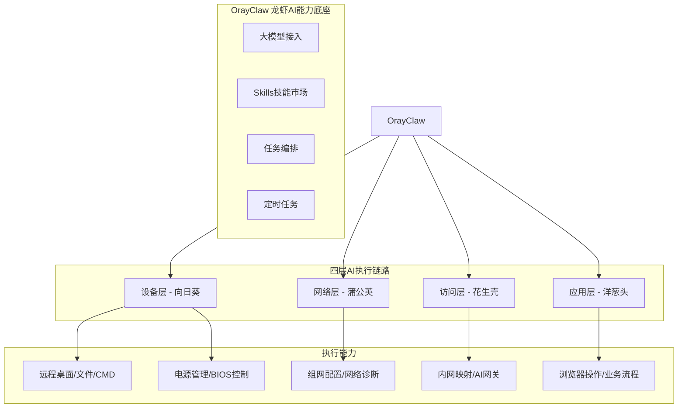

# 贝锐（Oray）AI产品矩阵系统性学习与深度洞察分析报告

> **官方发布会页面**: https://gf-oray.com.cn/#ai
> **搜狐官方报道**: https://m.sohu.com/a/1013902693_99990263/
> **贝锐官网**: https://www.oray.com/

---

## 📋 目录导航

- [一、报告概述 🎯](#一报告概述)
- [二、贝锐20年发展历程与产品演进 📜](#二贝锐20年发展历程与产品演进)
- [三、AI战略核心定位：从生成答案到参与执行 🧠](#三ai战略核心定位从生成答案到参与执行)
- [四、OrayClaw（龙虾）：AI能力底座 🦞](#四orayclaw龙虾ai能力底座)
- [五、蒲公英X1 Pro：首款内置AI Agent的异地组网路由器 📡](#五蒲公英x1-pro首款内置ai-agent的异地组网路由器)
- [六、向日葵MCP：远程设备控制的标准化工具箱 🖥️](#六向日葵mcp远程设备控制的标准化工具箱)
- [七、花生壳MCP与AI网关：打通AI与内网的最后一公里 🔌](#七花生壳mcp与ai网关打通ai与内网的最后一公里)
- [八、洋葱头：浏览器内AI直接执行业务操作 🌐](#八洋葱头浏览器内ai直接执行业务操作)
- [九、四层AI执行链路架构：设备-网络-访问-应用 🏗️](#九四层ai执行链路架构设备-网络-访问-应用)
- [十、核心技术理念解析 ⚙️](#十核心技术理念解析)
- [十一、行业洞见与产品策略 💡](#十一行业洞见与产品策略)
- [十二、应用场景与落地模式 🎯](#十二应用场景与落地模式)
- [十三、竞争优势与市场定位 🏆](#十三竞争优势与市场定位)
- [十四、未来展望 🔮](#十四未来展望)
- [十五、相关资源链接 🔗](#十五相关资源链接)

---

## 一、报告概述 🎯

> **"AI不应该只是生成答案，更应该参与执行"**
>
> —— 贝锐20周年AI战略核心主张

### 1.1 研究背景

2026年是贝锐（Oray）成立20周年。在这一重要里程碑节点，贝锐正式发布全新AI产品矩阵，以"连接即服务，AI即执行"为核心理念，推出了覆盖设备层、网络层、访问层、应用层的四层AI执行基础设施。这一战略发布标志着贝锐从传统的远程连接SaaS服务商向AI执行基础设施提供商的战略转型，也代表着中国ToB SaaS企业在AI落地应用层面的重要探索。

当前AI行业正处于从"大模型对话"向"AI Agent执行"演进的关键阶段。大多数AI应用仍停留在"生成文本/代码答案"层面，无法直接与物理世界、企业内网系统、业务操作流程进行深度交互。贝锐基于其20年在远程连接领域的技术积累和1.2亿用户、150万企业客户的服务经验，提出了"AI执行基础设施"这一全新品类，致力于解决AI从"能说"到"能做"的最后一公里问题。

本报告通过对贝锐AI产品矩阵的系统性学习与深度分析，旨在全面理解贝锐AI战略的技术架构、产品逻辑、应用场景与行业价值，为AI Agent落地、远程连接智能化、企业数字化转型等领域提供可借鉴的参考。

### 1.2 贝锐公司简介

贝锐（Oray）成立于2006年，是中国领先的远程连接SaaS服务商，也是国家级专精特新"小巨人"企业。经过20年的发展，贝锐已构建起完整的"连接"产品矩阵，服务覆盖个人用户与企业客户两大群体：

| 核心指标 | 数据规模 | 说明 |
|---|---|---|
| **注册用户** | 1.2亿+ | 覆盖全球200+国家和地区的个人与企业用户 |
| **企业客户** | 150万+ | 包括大量中小企业、政府机构、教育机构、大型企业 |
| **接入设备** | 26亿+ | 累计接入的设备数量，涵盖电脑、手机、服务器、IoT设备等 |
| **发展历程** | 20年 | 2006年成立至今，持续深耕远程连接领域 |
| **企业资质** | 国家级专精特新"小巨人" | 国家认可的专业化、精细化、特色化、新颖化企业 |

贝锐的核心竞争力在于其对"连接"技术的深度理解与长期积累。从早期的花生壳内网穿透，到向日葵远程控制，再到蒲公英智能组网，贝锐始终围绕"让连接更简单"这一使命，解决用户在不同场景下的远程连接痛点。20年来，贝锐的产品已深入到企业IT运维、远程办公、工业互联网、智慧医疗、智慧教育等众多领域，成为中国远程连接领域的标杆企业。

### 1.3 核心产品矩阵概览

贝锐此次发布的AI产品矩阵并非空中楼阁，而是建立在其已有的五大成熟产品体系之上，通过AI赋能实现能力跃迁：

| 产品名称 | 产品定位 | 核心功能 | AI化方向 |
|---|---|---|---|
| **向日葵远程控制** | 远程设备控制平台 | 远程桌面、远程文件、远程摄像头、远程开机、远程CMD等 | 向日葵MCP：将远程控制能力标准化为AI可调用的工具集 |
| **蒲公英智能组网** | SD-WAN异地组网解决方案 | 异地组网、虚拟专网、智能路由、云网融合 | 蒲公英X1 Pro：首款内置AI Agent的异地组网路由器，网络智能化 |
| **花生壳内网穿透** | 内网穿透与动态域名解析 | 内网映射、DDNS、端口转发、HTTP/HTTPS穿透 | 花生壳MCP+AI网关：让AI能够安全访问企业内网资源 |
| **洋葱头** | 企业应用管理平台 | 浏览器内应用集成、单点登录、应用聚合、账号管理 | 洋葱头浏览器内置AI：让AI直接在浏览器内执行业务操作 |
| **OrayOS云智慧网关** | 智能网关操作系统 | 网关管理、流量调度、安全防护、边缘计算 | OrayClaw（龙虾）AI能力底座：统一AI Agent运行时环境 |

这五大产品形成了从底层硬件到上层应用的完整技术栈，AI能力的注入使得每一层都具备了智能化执行能力，最终构建起"设备-网络-访问-应用"四层AI执行链路。

### 1.4 信息来源说明

本报告的信息获取存在一定的访问限制，主要通过以下渠道进行资料收集与交叉验证：

| 信息来源 | 网址 | 访问状态 | 说明 |
|---|---|---|---|
| **贝锐20周年AI发布会官方页面** | https://gf-oray.com.cn/#ai | 403 Forbidden | 官方发布会主页面因访问权限限制无法直接访问，是本次研究的主要信息缺口 |
| **搜狐官方报道** | https://m.sohu.com/a/1013902693_99990263/ | 可访问 | 贝锐官方发布的新闻稿，包含产品矩阵核心信息，是本报告的主要信息来源 |
| **蒲公英官网** | https://pgy.oray.com/ | 可访问 | 用于补充蒲公英组网产品与X1 Pro路由器的相关信息 |
| **向日葵官网** | https://sunlogin.oray.com/ | 可访问 | 用于补充向日葵远程控制产品背景信息 |
| **花生壳官网** | https://hsk.oray.com/ | 可访问 | 用于补充花生壳内网穿透产品背景信息 |

**信息局限性说明**：由于官方发布会页面无法直接访问，本报告基于已获取的公开信息进行系统性分析与合理推导，部分技术细节、产品定价、具体参数等信息可能存在不完整之处。后续若能获取更多官方资料，将对报告进行补充更新。

### 1.5 报告结构说明

本报告共分为十五个章节，遵循"从宏观到微观、从战略到产品、从技术到场景、从分析到洞察"的逻辑递进结构：

- **第一章（本章）**：报告概述，明确研究背景、贝锐公司概况、核心产品矩阵、信息来源与报告结构
- **第二章**：贝锐20年发展历程与产品演进，梳理贝锐从单一产品到完整生态、从连接服务到AI基础设施的发展脉络
- **第三章**：AI战略核心定位分析，深度解读"从生成答案到参与执行"这一战略主张的内涵与行业意义
- **第四章**：OrayClaw（龙虾）AI能力底座，解析贝锐统一AI Agent运行时的技术架构与核心能力
- **第五章**：蒲公英X1 Pro，深度分析首款内置AI Agent的异地组网路由器的产品设计与技术创新
- **第六章**：向日葵MCP，解析远程设备控制能力如何通过MCP协议标准化为AI可调用工具
- **第七章**：花生壳MCP与AI网关，分析打通AI与内网访问链路的技术方案与安全机制
- **第八章**：洋葱头，探讨浏览器内AI直接执行业务操作的实现方式与应用价值
- **第九章**：四层AI执行链路架构，系统拆解"设备-网络-访问-应用"四层架构的协同机制
- **第十章**：核心技术理念解析，提炼贝锐AI产品矩阵背后的技术设计原则与架构思想
- **第十一章**：行业洞见与产品策略，分析贝锐AI战略的商业逻辑与市场切入策略
- **第十二章**：应用场景与落地模式，梳理贝锐AI产品矩阵在各行业的典型应用场景
- **第十三章**：竞争优势与市场定位，分析贝锐相较于其他AI厂商、传统连接厂商的差异化优势
- **第十四章**：未来展望，探讨贝锐AI战略的后续演进方向与行业影响
- **第十五章**：相关资源链接，整理官方网站、新闻报道、技术文档等参考资源

---

## 二、贝锐20年发展历程与产品演进 📜

> **"从解决'能访问'，到实现'能操作'，再到构建'能组网'、'可管理'，最终走向'AI执行'——这是贝锐20年的产品演进主线。"**

### 2.1 发展历程五阶段时间线

贝锐20年的发展并非一蹴而就，而是围绕"连接"这一核心命题，逐步解决用户在不同阶段的痛点，构建起完整的连接能力体系。整个发展历程可清晰划分为五个阶段：

| 阶段 | 时间区间 | 核心产品 | 解决的核心问题 | 关键里程碑 |
|---|---|---|---|---|
| **第一阶段** | 2006-2009 | 花生壳DDNS | **能访问** | 动态域名解析技术诞生，解决公网IP动态变化下的设备访问问题，全球用户突破千万 |
| **第二阶段** | 2009-2015 | 向日葵远程控制 | **能操作** | 从远程访问升级为远程操作，成为国民级远程控制产品；疫情期间成为远程办公关键支撑；完成信创生态适配（6大国产芯片+5大国产OS）；推出软硬结合方案（开机插座/IPKVM）；牵头制定《远程控制软件技术》团体标准 |
| **第三阶段** | 2015-2020 | 蒲公英异地组网 | **能组网** | 从单点连接升级为网络组网，自研SD-WAN技术，实现即插即用无需公网IP，连续两年电商销量第一 |
| **第四阶段** | 2020-2026 | 洋葱头企业应用管理 | **可管理** | 从设备连接升级为组织级连接管理，构建统一账号体系、权限控制、行为审计能力 |
| **第五阶段** | 2026至今 | AI产品矩阵 | **AI执行** | 发布OrayClaw AI能力底座及全产品线AI升级，核心命题从"连接能力"跃升为"AI如何真正参与执行" |

### 2.2 各阶段深度解析

#### 2.2.1 第一阶段（2006-2009）：花生壳DDNS——解决"能访问"问题

2006年，贝锐推出花生壳动态域名解析（DDNS）服务，这是贝锐的起点。在那个公网IP地址资源紧张、大多数宽带用户使用动态IP的年代，如何让外部网络稳定访问到内网设备是一个普遍痛点。花生壳通过动态域名解析技术，将变化的公网IP与固定域名绑定，解决了"能访问"的基础问题。这一产品迅速获得市场认可，全球用户规模突破千万，为贝锐积累了第一批核心用户。

#### 2.2.2 第二阶段（2009-2015）：向日葵远程控制——从"能访问"到"能操作"

2009年，贝锐发布向日葵远程控制，标志着产品能力从"远程访问"升级为"远程操作"。用户不仅能连接到设备，更能像坐在设备面前一样操作桌面、传输文件、开启摄像头、执行命令。向日葵逐渐成长为国民级远程控制产品，在2020年疫情期间成为远程办公、远程教学的关键基础设施。

在这一阶段，贝锐完成了重要的生态建设：
- **信创适配**：完成6大国产芯片+5大国产操作系统的适配，支持国产化替代场景
- **软硬结合**：推出智能开机插座、IPKVM等硬件产品，实现从系统层到BIOS层的全链路控制
- **标准制定**：牵头制定《远程控制软件技术》团体标准，推动行业规范化发展

#### 2.2.3 第三阶段（2015-2020）：蒲公英异地组网——从单点连接到"能组网"

2015年，蒲公英异地组网发布，贝锐的能力边界从单点设备连接扩展到多点网络组网。基于自研的SD-WAN技术，蒲公英实现了即插即用的异地组网能力，无需公网IP、无需复杂配置，企业分支机构、门店、移动员工可以快速组建虚拟局域网。蒲公英连续两年获得电商平台销量第一，成为中小企业异地组网的首选方案。

#### 2.2.4 第四阶段（2020-2026）：洋葱头企业应用管理——从设备连接到"可管理"

2020年起，贝锐推出洋葱头企业应用管理平台，将连接能力从设备层面提升到组织管理层面。洋葱头提供统一账号体系、细粒度权限控制、完整行为审计等能力，帮助企业实现对各类连接资源的组织级管控，满足企业级客户的安全合规需求。

#### 2.2.5 第五阶段（2026至今）：AI产品矩阵——从连接能力到"AI执行基础设施"

2026年，在成立20周年之际，贝锐发布全新AI产品矩阵，开启第五个发展阶段。这一阶段的核心命题是"AI如何真正参与执行"——AI不再只是生成答案的对话框，而是能够深入设备管理、网络运维、系统访问和业务操作的执行主体。贝锐将20年积累的连接能力全部AI化，打造AI可调用的执行基础设施。

### 2.3 演进逻辑总结

贝锐20年的产品演进遵循着一条清晰的能力升级主线：

**能访问 → 能操作 → 能组网 → 可管理 → AI执行**

这五个阶段环环相扣，每一步都建立在前一阶段的技术积累和用户基础之上：
1. **能访问**解决了网络可达性问题，是连接的基础
2. **能操作**解决了设备可控性问题，让连接产生实际价值
3. **能组网**解决了多点互联问题，将单点能力扩展为网络能力
4. **可管理**解决了组织管控问题，让连接能力适配企业级场景
5. **AI执行**解决了智能化问题，让连接能力能够被AI自主调用，实现从"人操作"到"AI执行"的跃迁

---

## 三、AI战略核心定位：从生成答案到参与执行 🧠

> **"连接世界、操作世界、服务世界"**
>
> —— 贝锐AI战略口号

### 3.1 核心命题：AI如何真正参与执行

当前AI行业正处于一个关键的转折点：大模型在内容生成、信息分析、对话交互方面已经展现出强大能力，但绝大多数AI应用仍停留在"对话框"层面——用户提问，AI生成答案，然后由人类根据答案去执行操作。AI本身无法直接与物理世界、企业系统、业务流程进行深度交互，无法完成"最后一公里"的执行动作。

贝锐AI战略的核心命题正是瞄准这一行业痛点：**AI如何真正参与执行，而不只是停留在内容生成与信息分析阶段？**

贝锐给出的答案是：让AI长出"手和脚"——通过将20年积累的连接能力标准化为AI可调用的执行接口，AI不仅能"想"和"说"，更能"做"。

### 3.2 战略理念与品牌主张

#### 3.2.1 战略口号：连接世界、操作世界、服务世界

| 口号层次 | 内涵 | 对应能力 |
|---|---|---|
| **连接世界** | 延续贝锐20年的连接基因，打通设备、网络、系统之间的连接壁垒 | 花生壳DDNS/内网穿透、蒲公英SD-WAN组网 |
| **操作世界** | 让AI具备实际操作能力，能够远程控制设备、调整网络配置、操作业务系统 | 向日葵远程控制、OrayClaw设备状态读写 |
| **服务世界** | AI能力最终服务于企业业务场景，提升运维效率、降低管理成本、支撑业务创新 | 洋葱头浏览器AI、全场景AI自动化 |

#### 3.2.2 核心理念：让AI长出"手和脚"

贝锐认为，当前AI的局限性在于"有大脑、无手脚"——大模型具备强大的认知和推理能力，但缺乏直接作用于现实世界和企业系统的执行能力。贝锐AI战略的核心理念就是为AI提供"手和脚"：
- **手**：远程操作物理设备和数字系统的能力（点击、输入、配置、控制）
- **脚**：跨网络、跨系统、跨设备的通达能力（穿透内网、异地组网、远程访问）

#### 3.2.3 品牌主张："20由我，不让未来"

"20由我"体现了贝锐20年技术积累的底气——20年深耕远程连接领域，服务1.2亿用户、150万企业客户，接入26亿+设备，这些积累是贝锐做AI执行基础设施的坚实基础。

"不让未来"表达了贝锐在AI时代的决心——不缺席AI浪潮，基于已有积累积极布局，让贝锐在AI时代继续引领连接领域的创新。

### 3.3 差异化定位：不做通用大模型，做AI执行基础设施

在AI战略定位上，贝锐选择了一条差异化道路：**不做通用大模型，而是做AI可调用的执行基础设施**。

这一定位基于对自身核心优势的清醒认知：
- 贝锐的核心竞争力不在于训练通用大模型，而在于20年积累的连接技术和落地经验
- 通用大模型解决"理解和生成"问题，而贝锐解决"连接和执行"问题
- 企业真正需要的不是又一个聊天机器人，而是能够真正帮他们干活、解决实际问题的AI

贝锐的AI产品矩阵定位为"AI的手脚"——无论是哪家的大模型，只要需要与设备、网络、系统、业务进行交互，都可以调用贝锐的执行基础设施来完成实际操作。

### 3.4 从"对话框"到"业务现场"

贝锐AI战略推动AI应用范式发生根本转变：

| 维度 | 传统AI应用（对话框范式） | 贝锐AI执行范式 |
|---|---|---|
| **交互方式** | 人类提问→AI生成答案→人类执行 | 人类下达指令→AI理解→AI自主执行→反馈结果 |
| **AI角色** | 旁观的辅助工具、信息提供者 | 深入业务现场的执行者、操作者 |
| **价值闭环** | 信息闭环（生成答案即结束） | 业务闭环（执行完成、产生实际效果才结束） |
| **应用场景** | 内容创作、知识问答、数据分析 | 设备运维、网络管理、系统操作、业务流程自动化 |

AI不再只是坐在"后排"提供建议，而是走到"业务现场"，深入设备管理、网络运维、系统访问和业务操作的核心环节，直接产生业务价值。

---

## 四、OrayClaw（龙虾）：AI能力底座 🦞

> **"龙虾有爪子，能抓取、能操作——这正是AI最需要的能力。"**

### 4.1 产品定位：AI能力底座与核心枢纽

OrayClaw（中文代号"龙虾"）是贝锐AI产品矩阵的核心枢纽与能力底座。它不是一款面向最终用户的独立产品，而是整个AI体系的"中枢神经系统"——向下对接贝锐各产品线的硬件与软件能力，向上对接各类大语言模型，为上层AI应用提供统一的执行能力接口。

可以把OrayClaw理解为贝锐AI体系的"操作系统"：所有AI能力都运行在这个底座之上，所有设备和系统的操作都通过这个底座进行调度。

### 4.2 命名寓意：为什么叫"龙虾"

"龙虾"（Claw）这个命名富有深意：龙虾有强有力的钳子（Claw），能够抓取物体、进行操作。这一形象精准地象征了贝锐AI的核心特质——**执行能力**。

不同于很多AI产品强调"智慧""大脑"等认知层面的概念，OrayClaw强调的是"动手能力"——AI不仅要能思考，更要能抓取、能操作、能执行。这个命名本身就是对贝锐AI战略定位的最好诠释：为AI打造强有力的"爪子"，让AI真正能做事。

### 4.3 核心能力架构

OrayClaw作为AI能力底座，提供五大核心能力模块：

| 能力模块 | 功能说明 | 价值 |
|---|---|---|
| **模型接入层** | 支持对接多种主流大语言模型，企业可根据需求选择合适的模型 | 不绑定特定大模型，保持开放性和灵活性 |
| **Skills能力市场** | 可复用的技能模块市场，企业可沉淀自有运维Skill，也可使用官方和社区提供的Skill | 实现能力复用，降低AI应用开发门槛，积累企业专属运维知识 |
| **任务编排** | 支持多步骤任务的流程化编排与执行，可将复杂任务拆解为有序步骤自动执行 | 处理复杂业务场景，实现端到端自动化 |
| **定时任务** | 支持按计划自动执行任务，可设置定时、周期触发条件 | 实现例行运维工作自动化，如夜间巡检、定时备份等 |
| **设备状态读写** | 直接读取和调整各产品线设备状态，实时获取网络、设备、系统数据并下发控制指令 | 让AI具备实时感知和实时控制能力 |

### 4.4 典型自然语言交互场景

OrayClaw支持通过自然语言直接下达指令，AI理解意图后自动调用相应能力完成执行。以下是几个典型场景示例：

#### 场景1：访客网络管理
> **用户指令**："为来访客户创建一个24小时有效的访客WiFi"
>
> **AI执行过程**：
> 1. 识别意图：创建临时访客网络
> 2. 调用蒲公英路由器能力：创建独立SSID
> 3. 设置权限：隔离访客网络与内部网络
> 4. 设置有效期：24小时后自动失效
> 5. 生成密码并返回给用户

#### 场景2：网络故障自动恢复
> **用户指令**："3楼交换机端口3异常断网，自动排查并尝试恢复"
>
> **AI执行过程**：
> 1. 读取交换机端口状态，确认异常
> 2. 执行基础排查：检查物理连接、端口配置、VLAN设置
> 3. 尝试自动恢复：重启端口、重新加载配置
> 4. 如恢复成功：记录故障原因和恢复过程
> 5. 如恢复失败：生成故障报告，通知运维人员人工介入

#### 场景3：网络质量巡检
> **用户指令**："检测今天各分支网络延迟和丢包情况，生成诊断报告"
>
> **AI执行过程**：
> 1. 遍历所有分支节点
> 2. 逐节点执行ping、traceroute等检测
> 3. 收集延迟、丢包率、DNS响应时间等数据
> 4. 对比历史基线，识别异常节点
> 5. 汇总生成可视化诊断报告

#### 场景4：定时安全策略
> **用户指令**："晚上10点后关闭非必要设备的网络访问权限"
>
> **AI执行过程**：
> 1. 创建定时任务：每日22:00触发
> 2. 识别"非必要设备"：基于设备类型和历史访问策略
> 3. 在路由器和防火墙上下发访问控制规则
> 4. 次日早8点自动恢复网络权限
> 5. 记录执行日志，审计夜间网络访问情况

---

## 五、蒲公英X1 Pro：首款内置AI Agent的异地组网路由器 📡

> **"AI Agent下沉到网络边缘，让路由器本身成为智能运维节点。"**

### 5.1 产品定位：全球首款内置"龙虾"AI Agent的异地组网路由器

蒲公英X1 Pro是贝锐推出的全球首款内置OrayClaw（龙虾）AI Agent的异地组网路由器，标志着AI能力从云端下沉到网络边缘设备。这不是在传统路由器上简单加个AI功能，而是从硬件架构到软件系统的深度AI原生设计。

作为蒲公英异地组网路由器系列的最新旗舰产品，X1 Pro延续了蒲公英即插即用、无需公网IP的组网特性，同时通过内置AI Agent实现了网络运维的智能化升级。

### 5.2 核心卖点：本地部署AI的五大优势

蒲公英X1 Pro最大的技术创新在于将AI Agent直接运行在路由器本地，而非依赖云端服务器。这一设计带来五大核心优势：

| 优势 | 具体说明 | 用户价值 |
|---|---|---|
| **无需云服务器** | AI推理能力直接运行在路由器本地硬件上，不需要额外购买云服务器 | 降低AI运维成本，减少云端依赖 |
| **无需额外电脑** | 不依赖主控端电脑持续在线，路由器本身就是独立的AI执行节点 | 7×24小时AI值守，即使管理员电脑关机也能自动处理问题 |
| **隐私安全** | 敏感网络配置、拓扑数据、运维日志无需上传到云端，全部在本地处理 | 满足企业数据安全合规要求，核心网络数据不出域 |
| **低延迟** | 本地AI推理，无需网络往返云端，响应速度更快 | 网络故障秒级响应，实时处理网络异常 |
| **高可靠性** | 即使外网中断，本地AI仍可执行基础网络管理任务 | 断网不瘫痪，边缘自治能力保障网络基本可用 |

### 5.3 AI功能分层：本地AI与云端AI协同

蒲公英X1 Pro采用"本地AI+云端AI"的双层架构，不同复杂度的任务由不同层级处理：

#### 5.3.1 本地AI功能（路由器端运行）

本地AI负责处理实时性要求高、隐私敏感的网络运维任务：
- **访客网络创建**：自动创建临时访客WiFi，设置有效期和权限隔离
- **设备断网限时恢复**：检测到设备离线后，自动执行端口重启、配置重载等恢复操作
- **异常设备提醒处理**：识别异常接入设备、异常流量，自动隔离或告警
- **网络诊断**：实时检测流量占用、网络延迟、丢包率、DNS响应时间等网络质量指标

#### 5.3.2 云端AI助手（云端运行）

云端AI负责处理需要更强算力、跨设备协同的复杂任务：
- **设备查询**：多设备统一状态查询、历史数据分析
- **成员管理**：组网成员的权限调整、分组管理
- **配置调整**：跨设备的批量配置下发、策略更新
- **一键AI诊断**：复杂网络问题的深度分析，跨节点根因定位

### 5.4 软硬结合策略深度分析：边缘AI在网络设备的落地

蒲公英X1 Pro是"边缘AI"（Edge AI）在网络设备领域的典型落地案例，代表了网络设备智能化的重要方向：

#### 5.4.1 为什么将AI下沉到边缘？

传统的云侧AI运维方案存在三个固有痛点：
1. **延迟问题**：网络数据上传到云端、AI推理、指令下发，整个链路存在固有延迟，无法满足实时故障响应需求
2. **带宽成本**：大量网络监控数据持续上传云端，带来带宽成本压力
3. **隐私风险**：企业网络拓扑、配置、流量数据属于核心敏感信息，上传云端存在安全顾虑

将AI Agent下沉到路由器本地，从根本上解决了这三个问题：本地推理实现毫秒级响应，原始数据不出本地保障隐私，只有必要的告警和摘要信息上传云端节省带宽。

#### 5.4.2 边缘AI的技术挑战与解决思路

在路由器这类资源受限的边缘设备上运行AI Agent，需要解决几个技术挑战：
- **算力受限**：路由器CPU/NPU算力远低于云端服务器，需要对AI模型进行轻量化裁剪和优化
- **内存有限**：边缘设备内存资源紧张，需要精细化的内存管理和模型加载策略
- **功耗约束**：路由器需要7×24小时运行，AI计算不能带来过高功耗

贝锐通过模型量化、算子优化、任务调度等技术手段，在X1 Pro上实现了AI能力的高效本地运行，证明了边缘AI在网络设备场景的可行性。

### 5.5 市场意义：巩固领先地位的战略产品

蒲公英异地组网路由器已经连续两年（2024-2025）获得中国电商平台销量第一，在中小企业异地组网市场占据领先地位。X1 Pro的AI升级具有重要的市场战略意义：

1. **技术代差优势**：在竞争对手还在做传统路由器时，蒲公英率先将AI Agent内置到路由器中，形成明显的技术代差
2. **价值升级**：从"网络连接工具"升级为"智能运维节点"，产品价值和用户粘性大幅提升
3. **品类定义**：开创"AI组网路由器"这一全新品类，继续引领市场发展方向
4. **客户留存**：AI能力具有强粘性，企业一旦在X1 Pro上沉淀了运维Skill和自动化流程，迁移成本将显著提高

---

## 六、向日葵MCP：远程设备控制的标准化工具箱 🖥️

> **"像人一样看屏幕、点鼠标、敲键盘——这是最通用、最可靠的远程控制方式。"**

### 6.1 能力组合：OrayClaw + 向日葵MCP

向日葵MCP是OrayClaw能力底座在设备控制层的具体实现，二者形成"智能中枢+执行工具"的组合：
- **OrayClaw**：负责理解自然语言指令、进行任务规划、调度各类能力
- **向日葵MCP**：负责具体的远程设备控制执行，将AI的决策转化为实际的设备操作

MCP全称Model Context Protocol（模型上下文协议），是一种让AI模型能够调用外部工具的标准化协议。向日葵基于MCP协议，将积累十余年的远程控制能力封装为AI可直接调用的标准化工具箱。

### 6.2 MCP定位：远程控制能力的标准化封装

向日葵MCP基于Model Context Protocol协议，将以下远程设备管理能力封装为标准化的AI工具接口：

| 能力类别 | 具体功能 |
|---|---|
| **远程设备管理** | 设备列表查询、在线状态检测、硬件信息获取、进程/服务管理 |
| **远程会话管理** | 远程桌面会话建立/断开、会话质量调整、多会话切换 |
| **异地桌面操作** | 鼠标移动/点击/拖拽、键盘输入、快捷键、屏幕截图、文字识别 |

通过MCP标准化封装，AI无需了解向日葵远程控制的底层技术细节，只需按照标准协议调用工具即可完成复杂的远程操作。这大大降低了AI使用远程控制能力的门槛。

### 6.3 技术路线选择：基于视觉识别与真实键鼠模拟

在技术路线上，向日葵MCP选择了一条看似"笨拙"但实际上极具通用性的道路：**基于视觉识别与真实键鼠模拟**，即像人一样"看屏幕、点鼠标、敲键盘"。

#### 6.3.1 为什么不依赖API？

很多人会问：为什么不直接调用操作系统和应用软件的API来实现更精准的控制？贝锐的选择基于对企业真实环境的深刻理解：

**企业环境具有极强的异构性**：
- 不同企业使用不同版本的操作系统（Windows 7/10/11、各种Linux发行版、macOS）
- 不同企业使用不同版本的业务软件，很多还是老旧版本或定制化版本
- 大量企业使用行业专用软件，这些软件根本没有开放API
- 软件界面更新频繁，基于界面元素定位的API调用容易因版本升级失效

如果依赖API，会面临严重的兼容性问题：在A电脑上能用的自动化脚本，到B电脑上可能因为软件版本不同就失效了，维护成本极高。

#### 6.3.2 视觉+键鼠路线的核心优势

基于视觉识别（看屏幕）和键鼠模拟（点鼠标、敲键盘）的路线，具有几个不可替代的优势：

1. **通用性极强**：只要有图形界面就能控制，不依赖目标系统开放任何API
2. **鲁棒性好**：不容易因为软件更新、界面变化而失效——软件界面再怎么变，还是需要人通过鼠标键盘操作，视觉识别仍能找到按钮和输入框
3. **适配复杂环境**：完美适配企业复杂、异构的实际IT环境，不用关心目标系统是什么版本、装了什么软件
4. **算力部署合理**：AI视觉识别和推理算力只需部署在主控端，被控端无需AI能力
5. **被控端零负担**：被控端无需额外安装AI组件、复杂脚本或特殊代理程序
6. **支持一对多管理**：一个主控端AI可以同时管理大量被控设备，实现规模化运维

这一技术路线选择体现了贝锐务实的产品哲学：不追求技术上的"高大上"，而是选择最能解决企业实际问题、最可靠耐用的方案。

### 6.4 硬件扩展闭环：从电源到系统的全链路控制

向日葵MCP的能力不止于软件层面的远程桌面，通过与贝锐硬件生态结合，形成了从电源层到应用层的完整控制闭环：

| 控制层级 | 硬件/软件支撑 | 能力范围 |
|---|---|---|
| **应用层操作** | 向日葵远程桌面软件 | 业务软件操作、数据录入、配置修改、问题排查 |
| **系统层操作** | 向日葵远程桌面/远程文件/远程CMD | 系统设置、文件传输、命令执行、软件安装卸载 |
| **设备层控制** | 智能插座/插线板（Q1/A2/Q2 Pro/Q5 Pro等） | 远程电源开机、关机、重启，设备断电上电控制 |
| **BIOS级控制** | IPKVM硬件 | 宕机/蓝屏/未进系统场景下的远程控制，BIOS设置、系统重装、启动项选择 |

这一完整闭环意味着：无论设备处于什么状态——正常开机、系统崩溃、甚至关机状态——AI都能通过合适的方式进行控制：
- 设备关机 → 智能插座上电 → IPKVM进BIOS设置启动项 → 远程桌面进入系统 → 操作业务应用

真正实现了"任何状态下都能远程控制"，这是纯软件方案无法做到的。

### 6.5 Skills沉淀：构建企业自动化运维体系

向日葵MCP与OrayClaw的Skills能力市场结合，支持企业将已有的运维SOP（标准操作流程）沉淀为可复用的Skill：

- **SOP固化**：将资深运维工程师的排查步骤、处理流程固化为Skill，新人也能像专家一样处理问题
- **知识积累**：每次故障处理的过程和结果都可以沉淀为Skill，企业运维知识库持续积累
- **自动化执行**：常见问题无需人工介入，AI识别后自动调用对应Skill处理
- **规模化复制**：一个分支验证有效的运维Skill，可以快速推广到全公司所有分支

通过这种方式，企业可以逐步构建起自己的自动化运维体系，运维效率随时间持续提升。

### 6.6 兼容性设计：保护用户既有投资

向日葵MCP在设计上充分考虑了兼容性：**被控终端无需更新已有向日葵软件即可接入MCP能力**。

这意味着企业不需要大规模升级已部署的向日葵客户端，就能让AI获得远程控制能力。这极大降低了企业的使用门槛和升级成本，保护了用户的既有投资。

---

## 七、花生壳MCP与AI网关：打通AI与内网的最后一公里 🔌

> **"安全不是事后补丁，而是内嵌在产品架构中——按需开启、用完即关、最小权限。"**

### 7.1 花生壳MCP：内网穿透能力的AI化升级

花生壳是贝锐的起家产品，深耕内网穿透领域20年。花生壳MCP是这一经典产品在AI时代的能力升级——从"用户手动操作的工具"进化为"AI可直接调用的能力接口"。

#### 7.1.1 传统内网映射的痛点

传统内网穿透/端口映射操作存在几个常见痛点：
1. **配置复杂**：需要手动选择内网主机、端口，设置映射规则，对非技术人员不友好
2. **遗忘风险**：映射创建后如果用完忘记关闭，内网服务会长期暴露在公网，带来极大安全风险
3. **管理困难**：大量临时映射堆积，难以追溯是谁创建的、用于什么目的、是否还在使用

#### 7.1.2 MCP升级：从"手动工具"到"AI能力接口"

花生壳MCP将内网穿透能力封装为AI可直接调用的标准接口，实现了内网映射的全生命周期自动化管理：

**核心机制**：
1. **按需创建**：AI根据任务需要，自主判断是否需要内网映射，自动创建合适的隧道
2. **自动获取地址**：映射创建后自动获取公网访问地址，供AI或相关人员使用
3. **用完即关**：任务完成后自动关闭隧道，消除内网服务长期暴露的安全风险

这一机制完美解决了传统内网映射的痛点：既简化了操作（AI自动完成，无需人工配置），又提升了安全性（最小暴露时间，任务结束自动关闭）。

#### 7.1.3 安全设计哲学："按需开启、用完即关"

花生壳MCP的设计体现了贝锐的安全哲学：**安全不是事后补丁，而是内嵌在产品架构中**。

传统安全思路是"先开放，再防护"——先把映射开起来，然后靠防火墙、访问控制去防护。而花生壳MCP的思路是"默认关闭，按需开启，用完即关"——内网服务默认不暴露，只有确实需要时才临时开放，任务完成立即关闭，从架构上最小化安全暴露面。

### 7.2 花生壳AI网关：本地AI能力的安全开放方案

如果说花生壳MCP解决的是"AI如何访问内网"的问题，那么花生壳AI网关解决的是反向的问题：**企业本地部署的模型服务和业务系统，如何安全地对外开放给团队或外部系统使用？**

#### 7.2.1 核心问题场景

随着本地部署大模型的普及，越来越多企业面临这样的问题：
- 企业在本地服务器部署了私有大模型，数据不出域，安全性有保障
- 但团队成员在不同办公室、出差、在家时，如何安全访问这个本地模型？
- 如果要给合作伙伴、供应商提供有限的AI能力访问，如何管控权限和审计调用？
- 本地还有其他业务系统（OA、ERP、CRM），也需要类似的安全开放能力

花生壳AI网关正是为解决这一问题而设计。

#### 7.2.2 核心能力

花生壳AI网关提供六大核心能力，实现本地AI能力和业务系统的安全开放：

| 能力 | 功能说明 | 安全价值 |
|---|---|---|
| **统一接入** | 本地模型、业务系统通过统一网关接入，无需每个系统单独配置穿透 | 统一入口，统一管控 |
| **固定域名** | 通过固定域名对外提供访问入口，不用记复杂IP和端口 | 访问便捷，域名可管控可回收 |
| **多用户隔离** | 独立密钥（Token）机制实现权限隔离，不同用户/应用使用不同密钥 | 防止越权访问，密钥泄露可单独吊销 |
| **调用统计** | 可统计各用户/应用的调用次数、流量、调用时间等数据 | 可观测、可审计，资源使用可量化 |
| **HTTPS加密** | 全程HTTPS传输加密，防止数据在传输过程中被窃听或篡改 | 传输层安全保障 |
| **访问控制** | 精细化的访问权限管理，可设置IP白名单、访问频率限制、接口级权限 | 最小权限原则，细粒度管控 |

#### 7.2.3 核心价值：不依赖公有云，保留数据主权

花生壳AI网关的核心价值在于：**企业可以在完全保留数据主权的前提下，将本地AI能力安全开放使用**。

企业不需要把模型和数据部署到公有云，不需要把敏感业务系统迁移到公网，所有数据和计算都在企业本地完成。AI网关只是提供了一个安全的"访问通道"，并对这个通道进行严格的权限管控和审计。

这完美契合了对数据安全要求高的企业（政府、金融、医疗、大型企业）的需求——既要享受AI和远程访问的便利，又要牢牢掌握数据主权。

### 7.3 安全设计哲学总结

综合花生壳MCP和花生壳AI网关的设计，可以看出贝锐在安全设计上的三大原则：

1. **最小暴露原则**：不长期开放不必要的访问通道，按需开启、用完即关，最小化攻击面
2. **数据不出域原则**：敏感数据优先在本地处理和存储，能不传到云端就不传到云端
3. **权限隔离与审计原则**：所有访问都有身份认证、权限控制、操作审计，可追溯、可管控

安全不是功能列表里的一个勾选项，而是从产品架构设计阶段就内嵌的基因。

---

## 八、洋葱头：浏览器内AI直接执行业务操作 🌐

> **"不是让浏览器里能聊天，而是让AI真正进入具体业务流程干活。"**

### 8.1 产品定位：浏览器内的AI业务执行环境

洋葱头是贝锐在应用层的AI产品，定位是：**在浏览器环境中接入AI工具与MCP能力，让AI直接参与网页业务操作流程**。

今天绝大多数企业业务操作都在浏览器中完成——OA审批、ERP录入、CRM管理、财务报销、报表导出、数据查询等等。洋葱头把浏览器从单纯的"访问入口"升级为"AI参与业务执行的实际工作界面"，让AI能够在浏览器里帮用户完成各类业务操作。

### 8.2 核心能力

洋葱头AI在浏览器环境中提供三大核心能力：

#### 8.2.1 数据录入自动化
- **自动填写表单**：从文档、表格、其他系统中提取数据，自动填写到网页表单中
- **批量导入数据**：批量处理上百上千条数据的录入工作，无需人工逐条输入
- **跨系统数据同步**：在A系统查询数据，自动录入到B系统，打通系统间数据孤岛

例如：财务人员收到员工报销邮件，AI可以自动识别邮件中的发票信息、报销金额、事由，然后打开OA系统自动填写报销单并提交。

#### 8.2.2 业务操作执行
- **按钮点击操作**：在后台系统中自动点击按钮、提交申请、处理审批
- **审批流程处理**：根据预设规则自动处理常规审批，异常情况再转人工
- **多步骤流程执行**：完成跨页面、跨系统的复杂业务流程，无需人工一步步操作

例如：新员工入职时，AI可以自动在HR系统创建账号、在OA系统开通权限、在邮箱系统创建邮箱、在IT资产系统申领设备，完成一整套入职流程。

#### 8.2.3 重复性任务处理
- **定期报表导出**：按照设定的周期（每日/每周/每月）自动导出各系统报表
- **数据核对校验**：自动核对多个系统间的数据一致性，识别异常差异
- **状态监控检查**：定期检查业务流程状态、订单状态、审批状态，异常时告警

例如：运营人员需要每天早上从5个不同系统导出前一天的数据报表，AI可以每天上班前自动导出并汇总好，运营人员上班直接看结果即可。

### 8.3 与传统RPA的对比分析

洋葱头浏览器AI常被拿来与传统RPA（机器人流程自动化）对比，但二者在设计理念和适用场景上有显著差异：

| 对比维度 | 洋葱头浏览器AI | 传统RPA |
|---|---|---|
| **部署复杂度** | 基于浏览器，无需额外部署复杂的服务器、设计器、执行器环境 | 需要独立部署RPA服务器、流程设计器、执行机器人，架构重、部署复杂 |
| **接入成本** | 直接基于现有浏览器，用户快速接入，普通业务人员也能使用 | 需要专业RPA开发人员录制/编写流程脚本，开发周期长、人力成本高 |
| **灵活性** | AI理解自然语言指令，流程调整只需重新说一遍需求，适应快速变化 | 界面变化就需要重新录制/修改脚本，维护成本高，难以适应快速变化的业务 |
| **适用场景** | 跨系统操作、流程频繁调整、长尾分散的业务场景，非技术人员也能配置 | 高度标准化、流程固定不变、大批量重复的核心业务流程，适合专业团队集中维护 |
| **智能程度** | 具备视觉理解和认知能力，能处理非预期情况，遇到异常会询问或尝试解决 | 严格按照脚本执行，遇到界面变化或异常就会中断，容错能力差 |
| **使用门槛** | 自然语言交互，业务人员直接使用 | 需要专业技术人员开发维护，业务人员无法自行调整流程 |

### 8.4 核心价值：浏览器从"入口"到"工作界面"的升级

洋葱头的核心价值在于，它重新定义了浏览器在企业IT中的角色：

| 浏览器角色 | 传统定位 | 洋葱头AI时代定位 |
|---|---|---|
| **功能定位** | 访问网页和应用的入口 | AI参与业务执行的实际工作界面 |
| **交互方式** | 人操作鼠标键盘，浏览器呈现结果 | 人下达指令，AI在浏览器里执行操作，人审核结果 |
| **价值创造** | 人工操作效率的工具载体 | AI自动化执行的工作平台，人机协作的界面 |

过去企业数字化建设把业务流程搬到了浏览器里，但操作还是要人来做。洋葱头进一步把"操作"本身也自动化了，真正实现业务流程的端到端AI执行。

### 8.5 解决的核心问题：从"能接AI"到"能做业务"

洋葱头要解决的核心问题不是"浏览器里能不能接AI聊天"——这很简单，加个聊天框插件就能做到。它要解决的真正问题是：**AI能不能真正进入具体业务流程，帮用户完成实际的业务工作？**

这个问题的难点不在技术炫技，而在实用性：
- AI能不能看懂各种复杂的企业后台界面？
- AI能不能准确理解业务操作规则？
- AI操作出错了怎么办，有没有容错和审计机制？
- 业务人员能不能方便地教会AI做新任务？

洋葱头的答案是：基于视觉理解+自然语言交互+MCP标准化能力，让AI成为浏览器里的"数字员工"，真正把业务人员从重复性的网页操作中解放出来，把时间花在更有价值的判断和决策工作上。

---

## 九、四层AI执行链路架构：设备-网络-访问-应用 🏗️

> **"OrayClaw是大脑，四层链路是手脚和神经——从物理设备到业务操作，形成完整的AI执行闭环。"**

### 9.1 四层架构总览

贝锐AI产品矩阵并非零散的产品堆砌，而是构建了一套层次清晰、协同工作的"设备-网络-访问-应用"四层AI执行链路架构。OrayClaw（龙虾）作为AI能力底座居于中枢位置，向下调用四层执行能力，向上对接用户自然语言指令，形成完整的AI执行体系。

### 9.2 四层架构详细解析

| 层级 | 对应产品 | 核心能力 | AI赋能方式 | 解决的问题 |
|---|---|---|---|---|
| **设备层** | 向日葵+智能硬件 | 远程设备操作 | MCP标准化工具集+视觉识别键鼠模拟 | AI能操作远端电脑/设备 |
| **网络层** | 蒲公英+X1 Pro | 网络连接管理 | 路由器内置本地AI Agent | AI能配置诊断网络 |
| **访问层** | 花生壳+AI网关 | 内网穿透与安全访问 | MCP自动化隧道+AI网关 | AI能安全访问内网资源 |
| **应用层** | 洋葱头 | 浏览器业务操作 | MCP浏览器操作 | AI能执行业务流程 |

#### 9.2.1 设备层：向日葵+智能硬件

设备层是AI执行链路的最底层，解决"AI如何物理控制设备"的问题。通过向日葵MCP标准化工具集，结合视觉识别与键鼠模拟技术，AI获得了像人一样操作远端电脑的能力。配合智能插座、IPKVM等硬件，控制能力从系统层延伸到电源层和BIOS层，实现"任何状态下都能控制"。

#### 9.2.2 网络层：蒲公英+X1 Pro

网络层解决"AI如何管理网络连接"的问题。蒲公英X1 Pro将AI Agent直接内置到路由器中，实现网络配置、故障诊断、流量优化等网络运维工作的智能化。本地AI+云端AI的双层架构，既保证了实时响应和隐私安全，又能处理复杂的跨设备协同任务。

#### 9.2.3 访问层：花生壳+AI网关

访问层解决"AI如何安全穿越网络边界"的问题。花生壳MCP实现了内网映射的按需自动化管理——任务需要时自动创建隧道，任务完成后立即关闭，最小化安全暴露。花生壳AI网关则解决反向问题：企业本地部署的模型和业务系统如何安全对外开放，实现数据不出域前提下的远程访问。

#### 9.2.4 应用层：洋葱头

应用层解决"AI如何执行业务操作"的问题。洋葱头让AI直接在浏览器环境中工作，完成表单填写、按钮点击、流程处理、报表导出等各类网页业务操作。基于视觉理解而非API依赖，能够适配企业复杂异构的业务系统环境。

### 9.3 OrayClaw作为中枢的核心作用

OrayClaw（龙虾）在四层架构中扮演"大脑"角色，承担三大核心职能：

1. **统一模型接入**：不绑定特定大模型，支持对接多种主流大语言模型，企业可根据需求灵活选择
2. **统一Skill管理**：Skills技能市场实现运维能力的沉淀、复用与共享，企业可构建私有运维能力库
3. **统一任务调度**：任务编排与定时任务能力支持复杂多步骤任务的流程化执行，实现跨产品、跨层级的协同

OrayClaw向下屏蔽四层执行链路的技术细节，向上为用户提供统一的自然语言交互界面——用户不需要关心具体调用哪个产品、哪个工具，只需要用自然语言描述需求，OrayClaw自动理解、规划、调度、执行。

### 9.4 四层协同关系：从物理到业务的完整闭环

四层架构不是孤立存在的，而是形成从物理设备到业务操作的完整闭环：

**典型跨层任务示例**："帮我把上海分支服务器上的日志文件导出，上传到总部OA系统提交审批"
1. **访问层**：花生壳MCP按需创建隧道，安全连接到上海分支内网
2. **网络层**：蒲公英SD-WAN确保跨地域网络连接稳定、低延迟
3. **设备层**：向日葵MCP远程登录服务器，找到日志文件并导出
4. **应用层**：洋葱头打开总部OA系统，上传文件并提交审批流程
5. **访问层**：任务完成后，花生壳自动关闭隧道，消除安全暴露

单独任何一层都无法完成这个端到端任务，但四层协同在OrayClaw统一调度下，AI可以自主完成全部流程。

### 9.5 架构类比：大脑、神经与手脚

可以用一个形象的类比来理解这套架构：

- **OrayClaw（龙虾）= 大脑**：负责理解指令、思考决策、规划任务、调度协调
- **四层执行链路 = 手脚和神经**：
  - 设备层是"手"——直接操作设备、点击键盘鼠标
  - 网络层是"神经网络"——传递信号、连接各个节点、保障通信畅通
  - 访问层是"神经末梢与皮肤"——安全地感知和接触外部环境，同时起到防护作用
  - 应用层是"熟练的手"——能够完成精细的业务操作流程

没有大脑，手脚只是无意义的动作；没有手脚，大脑只是空想。OrayClaw与四层执行链路的结合，让AI真正具备了"思考-决策-执行"的完整能力。

---

## 十、核心技术理念解析 ⚙️

> **"技术选型不追求'高大上'，只追求'解决实际问题'——这是贝锐20年工程经验沉淀的技术哲学。"**

贝锐AI产品矩阵的背后，是一以贯之的技术设计理念。这些理念不是抽象的口号，而是体现在每一个产品设计、每一个技术选型决策中的指导原则。

### 10.1 MCP协议优先：拥抱开放标准而非私有协议

贝锐在AI能力接口设计上，坚定选择MCP（Model Context Protocol）作为标准协议，而非构建私有协议。

#### 10.1.1 为什么选择MCP？

- **开放生态**：MCP是正在形成的行业开放标准，选择MCP意味着贝锐的连接能力可以被任何支持MCP协议的AI Agent调用，而不仅限于贝锐自有体系
- **避免厂商锁定**：企业不需要被锁定在某一家AI厂商的生态中，可以自由选择最合适的大模型和AI应用
- **降低集成成本**：标准协议意味着更低的集成成本，第三方开发者和ISV可以轻松基于贝锐能力构建AI应用
- **生态共赢**：开放标准能够吸引更多参与者，共同把市场做大，而非零和博弈

#### 10.1.2 战略意义

这一选择体现了贝锐的战略格局：不试图构建封闭的私有帝国，而是成为AI时代的"连接水电煤"——无论哪家的AI，只要需要连接和执行能力，都可以使用贝锐的基础设施。

### 10.2 软硬结合的边缘AI部署

贝锐没有把AI全部放在云端，而是选择了"云边协同"的部署策略，将AI Agent下沉到路由器等边缘硬件本地运行。

#### 10.2.1 边缘AI的四大优势

| 优势 | 说明 |
|---|---|
| **隐私安全** | 敏感网络数据、设备状态信息不需要上传到云端，全部在本地处理，满足企业数据合规要求 |
| **低延迟** | 本地AI推理无需网络往返，毫秒级响应，能够满足网络故障实时处理等时效性要求高的场景 |
| **高可靠性** | 即使外网中断，边缘本地AI仍可执行基础运维任务，具备断网自治能力 |
| **成本优化** | 不需要持续购买云端算力来处理实时性、高频次的边缘任务，降低长期使用成本 |

#### 10.2.2 X1 Pro：理念的首个落地

蒲公英X1 Pro是这一理念的首个落地产品——不只是在路由器上加个AI功能插件，而是从硬件选型到软件架构都为AI本地运行做了深度优化。这证明了在资源受限的边缘设备上运行实用型AI Agent是完全可行的。

### 10.3 视觉识别+键鼠模拟的通用操作路线

在远程设备控制的技术路线选择上，贝锐没有走"API调用"的看起来更"优雅"的路线，而是选择了"视觉识别+键鼠模拟"的看起来更"笨拙"的路线。

#### 10.3.1 为什么这是B端的正确选择？

C端产品环境标准化程度高，依赖API是可行的。但B端企业环境极其异构：
- 操作系统版本多样（从Windows 7到最新版，各种Linux发行版）
- 业务软件版本碎片化，大量使用老旧版本或定制开发版本
- 很多行业专用软件根本不开放API
- 软件界面更新频繁，基于界面元素定位的脚本容易失效

在这样的环境下，"像人一样看屏幕、点鼠标、敲键盘"反而是最通用、最可靠的方案——只要人能操作的界面，AI就能操作；人能完成的流程，AI就能完成。

#### 10.3.2 路线优势

- **适配异构环境**：不挑系统、不挑软件、不挑版本，真正通用
- **不怕界面更新**：软件界面再怎么迭代，还是需要人通过鼠标键盘操作，视觉识别仍然有效
- **无需被控端配合**：被控端不需要安装特殊插件、开放API、做任何适配，零负担接入
- **一对多管理**：AI算力集中在主控端，可同时管理大量被控设备

这一技术选择体现了贝锐务实的工程哲学：不追求论文里的"优雅"，只追求在企业真实复杂环境中"能用、好用、耐用"。

### 10.4 自然语言交互替代专业参数配置

贝锐AI产品的一个重要设计理念是：用自然语言对话替代传统的专业参数配置。

#### 10.4.1 降低技术使用门槛

传统网络管理和IT运维需要理解大量专业概念：IP地址、子网掩码、网关、DNS、VLAN、端口映射、路由表、访问控制列表……非专业人员很难掌握。贝锐通过AI将这些专业复杂度封装起来：
- 用户不需要说"给我配置一个端口映射，内网IP是192.168.1.100，端口8080"
- 只需要说"我要让外面能访问到我电脑上的这个网站"

AI理解自然语言意图后，自动完成底层专业配置。

#### 10.4.2 让专业能力平民化

这一理念的本质是让高端IT运维能力不再是少数专业工程师的专利，中小企业的行政人员、门店店长、非技术背景的管理者，通过自然语言对话也能完成过去需要专业网络工程师才能做的配置和管理工作。

### 10.5 安全内嵌的产品设计

在贝锐的设计哲学中，安全不是功能列表里的一个可选项，也不是上线前再加的补丁，而是从产品架构设计阶段就内嵌的核心基因。

#### 10.5.1 安全设计三原则

1. **按需开启、用完即关**：花生壳MCP隧道不是长期开放的，而是任务需要时临时创建，完成后立即关闭，最小化安全暴露时间
2. **本地部署数据不出域**：X1 Pro本地AI、花生壳AI网关都支持敏感数据在本地处理，不上传云端，保障数据主权
3. **最小权限与审计**：花生壳AI网关的多用户隔离、独立密钥、调用统计、访问控制，都遵循最小权限原则，所有操作可追溯、可审计

#### 10.5.2 AI时代的安全左移

AI能执行操作就意味着有安全风险——AI权限越大，风险越高。贝锐在设计中充分意识到这一点，将安全考量"左移"到产品架构设计阶段，而不是等出了安全问题再补救。

### 10.6 Skills资产化与可沉淀

OrayClaw的Skills技能市场设计，背后是"运维知识资产化"的理念。

#### 10.6.1 从个人经验到企业资产

资深运维工程师脑子里的故障排查经验、问题处理SOP，过去只存在于个人头脑中，人走了经验就带走了。通过Skills，可以把这些经验沉淀为可复用、可共享、可迭代的企业数字资产：
- **一次配置、多次使用**：一个常见故障的处理流程，沉淀为Skill后，下次遇到同类问题AI自动处理
- **持续优化**：每次处理的结果都可以反馈优化Skill，Skill会越用越好用
- **规模化复制**：一个分支验证有效的Skill，可以快速推广到全公司所有分支

#### 10.6.2 构建企业私有AI运维能力库

随着时间积累，企业可以逐步构建起自己的私有AI运维能力库——这才是真正的护城河，是别家企业拿不走的核心竞争力。

---

## 十一、行业洞见与产品策略 💡

> **"贝锐的AI战略不止于产品发布，更折射出对AI落地、SaaS转型、垂直行业机会的深度思考。"**

通过对贝锐20周年AI产品矩阵的系统性分析，可以提炼出八条关于AI行业落地、SaaS厂商转型、ToB产品策略的深度洞见。

### 11.1 洞见一：传统SaaS厂商的AI转型不是做模型，而是做执行基础设施

当前很多传统SaaS厂商在AI转型中存在一个误区：一拥而上做自己的大模型，或者在产品里加个聊天框就叫"AI升级"。贝锐的路径给出了不一样的答案。

**通用大模型厂商**解决的是"理解和生成"问题——理解人类语言、生成文本/代码/答案，这是他们的核心能力和主战场。但**垂直SaaS厂商**的机会不在这里，而在于：把自己领域深耕多年的专业能力，升级为AI可调用的执行工具。

贝锐没有去训练自己的通用大模型，而是专注于把20年积累的远程控制、异地组网、内网穿透、浏览器操作能力，通过MCP协议标准化为AI可调用的执行接口。无论哪家的大模型，要真正"做事"，都需要这样的执行基础设施。

**启示**：对所有垂直SaaS厂商而言，AI转型的关键不是追大模型热点，而是深耕自己的领域，把自己的核心能力变成AI的"手和脚"。通用大模型负责"想"，垂直厂商负责"做"，这才是合理的产业分工。

### 11.2 洞见二："连接"是AI落地真实世界的关键前提

当前AI行业的瓶颈，已经不在"大脑"（模型能力），而在"连接和执行"。大模型已经具备了相当强的推理和理解能力，但它们被关在数据中心里，无法直接作用于物理世界和企业真实业务系统。

AI要真正产生生产力，必须能够：
- 连接到企业内网的设备和系统
- 连接到异地分布的分支机构
- 连接到物理世界的硬件设备
- 连接到浏览器里的各类业务应用

没有连接能力，再聪明的AI也只是"笼中鸟"——能说会道，但飞不出笼子，无法在真实世界产生实际价值。**连接能力是AI的"神经系统"**，大脑再发达，神经不通、手脚不动，也无法行动。

贝锐20年做的就是"连接"这件事，这让它在AI执行时代占据了关键的战略位置。

### 11.3 洞见三：软硬结合是边缘AI落地的有效路径

纯软件的AI方案在企业场景存在固有局限：需要持续部署维护、依赖稳定网络连接、数据上传云端有隐私顾虑。贝锐蒲公英X1 Pro的实践证明：**把AI内置到用户已经在用的硬件中，是边缘AI落地的有效路径**。

路由器、插座、摄像头、网关……这些硬件本来就在企业和家庭中7×24小时运行，本来就是网络和设备的连接节点。把AI Agent内置到这些已有硬件中：
- 用户几乎零额外成本就获得了AI能力——不需要买新设备，不需要额外部署
- AI运行在离业务最近的地方，延迟低、响应快
- 数据本地处理，隐私有保障

"硬件即AI载体"的思路，值得所有IoT厂商、智能硬件厂商、网络设备厂商借鉴——不需要用户为AI额外买单，而是让AI成为硬件的新原生能力。

### 11.4 洞见四：不依赖API的通用操作路线在B端异构环境中更具适应性

AI Agent落地企业场景，一个常被忽视的问题是：企业IT环境极其异构和复杂，远非C端标准化环境可比。

C端产品可以依赖开放API实现自动化，因为C端环境相对标准化。但B端完全不同：
- 大量企业还在跑Windows 7甚至更老的系统
- 业务软件很多是定制开发的，根本没有API
- 行业专用软件（工业控制、医疗、金融）封闭性极强
- 软件版本更新不及时，界面和接口版本碎片化严重

在这样的环境下，"视觉识别+键鼠模拟"这种看起来"笨"的办法，反而比依赖API的"聪明"办法更可靠、更通用。向日葵选择这条技术路线，不是因为技术做不到API，而是因为深刻理解B端真实环境。

这给AI Agent落地企业场景提供了重要的技术路线参考：在标准化C端场景可以走API路线，但在复杂异构B端场景，视觉+通用操作路线可能是更务实的选择。

### 11.5 洞见五：安全必须内嵌而非外挂

AI时代安全风险被显著放大——过去用户只是"看"数据，现在AI能"操作"设备、"修改"配置、"执行"流程，一个错误操作或恶意调用可能造成严重后果。

贝锐的实践表明：安全必须是架构层面的考量，而不是事后打补丁。花生壳MCP的"按需开启、用完即关"、X1 Pro的"本地部署数据不出域"、AI网关的"最小权限+独立密钥+全链路审计"，都是从产品设计之初就内嵌的安全机制。

**安全设计必须左移**——在AI功能设计阶段就考虑安全，而不是等功能上线后再叠加安全措施。"默认安全、最小权限、全程可审计"应该成为AI产品设计的基本原则。

### 11.6 洞见六：20年领域积累形成的壁垒不可速成

远程控制、异地组网、内网穿透这些能力，表面上看"好像不难"，实际上需要极深的技术积累和踩坑经验：
- NAT穿透涉及复杂的网络环境适配，不同运营商、不同网络类型、不同NAT设备类型都有不同的穿透策略
- 跨平台兼容需要适配Windows/macOS/Linux/Android/iOS/国产OS等数十种系统版本
- 网络优化需要在高延迟、丢包、带宽受限的恶劣网络环境下保证流畅体验
- 稳定性保障需要支持7×24小时不间断运行，处理各种异常场景
- 安全攻防需要持续对抗各种漏洞利用和攻击手段

这些能力不是靠融一笔钱、挖几个算法工程师、加班半年就能做出来的，而是20年、服务1.2亿用户、接入26亿设备的过程中，踩过无数坑、解决无数问题、持续迭代优化沉淀下来的。

**AI时代，"领域深度"比"概念新颖"更重要**。概念谁都能讲，PPT谁都能做，但真正能在复杂生产环境中稳定可靠运行的能力，需要时间积累。

### 11.7 洞见七：从工具到基础设施的定位升级

贝锐这次战略升级的本质，是产品定位的根本性转变：

| 维度 | 传统定位 | AI时代新定位 |
|---|---|---|
| **产品角色** | 给用户提供好用的远程连接工具 | AI Agent的执行基础设施 |
| **服务对象** | 人（个人用户、企业IT人员） | 人 + AI（人类用户和各类AI Agent） |
| **价值主张** | 让人能更方便地远程连接 | 让AI能够连接和操作真实世界 |
| **交互方式** | GUI图形界面、人手动操作 | 自然语言指令、AI自主调用 |

这是SaaS产品在AI时代的重要范式转变——你的产品不再只是给人用的工具，同时也是给AI用的基础设施。客户从"人"扩展到了"人+AI"，产品设计需要同时考虑两类"用户"的需求。

### 11.8 洞见八："AI+场景"而非"AI+技术"的产品落地思路

贝锐的AI功能设计，不是从技术出发（"我们有AI技术，看看能做什么"），而是从真实场景出发（"用户每天在重复做什么痛苦的工作？"）。

访客WiFi创建、网络故障排查、内网映射配置、设备远程重启、报表自动导出……这些都是网络运维人员、IT管理员每天高频重复、耗时耗力的真实场景。贝锐的AI就是瞄准这些场景来设计的。

这是一个非常重要的产品方法论：**AI落地应该是"AI+场景"驱动，而非"AI+技术"驱动**。先找到真实的、高频的、痛点足够强的场景，再思考AI如何解决这个场景的问题，而不是拿着锤子找钉子。

---

## 十二、应用场景与落地模式 🎯

> **"技术价值最终要在场景中验证——贝锐AI产品矩阵覆盖从中小企业到大型集团、从IT运维到工业互联网的多元场景。"**

### 12.1 多分支企业网络运维场景

#### 12.1.1 场景痛点

零售连锁、餐饮加盟、分支机构众多的企业，普遍面临网络运维难题：
- 几十上百个门店/分支分布在全国各地，每个分支都有路由器、交换机、AP等网络设备
- 分支没有专业IT人员，网络出问题只能靠总部IT远程指导或现场出差
- 简单问题（如改WiFi密码、创建访客网络、重启端口）也要IT人员跑一趟，效率低成本高
- 网络故障无法及时响应，影响门店营业

#### 12.1.2 AI解决方案

蒲公英X1 Pro + OrayClaw构建分支智能运维体系：
- 每个分支部署X1 Pro路由器，本地AI 7×24小时值守
- 店长或员工用自然语言就能完成基础网络配置："给今天来的审计人员创建一个临时WiFi"
- 网络故障自动诊断与恢复：端口异常自动重启、配置错误自动修复、网络中断自动切换链路
- 云端AI统一管理所有分支，总部IT可以远程监控和批量操作

#### 12.1.3 客户价值

- **减少IT出差**：90%以上的常见网络问题AI自动处理或远程解决，无需现场出差
- **问题快速响应**：网络故障分钟级响应和恢复，减少对业务的影响
- **降低专业依赖**：门店非技术人员也能通过自然语言完成基础网络管理，不需要每个分支都配专业IT

### 12.2 跨地域设备远程管理场景

#### 12.2.1 场景痛点

拥有分布式设备的企业（如自助设备厂商、工控系统集成商、POS服务商）面临：
- 服务器、工控机、POS机、自助终端分布在全国各地的客户现场
- 设备出问题需要工程师现场排查，差旅成本高、响应速度慢
- 很多问题其实只是服务重启、配置更新、日志清理等简单操作
- 设备宕机时间长，客户满意度低，运维成本居高不下

#### 12.2.2 AI解决方案

向日葵MCP + 智能硬件 + IPKVM实现全状态远程管控：
- 设备关机：智能插座远程上电
- 系统崩溃：IPKVM远程进BIOS、重装系统、调整启动项
- 系统正常：向日葵MCP远程桌面、文件传输、命令执行
- AI自动巡检：定期检查设备状态、服务运行情况、磁盘空间等，发现异常主动处理
- 故障自动处理：常见问题（服务挂了、磁盘满了、内存泄漏）AI自动执行预定义Skill处理

#### 12.2.3 客户价值

- **分钟级故障响应**：不再需要等工程师出差到场，问题远程即时处理
- **大幅降低运维成本**：减少80%以上的现场运维差旅和人力成本
- **7×24小时自动化运维**：AI全天候值守，夜间和节假日也能自动处理问题

### 12.3 工业物联网设备监控与维护场景

#### 12.3.1 场景痛点

制造业、工业企业的IoT场景面临特殊挑战：
- 工厂里PLC、传感器、工控机、HMI触摸屏等设备种类繁多、协议复杂
- 设备分布在车间各个位置，生产环境不适合频繁人员进出
- 设备故障导致产线停机，每停机一分钟都带来巨大经济损失
- 传统运维需要经验丰富的工控工程师到场排查，人才稀缺成本高

#### 12.3.2 AI解决方案

蒲公英组网 + 向日葵远控 + 花生壳穿透构建工业设备远程运维体系：
- 蒲公英SD-WAN将分散的工业设备组网，形成统一的运维网络
- 向日葵MCP接入工控机、HMI界面，AI可以像工程师一样查看设备状态、修改参数
- 花生壳安全穿透实现对隔离网络中设备的按需访问
- AI实时监控设备运行数据，异常时告警，预测性维护
- 常见设备报警和故障，AI调用预存Skill自动处理或给出处理建议

#### 12.3.3 客户价值

- **预测性维护**：基于设备数据预测潜在故障，提前处理避免非计划停机
- **减少产线停机**：故障快速定位和远程处理，大幅缩短停机时间
- **专家经验沉淀**：资深工控工程师的排障经验沉淀为Skill，普通运维人员也能处理复杂问题

### 12.4 企业内部系统自动化操作场景

#### 12.4.1 场景痛点

企业财务、HR、行政、运营等岗位员工，每天花费大量时间在重复性系统操作上：
- 财务：在多个银行系统下载流水、在ERP录入凭证、在OA提交报销、在税务系统报税
- HR：新员工入职要在5-6个系统分别开通账号、设置权限
- 运营：每天从多个业务系统导出数据、汇总报表、发送邮件
- 这些操作规则明确、重复度高，但占用员工大量时间，且容易出错

#### 12.4.2 AI解决方案

洋葱头浏览器AI成为"数字员工"：
- 基于视觉理解，直接在浏览器中操作各类网页业务系统
- 自然语言下达任务："把昨天5个门店的销售数据导出来汇总成报表发我"
- 跨系统操作：从A系统查数据、到B系统录入、到C系统提交审批
- 定时执行：每天/每周固定时间自动执行报表导出、数据核对等例行任务
- 7×24小时工作：数字员工不知疲倦，非工作时间也能处理任务

#### 12.4.3 客户价值

- **释放人力**：员工从低价值重复操作中解放出来，专注于判断、决策、沟通等高价值工作
- **减少错误**：AI操作严格按照规则执行，避免人工疲劳导致的错误
- **流程7×24运行**：业务流程不再受限于工作时间，随时可以运行

### 12.5 本地AI模型安全开放场景

#### 12.5.1 场景痛点

越来越多企业选择在本地部署私有大模型和AI应用，但面临新问题：
- 本地部署模型和数据不出域，安全性好
- 但员工出差、在家办公、在客户现场时，如何安全访问本地模型？
- 需要给合作伙伴、供应商开放部分AI能力，如何做权限管控和审计？
- 本地还有其他业务系统也需要类似的安全远程访问能力

#### 12.5.2 AI解决方案

花生壳AI网关实现本地能力安全开放：
- 本地模型和业务系统统一接入AI网关，不需要每个系统单独配置
- 固定域名提供稳定访问入口，员工在外随时访问
- 多用户独立密钥（Token），权限隔离，密钥泄露可单独吊销
- 全程HTTPS加密传输
- 调用统计和审计日志，谁在什么时间调用了什么接口、用了多少资源，一目了然
- 可设置IP白名单、访问频率限制、接口级权限控制

#### 12.5.3 客户价值

- **兼顾安全与便利**：数据和模型仍然保留在企业本地，同时又能安全地远程访问
- **细粒度管控**：不同人员、不同应用分配不同权限，实现最小权限访问
- **可观测可审计**：所有访问和调用都有记录，满足安全合规要求

### 12.6 中小企业IT运维自动化场景

#### 12.6.1 场景痛点

绝大多数中小企业（员工数几十到几百人）没有专业的IT运维人员：
- 网络卡了、WiFi连不上、打印机出问题、软件用不了，大家都靠行政或"电脑懂一点"的员工兼职处理
- 出了问题不知道找谁，百度搜索试错，效率低效果差
- 请专职IT工程师成本太高，不请又影响日常办公效率
- 想数字化转型，但没人能搞定复杂的IT系统配置和维护

#### 12.6.2 AI解决方案

贝锐整套AI产品矩阵开箱即用：
- 蒲公英X1 Pro路由器：插上网线就能用，自然语言就能配置管理网络
- 向日葵：远程设备管理，出问题AI或外部服务商可以远程协助解决
- 花生壳：需要对外发布服务时AI自动配置安全隧道
- 洋葱头：常用业务系统的重复操作AI自动完成
- 不需要懂IP地址、路由表、端口映射这些专业概念，自然语言对话就能完成IT运维工作

#### 12.6.3 客户价值

- **企业级能力平民化**：中小企业也能享受到过去只有大企业才有的专业IT运维能力
- **降低IT成本**：不需要请专职IT人员，按需使用AI和远程服务
- **数字化门槛降低**：不用懂专业技术，也能用好数字化工具

### 12.7 落地模式演进路径

企业应用贝锐AI能力不是一步到位的，而是遵循四个阶段逐步演进：

#### 阶段一：单点AI助手（入门级）

- **特征**：单个产品内的AI对话功能，如蒲公英路由器AI助手、向日葵远程AI助手
- **价值**：解决单点问题，降低单个产品的使用门槛
- **适用**：初期试水，验证AI价值

#### 阶段二：跨产品AI协同（进阶级）

- **特征**：OrayClaw打通多产品，一句话可以完成跨产品、跨层级的复杂任务
- **价值**：实现端到端流程自动化，AI具备完整执行能力
- **适用**：AI应用常态化，处理复杂运维场景

#### 阶段三：企业私有Skills库（专业级）

- **特征**：企业将自有运维SOP、故障处理流程、行业经验沉淀为私有Skill
- **价值**：企业知识资产化，运维能力持续积累和复用
- **适用**：深度应用，构建企业专属AI运维能力

#### 阶段四：全自动化运维体系（专家级）

- **特征**：AI自动发现问题、自动诊断、自动处理、自动复盘，无需人工干预
- **价值**：IT运维高度自治，人类只处理异常和重大决策
- **适用**：数字化成熟度高的企业，实现真正的AIOps

这一演进路径是渐进式的，企业可以根据自身情况从任意阶段切入，逐步升级，不需要一步到位。

---

## 十三、竞争优势与市场定位 🏆

> **"20年积累的壁垒、软硬一体化能力、完整四层链路、安全基因、本土化适配——这五大优势构成了贝锐在AI执行基础设施赛道的护城河。"**

### 13.1 五大核心竞争优势

#### 13.1.1 优势一：20年连接技术积累

这是贝锐最核心、最难被复制的壁垒。远程连接领域看起来入门不难，但要做到"稳定、可靠、兼容、安全"，需要踩过无数坑才能积累足够的经验：
- **NAT穿透技术**：针对不同运营商、不同NAT类型、不同网络环境的穿透策略优化，是十几年持续迭代的结果
- **跨平台兼容**：从Windows XP到Windows 11，从各种Linux发行版到国产操作系统，从x86到ARM架构，适配工作极其繁琐
- **网络优化**：在高延迟、高丢包、低带宽的恶劣网络环境下，仍能保证远程桌面流畅、文件传输稳定，这背后是大量的网络协议优化算法
- **稳定性保障**：7×24小时不间断运行的服务能力，处理各种异常断连、网络切换、设备休眠等边界场景
- **攻防对抗**：20年持续与各种黑客攻击、漏洞利用对抗积累的安全防护经验

这些能力是时间和海量用户场景堆出来的，不是靠资本和算法能快速速成的。

#### 13.1.2 优势二：软硬一体化能力

贝锐是业内少有的同时具备软件和硬件完整产品线的连接厂商：
- **软件端**：向日葵、蒲公英、花生壳、洋葱头四大软件平台
- **硬件端**：蒲公英路由器（X1 Pro等）、向日葵开机插座/插线板（Q1/A2/Q2 Pro/Q5 Pro等）、向日葵IPKVM硬件、花生壳盒子等

AI时代，软硬一体化能力变得尤为重要——AI不能只跑在云端，需要下沉到边缘硬件；不能只做软件层面的操作，需要从电源层、BIOS层到应用层的完整控制闭环。纯软件厂商很难快速补齐硬件能力，纯硬件厂商又缺乏软件和AI能力，贝锐的软硬一体化布局形成了独特优势。

#### 13.1.3 优势三：完整四层执行链路覆盖

贝锐是目前唯一完整覆盖"设备-网络-访问-应用"四层AI执行链路的厂商。其他玩家大多只做其中一层：
- 远程控制厂商只做设备层
- 网络设备厂商只做网络层
- 零信任/SD-WAN厂商只做访问层
- RPA厂商只做应用层

但真实的业务场景是跨层级的——要完成一个端到端任务，往往需要同时操作设备、配置网络、打通访问、执行业务。贝锐的四层全覆盖，让AI可以完成闭环任务，而不是只能做单个环节。

#### 13.1.4 优势四：安全基因

远程连接行业从诞生第一天起就面临极高的安全要求——你能远程控制自己的设备，意味着如果安全没做好，别人也可能控制你的设备。贝锐在这个行业做了20年，安全已经融入产品血液：
- 从最早的花生壳DDNS开始，就在持续对抗域名劫持、未授权访问等攻击
- 向日葵远程控制在攻防对抗中持续迭代，通过了各种严格的安全认证
- 安全思维已经成为贝锐产品设计的条件反射，而不是上线前的检查清单

AI时代，安全风险只会更大不会更小，贝锐的安全基因成为重要的竞争优势。

#### 13.1.5 优势五：本土化与信创适配

作为中国本土成长起来的厂商，贝锐深度适配中国市场需求：
- **信创生态适配**：向日葵已完成6大国产芯片（鲲鹏、飞腾、龙芯、海光、兆芯、申威）+ 5大国产操作系统（统信UOS、麒麟软件、中科方德等）的适配，满足国产化替代需求
- **网络环境适配**：针对中国复杂的多运营商网络环境、NAT类型做了深度优化
- **合规要求适配**：符合中国网络安全法、数据安全法等法规要求，支持数据本地化部署
- **客户服务适配**：本土技术支持团队，快速响应客户需求

在信创和国产化替代的大背景下，这一优势尤为重要。

### 13.2 市场定位：AI时代的远程连接执行基础设施提供商

贝锐的市场定位非常清晰：**AI时代的远程连接执行基础设施提供商**。

这个定位有几个关键词：
- **AI时代**：不是传统远程连接工具，而是服务于AI Agent的基础设施
- **远程连接**：延续贝锐20年的核心能力基因，在"连接"上持续深耕
- **执行基础设施**：不是做对话、做内容生成的AI应用，而是做AI的"手和脚"，让AI能够执行真实世界的操作

贝锐不与大模型厂商竞争，不做通用AI对话入口，而是做所有AI应用都需要的底层执行能力——成为AI时代的"水电煤"。

### 13.3 与其他玩家的差异化对比

| 对比对象 | 其他玩家的典型路线 | 贝锐的差异化 |
|---|---|---|
| **vs 通用大模型厂商** | 做通用大模型、做对话入口、做内容生成 | 贝锐不做模型，专注做模型和真实世界之间的连接和执行层。大模型负责"想"，贝锐负责"做"，二者是互补而非竞争关系 |
| **vs 传统RPA厂商** | 基于脚本录制，部署重、开发成本高、维护难、灵活性差 | 洋葱头更轻量（浏览器原生）、更灵活（自然语言交互无需录制脚本）、AI原生（视觉理解+认知推理），不是录制脚本而是AI理解执行 |
| **vs 其他远程控制厂商** | 在传统远程控制产品上加个AI聊天框作为功能点缀 | 贝锐是第一个系统性地将全产品线MCP化、AI化的连接厂商，构建了完整的四层执行链路架构，不是加功能而是做底层架构升级 |
| **vs 网络设备厂商** | 传统路由器厂商在硬件上加简单的云端管理功能 | X1 Pro不只是路由器，而是带本地AI大脑的边缘智能节点，AI Agent直接在路由器本地运行，具备自主运维能力 |

贝锐的差异化可以总结为：**不做AI的"嘴"，只做AI的"手和脚"；不做封闭系统，只做开放的执行基础设施；不做单点工具，要做完整的四层执行链路**。

---

## 十四、未来展望 🔮

> **"今天发布的产品矩阵只是起点——AI执行基础设施的故事才刚刚开始。"**

基于贝锐的技术积累、产品布局和战略方向，可以对其未来发展做出七个方向的展望。

### 14.1 AI执行能力进一步扩展到更多行业场景

当前贝锐AI能力主要聚焦在IT运维和通用业务操作场景，但这套"连接+执行"的技术架构具备极强的可扩展性，未来很可能向更多垂直行业延伸：

- **工业控制领域**：深度接入工业协议，AI直接操作PLC、工业机器人、数控机床等生产设备
- **智慧医疗领域**：远程医疗设备操控、医疗数据安全访问、跨院区协同
- **智慧教育领域**：远程实验设备操控、多校区IT统一运维、教学系统自动化操作
- **智慧零售领域**：门店智能设备统一管理、收银系统监控维护、数字标牌远程管控

"让AI能够连接和操作"这一核心能力，理论上适用于所有需要远程操作、设备管理、流程自动化的场景。

### 14.2 更多硬件产品内置AI Agent

蒲公英X1 Pro只是贝锐硬件AI化的起点，未来贝锐全系列硬件产品都可能内置AI Agent：
- **向日葵IPKVM**：带本地AI的IPKVM硬件，在设备未进系统时就能AI辅助排查故障、调整BIOS设置
- **智能插座/插线板**：AI智能电源管理，学习设备用电模式，异常自动断电，节能与安全兼顾
- **花生壳盒子**：内置AI的穿透盒子，本地AI自动优化穿透策略、识别异常访问
- **OrayOS网关**：全系列OrayOS智慧网关内置边缘AI能力，成为各场景的边缘智能节点

"硬件即AI载体"的理念将贯穿贝锐整个硬件产品线，用户购买贝锐硬件，天然就获得了AI运维能力。

### 14.3 行业解决方案深化

当前贝锐AI产品更多是通用型平台能力，未来很可能针对重点行业推出打包的行业解决方案：
- **零售连锁AI运维方案**：门店网络+设备+收银系统一体化AI运维包
- **制造业工业设备远程运维方案**：工业组网+设备远程控制+预测性维护一体化包
- **医疗系统远程支持方案**：医疗设备远程操控+数据安全访问+合规审计一体化包
- **教育智慧校园方案**：多校区组网+多媒体教室远程管理+教务系统自动化一体化包

从通用产品到行业解决方案，意味着贝锐将更深入地理解行业场景，提供开箱即用的场景化能力。

### 14.4 Skills生态开放

当前OrayClaw的Skills主要是贝锐官方提供和企业用户自定义，未来很可能会开放Skills生态市场：
- 第三方开发者可以为OrayClaw开发Skill，上架到Skills市场
- ISV（独立软件开发商）可以将自己的行业应用封装为Skill
- 系统集成商可以沉淀行业解决方案Skill
- 形成官方Skill+第三方Skill+企业私有Skill的完整生态

一旦Skills生态形成网络效应，OrayClaw将不只是贝锐的AI底座，而成为整个AI执行领域的"应用商店"。

### 14.5 多Agent协同

未来OrayClaw可能从单一AI调度中枢，演进为支持多专业Agent协同工作的平台：
- **网络专家Agent**：专门负责复杂网络问题诊断和配置优化
- **安全专家Agent**：专门负责安全审计、攻击检测、漏洞修复
- **运维专家Agent**：专门负责服务器、中间件、应用的运维
- **业务流程Agent**：专门负责跨系统业务流程的编排和执行

面对复杂任务时，OrayClaw作为"总调度师"，协调多个专业Agent分工协作，就像一个真实的IT团队——有网络工程师、安全工程师、运维工程师、业务分析师协同工作。

### 14.6 AI×连接能力向海外市场输出

贝锐产品已经服务全球200+国家和地区的用户，在海外市场有良好基础。AI时代，"中国SaaS+AI"的成功模式完全有机会向全球市场输出：
- 远程控制、异地组网、内网穿透是全球用户的通用需求，不分国界
- 中国在AI应用落地、软硬结合、工程化能力上已经走在世界前列
- 贝锐20年积累的连接技术能力，加上AI执行的创新理念，具备全球竞争力

从"服务中国用户"到"服务全球AI时代的用户"，这是值得期待的长期增长空间。

### 14.7 终极愿景：AI成为企业IT的"数字员工"

贝锐AI战略的终极愿景是：**AI真正成为企业IT运维的"数字员工"**。

这个数字员工具备以下特征：
- **7×24小时值守**：不知疲倦，不需要休息，夜间节假日也能工作
- **自主发现问题**：不需要等人报修，主动监控发现异常
- **自主诊断根因**：像资深工程师一样分析问题根因，而不只是表面告警
- **自主处理修复**：绝大多数常见问题自动处理修复，不需要人工介入
- **持续学习进化**：处理的问题越多，经验越丰富，能力越强
- **沉淀组织知识**：把人类专家的经验沉淀下来，不会因为人员流动流失

到那时，人类IT工程师不再需要花大量时间处理重复性的故障排查、配置调整、操作执行，而是专注于架构设计、策略制定、异常决策等高价值工作。人机协作的理想状态——AI做体力活，人做脑力活；AI处理常规，人处理例外。

---

## 十五、相关资源链接 🔗

> **"以下是研究贝锐AI产品矩阵的主要参考资源，供进一步深入学习。"**

### 15.1 贝锐官方资源

| 资源名称 | 链接 | 说明 |
|---|---|---|
| **贝锐官网** | https://www.oray.com/ | 贝锐集团官方网站，了解公司全貌、产品矩阵、客户案例 |
| **向日葵远程控制** | https://sunlogin.oray.com/ | 向日葵产品官网，了解远程控制产品详情、功能特性、下载客户端 |
| **蒲公英智能组网** | https://pgy.oray.com/ | 蒲公英产品官网，了解SD-WAN组网方案、X1 Pro路由器详情 |
| **花生壳内网穿透** | https://hsk.oray.com/ | 花生壳产品官网，了解内网穿透、DDNS、AI网关相关信息 |
| **洋葱头企业应用管理** | https://yct.oray.com/ | 洋葱头产品官网，了解企业应用管理、浏览器AI能力 |
| **关于贝锐** | https://www.oray.com/about | 贝锐公司介绍、发展历程、企业文化、资质荣誉 |

### 15.2 发布会与新闻报道

| 资源名称 | 链接 | 说明 |
|---|---|---|
| **贝锐20周年AI发布会官方页面** | https://gf-oray.com.cn/#ai | 20周年AI战略发布会官方主页面（注：访问时可能存在权限限制） |
| **贝锐20周年AI发布会搜狐报道** | https://m.sohu.com/a/1013902693_99990263/ | 贝锐官方发布的新闻稿，包含产品矩阵核心信息，本报告主要信息来源 |

### 15.3 技术规范与参考

| 资源名称 | 链接 | 说明 |
|---|---|---|
| **MCP（Model Context Protocol）官方规范** | https://modelcontextprotocol.io/ | MCP协议官方文档，了解AI模型与外部工具交互的开放标准 |

---

*本报告基于公开信息进行系统性分析与整理，部分技术细节和产品参数以贝锐官方发布为准。*
