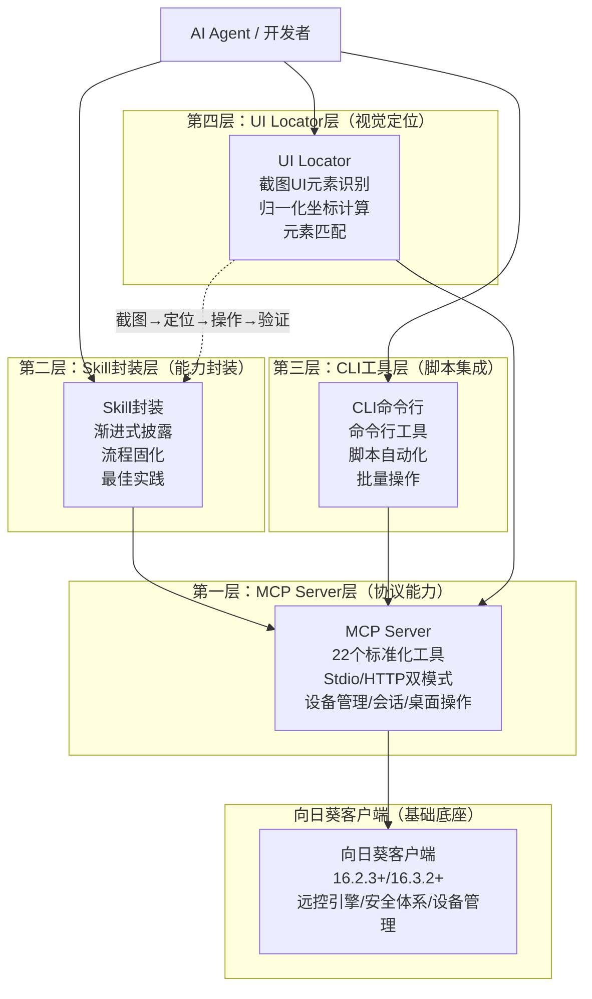
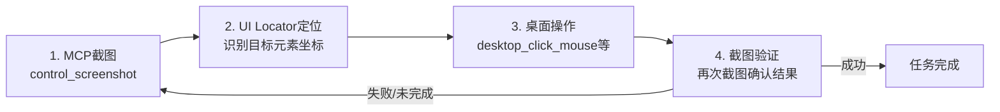
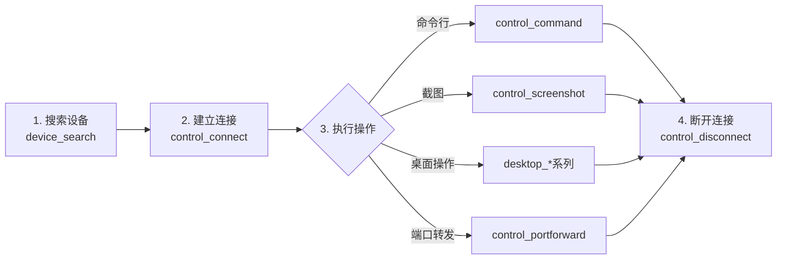
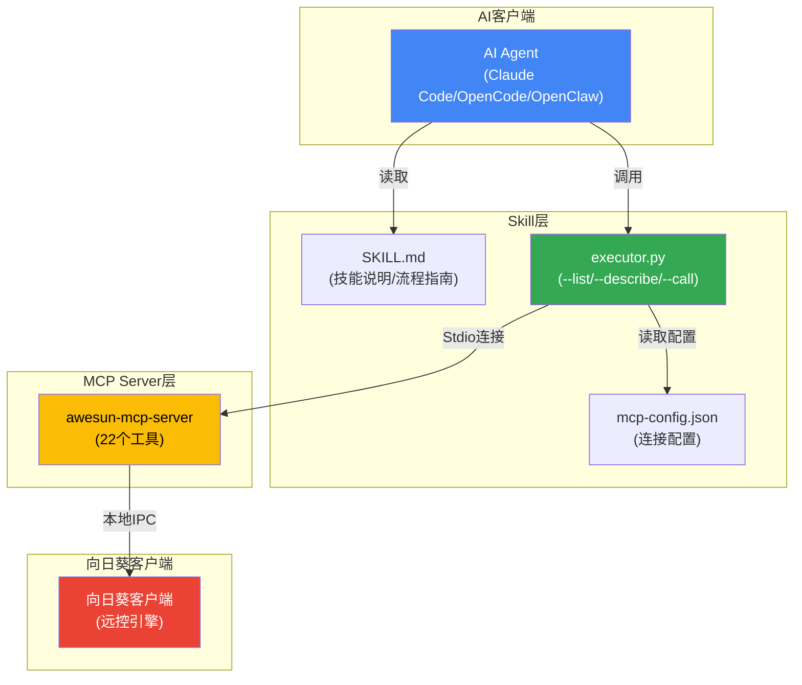
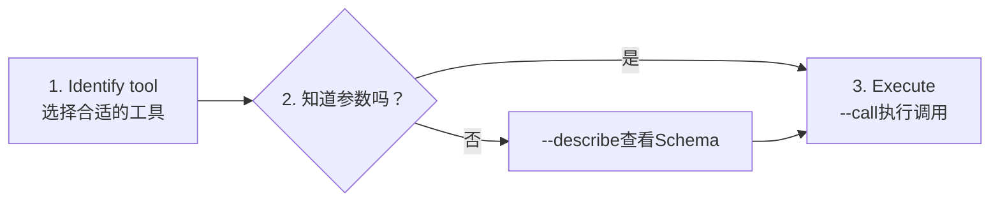
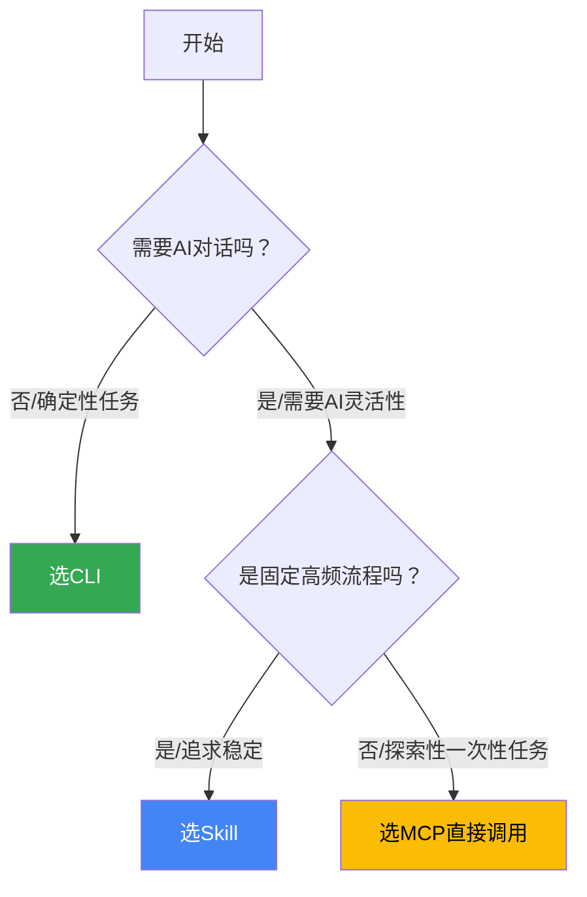
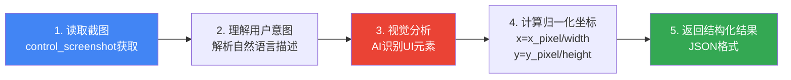
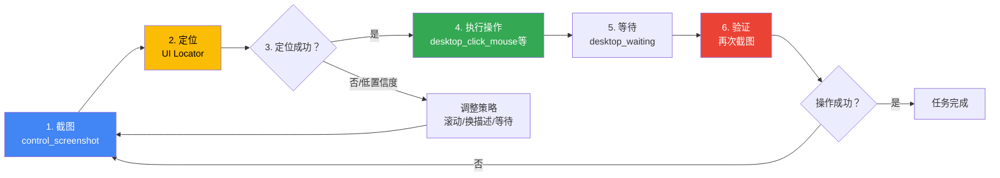
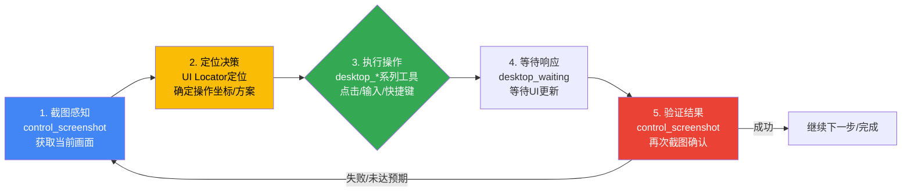
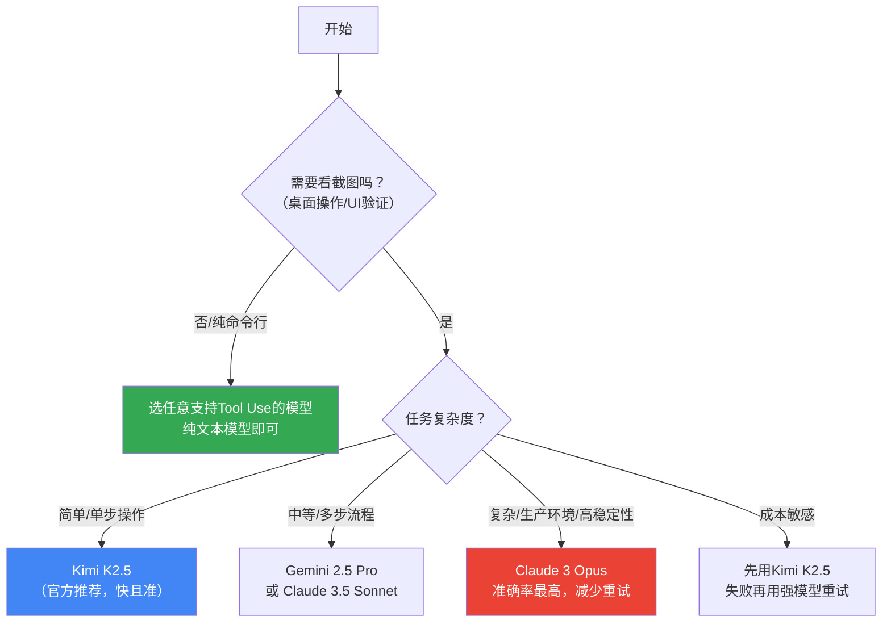

# 向日葵AI开发者生态（MCP+Skill+CLI+UI Locator）深度解析：四层架构与实战指南

> **向日葵MCP官方页面**: <https://activity.sunlogin.oray.com/mcp>
> **向日葵CLI官方页面**: <https://activity.sunlogin.oray.com/cli>
> **MCP配置帮助文档**: <https://service.oray.com/question/50091.html>
> **GitHub开源仓库**:
> - awesun-mcp: <https://github.com/OrayDev/awesun-mcp>
> - awesun-skill: <https://github.com/OrayDev/awesun-skill>
> - awesun-ui-locator: <https://github.com/OrayDev/awesun-ui-locator>
> - awesun-usecase-skill-example: <https://github.com/OrayDev/awesun-usecase-skill-example>

***

## 📋 目录导航

- [一、概述与学习目标 🎯](#一概述与学习目标)
- [二、AI开发者生态四层架构 🏗️](#二ai开发者生态四层架构)
- [三、前置条件与准备工作 ⚙️](#三前置条件与准备工作)
- [四、MCP Server层深度解析：工具能力与通信协议 🔌](#四mcp-server层深度解析工具能力与通信协议)
- [五、Skill封装层：渐进式披露与最佳实践 📦](#五skill封装层渐进式披露与最佳实践)
- [六、CLI工具层：命令行自动化与脚本集成 💻](#六cli工具层命令行自动化与脚本集成)
- [七、UI Locator层：视觉识别与元素定位 👁️](#七ui-locator层视觉识别与元素定位)
- [八、四层协同实战：视觉操作闭环完整流程 🔄](#八四层协同实战视觉操作闭环完整流程)
- [九、典型应用场景案例集 📝](#九典型应用场景案例集)
- [十、模型选择与性能优化建议 🚀](#十模型选择与性能优化建议)
- [十一、安全最佳实践与常见问题排查 🔒](#十一安全最佳实践与常见问题排查)
- [十二、相关资源与生态扩展 🔗](#十二相关资源与生态扩展)

***

## 一、概述与学习目标 🎯

> **"AI不应该只是生成答案，更应该参与执行"**
>
> —— 贝锐20周年AI战略核心主张

### 1.1 研究背景

2026年是向日葵远程控制战略转型的关键年份。随着贝锐成立20周年AI战略发布，向日葵正式从"国民级远程控制工具"向"AI执行基础设施"跃迁。这一转型的核心标志是向日葵AI开发者生态的正式开放——通过MCP、Skill、CLI、UI Locator四层架构，将向日葵十余年积累的远程控制能力全面开放给AI开发者，解决AI从"能说"到"能做"的最后一公里问题。

当前AI行业正处于一个关键转折点：大模型在内容生成、信息分析、对话交互方面能力强大，但绝大多数AI应用仍停留在"对话框"层面——用户提问，AI生成答案，然后由人类根据答案去执行操作。AI本身无法直接与物理世界、企业系统、业务流程进行深度交互，无法完成"最后一公里"的执行动作。

向日葵AI开发者生态瞄准的正是这一行业痛点：**让AI长出"手和脚"**。通过标准化的协议、渐进式的能力封装、命令行工具链、视觉定位能力，AI不仅能"想"和"说"，更能"做"——真正实现远程设备管理、桌面自动化操作、运维流程自动化、软件自动测试等复杂执行任务。

与传统RPA（机器人流程自动化）方案相比，向日葵AI开发者生态具有三大显著优势：

1. **通用性极强**：基于视觉识别+键鼠模拟，不依赖目标系统开放API，只要有图形界面就能控制
2. **零侵入部署**：被控端无需安装额外代理或脚本，向日葵客户端即开即用
3. **AI原生设计**：从底层为AI Agent设计，支持自然语言交互、任务自动拆解、失败智能重试

### 1.2 学习目标

通过本文档的系统学习，你将能够：

1. **全面理解四层架构**：清晰掌握MCP Server层、Skill封装层、CLI工具层、UI Locator层各自的定位、核心功能与适用场景
2. **掌握环境搭建方法**：能够独立完成向日葵客户端安装、MCP服务启用、Python环境配置、AI客户端集成等全流程准备工作
3. **熟练使用22个MCP工具**：掌握设备管理、远控会话、桌面操作三大类共22个标准化工具的调用方式与参数配置
4. **理解视觉操作闭环**：掌握"MCP截图→UI Locator定位→桌面操作→截图验证"的完整视觉操作流程
5. **能够开发自定义Skill**：参照官方示例，将固定操作流程封装为可复用的Skill，提升自动化成功率与稳定性
6. **进行CLI自动化集成**：通过命令行工具实现脚本化批量操作，与CI/CD、运维平台等系统集成
7. **选择合适的模型方案**：根据不同场景需求，选择视觉模型、推理模型的最优组合，平衡效果与成本
8. **排查常见问题**：掌握连接失败、操作不准、权限验证等常见问题的诊断与解决方法

### 1.3 分析框架说明

本文档遵循"从架构到实战、从基础到进阶、从理论到案例"的逻辑结构，采用"四层架构+实战流程+最佳实践"的分析框架：

| 分析维度 | 核心问题 | 对应章节 |
|---------|---------|---------|
| **架构认知层** | 向日葵AI生态由哪几层构成？各层定位是什么？如何协同？ | 第二章 |
| **环境准备层** | 需要哪些软件、硬件、环境准备？版本要求是什么？ | 第三章 |
| **核心能力层** | MCP有哪些工具？Skill如何封装？CLI能做什么？UI Locator如何定位？ | 第四至七章 |
| **实战流程层** | 四层如何协同完成一个完整任务？视觉操作闭环如何实现？ | 第八章 |
| **场景案例层** | 远程运维、自动化测试、批量部署等典型场景如何落地？ | 第九章 |
| **性能优化层** | 模型如何选择？如何减少Token消耗？如何提升操作准确率？ | 第十章 |
| **安全排障层** | 如何保障安全？常见问题如何排查？最佳实践有哪些？ | 第十一章 |
| **资源生态层** | 有哪些学习资源？如何参与社区？未来发展方向是什么？ | 第十二章 |

***

## 二、AI开发者生态四层架构 🏗️

> **"分层设计、渐进披露、各司其职、协同闭环"——向日葵AI开发者生态架构设计原则**

### 2.1 四层架构总览

向日葵AI开发者生态采用清晰的四层架构设计，从底层能力到上层应用逐层封装，每层承担明确的职责，既可独立使用，也可协同工作形成完整闭环：



### 2.2 第一层：MCP Server层（协议能力底座）

**定位**：AI开发者生态的基础能力层，基于Model Context Protocol标准协议，将向日葵远控能力封装为AI可直接调用的标准化工具集。

**核心功能**：

| 功能类别 | 工具数量 | 核心能力 |
|---------|---------|---------|
| **设备管理** | 7个 | 设备添加、搜索、详情查询、信息更新、删除、远程开机、远程关机 |
| **远控会话** | 6个 | 连接建立、会话查询、连接断开、命令执行、远程截图、端口转发 |
| **桌面操作** | 9个 | 鼠标点击、移动、拖拽、滚轮、按键控制、组合键、文本输入、粘贴、等待 |

**通信模式**：
- **Stdio模式（推荐）**：本地进程间通信，低延迟，适合本地AI客户端（Claude Desktop、OpenCode、Claude Code等）
- **Streamable HTTP模式**：基于HTTP的远程通信，支持跨网络调用，适合云端AI服务

**核心特点**：
1. **即开即用**：内置于向日葵客户端（V16.2.3+），无需额外安装服务端，一键启用自动生成配置
2. **被控端零升级**：被控终端无需更新已有向日葵软件即可接入MCP能力，保护用户既有投资
3. **安全可靠**：基于向日葵成熟的远控安全体系，需设备验证码或已信任设备才能建立连接
4. **标准协议**：完全遵循MCP标准协议，任何支持MCP的AI客户端均可无缝接入

**适用场景**：
- AI客户端原生集成MCP协议（如Claude Desktop）
- 需要精细控制每一步操作的场景
- 开发者进行能力探索与原型开发

### 2.3 第二层：Skill封装层（渐进式能力封装）

**定位**：在MCP基础上的能力封装层，针对支持Skills机制的AI客户端（Claude Code、OpenCode、OpenClaw等），提供渐进式披露的工具调用、固化的操作流程、内置的最佳实践。

**核心功能**：
1. **渐进式披露**：不是一次性把22个工具全部暴露给AI，而是根据任务需要逐步引导，减少上下文占用，提升决策质量
2. **流程固化**：将高频、固定的操作路径封装为标准流程，减少AI决策的随机性，提升操作成功率
3. **错误处理**：内置常见错误的识别与重试逻辑，提升自动化鲁棒性
4. **最佳实践**：内置等待策略、截图验证、坐标校准等最佳实践，降低开发者使用门槛

**官方Skill**：
- **awesun-remote-control**：基础远控Skill，封装MCP能力，提供渐进式工具调用
- **feishu-install-pc**（示例）：远程安装飞书的完整流程Skill，展示如何封装特定业务场景

**核心优势**：
1. **成功率更高**：固化操作路径，减少AI随机决策导致的失败
2. **Token消耗更低**：减少截屏交互次数，流程化操作降低对话轮次
3. **使用更简单**：开发者无需深入了解每个MCP工具的细节，直接通过自然语言触发
4. **可复用性强**：一次封装，多处使用，团队间可共享Skill成果

**适用场景**：
- 固定流程的自动化任务（如软件安装、环境部署、日常巡检）
- 需要高成功率、高稳定性的生产环境
- 团队共享标准化操作流程

### 2.4 第三层：CLI工具层（脚本自动化与系统集成）

**定位**：面向开发者和运维人员的命令行接口，支持通过Shell脚本、批处理、CI/CD流水线等方式调用向日葵远控能力，实现非对话式的自动化集成。

**核心功能**：
1. **命令行操作**：所有MCP能力均可通过命令行调用，支持管道、重定向等Shell特性
2. **脚本集成**：可写入Bash/PowerShell/Python脚本，实现复杂自动化逻辑
3. **批量操作**：支持循环、条件判断等编程结构，实现批量设备管理
4. **CI/CD集成**：可与Jenkins、GitLab CI、GitHub Actions等持续集成系统对接

**典型应用**：
- 自动化测试流水线中远程启动测试环境
- 运维脚本批量检查服务器状态并执行修复
- 部署脚本远程推送更新并重启服务
- 定时任务自动执行日常巡检

**适用场景**：
- 运维人员编写自动化脚本
- CI/CD流水线集成
- 批量设备管理
- 无需AI参与的确定性自动化任务

### 2.5 第四层：UI Locator层（视觉定位与元素识别）

**定位**：视觉智能层，通过AI视觉模型分析截图，精确定位UI元素位置，解决桌面操作中"在哪里点击"的核心问题，是实现可靠视觉操作闭环的关键组件。

**核心功能**：
1. **智能元素识别**：自动识别截图中的按钮、输入框、图标、文本等UI元素
2. **归一化坐标**：返回(x_norm, y_norm)格式的标准化坐标，范围[0.0, 1.0]，适配不同分辨率
3. **自然语言匹配**：根据用户的自然语言描述（如"找到右上角的关闭按钮"）准确匹配目标元素
4. **多策略查找**：支持位置描述、颜色特征、文字内容、上下文关系等多种查找策略

**坐标系统设计**：
- **原点**：屏幕左上角为(0.0, 0.0)
- **范围**：X轴（水平）和Y轴（垂直）均为[0.0, 1.0]
- **返回值**：元素中心点的归一化坐标
- **精度**：精确到小数点后6位，足够支持像素级操作

**支持的元素类型**：

| 元素类型 | 描述 | 示例 |
|---------|------|------|
| **按钮** | 各种可点击操作按钮 | 登录、提交、取消、确认、下一步 |
| **输入框** | 文本输入区域 | 搜索框、用户名输入框、密码框 |
| **图标** | 功能性图标元素 | 设置齿轮、汉堡菜单、关闭、最大化、最小化 |
| **导航** | 导航相关元素 | 标签页、分页器、面包屑、菜单栏 |
| **文本** | 文字内容元素 | 标题、链接、标签、提示文字 |

**适用场景**：
- 配合MCP桌面操作工具实现精准点击
- 复杂界面的元素定位
- 不依赖API的纯视觉自动化
- 跨分辨率适配场景

### 2.6 四层协同关系：视觉操作闭环

四层架构并非孤立存在，而是可以灵活组合形成强大的协同能力。其中最核心、最常用的协同模式是**视觉操作闭环**：



**闭环流程详解**：

1. **第一步：MCP截图获取画面**
   - 调用MCP的`control_screenshot`工具获取远程桌面实时截图
   - 返回Base64编码的图片数据及屏幕尺寸信息
   - 这是AI"看"到远程桌面的方式

2. **第二步：UI Locator定位元素**
   - 将截图传给UI Locator
   - 用自然语言描述要操作的目标（如"点击确定按钮"、"找到搜索框"）
   - UI Locator通过视觉模型识别元素，返回归一化坐标
   - 同时返回置信度和元素描述，供AI判断定位是否准确

3. **第三步：执行桌面操作**
   - 根据UI Locator返回的坐标，调用对应的MCP桌面操作工具
   - 点击操作：`desktop_click_mouse`
   - 输入操作：先点击输入框，再用`desktop_typing_text`或`desktop_paste_text`输入
   - 复杂操作：拖拽、滚轮、组合键等按需调用

4. **第四步：截图验证结果**
   - 操作完成后等待适当时间（使用`desktop_waiting`）
   - 再次截图验证操作结果是否符合预期
   - 如果成功则任务完成，如果失败则回到第一步重试或调整策略

**为什么需要闭环？**

纯AI视觉操作存在不确定性：模型可能识别错误、界面可能加载延迟、点击可能有偏差。通过"操作→验证→重试"的闭环机制，可以将单次操作的成功率从60-70%提升到95%以上，达到生产可用的稳定性。

**四层架构协同价值总结**：

| 层级组合 | 能力水平 | 适用场景 | 开发难度 | 稳定性 |
|---------|---------|---------|---------|--------|
| 仅MCP | 基础能力，需要AI自己"摸索" | 简单任务、原型验证 | 低 | 中等 |
| MCP + Skill | 封装最佳实践，流程化操作 | 固定流程、生产环境 | 中 | 高 |
| MCP + UI Locator | 视觉闭环，精准操作 | 复杂界面、通用场景 | 中 | 高 |
| MCP + Skill + UI Locator | 完整能力，最优体验 | 复杂业务自动化 | 高 | 极高 |
| CLI单独使用 | 确定性脚本自动化 | 无AI的固定流程 | 中 | 极高 |

***

## 三、前置条件与准备工作 ⚙️

> **"工欲善其事，必先利其器"——环境准备是成功的第一步**

### 3.1 客户端版本要求

向日葵AI开发者生态对客户端版本有明确要求，不同组件需要的最低版本不同：

| 组件 | 最低版本要求 | 说明 |
|-----|-----------|------|
| **MCP Server** | 16.2.3.28762+ | MCP服务首次随该版本内置，需手动启用 |
| **Skill** | 16.3.2+ | Skill配套的MCP配置格式有更新，需此版本以上 |
| **UI Locator** | 16.3.2+ | 与Skill版本要求一致 |
| **CLI** | 请参考CLI官方文档 | 建议使用最新Beta版获取完整功能 |

> ⚠️ **重要提示**：版本低于要求时，MCP功能可能不显示、配置格式不兼容、或部分工具无法使用。请务必先升级客户端到指定版本以上。

**客户端下载地址**：
- 正式版：<https://sunlogin.oray.com/download>
- Beta版（推荐获取最新AI功能）：<https://sunlogin.oray.com/download/beta>

### 3.2 Python环境要求

部分组件（Skill、UI Locator的辅助工具）依赖Python运行环境：

| 环境项 | 要求 | 说明 |
|-------|-----|------|
| **Python版本** | 3.7+ | 建议3.9+以获得更好的兼容性和性能 |
| **依赖包** | mcp | 通过`pip install mcp`安装MCP Python SDK |
| **操作系统** | Windows / macOS | 向日葵客户端MCP功能目前支持Windows和macOS |

**Python安装验证**：
```bash
# 检查Python版本
python --version
# 或
python3 --version

# 安装MCP依赖
pip install mcp
```

### 3.3 支持的AI客户端

向日葵AI生态支持多种主流AI客户端，根据是否支持MCP协议和Skills机制分为三类：

| AI客户端 | MCP支持 | Skills支持 | 推荐场景 |
|---------|--------|-----------|---------|
| **OpenCode** | ✅ 原生支持 | ✅ 原生支持 | 全场景开发、开源首选 |
| **Claude Code** | ✅ 原生支持 | ✅ 原生支持 | 开发者工作流、代码场景 |
| **Claude Desktop** | ✅ 原生支持 | ❌ 不支持 | 桌面端日常使用、简单任务 |
| **🦞 OpenClaw** | ✅ 支持 | ✅ 原生支持 | 国产AI助手、多模型切换 |
| **Cherry Studio** | ✅ 支持 | ❌ 请参考官方文档 | 多模型聚合客户端 |
| **其他MCP客户端** | ✅ 标准兼容 | ❌ 视客户端而定 | 任何支持标准MCP协议的客户端 |

**客户端选择建议**：
- 如果你是**开发者**，需要开发自定义Skill或进行复杂自动化，推荐 **OpenCode** 或 **Claude Code**
- 如果你是**普通用户**，只想日常用AI操作远程电脑，推荐 **Claude Desktop**
- 如果你需要**切换多个模型**（如同时用Kimi、Gemini、Claude），推荐 **Cherry Studio** 或 **OpenClaw**

### 3.4 模型选择建议

桌面操作场景对AI模型有特殊要求——**必须具备视觉能力**，因为需要看懂截图内容才能进行后续操作。

**核心要求**：
- ✅ 必须支持**视觉/多模态**输入（能看懂图片）
- ✅ 具备较强的**推理能力**（能理解界面结构、规划操作步骤）
- ✅ 支持**工具调用**（Function Calling/Tool Use）
- ❌ 纯文本模型无法完成桌面操作任务

**推荐模型列表**：

| 模型 | 视觉能力 | 推理能力 | 速度 | 成本 | 推荐场景 |
|-----|---------|---------|------|------|---------|
| **Kimi K2.5** | ⭐⭐⭐⭐⭐ | ⭐⭐⭐⭐ | 快 | 中 | 官方推荐，桌面操作表现优秀 |
| **Gemini 2.5 Pro** | ⭐⭐⭐⭐⭐ | ⭐⭐⭐⭐⭐ | 中 | 中高 | 复杂推理、多步骤任务 |
| **Claude 3.5 Sonnet** | ⭐⭐⭐⭐ | ⭐⭐⭐⭐⭐ | 中 | 高 | 长流程、复杂决策 |
| **Claude 3 Opus** | ⭐⭐⭐⭐⭐ | ⭐⭐⭐⭐⭐ | 慢 | 极高 | 最复杂任务、准确率优先 |
| **GPT-4o** | ⭐⭐⭐⭐ | ⭐⭐⭐⭐ | 快 | 高 | 通用场景、均衡表现 |

> 💡 **官方推荐**：向日葵官方文档明确推荐搭配 **Kimi K2.5** 模型使用，在桌面操作场景经过优化适配。

**模型选择策略**：
1. **简单任务**（如打开软件、点击按钮）：用速度快的模型（Kimi K2.5、GPT-4o）
2. **复杂任务**（如软件安装、多步配置）：用推理强的模型（Gemini 2.5 Pro、Claude 3.5 Sonnet）
3. **生产环境**（追求稳定性）：建议用Claude 3 Opus或Gemini 2.5 Pro，减少重试次数
4. **成本敏感**：先用快模型做第一轮，遇到失败再切换强模型重试

### 3.5 设备准备与安全验证

向日葵远控有严格的安全机制，AI使用前必须完成设备验证，否则无法建立远控连接。

**必要准备步骤**：

1. **安装并登录向日葵客户端**
   - 在主控端（运行AI的电脑）安装向日葵客户端并登录账号
   - 在被控端（要远程操作的电脑）也安装向日葵客户端并登录同一账号（或添加到设备列表）

2. **手动验证设备一次（关键步骤！）**
   - **必须手动进行至少一次成功的远控连接**
   - 连接过程中按提示输入验证码、或选择"信任此设备"
   - 验证通过后，后续AI连接才能免验证直接使用
   - 如果跳过这一步，AI尝试连接时会因无法处理验证码弹窗而失败

3. **启用MCP服务器**
   - 打开向日葵客户端
   - 找到「向日葵MCP」侧边栏菜单（16.2.3+版本才有）
   - 点击「启用MCP服务器」开关
   - 根据需要选择通信模式：
     - 本地AI客户端选「Stdio」（推荐）
     - 跨网络调用选「Streamable HTTP」
   - 复制生成的配置JSON，后续配置AI客户端需要用到

4. **测试MCP连接**
   - 将配置添加到AI客户端后，先测试一个简单指令（如"列出我的设备"）
   - 确认设备列表能正常返回，说明MCP连接成功
   - 如果失败，检查：客户端版本是否达标、MCP是否启用、Token是否正确复制

**设备安全验证原理**：

向日葵采用"主控设备授信"安全模型——用户手动在某台设备上验证通过一次后，该设备即被标记为"可信设备"，后续从该设备发起的远控连接无需重复验证。AI运行在这台可信主控设备上，自然继承了信任状态，可以顺畅地发起远控。

> 🔒 **安全提示**：这是安全设计，不是bug。AI没有能力处理图形验证码或人工确认弹窗，必须由人类先完成一次可信验证，这既保障了安全，也为AI后续使用铺平了道路。

### 3.6 快速验证清单

开始正式使用前，请对照此清单确认所有准备工作已完成：

| 检查项 | 完成状态 | 验证方法 |
|-------|---------|---------|
| ⬜ 向日葵客户端已升级到16.2.3+（MCP）或16.3.2+（Skill） | | 客户端菜单→关于→查看版本号 |
| ⬜ 主控端和被控端都已登录向日葵账号 | | 客户端设备列表能看到被控设备 |
| ⬜ 已手动远控连接过被控设备一次，完成信任验证 | | 手动连接无需再输验证码即可进入 |
| ⬜ MCP服务器已启用 | | 向日葵侧边栏能看到MCP菜单，开关已打开 |
| ⬜ Python 3.7+已安装（如需用Skill/UI Locator） | | 命令行运行`python --version` |
| ⬜ AI客户端已配置MCP并测试成功 | | 让AI"列出我的设备"，能正常返回设备列表 |
| ⬜ 使用的AI模型支持视觉能力 | | 发一张截图让AI描述，能正确识别内容 |

全部打勾后，你就具备了使用向日葵AI开发者生态的完整环境，可以开始探索和构建你的AI自动化工作流了！

***

## 四、MCP Server层深度解析：工具能力与通信协议 🔌

> **"标准化是AI能力复用的基础，22个工具覆盖远控全场景"——MCP Server设计理念**

MCP Server层是向日葵AI开发者生态的基础能力底座，它基于Model Context Protocol标准协议，将向日葵十余年积累的远程控制能力封装为22个标准化工具，供AI客户端直接调用。本章将深入解析每个工具的功能、参数、输出，以及通信模式和AI客户端配置实战。

### 4.1 工具分类总览 📊

MCP Server提供的22个标准化工具按照功能分为三大类别，形成了完整的远程控制能力闭环：

| 工具类别 | 工具数量 | 核心功能 | 典型工具 |
|---------|---------|---------|---------|
| **设备管理类** | 7个 | 设备生命周期管理：增删改查、远程开关机 | device_search、device_wakeup、device_shutdown |
| **远控会话类** | 6个 | 连接生命周期管理：建立/断开连接、命令执行、截图、端口转发 | control_connect、control_screenshot、control_command |
| **桌面操作类** | 9个 | 桌面交互模拟：鼠标、键盘、文本输入、等待 | desktop_click_mouse、desktop_typing_text、desktop_paste_text |

**工具调用的标准流程**：

任何远控操作都遵循"搜索设备→建立连接→执行操作→断开连接"的四步标准流程：



> 💡 **最佳实践**：操作完成后务必及时调用`control_disconnect`断开会话，释放系统资源。长时间闲置的会话可能被服务端自动回收。

***

### 4.2 设备管理类工具详解（7个） 🖥️

设备管理类工具负责远程设备的生命周期管理，是所有远控操作的起点——你需要先找到目标设备，获取其`remote_id`，才能进行后续操作。

#### 4.2.1 device_add — 添加设备

**功能描述**：将新设备添加到设备列表中，可设置设备名称和描述便于管理。添加成功后可通过`device_search`查询该设备。

**输入参数**：

| 参数 | 类型 | 必填 | 说明 |
|-----|-----|-----|-----|
| `name` | string | ✅ 是 | 设备的名称 |
| `desc` | string | ❌ 否 | 设备的描述信息 |

**核心输出**：

| 参数 | 类型 | 说明 |
|-----|-----|-----|
| `remote_id` | string | 新添加设备的唯一ID，后续所有操作都需要使用此ID |

> 📝 **使用场景**：通常用于通过快码添加不在当前账号下的设备，或批量导入设备。同账号下的设备登录后会自动出现在设备列表中，无需手动添加。

***

#### 4.2.2 device_search — 搜索设备

**功能描述**：根据关键词模糊搜索设备列表中的设备，支持按设备名称检索，返回匹配的设备基本信息列表。这是最常用的设备管理工具，**几乎是所有远控操作的第一步**。

**输入参数**：

| 参数 | 类型 | 必填 | 说明 |
|-----|-----|-----|-----|
| `keyword` | string | ❌ 否 | 查询关键字，支持模糊检索；不传则返回所有设备 |
| `limit` | int64 | ✅ 是 | 查询结果数量限制，最大值为100 |

**核心输出**：

| 参数 | 类型 | 说明 |
|-----|-----|-----|
| `total` | int64 | 匹配的设备总数 |
| `devices` | array | 设备列表数组 |

**设备对象完整字段说明**：

| 字段 | 类型 | 说明 |
|-----|-----|-----|
| `remote_id` | string | 设备唯一ID（最重要，后续操作必备） |
| `name` | string | 设备名称 |
| `description` | string | 设备备注 |
| `pc_name` | string | 计算机名称 |
| `cpu` | string | CPU型号 |
| `mac` | string | MAC地址 |
| `memory` | string | 内存信息 |
| `screen_size` | string | 屏幕分辨率 |
| `client` | string | 客户端类型标识 |
| `os` | string | 操作系统类型 |
| `os_name` | string | 操作系统名称 |
| `base_board` | string | 主板型号 |
| `disk_drive` | string | 硬盘信息 |
| `video_controller` | string | 显卡信息 |
| `network_adapter` | string | 网卡信息 |
| `version` | string | 客户端版本 |
| `online` | bool | 是否在线 |
| `fastcode` | string | 远控识别码/快码 |
| `login_time` | string | 登录时间 |
| `ip` | string | 公网IP地址 |
| `lan_ip` | string | 局域网IP地址 |
| `create_time` | string | 设备添加时间 |

> 💡 **使用技巧**：先调用`device_search`获取设备列表，从中找到目标设备的`remote_id`，再进行后续连接操作。建议将`limit`设为100以一次性获取所有设备。

***

#### 4.2.3 device_info — 查询设备详情

**功能描述**：查询指定设备的完整详细信息，包括硬件配置（CPU、内存、硬盘、显卡）、网络信息（IP地址、MAC地址）、系统版本、在线状态、支持的插件等。

**输入参数**：

| 参数 | 类型 | 必填 | 说明 |
|-----|-----|-----|-----|
| `remote_id` | int64 | ✅ 是 | 设备ID（通过device_search获取） |

**核心输出**：返回比`device_search`更完整的设备信息，额外包含`plugins`字段（该设备支持的远控插件列表），其他字段与device_search返回的设备对象一致。

> 📝 **使用场景**：在执行远控前检查设备能力，或进行设备资产盘点时获取完整硬件信息。

***

#### 4.2.4 device_update — 更新设备信息

**功能描述**：修改指定设备的名称和描述信息，用于更新设备列表中的显示名称和备注，便于设备管理和识别。

**输入参数**：

| 参数 | 类型 | 必填 | 说明 |
|-----|-----|-----|-----|
| `remote_id` | int64 | ✅ 是 | 设备ID |
| `name` | string | ❌ 否 | 新的设备名称 |
| `desc` | string | ❌ 否 | 新的设备描述信息 |

**核心输出**：操作成功/失败提示信息。

> 💡 **最佳实践**：给设备起清晰易识别的名称（如"研发部-测试机-Win10"、"运维-生产服务器-01"），可大幅提升AI搜索和选择设备的准确率。

***

#### 4.2.5 device_remove — 删除设备

**功能描述**：从设备列表中删除指定的设备。**注意：此操作仅移除本地列表记录，不会卸载或影响被控端的向日葵客户端**，删除后可通过重新添加找回。

**输入参数**：

| 参数 | 类型 | 必填 | 说明 |
|-----|-----|-----|-----|
| `remote_id` | int64 | ✅ 是 | 要删除的设备ID |

**核心输出**：操作成功/失败提示信息。

> ⚠️ **注意**：删除操作不可恢复，但不会影响被控端。如需再次控制该设备，需重新添加。

***

#### 4.2.6 device_wakeup — 远程开机

**功能描述**：向绑定了开机硬件的设备发送开机指令（Wake-on-LAN）。需要设备端配置向日葵开机棒，或主板支持WOL唤醒功能且已在向日葵中配置。指令下发后设备将在1-2分钟内完成开机并上线。

**输入参数**：

| 参数 | 类型 | 必填 | 说明 |
|-----|-----|-----|-----|
| `remote_id` | int64 | ✅ 是 | 要唤醒的设备ID |

**核心输出**：开机指令下发成功提示。设备上线大约需要1-2分钟，建议等待后再调用`device_search`确认在线状态。

> 💡 **使用场景**：需要远程操作关机状态的设备时，先调用此工具开机，等待设备上线后再建立远控连接。适合运维场景中定时开机执行任务。

***

#### 4.2.7 device_shutdown — 远程关机

**功能描述**：向在线的远程设备发送关机指令，设备需处于在线状态且被控端支持关机功能。指令下发后设备将在1-2分钟内完成关机并离线。

**输入参数**：

| 参数 | 类型 | 必填 | 说明 |
|-----|-----|-----|-----|
| `remote_id` | int64 | ✅ 是 | 要关机的设备ID |

**核心输出**：关机指令下发成功提示。设备离线大约需要1-2分钟。

> ⚠️ **重要提示**：远程关机前确保所有工作已保存，未保存的数据可能丢失。建议在关机前先通过截图确认设备状态。

***

### 4.3 远控会话类工具详解（6个） 🔗

远控会话类工具负责连接的生命周期管理以及在会话基础上的高级操作，是连接"设备管理"和"桌面操作"的桥梁。

#### 4.3.1 control_connect — 建立远控连接

**功能描述**：发起与指定设备的远控会话连接，支持7种远控类型。连接成功后返回`session_id`，后续的桌面操作、截图、命令执行、端口转发等都需要基于此会话ID进行。**这是最核心的会话工具**。

**输入参数**：

| 参数 | 类型 | 必填 | 说明 |
|-----|-----|-----|-----|
| `type` | string | ✅ 是 | 远控类型，共7种：`file`(远程文件)、`desktop`(远程桌面)、`cmd2`(远程CMD/Windows)、`ssh`(远程SSH/Linux/Mac)、`desktop_view`(桌面观看)、`newcamera`(远程摄像头)、`forward`(端口转发) |
| `remote_id` | int64 | ✅ 是 | 被控设备ID（通过device_search获取） |

**核心输出**：

| 参数 | 类型 | 说明 |
|-----|-----|-----|
| `session_id` | string | 远控会话ID，后续所有会话相关操作都需要使用此ID |

> 💡 **类型选择指南**：
> - 需要操作鼠标键盘：选`desktop`
> - 只需要看屏幕不需要操作：选`desktop_view`（性能更好）
> - 执行Windows命令：选`cmd2`
> - 执行Linux/Mac命令：选`ssh`
> - 传输文件：选`file`
> - 查看摄像头：选`newcamera`
> - 端口映射：选`forward`

***

#### 4.3.2 control_sessions — 查询活跃会话

**功能描述**：查询所有当前活跃的远控会话，包括会话ID、会话类型、被控设备ID等信息。可用于获取已存在的会话ID，避免重复建立连接。

**输入参数**：

| 参数 | 类型 | 必填 | 说明 |
|-----|-----|-----|-----|
| `type` | string | ❌ 否 | 远控类型过滤，不传则返回所有类型的会话；可选值同control_connect的type参数 |

**核心输出**：

| 参数 | 类型 | 说明 |
|-----|-----|-----|
| `total` | int64 | 活跃会话总数 |
| `message` | string | 服务器返回的消息 |
| `sessions` | array | 远控会话列表数组 |

**会话对象字段**：

| 字段 | 类型 | 说明 |
|-----|-----|-----|
| `type` | string | 远控类型 |
| `session_id` | string | 远控会话ID |
| `remote_id` | string | 被控设备ID |
| `fastcode` | string | 被控设备快码 |

> 💡 **使用场景**：任务中断后恢复时，先调用此工具查看是否有可用的活跃会话，避免重复建立连接消耗资源。

***

#### 4.3.3 control_disconnect — 断开连接

**功能描述**：终止指定的活跃远控会话，立即断开与该会话的连接。断开后如需再次操作需要重新调用`control_connect`建立连接。

**输入参数**：

| 参数 | 类型 | 必填 | 说明 |
|-----|-----|-----|-----|
| `session_id` | string | ✅ 是 | 要断开的远控会话ID |

**核心输出**：操作成功/失败提示信息。

> 💡 **最佳实践**：强烈建议在完成所有操作后及时断开会话释放资源。虽然系统会自动回收闲置会话，但主动断开是更优雅的做法，也避免会话数量达到上限导致新连接失败。

***

#### 4.3.4 control_command — 执行CMD命令

**功能描述**：在已建立的CMD远程会话中执行命令，目前仅支持Windows系统的CMD。返回命令的退出码、标准输出和标准错误，是实现命令行自动化的核心工具。

**输入参数**：

| 参数 | 类型 | 必填 | 说明 |
|-----|-----|-----|-----|
| `session_id` | string | ✅ 是 | 远控会话ID（**仅支持cmd2类型的会话**） |
| `command` | string | ✅ 是 | 要执行的命令 |
| `args` | array | ❌ 否 | 命令参数数组 |

**核心输出**：

| 参数 | 类型 | 说明 |
|-----|-----|-----|
| `exit_code` | int64 | 命令退出码，0表示成功，非0表示失败 |
| `std_out` | string | 标准输出流内容（命令正常输出） |
| `std_err` | string | 标准错误流内容（命令错误信息） |

> 💡 **使用场景**：
> - 查询系统信息：`systeminfo`、`ipconfig`、`tasklist`
> - 文件操作：`dir`、`copy`、`del`、`mkdir`
> - 进程管理：`taskkill`、`start`
> - 软件安装：`msiexec /i package.msi /quiet`
> - 脚本执行：批处理脚本、PowerShell命令（通过`powershell -Command "..."`调用）

> ⚠️ **注意**：此工具仅支持`cmd2`类型会话，操作Linux/Mac请建立`ssh`类型会话。

***

#### 4.3.5 control_screenshot — 远程截图

**功能描述**：对指定的远程桌面会话进行截图，返回截图保存路径及尺寸信息。这是AI"看见"远程桌面的唯一方式，是视觉操作闭环的核心组件。

**输入参数**：

| 参数 | 类型 | 必填 | 说明 |
|-----|-----|-----|-----|
| `session_id` | string | ✅ 是 | 远控会话ID（**仅支持desktop/desktop_view类型的会话**） |

**核心输出**：

| 参数 | 类型 | 说明 |
|-----|-----|-----|
| `image_path` | string | 截图文件保存的本地路径 |
| `image_width` | int64 | 图片宽度（像素） |
| `image_height` | int64 | 图片高度（像素） |

> 💡 **核心作用**：截图是视觉操作闭环的起点和终点：
> 1. 操作前截图 → AI分析界面，确定操作位置
> 2. 执行操作（点击、输入等）
> 3. 等待后再次截图 → 验证操作结果
>
> 这个"截图→操作→验证"的闭环是保证操作成功率的关键机制。

***

#### 4.3.6 control_portforward — 配置端口转发

**功能描述**：在已建立的端口转发远程会话中配置端口转发规则（覆盖式配置），实现本地端口与远程主机端口的双向TCP数据转发。

**输入参数**：

| 参数 | 类型 | 必填 | 说明 |
|-----|-----|-----|-----|
| `session_id` | string | ✅ 是 | 远控会话ID（**仅支持forward类型的会话**） |
| `target_addresses` | array | ✅ 是 | 内网目标主机的`IP:端口`数组，仅支持TCP协议；支持同时配置多个，如：`['127.0.0.1:22', '192.168.10.1:3389']` | <!-- nosec -->

**核心输出**：

| 参数 | 类型 | 说明 |
|-----|-----|-----|
| `target_address` | string | 目标地址 |
| `local_address` | string | 本地监听地址（通过访问此本地地址即可转发到远程目标） |

> 💡 **使用场景**：
> - 远程SSH：转发22端口，本地用SSH客户端连接
> - 远程RDP：转发3389端口，本地用远程桌面连接
> - 数据库访问：转发3306(MySQL)、5432(PostgreSQL)等端口
> - Web服务调试：转发80/443/8080等Web端口

> ⚠️ **注意**：每次调用会覆盖之前的转发规则，如需同时转发多个端口请一次性在target_addresses数组中传入所有目标。

***

### 4.4 桌面操作类工具详解（9个） 🖱️⌨️

桌面操作类工具共9个，负责模拟鼠标和键盘操作，是实现UI自动化的核心。**所有涉及坐标的参数都必须使用归一化值**。

> 🎯 **重要提示**：桌面操作类工具（除desktop_waiting外）**仅支持desktop类型的远控会话**，不支持desktop_view等其他类型。

#### 4.4.1 desktop_click_mouse — 鼠标点击

**功能描述**：在远程桌面中模拟鼠标点击操作，支持左键、右键、中键点击及双击。适用于按钮点击、菜单选择、图标双击启动等场景。

**输入参数**：

| 参数 | 类型 | 必填 | 说明 |
|-----|-----|-----|-----|
| `session_id` | string | ✅ 是 | 远控会话ID（仅支持desktop类型） |
| `coordinates` | array | ✅ 是 | 需要点击的归一化坐标`[x, y]`，取值范围0.0~1.0 |
| `button` | string | ✅ 是 | 鼠标按钮类型：`left`(左键)、`right`(右键)、`middle`(中键) |
| `clicks` | int64 | ✅ 是 | 点击次数，传`2`则为双击 |

**核心输出**：操作成功/失败提示信息。

> 💡 **常用组合**：
> - 左键单击：`button="left", clicks=1`（最常用，按钮点击）
> - 左键双击：`button="left", clicks=2`（打开文件/文件夹、启动程序）
> - 右键单击：`button="right", clicks=1`（弹出右键菜单）
> - 中键单击：`button="middle", clicks=1`（在新标签页打开链接等）

***

#### 4.4.2 desktop_move_mouse — 移动鼠标

**功能描述**：将鼠标光标移动到远程桌面的指定坐标位置，**仅移动不触发点击**。常用于拖拽前定位、悬停触发菜单（如下拉菜单悬停展开）、或配合截图确定位置。

**输入参数**：

| 参数 | 类型 | 必填 | 说明 |
|-----|-----|-----|-----|
| `session_id` | string | ✅ 是 | 远控会话ID（仅支持desktop类型） |
| `coordinates` | array | ✅ 是 | 目标归一化坐标`[x, y]`，取值范围0.0~1.0 |

**核心输出**：操作成功/失败提示信息。

> 💡 **使用场景**：
> - 拖拽操作前先移动到起点位置
> - 悬停显示tooltip或展开下拉菜单
> - 移动到目标位置后再进行点击，避免鼠标瞬移导致界面识别异常

***

#### 4.4.3 desktop_drag_mouse — 鼠标拖拽

**功能描述**：在远程桌面中模拟鼠标拖拽操作，支持按住指定按键沿路径移动。可用于文件拖拽移动、窗口调整大小、选择文本区域、滑块拖动等场景。

**输入参数**：

| 参数 | 类型 | 必填 | 说明 |
|-----|-----|-----|-----|
| `session_id` | string | ✅ 是 | 远控会话ID（仅支持desktop类型） |
| `paths` | array | ✅ 是 | 拖拽路径，归一化坐标点数组，格式如`["0.1,0.1", "0.5,0.5"]`，系统会沿路径平滑拖动 |
| `button` | string | ✅ 是 | 拖拽时按住的鼠标按钮：`left`、`right`、`middle` |
| `hold_keys` | array | ❌ 否 | 拖拽时同时按住的修饰键：`shift`、`ctrl`、`alt`等 |

**核心输出**：操作成功/失败提示信息。

> 💡 **常用场景**：
> - 移动窗口：拖拽标题栏（通常在窗口顶部）
> - 调整窗口大小：拖拽窗口边缘/右下角
> - 选中文件：按住Ctrl+拖拽多选
> - 选中文本：从起始位置拖拽到结束位置
> - 滑块拖动：如音量滑块、进度条拖动

***

#### 4.4.4 desktop_scroll_mouse — 滚轮滚动

**功能描述**：在远程桌面的指定位置模拟鼠标滚轮滚动，支持向上或向下滚动指定次数。用于滚动网页、文档、列表等查看更多内容。

**输入参数**：

| 参数 | 类型 | 必填 | 说明 |
|-----|-----|-----|-----|
| `session_id` | string | ✅ 是 | 远控会话ID（仅支持desktop类型） |
| `coordinates` | array | ✅ 是 | 滚轮发生位置的归一化坐标`[x, y]`，通常是要滚动区域内的某点 |
| `direction` | string | ✅ 是 | 滚动方向：`up`(向上)、`down`(向下) |
| `scroll_count` | int64 | ✅ 是 | 滚动次数（滚动"格"数，数值越大滚动距离越长） |

**核心输出**：操作成功/失败提示信息。

> 💡 **使用技巧**：
> - 滚动前先将鼠标移动到要滚动的区域内点击一下，确保该区域获得焦点
> - 网页浏览一次滚动3-5格比较自然，长列表可适当增大
> - 每次滚动后建议等待一小段时间让内容加载，再截图判断是否需要继续滚动

***

#### 4.4.5 desktop_press_keys — 精确按键控制

**功能描述**：精确控制按键的按下或释放操作，适合需要精细控制按键状态的场景。支持单独按下(down)、单独释放(up)，或不指定press参数时自动完成"按下→释放"的完整点击。

**输入参数**：

| 参数 | 类型 | 必填 | 说明 |
|-----|-----|-----|-----|
| `session_id` | string | ✅ 是 | 远控会话ID（仅支持desktop类型） |
| `keys` | array | ✅ 是 | 按键序列，如`["control"]`、`["alt"]`、`["v"]`、`["return"]` |
| `press` | string | ❌ 否 | 按键操作：`up`(释放)、`down`(按下)；不填则默认为按下后自动释放 |

**核心输出**：操作成功/失败提示信息。

> ⚠️ **重要提示**：如果传入`press="down"`，则必须在后续调用中传入`press="up"`来释放按键，否则按键会一直处于按住状态！

> 💡 **适用场景**：
> - 长按某个键（如长按Delete删除多个字符）
> - 复杂的组合键操作（需要精确控制按下和释放顺序）
> - 游戏场景中的按键操作
>
> 普通组合键（如Ctrl+C）推荐使用`desktop_typing_keys`，更简单安全。

***

#### 4.4.6 desktop_typing_keys — 组合快捷键

**功能描述**：在远程桌面中执行组合快捷键操作，如复制(Ctrl+C)、粘贴(Ctrl+V)、保存(Ctrl+S)等。按顺序按下所有按键，延迟后再按相反顺序释放，模拟标准的快捷键操作。**这是执行组合键的首选工具**。

**输入参数**：

| 参数 | 类型 | 必填 | 说明 |
|-----|-----|-----|-----|
| `session_id` | string | ✅ 是 | 远控会话ID（仅支持desktop类型） |
| `keys` | array | ✅ 是 | 按键名称数组，按顺序按下，如`["control", "c"]`表示Ctrl+C |
| `delay` | int64 | ❌ 否 | 按下和释放之间的延迟（毫秒），默认即可 |

**核心输出**：操作成功/失败提示信息。

**常用快捷键参考**：

| 快捷键 | keys参数 | 功能 |
|-------|---------|------|
| Ctrl+C | `["control", "c"]` | 复制 |
| Ctrl+V | `["control", "v"]` | 粘贴 |
| Ctrl+X | `["control", "x"]` | 剪切 |
| Ctrl+Z | `["control", "z"]` | 撤销 |
| Ctrl+S | `["control", "s"]` | 保存 |
| Ctrl+A | `["control", "a"]` | 全选 |
| Alt+F4 | `["alt", "f4"]` | 关闭窗口 |
| Alt+Tab | `["alt", "tab"]` | 切换窗口 |
| Win+D | `["win", "d"]` | 显示桌面 |
| Enter | `["return"]` | 回车确认 |
| Esc | `["escape"]` | 取消/退出 |
| Tab | `["tab"]` | 切换焦点 |

***

#### 4.4.7 desktop_typing_text — 逐字符输入文本

**功能描述**：在远程桌面中逐字符模拟键盘输入文本，适合输入短文本内容（如用户名、密码、搜索关键词等）。输入前需确保输入框已获取焦点（先点击输入框）。

**输入参数**：

| 参数 | 类型 | 必填 | 说明 |
|-----|-----|-----|-----|
| `session_id` | string | ✅ 是 | 远控会话ID（仅支持desktop类型） |
| `text` | string | ✅ 是 | 需要输入的文本字符串 |
| `delay` | int64 | ❌ 否 | 字符输入间隔（毫秒），可控制输入速度，默认即可 |

**核心输出**：操作成功/失败提示信息。

> ⚠️ **注意**：
> - 输入前必须先点击输入框使其获得焦点
> - 此工具逐字符模拟键盘输入，速度较慢，长文本推荐使用`desktop_paste_text`
> - 特殊字符可能存在兼容性问题，长文本或复杂内容建议用粘贴方式

***

#### 4.4.8 desktop_paste_text — 剪贴板粘贴长文本

**功能描述**：在远程桌面中通过系统剪贴板粘贴长文本内容，**比逐字符输入更高效、更可靠**。适用于输入大段文本、代码、多行命令等场景。

**输入参数**：

| 参数 | 类型 | 必填 | 说明 |
|-----|-----|-----|-----|
| `session_id` | string | ✅ 是 | 远控会话ID（仅支持desktop类型） |
| `text` | string | ✅ 是 | 需要粘贴的文本字符串（支持多行、特殊字符） |

**核心输出**：操作成功/失败提示信息。

> 💡 **与desktop_typing_text的对比**：

| 维度 | desktop_typing_text | desktop_paste_text |
|-----|---------------------|--------------------|
| **输入方式** | 逐字符模拟键盘 | 剪贴板一次性粘贴 |
| **速度** | 慢（逐字符） | 极快（瞬间完成） |
| **长文本** | 不推荐（慢且易出错） | ✅ 推荐 |
| **特殊字符** | 可能有兼容性问题 | 完美支持 |
| **代码/多行文本** | 不推荐 | ✅ 强烈推荐 |
| **短文本/密码** | 适用 | 也适用 |
| **前提条件** | 输入框有焦点 | 输入框有焦点 + 剪贴板同步正常 |

> ✅ **最佳实践**：只要情况允许，优先使用`desktop_paste_text`输入文本，尤其是超过10个字符的内容。

***

#### 4.4.9 desktop_waiting — 等待暂停

**功能描述**：在远控操作序列中插入暂停等待，用于在关键操作后等待系统响应、页面加载、UI渲染完成。这是提升操作成功率的关键工具——很多操作失败都是因为没等界面加载完就执行了下一步。

**输入参数**：

| 参数 | 类型 | 必填 | 说明 |
|-----|-----|-----|-----|
| `duration` | int64 | ✅ 是 | 暂停时间，单位毫秒；**UI渲染等待建议≤500ms**，避免过长等待 |

**核心输出**：等待完成提示。

> 💡 **等待时机建议**：
> - 点击按钮/链接后：等待300-500ms让页面响应
> - 打开应用程序后：等待1000-2000ms让程序启动（具体视程序大小而定）
> - 切换窗口/标签页后：等待300ms让界面切换
> - 提交表单/执行命令后：等待500-1000ms让操作完成
> - 加载网页/大文件时：等待时间需适当延长，配合截图判断是否加载完成

> ⚠️ **避免两个极端**：
> - ❌ 等待时间太短：界面还没加载完就操作，导致点击错误位置
> - ❌ 等待时间太长：大幅降低自动化效率，任务执行过慢
> - ✅ 推荐策略：先等待一个合理时间（如300-500ms），然后截图确认状态，如未就绪再等待

***

### 4.5 附录：坐标归一化与远控类型说明 📐

#### 4.5.1 坐标归一化系统

桌面操作工具中所有涉及坐标的参数（`coordinates`、`paths`）都必须使用**归一化坐标**，而非像素坐标。这是为了适配不同分辨率的屏幕，保证同一套操作逻辑在不同分辨率下都能正常工作。

**坐标系统定义**：
- **原点**：屏幕左上角为 `(0.0, 0.0)`
- **X轴**：水平向右为正方向，最右端为 `1.0`
- **Y轴**：垂直向下为正方向，最下端为 `1.0`
- **取值范围**：x和y均为 `[0.0, 1.0]` 之间的浮点数
- **精度**：建议精确到小数点后4-6位，足够支持像素级操作

**转换公式**：

$$
x = \frac{x_{pixel}}{width}, \quad y = \frac{y_{pixel}}{height}
$$

其中：
- $x_{pixel}$, $y_{pixel}$ 是目标点的像素坐标
- $width$, $height$ 是屏幕分辨率的宽高（可从`control_screenshot`返回的`image_width`、`image_height`获取）

**计算示例**：

| 屏幕分辨率 | 像素坐标 (x_pixel, y_pixel) | 归一化坐标 [x, y] | 位置说明 |
|-----------|---------------------------|------------------|---------|
| 1920×1080 | (0, 0) | [0.0, 0.0] | 屏幕左上角 |
| 1920×1080 | (960, 540) | [0.5, 0.5] | 屏幕正中心 |
| 1920×1080 | (1919, 1079) | [~1.0, ~1.0] | 屏幕右下角 |
| 1920×1080 | (100, 200) | [≈0.0521, ≈0.1852] | 左上方某点 |
| 2560×1440 | (1280, 720) | [0.5, 0.5] | 2K屏幕正中心 |
| 3840×2160 | (1920, 1080) | [0.5, 0.5] | 4K屏幕正中心 |

> 💡 **关键优势**：从示例可以看出，无论屏幕分辨率是1080p、2K还是4K，屏幕正中心的归一化坐标永远是`[0.5, 0.5]`。这使得AI无需关心具体分辨率，只需关注元素在屏幕上的相对位置即可。

**反向计算（像素转归一化）**：
```python
# Python示例：像素坐标转归一化坐标
def pixel_to_normalized(x_pixel, y_pixel, width, height):
    x = x_pixel / width
    y = y_pixel / height
    return [x, y]

# 示例：1920x1080屏幕，点击(960, 540)
print(pixel_to_normalized(960, 540, 1920, 1080))  # 输出: [0.5, 0.5]
```

**正向计算（归一化转像素）**：
```python
# Python示例：归一化坐标转像素坐标
def normalized_to_pixel(x_norm, y_norm, width, height):
    x_pixel = int(x_norm * width)
    y_pixel = int(y_norm * height)
    return [x_pixel, y_pixel]

# 示例：在1920x1080屏幕上，[0.5, 0.5]对应的像素位置
print(normalized_to_pixel(0.5, 0.5, 1920, 1080))  # 输出: [960, 540]
```

***

#### 4.5.2 7种远控类型完整说明

建立远控连接（`control_connect`）时需要指定正确的远控类型，不同类型支持的后续操作不同。

| 类型值 | 中文名称 | 支持的操作系统 | 支持的后续操作 | 典型用途 |
|-------|---------|---------------|---------------|---------|
| `file` | 远程文件 | Windows / macOS / Linux | 文件管理相关操作 | 文件传输、远程文件浏览、上传下载 |
| `desktop` | 远程桌面 | Windows / macOS | ✅ 全部9个桌面操作工具 + 截图 | **最常用**，需要鼠标键盘操作的全场景 |
| `cmd2` | 远程CMD | Windows | control_command执行命令 | Windows命令行操作、脚本执行、系统管理 |
| `ssh` | 远程SSH | Linux / macOS | control_command执行命令 | Linux/Mac命令行操作、服务器运维 |
| `desktop_view` | 桌面观看 | Windows / macOS | 仅control_screenshot | 仅需查看屏幕不需要操作，性能更好 |
| `newcamera` | 远程摄像头 | Windows / macOS | 仅摄像头截图 | 监控摄像头画面查看 |
| `forward` | 端口转发 | Windows / macOS / Linux | control_portforward配置转发 | 端口映射、内网服务本地访问 |

> 🎯 **选择决策树**：
> - 需要操作鼠标键盘？→ `desktop`
> - 只看不动？→ `desktop_view`
> - Windows命令行？→ `cmd2`
> - Linux/Mac命令行？→ `ssh`
> - 传文件？→ `file`
> - 看摄像头？→ `newcamera`
> - 端口映射？→ `forward`

***

### 4.6 Stdio与HTTP双模式通信 📡

向日葵MCP Server支持两种通信模式，分别适用于不同的部署场景。

#### 4.6.1 Stdio模式（推荐，本地AI客户端首选）

**模式说明**：Stdio（Standard Input/Output，标准输入输出）模式通过本地进程间通信机制工作——AI客户端启动MCP Server进程，通过标准输入/输出流与其进行JSON-RPC通信。

**核心优势**：
- ✅ **延迟极低**：本地进程通信，无网络开销
- ✅ **配置简单**：只需指定可执行文件路径和参数
- ✅ **安全性高**：通信仅限本地，不暴露网络端口
- ✅ **自动管理**：AI客户端负责启动/停止MCP Server进程
- ✅ **官方推荐**：本地AI客户端的首选模式

**配置形式**：
```json
{
  "mcpServers": {
    "awesun": {
      "command": "MCP Server可执行文件路径",
      "args": [],
      "env": {
        "AWESUN_API_URL": "http://127.0.0.1:8908",
        "AWESUN_API_TOKEN": "你的Token"
      }
    }
  }
}
```

**适用场景**：
- 本地安装的AI客户端（Claude Desktop、Claude Code、OpenCode、Cherry Studio等）
- AI客户端和向日葵客户端运行在同一台电脑上
- 对延迟敏感的交互式操作

***

#### 4.6.2 Streamable HTTP模式（跨网络/云端AI服务）

**模式说明**：HTTP模式通过HTTP协议进行通信，MCP Server作为一个HTTP服务运行在向日葵客户端内置的Web服务器上（端口8908），AI客户端通过HTTP请求调用MCP工具。

**核心优势**：
- ✅ **跨网络调用**：AI可以运行在云端，通过网络调用本地向日葵
- ✅ **语言无关**：任何支持HTTP的语言/平台都可以调用
- ✅ **多客户端共享**：多个AI客户端可以同时连接同一个MCP Server
- ✅ **进程独立**：MCP Server随向日葵客户端启动，无需AI客户端管理进程

**配置形式**：
```json
{
  "mcpServers": {
    "awesun": {
      "url": "http://127.0.0.1:8908/mcp",
      "headers": {
        "Authorization": "Bearer 你的Token"
      }
    }
  }
}
```

**适用场景**：
- 云端AI服务需要调用本地向日葵
- AI客户端和向日葵客户端不在同一台机器
- 需要多个AI客户端共享同一个MCP服务
- 自定义开发的AI应用通过HTTP集成

***

#### 4.6.3 模式选择建议

| 对比维度 | Stdio模式 | HTTP模式 |
|---------|----------|---------|
| **通信方式** | 本地进程标准输入输出 | HTTP协议 |
| **网络要求** | 必须本地同一机器 | 可跨网络 |
| **延迟** | 极低（进程间通信） | 较低（本地HTTP）/ 取决于网络（远程） |
| **配置复杂度** | 简单 | 中等 |
| **安全性** | 最高（无网络端口暴露） | 需注意Token保护和端口访问控制 |
| **多客户端共享** | ❌ 不支持（每个客户端启动独立进程） | ✅ 支持 |
| **进程管理** | AI客户端负责 | 向日葵客户端负责 |
| **推荐指数（本地使用）** | ⭐⭐⭐⭐⭐ 强烈推荐 | ⭐⭐⭐ |
| **推荐指数（云端/远程）** | ❌ 不适用 | ⭐⭐⭐⭐⭐ 唯一选择 |
| **典型客户端** | Claude Desktop/Claude Code/OpenCode/Cherry Studio | 云端AI服务、Web应用 |

> 💡 **决策建议**：
> - 99%的个人开发者场景 → **选Stdio模式**
> - 云端SaaS服务集成、跨机器调用 → **选HTTP模式**
> - 不确定选什么 → **选Stdio模式**

***

#### 4.6.4 在向日葵客户端启用MCP Server

无论使用哪种模式，都需要先在向日葵客户端中启用MCP Server：

**操作步骤**：

1. **确认客户端版本**
   - 确保向日葵客户端版本 ≥ 16.2.3.28762（MCP功能最低版本）
   - 推荐升级到最新Beta版获取最佳体验
   - 版本查看：客户端菜单 → 关于

2. **打开MCP设置页面**
   - 启动向日葵客户端并登录
   - 在左侧侧边栏找到「向日葵MCP」菜单入口
   - 如果找不到此菜单，说明版本过低，请升级客户端

3. **启用MCP服务器**
   - 点击「启用MCP服务器」开关，将其打开
   - 首次启用可能需要等待几秒初始化

4. **选择通信模式**
   - 本地AI客户端使用 → 保持默认的「Stdio」模式即可
   - 需要HTTP远程调用 → 切换到「Streamable HTTP」模式

5. **复制配置JSON**
   - 启用后，界面会自动生成对应的配置JSON
   - 点击「复制」按钮将配置复制到剪贴板
   - **不要手动修改Token和URL**，直接复制使用即可

6. **验证MCP服务状态**
   - 配置界面会显示服务运行状态
   - 状态显示"运行中"则表示MCP Server已正常启动
   - 内置服务监听地址：`http://127.0.0.1:8908`（HTTP模式）

> ⚠️ **安全提示**：
> - 配置中的Token是访问凭证，请勿泄露给他人
> - HTTP模式请勿将8908端口暴露到公网，仅限本地或受信任网络访问
> - 如怀疑Token泄露，可在MCP设置页面重置Token

***

### 4.7 三大AI客户端配置实战 ⚙️

本小节将详细讲解在三个主流AI客户端中配置向日葵MCP的完整步骤，确保你能快速上手使用。

#### 4.7.1 OpenCode配置

**OpenCode**是开源的AI编程助手，原生支持MCP和Skills机制，是向日葵官方推荐的开源客户端选择。

**前置准备**：
- 已安装OpenCode客户端
- 推荐模型：Kimi K2.5 或 Gemini 2.5 Pro（视觉能力优秀）
- 向日葵MCP已启用，配置已复制到剪贴板

**工作区结构**：
```
your-project/
├── AGENTS.md          # 智能体配置（可选，用于团队协作规范）
└── opencode.json      # MCP配置文件（核心）
```

**配置步骤**：

1. **在工作区创建/编辑opencode.json**

在项目根目录创建`opencode.json`文件，写入以下配置（Windows环境）：

```json
{
  "mcpServers": {
    "awesun": {
      "command": "C:\\Program Files\\Oray\\AweSun\\flutter\\awesun-mcp-server.exe",
      "args": [],
      "env": {
        "AWESUN_API_URL": "http://127.0.0.1:8908",
        "AWESUN_API_TOKEN": "替换为你从向日葵客户端复制的Token"
      }
    }
  }
}
```

> 💡 **配置说明**：
> - `command`：向日葵MCP Server可执行文件的完整路径
>   - Windows默认路径：`C:\Program Files\Oray\AweSun\flutter\awesun-mcp-server.exe`
>   - macOS默认路径：`/Applications/AweSun.app/Contents/Helpers/awesun-mcp-server`
> - `args`：启动参数，通常留空即可
> - `AWESUN_API_URL`：向日葵MCP服务地址，固定为`http://127.0.0.1:8908`
> - `AWESUN_API_TOKEN`：从向日葵MCP设置页面复制的Token，替换掉示例文字

2. **模型服务配置**

在OpenCode设置中配置模型服务：
- 推荐使用Kimi K2.5：配置Kimi API密钥，选择`kimi-k2.5`模型
- 或使用Gemini 2.5 Pro：配置Google AI Studio或Vertex AI密钥

3. **验证配置**

- 重启OpenCode或重新加载工作区
- 在对话界面输入`/mcp`命令查看MCP连接状态
- 应该能看到`awesun`服务器已连接，工具列表显示22个工具
- 测试指令：输入"列出我的设备"，能正常返回设备列表即为配置成功

***

#### 4.7.2 Claude Code配置

**Claude Code**是Anthropic推出的命令行AI编程助手，原生支持MCP和Skills，适合开发者在终端中使用。

**前置准备**：
- 已安装Claude Code CLI
- 如使用第三方API（如Kimi），需配置对应环境变量
- 向日葵MCP已启用

**Step 1：安装Claude Code CLI（Windows PowerShell）**

以管理员身份打开PowerShell，执行以下命令安装：

```powershell
# 安装Claude Code CLI
irm https://claude.ai/install.ps1 | iex
```

安装完成后，重启终端，验证安装：
```bash
claude --version
```

**工作区结构**：
```
your-project/
├── CLAUDE.md          # Claude项目指令（可选）
└── .mcp.json          # MCP配置文件（核心，注意前面有个点）
```

**Step 2：配置.mcp.json**

在项目根目录（或用户主目录全局配置）创建`.mcp.json`文件。

**Windows版本配置**：
```json
{
  "mcpServers": {
    "awesun": {
      "command": "C:\\Program Files\\Oray\\AweSun\\flutter\\awesun-mcp-server.exe",
      "args": [],
      "env": {
        "AWESUN_API_URL": "http://127.0.0.1:8908",
        "AWESUN_API_TOKEN": "你的Token"
      }
    }
  }
}
```

**macOS版本配置**：
```json
{
  "mcpServers": {
    "awesun": {
      "command": "/Applications/AweSun.app/Contents/Helpers/awesun-mcp-server",
      "args": [],
      "env": {
        "AWESUN_API_URL": "http://127.0.0.1:8908",
        "AWESUN_API_TOKEN": "你的Token"
      }
    }
  }
}
```

**Step 3：环境变量配置（使用第三方API时）**

如果你使用Kimi等兼容Anthropic API格式的第三方服务，需要设置环境变量：

**Windows PowerShell（临时设置，当前终端生效）**：
```powershell
$env:ANTHROPIC_BASE_URL = "https://api.kimi.com/coding/"
$env:ANTHROPIC_API_KEY = "你的Kimi API密钥"
```

**Windows PowerShell（永久设置）**：
```powershell
[Environment]::SetEnvironmentVariable("ANTHROPIC_BASE_URL", "https://api.kimi.com/coding/", "User")
[Environment]::SetEnvironmentVariable("ANTHROPIC_API_KEY", "你的Kimi API密钥", "User")
```
设置后重启终端生效。

**macOS/Linux（bash/zsh）**：
在`~/.bashrc`或`~/.zshrc`中添加：
```bash
export ANTHROPIC_BASE_URL="https://api.kimi.com/coding/"
export ANTHROPIC_API_KEY="你的Kimi API密钥"
```
然后执行`source ~/.zshrc`（或对应配置文件）生效。

**Step 4：启动并验证**

在项目目录下启动Claude Code：
```bash
claude
```

验证连接状态：
```
/status
```

正常情况下，你应该能看到MCP服务器`awesun`已连接，工具数量22个。

测试指令：输入"列出我的所有设备"，确认能正常返回设备列表。

**关于--dangerously-skip-permissions参数**：

Claude Code默认有工具调用权限确认机制，每次调用工具都会询问你是否允许。在完全信任的自动化场景中，可以使用`--dangerously-skip-permissions`参数跳过权限确认，实现完全自动化：

```bash
claude --dangerously-skip-permissions
```

> ⚠️ **安全警告**：此参数会跳过所有权限确认，AI可以无需人工干预直接执行所有操作（包括远程关机、删除文件等危险操作）。请确保在安全可控的环境中使用，不要在生产服务器上随意启用。自动化任务建议在沙箱或测试环境中运行。

***

#### 4.7.3 Cherry Studio配置

**Cherry Studio**是一款支持多模型聚合的桌面AI客户端，支持MCP协议配置，适合需要同时使用多个AI模型的用户。

**配置步骤**：

**Step 1：打开MCP服务器配置**

1. 启动Cherry Studio
2. 进入「设置」→「MCP服务器」
3. 点击「添加服务器」→ 选择「JSON导入」方式

**Step 2：导入MCP配置**

从向日葵MCP设置页面复制Stdio模式的配置JSON，直接粘贴到Cherry Studio的导入框中，点击确认。

如果需要手动配置，填写以下内容：

| 配置项 | 值（Windows） | 值（macOS） |
|-------|--------------|------------|
| 服务器名称 | `awesun` | `awesun` |
| 连接类型 | Stdio | Stdio |
| 命令路径 | `C:\Program Files\Oray\AweSun\flutter\awesun-mcp-server.exe` | `/Applications/AweSun.app/Contents/Helpers/awesun-mcp-server` |
| 环境变量AWESUN_API_URL | `http://127.0.0.1:8908` | `http://127.0.0.1:8908` |
| 环境变量AWESUN_API_TOKEN | 你的Token | 你的Token |

**Step 3：配置模型服务**

1. 进入「设置」→「模型服务」
2. 添加你使用的模型提供商（Kimi、OpenAI、Anthropic、Google等）
3. 填入对应API密钥
4. 确保选择的模型支持**视觉能力**（必须！），如Kimi K2.5、GPT-4o、Claude 3.5 Sonnet、Gemini 2.5 Pro等

**Step 4：助手配置与提示词设置**

1. 创建新助手或编辑现有助手
2. 在模型设置中选择已配置的视觉模型
3. 建议在系统提示词中加入以下内容，引导AI正确使用向日葵工具：

```
你可以使用向日葵MCP工具远程控制其他电脑。操作流程：
1. 先调用device_search获取设备列表，找到目标设备
2. 调用control_connect建立desktop类型的远控连接
3. 操作前先control_screenshot截图查看界面
4. 使用desktop_*工具进行鼠标键盘操作
5. 操作完成后调用control_disconnect断开连接
6. 所有坐标必须使用归一化坐标（0.0-1.0）
```

**Step 5：验证配置**

1. 保存设置，打开新对话
2. 确认MCP服务器状态显示为"已连接"
3. 发送测试指令："列出我的设备"
4. 能正常返回设备列表即为配置成功
5. 进一步测试："对XX设备截图"，确认能获取截图并识别内容

***

#### 4.7.4 Windows vs macOS路径差异对照表

不同操作系统下向日葵MCP Server的安装路径不同，配置时请注意区分：

| 项目 | Windows | macOS |
|-----|---------|-------|
| **默认安装路径** | `C:\Program Files\Oray\AweSun\` | `/Applications/AweSun.app/` |
| **MCP Server路径** | `C:\Program Files\Oray\AweSun\flutter\awesun-mcp-server.exe` | `/Applications/AweSun.app/Contents/Helpers/awesun-mcp-server` |
| **可执行文件扩展名** | `.exe`（必须加） | 无扩展名 |
| **路径分隔符** | 反斜杠`\`（JSON中需转义为`\\`） | 正斜杠`/` |
| **配置文件路径（用户级）** | `%USERPROFILE%\.mcp.json` | `~/.mcp.json` |
| **API地址** | `http://127.0.0.1:8908` | `http://127.0.0.1:8908` |
| **支持的远控类型** | 全部7种 | 全部7种 |
| **桌面操作工具支持** | ✅ 完整支持 | ✅ 完整支持 |
| **CMD命令（cmd2类型）** | ✅ 支持 | ❌ 不适用（用ssh） |
| **SSH命令（ssh类型）** | 需要额外配置 | ✅ 原生支持 |

> ⚠️ **Windows路径特别注意**：
> 在JSON配置文件中，反斜杠`\`需要转义为双反斜杠`\\`。例如：
> - 实际路径：`C:\Program Files\Oray\AweSun\flutter\awesun-mcp-server.exe`
> - JSON中写为：`"C:\\Program Files\\Oray\\AweSun\\flutter\\awesun-mcp-server.exe"`
>
> 如果路径写错，会出现"找不到MCP Server"或"连接超时"错误，请仔细核对路径。

> 💡 **如何快速找到正确路径**：
> 1. 打开向日葵客户端 → 向日葵MCP设置页面
> 2. 直接点击"复制配置"按钮
> 3. 粘贴到配置文件中——客户端生成的配置永远是正确的，无需手动修改路径
> 4. **这是最简单、最不容易出错的方法**，强烈推荐直接复制配置而不是手动写路径

***

## 第五章「Skill封装层：渐进式披露与最佳实践 📦」

> **"渐进式披露减少决策负担，流程固化提升操作成功率"——Skill层设计理念**

MCP Server层一次性暴露22个工具给AI，虽然功能完整，但在实际使用中存在一些问题：AI决策有随机性、固定流程操作成功率不稳定、频繁截图确认消耗大量Token。Skill封装层正是为了解决这些问题而设计的——通过渐进式披露、流程固化、最佳实践内置，让AI更高效、更稳定地使用向日葵远控能力。

### 5.1 为什么需要Skill层？

直接使用MCP虽然灵活，但在生产环境中存在四个核心痛点：

| 痛点 | 具体表现 | Skill如何解决 |
|-----|---------|-------------|
| **工具过多导致决策混乱** | 22个工具同时暴露给AI，AI需要自己判断用哪个、按什么顺序调用，容易选错工具或跳过关键步骤 | **渐进式披露**：不是一次性暴露所有工具，而是根据任务需要逐步引导，减少上下文占用，提升决策质量 |
| **AI决策随机性** | 同样的任务，AI可能选择不同的操作路径，有时成功有时失败，稳定性差 | **流程固化**：将高频、固定的操作路径封装为标准流程，减少AI决策的随机性，大幅提升操作成功率 |
| **Token消耗高** | AI需要反复截图确认、试错，多次交互消耗大量Token，成本高速度慢 | **最佳实践内置**：内置等待策略、截图验证、坐标校准等最佳实践，减少不必要的截图和试错 |
| **使用门槛高** | 开发者需要深入了解每个MCP工具的参数、调用顺序、注意事项，学习成本高 | **错误处理与引导**：内置常见错误的识别与重试逻辑，提供标准化的调用方式，降低使用门槛 |

> 💡 **核心价值总结**：Skill层不增加新能力，而是让已有能力**更稳定、更高效、更易用**。就像给一把锋利的手术刀配上精准的导航系统——刀还是那把刀，但手术成功率大幅提升。

### 5.2 Skill架构设计

每个Skill是一个自包含的目录，包含三个核心组件，形成了完整的能力封装：

```
awesun-remote-control/
├── SKILL.md          # 技能说明文档（核心入口）
├── executor.py       # Python执行器（工具调用代理）
└── mcp-config.json   # MCP服务器配置
```

#### 5.2.1 三个核心组件详解

| 组件 | 文件名 | 作用 | 核心内容 |
|-----|-------|-----|---------|
| **技能定义** | `SKILL.md` | AI读取的技能说明书，告诉AI这个Skill能做什么、怎么用 | YAML frontmatter（name/description/version）+ 工具分类说明 + 使用指南 + 标准操作流程 + 错误处理 + 示例 |
| **执行代理** | `executor.py` | 桥接AI和MCP Server的Python脚本，负责实际的工具调用 | MCP连接管理、工具列表查询、Schema获取、工具调用执行、结果格式化输出 |
| **配置文件** | `mcp-config.json` | MCP服务器连接配置 | command路径、环境变量（AWESUN_API_URL、AWESUN_API_TOKEN） |

#### 5.2.2 架构流程图



**调用链路说明**：
1. AI启动时自动读取`SKILL.md`，了解该Skill提供的能力和使用方法
2. 需要调用工具时，AI通过命令行调用`executor.py`
3. `executor.py`读取`mcp-config.json`，建立与MCP Server的Stdio连接
4. `executor.py`将AI的请求转发给MCP Server，获取结果后返回给AI
5. MCP Server与向日葵客户端通信，实际执行远控操作

### 5.3 executor.py工作原理详解

`executor.py`是Skill层的核心执行组件，它封装了与MCP Server通信的所有细节，为AI提供了简单统一的命令行接口。

#### 5.3.1 核心类MCPExecutor

`executor.py`的核心是`MCPExecutor`类，它封装了MCP连接管理和工具调用的完整生命周期：

```python
class MCPExecutor:
    """Execute MCP tool calls dynamically."""

    def __init__(self, server_config):
        if not HAS_MCP:
            raise ImportError("mcp package required: pip install mcp")
        self.server_config = server_config
        self.session = None
        self.exit_stack = None
```

**核心方法说明**：

##### connect() — 建立MCP连接

```python
async def connect(self):
    """Connect to MCP server."""
    from contextlib import AsyncExitStack

    if "command" not in server_config or not server_config["command"]:
        raise ValueError("mcp-config.json 缺少必填字段：command")
        
    if "env" not in server_config or not server_config["env"]:
        raise ValueError("mcp-config.json 缺少必填字段：env")

    server_params = StdioServerParameters(
        command=self.server_config["command"],
        args=self.server_config.get("args", []),
        env=self.server_config.get("env")
    )

    self.exit_stack = AsyncExitStack()
    stdio_transport = await self.exit_stack.enter_async_context(
        stdio_client(server_params)
    )
    read_stream, write_stream = stdio_transport

    self.session = await self.exit_stack.enter_async_context(
        ClientSession(read_stream, write_stream)
    )
    await self.session.initialize()
```

**工作流程**：
1. 验证配置文件中`command`和`env`字段是否存在
2. 创建`StdioServerParameters`对象，配置MCP Server启动参数
3. 使用`AsyncExitStack`管理资源生命周期
4. 建立Stdio传输通道，获取读写流
5. 创建`ClientSession`并初始化连接

##### list_tools() — 获取可用工具列表

```python
async def list_tools(self):
    """Get list of available tools."""
    if not self.session:
        await self.connect()

    response = await self.session.list_tools()
    return [
        {
            "name": tool.name,
            "description": tool.description
        }
        for tool in response.tools
    ]
```

##### describe_tool() — 获取工具Schema

```python
async def describe_tool(self, tool_name: str):
    """Get detailed schema for a specific tool."""
    if not self.session:
        await self.connect()

    response = await self.session.list_tools()
    for tool in response.tools:
        if tool.name == tool_name:
            return {
                "name": tool.name,
                "description": tool.description,
                "inputSchema": tool.inputSchema
            }
    return None
```

##### call_tool() — 执行工具调用

```python
async def call_tool(self, tool_name: str, arguments: dict):
    """Execute a tool call."""
    if not self.session:
        await self.connect()

    response = await self.session.call_tool(tool_name, arguments)
    return response.content
```

##### close() — 关闭连接释放资源

```python
async def close(self):
    """Close MCP connection."""
    if self.exit_stack:
        try:
            await self.exit_stack.aclose()
        except:
            pass
```

#### 5.3.2 三个命令行参数

`executor.py`提供了三个简洁的命令行接口，覆盖了AI使用MCP工具的全部需求：

| 命令 | 功能 | 用法示例 |
|-----|------|---------|
| `--list` | 列出所有可用工具 | `python executor.py --list` |
| `--describe <tool_name>` | 查看指定工具的详细Schema（参数说明） | `python executor.py --describe device_search` |
| `--call '<json>'` | 执行工具调用 | `python executor.py --call '{"tool": "device_search", "arguments": {"limit": 10}}'` |

**Standard Call Flow三步法**：
1. **Identify tool**：从SKILL.md或`--list`结果中选择合适的工具
2. **Get parameters**（可选）：如不确定参数格式，用`--describe`查看Schema
3. **Execute**：用`--call`执行调用，传入JSON格式的工具名和参数

#### 5.3.3 错误处理机制

`executor.py`内置了多层错误检查：
1. **依赖检查**：启动时检查`mcp`包是否安装，未安装则提示`pip install mcp`
2. **配置检查**：检查`mcp-config.json`是否存在，以及必填字段是否完整
3. **连接错误**：连接失败时捕获异常并输出错误信息
4. **工具不存在**：`--describe`找不到工具时返回明确错误
5. **调用异常**：工具调用失败时打印完整堆栈信息便于调试

### 5.4 awesun-skill安装与配置

#### 5.4.1 前置条件

| 项 | 要求 | 说明 |
|---|-----|------|
| 向日葵客户端 | 16.3.2+ | Skill配套的MCP配置格式需要此版本以上 |
| Python版本 | 3.7+ | 建议3.9+以获得更好兼容性 |
| Python依赖 | mcp | 通过`pip install mcp`安装 |
| MCP服务 | 已启用Stdio模式 | 在向日葵客户端中启用MCP并选择"其他（通用配置）" |

#### 5.4.2 安装步骤

**Step 1：克隆仓库并安装依赖**

```bash
# 克隆项目
git clone https://github.com/OrayDev/awesun-skill.git
cd awesun-skill

# 安装python mcp依赖
pip install mcp
```

**Step 2：在向日葵客户端配置MCP**

1. 打开向日葵客户端（确保版本≥16.3.2）
2. 进入「向日葵MCP」设置页面
3. 启用MCP服务器，选择**Stdio模式**
4. 将配置切换为**「其他（通用配置）」**，此时会显示通用配置JSON

**Step 3：编辑mcp-config.json**

编辑`awesun-skill/awesun-remote-control/mcp-config.json`文件：

1. 替换`command`路径为向日葵MCP Server的实际路径
2. 替换`AWESUN_API_TOKEN`为从向日葵MCP设置页面复制的Token

**Windows/macOS路径对照表**：

| 操作系统 | command路径 |
|---------|------------|
| **Windows** | `C:\Program Files\Oray\AweSun\flutter\awesun-mcp-server.exe` |
| **macOS** | `/Applications/AweSun.app/Contents/Helpers/awesun-mcp-server` |

**mcp-config.json示例（Windows）**：

```json
{
  "mcpServers": {
    "awesun-mcp-server": {
      "command": "C:\\Program Files\\Oray\\AweSun\\flutter\\awesun-mcp-server.exe",
      "env": {
        "AWESUN_API_URL": "http://127.0.0.1:8908",
        "AWESUN_API_TOKEN": "替换为你的Token"
      }
    }
  }
}
```

**mcp-config.json示例（macOS）**：

```json
{
  "mcpServers": {
    "awesun-mcp-server": {
      "command": "/Applications/AweSun.app/Contents/Helpers/awesun-mcp-server",
      "env": {
        "AWESUN_API_URL": "http://127.0.0.1:8908",
        "AWESUN_API_TOKEN": "替换为你的Token"
      }
    }
  }
}
```

> ⚠️ **Windows路径注意**：JSON中反斜杠需要转义为双反斜杠`\\`。

**Step 4：验证配置**

```bash
cd awesun-remote-control
python executor.py --list
```

如果配置正确，会输出22个工具的JSON列表。

### 5.5 Skill安装到AI客户端

配置好Skill后，需要将`awesun-remote-control`目录复制到对应AI客户端的skills目录下。

#### 5.5.1 Claude Code安装

Claude Code支持全局安装和工作区安装两种方式：

```bash
# 全局安装（所有项目可用）
cp -r awesun-remote-control ~/.claude/skills/

# 工作区安装（仅特定项目生效）
mkdir -p /your/path/of/workspace/.claude/skills
cp -r awesun-remote-control /your/path/of/workspace/.claude/skills
```

**验证**：重启Claude Code，输入`/skills`命令，确认`awesun-remote-control`已在列表中。

#### 5.5.2 OpenCode安装

```bash
# 全局安装
cp -r awesun-remote-control ~/.opencode/skills/

# 工作区安装（类似Claude Code）
mkdir -p /your/path/of/workspace/.opencode/skills
cp -r awesun-remote-control /your/path/of/workspace/.opencode/skills
```

**验证**：重启OpenCode，输入`/skills`命令确认安装成功。

#### 5.5.3 🦞 OpenClaw安装

```bash
# Linux/Mac
cp -r awesun-remote-control ~/.openclaw/skills/

# Windows（PowerShell/CMD）
cp -r awesun-remote-control %USERPROFILE%\.openclaw\skills\
```

**验证**：给OpenClaw发消息，让它自行加载`awesun-remote-control`，确认安装成功。如无法加载可尝试重启gateway。

### 5.6 官方Skill介绍：awesun-remote-control

`awesun-remote-control`是向日葵官方提供的基础远控Skill，封装了全部22个MCP工具，是所有自定义Skill的基础。

#### 5.6.1 SKILL.md结构

```
---
name: awesun-remote-control
description: 向日葵远程控制提供22个工具...
version: 1.0
---

# awesun-remote-control

## Available Tools (22)
### Device（7个设备管理工具）
### Control（6个远控会话工具）
### Desktop（9个桌面操作工具）

## Instructions
### Standard Call Flow（三步调用流程）
### Error Handling（错误处理）

## Examples（使用示例）
```

#### 5.6.2 工具分类列表

| 分类 | 工具数量 | 包含工具 |
|-----|---------|---------|
| **Device（设备管理）** | 7个 | device_add、device_info、device_remove、device_search、device_shutdown、device_update、device_wakeup |
| **Control（远控会话）** | 6个 | control_connect、control_disconnect、control_portforward、control_screenshot、control_sessions、control_command |
| **Desktop（桌面操作）** | 9个 | desktop_click_mouse、desktop_drag_mouse、desktop_move_mouse、desktop_paste_text、desktop_press_keys、desktop_scroll_mouse、desktop_typing_keys、desktop_typing_text、desktop_waiting |

#### 5.6.3 Standard Call Flow三步法



**使用示例**：

```bash
# 第一步：列出所有工具（可选，了解有哪些工具）
python executor.py --list

# 第二步：查看device_search的参数要求（不确定参数时）
python executor.py --describe device_search

# 第三步：执行设备搜索
python executor.py --call '{"tool": "device_search", "arguments": {"limit": 100}}'
```

> 💡 **最佳实践参考**：官方示例Skill `feishu-install-pc`（远程安装飞书）展示了生产环境Skill的设计原则：**截屏节制**（不要求不截屏）、**重试机制**（关键步骤有限重试）、**失败中止**（重试失败后停止并提示人工）、**UI Locator优先**（存在awesun-ui-locator时优先使用）。这些设计原则将在后续章节的实战案例中详细讲解。

***

## 第六章「CLI工具层：命令行自动化与脚本集成 💻」

> **"确定性执行，脚本化集成，让自动化无需AI参与"——CLI层定位**

Skill层和MCP层主要面向AI对话场景，而CLI工具层面向的是**开发者和运维人员**——它提供了命令行接口，支持通过Shell脚本、批处理、CI/CD流水线等方式调用向日葵远控能力，实现非对话式的确定性自动化。

### 6.1 CLI定位与核心价值

CLI（Command Line Interface，命令行接口）是向日葵AI开发者生态中唯一一个**不需要AI参与**的层级：

| 对比维度 | MCP/Skill层 | CLI层 |
|---------|------------|-------|
| **交互方式** | AI自然语言对话 | 命令行/Shell脚本 |
| **是否需要AI** | ✅ 需要 | ❌ 不需要 |
| **执行确定性** | 中等（AI有决策随机性） | 极高（脚本固定流程） |
| **适用人群** | AI开发者、普通用户 | 运维人员、开发者、SRE |
| **典型场景** | 探索性任务、灵活操作 | 固定批量任务、CI/CD集成 |

**CLI的核心价值**：
1. **非对话式自动化**：无需启动AI客户端，直接在终端或脚本中调用
2. **与现有工具链集成**：可与Jenkins、GitHub Actions、Ansible、SaltStack等运维平台无缝对接
3. **确定性执行**：脚本写好后每次执行结果一致，无AI随机性
4. **批量操作**：支持循环、条件判断等编程结构，轻松管理成百上千台设备

### 6.2 五大核心特点

根据向日葵CLI官方活动页面披露的信息，CLI工具具有以下五大核心特点：

| 特点 | 详细说明 |
|-----|---------|
| **🌍 全平台全系统支持** | 支持Windows、macOS、Linux三大主流操作系统，同时全面支持信创生态：6大国产芯片（鲲鹏、飞腾、龙芯、海光、兆芯、申威）+ 5大国产OS（统信UOS、麒麟软件、中科方德、普华、深度Deepin） |
| **🚀 一行指令操作千台设备** | 原生支持批量操作，通过简单的命令行参数或脚本循环，即可一次性对成百上千台设备执行相同操作，适合大规模设备运维场景 |
| **📦 开箱即用被控端零更新** | 被控端无需升级或安装任何额外软件，只要设备上运行着已登录的向日葵客户端即可被管理，保护既有投资，零成本接入 |
| **🔒 安全可追溯** | 基于向日葵十余年成熟的远控安全体系，所有操作日志完整记录，支持审计追溯，符合企业安全合规要求 |
| **⚡ 20MB轻量无感知** | CLI客户端体积极小（约20MB），资源占用低，部署快速，不会在被控设备上留下明显痕迹，适合嵌入式或资源受限环境 |

### 6.3 四大命令类别

根据官方信息，向日葵CLI提供四大类命令，覆盖设备管理和远程操作的核心场景：

| 命令类别 | 典型命令（示例） | 功能说明 |
|---------|----------------|---------|
| **🖥️ 设备管理** | `awesun-cli device ls` | 列出设备列表、按条件搜索设备、查看设备在线状态、查看设备详情（硬件信息、IP地址等） |
| **🔗 远程会话与控制** | `awesun-cli session connect` | 建立远控连接、在远程设备上执行命令、管理会话生命周期、断开连接 |
| **📁 远程文件操作** | `awesun-cli file transfer` | 文件上传/下载、远程目录浏览、文件管理（复制/移动/删除） |
| **🔀 端口映射** | `awesun-cli forward config` | 配置端口转发规则、查看转发状态、管理端口映射生命周期 |

> ⚠️ **重要说明**：以上命令为功能类别示例，CLI的完整命令参数（如`awesun-cli device ls`的具体过滤选项、输出格式等）请参考官方CLI帮助文档。本文档不编造未公开的命令参数，仅提供功能概述。
>
> **获取完整CLI文档的方式**：
> 1. 运行 `awesun-cli --help` 查看内置帮助
> 2. 访问CLI官方活动页面：<https://activity.sunlogin.oray.com/cli>
> 3. 查看GitHub仓库文档（如已开源）

### 6.4 典型应用场景

CLI工具特别适合以下场景：

#### 6.4.1 批量运维脚本

使用Shell或PowerShell编写脚本，批量检查服务器状态、执行常规维护操作：

```bash
#!/bin/bash
# 批量检查服务器在线状态并重启异常服务
# 示例脚本：实际命令参数请以官方CLI为准

# 获取所有在线设备
DEVICES=$(awesun-cli device ls --online --format json)

# 循环检查每台设备
echo "$DEVICES" | jq -c '.devices[]' | while read -r device; do
    DEVICE_ID=$(echo "$device" | jq -r '.remote_id')
    DEVICE_NAME=$(echo "$device" | jq -r '.name')
    
    echo "检查设备: $DEVICE_NAME ($DEVICE_ID)"
    
    # 连接并执行健康检查命令
    awesun-cli session connect --id "$DEVICE_ID" --type cmd2 --exec "systemctl status nginx | grep Active"
done
```

#### 6.4.2 CI/CD流水线集成

在Jenkins、GitHub Actions、GitLab CI等流水线中集成远程部署能力：

```yaml
# GitHub Actions示例：部署到远程Windows服务器
name: Deploy to Production
on:
  push:
    branches: [main]

jobs:
  deploy:
    runs-on: ubuntu-latest
    steps:
      - uses: actions/checkout@v4
      
      - name: Deploy via Awesun CLI
        run: |
          # 建立远控连接并执行部署脚本
          awesun-cli session connect --id ${{ secrets.PROD_SERVER_ID }} --type cmd2 --exec "
            cd C:\app &&
            git pull &&
            npm install &&
            pm2 restart app
          "
```

#### 6.4.3 定时任务自动化

通过cron（Linux/macOS）或Windows计划任务，定时自动执行日常巡检：

```bash
# /etc/cron.d/awesun-daily-check
# 每天凌晨2点执行服务器巡检

0 2 * * * root /opt/scripts/daily-check.sh
```

```powershell
# Windows计划任务PowerShell脚本：每日巡检
# 每天早上8点自动检查服务器磁盘空间
$devices = awesun-cli device ls --online | ConvertFrom-Json
foreach ($device in $devices.devices) {
    $result = awesun-cli session connect --id $device.remote_id --type cmd2 --exec "wmic logicaldisk get size,freespace,caption"
    # 处理结果，发送告警邮件...
}
```

#### 6.4.4 批量软件部署

一次性向成百上千台设备推送软件更新或安全补丁：

```bash
#!/bin/bash
# 批量推送安全补丁到所有Windows服务器
PATCH_FILE="./security-patch-2026-07.msi"
DEVICES=$(awesun-cli device ls --os Windows --format json | jq -r '.devices[].remote_id')

for DEVICE_ID in $DEVICES; do
    echo "正在部署补丁到设备: $DEVICE_ID"
    awesun-cli file transfer --id "$DEVICE_ID" --upload "$PATCH_FILE" --to "C:\Temp\"
    awesun-cli session connect --id "$DEVICE_ID" --type cmd2 --exec "msiexec /i C:\Temp\security-patch-2026-07.msi /quiet /norestart"
done
```

#### 6.4.5 无AI环境自动化

在没有AI、或不需要AI的确定性场景中，CLI是最优选择：
- 网络隔离环境（无法访问大模型API）
- 对稳定性要求极高的生产环境（不能容忍AI随机性）
- 简单固定的重复任务（不需要AI的灵活决策能力）

### 6.5 CLI vs MCP vs Skill 选择指南

不同场景下应该选择不同的工具层，下表从多个维度进行对比，帮助你做出正确选择：

| 维度 | CLI | MCP直接调用 | Skill封装 |
|-----|-----|-----------|----------|
| **交互方式** | 命令行/脚本 | AI对话 | AI对话 |
| **是否需要AI** | ❌ 不需要 | ✅ 需要 | ✅ 需要 |
| **灵活性** | ⭐⭐⭐ 中等（固定脚本） | ⭐⭐⭐⭐⭐ 高（任意操作） | ⭐⭐⭐⭐ 中高（流程引导） |
| **成功率/稳定性** | ⭐⭐⭐⭐⭐ 极高（确定性） | ⭐⭐⭐ 中（AI决策波动） | ⭐⭐⭐⭐ 高（流程固化） |
| **Token消耗** | 无 | ⭐⭐⭐⭐⭐ 高（多次交互+截图） | ⭐⭐⭐ 中低（流程优化） |
| **执行速度** | ⭐⭐⭐⭐⭐ 极快 | ⭐⭐⭐ 中等（AI思考时间） | ⭐⭐⭐⭐ 较快（流程引导减少思考） |
| **开发门槛** | ⭐⭐⭐ 脚本编写能力 | ⭐⭐ 了解MCP工具即可 | ⭐⭐⭐ 了解Skill规范 |
| **学习成本** | 低（熟悉命令行即可） | 中（需要了解22个工具） | 低（SKILL.md引导使用） |
| **调试难度** | 低（日志清晰，可复现） | 高（AI决策不可控） | 中（流程固定，易于排查） |
| **适用场景** | 固定批量任务<br/>CI/CD集成<br/>定时巡检<br/>确定性运维 | 探索性任务<br/>一次性操作<br/>原型验证<br/>灵活交互 | 高频固定流程<br/>生产环境自动化<br/>团队共享SOP<br/>需要高稳定性 |
| **典型用户** | 运维工程师<br/>SRE<br/>DevOps | AI开发者<br/>探索型用户 | 业务自动化开发者<br/>团队协作场景 |

**决策树**：



> 💡 **实践建议**：
> - 初期探索阶段：先用MCP直接调用，熟悉能力边界
> - 流程成熟后：将高频操作封装为Skill，提升稳定性
> - 生产环境批量任务：用CLI实现完全确定性的自动化
> - 最优组合：**Skill做交互式引导 + CLI做确定性执行**，各取所长

***

## 第七章「UI Locator层：视觉识别与元素定位 👁️」

> **"解决桌面自动化的核心问题——'在哪里点击？'"——UI Locator层使命**

在桌面操作场景中，MCP提供了点击、输入等操作能力，但有一个关键问题没有解决：**坐标从哪里来？** AI看着截图，需要判断"登录按钮在什么位置"、"右上角的关闭按钮在哪里"。纯AI视觉判断存在不确定性，UI Locator层作为专门的视觉定位组件，通过标准化流程大幅提升定位准确率。

### 7.1 为什么需要UI Locator？

桌面操作的核心问题可以归结为一句话：**"在哪里点击？"**

纯AI视觉判断存在以下问题：

| 问题 | 具体表现 | UI Locator如何解决 |
|-----|---------|------------------|
| **识别不稳定** | 同样的按钮，有时识别准有时识别偏，受模型版本、截图质量、界面状态影响 | **专门的视觉定位流程**：标准化的分析步骤和返回格式，引导AI视觉模型正确识别 |
| **坐标计算错误** | AI可能返回像素坐标而非归一化坐标，或坐标原点理解错误（左下角当左上角） | **标准化坐标系统**：明确定义归一化坐标规范，内置坐标转换逻辑 |
| **分辨率适配差** | 在1080p屏幕上调好的坐标，到2K/4K屏幕上就点偏了 | **归一化坐标设计**：返回相对坐标[0.0, 1.0]，天然适配所有分辨率 |
| **歧义无法处理** | 界面上有多个相似按钮（如多个"确定"），AI不知道选哪个 | **置信度+描述机制**：返回匹配度评分和元素描述，支持返回多个候选 |
| **没有验证机制** | 坐标返回后无法验证是否在合理范围内 | **边界校验**：返回前验证坐标在[0.0, 1.0]范围内，中心点在元素可视区域内 |

UI Locator是实现**"MCP截图→定位→操作→验证"视觉闭环**的关键组件——没有它，视觉操作的准确率只能达到60-70%；配合它之后，准确率可以提升到95%以上，达到生产可用水平。

### 7.2 工作流程（5步）

UI Locator遵循标准化的5步工作流程：



#### 7.2.1 第一步：读取截图

通过MCP的`control_screenshot`工具获取远程桌面的实时截图，传给UI Locator。截图是UI Locator分析的唯一输入——AI"看到"什么，完全取决于这张截图。

**操作要点**：
- 确保截图清晰，目标元素在可视区域内
- 如果目标在滚动区域外，先滚动再截图
- 注意多显示器情况，确保截的是正确的显示器

#### 7.2.2 第二步：理解用户意图

解析用户的自然语言描述，明确要找什么元素：

| 描述类型 | 示例 |
|---------|------|
| **位置+类型** | "找到右上角的关闭按钮"、"页面中央的登录按钮" |
| **文字+类型** | "找到写着'确认'的按钮"、"标有'搜索'的输入框" |
| **颜色+类型** | "蓝色的提交按钮"、"红色的警告图标" |
| **关系描述** | "弹窗里的确定按钮"、"密码框旁边的眼睛图标" |
| **组合描述** | "右上角蓝色的'下一步'按钮" |

> 💡 **提示词技巧**：描述越具体，定位越准确。不要只说"找到按钮"，而要说"找到页面底部中间的蓝色'提交'按钮"。

#### 7.2.3 第三步：视觉分析

AI视觉模型对截图进行分析：
1. 整体观察截图布局结构
2. 识别各个UI组件（按钮、输入框、图标等）
3. 根据用户描述匹配目标元素
4. 确定元素边界框（bounding box）
5. 找到元素中心点的像素坐标

#### 7.2.4 第四步：计算归一化坐标

使用以下公式将像素坐标转换为归一化坐标：

$$
x = \frac{x_{pixel}}{width}, \quad y = \frac{y_{pixel}}{height}
$$

- $x_{pixel}$, $y_{pixel}$：元素中心点的像素坐标
- $width$, $height$：截图的宽高（从`control_screenshot`返回值获取）

#### 7.2.5 第五步：返回结构化结果

以JSON格式返回结构化的定位结果，包含找到状态、坐标、置信度、描述等信息。

### 7.3 坐标系统详解

UI Locator使用与MCP桌面操作工具一致的归一化坐标系统，确保定位结果可以直接传给MCP工具使用。

#### 7.3.1 坐标系统定义

| 项 | 说明 |
|---|------|
| **原点** | 屏幕左上角为 `(0.0, 0.0)` |
| **X轴方向** | 水平向右为正方向，最右端为 `1.0` |
| **Y轴方向** | 垂直向下为正方向，最下端为 `1.0` |
| **取值范围** | x和y均为 `[0.0, 1.0]` 之间的浮点数 |
| **返回值** | 元素**中心点**的归一化坐标 |
| **精度** | 精确到小数点后6位，足够支持像素级操作 |

#### 7.3.2 Python坐标转换代码

**像素坐标转归一化坐标**：

```python
def pixel_to_normalized(x_pixel, y_pixel, width, height):
    """
    将像素坐标转换为归一化坐标
    
    Args:
        x_pixel: 目标点X像素坐标
        y_pixel: 目标点Y像素坐标
        width: 屏幕/截图宽度（像素）
        height: 屏幕/截图高度（像素）
    
    Returns:
        [x_norm, y_norm]: 归一化坐标，范围[0.0, 1.0]
    """
    x = round(x_pixel / width, 6)
    y = round(y_pixel / height, 6)
    return [x, y]

# 示例：1920x1080屏幕，点击正中心(960, 540)
print(pixel_to_normalized(960, 540, 1920, 1080))  # 输出: [0.5, 0.5]
```

**归一化坐标转像素坐标**（用于调试验证）：

```python
def normalized_to_pixel(x_norm, y_norm, width, height):
    """归一化坐标转像素坐标"""
    x_pixel = int(x_norm * width)
    y_pixel = int(y_norm * height)
    return [x_pixel, y_pixel]

# 示例：1920x1080屏幕上[0.964, 0.046]对应的像素位置
print(normalized_to_pixel(0.964, 0.046, 1920, 1080))  # 输出: [1850, 50]
```

#### 7.3.3 典型场景计算示例

| 屏幕分辨率 | 像素坐标 (x, y) | 归一化坐标 (x, y) | 位置说明 |
|-----------|----------------|------------------|---------|
| 1920×1080 | (960, 540) | (0.5, 0.5) | 屏幕正中央 |
| 1920×1080 | (1850, 50) | (0.964, 0.046) | 右上角关闭按钮区域 |
| 1440×900 | (1350, 60) | (0.938, 0.067) | 右上角汉堡菜单（三条横线） |
| 1920×1080 | (960, 1000) | (0.5, 0.926) | 屏幕底部正中（"下一步"按钮常见位置） |
| 1920×1080 | (70, 50) | (0.036, 0.046) | 左上角（窗口图标/后退按钮常见位置） |
| 2560×1440 | (1280, 720) | (0.5, 0.5) | 2K屏幕正中心（坐标与分辨率无关） |
| 3840×2160 | (1920, 1080) | (0.5, 0.5) | 4K屏幕正中心（坐标依然是0.5, 0.5） |

> 💡 **关键洞察**：注意到了吗？无论是1080p、2K还是4K屏幕，屏幕正中心的归一化坐标永远是`[0.5, 0.5]`！这就是归一化坐标的威力——AI无需关心具体分辨率，只需关注元素的相对位置。

### 7.4 5类UI元素特征表

UI Locator能够识别5大类常见UI元素，每类元素有其独特的视觉特征：

| 元素类型 | 视觉特征 | 典型示例 | 定位技巧 |
|---------|---------|---------|---------|
| **🔘 按钮** | 矩形或圆角矩形，有背景色或边框，通常包含文字或图标，鼠标悬停时有状态变化 | 登录、提交、取消、确认、下一步、保存、关闭、确定、应用 | 结合**文字内容**+**颜色**+**位置**三个特征；注意区分主按钮（蓝色/彩色）和次要按钮（灰色/白色） |
| **📝 输入框** | 矩形框，有边框或下划线，内部可能有占位符文字（灰色提示文字），点击后有光标闪烁 | 搜索框、用户名输入框、密码框、验证码输入框、搜索栏 | 寻找空白可输入区域，结合左侧标签文字（如"用户名："后面的框）；密码框通常显示为圆点 |
| **🎯 图标** | 小型图形元素，尺寸通常在16×16到48×48像素之间，通常位于工具栏、标题栏、导航栏 | 设置齿轮⚙️、汉堡菜单☰（三条横线）、关闭✕、搜索🔍、最大化□、最小化—、返回←、首页🏠 | 注意上下文位置（通常在角落或工具栏）；结合形状特征（X形是关闭、三条横线是菜单） |
| **🧭 导航** | 用于页面/功能切换的元素组，通常水平或垂直排列，选中状态有特殊样式 | Tab标签页、面包屑导航、分页页码、侧边栏菜单项、返回按钮、前进按钮 | 先寻找导航栏区域（通常在页面顶部或左侧），再在区域内找具体项；选中项通常有高亮或下划线 |
| **📄 文本/反馈** | 文字内容元素，用于展示信息或反馈操作结果，不同类型文字有不同字号字重 | 标题（大字号加粗）、链接（蓝色带下划线）、标签（表单字段名）、成功提示（绿色）、错误提示（红色）、弹窗文字 | 识别文字内容后确定其关联的可操作元素（如"密码错误"提示附近的输入框）；反馈文字通常在操作后出现 |

> 📚 **参考**：更详细的UI元素模式和识别技巧参见 `references/ui_patterns.md`。

### 7.5 定位策略与技巧

掌握以下定位策略，可以大幅提升元素定位的准确率：

#### 7.5.1 先整体后局部

不要一开始就盯着细节找，先观察整体布局：
1. 先确定大区域（弹窗、工具栏、导航栏、表单区域）
2. 再在大区域内寻找目标元素
3. 例如：不要直接找"确定按钮"，先找"底部的按钮区域"，再在里面找"确定"

#### 7.5.2 多特征匹配

单一特征可能有歧义，结合多个特征精确定位：

| 特征维度 | 示例 |
|---------|------|
| **位置** | 右上角、左上角、页面中央、底部、弹窗右下角 |
| **颜色** | 蓝色主按钮、红色危险按钮、灰色次要按钮、绿色成功按钮 |
| **文字** | "确定"、"取消"、"下一步"、"登录"、"提交" |
| **形状** | 圆形关闭按钮、矩形输入框、三条横线菜单图标 |
| **上下文** | 密码框旁边、表单底部、标题栏右侧 |

**好的描述示例**：
- ❌ 不好："找到按钮"
- ✅ 好："找到弹窗右下角的蓝色'确定'按钮"
- ✅ 好："找到左侧边栏顶部的齿轮形状设置图标"
- ✅ 好："找到密码输入框右侧的眼睛形状显示/隐藏密码图标"

#### 7.5.3 处理歧义

当界面上有多个相似元素时：
1. 选择最符合用户描述的那一个
2. 如果无法确定，返回置信度最高的2-3个候选，说明各自特征
3. 让AI或用户确认具体是哪一个
4. 结合上下文判断（如在"删除确认弹窗"中，红色的"确定"按钮才是危险操作）

#### 7.5.4 相对位置描述

UI Locator支持元素间的相对位置关系描述：
- - "在XX旁边"、"位于XX右侧"
- - "external: 不存在-在XX上方/下方"
- - "XX弹窗中的XX按钮"
- - "包含XX文字的区域旁边的XX图标"

### 7.6 边界情况处理

UI Locator对常见边界情况有标准化的处理方式和返回格式。

#### 7.6.1 情况一：多个匹配项

当找到多个可能匹配的元素时，返回置信度最高的，或列出所有候选：

```json
{
  "found": true,
  "element": "确定按钮",
  "coordinates": {
    "x": 0.75,
    "y": 0.85
  },
  "confidence": "high",
  "description": "弹窗右下角蓝色主按钮'确定'，最符合描述",
  "alternatives": [
    {
      "coordinates": {"x": 0.25, "y": 0.85},
      "description": "弹窗左下角灰色按钮'确定'（可能是取消操作）"
    }
  ]
}
```

#### 7.6.2 情况二：未找到元素

如果在截图中未能找到匹配的元素，返回`found: false`并给出建议：

```json
{
  "found": false,
  "element": "提交按钮",
  "reason": "未能在当前视图中找到匹配的元素",
  "suggestions": [
    "元素可能在滚动区域下方，尝试向下滚动后重新截图",
    "元素可能被弹窗或其他窗口遮挡",
    "描述可能不够精确，尝试补充颜色、位置等特征",
    "页面可能还在加载中，等待后重新截图"
  ]
}
```

#### 7.6.3 情况三：低置信度（模糊匹配）

当找到可能匹配但不确定时，返回`confidence: medium`提示确认：

```json
{
  "found": true,
  "element": "设置图标",
  "coordinates": {
    "x": 0.938,
    "y": 0.067
  },
  "confidence": "medium",
  "note": "找到可能的匹配项，但图标较小识别不够确定，建议验证",
  "matched_description": "右上角的小型齿轮状图标，可能是设置按钮"
}
```

#### 7.6.4 情况四：坐标验证

返回结果前必须验证：
1. x坐标在 [0.0, 1.0] 范围内
2. y坐标在 [0.0, 1.0] 范围内
3. 坐标点在目标元素的可视区域内（不是边缘或外部）
4. 考虑元素尺寸，返回中心点而非边缘点

### 7.7 SKILL.md规范

`awesun-ui-locator`的SKILL.md遵循标准化结构，引导AI视觉模型正确完成定位任务：

```yaml
---
name: screenshot-ui-locator
description: 引导AI视觉模型识别桌面截图中的UI元素位置并返回归一化坐标...
---
```

**核心章节**：

| 章节 | 内容 |
|-----|------|
| **概述** | 技能定位和使用场景 |
| **工作流程** | 5步标准化流程的详细说明，每步操作指引和示例 |
| **坐标计算公式** | 像素↔归一化转换公式和代码示例 |
| **输出JSON格式** | 成功/多匹配/未找到/低置信度四种情况的返回格式 |
| **完整示例** | 登录按钮定位、右上角菜单定位两个端到端示例 |
| **UI元素识别指南** | 5类元素的特征和识别技巧 |
| **精确定位技巧** | 多特征匹配、先整体后局部等进阶技巧 |
| **边界情况处理** | 未找到、多匹配、低置信度的处理方式 |

### 7.8 UI Locator与MCP桌面操作配合

UI Locator本身不执行操作，它的价值在于与MCP桌面操作工具配合，形成完整的视觉操作闭环。

#### 7.8.1 标准配合流程



**详细步骤**：
1. **截图**：调用`control_screenshot`获取当前远程桌面画面
2. **定位**：将截图传给UI Locator，用自然语言描述目标元素
3. **判断定位结果**：
   - `found: true`且`confidence: high` → 使用返回的坐标
   - `found: false` → 滚动页面或调整描述，重新截图定位
   - `confidence: medium` → 可以尝试点击，或先确认再操作
4. **执行操作**：用UI Locator返回的归一化坐标调用MCP桌面工具（点击、输入等）
5. **等待**：调用`desktop_waiting`等待系统响应（300-1000ms）
6. **验证**：再次截图，确认操作达到预期效果
7. **闭环**：如果未达预期，回到第一步重试

#### 7.8.2 为什么必须配合使用？

| 对比项 | 纯MCP（AI自己判断坐标） | MCP + UI Locator |
|-------|----------------------|------------------|
| **定位准确率** | 60-75% | 90-95%+ |
| **分辨率适配** | 容易在不同分辨率下点偏 | 归一化坐标天然适配 |
| **歧义处理** | 可能选错相似元素 | 置信度+候选列表机制 |
| **结果验证** | 无标准化验证流程 | 明确的验证步骤和返回格式 |
| **可调试性** | 差，不知道AI为什么点错 | 好，定位结果结构化可追溯 |

#### 7.8.3 Skill中的最佳实践

官方示例Skill `feishu-install-pc`明确遵循了"UI Locator优先"原则：

> **"进行点击事件前，如果存在Skill `awesun-ui-locator`，优先使用该技能进行界面元素定位，以提高操作的准确性和效率。"**

这一原则应作为所有自定义Skill的标准实践：
1. **优先使用UI Locator**：不要让AI自己猜坐标，永远先走UI Locator流程
2. **截屏节制**：不是每一步都要截图，只在关键决策点和验证点截图
3. **有限重试**：定位失败或操作失败时，重试2-3次后停止，提示人工介入
4. **失败中止**：连续失败后不要盲目继续，避免误操作造成损失

> 💡 **完整的四层协同实战案例**（如远程安装飞书、自动部署软件等）将在第八章「四层协同实战」中详细讲解。

***

## 第八章「四层协同实战：视觉操作闭环完整流程 🔄」

> **"纸上得来终觉浅，绝知此事要躬行"——从理论到实战的完整落地**

前七章分别讲解了四层架构的每一层，但在实际使用中，四层是协同工作的。本章将通过完整的实战示例，展示如何将MCP、Skill、CLI、UI Locator四层能力组合起来，形成可靠的视觉操作闭环。

### 8.1 一个完整的MCP调用流程示例

以"远程打开记事本并输入Hello World"为例，展示从搜索设备到断开连接的完整流程。这是一个典型的桌面自动化任务，涵盖了设备搜索、连接建立、截图分析、UI定位、键鼠操作、结果验证、会话断开的完整生命周期。

**任务目标**：在远程Windows电脑上打开记事本，输入"Hello World"文本，验证成功后断开连接。

---

**步骤1：搜索目标设备**

- 工具：`device_search`
- 参数：
```json
{
  "keyword": "办公室电脑",
  "limit": 10
}
```
- 预期结果：返回匹配的设备列表，从中找到目标设备，记录其`remote_id`
- 说明：这是所有远控操作的起点，必须先获取目标设备的唯一标识

**返回示例**：
```json
{
  "total": 1,
  "devices": [
    {
      "remote_id": "123456789",
      "name": "办公室电脑",
      "online": true,
      "os": "Windows"
    }
  ]
}
```

---

**步骤2：建立远程桌面连接**

- 工具：`control_connect`
- 参数：
```json
{
  "type": "desktop",
  "remote_id": 123456789
}
```
- 预期结果：连接成功，返回`session_id`，后续所有操作都基于此会话ID
- 说明：`type`选择`desktop`是因为我们需要操作鼠标键盘；如果只需要查看屏幕可以选`desktop_view`

**返回示例**：
```json
{
  "session_id": "sess_abc123def456"
}
```

---

**步骤3：截图获取当前画面**

- 工具：`control_screenshot`
- 参数：
```json
{
  "session_id": "sess_abc123def456"
}
```
- 预期结果：返回截图保存路径和屏幕尺寸信息
- 说明：这是AI"看见"远程桌面的方式，截图是后续UI定位和操作决策的基础

**返回示例**：
```json
{
  "image_path": "C:\\Users\\xxx\\AppData\\Local\\Temp\\awesun_screenshot_123.png",
  "image_width": 1920,
  "image_height": 1080
}
```

---

**步骤4：使用快捷键打开运行对话框**

这里无需UI Locator定位，可以直接使用快捷键组合，更高效可靠：

- 工具序列：`desktop_typing_keys`（发送Win+R）→ `desktop_waiting`（等待对话框弹出）
- 参数：
```json
// 发送Win+R打开运行对话框
{
  "session_id": "sess_abc123def456",
  "keys": ["win", "r"]
}
```
```json
// 等待500ms让运行对话框完全弹出
{
  "duration": 500
}
```

---

**步骤5：在运行对话框中输入notepad并回车**

- 工具序列：`desktop_waiting` → `desktop_typing_text`（输入"notepad"）→ `desktop_typing_keys`（按Enter）
- 参数：
```json
// 输入"notepad"命令
{
  "session_id": "sess_abc123def456",
  "text": "notepad"
}
```
```json
// 按回车键执行
{
  "session_id": "sess_abc123def456",
  "keys": ["return"]
}
```

---

**步骤6：等待记事本打开，截图确认**

记事本启动需要一点时间，等待后截图确认是否成功打开：

- 工具序列：`desktop_waiting`（等待1000ms）→ `control_screenshot`（确认记事本窗口）
- 参数：
```json
// 等待1秒让记事本完全启动
{
  "duration": 1000
}
```
```json
// 再次截图确认
{
  "session_id": "sess_abc123def456"
}
```
- 验证点：截图中能看到记事本窗口（标题栏显示"无标题 - 记事本"或类似），且输入区域已获得焦点（有闪烁光标）

---

**步骤7：输入Hello World**

如果文本较长，推荐使用`desktop_paste_text`；如果是短文本，`desktop_typing_text`也可以：

- 工具：`desktop_paste_text`（推荐，更快更可靠）
- 参数：
```json
{
  "session_id": "sess_abc123def456",
  "text": "Hello World"
}
```

---

**步骤8：截图验证结果**

操作完成后必须截图验证，确认文本已正确输入：

- 工具序列：`desktop_waiting`（300ms等待输入完成）→ `control_screenshot`
- 验证点：记事本编辑区域能看到"Hello World"文本
- 如果验证失败（如文本未输入、输入错误），回到步骤7重试，最多重试3次

---

**步骤9：断开连接**

任务完成后及时断开会话，释放资源：

- 工具：`control_disconnect`
- 参数：
```json
{
  "session_id": "sess_abc123def456"
}
```
- 预期结果：返回断开成功提示，会话被终止

---

**完整工具调用序列总结**：

```
device_search → control_connect → control_screenshot →
desktop_typing_keys(Win+R) → desktop_waiting(500ms) →
desktop_typing_text("notepad") → desktop_typing_keys(Enter) →
desktop_waiting(1000ms) → control_screenshot →
desktop_paste_text("Hello World") →
desktop_waiting(300ms) → control_screenshot →
control_disconnect
```

### 8.2 视觉操作闭环的标准范式

从上述示例可以总结出"MCP截图→UI Locator定位→桌面操作→截图验证"的四步闭环标准流程，这是所有桌面自动化任务的通用范式。



**每一步的最佳实践**：

1. **截图前确保连接稳定**
   - 确认`session_id`有效，会话未断开
   - 如果是刚建立连接，等待300-500ms让远控画面稳定
   - 避免在界面动画过程中截图（如窗口最小化/最大化动画）

2. **定位时使用多特征描述**
   - 不要只说"找到按钮"，要结合位置+颜色+文字+形状
   - 好的描述："弹窗右下角蓝色的'确定'按钮"
   - 不好的描述："找到确定"
   - 优先使用UI Locator，不要让AI自行估算坐标
   - 如果UI Locator返回低置信度，调整描述重试或滚动后重试

3. **操作后适当等待**
   | 操作类型 | 建议等待时间 |
   |---------|-------------|
   | 按钮点击、快捷键 | 300-500ms |
   | 打开小型程序（记事本、计算器） | 800-1200ms |
   | 打开大型程序（浏览器、Office） | 1500-3000ms |
   | 网页加载 | 2000-5000ms（配合截图判断） |
   | 文件下载 | 5000ms轮询间隔 |
   - 先等待一个保守时间，再截图确认，不要无限制等待

4. **验证失败时的重试策略**
   - **重试次数上限**：单一步骤最多重试3次，整个任务最多重试5-8次
   - **重试间隔**：每次重试前适当增加等待时间（如第一次等500ms，第二次等1000ms）
   - **调整策略**：重试时不要机械重复，要调整定位描述、检查是否有弹窗遮挡、确认输入框是否有焦点
   - **失败中止**：连续重试失败后，停止执行并返回失败，提示用户手工操作——这比盲目继续导致误操作要好得多

### 8.3 自然语言到工具调用的映射示例

用户通常用自然语言发出指令，AI需要将其映射为一系列工具调用。以下是几个典型映射示例：

---

**示例1：简单查看类任务**

> **用户指令**："帮我看看办公室电脑桌面有什么"

**工具调用序列**：
1. `device_search(keyword="办公室电脑", limit=10)` → 找到目标设备remote_id
2. `control_connect(type="desktop_view", remote_id=...)` → 建立桌面观看会话（性能更好，无需操作权限）
3. `control_screenshot(session_id=...)` → 截图获取桌面画面
4. AI分析截图内容，描述桌面上的图标、打开的窗口等
5. `control_disconnect(session_id=...)` → 断开连接

**说明**：只需要看不需要操作时，用`desktop_view`类型比`desktop`更轻量。

---

**示例2：文件传输类任务**

> **用户指令**："把服务器上的D:\log\app.log复制到本地"

**工具调用序列**：
1. `device_search(keyword="服务器", limit=10)` → 找到服务器remote_id
2. `control_connect(type="file", remote_id=...)` → 建立文件传输类型会话
3. （文件操作相关工具，具体文件管理工具参见MCP文件工具文档）→ 浏览远程目录，选中D:\log\app.log
4. （文件下载工具）→ 将文件下载到本地指定路径
5. `control_disconnect(session_id=...)` → 断开连接

**说明**：文件传输用`file`类型会话，不需要桌面操作权限。

---

**示例3：命令行运维任务**

> **用户指令**："重启测试服务器的Nginx服务"

**工具调用序列**：
1. `device_search(keyword="测试服务器", limit=10)` → 找到服务器remote_id
2. `control_connect(type="cmd2", remote_id=...)` → 建立Windows CMD会话（Linux用`ssh`）
3. `control_command(session_id=..., command="net stop nginx && net start nginx")` → 执行重启命令
4. 检查返回的`exit_code`是否为0，查看`std_out`输出确认重启成功
5. `control_connect(type="desktop", remote_id=...)` → （可选）切换到桌面会话
6. `control_screenshot(session_id=...)` → 截图验证Nginx服务状态页面正常
7. `control_disconnect(...)` → 断开所有会话

**说明**：命令行操作用`cmd2`/`ssh`类型效率更高，无需视觉分析，纯文本交互即可。需要验证UI时再切换到`desktop`。

---

**映射原则总结**：

| 用户意图关键词 | 首选远控类型 | 核心工具 |
|--------------|-------------|---------|
| "看看"、"查看"、"屏幕上有什么" | `desktop_view` | control_screenshot |
| "点击"、"输入"、"打开软件"、"安装" | `desktop` | desktop_* + control_screenshot + UI Locator |
| "复制文件"、"上传"、"下载"、"传文件" | `file` | 文件管理工具 |
| "执行命令"、"重启服务"、"查看进程"、"改配置" | `cmd2`(Windows)/`ssh`(Linux/Mac) | control_command |
| "开机"、"唤醒" | -（无需先连接） | device_wakeup |
| "关机"、"重启电脑" | -（设备管理工具） | device_shutdown |

***

## 第九章「典型应用场景案例集 📝」

> **"熟读唐诗三百首，不会作诗也会吟"——从官方示例萃取最佳实践**

本章将深入分析官方提供的典型用例，特别是远程安装飞书的完整Skill，从中萃取可复用的设计原则，并介绍其他常见应用场景的落地思路。

### 9.1 官方示例：远程安装飞书（feishu-install-pc）深度解析

`feishu-install-pc`是向日葵官方提供的示例Skill，完整展示了如何封装一个复杂的多步软件安装流程。它定义了13步标准操作流程，每一步都明确了操作内容、使用工具、重试策略和注意事项，是生产环境Skill设计的典范。

**飞书安装13步完整流程**：

| 步骤 | 操作内容 | 使用工具/MCP | 重试策略 | 注意事项 |
|-----|---------|------------|---------|---------|
| **1** | **确认远程状态**：截图确认远程设备当前状态，是否处于可操作状态，是否锁屏 | control_screenshot | 每2秒重试，最多3次 | 检查是否锁屏，无要求不截屏 |
| **2** | **打开浏览器访问下载页**：使用Win+R快捷键打开运行窗口，输入`https://www.feishu.cn/download`，按回车键 | desktop_typing_keys(Win+R) + desktop_typing_text(URL) + desktop_typing_keys(Enter) | - | 输入URL要准确，注意`https://`前缀 |
| **3** | **确认飞书页面打开**：截取屏幕图像，确认是否存在浏览器界面，并且网页内容包含"飞书"和"下载"字样 | control_screenshot | 每2秒重试，最多3次 | 如果页面未打开，检查网络或URL是否正确 |
| **4** | **点击下载按钮**：找到画面上与远程设备对应的操作系统图标，鼠标移动到图标对应坐标上点击 | UI Locator定位 + desktop_move_mouse + desktop_click_mouse | - | 找对应操作系统图标（Windows/macOS），注意区分不同版本 |
| **5** | **确认下载提示出现**：截取屏幕图像，检查是否出现下载提示按钮 | control_screenshot | 2秒后重试，最多1次 | 检查浏览器是否弹出下载确认栏 |
| **6** | **点击下载确认**：如果下载按钮出现选择32位或64位，点击与当前远程设备对应的软件下载；如果只有一个"点击下载"，直接点击 | UI Locator + desktop_click_mouse | - | 区分32位/64位版本，或直接点击通用下载按钮 |
| **7** | **打开下载管理确认**：使用快捷键打开浏览器下载管理界面，确认是否存在飞书安装包的下载任务 | desktop_typing_keys(Ctrl+J[Windows]/Cmd+Opt+L[Mac]) | 每5秒重试，最多2次 | Windows用Ctrl+J，Mac用Cmd+Opt+L |
| **8** | **等待下载完成**：持续截图轮询下载进度，直到显示"已完成" | control_screenshot轮询 | 每5秒重试，最多10次（总等待约50秒） | 耐心等待，不要频繁截屏浪费Token |
| **9** | **打开安装包**：在下载完成后，找到下载列表中的飞书安装包，单击打开安装程序 | UI Locator + desktop_click_mouse | - | 在下载列表中点击已完成的安装包文件名 |
| **10** | **确认安装界面出现**：截取屏幕图像，如果出现用户授权界面继续执行步骤11，如果出现安装界面继续执行步骤12 | control_screenshot | 每5秒重试，最多3次 | 区分UAC授权弹窗和软件安装界面 |
| **11** | **用户授权（UAC）**：如果出现Windows UAC授权界面，找到"是"按钮点击授权安装；如果需要MacOS授权，提示用户手动授权，中止流程 | UI Locator + desktop_click_mouse("是") | - | MacOS授权需用户手动输入密码，AI无法处理，应中止流程提示用户 |
| **12** | **点击立即安装**：提示用户已进入安装界面，点击"立即安装"，或按照界面指引按默认选项安装；每次点击后截图确认是否进入安装进度界面 | UI Locator + desktop_click_mouse | 每2秒重试，最多3次 | 按默认选项安装，不要自定义安装路径或组件减少出错 |
| **13** | **确认安装完成**：每5秒截图确认是否出现安装完成界面；如果安装界面不在屏幕上，尝试寻找任务栏飞书图标，点击左键继续截屏 | control_screenshot轮询 | 每5秒重试，最多3次 | 检查完成界面（"安装完成"、"立即体验"按钮）或任务栏新出现的飞书图标 |

---

**Skill设计四大原则**（从飞书示例萃取）：

飞书安装Skill虽然只是一个软件安装示例，但其中蕴含的设计原则适用于所有生产级Skill，是向日葵官方推荐的最佳实践：

1. **有限重试机制**
   - 每一步都明确规定了重试间隔（2秒/5秒）和最大重试次数（1-3次/10次）
   - 不是无限重试，避免死循环和资源浪费
   - 根据操作类型设置不同的重试策略：UI响应快的操作用2秒间隔，下载等慢操作用5秒间隔

2. **截屏节制原则**
   - SKILL.md明确要求：**"没有要求截屏不要进行截屏操作"**
   - 只在关键确认节点截图，不是每一步都截图
   - 截图是Token消耗大户，无意义的频繁截图会大幅增加成本和时间
   - 原则：能通过快捷键/上下文判断的就不截图，必须验证时才截图

3. **失败中止原则**
   - SKILL.md明确要求：**"确认步骤重试失败后，不要继续执行，直接返回执行失败，提示用户手工执行"**
   - 避免错误累积：某一步失败后继续往下走，可能导致后续步骤全部失败，甚至引发误操作
   - 人机协作：AI处理确定性流程，遇到异常情况交给人类处理，是更可靠的分工方式
   - 不要为了"自动化率"而盲目继续，该停就停

4. **UI Locator优先原则**
   - SKILL.md开宗明义：**"进行点击事件前，如果存在Skill `awesun-ui-locator`，优先使用该技能进行界面元素定位，以提高操作的准确性和效率。"**
   - 不要让通用视觉模型自行估算坐标——通用模型在UI定位上准确率不稳定
   - UI Locator是专门针对UI元素定位优化的Skill，有标准化的坐标计算、多特征匹配、边界处理
   - 这一条原则直接决定了点击操作的准确率是60%还是95%

### 9.2 其他典型场景

除了软件安装，向日葵AI开发者生态还可以广泛应用于以下场景：

---

**场景1：远程运维场景 —— 自动巡检服务器状态**

**场景描述**：运维人员需要定期检查多台服务器的运行状态（CPU、内存、磁盘、服务状态），发现异常自动修复或告警。

**四层组合方案**：
- **CLI层**：主力工具，编写巡检脚本，批量执行命令，定时运行
- **MCP层**：`cmd2`/`ssh`类型会话执行命令，`desktop`类型会话截图验证服务UI
- **Skill层**：封装"健康检查"、"服务重启"、"日志清理"等标准运维SOP
- **UI Locator层**：当需要验证Web管理后台、桌面应用状态时使用

**典型流程**：
1. CLI脚本定时触发，通过`device_search`获取所有在线服务器
2. 对每台服务器建立`cmd2`会话，执行`systeminfo`、`tasklist`、`netstat`等命令收集状态
3. 分析命令输出，如果发现服务异常（如Nginx未运行），执行启动命令
4. 如果命令行无法确认状态（如Web服务是否正常响应），建立`desktop`会话截图验证
5. 生成巡检报告，异常情况发送告警通知

**优势**：CLI保证批量执行的效率和确定性，MCP+视觉能力处理需要界面验证的场景，各取所长。

---

**场景2：自动化UI测试 —— 操作被测软件+截图对比结果**

**场景描述**：测试人员需要对桌面软件进行回归测试，重复执行相同的操作流程并验证结果。

**四层组合方案**：
- **MCP层**：主力工具，模拟所有用户操作（点击、输入、拖拽、快捷键）
- **UI Locator层**：核心组件，精确定位所有UI元素
- **Skill层**：封装"登录流程"、"创建订单"、"提交表单"等测试用例
- **CLI层**：用于批量启动测试环境、准备测试数据

**典型流程**：
1. CLI脚本启动测试环境，准备测试数据
2. Skill封装的测试用例被调用，通过MCP连接被测机器
3. UI Locator定位每个操作目标，MCP执行操作
4. 每一步操作后截图，与基准截图对比验证结果
5. 生成测试报告，标记失败用例和差异截图

**优势**：基于视觉的UI测试不依赖被测软件提供自动化接口，只要人能操作的软件AI就能测试，通用性极强。

---

**场景3：批量软件部署 —— CLI脚本批量推送+安装+验证**

**场景描述**：企业IT需要向成百上千台员工电脑推送安装安全软件、更新补丁、统一配置。

**四层组合方案**：
- **CLI层**：绝对主力，编写PowerShell/Bash脚本批量执行，适合大规模确定性任务
- **MCP层**：辅助，用于处理需要界面交互的特殊安装程序
- **Skill层**：封装特定软件的静默安装流程
- **UI Locator层**：当安装程序没有静默安装参数、必须点击"下一步"时使用

**典型流程**：
1. 准备软件安装包和静默安装参数
2. CLI脚本读取设备列表，循环执行：
   - 上传安装包到远程设备
   - 执行静默安装命令（如`msiexec /i setup.msi /quiet`）
   - 检查安装退出码
3. 对不支持静默安装的软件，建立桌面会话，用Skill+UI Locator完成点击安装
4. CLI批量验证安装结果（检查注册表、程序文件、服务状态）
5. 生成部署报告

**优势**：千台级规模部署用CLI，速度快、不消耗Token、稳定性100%；特殊情况用AI能力补位。

---

**场景4：远程技术支持 —— AI引导用户操作或直接操作用户设备**

**场景描述**：IT支持人员或客服需要远程帮助用户解决问题，如配置软件、排查故障、指导操作。

**四层组合方案**：
- **MCP层**：主力工具，`desktop_view`观看用户屏幕，`desktop`直接操作用户电脑
- **UI Locator层**：快速定位用户界面上的问题元素（如报错弹窗、错误输入）
- **Skill层**：封装常见故障排查流程（如"无法上网排查"、"打印机故障处理"）
- **CLI层**：执行诊断命令收集系统信息

**典型流程**：
1. 用户发起求助，AI通过向日葵远控连接用户设备
2. 截图查看用户屏幕，理解问题场景
3. 两种模式可选：
   - **引导模式**：用文字告诉用户"请点击右上角的设置按钮"，用户操作AI验证
   - **代操作模式**：AI直接点击操作，快速解决问题
4. 如果是常见问题，调用预封装的Skill按标准流程排查
5. 问题解决后断开连接，可生成问题处理记录

**优势**：大幅降低技术支持的人力成本，常见问题AI可直接解决，复杂问题再转人工。

---

**场景5：定时任务自动化 —— 结合CLI+cron/计划任务实现定期操作**

**场景描述**：需要定期执行的重复任务，如每日下班前保存文件、每周重启服务、每月清理日志。

**四层组合方案**：
- **CLI层**：主力，定时任务本身就用CLI脚本+cron/Windows计划任务实现
- **MCP层**：CLI在内部调用MCP能力处理需要桌面交互的任务
- **Skill层**：封装定期任务的标准流程

**典型流程**：
1. 编写CLI脚本实现具体任务逻辑（如"清理临时文件"、"备份数据"）
2. 在Linux上配置cron，Windows上配置计划任务，定时执行脚本
3. 脚本启动后：
   - 能通过命令行完成的，直接执行命令
   - 需要桌面操作的，建立MCP会话完成
4. 任务完成后记录日志，异常发送通知

**优势**：完全自动化，无需人工干预，到点自动执行；CLI保证定时执行的可靠性。

***

## 第十章「模型选择与性能优化建议 🚀」

> **"工欲善其事，必先利其器"——选对模型、用对方法，事半功倍**

向日葵MCP桌面操作场景对AI模型有特殊要求，同时合理的优化策略可以大幅提升成功率、降低成本、加快速度。本章将系统讲解模型选择和性能优化的核心要点。

### 10.1 模型选择深度指南

#### 10.1.1 为什么桌面操作必须用视觉模型？

这是很多新手最容易踩的坑——用纯文本模型（如GPT-3.5、Claude 3 Haiku的非视觉版本）去做桌面操作，结果必然是失败。

**核心原因**：桌面操作是一个**视觉闭环任务**，AI必须"看懂"截图才能做出决策：

1. **需要理解界面布局**：按钮在哪里、输入框在哪里、弹窗写了什么——这些信息全在截图里
2. **需要验证操作结果**：点击之后有没有反应？页面有没有跳转？错误提示是什么？——必须看截图
3. **需要处理不确定性**：界面可能变化、弹窗可能出现、加载可能延迟——这些都需要视觉感知和判断

纯文本模型只能通过工具的文本返回值做决策，但`control_screenshot`返回的是图片路径，不是图片内容本身，纯文本模型无法"看到"图片里有什么，就像蒙着眼睛操作电脑一样不可能成功。

**纯文本模型能做什么？**

纯文本模型并非完全没用，它们非常适合**纯命令行场景**：
- 通过`cmd2`/`ssh`会话执行命令，只需要看文本返回值（stdout/stderr）
- 设备管理操作（搜索设备、开关机）不需要截图
- CLI脚本调用，纯文本参数即可

只要不涉及"看图"的任务，纯文本模型都能胜任，而且速度更快成本更低。

#### 10.1.2 推荐模型对比表

以下是主流视觉模型在向日葵桌面操作场景的表现对比（基于公开信息和官方推荐）：

| 模型 | 视觉能力 | 推理能力 | 速度 | 成本（相对） | 桌面操作适配度 | 适用场景 |
|-----|---------|---------|------|------------|--------------|---------|
| **Kimi K2.5** | ⭐⭐⭐⭐⭐ | ⭐⭐⭐⭐ | 快 | 中 | ⭐⭐⭐⭐⭐ | **官方推荐**，日常桌面操作的首选，视觉定位准确，速度快成本适中 |
| **Gemini 2.5 Pro** | ⭐⭐⭐⭐⭐ | ⭐⭐⭐⭐⭐ | 中 | 中高 | ⭐⭐⭐⭐⭐ | 复杂多步任务（如软件安装、多界面流程），推理能力强，长上下文支持好 |
| **Claude 3.5 Sonnet** | ⭐⭐⭐⭐ | ⭐⭐⭐⭐⭐ | 中 | 高 | ⭐⭐⭐⭐ | 长流程复杂决策，稳定性好，代码能力强 |
| **Claude 3 Opus** | ⭐⭐⭐⭐⭐ | ⭐⭐⭐⭐⭐ | 慢 | 极高 | ⭐⭐⭐⭐⭐ | 生产环境高稳定性要求场景，准确率最高，大幅减少重试次数（贵但值） |
| **GPT-4o** | ⭐⭐⭐⭐ | ⭐⭐⭐⭐ | 快 | 高 | ⭐⭐⭐⭐ | 通用场景，均衡表现，响应速度快 |
| **GPT-4o mini** | ⭐⭐⭐ | ⭐⭐⭐ | 极快 | 低 | ⭐⭐ | 极简单任务（如单一按钮点击），不推荐复杂场景 |
| **纯文本模型** | ❌ 无 | - | - | - | ❌ 不适用 | 仅命令行操作，不能用于桌面操作 |

> 💡 **官方推荐**：向日葵官方文档和示例明确推荐搭配 **Kimi K2.5** 模型使用，该模型在UI元素识别、坐标理解、桌面操作场景经过了优化适配，综合表现最优。

#### 10.1.3 不同任务类型的模型选择建议

| 任务类型 | 推荐模型 | 理由 |
|---------|---------|------|
| **简单点击/输入**（如打开软件、点击确定、输入短文本） | Kimi K2.5、GPT-4o | 速度快，成本适中，准确率足够 |
| **多步软件安装**（如飞书安装、Office安装等10步以上流程） | Gemini 2.5 Pro、Claude 3.5 Sonnet | 推理能力强，能理解长流程，出错少 |
| **生产环境高稳定性**（如运维操作、批量部署） | Claude 3 Opus、Gemini 2.5 Pro | 准确率最高，虽然单次调用贵，但大幅减少重试和错误处理成本，综合成本反而更低 |
| **命令行操作（无截图）** | 任何支持Tool Use的模型（包括纯文本模型） | 不需要视觉能力，选速度快成本低的即可 |
| **调试/探索阶段** | Kimi K2.5、GPT-4o | 速度快，交互频繁时等待时间短 |
| **成本敏感大规模任务** | 先用Kimi K2.5跑，失败的用Claude 3 Opus重试 | 分层策略：快模型先跑快，难的交给强模型 |

**模型选择决策树**：



### 10.2 性能优化技巧

#### 10.2.1 减少截屏次数（最重要！）

截图是性能和成本的头号杀手——每一张截图都会：
- 消耗大量Token（图片Token成本是文本的数十倍）
- 增加AI分析图片的时间（每轮交互增加3-10秒）
- 增加远控画面传输的网络开销

**优化策略**：
1. **只在关键节点截屏**：操作前（确认状态）、关键验证点（确认步骤完成）、操作后（验证最终结果）
2. **能用快捷键判断就不截屏**：如用Ctrl+J直接打开下载管理，而不是先截图找下载按钮
3. **轮询间隔不要太短**：下载等长操作设置5秒轮询间隔，不要1秒一截图
4. **能从工具返回值判断的就不截图**：如`control_command`的exit_code/stdout就能判断命令是否成功，不需要截图

> 📊 **效果对比**：飞书安装流程如果每步都截图，需要约15-20张截图；严格遵循"截屏节制"原则，只需要约8-10张，Token消耗减少40-50%，时间缩短30%以上。

#### 10.2.2 合理设置等待时间

等待时间过短会导致操作失败重试，过长会拖慢整体速度。合理的等待策略是：

| 场景 | 建议等待时间 | 说明 |
|-----|-------------|------|
| **UI渲染等待** | 300-500ms | 按钮点击、快捷键后，等待界面更新 |
| **小型程序启动** | 800-1200ms | 记事本、计算器、设置面板等轻量程序 |
| **大型程序启动** | 1500-3000ms | 浏览器、Office、IDE等重型程序 |
| **页面/文件加载** | 1000-2000ms | 网页跳转、文件打开、目录加载 |
| **下载轮询间隔** | 5000ms | 下载是慢操作，5秒检查一次足够 |
| **安装进度轮询** | 5000ms | 软件安装也是慢操作 |

**最佳实践**：先等待一个保守的时间，再截图确认；而不是截图→没加载完→再等→再截图，这样多一次截图。

#### 10.2.3 使用粘贴代替逐字输入

文本输入有两种方式，性能差异巨大：

| 方式 | 速度 | 长文本支持 | 特殊字符 | 推荐场景 |
|-----|------|----------|---------|---------|
| `desktop_typing_text` | 慢（逐字符模拟） | 差（>50字符就容易出错） | 可能有兼容性问题 | 短文本（<20字符）、密码逐字符输入 |
| `desktop_paste_text` | 极快（瞬间完成） | 极好（支持任意长度） | 完美支持 | **所有场景优先使用** |

**示例对比**：输入100字符的文本
- `desktop_typing_text`：逐字符输入+间隔，需要约5-10秒，可能出错
- `desktop_paste_text`：剪贴板一次性粘贴，<500ms完成，100%正确

> ✅ **铁则**：只要情况允许，永远优先使用`desktop_paste_text`。

#### 10.2.4 批量操作使用CLI

对于成百上千台设备的批量操作，**绝对不要用AI对话逐个操作**——这是对Token和时间的巨大浪费。

**CLI批量操作的优势**：
- 零Token消耗：不需要AI思考，纯脚本执行
- 速度极快：CLI命令执行比AI对话快10-100倍
- 稳定性100%：脚本写好后每次执行结果一致，无AI决策随机性
- 可并行：可以多进程/多线程同时操作多台设备

**适用边界**：
- ✅ 用CLI：固定流程、确定性任务、大规模批量、不需要复杂视觉判断
- ✅ 用AI+MCP：探索性任务、需要灵活决策、需要视觉识别、一次性操作、小规模（<10台）
- ✅ 混合方案：AI引导生成CLI脚本，然后用CLI批量执行（最佳实践！）

#### 10.2.5 使用Skill固化流程

高频任务不要每次都让AI从头决策，封装为Skill可以带来多重收益：

1. **减少AI决策时间**：流程已经写好，AI不需要思考"下一步该做什么"，按流程走就行
2. **减少错误**：内置重试、等待、验证策略，避免AI随机决策出错
3. **减少Token消耗**：不需要AI一步步分析该调用什么工具，流程引导直接调用
4. **可复用**：一次封装，团队所有人都能用，不用每个人都重新踩坑
5. **可迭代**：遇到问题优化Skill流程，下次用就更好用

**什么任务应该封装为Skill？**
- 每周执行≥3次的重复任务
- 步骤≥5步的固定流程任务
- 团队多人都需要做的任务
- 对成功率要求高的生产任务

#### 10.2.6 坐标计算优化

点击位置不准确是很多新手遇到的问题，遵循以下原则可以大幅提升准确率：

1. **永远使用UI Locator**：不要让AI自己估算坐标，UI Locator返回的坐标是经过专门优化的
2. **永远使用归一化坐标**：确认坐标值在0.0-1.0范围内，不要传像素坐标
3. **确认坐标原点**：左上角是(0.0, 0.0)，不是左下角（很多模型会搞错原点！）
4. **点击元素中心点**：不要点边缘，中心点是最稳妥的位置，UI Locator默认返回中心点
5. **点击前适当移动**：先用`desktop_move_mouse`移动到目标位置，再点击，比直接点击更稳定

#### 10.2.7 会话复用

同一设备的多个操作尽量复用同一个`session_id`，不要频繁断开重连：

❌ **不好的做法**：
```
截图→断开→重连→点击→断开→重连→输入→断开
```

✅ **好的做法**：
```
连接→截图→点击→输入→验证→断开（整个任务期间只连一次）
```

**会话复用的好处**：
- 省去重复建立连接的时间（每次连接需要1-3秒）
- 保持远控画面状态（如打开的窗口、输入框焦点）
- 减少连接建立失败的概率

> ⚠️ **但也要记得**：任务完成后及时断开，不要让空闲会话长时间占用资源。

### 10.3 Token消耗优化

Token就是金钱，优化Token消耗就是降低使用成本。图片Token是桌面操作场景的主要消耗项。

#### 10.3.1 Token消耗构成分析

典型桌面操作任务的Token消耗构成：

| 消耗项 | 占比 | 说明 |
|-------|------|------|
| **截图（图片Token）** | 60-80% | 每张截图消耗大量Token，是绝对大头 |
| **系统提示+工具Schema** | 10-20% | 22个工具的Schema和系统提示，这部分是固定成本 |
| **对话文本（指令+返回）** | 10-20% | 用户指令、工具调用参数、文本返回值 |
| **AI思考输出（推理内容）** | 5-10% | AI的中间思考过程和最终回复 |

**结论**：优化Token消耗的核心就是**减少截图数量**——这是ROI最高的优化点。

#### 10.3.2 优化策略清单

| 优化策略 | 预期Token节省 | 实施难度 | 推荐度 |
|---------|--------------|---------|--------|
| 减少截屏次数（只在关键节点截图） | 30-50% | 极低 | ⭐⭐⭐⭐⭐ |
| 使用Skill固化流程（减少AI决策废话） | 10-20% | 中 | ⭐⭐⭐⭐ |
| 用粘贴代替逐字输入（减少输入轮次） | 5-10% | 极低 | ⭐⭐⭐⭐⭐ |
| 会话复用（减少重复连接开销） | 5-10% | 极低 | ⭐⭐⭐⭐ |
| 批量操作用CLI（完全不用Token） | 90%+（批量场景） | 中 | ⭐⭐⭐⭐⭐ |
| 简单任务用小模型（如Kimi代替Opus） | 50-80%（成本角度） | 低 | ⭐⭐⭐⭐ |
| 一次说清楚需求（减少来回确认） | 10-15% | 极低 | ⭐⭐⭐⭐ |

#### 10.3.3 对话轮次优化

除了截图，对话轮次也是影响速度和体验的重要因素：

1. **一次说清楚需求**：不要挤牙膏式提问，"帮我在办公室电脑上打开记事本写Hello World保存到桌面"比"帮我连一下办公室电脑"→"打开记事本"→"输入点东西"效率高得多
2. **明确约束条件**：一开始就说清楚"用默认选项安装"、"不要修改配置"、"安装完自动关闭窗口"，减少AI中途确认
3. **使用Skill减少交互**：Skill已经写好了流程，AI按流程走不需要每步都问你
4. **避免频繁中断干预**：让AI按流程执行，除非出错否则不要中途打断，打断会增加额外对话轮次

***

## 第十一章「安全最佳实践与常见问题排查 🔒」

> **"安全是远控的生命线，排障是落地的基本功"——安全第一，问题早解决**

远程控制是高权限操作，安全是不可逾越的红线；同时新手在使用过程中难免遇到各种问题，本章汇总了安全最佳实践和官方FAQ，帮助你安全、顺畅地使用向日葵AI开发者生态。

### 11.1 安全最佳实践

向日葵本身已经内置了十余年沉淀的远控安全体系，但在AI场景下仍需遵循以下最佳实践，确保使用安全。

1. **设备授信机制（最最重要！）**
   - **必须手动验证一次设备**：AI没有能力处理图形验证码和人工确认弹窗，使用前必须由人类在主控设备上手动进行至少一次成功的远控连接，完成验证码输入或"信任此设备"确认
   - 这不是bug，是安全设计：授信机制确保只有经过人工确认的设备才能发起远控，防止AI被滥用
   - 授信后AI才能顺畅连接，否则AI遇到验证码弹窗会直接卡住失败

2. **及时断开会话**
   - 操作完成后立即调用`control_disconnect`断开会话
   - 不要长时间保持空闲远控连接，既浪费资源也增加安全风险
   - 虽然系统会自动回收闲置会话，但主动断开是更安全的做法
   - 批量脚本中要在`finally`块或错误处理中确保断开连接

3. **权限最小化原则**
   - 向日葵账号按需分配权限，AI使用的账号只授予必要的远控权限
   - 不要给AI使用的账号授予"账号管理"、"设备删除"等高危权限（除非确实需要）
   - 如果有条件，为AI单独创建一个专用子账号，权限严格限定在远控操作范围内
   - 生产环境和测试环境使用不同的账号，隔离风险

4. **操作审计**
   - 保留完整的AI操作日志，包括谁在什么时间对哪台设备做了什么操作
   - 定期审计AI远控操作记录，检查是否有异常操作
   - 向日葵客户端本身有操作日志，建议开启日志留存
   - Skill和CLI脚本中也要添加日志记录，便于事后追溯

5. **敏感操作二次确认**
   - 删除设备、远程关机、格式化磁盘、删除文件等高危操作，建议不要让AI自动执行，加入人工二次确认环节
   - 自定义Skill中，对高危操作增加确认步骤："即将执行XX操作，是否确认？[Y/N]"
   - 生产环境中考虑使用`--dangerously-skip-permissions`参数时要格外谨慎（Claude Code），这会跳过所有权限确认

6. **网络安全**
   - **Stdio模式更安全**：本地进程间通信，不暴露网络端口，无法从外部访问，是最安全的模式
   - HTTP模式注意网络环境：如果使用HTTP模式，确保8908端口不暴露到公网，仅限本地或受信任的内网访问
   - Token保护：mcp-config.json中的`AWESUN_API_TOKEN`是访问凭证，不要提交到公开代码仓库、不要发给他人、不要在公开场合截图展示
   - 如怀疑Token泄露，立即在向日葵MCP设置页面重置Token

7. **Token保护**
   - 配置文件权限：确保mcp-config.json等含Token的配置文件有正确的文件权限，不要设为全局可读
   - 不要硬编码在代码中：如果自己写脚本调用，Token从环境变量读取，不要硬编码在代码里
   - `.gitignore`：将含Token的配置文件加入`.gitignore`，防止意外提交到代码仓库
   - 定期轮换：定期在向日葵客户端重置Token，降低泄露风险

> 🔒 **安全总结**：向日葵已经做好了远控层面的安全（加密传输、授信机制、权限控制），用户需要做的是：不泄露Token、及时断开连接、最小权限分配、高危操作确认。

### 11.2 常见问题FAQ（基于官方Q&A）

以下问题汇总自向日葵MCP官方文档、帮助中心和常见社区疑问。

---

**Q: 为什么AI远控连接失败？**

**A**: 最常见原因是**设备未授信**。请先手动在主控设备上进行一次成功的远控连接，输入验证码或选择"信任此设备"，验证通过后AI才能正常连接。

如果手动验证后仍失败，按以下顺序检查：
1. **客户端版本**：主控端向日葵版本是否≥16.2.3（MCP）或≥16.3.2（Skill）
2. **MCP启用状态**：向日葵客户端侧边栏MCP菜单中，开关是否已打开
3. **Token是否正确**：配置文件中的AWESUN_API_TOKEN是否与向日葵MCP设置页面显示的一致，注意不要有多余空格或换行
4. **设备在线状态**：用device_search检查目标设备的online字段是否为true
5. **设备是否在同一账号下**：主控和被控是否登录同一账号，或设备已添加到设备列表
6. **网络连通性**：主控和被控是否都能正常访问互联网

---

**Q: 为什么桌面点击/输入操作不准确？**

**A**: 点击不准确通常有以下原因，按优先级排查：

1. **模型没有视觉能力**：确认使用的是**视觉模型**（Kimi K2.5、GPT-4o、Claude 3.5 Sonnet等），纯文本模型根本看不到截图，只能瞎猜坐标
2. **没有使用UI Locator**：强烈建议配合`awesun-ui-locator` Skill进行精确定位，不要让通用AI模型自行估算坐标——UI Locator专门针对UI定位优化，准确率高得多
3. **坐标归一化错误**：确认传给desktop_*工具的是归一化坐标（0.0-1.0范围），不是像素坐标；确认原点是左上角不是左下角
4. **没有等待界面加载**：点击/打开程序后没有等待足够时间，界面还没加载完就点下一个位置
5. **官方推荐模型**：官方推荐使用**Kimi K2.5**，该模型在桌面UI定位场景表现最佳

---

**Q: Stdio模式和HTTP模式如何选择？**

**A**: 根据部署场景选择：

- **本地运行AI客户端**（如Claude Desktop、OpenCode、Claude Code、Cherry Studio在本机运行）→ **选Stdio模式（推荐）**
  - 延迟低：本地进程通信，无网络开销
  - 配置简单：AI客户端自动管理MCP进程
  - 安全性高：不暴露网络端口
  - 99%的个人开发者场景都选这个

- **需要跨网络调用**（如云端AI服务调用本地向日葵、AI运行在服务器上要控制本地电脑、多个AI客户端共享一个MCP）→ **选HTTP模式**
  - 支持跨网络访问
  - 多客户端可共享同一个MCP服务
  - 注意：不要将8908端口暴露到公网，仅限受信任网络使用

---

**Q: 批量操作成百上千台设备推荐用什么？**

**A**: **强烈推荐使用awesun-cli命令行工具**，编写Shell/PowerShell脚本进行批量操作。

原因：
- ✅ **零Token消耗**：不调用大模型，不花API费用
- ✅ **稳定性极高**：脚本写好后执行结果100%确定，没有AI决策的随机性
- ✅ **速度极快**：CLI命令执行比AI对话快10-100倍，还可以并行
- ✅ **脚本化**：支持循环、条件判断、错误处理等编程结构
- ✅ **CI/CD集成**：可以对接Jenkins、GitHub Actions等运维平台
- ❌ 绝对不要用AI对话逐个操作上千台设备——这会是一场灾难，又慢又贵还不稳定

**AI+CLI混合方案（最佳实践）**：用AI帮你生成、调试CLI脚本，然后用CLI脚本去批量执行，兼具AI的灵活性和CLI的稳定性。

---

**Q: 需要安装额外的MCP服务端软件吗？**

**A**: **不需要**。MCP Server已经**内置于向日葵客户端16.2.3+版本**，无需额外下载安装。

使用方法：
1. 升级向日葵客户端到16.2.3或更高版本
2. 在客户端左侧侧边栏找到「向日葵MCP」菜单
3. 点击开关启用MCP服务器
4. 一键复制自动生成的配置，粘贴到AI客户端即可
5. 零额外安装，零复杂配置，开箱即用

---

**Q: 被控端需要升级向日葵客户端吗？**

**A**: **不需要！被控端零更新是向日葵MCP的核心设计优势之一。**

- ✅ 只有**主控端**（运行AI的那一端）需要安装16.2.3+版本向日葵客户端
- ✅ **被控端**使用现有版本即可，无需升级，无需安装任何额外软件
- ✅ 这保护了用户既有投资——企业里成千上万台已部署的被控端不需要任何改动就能被AI控制
- ✅ 大幅降低了推广门槛，不需要协调全员升级客户端

这与很多其他远控方案形成鲜明对比——那些方案通常需要两端都升级到新版本才能使用新功能。

---

**Q: Skill和直接用MCP有什么区别？**

**A**: Skill在MCP基础上做了三层封装，不是替代关系，是增强关系：

| 维度 | 直接用MCP | 使用Skill |
|-----|----------|----------|
| **工具暴露** | 一次性暴露22个工具给AI | 渐进式披露，按需引导AI使用工具 |
| **操作流程** | AI每次自己决策下一步做什么 | 固化标准流程，减少决策随机性 |
| **最佳实践** | 靠AI自己"领悟"或开发者写在提示词里 | 内置重试策略、等待时间、截屏节制、失败中止等最佳实践 |
| **成功率** | 中等（60-80%），取决于AI能力 | 高（90-95%+），流程化+最佳实践保障 |
| **Token消耗** | 高（反复试错截图） | 中低（优化流程减少交互） |
| **灵活性** | 极高，想怎么操作就怎么操作 | 中高，流程引导内灵活，固定流程外可回退到MCP |
| **学习成本** | 高，需要了解22个工具细节 | 低，按SKILL.md引导用即可 |
| **适用场景** | 探索性任务、原型验证、灵活交互 | 固定高频任务、生产环境、团队共享SOP |

简单说：探索的时候直接用MCP，成熟了封装成Skill。

---

**Q: 为什么需要UI Locator？AI视觉模型不能自己看截图定位吗？**

**A**: 通用视觉大模型虽然能看懂图片，但在**UI元素坐标定位**这个特定任务上准确率不稳定，原因包括：

1. **坐标原点理解错误**：很多模型会误以为左下角是原点（数学坐标系习惯），但屏幕坐标系原点在左上角
2. **分辨率适配差**：在1080p上调好的提示词，到2K/4K屏幕上位置判断容易偏移
3. **归一化概念不牢**：经常返回像素坐标而非归一化坐标，或坐标值超出0.0-1.0范围
4. **相似元素区分难**：界面上有多个"确定"按钮时，通用模型容易选错
5. **边界判断不准**：元素中心点和边缘分不清楚，容易点到元素外面

UI Locator是专门针对UI元素定位优化的Skill：
- 明确规定了坐标系统和归一化规则
- 提供了多特征匹配（位置+颜色+文字+形状）方法论
- 内置了边界校验和置信度评估
- 标准化了返回格式和边界情况处理

这就像通用大模型会看病，但做手术还是要靠专门的外科医生——专业的事交给专业的工具。

---

### 11.3 排障检查表

遇到连接失败或操作失败时，按以下顺序逐项检查，90%的问题都能快速定位：

| 序号 | 检查项 | 验证方法 | 常见问题 |
|-----|-------|---------|---------|
| **1** | **客户端版本** | 向日葵客户端 → 菜单 → 关于，查看版本号 | 版本低于16.2.3无MCP功能，低于16.3.2不支持新版Skill；升级到最新Beta版最稳妥 |
| **2** | **MCP启用状态** | 客户端侧边栏→向日葵MCP菜单，检查开关是否打开、状态是否显示"运行中" | 未启用MCP；Token已过期需要重置；MCP进程异常退出，重启客户端 |
| **3** | **设备授信状态** | 手动远控一次被控设备，看是否还需要输入验证码；如果无需验证码直接进入说明已授信 | 未授信是AI连接失败的第一大原因！必须手动连一次完成信任验证 |
| **4** | **设备在线状态** | 调用device_search查看目标设备的online字段是否为true | 被控设备离线、未登录账号、网络不通；先开机/确保在线 |
| **5** | **Python环境（用Skill时）** | 命令行运行`python --version`（≥3.7），运行`pip show mcp`确认MCP SDK已安装 | Python版本过低；mcp包未安装或安装失败；执行`pip install mcp`解决 |
| **6** | **模型视觉能力** | 给AI发一张截图问"这张截图里有什么内容？"，看是否能正确描述 | 误用了纯文本模型；模型的视觉功能未开启；换用Kimi K2.5/GPT-4o等视觉模型 |
| **7** | **坐标归一化** | 检查传给desktop_*工具的coordinates参数，x和y都应该在0.0-1.0范围内 | 直接传了像素坐标（如960, 540）而不是归一化坐标（0.5, 0.5）；坐标原点搞反了（左下角当成左上角） |
| **8** | **路径配置（Stdio模式）** | 检查配置文件中command路径是否正确，Windows路径注意双反斜杠转义 | 路径写错导致找不到MCP Server；macOS/Windows路径搞混；直接点向日葵客户端的"复制配置"按钮永远不会错 |
| **9** | **Token正确性** | 对比配置文件中的AWESUN_API_TOKEN与向日葵MCP设置页面显示的Token | Token复制不全、多了空格换行、Token已重置但配置没更新；重新复制Token |
| **10** | **会话类型正确** | 检查建立连接用的type参数是否匹配后续操作 | 用desktop_view类型却想点击鼠标（view只支持截图）；用cmd2类型却想截图（cmd2只支持命令执行） |

**排障流程建议**：
1. 从第1项开始往下检查，不要跳着来
2. 每检查完一项做一次简单测试（如"列出我的设备"）
3. 如果前7项都没问题，尝试重启向日葵客户端和AI客户端
4. 仍无法解决，带上报错信息和配置（隐去Token）去官方渠道反馈

***

## 第十二章「相关资源与生态扩展 🔗」

> **"吾生也有涯，而知也无涯"——资源汇总，持续学习**

本章汇总了向日葵AI开发者生态的官方资源、内部学习资源、相关技术标准，以及从本生态中可萃取复用的技术模式，方便后续深入学习和扩展。

### 12.1 官方资源

| 资源 | 链接 | 说明 |
|-----|-----|-----|
| 🌻 **向日葵MCP官方页面** | https://activity.sunlogin.oray.com/mcp | MCP功能介绍、最新动态、客户端下载入口、官方教程 |
| 💻 **向日葵CLI官方页面** | https://activity.sunlogin.oray.com/cli | CLI工具介绍、下载、使用文档、批量运维场景案例 |
| 📖 **MCP配置帮助文档** | https://service.oray.com/question/50091.html | 官方配置指南，覆盖OpenCode、Claude Code、Cherry Studio等主流客户端的配置步骤 |
| 📥 **向日葵客户端下载（正式版）** | https://sunlogin.oray.com/download | 正式版客户端，稳定可靠，适合生产环境 |
| 🧪 **向日葵客户端下载（Beta版）** | https://sunlogin.oray.com/download/beta | 含最新AI功能的Beta测试版，体验新功能推荐下载 |
| 📦 **awesun-mcp GitHub** | https://github.com/OrayDev/awesun-mcp | MCP Server源码、工具文档、Issue反馈 |
| 🎯 **awesun-skill GitHub** | https://github.com/OrayDev/awesun-skill | Skill封装源码、awesun-remote-control基础Skill、自定义Skill开发指南 |
| 👁️ **awesun-ui-locator GitHub** | https://github.com/OrayDev/awesun-ui-locator | UI定位Skill源码、UI元素模式库、定位最佳实践 |
| 📝 **awesun-usecase-skill-example GitHub** | https://github.com/OrayDev/awesun-usecase-skill-example | 官方Skill示例（feishu-install-pc远程安装飞书），学习Skill开发的最佳参考 |

### 12.2 内部学习资源

以下为内部知识库中的相关Wiki文档，使用相对路径链接（同目录下直接引用文件名）：

| 资源 | 链接 | 说明 |
|-----|-----|-----|
| 🌻 **向日葵产品全面深度解析** | [sunlogin-comprehensive-analysis-wiki.md](sunlogin-comprehensive-analysis-wiki.md) | 向日葵产品矩阵、商业模式、AI战略、竞争格局全景分析 |
| 📑 **向日葵产品系列索引** | [sunlogin-product-series-index.md](sunlogin-product-series-index.md) | 所有向日葵相关产品Wiki文档的导航索引，一站式入口 |
| 🔒 **向日葵安全产品Wiki** | [sunlogin-security-wiki.md](sunlogin-security-wiki.md) | 向日葵安全能力体系、企业级安全特性、合规认证、安全最佳实践 |
| 📟 **向日葵控控/开机盒子Wiki** | [sunlogin-offline-hardware-wiki.md](sunlogin-offline-hardware-wiki.md) | 无网远控硬件产品线，与device_wakeup配合实现无网设备远程开机 |
| 🔌 **向日葵智能PDU Wiki** | [sunlogin-pdu-hardware-wiki.md](sunlogin-pdu-hardware-wiki.md) | 智能电源分配单元，远程电源控制、设备供电管理 |
| 🔌 **向日葵智能插座Wiki** | [sunlogin-smart-socket-wiki.md](sunlogin-smart-socket-wiki.md) | 向日葵开机插座，支持WOL远程开机，低成本远程开机方案 |

### 12.3 相关技术标准与协议

| 技术/协议 | 资源链接 | 说明 |
|---------|---------|------|
| **Model Context Protocol (MCP)** | https://modelcontextprotocol.io | MCP官方规范，学习MCP协议原理、消息格式、传输层标准 |
| **MCP Python SDK** | https://github.com/modelcontextprotocol/python-sdk | 官方Python SDK文档和源码，开发自定义MCP Server/Client必备 |
| **Claude Code Skills文档** | https://docs.anthropic.com | Anthropic官方Claude Code Skills开发文档，Skill格式规范 |
| **OpenCode Skills文档** | https://opencode.ai/docs/zh-cn/skills/ | OpenCode Skills开发指南，中文文档，适配国内开发者 |

### 12.4 可萃取的技术模式（待入库）

基于对向日葵AI开发者生态的系统学习，以下技术设计模式和架构思路具有高度复用价值，值得萃取为可复用的技术模式入库，供其他AI Agent项目参考：

1. **渐进式披露封装模式**
   - **问题**：底层能力API数量多（如22个MCP工具），一次性全部暴露给AI会导致上下文占用大、决策混乱、工具选错概率高
   - **解决方案**：通过SKILL.md元数据+executor代理层实现能力的渐进式暴露——不是一开始就把所有工具给AI，而是根据任务阶段按需引导、逐步披露
   - **适用场景**：所有封装大量底层工具给AI使用的场景（API集成、多工具Agent、平台能力封装）

2. **视觉操作闭环模式**
   - **问题**：纯视觉AI操作UI准确率低，因为没有验证反馈机制，容易点错了也不知道
   - **解决方案**：建立"MCP截图→UI Locator定位→桌面操作→截图验证"的完整感知-决策-执行-验证闭环，通过"操作→验证→重试"循环将单次成功率从60%提升到95%+
   - **适用场景**：所有基于视觉的UI自动化、RPA、AI操作GUI、游戏AI等场景

3. **Skill标准化流程模式**
   - **问题**：AI执行多步流程时随机性大，同样的任务有时成功有时失败，生产环境不可用
   - **解决方案**：Skill层固化四大原则：①有限重试（明确间隔+次数，不无限重试）②截屏节制（非必要不截图，节省Token）③失败中止（重试失败就停，提示人工，避免错误累积）④UI Locator优先（专业的事交给专业工具）
   - **适用场景**：所有AI流程自动化、Agent SOP固化、生产级AI工作流设计

4. **四层能力分层架构**
   - **问题**：单一抽象层无法同时满足"AI灵活交互"和"脚本确定性执行"两类完全不同的需求
   - **解决方案**：分层设计——协议层(MCP)提供标准化能力底座，封装层(Skill)做流程固化和最佳实践，集成层(CLI)面向脚本和系统集成，智能层(UI Locator)提供专门的视觉定位能力。四层各施所长，可独立使用也可组合，适应不同场景需求
   - **适用场景**：AI能力平台设计、PaaS平台能力开放、开发者生态构建

5. **被控端零更新设计**
   - **问题**：传统软件升级需要两端同时更新，推广成本极高，企业场景下协调全员升级几乎不可能
   - **解决方案**：能力升级只在主控端做，被控端保持兼容、零改动、零升级。主控端通过标准协议与存量被控端通信，新能力通过主控端的智能层弥补，保护用户既有投资，大幅降低推广门槛
   - **适用场景**：所有涉及两端通信的软件架构、远程控制、物联网平台、SaaS产品设计

---

## 结语

向日葵AI开发者生态通过"MCP协议+Skill封装+CLI工具+UI Locator"的四层架构，真正让AI长出了"手和脚"——从"能说会道"进化到"知行合一"。

这不仅仅是一个远程控制工具的AI化，更为AI如何与物理世界交互、如何执行真实世界的任务，提供了一个可复用的参考架构：标准化协议打通能力边界，渐进式封装降低AI使用门槛，视觉闭环保障操作可靠性，分层设计满足不同场景需求。

从手动远控，到AI对话式远控，再到脚本化全自动运维——向日葵正在重新定义远程控制的使用方式，也为AI Agent的落地应用开辟了广阔的想象空间。

希望本文档能帮助你快速掌握向日葵AI开发者生态的核心能力，构建属于你自己的AI自动化工作流。

> **"AI的终极价值不在于生成答案，而在于改变世界。"**
>
> 从这里开始，让AI真正动手做事。

---

*本文档基于向日葵MCP官方资料、开源仓库、官方示例分析整理，最后更新：2026年7月。*

