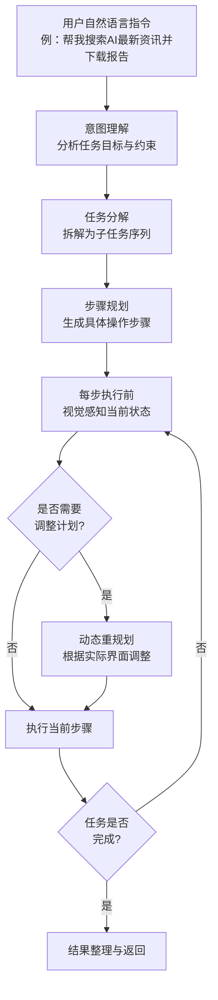
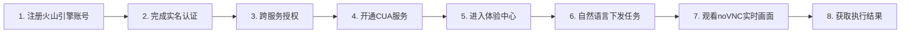
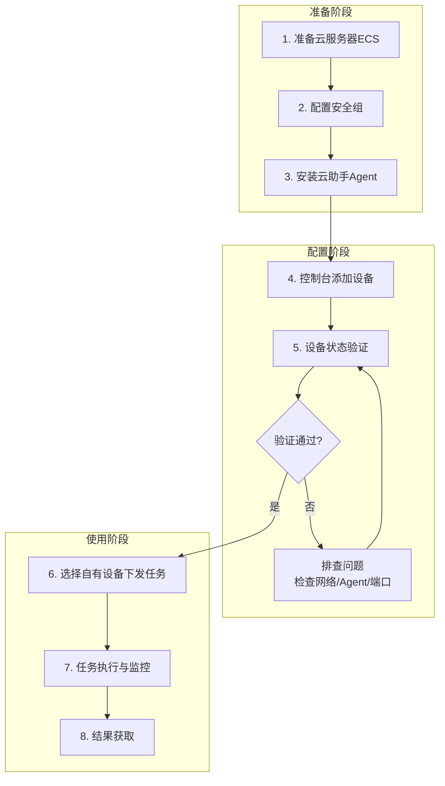
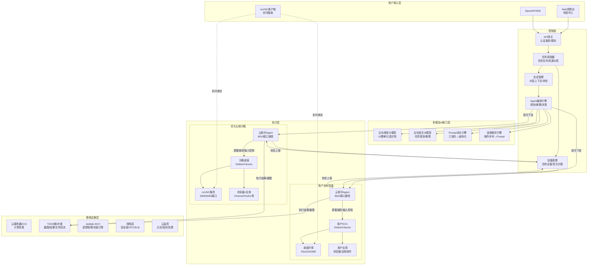
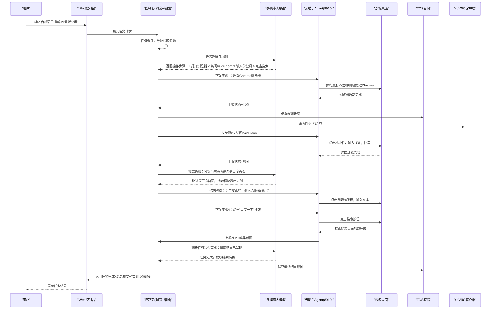
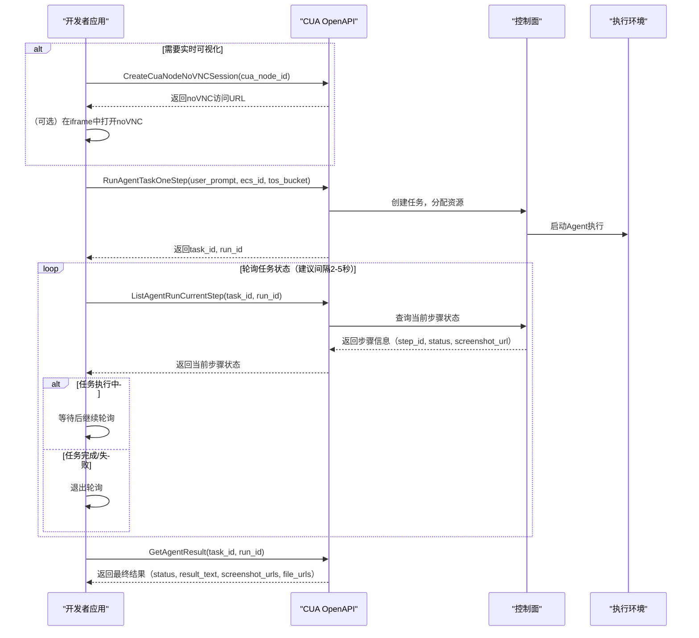

# 火山引擎Computer Use Agent (CUA)深度分析

> **产品介绍页**: https://www.volcengine.com/docs/6394/2556112?lang=zh
> **使用指南**: https://www.volcengine.com/docs/6394/2548051?lang=zh
> **产品定位**: 企业级云端桌面AI智能体——运行在云端沙箱桌面、基于多模态大模型，专为交付「浏览器+桌面OS」任务而设计，提供「对话即办事」全新体验
> **核心标签**: 视觉理解屏幕 → 自主规划步骤 → 稳定执行鼠标键盘动作 → 端到端任务闭环

---

## 📋 目录导航

- [一、产品概述与定位](#一产品概述与定位)
- [二、四大核心能力深度解析](#二四大核心能力深度解析)
- [三、使用流程与配置指南](#三使用流程与配置指南)
- [四、功能特性全面分析](#四功能特性全面分析)
- [五、技术架构与实现原理](#五技术架构与实现原理)
- [六、应用场景与最佳实践](#六应用场景与最佳实践)
- [七、技术优势与潜在挑战评估](#七技术优势与潜在挑战评估)
- [八、API接入开发指南](#八api接入开发指南)
- [九、行业启示与趋势分析](#九行业启示与趋势分析)
- [十、专业术语表](#十专业术语表)
- [十一、开放问题](#十一开放问题)

---

## 一、产品概述与定位

### 1.1 产品定位："运行在云端沙箱桌面的企业级AI智能体"

Computer Use Agent（CUA）定位为**企业级云端桌面AI智能体**，其核心内涵包含四个维度：

| 维度 | 内涵说明 |
|------|----------|
| **云端沙箱桌面** | 任务全程运行在云端隔离的沙箱桌面环境中，与用户本机完全隔离，安全可控 |
| **多模态大模型驱动** | 基于视觉理解能力，通过"看屏幕"理解UI，而非依赖DOM解析或元素选择器 |
| **浏览器+桌面OS双覆盖** | 不仅支持网页自动化，还覆盖桌面应用程序操作，实现全场景桌面任务 |
| **对话即办事** | 用户通过自然语言对话下发任务，Agent自动完成端到端执行，无需编程或脚本 |

官方核心表述："它通过视觉理解屏幕、自主规划步骤、稳定执行鼠标键盘动作，在真实桌面环境中代替用户完成端到端任务，让您获得「对话即办事」的全新体验。"

### 1.2 核心价值支柱

| 价值支柱 | 核心内涵 | 支撑能力 |
|---------|---------|---------|
| **👁️ 视觉感知** | 实时捕获桌面画面，理解UI元素位置与状态 | 多模态大模型视觉理解、屏幕实时捕获、无DOM依赖 |
| **🧠 自主规划** | 将自然语言指令自动拆解为可执行步骤序列 | 任务分解、多步骤流程规划、异常处理策略 |
| **🖱️ 桌面执行** | 精准控制鼠标点击、键盘输入、窗口切换等操作 | 鼠标/键盘模拟、浏览器操作、桌面应用控制 |
| **✅ 任务闭环** | 自动判断完成状态，返回结果与过程截图 | 完成状态判断、结果回流、异常重试、过程记录 |

### 1.3 与传统RPA的本质区别

CUA代表了从"基于规则的自动化"向"基于视觉理解的通用智能体"的范式跃迁：

| 对比维度 | 传统RPA | Computer Use Agent |
|---------|---------|-------------------|
| **交互方式** | 脚本录制/元素选择器/DOM解析 | 自然语言对话 + 视觉理解 |
| **适配成本** | 高——每个网站/应用需单独适配 | 低——视觉理解通用，无需逐个适配 |
| **维护成本** | 高——UI变化即失效 | 低——视觉感知适应界面变化 |
| **覆盖范围** | 有限——仅适配预定义场景 | 广泛——浏览器+桌面应用全覆盖 |
| **技术门槛** | 需要编程/脚本能力 | 自然语言即可，零代码门槛 |
| **环境依赖** | 依赖特定DOM结构/Accessibility API | 纯视觉，与底层技术栈无关 |
| **异常处理** | 预设规则，遇异常即中断 | 自主判断，支持重试与人工介入 |

> 🔍 **核心洞察**：传统RPA的本质是"让机器按照人写的脚本执行固定流程"，而CUA的本质是"让机器像人一样看屏幕、思考、操作"——这是从"自动化"到"智能化"的质变。传统RPA是"工具"，CUA是"代理（Agent）"。

### 1.4 与Mobile Use Agent的产品矩阵关系

CUA与[Mobile Use Agent](../volcengine-mobile-use-agent-analysis.md)共同构成火山引擎"端到端GUI Agent"产品矩阵：

| 产品 | 运行环境 | 目标场景 | 底层基础设施 |
|-----|---------|---------|------------|
| **Computer Use Agent** | 云端沙箱桌面（x86 Linux/Windows桌面） | PC端浏览器+桌面应用自动化 | 云服务器ECS + 桌面沙箱 |
| **Mobile Use Agent** | 火山引擎云手机（ARM Android） | 移动端APP自动化 | ACEP云手机PaaS |

二者共享底层技术理念（多模态视觉理解 + 云端隔离环境 + 自然语言交互），但分别覆盖PC桌面和移动端两大场景，形成完整的GUI自动化产品布局。

---

## 二、四大核心能力深度解析

### 2.1 视觉感知能力：AI的"眼睛"

**官方定义**：实时捕获桌面画面，理解UI元素位置与状态，无需依赖页面DOM或辅助接口。

#### 2.1.1 视觉感知技术原理

```
┌─────────────────────────────────────────────────────────────────┐
│                    视觉感知工作流程                              │
├─────────────────────────────────────────────────────────────────┤
│  1. 屏幕捕获：实时截取桌面画面（推测帧率：1-5fps，平衡精度与成本）  │
│           ↓                                                     │
│  2. 图像预处理：分辨率适配、区域裁剪、可能的OCR文字提取            │
│           ↓                                                     │
│  3. 多模态理解：豆包视觉大模型分析截图，识别：                    │
│     - UI元素类型（按钮、输入框、链接、菜单等）                    │
│     - 元素位置与边界框（Bounding Box）                           │
│     - 元素状态（可点击/禁用/选中/高亮等）                        │
│     - 文字内容（OCR + 视觉理解结合）                             │
│     - 页面整体结构与布局                                         │
│           ↓                                                     │
│  4. 坐标映射：将视觉坐标转换为实际屏幕坐标                       │
│           ↓                                                     │
│  5. 结果输出：结构化的UI元素描述供规划模块使用                    │
└─────────────────────────────────────────────────────────────────┘
```

#### 2.1.2 无DOM依赖的技术突破

这是CUA最核心的技术优势之一：

| 技术方案 | 工作原理 | 局限性 |
|---------|---------|--------|
| **DOM解析**（传统方案） | 读取网页DOM树，通过CSS选择器/XPath定位元素 | 仅支持网页、动态渲染页面DOM不稳定、Shadow DOM难处理、桌面应用完全不支持 |
| **Accessibility API** | 依赖操作系统/应用的辅助功能接口获取元素信息 | 需要应用支持、实现不统一、桌面应用覆盖率低 |
| **图像模板匹配** | 预存UI元素图片做模板匹配 | 分辨率/主题变化即失效、泛化能力极差 |
| **纯视觉理解**（CUA方案） | 多模态大模型直接"看"截图理解UI | 计算成本较高、受遮挡/动画影响、极端复杂界面可能误判 |

> 💡 **技术洞察**：无DOM依赖意味着CUA可以操作**任何**可视化界面——无论是老旧的桌面软件、Canvas/WebGL渲染的网页、远程桌面、甚至是虚拟机里运行的应用，只要人能通过屏幕看到并操作，CUA理论上就能操作。这是真正的"通用"桌面自动化基础。

#### 2.1.3 视觉感知能力边界

| 能力维度 | 支持情况 | 备注 |
|---------|---------|------|
| **网页界面** | ✅ 完整支持 | 静态/动态网页、单页应用均支持 |
| **桌面应用** | ✅ 支持 | Linux桌面应用为主（Debian/Ubuntu） |
| **高DPI屏幕** | ⚠️ 推测支持 | 需适配分辨率缩放 |
| **动画/过渡效果** | ⚠️ 有限支持 | 等待动画结束后操作，可能需适当延迟 |
| **极小/密集UI元素** | ⚠️ 存在挑战 | 元素过小或过于密集时可能误点击 |
| **自定义绘制界面** | ✅ 优势场景 | Canvas/WebGL/游戏界面恰恰是视觉方案的优势 |
| **验证码/人机验证** | ⚠️ 需人工介入 | 设计上支持人机协作模式 |

### 2.2 自主规划能力：AI的"大脑"

**官方定义**：将自然语言指令自动拆解为可执行的操作步骤序列，支持多步骤复杂流程。

#### 2.2.1 任务规划流程



#### 2.2.2 规划模块核心能力

| 能力项 | 说明 | 技术实现（推测） |
|-------|------|----------------|
| **意图理解** | 理解用户自然语言指令的真实目标 | 大语言模型语义理解 + 上下文管理 |
| **任务分解** | 将复杂任务拆解为有序子任务 | Chain-of-Thought (CoT) 推理 + 任务分解Prompt |
| **步骤生成** | 为每个子任务生成具体操作（点击/输入/等待等） | 多模态推理结合视觉感知结果 |
| **动态重规划** | 执行中遇到意外时调整计划 | ReAct模式（Reasoning + Acting）+ 异常检测 |
| **进度跟踪** | 跟踪任务完成进度，判断当前阶段 | 状态机 + 视觉对比（初始/中间/目标状态） |
| **完成判断** | 自动判断任务是否已完成 | 目标状态视觉匹配 + 结果验证 |

#### 2.2.3 长流程任务处理策略

对于多步骤复杂任务，CUA需要解决"累积误差"和"流程中断恢复"问题：

| 问题 | 应对策略（推测） |
|-----|----------------|
| **步骤累积误差** | 每步执行前重新视觉感知，不依赖内部状态假设 |
| **意外弹窗/广告** | 视觉检测弹窗，自动关闭或处理后继续 |
| **页面加载等待** | 检测页面加载状态（视觉变化停止/进度条消失） |
| **错误重试** | 操作失败后自动重试若干次，次数可配置 |
| **人工接管** | 遇到无法处理的情况（如验证码）暂停并请求人工介入 |
| **会话状态保持** | 支持长会话，保留上下文和登录状态 |

### 2.3 桌面执行能力：AI的"手"

**官方定义**：精准控制鼠标点击、键盘输入、窗口切换等操作，覆盖浏览器和桌面应用程序。

#### 2.3.1 执行操作类型

| 操作类别 | 具体操作 | 说明 |
|---------|---------|------|
| **🖱️ 鼠标操作** | 左键单击 | 点击按钮、链接、菜单等 |
| | 左键双击 | 打开文件/文件夹、双击选中 |
| | 右键单击 | 打开右键菜单 |
| | 鼠标拖拽 | 拖动滑块、选中文字、拖拽文件 |
| | 鼠标悬停 | 触发hover效果、显示tooltip |
| | 滚轮滚动 | 页面上下/左右滚动 |
| **⌨️ 键盘操作** | 文本输入 | 在输入框中输入文字（支持中英文） |
| | 快捷键 | Ctrl+C/V、Alt+Tab、Enter、Esc等组合键 |
| | 功能键 | F5刷新、F12开发者工具等 |
| | 特殊按键 | Tab切换焦点、方向键导航等 |
| **🪟 窗口管理** | 窗口切换 | Alt+Tab切换应用窗口 |
| | 窗口最大化/最小化/关闭 | 窗口控制 |
| | 新窗口/标签页 | 打开新浏览器窗口或标签 |
| **🌐 浏览器操作** | URL导航 | 直接访问指定网址 |
| | 前进/后退/刷新 | 浏览器导航控制 |
| | 标签页管理 | 新建/切换/关闭标签页 |

#### 2.3.2 精准度保障机制

视觉驱动的操作面临"坐标准确性"挑战，推测有多层保障机制：

| 保障机制 | 说明 |
|---------|------|
| **元素中心定位** | 点击UI元素的中心点而非边缘，降低误触概率 |
| **点击前二次确认** | 点击前再次截图确认目标元素位置未变 |
| **操作后验证** | 点击后截图验证界面变化是否符合预期 |
| **坐标校准** | 根据窗口大小、分辨率自动校准坐标映射 |
| **防抖动** | 避免操作过快导致界面来不及响应 |
| **失败重试** | 点击无响应时自动重试或调整位置 |

### 2.4 任务闭环能力：从开始到结束的完整交付

**官方定义**：自动判断任务完成状态，返回执行结果与过程截图，支持异常重试。

#### 2.4.1 闭环流程四要素

```
┌─────────────────────────────────────────────────────────────────┐
│                      任务闭环四要素                              │
├─────────────────────────────────────────────────────────────────┤
│  🎯 完成状态判断：                                               │
│     - 对比当前界面与目标状态                                     │
│     - 验证关键结果是否出现（如下载完成提示、数据呈现等）          │
│     - 识别错误提示并判断任务失败                                 │
├─────────────────────────────────────────────────────────────────┤
│  📊 执行结果返回：                                               │
│     - 任务成功/失败状态                                          │
│     - 结果文本摘要                                               │
│     - 关键数据提取（如搜索结果、表单提交回执）                   │
│     - 最终状态截图                                               │
├─────────────────────────────────────────────────────────────────┤
│  📸 过程记录留存：                                               │
│     - 关键步骤截图（可配置）                                     │
│     - 操作日志（点击了什么、输入了什么）                         │
│     - 结果截图TOS回流存储                                        │
│     - noVNC实时可视化会话                                        │
├─────────────────────────────────────────────────────────────────┤
│  🔄 异常重试机制：                                               │
│     - 操作失败自动重试（如点击无响应）                           │
│     - 加载超时重试                                               │
│     - 可配置最大重试次数                                         │
│     - 重试失败后请求人工介入                                     │
└─────────────────────────────────────────────────────────────────┘
```

#### 2.4.2 结果回流机制（TOS存储）

执行过程中产生的截图、录屏、结果文件通过TOS（Tinder Object Storage，火山引擎对象存储）回流：

| 回流内容 | 存储方式 | 用途 |
|---------|---------|------|
| **过程截图** | TOS对象存储 | 任务审计、问题排查、过程复盘 |
| **最终结果截图** | TOS对象存储 | 任务完成凭证、结果验证 |
| **下载的文件** | TOS对象存储 | 用户可下载Agent获取的文件 |
| **执行日志** | 结构化日志 | 调试、优化、计费依据 |

---

## 三、使用流程与配置指南

CUA提供三种使用方式，覆盖从快速体验到生产集成的不同需求阶段。

### 3.1 使用方式总览

| 使用方式 | 适用场景 | 门槛 | 环境 |
|---------|---------|------|------|
| **🚀 快速体验（体验中心）** | 产品试用、功能验证、Prompt调试 | 低——注册实名认证即可 | 火山引擎提供的官方沙箱环境 |
| **🖥️ 自有设备接入** | 企业私有化部署、定制环境、内网访问 | 中——需准备云服务器 | 用户自有ECS云服务器 |
| **🔌 API接入** | 生产环境集成、批量任务、二次开发 | 高——需开发对接 | 自有设备或官方沙箱 |

### 3.2 快速体验流程



| 步骤 | 操作说明 | 注意事项 |
|-----|---------|---------|
| **1. 账号注册** | 访问火山引擎官网注册账号 | 需手机号验证 |
| **2. 实名认证** | 完成个人或企业实名认证 | 云服务标准流程，体验免费但需认证 |
| **3. 跨服务授权** | 授权CUA访问相关云服务（TOS等） | 服务首次使用时弹出授权页面 |
| **4. 开通服务** | 在云手机产品下开通Computer Use Agent | 注意查看免费额度和计费说明 |
| **5. 体验中心** | 进入Web端体验界面 | 官方提供预置沙箱环境 |
| **6. 下发任务** | 在对话框输入自然语言指令 | 可参考示例Prompt编写 |
| **7. 实时观察** | 通过noVNC窗口实时观看Agent操作 | 可随时暂停或人工接管 |
| **8. 获取结果** | 查看执行结果和过程截图 | 结果截图可下载 |

### 3.3 自有设备接入流程

自有设备接入允许用户将自己的ECS云服务器作为CUA的执行环境，适合需要定制环境或访问内网资源的场景。



#### 3.3.1 云服务器推荐配置

| 配置项 | 推荐规格 | 说明 |
|-------|---------|------|
| **操作系统** | Debian 11/12+ 或 Ubuntu 24.04+ | 官方支持的Linux发行版，桌面环境 |
| **CPU** | 2核及以上 | 桌面环境+浏览器运行需要足够CPU |
| **内存** | 4GB及以上 | 推荐8GB，运行浏览器+多标签更流畅 |
| **磁盘** | 40GB及以上系统盘 | 桌面环境+浏览器+应用占用空间 |
| **网络** | 公网IP（如需访问外网） | 带宽建议5Mbps以上 |
| **图形环境** | 预装桌面环境（Xfce/GNOME等） | 云助手Agent需要桌面环境运行 |

#### 3.3.2 安全组端口配置

安全组是设备接入的关键配置，必须正确放行以下端口：

| 端口 | 协议 | 方向 | 用途 | 配置建议 |
|-----|------|------|------|---------|
| **8910** | TCP | 入方向 | CUA云助手Agent与云端通信端口 | 必须放行，建议仅允许火山引擎服务IP段访问 |
| **22** | TCP | 入方向 | SSH远程管理 | 可选，用于登录服务器调试 |
| **443** | TCP | 出方向 | HTTPS访问外网 | 如需访问网页需放行 |
| **80** | TCP | 出方向 | HTTP访问外网 | 可选，部分网站仍使用HTTP |
| **5900+** | TCP | 入方向 | VNC服务（如使用自建VNC） | 如使用noVNC则无需单独配置 |

> ⚠️ **重要提示**：8910端口是云助手Agent与CUA控制面通信的关键端口，安全组未正确放行将导致设备无法上线。建议配置安全组时严格按照官方文档给出的IP白名单范围配置，不要开放给所有IP（0.0.0.0/0）以确保安全。

#### 3.3.3 云助手Agent安装

云助手Agent是运行在用户ECS上的守护进程，负责：
- 接收云端下发的任务指令
- 控制鼠标键盘操作
- 捕获屏幕画面
- 与云端控制面通信（8910端口）
- 上报执行状态和日志

安装流程（推测）：
1. 在ECS上下载云助手Agent安装包
2. 执行安装脚本
3. 配置设备认证信息（AK/SK或设备Token）
4. 启动Agent服务并设置开机自启
5. 在控制台验证设备在线状态

### 3.4 API接入流程

API接入适合开发者将CUA能力集成到自有应用中，实现批量任务处理和深度定制。（详见第八章API接入开发指南）

---

## 四、功能特性全面分析

### 4.1 功能模块总览

```
┌─────────────────────────────────────────────────────────────────┐
│                    CUA功能特性体系                               │
├─────────────────────────────────────────────────────────────────┤
│  📱 基础功能                                                    │
│  ├── 发起任务：对话式任务下发、Prompt模板                        │
│  ├── 管理对话：创建/切换/删除历史对话                            │
│  └── 管理沙箱：查看系统信息、切换/删除沙箱环境                   │
├─────────────────────────────────────────────────────────────────┤
│  🚀 高级功能                                                    │
│  ├── 任务提示词优化：口语化→结构化提示词                         │
│  ├── 录制生成提示词：人工操作→自动生成Prompt                     │
│  ├── Agent会话设置：单会话参数调整                               │
│  └── 系统提示词设置：全局系统提示词定制                          │
├─────────────────────────────────────────────────────────────────┤
│  ⚙️ 通用设置                                                    │
│  ├── 密钥管理：Jeddak AICC凭据托管、自动登录                    │
│  └── 知识库管理：文件上传、RAG检索增强                           │
└─────────────────────────────────────────────────────────────────┘
```

### 4.2 基础功能

#### 4.2.1 发起任务

用户通过对话界面输入自然语言指令即可发起任务。

**Prompt编写要点**：

| 要素 | 说明 | 示例 |
|-----|------|------|
| **明确目标** | 清晰说明要做什么 | "帮我搜索2026年AI Agent行业报告" |
| **指定步骤** | 必要时给出关键步骤 | "打开百度，搜索'火山引擎CUA'，打开第一个搜索结果" |
| **结果要求** | 说明期望的结果形式 | "将搜索结果整理成摘要，保存为txt文件" |
| **约束条件** | 给出限制或注意事项 | "只搜索最近3个月的资讯，不要点击广告链接" |

**示例Prompt（AI画图下载场景，文档示例）**：
```
访问AI画图网站，输入提示词"一只可爱的猫咪在星空下"，生成图片后下载到本地。
```

#### 4.2.2 管理对话

| 功能 | 说明 | 使用场景 |
|-----|------|---------|
| **创建新对话** | 开启全新任务上下文 | 新任务不想受历史对话影响 |
| **切换对话** | 在多个历史对话间切换 | 回到之前未完成的任务继续执行 |
| **删除对话** | 删除不需要的对话历史 | 清理敏感任务记录 |
| **对话命名** | （推测）自动或手动命名对话 | 便于识别和管理多个任务 |

#### 4.2.3 管理沙箱

沙箱是CUA任务执行的桌面环境，用户可以管理多个沙箱实例：

| 功能 | 说明 |
|-----|------|
| **查看系统信息** | 查看当前沙箱的OS版本、浏览器版本、已安装软件等 |
| **切换沙箱** | 在多个沙箱环境间切换（如干净环境 vs 已登录环境） |
| **新建沙箱** | 创建全新的干净沙箱环境 |
| **删除沙箱** | 删除不需要的沙箱释放资源 |
| **重置沙箱** | 将沙箱恢复到初始干净状态 |
| **休眠/唤醒** | （推测）保留沙箱状态同时暂停计费 |

### 4.3 高级功能

#### 4.3.1 任务提示词优化

这是降低Prompt使用门槛的重要功能：

| 维度 | 说明 |
|-----|------|
| **功能** | 将用户口语化、模糊的指令自动优化为结构化、更适合Agent理解的提示词 |
| **输入** | 用户原始自然语言（如"帮我弄一下那个AI的报告"） |
| **输出** | 结构化、可执行的优化后Prompt（如"访问xxx网站，搜索关键词xxx，筛选条件xxx，下载xxx格式的报告"） |
| **价值** | 降低用户使用门槛，不需要学习Prompt工程，普通用户也能获得较好的执行效果 |

**提示词优化示例**：

| 用户原话（口语化） | 优化后提示词（结构化） |
|------------------|---------------------|
| "帮我搜点AI相关的新闻" | "打开搜索引擎，搜索关键词'2026年AI行业最新动态'，筛选最近7天的资讯，打开前3条结果并提取核心要点摘要" |
| "去那个画图网站画只猫" | "访问AI画图平台（如xxx.com），在提示词输入框中输入'一只可爱的橘猫坐在窗台上，阳光照射，水彩风格'，选择1024x1024分辨率，点击生成按钮，等待生成完成后下载图片" |

#### 4.3.2 录制生成提示词（Video-to-Prompt）

这是CUA最具创新性的功能之一：

| 维度 | 详细说明 |
|-----|---------|
| **功能** | 用户手动在沙箱中操作一遍（录制操作过程），系统自动生成对应的Agent提示词 |
| **工作流程** | 1. 开启录制模式 → 2. 用户手动完成任务操作 → 3. 停止录制 → 4. 系统分析操作序列 → 5. 自动生成可复用的自然语言提示词 |
| **核心价值** | ① 零代码生成自动化流程：不会写Prompt的用户可以通过"演示一遍"教会Agent；② 知识沉淀：专家操作经验可转化为可复用的Prompt；③ 降低适配成本：对于复杂定制流程，用录制方式比手写Prompt更高效准确 |
| **技术原理（推测）** | 录制用户操作序列（鼠标点击坐标、键盘输入内容、窗口变化）→ 结合屏幕截图视觉理解 → 抽象出操作意图 → 生成对应的自然语言描述 |

> 💡 **产品洞察**："录制生成提示词"功能借鉴了传统RPA的"录制回放"思路，但与传统RPA录制不同的是：传统RPA录制生成的是固定坐标/选择器的脚本，而CUA录制生成的是**自然语言提示词**——这意味着生成的不是死板的脚本，而是Agent可以理解和灵活执行的"任务描述"，Agent下次执行时仍然可以通过视觉理解适应界面变化，不会因为UI变动而失效。这是"录制自动化"与"AI智能"的巧妙结合。

#### 4.3.3 Agent会话设置

针对单次会话进行参数调优：

| 设置项（推测） | 说明 |
|--------------|------|
| **执行速度** | 调整操作间隔时间（快速/正常/慢速） |
| **重试次数** | 单步操作失败最大重试次数 |
| **截图频率** | 过程截图记录频率 |
| **人工确认** | 是否每步执行前需要人工确认 |
| **超时时间** | 单步操作/整体任务超时时间 |

#### 4.3.4 系统提示词设置

全局系统提示词定制能力：

| 维度 | 说明 |
|-----|------|
| **功能** | 为所有会话设置全局系统提示词（System Prompt） |
| **作用** | 定义Agent的行为规范、角色设定、全局约束、输出格式要求等 |
| **示例** | "你是一个专业的数据采集助手，操作要谨慎，遇到弹窗先关闭，不要点击广告链接，所有下载的文件保存到桌面..." |
| **价值** | 企业可定制符合自身需求的Agent行为规范，统一执行标准 |

### 4.4 通用设置

#### 4.4.1 密钥管理（基于Jeddak AICC）

Jeddak AICC是火山引擎的AI机密计算（AI Confidential Computing）解决方案，在CUA中用于凭据安全托管：

| 功能 | 说明 | 安全价值 |
|-----|------|---------|
| **凭据托管** | 安全存储网站登录账号密码、API密钥等敏感信息 | 凭据加密存储，不直接暴露在Prompt或日志中 |
| **自动填充** | Agent访问需要登录的网站时自动使用托管的凭据 | 用户无需在对话中提供密码，避免泄露 |
| **自动登录** | 自动完成登录流程（输入用户名密码、处理登录按钮） | 支持需要登录才能访问的场景 |
| **权限控制** | （推测）按任务/沙箱控制凭据使用范围 | 最小权限原则，防止凭据滥用 |
| **审计日志** | （推测）记录凭据使用情况供审计 | 安全合规要求 |

**典型使用场景**：
1. 用户在密钥管理中安全录入某网站的账号密码
2. 下发任务"登录xxx后台，导出昨日数据报表"
3. Agent访问该网站时自动使用托管凭据完成登录
4. 全程无需在对话中输入密码，凭据通过安全通道传递

#### 4.4.2 知识库管理

RAG（检索增强生成）能力在CUA中的应用：

| 功能 | 说明 |
|-----|------|
| **文件上传** | 上传文档（PDF/Word/Excel/TXT等格式）到知识库 |
| **知识库构建** | 自动解析文档、分块、向量化，构建可检索知识库 |
| **对话引用** | Agent执行任务时按需检索知识库内容作为参考 |
| **场景适配** | 例如：上传内部系统操作手册，Agent可以参考手册正确操作复杂系统 |

知识库使用场景示例：
- 上传企业内部OA系统操作指南 → Agent按指南操作不熟悉的内部系统
- 上传业务规则文档 → Agent在表单填写时遵循业务规则
- 上传产品规格表 → Agent根据产品信息准确录入数据

### 4.5 人机协作模式

CUA并非追求"100%无人值守"，而是设计了合理的人机协作机制：

| 协作场景 | 处理方式 | 设计理念 |
|---------|---------|---------|
| **验证码/人机验证** | 暂停任务，通知用户手动完成验证后继续 | AI不擅长也不应该尝试绕过验证码 |
| **密码/敏感信息输入** | 通过密钥管理安全注入或请求用户手动输入 | 敏感信息不在对话中明文传递 |
| **关键决策点** | （推测）遇到需要判断的分支时询问用户 | 重要决策由人做，避免AI误判造成损失 |
| **异常无法处理** | 暂停任务，展示当前状态，等待用户指示 | 避免Agent在错误道路上越走越远 |
| **人工随时接管** | 用户可随时暂停Agent，手动操作后继续 | 人始终保留最终控制权 |

> 🔍 **设计洞察**：优秀的Agent产品不是追求"完全替代人"，而是"让人做决策和处理异常，让机器做重复执行"。CUA的人机协作设计体现了这一务实理念——验证码、密码、关键决策交给人，重复点击、输入、浏览交给机器，这才是当前技术阶段最合理的落地模式。

---

## 五、技术架构与实现原理

### 5.1 整体技术架构



### 5.2 核心技术模块解析

#### 5.2.1 云端沙箱桌面

官方沙箱是CUA提供的开箱即用桌面环境：

| 技术维度 | 实现方案（推测） | 说明 |
|---------|----------------|------|
| **虚拟化技术** | 基于ECS云服务器 + 容器/MicroVM级隔离 | 每个任务/沙箱运行在独立环境 |
| **操作系统** | Debian 11/12 或 Ubuntu 24.04 桌面版 | Linux桌面环境，稳定性好、成本低 |
| **桌面环境** | Xfce（轻量级）或GNOME | 轻量级桌面环境降低资源消耗 |
| **浏览器** | 预装Chrome/Chromium和Firefox | 主流浏览器保证网页兼容性 |
| **快照/重置** | 支持沙箱快照和快速重置 | 任务结束后一键恢复干净状态 |
| **隔离强度** | 实例级网络/存储/计算隔离 | 不同用户沙箱完全隔离 |

#### 5.2.2 多模态感知模块

视觉感知是CUA的"眼睛"，核心是豆包多模态大模型：

```
┌─────────────────────────────────────────────────────────────────┐
│                多模态感知模块工作流                              │
├─────────────────────────────────────────────────────────────────┤
│  屏幕帧捕获 → 图像预处理 → 视觉大模型推理 → 结构化UI描述输出     │
│                                                               │
│  输入：桌面截图（PNG/JPEG）                                     │
│  输出：                                                         │
│  {                                                             │
│    "elements": [                                               │
│      {                                                         │
│        "type": "button",                                       │
│        "text": "搜索",                                         │
│        "bbox": [x1, y1, x2, y2],                              │
│        "center": [cx, cy],                                    │
│        "state": "clickable"                                    │
│      },                                                        │
│      ...                                                       │
│    ],                                                          │
│    "page_type": "search_engine",                               │
│    "overall_description": "当前是百度搜索首页..."               │
│  }                                                             │
└─────────────────────────────────────────────────────────────────┘
```

#### 5.2.3 noVNC实时可视化机制

noVNC是CUA提供实时桌面画面的关键技术：

| 技术项 | 说明 |
|-------|------|
| **noVNC是什么** | 基于HTML5 Canvas的VNC客户端，纯JavaScript实现，可在浏览器中访问远程桌面 |
| **工作原理** | VNC服务端（5900端口）→ WebSocket代理（6080端口）→ 浏览器noVNC客户端（Canvas渲染） |
| **在CUA中的作用** | ① 用户实时观看Agent操作过程；② 人工介入时可直接操作桌面；③ 过程可视化提升用户信任 |
| **延迟体验** | 推测端到端延迟在数百毫秒级别，满足实时观察需求 |
| **交互能力** | 不仅是观看，用户可直接在noVNC窗口中点击/输入进行人工接管 |

> 💡 **体验设计洞察**：实时可视化noVNC画面是Computer Use类产品的关键体验要素。用户对"AI在操作电脑"天然有不信任感和好奇心，能实时看到Agent移动鼠标、点击按钮、输入文字，会极大提升用户的信任感和掌控感，也便于在Agent出错时及时干预。

#### 5.2.4 TOS结果回流机制

| 回流内容 | 触发时机 | TOS路径（推测） |
|---------|---------|----------------|
| **每步截图** | 每个操作步骤完成后 | `cua/{task_id}/steps/{step_id}/screenshot.png` |
| **最终截图** | 任务完成时 | `cua/{task_id}/result/final.png` |
| **下载文件** | Agent下载文件后 | `cua/{task_id}/files/{filename}` |
| **执行日志** | 任务过程中实时 | `cua/{task_id}/logs/execution.log` |

TOS回流的价值：
1. **结果持久化**：任务结束后沙箱可能被回收，截图和文件保存到TOS供后续查看下载
2. **审计追溯**：完整记录任务执行过程，便于问题排查和责任认定
3. **用户获取**：用户通过TOS签名URL下载Agent获取的文件和截图
4. **数据飞轮**：（推测）执行过程数据可用于模型优化迭代

#### 5.2.5 云助手Agent与8910端口通信

运行在沙箱/自有设备上的云助手Agent是连接控制面和执行环境的桥梁：

```mermaid
flowchart LR
    subgraph CONTROL_PLANE ["控制面"]
        CP["CUA控制面服务"]
    end
    subgraph EXECUTION_ENV ["沙箱/ECS"]
        Agent["云助手Agent<br/>监听8910端口"]
        Input["输入模拟模块<br/>鼠标/键盘控制"]
        Capture["屏幕捕获模块<br/>截屏/OCR"]
        VNC["noVNC服务<br/>6080端口"]
        Desktop["桌面环境"]
    end
    CP <-->|"双向通信<br/>WebSocket/HTTPS"| Agent
    Agent --> Input --> Desktop
    Agent <-- Capture <-- Desktop
    Desktop --> VNC
```

| 通信方向 | 数据内容 | 协议（推测） |
|---------|---------|------------|
| **控制面 → Agent** | 操作指令（点击坐标、输入文本、快捷键等） | WebSocket长连接或HTTPS轮询 |
| **Agent → 控制面** | 屏幕截图、执行状态、操作结果、日志 | 分片上传或流式传输 |
| **通信端口** | 8910（TCP） | Agent监听此端口接收指令 |

**为什么是8910端口？**
- 选择非标准端口避免与常见服务冲突
- 火山引擎云助手生态统一端口规范
- 便于安全组规则配置和网络隔离

### 5.3 任务执行完整流程

以"访问百度搜索AI资讯"为例，展示完整执行链路：



---

## 六、应用场景与最佳实践

### 6.1 典型应用场景

| 场景类别 | 具体场景 | 示例任务 | 核心价值 |
|---------|---------|---------|---------|
| **🌐 网页信息搜集** | 数据采集、资讯汇总、竞品监控 | "访问科技媒体网站，收集最近一周AI行业新闻并整理成简报" | 替代人工重复浏览，24小时不间断采集 |
| **📝 表单填写与数据录入** | 系统录入、批量申报、数据迁移 | "登录OA系统，将Excel中的员工信息逐个录入员工管理模块" | 解决跨系统数据孤岛，无需API对接 |
| **🎨 内容生成与下载** | AI画图、文档生成、素材下载 | "访问Midjourney/豆包画图，输入提示词生成海报并下载" | AI生成+自动获取完整闭环 |
| **🖥️ 软件操作自动化** | 遗留系统自动化、批量处理 | "打开Photoshop，将文件夹中所有图片批量压缩为WebP格式" | 自动化老旧软件操作，无需二次开发 |
| **🧪 Web自动化测试** | 回归测试、兼容性测试 | "在Chrome中打开网站，依次测试登录、注册、搜索、下单流程，截图记录每步" | 自然语言编写测试用例，降低自动化测试门槛 |
| **🔍 搜索引擎优化（SEO）** | 排名监控、关键词追踪 | "每天搜索指定关键词，记录我司网站排名位置并汇总成表" | 自动化SEO日常监控工作 |
| **📊 数据采集与报表** | 后台数据导出、报表汇总 | "登录各广告平台后台，导出昨日投放数据，汇总成Excel报表" | 跨平台数据自动汇总，替代人工每日搬运 |
| **🛒 电商运营辅助** | 商品上架、价格监控、订单处理 | "在电商后台批量上架商品，标题和描述按模板填写" | 电商运营重复工作自动化 |

### 6.2 适合vs不适合CUA的任务

#### ✅ 特别适合CUA的任务

| 特征 | 说明 | 示例 |
|-----|------|------|
| **规则明确、重复度高** | 每次执行流程类似，只是数据不同 | 每日数据导出、批量表单填写 |
| **基于网页/可视化界面** | 没有开放API，只能通过界面操作 | 老旧系统、第三方SaaS平台 |
| **跨系统跨平台** | 需要在多个系统间切换操作 | 多平台数据汇总、跨系统流程 |
| **需要人工判断但规则简单** | 操作中需要简单识别和判断 | 筛选符合条件的信息、识别按钮位置 |
| **耗时但不重要** | 机械性工作占用人力但无高价值创造 | 信息搜集、文件下载、数据录入 |

#### ❌ 不适合CUA的任务

| 特征 | 说明 | 原因 |
|-----|------|------|
| **极高精度要求** | 像素级精确操作（如图像精细编辑） | 视觉操作存在误差 |
| **毫秒级响应要求** | 高频交易、实时游戏等 | 云端操作+视觉推理有延迟 |
| **创造性工作** | 需要创意、审美、复杂决策的任务 | Agent擅长执行而非创造 |
| **强逻辑计算** | 复杂数学推导、代码编写调试 | 纯文本/代码任务用代码解释器更高效 |
| **涉及极高安全等级** | 网银转账、核心系统配置 | 安全敏感操作建议人工执行 |
| **完全无规律的任务** | 每次流程完全不同且无规律 | 无法形成可复用的执行模式 |

### 6.3 Prompt编写最佳实践

| 建议 | 说明 | 示例 |
|-----|------|------|
| **🎯 目标明确具体** | 清晰说明最终要达成什么结果，而非仅说做什么动作 | ❌ "百度一下" → ✅ "打开百度搜索'火山引擎CUA'，打开官方文档页面" |
| **📋 步骤清晰（可选）** | 复杂任务可列出关键步骤指引Agent | "第一步访问xxx，第二步登录，第三步导出..." |
| **🚫 指定规避事项** | 明确说明不要做什么 | "不要点击广告链接，不要理会弹窗促销信息" |
| **✅ 定义完成标志** | 说明什么情况算任务完成 | "直到看到'提交成功'提示后停止" |
| **🔍 指定结果形式** | 说明期望的结果输出形式 | "将结果整理成要点列表，不超过5条" |
| **🌐 给出具体URL** | 知道具体网址时直接给出，减少搜索环节 | "直接访问https://xxx.com，不要通过搜索引擎" |
| **📝 使用提示词优化** | 先把需求用口语说清楚，使用内置优化功能 | （利用平台的提示词优化功能） |
| **🎬 复杂任务用录制** | 流程特别复杂时，先手动操作一遍录制生成Prompt | （使用"录制生成提示词"功能） |

### 6.4 人机协作最佳实践

| 实践建议 | 说明 |
|---------|------|
| **初期观察为主** | 刚开始使用时通过noVNC仔细观察Agent操作，及时纠正错误 |
| **验证后放手** | 确认Prompt在一类任务上稳定工作后，再放手让其自动执行 |
| **及时设置密钥** | 需要登录的网站提前在密钥管理中配置好凭据 |
| **善用知识库** | 内部系统操作手册上传到知识库，Agent执行更准确 |
| **异常及时接管** | Agent卡住或走偏时立刻人工接管，不要让它在错误状态下继续 |
| **沙箱定期重置** | 定期重置沙箱到干净状态，避免环境污染导致操作异常 |
| **分拆复杂任务** | 超长任务拆分成多个子任务逐个执行，降低失败率 |

---

## 七、技术优势与潜在挑战评估

### 7.1 技术优势总结

| 优势维度 | 具体表现 | 竞争价值 |
|---------|---------|---------|
| **🔓 真正通用——无DOM依赖** | 纯视觉理解，不依赖DOM/Accessibility API，支持任何可视化界面 | 相比传统RPA和浏览器自动化工具，通用性质的飞跃 |
| **🌐 浏览器+桌面双覆盖** | 不仅能操作网页，还能操作桌面应用程序 | 覆盖更多场景，不是只能做网页自动化的"浏览器Agent" |
| **💬 自然语言零代码** | 用自然语言对话即可下发任务，无需编程/脚本/选择器 | 极大降低使用门槛，非技术人员也能用 |
| **☁️ 云端沙箱隔离** | 任务在云端执行，与用户本机完全隔离，不占用本地资源 | 安全无风险，支持并发执行多任务 |
| **🏠 自有设备灵活接入** | 支持接入自有ECS，满足定制环境、内网访问、私有化需求 | 兼顾灵活性和安全性，不是只能用官方环境 |
| **🤝 人机协作设计** | 验证码、敏感操作等场景支持人工介入，不是强求100%无人 | 务实的产品设计，落地性更强 |
| **🔑 密钥安全托管** | Jeddak AICC机密计算托管登录凭据，密码不出现在对话中 | 企业级安全保障，解决登录场景的安全顾虑 |
| **📚 知识库RAG增强** | 支持上传文档构建知识库，Agent可参考操作手册执行 | 降低复杂定制场景的适配成本 |
| **🎬 录制生成Prompt** | 演示一遍操作自动生成提示词，零代码适配新场景 | 创新功能，大幅降低复杂场景的适配门槛 |
| **👁️ noVNC实时可视化** | 实时观看操作过程，随时人工接管 | 提升用户信任和掌控感，便于调试和干预 |
| **🔄 端到端任务闭环** | 从指令理解到规划执行到结果返回完整闭环 | 不是只能做单步操作，而是真正完成端到端任务 |

### 7.2 与同类产品对比视角

| 对比维度 | 火山引擎CUA | Anthropic Computer Use | 传统RPA（UiPath/影刀） | 浏览器自动化（Playwright/Selenium） |
|---------|------------|----------------------|---------------------|----------------------------------|
| **底层技术** | 多模态大模型视觉理解 | Claude多模态模型 | 脚本+DOM/选择器 | DOM+浏览器API |
| **通用性** | ✅ 极高（任意可视化界面） | ✅ 极高 | ⚠️ 低（需逐个适配） | ❌ 仅网页 |
| **使用门槛** | ✅ 自然语言零代码 | ✅ 自然语言 | ⚠️ 需录制/写脚本 | ❌ 需编程 |
| **桌面应用** | ✅ 支持 | ✅ 支持 | ✅ 支持 | ❌ 不支持 |
| **运行环境** | 云端沙箱+自有设备 | 本地/云端Docker | 本地机器人 | 本地/云端 |
| **中国本地化** | ✅ 原生支持 | ❌ 海外服务 | ✅ 国产RPA支持 | ✅ 支持 |
| **企业级能力** | ✅ 密钥/知识库/VPC | ⚠️ 开发者为主 | ✅ 企业级完善 | ⚠️ 开发工具 |
| **实时可视化** | ✅ noVNC | ⚠️ 需自行配置 | ⚠️ 部分支持 | ❌ 无原生 |

### 7.3 潜在挑战与局限

客观来看，CUA作为前沿AI产品，仍面临一些技术和产品挑战：

| 挑战维度 | 具体问题 | 影响程度 | 可能应对方向 |
|---------|---------|---------|------------|
| **🎯 复杂界面理解准确性** | 元素密集、视觉相似、复杂布局下可能误识别、误点击 | 🔴 高 | 模型迭代、区域聚焦、二次确认机制 |
| **⏱️ 长流程稳定性** | 几十步以上的长任务累积误差概率增大，中途出错可能前功尽弃 | 🔴 高 | 任务检查点、状态快照、断点续执行 |
| **⚡ 动态内容/弹窗处理** | 突发弹窗、广告、通知、加载动画可能干扰执行 | 🟠 中高 | 弹窗检测模型、自动关闭机制、异常检测 |
| **🤖 人机验证覆盖率** | 各类验证码（滑块/点选/短信）仍需人工介入，无法做到100%自动化 | 🟠 中高 | 人机协作模式是务实选择，但仍影响无人值守场景 |
| **🐢 操作延迟** | 视觉推理+网络传输导致每步操作有数百毫秒到秒级延迟 | 🟠 中 | 模型推理优化、本地缓存、预判预加载 |
| **💰 成本控制** | 每步都调用多模态大模型+云端GPU资源，成本高于传统脚本 | 🟠 中 | 模型分层（简单任务用小模型）、缓存复用、批量优化 |
| **🖥️ OS支持范围** | 当前主要支持Linux（Debian/Ubuntu），Windows/macOS桌面支持待确认 | 🟡 中 | 扩展OS支持、Windows沙箱 |
| **🔒 企业安全合规** | 云端操作敏感数据的合规顾虑、操作审计粒度 | 🟡 中 | 私有化部署、完善审计日志、细粒度权限 |
| **🔄 网站反爬/反自动化** | 部分网站检测自动化行为并封禁，云IP可能被标记 | 🟡 中 | 自有设备模式+住宅IP、行为拟人化 |
| **📊 并发任务调度** | 大规模并发任务时的资源调度、排队延迟问题 | 🟢 低（火山引擎基础设施优势） | 依托ECS弹性伸缩能力 |

> 🔍 **客观分析**：以上挑战大多是当前整个Computer Use领域面临的共性问题，并非CUA独有。视觉GUI Agent技术仍在快速发展演进中，当前阶段最务实的落地策略是"CUA执行+人工监督兜底"的人机协作模式，在重复性高、规则相对明确的场景先落地应用，随着模型能力提升逐步扩大自动化边界。

---

## 八、API接入开发指南

### 8.1 API概览

CUA提供OpenAPI/SDK供开发者集成，支持Python等主流语言。API设计围绕"创建会话→下发任务→轮询状态→获取结果"的异步任务模式。

### 8.2 环境准备

#### 8.2.1 获取AK/SK

1. 登录火山引擎控制台
2. 进入"访问控制"→"密钥管理"
3. 创建Access Key（AK）和Secret Key（SK）
4. 妥善保管SK，不要泄露

#### 8.2.2 配置环境变量

```bash
# Linux/macOS
export VOLC_ACCESSKEY="your_access_key"
export VOLC_SECRETKEY="your_secret_key"
export VOLC_REGION="cn-beijing"

# Windows PowerShell
$env:VOLC_ACCESSKEY="your_access_key"
$env:VOLC_SECRETKEY="your_secret_key"
$env:VOLC_REGION="cn-beijing"
```

#### 8.2.3 安装SDK

```bash
pip install volcengine-python-sdk
```

### 8.3 四个核心接口

CUA API的核心是四个接口，覆盖任务完整生命周期：

| 接口名称 | 功能 | 调用时机 |
|---------|------|---------|
| **CreateCuaNodeNoVNCSession** | 创建noVNC可视化会话 | 任务开始前（可选，需实时画面时调用） |
| **RunAgentTaskOneStep** | 下发Agent任务 | 启动任务执行 |
| **ListAgentRunCurrentStep** | 轮询当前执行步骤 | 任务执行中，循环调用获取状态 |
| **GetAgentResult** | 获取任务执行结果 | 任务完成后调用，获取最终结果和截图 |

### 8.4 API调用时序图



### 8.5 核心接口参数说明

#### 8.5.1 CreateCuaNodeNoVNCSession - 创建noVNC会话

| 参数名 | 类型 | 必填 | 说明 |
|-------|------|------|------|
| `cua_node_id` | string | 是 | CUA节点ID（沙箱ID或自有设备ID） |
| `width` | int | 否 | 画面宽度（默认1280） |
| `height` | int | 否 | 画面高度（默认720） |

**返回值**：
- `novnc_url`: noVNC访问URL（带签名，有时效性）
- `session_id`: 会话ID

#### 8.5.2 RunAgentTaskOneStep - 下发Agent任务

| 参数名 | 类型 | 必填 | 说明 |
|-------|------|------|------|
| `user_prompt` | string | 是 | 用户自然语言任务指令 |
| `ecs_id` | string | 否 | 自有ECS设备ID（不填则使用官方沙箱） |
| `cua_node_id` | string | 否 | 指定CUA节点ID |
| `tos_bucket` | string | 否 | TOS存储桶名称（用于截图回流） |
| `system_prompt` | string | 否 | 系统提示词（覆盖默认） |
| `step_timeout` | int | 否 | 单步超时时间（秒） |
| `max_retry` | int | 否 | 最大重试次数 |

**返回值**：
- `task_id`: 任务ID
- `run_id`: 执行实例ID
- `status`: 初始状态（通常为"running"）

#### 8.5.3 ListAgentRunCurrentStep - 轮询当前步骤

| 参数名 | 类型 | 必填 | 说明 |
|-------|------|------|------|
| `task_id` | string | 是 | 任务ID |
| `run_id` | string | 是 | 执行实例ID |

**返回值**：
- `current_step`: 当前步骤序号
- `total_steps`: 总步骤数（预估）
- `step_description`: 当前步骤描述
- `status`: 状态（running/completed/failed/waiting_human）
- `screenshot_url`: 当前步骤截图TOS URL
- `error_message`: 错误信息（失败时）

**status状态说明**：
- `running`: 执行中
- `completed`: 执行完成
- `failed`: 执行失败
- `waiting_human`: 等待人工介入（如验证码）

#### 8.5.4 GetAgentResult - 获取任务结果

| 参数名 | 类型 | 必填 | 说明 |
|-------|------|------|------|
| `task_id` | string | 是 | 任务ID |
| `run_id` | string | 是 | 执行实例ID |

**返回值**：
- `status`: 最终状态（completed/failed）
- `result_text`: 结果文本摘要
- `final_screenshot_url`: 最终状态截图URL
- `screenshot_urls`: 所有步骤截图URL列表
- `file_urls`: 下载的文件TOS URL列表
- `execution_time`: 执行总时长（秒）
- `steps_completed`: 完成步骤数
- `error_message`: 失败原因（失败时）

### 8.6 Python SDK调用示例

```python
import os
import time
from volcengine.Cua import Cua

# 初始化客户端
cua_client = Cua()
cua_client.set_ak(os.environ["VOLC_ACCESSKEY"])
cua_client.set_sk(os.environ["VOLC_SECRETKEY"])
cua_client.set_region("cn-beijing")

# 1. （可选）创建noVNC会话
novnc_resp = cua_client.create_cua_node_no_vnc_session({
    "cua_node_id": "your_node_id",
    "width": 1280,
    "height": 720
})
print(f"noVNC URL: {novnc_resp.get('novnc_url')}")

# 2. 下发任务
task_resp = cua_client.run_agent_task_one_step({
    "user_prompt": "访问百度，搜索'火山引擎Computer Use Agent'，打开官方文档页面并截图",
    "tos_bucket": "your-tos-bucket",
    "max_retry": 3
})
task_id = task_resp["task_id"]
run_id = task_resp["run_id"]
print(f"Task started: task_id={task_id}, run_id={run_id}")

# 3. 轮询任务状态
while True:
    step_resp = cua_client.list_agent_run_current_step({
        "task_id": task_id,
        "run_id": run_id
    })
    status = step_resp["status"]
    current_step = step_resp.get("current_step", 0)
    print(f"Step {current_step}: {status} - {step_resp.get('step_description', '')}")

    if status in ["completed", "failed", "waiting_human"]:
        break

    time.sleep(3)

# 4. 获取结果
if status == "completed":
    result = cua_client.get_agent_result({
        "task_id": task_id,
        "run_id": run_id
    })
    print(f"Task completed!")
    print(f"Result: {result.get('result_text')}")
    print(f"Final screenshot: {result.get('final_screenshot_url')}")
    print(f"Execution time: {result.get('execution_time')}s")
elif status == "waiting_human":
    print("Task requires human intervention (e.g., CAPTCHA)")
else:
    print(f"Task failed: {step_resp.get('error_message')}")
```

### 8.7 TOS结果回流配置

要使用TOS回流截图和文件，需要：

1. 在火山引擎创建TOS存储桶
2. 为CUA服务配置TOS访问权限（通过跨服务授权或RAM角色）
3. 在调用`RunAgentTaskOneStep`时传入`tos_bucket`参数
4. 截图和文件会自动上传到指定bucket
5. 返回的URL是带签名的临时访问URL，注意及时下载或转存

---

## 九、行业启示与趋势分析

### 9.1 桌面自动化范式演进

Computer Use Agent代表了桌面/UI自动化领域的第三次范式跃迁：

```
┌─────────────────────────────────────────────────────────────────┐
│           UI自动化范式演进历程                                    │
├─────────────────────────────────────────────────────────────────┤
│  第一代：脚本自动化（1990s-2010s）                               │
│  代表：AutoHotkey、按键精灵、WinRunner                           │
│  特征：录制坐标/按键，固定脚本回放                                │
│  问题：分辨率/界面变化即失效，维护成本极高                        │
├─────────────────────────────────────────────────────────────────┤
│  第二代：RPA+DOM自动化（2010s-2020s）                            │
│  代表：UiPath、Automation Anywhere、影刀、Playwright             │
│  特征：基于DOM/选择器/Accessibility API定位元素                  │
│  问题：每个应用/网站需单独适配，动态页面不稳定，不支持桌面应用    │
├─────────────────────────────────────────────────────────────────┤
│  第三代：视觉GUI Agent（2024- ）                                 │
│  代表：Anthropic Computer Use、火山引擎CUA/MUA、OpenAI Operator  │
│  特征：多模态大模型视觉理解，"看屏幕"操作，自然语言驱动           │
│  优势：通用无需适配，支持任意界面，零代码门槛                     │
│  现状：快速发展中，人机协作为主，逐步提升自动化率                 │
└─────────────────────────────────────────────────────────────────┘
```

> 🔮 **趋势判断**：第三代视觉GUI Agent不是对传统RPA的简单改良，而是**范式替代**。就像深度学习替代传统机器学习在计算机视觉领域的地位一样，多模态大模型驱动的视觉Agent将逐步成为UI自动化的主流方案。传统RPA不会立刻消失，但会逐步被AI增强，最终演进为"AI-native RPA"。

### 9.2 "对话即办事"——交互范式创新

CUA提出的「对话即办事」不仅仅是营销口号，代表了一种新的人机交互范式：

| 交互范式 | 核心交互方式 | 用户需要做什么 | 机器做什么 |
|---------|------------|-------------|----------|
| **命令行（CLI）** | 输入精确命令 | 记忆命令语法和参数 | 精确执行输入的命令 |
| **图形界面（GUI）** | 点击菜单/按钮 | 理解界面布局，找到并点击正确控件 | 响应点击事件 |
| **搜索引擎** | 输入关键词 | 选择合适关键词，从结果中筛选 | 返回相关链接列表 |
| **对话式AI（Chatbot）** | 自然语言对话 | 清晰描述问题，多轮对话澄清 | 理解意图，返回文本答案 |
| **对话即办事（CUA）** | 自然语言下达任务指令 | 说明目标，过程中必要时介入 | 理解目标→规划→执行→交付结果 |

**交互演进规律**：用户需要提供的信息从"怎么做"（命令/点击）逐步演变为"做什么"（目标/意图），机器承担的职责从"执行动作"到"理解意图+规划+执行+交付"——这是一个"机器越来越智能，人越来越省心"的演进方向。

### 9.3 火山引擎CUA的战略意义

从火山引擎产品矩阵看CUA的战略定位：

| 战略层面 | 意义 |
|---------|------|
| **补齐Agent执行层短板** | 方舟提供大模型"大脑"，AgentKit/HiAgent提供Agent框架，CUA/MUA提供"手脚"——执行环境，形成完整Agent技术栈 |
| **云手机/云桌面价值延伸** | ACEP云手机从"云游戏/移动办公"延伸到"AI Agent执行环境"，拓展云基础设施的AI场景价值 |
| **对标Anthropic布局** | Anthropic发布Computer Use后，国内云厂商快速跟进，火山引擎是国内较早推出商用桌面Agent产品的厂商之一 |
| **企业级Agent场景切入** | 企业有大量遗留系统、桌面软件操作需求，CUA切中这一痛点，为企业AI落地提供新路径 |
| **数据飞轮构建** | 大量用户使用CUA产生的桌面操作轨迹数据，可反哺多模态模型在GUI理解领域的能力迭代 |

### 9.4 对不同角色的启示

#### 9.4.1 对产品经理

- **GUI Agent是新的产品品类**：不要把它当作"更聪明的RPA"，要认识到这是一种新的软件交互和自动化范式
- **人机协作是落地关键**：当前阶段不要追求100%无人值守，做好"AI执行+人工监督兜底"的体验设计
- **可视化是信任基础**：noVNC实时画面这类"可观测性"设计对Agent产品至关重要，用户需要看到AI在做什么
- **降低适配门槛**：录制生成Prompt这类功能说明，"如何让用户快速适配新场景"是产品成功的关键

#### 9.4.2 对技术架构师

- **多模态+执行环境是Agent标配**：未来AI Agent架构中，"视觉理解+沙箱执行"会像现在的"数据库+缓存"一样成为标准组件
- **异步任务模式**：Agent执行是长时异步任务，API设计要围绕"提交→轮询→回调"模式，不是同步请求响应
- **安全隔离是底线**：AI操作的不可预测性远大于传统程序，强隔离沙箱是必须的，不能心存侥幸
- **可观测性要做足**：完整记录每一步的截图、操作、日志，不仅是调试需要，也是安全审计和产品迭代的基础

#### 9.4.3 对RPA开发者/从业者

- **AI不是来替代你，是来升级你**：传统RPA开发者要尽快学习AI Agent相关技术，从"写脚本/配选择器"转向"设计Prompt/编排Agent工作流/处理异常case"
- **视觉理解是核心技能**：理解多模态模型如何看界面、如何规划步骤，比学习某个RPA工具更重要
- **高价值场景转向**：简单重复规则的RPA需求会被AI Agent替代，RPA从业者要转向复杂场景设计、异常处理、人机协作流程设计等更高价值工作

#### 9.4.4 对企业IT决策者

- **重新审视桌面自动化需求**：之前因为RPA适配成本太高而放弃的自动化场景，可以重新评估用CUA类产品的可行性
- **从"流程自动化"到"任务自动化"**：不要只局限于固化流程，思考哪些"有人参与、有规则但没有固定流程"的工作可以由AI Agent辅助完成
- **安全先行**：引入桌面Agent时优先考虑云端沙箱/隔离方案，避免AI直接操作生产环境；密钥管理、审计日志等企业级能力是必须项
- **从小场景切入**：从数据采集、报表导出、表单填写这类相对独立、风险低的场景开始试点，积累经验后再扩大范围

### 9.5 未来发展趋势展望

| 趋势方向 | 展望 |
|---------|------|
| **模型能力持续提升** | 随着多模态模型迭代，UI理解准确率、操作成功率会持续提升，可处理越来越复杂的场景 |
| **从单步到长流程** | 任务检查点、断点续执行、状态记忆等能力逐步完善，支持几十步甚至上百步的复杂工作流 |
| **多Agent协作** | 多个专用Agent协作完成复杂任务——一个Agent浏览网页、一个处理文档、一个操作软件，Agent间自动分工协作 |
| **跨设备协同** | Computer Use Agent（桌面）+ Mobile Use Agent（手机）协同，完成跨PC和移动端的端到端任务 |
| **自学习与自适应** | Agent从人工演示和成功执行中学习，越用越准，自动适应UI变化，无需人工调整Prompt |
| **垂直行业专精** | 出现面向金融、电商、医疗、政务等特定行业的专用桌面Agent，预置行业知识和操作规范 |
| **本地部署轻量化** | 小模型能力提升后，部分场景可在本地运行桌面Agent，满足极致隐私和低延迟需求 |

---

## 十、专业术语表

| 术语 | 全称/英文 | 含义 |
|------|----------|------|
| **CUA** | Computer Use Agent | 火山引擎电脑使用智能体，本文分析的核心产品 |
| **MUA** | Mobile Use Agent | 火山引擎移动端使用智能体，CUA的移动端对应产品 |
| **GUI Agent** | Graphical User Interface Agent | 图形用户界面智能体，通过视觉理解操作界面的AI Agent |
| **多模态大模型** | Multimodal LLM | 能同时处理文本、图像、视频等多种模态输入的大语言模型 |
| **noVNC** | noVNC (HTML5 VNC Client) | 基于HTML5的VNC客户端，可在浏览器中访问远程桌面 |
| **VNC** | Virtual Network Computing | 虚拟网络计算，远程桌面控制协议 |
| **TOS** | Tinder Object Storage | 火山引擎对象存储服务，用于存储截图、文件等 |
| **ECS** | Elastic Compute Service | 火山引擎云服务器 |
| **Jeddak AICC** | Jeddak AI Confidential Computing | 火山引擎AI机密计算解决方案，用于密钥安全托管 |
| **AK/SK** | Access Key / Secret Key | 云服务访问密钥对，用于API认证鉴权 |
| **DOM** | Document Object Model | 文档对象模型，网页的结构化表示 |
| **RPA** | Robotic Process Automation | 机器人流程自动化，传统桌面/网页自动化技术 |
| **RAG** | Retrieval-Augmented Generation | 检索增强生成，通过检索外部知识库提升大模型回答准确性 |
| **CoT** | Chain of Thought | 思维链，大模型逐步推理的技术 |
| **ReAct** | Reasoning + Acting | 推理+行动交替的Agent模式 |
| **Bbox** | Bounding Box | 边界框，目标检测中表示物体位置的矩形坐标[x1,y1,x2,y2] |
| **OCR** | Optical Character Recognition | 光学字符识别，从图像中识别文字 |
| **沙箱** | Sandbox | 隔离的运行环境，Agent操作不影响外部系统 |
| **云助手Agent** | Cloud Assistant Agent | 运行在沙箱/ECS上的守护进程，负责接收指令和控制桌面 |
| **Prompt** | - | 提示词，给大模型/Agent的指令 |
| **Video-to-Prompt** | - | 录屏生成提示词，CUA特色功能，通过人工操作演示自动生成Prompt |
| **ACEP** | Auto-Cloud-End-Platform | 火山引擎云手机产品，MUA的底层基础设施 |
| **安全组** | Security Group | 云服务器的虚拟防火墙，控制端口出入访问 |
| **WebSocket** | - | 全双工通信协议，用于noVNC实时画面传输等场景 |

---

## 十一、开放问题

以下是基于公开文档分析后，仍待进一步了解的技术和产品细节：

### 11.1 模型与AI能力相关

- [ ] CUA底层使用的具体多模态模型是哪个版本？是否为豆包系列视觉模型的定制版本？
- [ ] 视觉感知的屏幕捕获频率是多少？操作延迟主要在模型推理还是网络传输？
- [ ] 支持的最大屏幕分辨率是多少？是否支持高DPI/缩放比例适配？
- [ ] 单任务支持的最大步骤数是多少？长任务是否有检查点/续执行机制？
- [ ] 除了视觉，是否也会辅助使用DOM/Accessibility API提升准确率？还是纯视觉？

### 11.2 环境与系统相关

- [ ] 官方沙箱除了Debian/Ubuntu，是否支持Windows/macOS桌面环境？
- [ ] 沙箱预置了哪些常用软件？是否支持自定义镜像？
- [ ] 沙箱的网络环境是怎样的？是否支持VPC内网访问？
- [ ] 一个账号支持同时运行多少个沙箱/并发任务？并发上限如何？
- [ ] 沙箱数据持久化策略是什么？重启/重置后数据保留规则？

### 11.3 技术实现相关

- [ ] 8910端口的通信协议具体是什么？是WebSocket还是自定义TCP协议？通信是否加密？
- [ ] 鼠标键盘操作的具体实现方式？是xdotool类工具还是自研输入驱动？
- [ ] 如何处理Linux桌面的Wayland vs X11差异？
- [ ] 异常重试的具体策略是什么？什么类型的错误会触发重试？最大重试次数？
- [ ] TOS回流的截图是原始分辨率还是压缩后的？视频录屏是否支持？

### 11.4 功能与产品相关

- [ ] 知识库支持哪些文件格式？RAG检索的具体策略（分块大小、相似度阈值等）？
- [ ] 录制生成提示词功能支持多长时间的操作录制？最长可生成多复杂的Prompt？
- [ ] 密钥管理支持哪些类型的凭据？是否支持TOTP/二次验证场景？
- [ ] 是否提供Webhook/回调机制？任务完成时主动通知而非轮询？
- [ ] 与火山引擎其他AI产品（扣子、HiAgent、方舟、AgentKit）的集成关系如何？是否可一键调用？

### 11.5 商业化与企业特性相关

- [ ] 商业化定价模式是什么？按任务时长、步骤数、调用次数还是沙箱运行时间计费？
- [ ] 是否有免费试用额度？具体额度限制是多少？
- [ ] 是否支持私有化部署/专属可用区？
- [ ] 操作审计日志的完整度和保留时长如何？是否满足等保合规要求？
- [ ] SLA服务等级协议是什么？任务成功率和可用性承诺？

---

## 附录：参考资源

### 官方文档
- [Computer Use Agent 产品简介](https://www.volcengine.com/docs/6394/2556112?lang=zh)
- [Computer Use Agent 使用指南](https://www.volcengine.com/docs/6394/2548051?lang=zh)
- [火山引擎云手机产品首页](https://www.volcengine.com/product/acep)

### 关联产品分析
- [火山引擎Mobile Use Agent分析](../volcengine-mobile-use-agent-analysis.md) - CUA的移动端对应产品
- [火山引擎AI云原生沙箱分析](../../06-business-trends-analysis/volcengine-ai-cloud-native-sandbox-analysis.md) - Agent云端执行底座
- [火山引擎HiAgent平台分析](../../06-business-trends-analysis/volcengine-hiagent-platform-analysis.md) - 企业级Agent平台

### 行业参考
- [Anthropic Computer Use](https://www.anthropic.com/news/computer-use) - 海外标杆产品
- [Jeddak AICC 文档](https://www.volcengine.com/docs/85010/1408106) - 密钥管理方案
