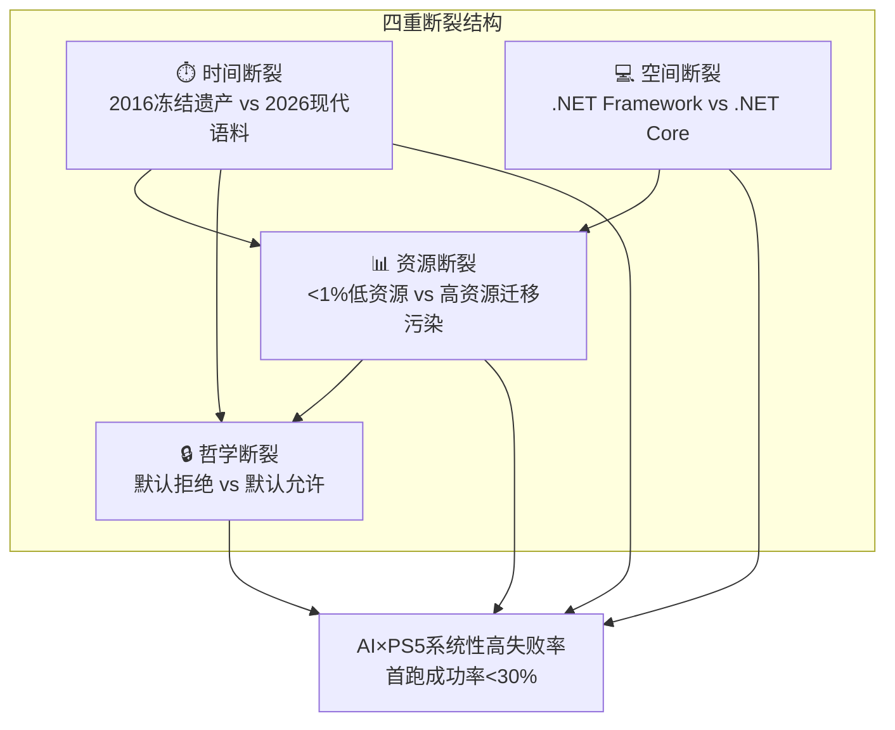

# 背景与问题陈述——为什么 AI+PS5 是"地狱难度"

## 1. 问题现象：AI 生成 PS5 代码的系统性高失败率

当使用 GPT-4、Claude、GitHub Copilot 等 AI 大模型为 Windows PowerShell 5.1 生成代码时，会系统性地出现高失败率。根据本研究采集的 24 个典型失败场景统计：

- **首跑成功率不足 30%**：未经约束的 AI 生成代码在 PS5.1 上首次执行成功率极低
- **错误分布广泛**：覆盖脚本开发辅助、自动化任务（CI/CD/计划任务/批量部署）、系统管理（AD/IIS/注册表/WMI/CIM）三大领域
- **错误类型多样**：ParserError（语法错误）、CommandNotFoundException（API 不存在）、安全策略阻止、编码乱码、静默错误（语法正确但结果错误）
- **反直觉趋势**：模型越新（GPT-4o、Claude 3.5、最新版 Copilot），PS5.1 兼容性反而越差

这不是"AI 偶尔写错代码"的随机问题，而是一个可预测、可复现、有深层结构性原因的系统性问题。

## 2. 四重断裂概述

AI×PowerShell 5.1 的"地狱难度"本质是**四重断裂**问题——四个维度同时存在结构性断裂，任何单维度修复都无法解决问题：

### 2.1 时间断裂：2016 冻结遗产 vs 2026 现代语料

- **PowerShell 5.1**：2016 年随 Windows 10/Server 2016 发布，此后进入**特性冻结**状态——仅接收安全更新，不新增语法、不新增 API
- **AI 训练语料**：2020 年 PowerShell 7 发布后持续快速演化，2023-2026 年的新教程、Stack Overflow 回答、GitHub 代码以 PS7+ 语法为主
- **断裂后果**：PS5.1 解析器无法识别 2020 年后新增的语法运算符（`&&`/`||`/`?:`/`??`/`??=`/`?.`/`-Parallel`），所有这些语法在 PS5.1 中直接触发 ParserError

### 2.2 空间断裂：Windows-only .NET Framework vs 跨平台 .NET Core

- **PowerShell 5.1**：基于 **.NET Framework 4.x**，Windows-only，深度集成 Windows 特有技术（WMI、COM、Workflow、WinForms/WPF）
- **PowerShell 7+**：基于 **.NET Core/.NET 5+**，跨平台设计，移除或重构了大量 Windows-only API
- **断裂后果**：这不是"版本升级"而是**运行时替换**——WMI cmdlets 直接移除、Workflow 功能不存在、Add-PSSnapin 被移除、Web cmdlets 从 HttpWebRequest 重写为 HttpClient（行为差异显著）

### 2.3 资源断裂：<1% 低资源语言 vs 高资源语言经验迁移污染

- **PowerShell 语料占比**：在公开代码语料（GitHub、Stack Overflow）中占比不足 1.2%，远低于 Python（~30%）、JavaScript（~25%）、Bash（~5%）
- **版本标签缺失**：<5% 的 PowerShell 公开内容明确标注"5.1"或"7+"版本号，模型无法学习版本边界
- **高资源语言迁移污染**：AI 系统性地将 Bash/C#/JavaScript/Python 的语法习惯迁移到 PowerShell：
  - 从 Bash 迁移 `&&`/`||` 管道链、`curl URL | sh` 模式（`irm | iex`）
  - 从 C#/JavaScript 迁移 `?:` 三元运算符、`??` 空合并运算符
  - 从 Python 迁移大小写敏感变量覆盖习惯（`$home` vs `$HOME`，但 PS 大小写不敏感）

### 2.4 哲学断裂：默认安全白名单 vs AI 默认全功能假设

- **PowerShell 5.1 安全哲学**：作为 Windows 系统内置组件，遵循**"默认拒绝"**安全哲学：
  - 默认 ExecutionPolicy = Restricted（禁止所有脚本运行）
  - Constrained Language Mode (CLM)/WDAC/AppLocker 采用白名单模型（未明确允许即禁止）
  - 默认 TLS 版本不含 1.2（现代 API 连接失败）
  - 脚本默认按系统 ANSI 代码页解析，重定向默认 UTF-16LE
- **AI 代码生成哲学**：训练语料几乎都是 Full Language Mode 下的开发者代码，遵循**"默认允许"**哲学——假设所有功能可用、现代安全协议已启用、脚本可直接运行
- **断裂后果**：AI 生成的 `.NET` 直接调用、`Add-Type`、非白名单 COM 对象、`class` 定义在企业 CLM 环境下 100% 失败；TLS/编码/执行策略默认值与现代开发期望系统冲突

## 3. 问题边界与适用范围

### 3.1 本教程聚焦范围

✅ **包含内容**：
- Windows PowerShell 5.1（powershell.exe）环境下的 AI 代码生成兼容性问题
- 三大应用领域：脚本开发辅助、自动化任务（CI/CD/计划任务/批量部署）、系统管理（AD/IIS/注册表/WMI/CIM）
- 企业受限环境（CLM/WDAC/AppLocker 启用）的防御性编程
- 经过对抗审查加固的安全最佳实践
- 可复用的防御模式、Prompt 模板、Checklist

❌ **不包含内容**：
- PowerShell 7+（pwsh.exe）环境下的代码生成优化（PS7 问题较少，且模型原生支持更好）
- PowerShell 基础语法教学（假设读者已有 PS 基础）
- PowerShell 7+ 新特性详解
- 如何绕过企业安全策略（本教程强调与安全策略协作而非对抗）

### 3.2 关键数据一览

| 指标 | 数值 |
|------|------|
| 典型失败场景数 | 24 个（三大领域各 8 个） |
| P0 阻断级根因洞察 | 8/14（57%） |
| 可复用防御模式 | 5 个 |
| V 阶段对抗审查攻击视角 | 3 视角 × 4 攻击 = 12 个 |
| 安全加固项 | 18 个（全部融入本教程） |
| PS7+ 禁用语法运算符 | 7 种 |
| PS7 已移除 API/Cmdlet 组 | 5+ 组 |
| 兼容性预检 Checklist 项 | 27 项（P0/P1/P2 三级） |
| 安全审查 Checklist 项 | 29 项（6 维度） |

## 4. 适用范围与免责声明

### 4.1 适用环境

本教程内容适用于以下环境：
- Windows 10/11、Windows Server 2016/2019/2022 自带的 Windows PowerShell 5.1
- 启用或未启用 WDAC/AppLocker/CLM 的企业环境
- CI/CD 流水线中使用 PowerShell 5.1 的场景
- 计划任务、批量部署、系统管理自动化场景

### 4.2 免责声明

> ⚠️ **重要提示**：
>
> 1. **安全建议边界**：本教程中的所有安全建议均为防御性编程最佳实践，不构成绕过企业安全策略的指导。在企业环境中部署脚本前，请与 IT/安全团队确认合规性。
>
> 2. **代码示例用途**：本教程中的代码示例仅用于教育和说明目的。执行任何系统管理脚本（特别是涉及删除操作、注册表修改、远程部署的脚本）前，请务必：
>    - 在非生产测试环境充分验证
>    - 使用 `-WhatIf` 参数模拟执行
>    - 备份重要数据
>    - 理解每一行代码的作用
>
> 3. **时效性声明**：本教程基于 2026 年 7 月的 PowerShell 生态状态编写。PowerShell 7.x 持续迭代，未来新版本可能引入新的不兼容语法。请定期参考[微软官方差异文档](https://learn.microsoft.com/en-us/powershell/scripting/whats-new/differences-from-windows-powershell)更新知识。
>
> 4. **CLM 白名单差异**：本教程中提到的"CLM 白名单"基于默认 CLM 配置。企业通过 WDAC 可以自定义白名单，实际允许的 API/COM 对象可能与本教程描述不同，请以企业安全团队配置为准。
>
> 5. **ExecutionPolicy 不是安全边界**：ExecutionPolicy 是用户体验防护机制而非安全边界，旨在防止用户意外运行脚本，无法阻止恶意代码执行。本教程中关于 ExecutionPolicy 的建议是为了兼容性而非安全绕过。

## 5. 如何使用本教程

| 读者类型 | 推荐阅读路径 | 重点章节 |
|---------|------------|---------|
| 遇到具体报错 | 错误案例集 → 差异速查 → 修复方案 | [02-ai-failure-cases.md](02-ai-failure-cases.md)、[01-ps5-ps7-differences.md](01-ps5-ps7-differences.md) |
| 系统学习 | 按章节顺序阅读 00→09 | 全部章节 |
| AI 编码日常使用 | Prompt 模板 + Checklist | [06-prompt-templates.md](06-prompt-templates.md)、[07-checklists.md](07-checklists.md) |
| 企业安全/运维 | 安全洞察 + 安全审查 Checklist + 陷阱反模式 | [04-hell-dimensions.md](04-hell-dimensions.md)、[07-checklists.md](07-checklists.md)、[08-pitfalls-anti-patterns.md](08-pitfalls-anti-patterns.md) |
| PS7→PS5 代码转换 | 防御模式总览 + 差异速查 | [05-defense-patterns.md](05-defense-patterns.md)、[01-ps5-ps7-differences.md](01-ps5-ps7-differences.md) |

---

**下一章**：[01-ps5-ps7-differences.md](01-ps5-ps7-differences.md) — PowerShell 5.1 vs 7+ 核心差异速查表，四维度对比 + AI 易错点标记。
