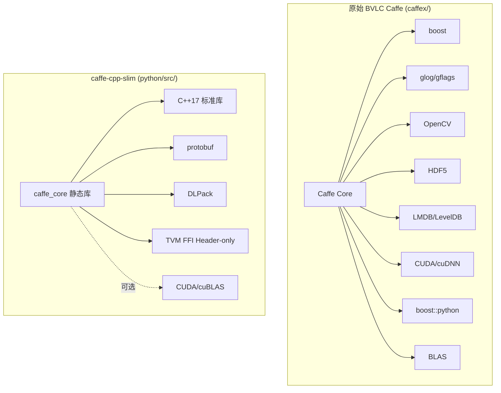
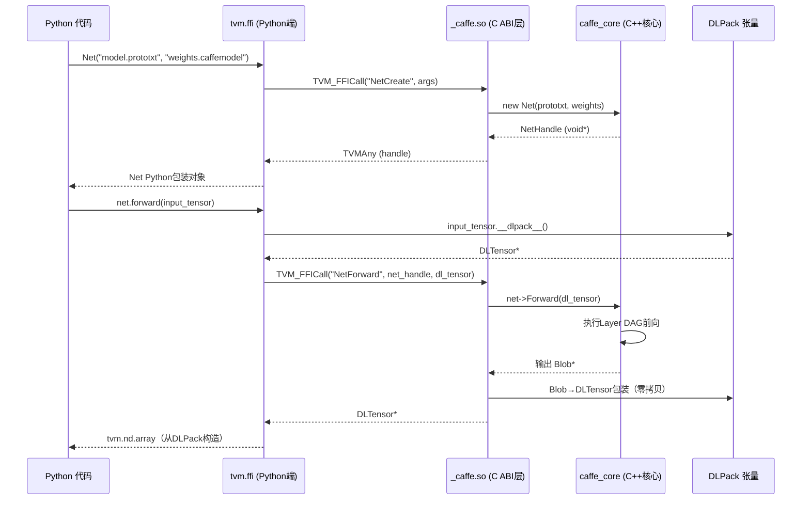

# Caffe 现代化改造：caffe-cpp-slim 无依赖核心与 TVM FFI 绑定层分析

> 分析 daoflows/caffe fork 相对于原始 BVLC Caffe 的架构演进：从"巨无霸全依赖框架"到"最小化推理核心 + 现代FFI绑定 + TVM Relax算子"的现代化改造路径。

## 一、改造背景与目标

原始 BVLC Caffe（2014）存在以下2026年视角下的痛点：

| 痛点 | 具体表现 | 现代化影响 |
|------|---------|-----------|
| **依赖过重** | 强制依赖 boost、glog、gflags、OpenCV、HDF5、LMDB、LevelDB、boost::python | 部署困难、镜像体积大、编译时间长、依赖冲突频发 |
| **Python绑定陈旧** | 使用 boost::python，编译复杂、与现代Python版本（3.12+）兼容性差 | NumPy 2.0/3.14 支持困难、C-API 不稳定 |
| **双后端冗余** | 每个算子需手动实现 Forward_cpu/Forward_gpu 两份代码 | 代码冗余、维护成本高、新后端扩展困难 |
| **C++11 不彻底** | 大量使用 boost::shared_ptr 而非 std::shared_ptr | 无法享受现代C++标准库改进 |
| **无现代张量交换** | 内部Blob格式，与其他框架互操作需要手动转换 | 无法接入 TVM/ONNX/PyTorch 生态 |

**改造目标**：
1. **无依赖推理核心**：裁剪掉训练相关、IO相关依赖，仅保留前向推理必需的最小C++核心
2. **现代FFI绑定**：用 TVM FFI（C ABI）替代 boost::python，实现稳定、高性能的Python绑定
3. **DLPack 张量交换**：通过 DLPack 标准实现零拷贝张量互操作
4. **TVM Relax 算子层**：在Python端用 TVM Relax 重新实现算子，统一多后端代码生成
5. **现代化Python工具链**：Python 3.14+、dataclass、类型注解、mypy 类型检查
6. **最小化 protobuf 库**：独立的 caffeproto 包，无需完整Caffe即可解析模型文件

## 二、caffe-cpp-slim 无依赖核心架构

### 2.1 依赖裁剪策略

caffex 原始依赖链 vs slim 核心：



**裁剪方法**：通过 `python/include/caffe/compat/` 头文件层提供标准库 shim：
- `boost::shared_ptr` → `std::shared_ptr`
- `boost::mutex/scoped_lock` → `std::mutex/std::lock_guard`
- `glog` 日志 → 轻量级内联日志宏或标准库 iostream
- `gflags` 命令行解析 → 移除（slim核心无需命令行工具）
- OpenCV/HDF5/LMDB/LevelDB → 完全移除（输入预处理和数据层不属于推理核心）
- boost::python → TVM FFI C ABI 导出

### 2.2 核心目录结构

```
python/                           # slim 版本根目录
├── include/caffe/                # C++ 头文件（slim裁剪版）
│   ├── compat/                   # 🔑 依赖适配层：boost→std shims
│   ├── blob.hpp                  # Blob 张量（简化版，移除训练相关diff）
│   ├── layer.hpp                 # Layer 基类（仅保留前向推理接口）
│   ├── net.hpp                   # Net 网络（仅前向执行）
│   ├── common.hpp                # 全局状态（移除RNG并行训练相关）
│   └── caffe.hpp                 # 统一头文件
├── src/caffe/                    # C++ 实现
│   ├── blob.cpp
│   ├── net.cpp
│   ├── layers/                   # 核心推理层实现（Conv/BN/ReLU/Softmax等）
│   └── _caffe.cpp                # 🔑 TVM FFI 导出入口（替代 boost_python）
├── CMakeLists.txt                # 构建配置
│   # 产出：libcaffe_core.a（静态库）+ _caffe.so（Python可加载共享库）
│   # 链接方式：whole-archive 保证静态注册的Layer不被链接器优化掉
└── LICENSE
```

### 2.3 构建系统设计

CMake 构建采用"静态核心 + 共享FFI层"两层架构：

1. **caffe_core 静态库**：包含所有核心C++代码和Layer注册，使用 `-Wl,--whole-archive` 链接确保静态对象构造函数（自注册）被保留
2. **_caffe 共享库**：薄FFI层，通过 TVM FFI 宏导出 C ABI 函数，链接 caffe_core
3. **自动 protobuf 生成**：构建时自动调用 protoc 生成 caffe.pb.cc/caffe.pb.h
4. **wheel 打包**：pycaffe/ 使用 scikit-build-core 构建 Python wheel，依赖 caffeproto 纯Python包

## 三、TVM FFI 绑定层设计（替代 boost::python）

### 3.1 TVM FFI 核心优势

| 特性 | boost::python (旧) | TVM FFI (新) |
|------|-------------------|-------------|
| **绑定方式** | C++ 宏 + 模板元编程，编译时绑定 | C ABI 导出 + 运行时反射，跨语言 |
| **依赖** | 需要链接 boost_python 库 | Header-only，仅需 tvm/runtime/c_backend_api.h |
| **Python兼容性** | 依赖 Python C API 版本，升级Python需重编译 | 稳定C ABI，跨Python版本无需重编译 |
| **张量传递** | 手动 NumPy C API 转换 | DLPack 标准，零拷贝 |
| **异常处理** | C++异常→Python异常转换复杂 | TVM FFI 内置异常跨边界传递 |
| **跨语言** | 仅Python | C/C++/Python/Rust/Go/Julia 统一FFI |

### 3.2 绑定层架构



### 3.3 导出函数清单

`python/src/caffe/_caffe.cpp` 中通过 TVM FFI 导出的核心函数：

| 函数 | 功能 | 签名（概念层） |
|------|------|---------------|
| `NetCreate` | 从 prototxt + caffemodel 创建网络 | (prototxt_str, weights_path) → NetHandle |
| `NetForward` | 执行前向推理 | (NetHandle, DLTensor* input) → DLTensor* output |
| `NetGetBlob` | 获取中间Blob数据 | (NetHandle, blob_name) → DLTensor* |
| `BlobData` | 获取Blob数据指针 | (BlobHandle) → DLTensor* |
| `BlobShape` | 获取Blob形状 | (BlobHandle) → int64_t* shape, ndim |
| `NetDelete` | 销毁网络 | (NetHandle) → void |

**关键设计**：所有张量通过 DLPack 的 `DLTensor` 结构传递，实现：
- 零拷贝：Python 端的 numpy/tvm.nd.array/torch.Tensor 都可以通过 `__dlpack__()` 协议直接传递给C++，无需数据复制
- 设备透明：DLTensor 包含 device 字段（kDLCPU/kDLCUDA/kDLROCM等），自动处理CPU/GPU张量
- 生命周期管理：DLManagedTensor 的 deleter 回调确保正确释放

## 四、TVM Relax 算子实现层

### 4.1 架构定位

TVM Relax 算子层位于 Python 端（`python/operators/layers.py`），是对 C++ slim 核心的补充和替代：

- **C++ slim 核心**：保留经过验证的、性能关键的核心算子（Conv、BN、ReLU、Pooling、Softmax、InnerProduct）
- **TVM Relax 层**：Python 端用 `tvm.relax.op` 实现新算子，支持自动多后端代码生成（CPU/GPU/ARM/专用加速器）

### 4.2 算子实现风格

使用 Python dataclass + TVM Relax nn.Module 的声明式风格：

```python
from dataclasses import dataclass, field
import tvm
from tvm import relax
from tvm.relax import nn, op as _op

@dataclass
class Conv2D(nn.Module):
    in_channels: int
    out_channels: int
    kernel_size: tuple[int, int]
    stride: tuple[int, int] = (1, 1)
    padding: tuple[int, int] = (0, 0)
    dilation: tuple[int, int] = (1, 1)
    groups: int = 1
    bias: bool = True
    name: str = "conv2d"
    define_subroutine: bool = True
    
    weight: nn.Parameter = field(init=False, repr=False)
    bias_param: nn.Parameter | None = field(init=False, repr=False, default=None)
    
    def __post_init__(self):
        kh, kw = self.kernel_size
        self.weight = nn.Parameter(
            (self.out_channels, self.in_channels // self.groups, kh, kw),
            name="weight"
        )
        if self.bias:
            self.bias_param = nn.Parameter((self.out_channels,), name="bias")
    
    def forward(self, x: relax.Expr) -> relax.Var:
        out = _op.nn.conv2d(
            x, self.weight,
            strides=self.stride,
            padding=self.padding,
            dilation=self.dilation,
            groups=self.groups,
            data_layout="NCHW",
            kernel_layout="OIHW",
            out_dtype=x.struct_info.dtype
        )
        if self.bias_param is not None:
            out = _op.add(out, _op.reshape(self.bias_param, (1, -1, 1, 1)))
        return nn.emit(out, self.name)
```

**设计特点**：
1. **@dataclass(slots=True)**：内存高效、repr 友好，`field(repr=False)` 隐藏大数组避免日志爆炸
2. **nn.Parameter**：可学习权重的声明式定义，自动管理参数存储
3. **define_subroutine=True**：在 Relax IR 中生成子函数，复用编译结果
4. **nn.emit()**：统一变量绑定和命名，处理静态图SSA约束

### 4.3 已实现算子

| 算子类 | 对应 Caffe LayerParameter | 说明 |
|--------|--------------------------|------|
| `Conv2D` | ConvolutionParameter | 2D卷积，支持groups/dilation/padding/stride |
| `ConvTranspose2D` | ConvolutionParameter (transpose) | 转置卷积/反卷积 |
| `L2Norm` / `Normalize` | NormalizeParameter | L2归一化（新增算子） |
| `BatchNorm` | BatchNormParameter | 批量归一化 |
| `Scale` | ScaleParameter | 缩放+偏置（BN后接Scale是Caffe经典组合） |
| `ReLU` | ReLUParameter | 修正线性单元 |
| `Pooling2D` | PoolingParameter | 最大/平均池化 |
| `InnerProduct` | InnerProductParameter | 全连接层 |
| `Softmax` | SoftmaxParameter | Softmax激活 |
| `Flatten` | FlattenParameter | 维度展平 |
| `Dropout` | DropoutParameter | Dropout（推理时直接pass-through） |

### 4.4 算子融合支持

`python/caffeproto/caffe_fuse.py` 提供 Caffe 经典算子融合：

- **BN + Scale 融合**：将 BatchNorm 的均值/方差和 Scale 的 gamma/beta 融合为单个线性变换 `y = x * W + B`，减少推理时kernel launch开销
- **Conv + BN 融合**：卷积后接BN时，将BN参数折叠进卷积权重，推理时跳过BN计算
- 融合考虑了 Caffe 训练/推理模式差异（BN 用滑动平均统计量而非batch统计量）

## 五、Python 端现代化重构

### 5.1 dataclass 数据类型系统

`python/pycaffe/data_types.py`（原 dataclasses.py）定义了11个结构化数据类：

| 数据类 | 用途 |
|--------|------|
| `TransformerConfig` | 数据预处理配置（resize/mean/scale/channel swap） |
| `DataProcessorConfig` | 数据处理管道配置 |
| `TimingStats` | 批量推理总计时统计 |
| `PerImageTiming` | 单张图像处理各阶段耗时 |
| `BatchTimingStats` | 批处理计时统计 |
| `ChannelStats` | 各通道值统计（min/max/mean/std） |
| `TensorStats` | 张量健康统计（含NaN/Inf检测） |
| `ValueHealthWarning` | 值异常警告（NaN/Inf/异常范围） |
| `ImageLoadInfo` | 图像加载信息（路径/尺寸/模式） |
| `BatchInputInfo` | 批输入信息 |
| `TransformInfo` | 变换应用信息 |

**最佳实践**：
```python
@dataclass(slots=True)  # slots=True 减少内存占用、加速属性访问
class TensorStats:
    shape: tuple[int, ...]
    dtype: str
    min_val: float
    max_val: float
    mean_val: float
    std_val: float
    has_nan: bool = False
    has_inf: bool = False
    per_channel: list[ChannelStats] = field(default_factory=list)  # 可变默认值用factory
    raw_data: np.ndarray | None = field(default=None, repr=False)   # repr=False 隐藏大数组
```

### 5.2 命名规范化：解决标准库冲突

两次关键重命名：

| 旧名称 | 新名称 | 问题 | 社区惯例参考 |
|--------|--------|------|-------------|
| `io.py` | `transforms.py` | 与 Python 标准库 `io` 同名，导入时遮蔽标准库 | `torchvision.transforms` |
| `dataclasses.py` | `data_types.py` | 与 Python 3.7+ 标准库 `dataclasses` 同名 | 避免导入遮蔽 |

**原则**：自定义模块名不得与标准库重名，遵循深度学习社区惯用命名。

### 5.3 目录结构优化（reorganize-python-directory）

重构前后对比：

**重构前**（分散、重复）：
```
python/
├── pycaffe/
│   ├── __init__.py
│   ├── io.py                  # 与标准库冲突
│   ├── proto/                 # ❌ 内嵌proto，与caffeproto重复
│   │   └── caffe_pb2.py       # 6223行重复代码
│   ├── data_processor.py      # ❌ 与io.py功能重叠
│   ├── net_spec.py
│   ├── classifier.py
│   └── detector.py
├── protos/caffe.proto
├── scripts/
└── tests/
```

**重构后**（清晰、无重复）：
```
python/
├── caffeproto/                # ✅ 统一protobuf包
│   ├── __init__.py
│   ├── caffe_pb2.py           # 唯一生成的Python protobuf代码
│   └── caffe_utils.py         # prototxt解析/序列化工具
├── protos/
│   └── caffe.proto            # proto定义（唯一来源）
├── operators/
│   ├── __init__.py
│   └── layers.py              # TVM Relax算子实现
├── pycaffe/                   # 高层Python API
│   ├── __init__.py
│   ├── transforms.py          # ✅ 数据预处理（原io.py）
│   ├── net_spec.py            # 网络声明式构建
│   ├── classifier.py          # 分类器封装
│   ├── detector.py            # 检测器封装
│   ├── draw.py                # 网络可视化
│   └── data_types.py          # ✅ dataclass定义（原dataclasses.py）
├── scripts/
│   ├── gen_proto.py           # proto自动生成+版本检查
│   ├── _check_python.sh
│   └── _diag.sh
├── tests/
│   ├── test_dataclasses.py    # 64个dataclass单元测试
│   ├── test_l2norm.py         # L2Norm算子测试
│   ├── test_inference.py      # 推理正确性测试
│   └── verify.py
├── src/ + include/            # C++ slim核心
└── CMakeLists.txt
```

**优化收益**：
- 删除重复代码：-6223行（重复的caffe_pb2.py）
- 模块职责清晰：caffeproto（序列化）/ operators（算子）/ pycaffe（高层API）三层分离
- proto 单一来源：`python/protos/caffe.proto` 是唯一真相源
- 测试归类：所有测试统一在 `tests/`

### 5.4 DataProcessor 可观测性增强

数据预处理管道增加了详细的诊断日志：

| 诊断功能 | 实现位置 | 用途 |
|---------|---------|------|
| Per-channel 值统计 | `_log_tensor_stats()` | 检测各通道均值/方差异常 |
| NaN/Inf 检测 | `_check_value_health()` | 早发现数据问题（损坏图片/归一化错误） |
| 形状变化追踪 | 全程记录shape | 调试预处理后维度不匹配 |
| 混合形状警告 | 批量处理时检测 | 发现同一batch中图片尺寸不一致问题 |
| 内存用量监控 | 张量大小统计 | 预估显存/内存占用 |
| 分阶段耗时 | pre/process/post各阶段计时 | 定位预处理瓶颈 |

## 六、caffeproto：最小化 protobuf 库

### 6.1 设计目标

原始 PyCaffe 依赖完整 Caffe 编译才能导入 `caffe.proto` 生成的Python代码。caffeproto 目标是：
- **零C++依赖**：纯Python包，仅依赖 `protobuf` Python库
- **独立可用**：无需安装Caffe即可解析/生成 .prototxt 和 .caffemodel 文件
- **版本兼容**：自动检查 protoc 版本与 Python protobuf runtime 兼容性
- **工具集**：提供 text_format 解析、消息遍历、层类型检测等常用工具

### 6.2 生成脚本：gen_proto.py

`python/scripts/gen_proto.py` 自动化proto生成流程：

```
步骤1：查找系统 protoc
   ↓
步骤2：获取 protoc 版本号
   ↓
步骤3：获取 Python protobuf runtime 版本
   ↓
步骤4：版本兼容性检查（不兼容则报错+提示）
   ↓
步骤5：执行 protoc 编译 .proto → _pb2.py
   ↓
步骤6：验证生成的Python模块可正常导入
   ↓
✅ 生成完成
   输出：python/caffeproto/caffe_pb2.py
         python/protos/caffe_pb2.py（兼容旧路径）
```

### 6.3 caffe_utils.py 类型无关工具

`caffeproto/caffe_utils.py` 提供处理 Caffe protobuf 消息的通用工具，核心设计原则：**类型无关，不添加特定层分支**。

核心功能：
- `read_prototxt(path)` / `write_prototxt(msg, path)`：读写文本格式
- `read_binary_proto(path)` / `write_binary_proto(msg, path)`：读写二进制格式
- `unity_struct(layer_param)`：统一处理任意类型LayerParameter，返回 (type_name, param_dict)
- `walk_layers(net_param)`：遍历网络中所有层，提供 (layer, type_specific_param) 访问
- `get_layer_type(layer_param)`：安全获取层类型字符串

**关键约束**：新层类型添加时**不需要修改caffe_utils.py**，因为它通过 protobuf 反射API工作，而非硬编码类型分支。

## 七、新算子扩展四步法

README 中标准化了添加新算子的流程（已提取为可复用模式）：

### 步骤1：扩展 Protocol Buffer 协议

编辑 `python/protos/caffe.proto`：
1. 在文件末尾添加新的 `XxxParameter` 消息定义
2. 在 `LayerParameter` 中添加 `optional XxxParameter xxx_param = <next_id>;`
3. 更新 `next available layer-specific ID` 注释
4. 字段编号严格递增，不与现有字段冲突

### 步骤2：重新生成 Python 代码

```bash
python python/scripts/gen_proto.py
```
脚本自动检查版本一致性并生成代码。

### 步骤3：实现 TVM Relax 模块

在 `python/operators/layers.py` 中添加 `@dataclass class NewLayer(nn.Module)`。

### 步骤4：添加测试

在 `python/tests/` 创建测试文件，必须包含：
1. **protobuf 序列化/反序列化测试**：验证 XxxParameter 字段往返正确
2. **text_format 解析测试**：验证 prototxt 文本格式解析
3. **默认值测试**：验证字段默认值正确
4. **TVM 数值正确性测试**（有TVM环境时）：用numpy参考实现对比（atol=1e-5）
5. **caffe_utils 兼容性测试**：验证 `unity_struct` 处理新层类型无报错

## 八、Docker 构建体系

### 8.1 Ubuntu 26.04 适配问题与修复

| 问题 | 原因 | 修复 |
|------|------|------|
| Boost 1.90.0 链接错误 | Boost.System 从 1.90.0 开始变为 header-only | 移除 `boost_system` 链接依赖 |
| NumPy 3.14 segfault | `import_array1()` 必须在类注册前调用 | 调整初始化顺序 |
| Python 3.14 C-API 变化 | 旧的 PyCaffe 使用废弃API | 更新为稳定C-API |

### 8.2 多阶段构建 Dockerfiles

提供三类镜像：

| Dockerfile | 用途 | 基础镜像 | 产出 |
|-----------|------|---------|------|
| `docker/python-module/Dockerfile` | caffeproto + TVM Relax 纯Python推理 | python:3.14-slim | 纯Python wheel |
| `docker/pycaffe/Dockerfile` | _caffe.so C++扩展完整绑定 | nvidia/cuda:xx.x + Ubuntu 26.04 | scikit-build-core wheel |
| `docker/local/Dockerfile` | 开发环境（caffex完整构建） | Ubuntu 26.04 + 全依赖 | 开发容器 |

### 8.3 验证体系

- **6 PASS**：python-module 纯Python功能测试
- **18 PASS**：pycaffe C++扩展绑定测试
- **11 PASS**：parity 一致性验证（C++ slim核心 vs TVM Relax 输出数值一致）

## 九、AI 智能体基础设施

daoflows/caffe 本身采用了 SpecWeave 风格的 AI 协作者基础设施：

```
caffe/
├── AGENTS.md                   # AI协作者入口（SpecWeave兼容）
├── .agents/
│   ├── context-routing.md      # 任务→源码文件路由表
│   ├── architecture-map.md     # 8大核心组件文件定位
│   └── README.md
└── .trae/specs/                # 7个开发Spec（七概念方法论）
    ├── caffe-cpp-slim-tvm-ffi/     # slim核心+FFI绑定（含retrospective+build pitfalls）
    ├── python-dataclass-refactor/  # Python dataclass重构
    ├── reorganize-python-directory/# 目录结构优化
    ├── caffe-io-rename/            # io→transforms重命名
    ├── caffe-dataclasses-rename/   # dataclasses→data_types重命名
    ├── docker-images-for-modules/  # Docker构建体系
    └── upgrade-pycaffe-binding/    # PyCaffe绑定升级
```

每个Spec目录遵循 SpecWeave 三件套约定：`spec.md`（需求规格）+ `tasks.md`（任务分解）+ `checklist.md`（验收清单）+ 相关复盘/报告。

## 十、可复用架构模式萃取

### 模式6：依赖裁剪适配层（Dependency Shimming Layer）

**触发场景**：需要将重度依赖的遗留C++库改造为无依赖/轻依赖版本，但又不想大规模重写源码时。

**核心结构**：
1. 识别所有第三方依赖，分类为：必需/可选/可替换/可移除
2. 创建 `compat/` 目录，为每个要移除的依赖提供头文件 shim：
   - 直接用 `using` 别名映射到标准库（如 `using boost::shared_ptr = std::shared_ptr;`）
   - 对复杂功能（如日志）提供最小化内联实现
   - 对完全不需要的功能（如命令行解析）提供空实现
3. 构建系统优先查找系统库，找不到时使用 compat/ shim
4. 源码中 `#include` 保持不变，通过 include path 切换实现版本

**Caffe 证据**：`python/include/caffe/compat/` 层将 boost/glog 等重定向到标准库；caffex/ 原始源码不做修改，通过 include 路径选择实现编译裁剪版。

**反模式**：
- 直接 fork 修改所有源文件替换依赖（造成与上游分支永久分叉，无法合并上游bugfix）
- 用预处理器宏 `#ifdef` 到处条件编译（代码可读性严重下降）
- 一次性移除所有依赖导致大面积编译错误无法定位
- 不保留原始上游目录（caffex/），直接在源码上改导致无法对比升级

**跨领域迁移**：
- 大型C++库的嵌入式/移动端裁剪（如OpenCV、FFmpeg最小化构建）
- 企业内部 fork 开源项目时的适配层设计
- 微服务拆分时从单体中剥离功能的防腐层
- 跨平台移植时为平台特定API提供兼容层

### 模式7：C ABI 动态语言绑定（C-ABI Dynamic Language Binding）

**触发场景**：需要为C/C++库提供Python/Rust/Go/Julia等多语言绑定，且要求绑定跨语言版本稳定、无需为每种语言写大量胶水代码时。

**核心结构**：
1. 所有导出函数使用纯 C ABI（`extern "C"`），返回值通过输出参数或句柄
2. 不使用 C++ 类型作为接口参数（std::string/std::vector/异常等不能跨边界）
3. 不透明句柄（opaque pointer / handle）模式：`typedef void* NetHandle;` 隐藏内部类型
4. 张量/数组通过 DLPack/Arrow 等开放标准交换，零拷贝
5. 错误处理通过返回码（int）+ 最后错误查询（`GetLastError()`）或 TVM FFI 风格的统一异常传递
6. 各语言端提供"包装层"，将C ABI封装为语言惯用API（Python类/context manager等）

**Caffe 证据**：`_caffe.cpp` 使用 TVM FFI 宏导出 C ABI 函数；Net/Blob 通过不透明句柄传递；张量统一通过 DLTensor 交换。

**反模式**：
- 直接暴露 C++ 类和 STL 类型到 ABI（编译器版本/标准库版本不同即崩溃）
- 跨边界抛 C++ 异常（未定义行为，Python端无法catch导致段错误）
- 用 boost::python/pybind11 等重型绑定方案（编译慢、特定语言锁定、跨Python版本不稳定）
- 数据传递时做深拷贝而非共享内存（性能差、内存浪费）
- 在绑定层做业务逻辑（绑定层应薄，只做类型转换和调用转发）

**跨领域迁移**：
- 所有需要多语言绑定的C/C++库（ML框架、数据库驱动、多媒体处理）
- 插件系统设计（.so/.dll插件用C ABI接口而非C++类）
- 跨进程/跨语言RPC的底层传输设计
- 嵌入式SDK为上层应用提供的API设计

### 模式8：声明式算子 + 编译器后端（Declarative Op + Compiler Backend）

**触发场景**：算子需要支持多硬件后端（CPU/GPU/ARM/NPU/...），且不希望为每个后端手写一份实现时。

**核心结构**：
1. 算子在Python端用声明式DSL描述（如TVM Relax `nn.Module`、PyTorch `nn.Module`）
2. 算子只描述"做什么"（数学运算），不描述"怎么做"（线程/内存/指令）
3. 编译器（TVM/MLIR/Triton/...）根据算子描述自动生成多后端代码
4. 性能关键算子可以提供手写高性能kernel作为"override"覆盖编译器生成
5. 新增算子只需写一份Python描述，所有后端自动获得支持

**Caffe 证据**：`operators/layers.py` 用 `tvm.relax.op` 声明式描述算子；TVM编译时自动生成CPU/GPU/ARM等多后端kernel；C++ slim核心保留关键手写算子作为性能基线。

**反模式**：
- 每个新算子要求工程师为CPU/GPU/嵌入式各写一份手动优化kernel
- 算子接口与特定后端深度耦合（如直接调用cuDNN API）
- 没有统一的中间表示，各算子独立做内存管理/线程调度（重复造轮子）
- 强制所有算子必须用DSL，不给性能关键路径留手工优化入口（性能天花板）

**跨领域迁移**：
- 深度学习编译器栈（TVM/MLIR/XLA/ONNX Runtime）
- 数据库查询优化器（声明式SQL → 多执行引擎）
- 着色器语言/图形渲染（GLSL/Slang → 多GPU）
- 信号处理/多媒体编解码器的跨平台优化

### 模式9：扩展四步法（Four-Step Extension Recipe）

**触发场景**：框架需要支持用户自定义扩展（新算子、新层、新插件），且要求扩展流程标准化、可验证时。

**核心结构**：
1. **Schema/IDL 扩展**：在接口定义语言中添加新类型的配置（protobuf/IDL/DSL）
2. **代码/绑定生成**：运行代码生成器更新序列化/反序列化代码
3. **核心逻辑实现**：在扩展点实现新功能，遵循框架接口契约
4. **测试矩阵验证**：提供多层测试（序列化往返、默认值、格式解析、功能正确性、框架兼容性）

**Caffe 证据**：新算子四步法：①扩展caffe.proto → ②gen_proto.py生成代码 → ③layers.py实现TVM Relax算子 → ④5类测试验证。

**反模式**：
- 扩展流程没有文档，用户靠猜/复制粘贴旧代码
- 只测核心功能，不测序列化/兼容性/边界情况
- 扩展点需要修改框架核心代码（违反开闭原则）
- 代码生成步骤需要手动执行多个命令，容易遗漏

**跨领域迁移**：
- IDE/编辑器插件开发流程
- Web框架的自定义中间件/插件开发
- 游戏引擎自定义组件/节点注册
- API框架的新端点/新类型添加流程

## 十一、反模式与陷阱清单

从本次改造中提取的反模式（避免重蹈覆辙）：

| 陷阱 | 表现 | 规避方法 |
|------|------|---------|
| **标准库命名冲突** | 自定义模块叫 `io.py`/`dataclasses.py` 遮蔽标准库 | 命名前先 `python -c "import xxx"` 检查是否是标准库 |
| **双份 proto 生成** | 两个目录都有 caffe_pb2.py 导致版本不一致 | proto定义单一来源，生成脚本自动同步所有输出路径 |
| **在工具类中加特定类型分支** | caffe_utils.py 中 if type == "Conv": ... 破坏开闭 | 用反射/多态/访问者模式替代类型分支 |
| **boost::python 跨版本崩溃** | Python 小版本升级就段错误 | 使用 C ABI + DLPack 替代 boost::python/pybind11 |
| **依赖地狱** | 编译 Caffe 需要 8+ 第三方库，版本冲突频发 | 推理核心最小化依赖，IO/训练/可视化作为可选模块 |
| **repr 输出大数组** | `print(net)` 输出几MB权重数据导致日志爆炸 | dataclass 中 numpy 数组字段用 `field(repr=False)` |
| **静态链接丢失自注册** | 静态库中自注册Layer因链接器优化被丢弃 | 使用 `-Wl,--whole-archive` 或显式引用注册对象 |
| **import_array1 顺序问题** | NumPy C API初始化顺序错导致随机段错误 | 模块加载时第一时间调用 `import_array1()` |

## 十二、跨领域迁移价值总结

Caffe 现代化改造中提炼的架构思想，超越深度学习领域的通用价值：

| 架构决策 | 通用软件设计启示 |
|---------|----------------|
| compat/ 适配层裁剪依赖 | **防腐层模式**：不修改上游源码，通过适配层隔离变化；为渐进式重构提供安全垫 |
| C ABI + DLPack 绑定 | **稳定接口原则**：模块边界使用最简单的C接口和开放标准；C ABI是唯一跨语言真正稳定的二进制接口 |
| 声明式算子 + 编译器后端 | **关注点分离**：算法工程师描述"算什么"，编译器专家优化"怎么算"；一次描述多端执行 |
| dataclass + slots 数据类型 | **值对象不可变**：数据类slots=True，repr精确控制，避免可变默认值陷阱 |
| 脚本化代码生成+版本检查 | **基础设施即代码**：生成流程自动化，版本兼容性前置检查而非运行时崩溃 |
| 类型无关工具类（caffe_utils） | **开闭原则**：工具代码不依赖具体类型，通过反射/协议工作；新增类型不需修改工具 |
| 四步标准化扩展流程 | **开发者体验**：扩展流程文档化、自动化、可验证；降低贡献门槛 |
| AI智能体基础设施内嵌 | **AI协作友好**：项目自带AGENTS.md和路由表，AI协作者无需猜测即可理解项目结构 |

## 附录：改造产出物统计

| 分类 | 数量/规模 |
|------|----------|
| 新增 Spec 文档 | 7个（.trae/specs/ 下） |
| 新增/重构Python文件 | 约20个核心文件 |
| C++ slim核心 | 无第三方依赖（除protobuf），替代boost::python |
| 代码变更规模 | +867/-7913行（净减7046行） |
| 单元测试 | 64个dataclass测试 + 算子测试 + 18个pycaffe测试 + 11个parity测试 |
| Docker镜像 | 3类（python-module/pycaffe/开发环境） |
| 兼容Python版本 | Python 3.14+（含NumPy 2.0支持） |
| 兼容Ubuntu版本 | Ubuntu 26.04（修复Boost 1.90/Python 3.14问题） |

---

## 关联文档

| 文档 | 关系 |
|------|------|
| [README.md](README.md) | 原始BVLC Caffe架构深度分析（Blob/Layer/Net/Solver四层抽象） |
| [05-docker-pycaffe-standalone-build-postmortem.md](05-docker-pycaffe-standalone-build-postmortem.md) | Docker构建复盘（本改造的Docker体系前置实践） |
| [04-proto2-vs-proto3-serialization-analysis.md](04-proto2-vs-proto3-serialization-analysis.md) | Protobuf版本分析（caffeproto底层技术基础） |
| tvm-ffi-wiki | TVM FFI 技术wiki（绑定层技术细节） |
| ffi-wiki | FFI通用原理wiki（C ABI设计理论基础） |
