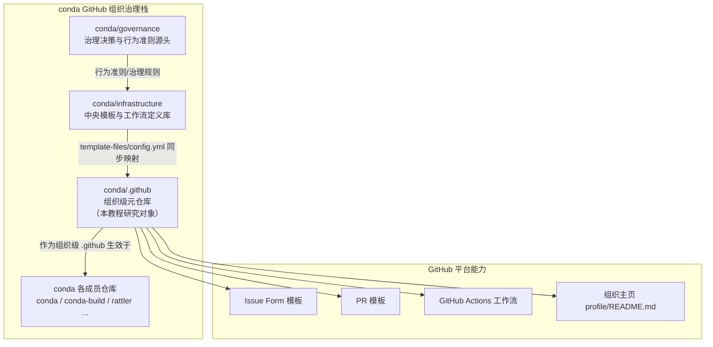

# conda .github 元仓库 Wiki 教程总览

## 1. 教程引言：为什么研究 conda 的 `.github` 元仓库

`conda/.github` 是 GitHub 上 **conda 组织（GitHub Organization）级别**的元仓库（meta-repository），它不承载任何 conda 包管理器的业务代码，而是以"组织的 `.github`"这一特殊命名，集中管理整个 conda 组织在 GitHub 平台上的**协作治理资产**——包括组织主页、Issue/PR 模板、自动化工作流、行为准则、社区使用指南等。

研究这个仓库的价值在于：

| 价值维度 | 说明 |
|---------|------|
| **组织级治理范本** | 了解一个大型开源组织如何通过单一元仓库统一成员仓库的协作规范，而非在每个仓库里重复维护 |
| **模板工程实践** | 4 个 Issue Form 模板（YAML）、1 个 PR 模板、7 个自动化工作流，展示了"表单化 + 自动化"的现代开源协作方式 |
| **中央同步体系** | 由 `conda/infrastructure` 中央仓库通过 `template-files/config.yml` 向所有成员仓库同步模板与工作流，理解"一次定义、全组织生效"的规模化治理模式 |
| **GitHub 平台能力** | 涉及 `profile/README.md` 组织主页、Issue Form、workflow_dispatch、schedule 触发、fork+PR 自动更新等平台特性的组合运用 |

本教程基于本地镜像 `external/libs/conda-dev/.github`（Git 提交 a9dc789）编写，所有描述均以该镜像实际内容为准。

## 2. 概念定位图：组织级元仓库在 GitHub 组织治理栈中的位置

> 说明：`conda/.github` 位于组织级治理栈的**中游**——它既是 `conda/infrastructure` 同步的下游接收者，又是所有成员仓库协作规范的**上游提供者**。

## 3. 章节导航表（共 10 章）

| 章节 | 文件 | 标题 | 简介 |
|------|------|------|------|
| 00 | [00-overview.md](00-overview.md) | 教程总览与导航索引 | 本教程的引言、定位图、章节导航、目标读者与阅读路径 |
| 01 | [01-repository-structure.md](01-repository-structure.md) | 仓库整体架构 | 完整目录树、每个文件/目录的职责说明、组织级 `.github` 与普通仓库 `.github/` 的对比、同步体系定位 |
| 02 | [02-workflows-deep-dive.md](02-workflows-deep-dive.md) | 7 个自动化工作流解析 | cla/issues/labels/lock/project/stale/update 七个 workflow 的作用与触发机制 |
| 03 | [03-issue-templates.md](03-issue-templates.md) | Issue Form 模板体系 | 0_bug/1_feature/2_documentation/epic 四个 YAML 表单模板的设计与字段 |
| 04 | [04-community-files.md](04-community-files.md) | 社区健康文件详解 | CODE_OF_CONDUCT / HOW_WE_USE_GITHUB / profile-README / .gitignore |
| 05 | [05-infrastructure-sync-model.md](05-infrastructure-sync-model.md) | conda/infrastructure 中央同步模型 | template-files/config.yml 同步映射、update.yml 自动更新流程 |
| 06 | [06-issue-sorting-labeling.md](06-issue-sorting-labeling.md) | Issue Sorting 与标签体系 | Issue sorting 流程、[category::topic] 标签语法、Roadmap Board 流转 |
| 07 | [07-operations-guide.md](07-operations-guide.md) | 常见操作指南 | 配置修改、功能扩展与问题排查三个操作场景 |
| 08 | [08-best-practices.md](08-best-practices.md) | 最佳实践与注意事项 | 可迁移治理模式、安全最佳实践、反模式与检验标准 |
| 09 | [09-resources.md](09-resources.md) | 术语表与参考资料 | 术语表、权威资料链接与按难度分级的阅读建议 |

## 4. 目标读者

- **开源组织维护者**：希望借鉴 conda 的"元仓库 + 中央同步"模式来统一自己组织的协作规范
- **GitHub 高级用户**：想深入理解组织级 `.github` 仓库、Issue Form、组织主页等平台能力的组合用法
- **DevOps / 平台工程人员**：关注 `conda/infrastructure` 的模板同步体系与自动化工作流的规模化实践
- **对 conda 生态感兴趣的学习者**：通过治理侧视角了解 conda 组织的运作方式

## 5. 阅读路径建议

- **快速入门**：先读 [01-repository-structure.md](01-repository-structure.md) 掌握仓库全貌，再按需跳读感兴趣的章节
- **系统学习**：按 00 → 01 → 02 → … → 09 顺序通读，从结构到机制逐步深入
- **关注治理模式**：重点阅读 05（同步机制）与 06（Issue Sorting 与标签体系），理解"定义一次、全组织生效"的设计哲学
- **关注技术实现**：重点阅读 02（工作流）与 03（Issue 模板），研究具体的 YAML/工作流写法

## 6. 关联的其他 Wiki（08 主题下）

本教程属于 **08-systems-infrastructure** 主题，与该主题下其他 Wiki 的关系：

- [📘 Git 高级命令 Wiki 教程](../git-advanced-wiki/README.md)：聚焦 `git clone --no-local --bare` 等高级参数，是理解元仓库 Git 操作底层行为的补充
- [🔄 Git+百度网盘跨设备同步方案](../git-baidu-sync/README.md)：基于 git clone 高级参数构建的跨设备私有仓库同步实战方案

三者分别从"Git 底层机制""私有同步实践""开源组织治理"三个角度覆盖 Git 与 GitHub 生态的不同侧面。

## 7. 章节链接汇总

- [00-overview.md](00-overview.md)：教程总览与导航索引
- [01-repository-structure.md](01-repository-structure.md)：仓库整体架构
- [02-workflows-deep-dive.md](02-workflows-deep-dive.md)：7 个自动化工作流解析
- [03-issue-templates.md](03-issue-templates.md)：Issue Form 模板体系
- [04-community-files.md](04-community-files.md)：社区健康文件详解
- [05-infrastructure-sync-model.md](05-infrastructure-sync-model.md)：conda/infrastructure 中央同步模型
- [06-issue-sorting-labeling.md](06-issue-sorting-labeling.md)：Issue Sorting 与标签体系
- [07-operations-guide.md](07-operations-guide.md)：常见操作指南
- [08-best-practices.md](08-best-practices.md)：最佳实践与注意事项
- [09-resources.md](09-resources.md)：术语表与参考资料

---

- [🏠 返回系统基础设施目录](../README.md)
