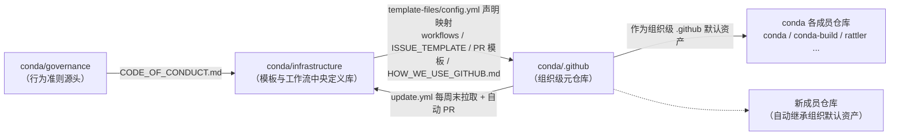

# conda .github 元仓库仓库整体架构

## 1. 仓库定位

`conda/.github` 是一个**组织级元仓库**（meta-repository），其特殊之处在于：

- 仓库名本身就是 `.github`——这是 GitHub 的约定，组织级 `.github` 仓库的内容会作为**组织默认资产**应用于该组织下所有成员仓库（如 `conda/conda`、`conda/conda-build` 等）
- 仓库内不包含 conda 的业务代码，只承载治理资产：Issue/PR 模板、自动化工作流、行为准则、社区指南、组织主页
- 本仓库大部分模板与工作流并非原创，而是由 `conda/infrastructure` 中央仓库同步而来（详见 [05-infrastructure-sync-model.md](05-infrastructure-sync-model.md)）

> 本教程基于本地镜像 `external/libs/conda-dev/.github`（Git 提交 a9dc789）编写，以下目录树与实际仓库内容一一对应。

## 2. 完整目录树

```text
conda/.github/                          # 仓库根（组织级元仓库）
├── .gitignore                          # 标准 Python 模板
├── CODE_OF_CONDUCT.md                  # Conda 组织行为准则
├── HOW_WE_USE_GITHUB.md                # 社区使用 GitHub 指南
├── LICENSE                             # 许可证
├── profile/
│   └── README.md                       # 组织主页（org profile）
└── .github/                            # 平台级资产目录
    ├── ISSUE_TEMPLATE/                 # Issue Form 模板（YAML）
    │   ├── 0_bug.yml                   #   缺陷报告模板
    │   ├── 1_feature.yml               #   功能请求模板
    │   ├── 2_documentation.yml         #   文档改进模板
    │   └── epic.yml                    #   Epic 模板
    ├── PULL_REQUEST_TEMPLATE.md        # PR 模板
    ├── template-files/
    │   └── config.yml                  # 中央同步映射清单
    └── workflows/                      # GitHub Actions 工作流
        ├── cla.yml                     #   CLA 签名验证
        ├── issues.yml                  #   Issue 自动化（待反馈标记）
        ├── labels.yml                  #   标签同步
        ├── lock.yml                    #   锁定关闭的 Issue/PR
        ├── project.yml                 #   PR 加入 Review 看板
        ├── stale.yml                   #   过期 Issue/PR 标记与关闭
        └── update.yml                  #   从 infrastructure 拉取更新
```

> 说明：`.git/` 目录为 Git 元数据，不属于仓库内容，此处省略。

## 3. 文件 / 目录作用说明表

### 3.1 根级文件

| 文件 | 作用说明 | 来源 |
|------|---------|------|
| `.gitignore` | 标准 Python 忽略模板（`__pycache__/`、`*.py[cod]`、`venv/` 等），保持仓库清洁 | 本地维护 |
| `CODE_OF_CONDUCT.md` | Conda 组织行为准则（"The Short Version" 概述 + 事件举报入口），成员仓库与 PR 中广泛引用 | `conda/governance` 同步 |
| `HOW_WE_USE_GITHUB.md` | 社区使用 GitHub 指南：Issue sorting、标签体系、Issue 类型（标准/Epic/Spike）、开发流程、代码评审与合并规范 | `conda/infrastructure` 同步（文件头 `# edit this in https://github.com/conda/infrastructure` 可佐证） |
| `LICENSE` | 许可证文件 | 本地维护 |

### 3.2 `profile/`

| 文件 | 作用说明 |
|------|---------|
| `profile/README.md` | conda 组织主页（访问 `https://github.com/conda` 时展示），介绍三组织架构（conda / conda-incubator / conda-archive）、重要仓库、项目看板、社区入口 |

### 3.3 `.github/ISSUE_TEMPLATE/`

| 文件 | 作用说明 |
|------|---------|
| `0_bug.yml` | 缺陷报告表单：Checklist（标题、查重）+ "What happened?" + "Additional Context" 等结构化字段，自动附加 `type::bug` 标签 |
| `1_feature.yml` | 功能请求表单，结构化收集功能诉求，附加 `type::feature` 标签 |
| `2_documentation.yml` | 文档改进表单，附加 `type::documentation` 标签 |
| `epic.yml` | Epic 模板：用于大型跨迭代工作项，可通过 sub-issues 关联到普通 issue |

> 四个模板文件头部均含 `# edit this in https://github.com/conda/infrastructure` 注释，表明由中央仓库同步。详细字段解析见 [03-issue-templates.md](03-issue-templates.md)。

### 3.4 `.github/PULL_REQUEST_TEMPLATE.md`

| 文件 | 作用说明 |
|------|---------|
| `PULL_REQUEST_TEMPLATE.md` | PR 模板：含 Description 引导、行为准则提醒、帮助链接（COC / Contributing docs），来源为 `conda/infrastructure` 的 `templates/pull_requests/base.md` |

### 3.5 `.github/template-files/`

| 文件 | 作用说明 |
|------|---------|
| `config.yml` | 中央同步映射清单：声明本仓库从 `conda/governance` 与 `conda/infrastructure` 接收哪些文件（源路径 → 目标路径映射），是同步体系的"配置真相源" |

### 3.6 `.github/workflows/`（7 个工作流）

| 文件 | name | 作用说明 |
|------|------|---------|
| `cla.yml` | CLA | 验证贡献者已签署 CLA，未签署前阻止 PR 合并，需人工审查 |
| `issues.yml` | Automate Issues | 贡献者评论后切换 `pending::feedback` / `pending::support` 标签，提示 issue 需要维护者关注 |
| `labels.yml` | Sync Labels | 合并全局标签（infrastructure 的 global.yml）与本地标签（labels.yml），同步仓库可用标签集 |
| `lock.yml` | Lock | 锁定长期无进一步活动的已关闭 Issue/PR（约 365 天） |
| `project.yml` | Add to Project | 新开的 PR 自动加入 Review 看板（orgs/conda/projects/16） |
| `stale.yml` | Stale | 标记并关闭过期 Issue/PR：`type::support` 类 21 天后标记 stale、30 天关闭；其余约 1 年标记、再 30 天关闭 |
| `update.yml` | Update Repository | 每周日定时（cron `36 2 * * 0`）调用 `conda/actions/template-files` 拉取中央模板更新，经 fork + 自动 PR（"🤖 Update infrastructure file(s)"）合入 |

> 各工作流的机制细节见 [02-workflows-deep-dive.md](02-workflows-deep-dive.md)；同步触发链路见 [05-infrastructure-sync-model.md](05-infrastructure-sync-model.md)。

## 4. 组织级 `.github` 元仓库 vs 普通仓库 `.github/` 目录

| 对比维度 | 组织级 `.github` 元仓库 | 普通仓库 `.github/` 目录 |
|---------|------------------------|--------------------------|
| **位置** | 组织下的独立仓库，仓库名固定为 `.github` | 普通仓库内部的一个隐藏目录 |
| **作用范围** | 组织级默认资产，应用于组织下**所有成员仓库** | 仅作用于当前这一个仓库 |
| **仓库根内容** | 可含根级文件（`profile/`、`CODE_OF_CONDUCT.md`、`HOW_WE_USE_GITHUB.md` 等） | 根级文件属于普通仓库业务文件，与 `.github/` 无关 |
| **组织主页** | `profile/README.md` 成为组织主页（`github.com/<org>`） | 无此能力（普通仓库无 profile 主页） |
| **内容来源** | 多为中央仓库（`conda/infrastructure`）同步而来，本仓库只作中转/沉淀 | 通常为仓库维护者直接编写维护 |
| **模板覆盖机制** | 成员仓库未自行定义模板/工作流时，使用组织默认资产；成员仓库可覆盖 | 仓库自身的模板/工作流优先级高于组织默认 |
| **典型用途** | 统一全组织的协作规范、自动化治理、组织品牌展示 | 单个项目自身的 Issue/PR 模板、CI/CD 流水线 |
| **示例** | `conda/.github`、`github/.github` 等 | 几乎所有开源仓库内部的 `.github/` |

> **核心差异**：组织级 `.github` 元仓库解决的是"**全组织统一**"问题，普通仓库的 `.github/` 解决的是"**单仓库定制**"问题，两者是"默认资产 vs 局部覆盖"的层级关系。

## 5. 本仓库在 conda/infrastructure 同步体系中的角色定位



**角色定位总结**：

1. **下游接收者**：通过 `template-files/config.yml` 声明从 `conda/governance`、`conda/infrastructure` 接收模板与工作流，由 `update.yml` 定时自动同步，保证组织资产"单点定义、多点一致"
2. **组织级发布层**：自身作为组织级 `.github` 仓库，把同步来的资产**默认分发**到所有成员仓库，是治理栈中的"中游枢纽"
3. **治理参考面**：`HOW_WE_USE_GITHUB.md` 记录了 `conda/infrastructure` 的 `sync.yml` 工作流向所有仓库同步模板/标签/工作流/文档的整体机制，本仓库是该机制的直观样本
4. **手动更新兜底**：除定时任务外，`update.yml` 支持 `workflow_dispatch` 手动触发，便于紧急同步

> 中央同步机制的具体配置解析见 [05-infrastructure-sync-model.md](05-infrastructure-sync-model.md)。

---

**上一章**：[00-overview.md](00-overview.md) | **返回目录**：[00-overview.md](00-overview.md) | **下一章**：[02-workflows-deep-dive.md](02-workflows-deep-dive.md)
