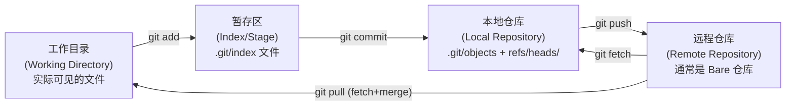
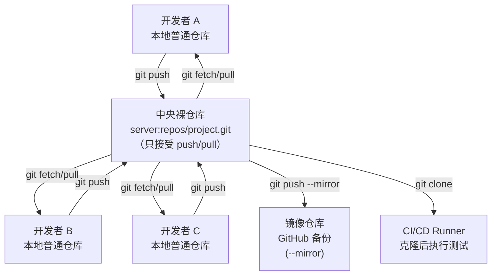

# Git 仓库类型与核心概念

## 1. Git 仓库的两种形态

Git 仓库在实际使用中存在两种形态，两者的目录结构和用途有本质区别：

| 对比维度 | 普通仓库（Working Repository） | 裸仓库（Bare Repository） |
|---------|------------------------------|--------------------------|
| **目录结构** | 包含 `项目文件 + .git/` 文件夹 | `.git` 文件夹内容直接暴露在根目录，无项目文件 |
| **工作目录（Working Tree）** | ✅ 有，可直接编辑和提交 | ❌ 无，无法执行 `git checkout`、`git commit` 等修改命令 |
| **典型命名** | `project-name/` | `project-name.git/`（约定俗成的 `.git` 后缀） |
| **适用场景** | 开发者本地工作、日常开发 | 中央共享仓库（GitHub/GitLab/自建服务器）、镜像备份、CI/CD 触发源 |
| **接受推送（git push）** | 非推荐（可能造成工作目录混乱，默认拒绝推送到当前检出分支） | ✅ 设计用途就是接受 push/pull |

### 1.1 普通仓库目录结构

```
my-project/               ← 工作目录（Working Directory）
├── .git/                 ← Git 元数据目录（Git Directory）
│   ├── HEAD              # 当前检出分支指针
│   ├── config            # 仓库级配置
│   ├── objects/          # 所有 Git 对象（blob/tree/commit/tag）
│   ├── refs/             # 分支与标签引用
│   │   ├── heads/        # 本地分支
│   │   └── tags/         # 标签
│   ├── index             # 暂存区（Stage）
│   └── hooks/            # Git 钩子脚本
├── src/                  ← 用户项目文件
├── tests/
└── README.md
```

### 1.2 裸仓库目录结构

```
my-project.git/           ← 无工作目录，Git 目录内容直接暴露
├── HEAD                  # 默认分支指针
├── config                # 仓库级配置
├── objects/              # 所有 Git 对象
├── refs/                 # 分支与标签引用
├── hooks/                # Git 钩子脚本（pre-receive、post-receive 等服务器端钩子）
├── description           # 仓库描述（GitWeb 使用）
└── packed-refs           # 打包后的引用（GC 后生成）
```

> **关键理解**：裸仓库本质上就是普通仓库中 `.git/` 文件夹的内容独立出来成为一个仓库。`git clone --bare` 做的事情就是只复制 `.git/` 部分，不复制工作目录文件。

## 2. Git 目录与工作目录的关系

理解 Git 的基本架构是掌握高级命令的前提：



## 3. 本地克隆的默认优化机制

当源仓库和目标仓库在**同一台机器的文件系统**上时（即 `git clone /path/to/source` 这种本地路径克隆），Git 为了提高效率和节省磁盘空间，默认会使用**硬链接（Hard Link）**优化：

### 3.1 硬链接优化原理

- **文件级别共享**：`objects/` 目录下的 Git 对象文件（blob/tree/commit）默认通过硬链接共享，而不是复制一份
- **节省磁盘**：一个 1GB 的仓库如果克隆 10 次，使用硬链接只占用 ~1GB 空间，否则需要 ~10GB
- **速度优势**：跳过文件复制 I/O，本地克隆几乎瞬间完成
- **写入时复制**：当后续有新的提交写入时，新对象仍是独立文件，不影响源

### 3.2 为什么需要 `--no-local`

硬链接虽然高效，但在以下场景下会产生问题：

| 场景 | 问题 | 使用 `--no-local` 的原因 |
|------|------|------------------------|
| **磁盘备份/离线归档** | 硬链接的文件在同一文件系统上，源损坏则备份失效 | 强制复制所有对象文件，获得真正独立的副本 |
| **文件系统迁移测试** | 跨分区/跨磁盘的克隆，硬链接可能失败或回退到复制 | 显式指定使用传输协议，行为可预测 |
| **CI/CD 隔离环境** | 共享对象可能导致并发写入冲突（极端情况） | 保证仓库完全独立，不受源仓库影响 |
| **仓库完整性验证** | 需要模拟远程克隆的行为进行测试 | 不使用本地优化，与真实网络行为一致 |
| **多文件系统实验** | 测试 Git 在不同存储介质上的行为 | 强制走 pack 传输，验证完整性 |

> **使用边界**：`--no-local` 仅在克隆**本地文件系统路径**时生效。对远程 URL（`https://`、`git@`、`ssh://` 等）无效，因为远程克隆本来就不会使用硬链接优化。

## 4. Git 四类传输协议

`--local` / `--no-local` 的差异本质上是选择不同的传输层。Git 支持四类协议：

| 协议类型 | 格式示例 | 是否本地优化 | 典型用途 |
|---------|---------|------------|---------|
| **Local 协议** | `/path/to/repo.git`、`file:///path/to/repo.git` | ✅ 默认硬链接（file:// 除外） | 本机路径快速克隆 |
| **HTTP/HTTPS 协议** | `https://github.com/user/repo.git` | ❌ 无 | 公开仓库匿名克隆 |
| **SSH 协议** | `git@github.com:user/repo.git`、`ssh://user@host/path` | ❌ 无 | 认证后的读写操作 |
| **Git 协议** | `git://host/path/repo.git` | ❌ 无 | 内网高速只读镜像（9418 端口） |

### 4.1 Local 协议的两种变体

1. **路径形式**（`/path/to/repo`）：默认启用硬链接优化，`--no-local` 可禁用
2. **file:// 形式**（`file:///path/to/repo`）：即使是本地路径也走 pack 传输，相当于自动启用了 `--no-local`

## 5. 何时使用裸仓库

裸仓库的设计定位是**协作枢纽**，而非直接编辑：



裸仓库的典型应用场景：
- ✅ **中央服务器仓库**：团队协作的唯一真相来源
- ✅ **镜像同步**：`--mirror` 参数（隐含 `--bare`）完整复制所有 refs
- ✅ **CI/CD 触发源**：post-receive 钩子触发构建流水线
- ✅ **离线归档**：仓库备份与长期保存
- ✅ **仓库迁移中间态**：格式转换、历史重写的临时存储

---

**下一章**：[01-git-clone-advanced.md](01-git-clone-advanced.md) — 深入讲解 `git clone` 三个高级参数的组合使用与场景。
