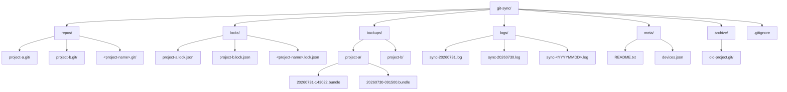

# 百度网盘 Git 同步空间目录结构

本文档定义百度网盘同步空间的标准目录布局，用于实现多设备间 Git 仓库的安全同步。

## 目录层次结构图



## 全局命名规则

1. **路径字符限制**：所有目录名和文件名仅使用小写字母（a-z）、数字（0-9）和连字符（-）
2. **禁止字符**：不使用空格、中文、下划线（_）、点号（.）开头、特殊字符（!@#$%^&*()等）
3. **跨平台兼容**：确保在 Windows、macOS、Linux 三大操作系统下均合法
4. **大小写敏感**：统一使用小写，避免跨平台大小写冲突

## 各目录详细说明

### repos/ —— 中央裸仓库区

| 属性 | 说明 |
|------|------|
| **用途** | 存储所有 Git 裸仓库（bare repository），作为多设备同步的中央枢纽 |
| **命名约定** | 每个仓库目录命名为 `<project-name>.git`，例如 `my-project.git`、`docs-repo.git` |
| **生命周期** | 永久存储，除非仓库被废弃移入 archive/ |
| **操作规则** | 禁止直接在此目录下执行工作区操作；通过 `git clone`、`git push`、`git fetch` 交互 |
| **权限要求** | 所有设备对该目录具有读写权限 |

**示例结构**：
```
repos/
├── spec-weave.git/
├── personal-notes.git/
└── configs.git/
```

### locks/ —— 锁文件区

| 属性 | 说明 |
|------|------|
| **用途** | 存储仓库操作锁文件，防止多设备同时写入导致数据损坏 |
| **命名约定** | 每个锁文件命名为 `<project-name>.lock.json`，与 repos/ 下的仓库一一对应 |
| **生命周期** | 临时文件，操作完成后立即释放；异常退出时需手动清理超时锁 |
| **内容格式** | JSON 格式，包含设备 ID、获取时间、操作类型、进程 PID 等元数据 |
| **锁超时** | 默认 30 分钟超时，超时后其他设备可强制获取锁 |

**锁文件内容示例**：
```json
{
  "device_id": "laptop-win-01",
  "acquired_at": "2026-07-31T14:30:22+08:00",
  "operation": "push",
  "pid": 12345,
  "hostname": "LAPTOP-ABC123"
}
```

### backups/ —— Bundle 备份区

| 属性 | 说明 |
|------|------|
| **用途** | 存储 Git bundle 格式的备份文件，用于灾难恢复和历史回溯 |
| **目录组织** | 按项目分子目录：`<project-name>/<YYYYMMDD-HHMMSS>.bundle` |
| **命名约定** | bundle 文件名使用 UTC+8 时间戳，精确到秒，格式 `YYYYMMDD-HHMMSS` |
| **生命周期** | 保留最近 30 天的备份，超过 30 天的自动清理；重大操作前手动创建永久备份 |
| **创建时机** | 每次 push 操作前自动创建备份；手动执行 `git bundle create` 可创建备份 |

**示例结构**：
```
backups/
├── spec-weave/
│   ├── 20260731-143022.bundle
│   └── 20260730-091500.bundle
└── personal-notes/
    └── 20260731-100511.bundle
```

### logs/ —— 操作日志区

| 属性 | 说明 |
|------|------|
| **用途** | 记录所有同步操作日志，用于问题排查和审计 |
| **命名约定** | 按日期组织，文件名格式为 `sync-<YYYYMMDD>.log` |
| **生命周期** | 日志文件保留 90 天，超过 90 天自动归档或删除 |
| **日志格式** | 每行一条记录，包含时间戳、设备 ID、操作类型、仓库名、结果状态、消息 |
| **轮转策略** | 每日生成新日志文件；单文件超过 10MB 时触发轮转 |

**日志行示例**：
```
[2026-07-31T14:30:22+08:00] [laptop-win-01] [PUSH] spec-weave.git SUCCESS "12 objects pushed"
[2026-07-31T14:35:10+08:00] [desktop-mac-02] [FETCH] personal-notes.git SUCCESS "3 objects fetched"
```

### meta/ —— 设备注册元数据区

| 属性 | 说明 |
|------|------|
| **用途** | 存储设备注册信息、配置元数据和说明文档 |
| **核心文件** | `README.txt`（目录用途说明）、`devices.json`（已注册设备列表） |
| **生命周期** | 永久存储；设备注册/注销时更新 `devices.json` |
| **管理方式** | 首次初始化时生成 README.txt；设备注册由 sync 脚本自动管理 |

**devices.json 示例**：
```json
{
  "devices": [
    {
      "id": "laptop-win-01",
      "name": "工作笔记本",
      "os": "windows",
      "hostname": "LAPTOP-ABC123",
      "registered_at": "2026-07-01T10:00:00+08:00",
      "last_seen": "2026-07-31T14:30:22+08:00"
    }
  ]
}
```

### archive/ —— 废弃仓库归档区

| 属性 | 说明 |
|------|------|
| **用途** | 归档不再使用的仓库，保留历史但不参与日常同步 |
| **命名约定** | 与 repos/ 保持一致，命名为 `<project-name>.git`；可追加归档日期后缀如 `<project-name>-20260731.git` |
| **生命周期** | 永久归档；如需恢复可移回 repos/ 目录 |
| **归档规则** | 超过 6 个月无活动的仓库可归档；归档前必须创建完整 bundle 备份 |
| **同步策略** | 归档目录默认不同步到新设备，按需手动拉取 |

## 根目录文件

### .gitignore

根目录的 `.gitignore` 文件用于忽略临时文件，规则如下：

```gitignore
# 忽略临时文件
*.tmp
*.temp
*.swp
*.swo
*~

# 忽略锁文件本身（但保留 locks/ 目录结构）
locks/*.lock.json
!locks/.gitkeep

# 忽略操作系统生成的文件
.DS_Store
Thumbs.db
Desktop.ini

# 忽略编辑器临时文件
.vscode/
.idea/
```

**注意**：通过在 locks/ 目录下放置 `.gitkeep` 文件（或保持目录非空）来确保目录结构被保留。

## 初始化验证清单

初始化完成后，应满足以下条件：

- [ ] 所有 6 个一级子目录（repos/、locks/、backups/、logs/、meta/、archive/）存在
- [ ] meta/README.txt 存在且包含目录说明
- [ ] 根目录 .gitignore 存在且配置正确
- [ ] locks/ 目录下有 `.gitkeep` 以保留空目录结构
- [ ] 目录命名全部符合小写+连字符规则
- [ ] 脚本可重复执行，不报错、不覆盖已有文件
