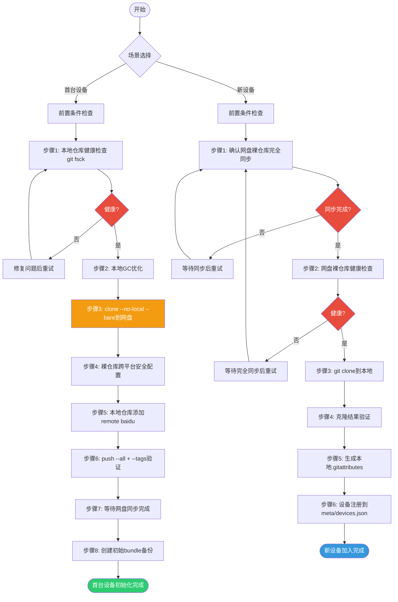

# Git 网盘仓库初始化与新设备加入工作流

本文档详细描述两种核心场景的完整操作流程：
1. **首台设备初始化**：将本地已有工作仓库注册到百度网盘同步空间
2. **新设备加入**：在新设备上从网盘裸仓库克隆工作副本

## 总体流程图



---

## 第一部分：首台设备初始化

### 前置条件

在执行初始化流程前，必须满足以下条件：

| 条件 | 验证方法 |
|------|---------|
| 已执行 `init-sync-dir` 初始化网盘同步目录 | 确认 `repos/`、`backups/`、`meta/` 等子目录存在 |
| 已执行 `setup-git-config` 配置跨平台 Git 全局设置 | `git config core.autocrlf` 输出正确（Windows=`true`，macOS/Linux=`input`） |
| 本地已有工作仓库且处于可工作状态 | `git status` 输出干净或了解当前未提交状态 |
| 仓库内无未跟踪的敏感文件 | 检查 `.gitignore` 是否配置完整 |

---

### 步骤 1：确认本地仓库健康

**命令**：
```bash
cd /path/to/your/local/repo
git fsck --full --strict
```

**预期输出**：
```
Checking object directories: 100% (256/256), done.
Checking objects: 100% (1234/1234), done.
Verifying commits in commit graph: 100% (123/123), done.
Checking connectivity: 1234, done.
```

**检查点**：
- [ ] 无 `error:` 或 `fatal:` 开头的错误信息
- [ ] 无 `dangling commit` 之外的警告（dangling 对象是正常的，GC 时会清理）
- [ ] 退出码为 0

**常见问题处理**：
- 如果出现 `error: object file ... is empty` 或 `error: unable to find ...`，说明本地仓库已损坏，需要先从其他备份恢复或手动修复
- 如果出现大量 `warning: there are too many unreachable loose objects`，继续执行步骤 2 的 GC 即可

---

### 步骤 2：执行本地 GC 优化

**什么时候不需要 `--aggressive`**：
- 仓库刚创建不久（少于 100 次提交）
- 最近 1-2 周内已经执行过 `git gc`
- 仓库体积较小（小于 50MB）
- 时间紧张，`--aggressive` 会显著增加执行时间

**常规 GC（推荐大多数情况）**：
```bash
git gc
```

**Aggressive GC（推荐首次初始化时执行一次）**：
```bash
git gc --aggressive --prune=now
```

**预期输出**：
```
Counting objects: 1234, done.
Delta compression using up to 8 threads.
Compressing objects: 100% (500/500), done.
Writing objects: 100% (1234/1234), done.
Total 1234 (delta 700), reused 1234 (delta 700)
Removing duplicate objects: 100% (256/256), done.
```

**检查点**：
- [ ] 命令执行完成无报错
- [ ] 执行后 `ls .git/objects/pack/*.pack | wc -l` 应输出 1（或最多 2 个）
- [ ] `find .git/objects -type f -name "[0-9a-f]*" | wc -l` 松散对象数量显著减少

---

### 步骤 3：创建裸仓库到网盘

**命令**：
```bash
# 变量设置（根据实际情况修改）
SYNC_ROOT="/path/to/git-sync"       # 网盘同步根目录
REPO_NAME="my-project"              # 仓库名称（小写+连字符）
BARE_REPO="${SYNC_ROOT}/repos/${REPO_NAME}.git"

# 克隆为裸仓库（--no-local 确保不使用硬链接，真正复制所有对象）
git clone --no-local --bare . "$BARE_REPO"
```

**Windows PowerShell 示例**：
```powershell
$SyncRoot = "D:\BaiduSync\git-sync"
$RepoName = "my-project"
$BareRepo = Join-Path $SyncRoot "repos\$RepoName.git"

git clone --no-local --bare . $BareRepo
```

**预期输出**：
```
Cloning into bare repository '/path/to/git-sync/repos/my-project.git'...
done.
```

**检查点**：
- [ ] 目标目录 `repos/<name>.git/` 已创建
- [ ] 目录内存在 `HEAD`、`config`、`objects/`、`refs/` 等裸仓库标准结构
- [ ] 目录中不存在 `hooks/*.sample` 以外的工作区文件
- [ ] `git -C "$BARE_REPO" rev-parse --is-bare-repository` 输出 `true`

---

### 步骤 4：为网盘裸仓库设置跨平台安全配置

网盘裸仓库会被多个操作系统访问，必须使用最保守的跨平台设置。

**命令**：
```bash
cd "$BARE_REPO"

# 跨平台安全配置（所有平台统一设置）
git config --local core.filemode false
git config --local core.symlinks false
git config --local core.ignorecase true
git config --local gc.auto 6700
git config --local gc.autopacklimit 1
git config --local core.preloadindex true
```

**预期输出**：无输出（成功）

**检查点**：
- [ ] `git config core.filemode` → `false`
- [ ] `git config core.symlinks` → `false`
- [ ] `git config gc.autopacklimit` → `1`
- [ ] 在裸仓库内再次执行 `git fsck --full` 无错误

**配置说明**：
| 配置项 | 值 | 理由 |
|--------|---|------|
| `core.filemode=false` | 所有平台统一 | Windows 不支持 Unix 权限位，统一关闭避免权限位漂移 |
| `core.symlinks=false` | 所有平台统一 | Windows 创建 symlink 需要管理员权限，网盘同步可能异常 |
| `core.ignorecase=true` | 所有平台统一 | 避免 Linux 上仅大小写不同的文件同步到 Windows 后丢失 |
| `gc.autopacklimit=1` | 所有平台统一 | 保持 pack 文件最少，降低网盘同步冲突概率 |

---

### 步骤 5：为本地工作仓库添加 remote

**推荐命名约定**：使用 `baidu` 或 `sync` 作为 remote 名称，**不要使用 `origin`**。

**为什么不用 `origin`**：
1. `origin` 通常指 GitHub/GitLab 等远程代码托管平台
2. 使用 `baidu` 明确表示这是百度网盘同步通道
3. 避免与真正的远程 origin 混淆，防止误推送到错误位置
4. 可以同时配置 `origin`（GitHub）和 `baidu`（网盘）两个 remote，互不干扰
5. 脚本和文档中统一命名，降低协作沟通成本

**命令**：
```bash
# 回到本地工作仓库
cd /path/to/your/local/repo

# 添加 remote（注意路径格式，见下文说明）
git remote add baidu "$BARE_REPO"

# 或者使用 file:// 协议（推荐，与普通 clone 行为一致）
# git remote add baidu "file://${BARE_REPO}"
```

**Windows 路径格式说明**：

Git 在 Windows 上支持多种路径格式，推荐：
```powershell
# 方式1：使用正斜杠（最兼容）
git remote add baidu "D:/BaiduSync/git-sync/repos/my-project.git"

# 方式2：file:// 协议 + 正斜杠
git remote add baidu "file:///D:/BaiduSync/git-sync/repos/my-project.git"

# 方式3：反斜杠需要转义（不推荐，容易出错）
git remote add baidu "D:\\BaiduSync\\git-sync\\repos\\my-project.git"
```

**macOS/Linux 路径格式**：
```bash
# 标准 Unix 路径
git remote add baidu "/Users/xxx/BaiduSync/git-sync/repos/my-project.git"

# 或 file:// 协议
git remote add baidu "file:///Users/xxx/BaiduSync/git-sync/repos/my-project.git"
```

**路径含空格的处理**：
```bash
# 路径含空格时用引号包裹即可
git remote add baidu "/path/with spaces/my project.git"
```

**检查点**：
- [ ] `git remote -v` 列出 `baidu` remote，fetch 和 push 地址正确
- [ ] `git ls-remote baidu` 无报错（能列出远程引用）
- [ ] 没有误覆盖已有的 `origin` remote（如果存在）

---

### 步骤 6：验证 push

**推送所有分支**：
```bash
git push baidu --all
```

**推送所有标签**：
```bash
git push baidu --tags
```

**预期输出（示例）**：
```
Counting objects: 1234, done.
Delta compression using up to 8 threads.
Compressing objects: 100% (500/500), done.
Writing objects: 100% (1234/1234), 1.23 MiB | 5.00 MiB/s, done.
Total 1234 (delta 700), reused 0 (delta 0)
To /path/to/git-sync/repos/my-project.git
 * [new branch]      main -> main
 * [new branch]      develop -> develop
```

**检查点**：
- [ ] 所有本地分支都已推送（对比 `git branch` 和 `git -C "$BARE_REPO" branch` 列表一致）
- [ ] 所有标签都已推送：`git tag` 与 `git -C "$BARE_REPO" tag` 列表一致
- [ ] push 无 `error:` 或 `rejected` 信息
- [ ] 再次执行 `git push baidu --all` 输出 `Everything up-to-date`

---

### 步骤 7：等待网盘同步完成

这是**最容易被忽略但最关键**的一步。push 完成后，文件只是写入了本地网盘缓存目录，网盘客户端需要时间将文件上传到云端。

**操作**：
1. 打开百度网盘客户端，查看同步状态
2. 等待所有文件上传完成（同步图标变为对勾）
3. 观察网盘目录大小，在 1-2 分钟内保持稳定不再变化
4. **手动确认**：按脚本提示按回车确认同步完成，或等待足够时间

**检查点（确认同步完成）**：
- [ ] 百度网盘客户端显示同步完成（无正在上传的文件）
- [ ] 在文件资源管理器/访达中观察 `repos/<name>.git/` 目录大小，连续 1 分钟无变化
- [ ] 目录中不存在 `.tmp`、`.temp`、`*.baiduyun.downloading` 等临时文件
- [ ] 目录中不存在 `*.lock` 文件（Git 锁文件）

**⚠️ 警告**：如果在网盘未完全同步时就在新设备上克隆，极有可能克隆到半同步状态的损坏仓库，导致对象缺失等致命错误！

---

### 步骤 8：创建初始 bundle 备份

Bundle 文件是 Git 仓库的单文件归档，可用于灾难恢复。

**命令**：
```bash
# 创建备份目录
BACKUP_DIR="${SYNC_ROOT}/backups/${REPO_NAME}"
mkdir -p "$BACKUP_DIR"

# 生成时间戳（UTC+8）
TIMESTAMP=$(date +%Y%m%d-%H%M%S)
BUNDLE_PATH="${BACKUP_DIR}/${TIMESTAMP}.bundle"

# 创建 bundle（包含所有分支和标签）
git -C "$BARE_REPO" bundle create "$BUNDLE_PATH" --all
```

**Windows PowerShell 示例**：
```powershell
$BackupDir = Join-Path $SyncRoot "backups\$RepoName"
if (-not (Test-Path $BackupDir)) { New-Item -ItemType Directory -Path $BackupDir | Out-Null }

$Timestamp = Get-Date -Format "yyyyMMdd-HHmmss"
$BundlePath = Join-Path $BackupDir "$Timestamp.bundle"

git -C $BareRepo bundle create $BundlePath --all
```

**预期输出**：
```
Counting objects: 1234, done.
Delta compression using up to 8 threads.
Compressing objects: 100% (500/500), done.
Writing objects: 100% (1234/1234), done.
Total 1234 (delta 700), reused 0 (delta 0)
```

**检查点**：
- [ ] bundle 文件已创建，大小合理（与裸仓库 pack 文件大小相近）
- [ ] 验证 bundle 完整性：`git bundle verify "$BUNDLE_PATH"` 输出成功
- [ ] bundle 文件路径符合命名规范：`backups/<repo-name>/<YYYYMMDD-HHMMSS>.bundle`

---

## 第二部分：新设备加入

### 前置条件

| 条件 | 验证方法 |
|------|---------|
| 已执行 `init-sync-dir` 初始化网盘同步目录 | 确认 6 个一级子目录存在 |
| 已执行 `setup-git-config` 配置跨平台 Git 全局设置 | 检查 `core.autocrlf` 等关键配置 |
| 百度网盘已完成首次全量同步 | 等待网盘客户端显示"同步完成"，`repos/` 下能看到目标 `.git` 目录 |
| 本地不存在同名工作目录（避免冲突） | 检查目标路径不存在或为空 |

---

### 步骤 1：确认网盘裸仓库已完全同步

**检查临时文件**：
```bash
# macOS/Linux
ls -la "${SYNC_ROOT}/repos/${REPO_NAME}.git/" | grep -E '\.tmp$|\.lock$|downloading$|\.part$'
```

```powershell
# Windows PowerShell
Get-ChildItem -Recurse "$BareRepo" | Where-Object { $_.Name -match '\.tmp$|\.lock$|downloading$|\.part$' }
```

**检查目录大小稳定性**：
1. 记录当前裸仓库目录大小
2. 等待 2-3 分钟
3. 再次记录大小，如果大小不变则说明同步稳定

**预期结果**：无临时文件输出，目录大小稳定。

**检查点**：
- [ ] 裸仓库目录中无 `.tmp`、`.temp`、`*.lock`、`*.downloading`、`*.part` 文件
- [ ] 裸仓库目录大小连续 2 分钟以上无变化
- [ ] 百度网盘客户端无"正在下载"提示
- [ ] `objects/pack/` 目录中存在 `.pack` 和对应的 `.idx` 文件，且 `.pack` 文件大小 > 0

**⚠️ 常见陷阱**：百度网盘可能显示"同步完成"但实际后台还在下载小文件。必须手动检查临时文件和目录大小稳定性！

---

### 步骤 2：健康检查网盘裸仓库

**命令**：
```bash
git -C "$BARE_REPO" fsck --full
```

**预期输出**：
```
Checking object directories: 100% (256/256), done.
Checking objects: 100% (1234/1234), done.
Verifying commits in commit graph: 100% (123/123), done.
```

**检查点**：
- [ ] 无 `error:` 或 `fatal:` 错误
- [ ] `missing blob`、`missing tree`、`missing commit` 字样不出现
- [ ] 退出码为 0
- [ ] `git -C "$BARE_REPO" log --oneline -1` 能正常显示最新提交

**如果 fsck 失败**：
1. 不要继续克隆！使用损坏的仓库克隆会导致本地副本也损坏
2. 等待网盘继续同步（可能还有文件未下载完）
3. 如果长时间（>10 分钟）仍然失败，回到首台设备重新 push 或从 bundle 恢复
4. 极端情况下：删除本地网盘缓存的裸仓库目录，让网盘重新从云端下载

---

### 步骤 3：从网盘裸仓库克隆

**命令**：
```bash
# 设置目标路径
TARGET_DIR="$HOME/projects/${REPO_NAME}"

# 执行克隆
git clone "$BARE_REPO" "$TARGET_DIR"
```

**Windows PowerShell**：
```powershell
$TargetDir = Join-Path $env:USERPROFILE "projects\$RepoName"
git clone $BareRepo $TargetDir
```

**预期输出**：
```
Cloning into '/home/user/projects/my-project'...
done.
```

**检查点**：
- [ ] 目标目录已创建，包含工作区文件
- [ ] 目标目录内存在 `.git/` 子目录
- [ ] clone 过程无 `error` 或 `fatal` 信息
- [ ] clone 速度正常（裸仓库在本地网盘目录，应该很快）

---

### 步骤 4：验证克隆结果

**验证命令**：
```bash
cd "$TARGET_DIR"

# 检查最新提交
echo "=== 最新提交 ==="
git log --oneline -5

# 检查工作区状态
echo "=== 工作区状态 ==="
git status

# 检查 remote 配置
echo "=== Remote 配置 ==="
git remote -v

# 检查分支列表
echo "=== 分支列表 ==="
git branch -a
```

**预期输出要点**：
- `git log` 显示与首台设备一致的提交历史
- `git status` 显示 "nothing to commit, working tree clean"
- `git remote -v` 显示 `origin` 指向网盘裸仓库路径
- `git branch -a` 显示所有分支（本地分支 + 远程分支）

**检查点**：
- [ ] 提交历史完整，最新提交 hash 与首台设备一致
- [ ] 工作区干净，无意外的 modified 文件
- [ ] remote `origin`（或脚本自动重命名为 `baidu`）地址正确
- [ ] 所有分支都能看到

**关于 remote 名称**：
克隆后默认 remote 名称是 `origin`。如果你希望与首台设备保持一致使用 `baidu`：
```bash
git remote rename origin baidu
```

---

### 步骤 5：生成本地 .gitattributes（如需要）

如果仓库还没有 `.gitattributes` 文件，建议生成一份以确保跨平台换行符一致性。

**方法 1：使用 setup-git-config 脚本**：
```bash
# 进入克隆后的仓库目录
cd "$TARGET_DIR"

# 调用脚本生成模板（脚本路径根据实际位置调整）
/path/to/setup-git-config.sh --attributes
# Windows: .\setup-git-config.ps1 -Attributes
```

**方法 2：手动创建**：
参考 [02-cross-platform-config.md](02-cross-platform-config.md#gitattributes-模板) 中的完整模板。

**检查点**：
- [ ] 如果已存在 `.gitattributes`，确认其内容完整覆盖关键文件类型
- [ ] 如果新生成了 `.gitattributes`，首次提交时执行 `git add --renormalize .` 归一化换行符
- [ ] Shell 脚本（`*.sh`）在 macOS/Linux 上换行符为 LF
- [ ] PowerShell 脚本（`*.ps1`）换行符为 CRLF

---

### 步骤 6：设备注册到 meta/devices.json

**设备 ID 命名建议**：
- 格式：`<用途>-<os>-<序号>`，全小写连字符
- 示例：`work-win-01`（工作用 Windows 笔记本）、`home-mac-02`（家用 Mac）、`server-linux-01`（Linux 服务器）

**读取现有 devices.json**：
```bash
DEVICES_JSON="${SYNC_ROOT}/meta/devices.json"
```

如果文件不存在，创建初始结构：
```json
{
  "devices": []
}
```

**注册新设备（手动添加条目）**：
```json
{
  "devices": [
    {
      "id": "work-win-01",
      "name": "工作笔记本",
      "os": "windows",
      "hostname": "LAPTOP-ABC123",
      "registered_at": "2026-07-31T10:00:00+08:00",
      "last_seen": "2026-07-31T10:00:00+08:00",
      "sync_root": "D:/BaiduSync/git-sync"
    }
  ]
}
```

**字段说明**：
| 字段 | 说明 | 示例 |
|------|------|------|
| `id` | 设备唯一标识，全小写连字符 | `work-win-01` |
| `name` | 设备可读名称 | `工作笔记本` |
| `os` | 操作系统：`windows`/`macos`/`linux` | `windows` |
| `hostname` | 主机名（`hostname` 命令获取） | `LAPTOP-ABC123` |
| `registered_at` | 首次注册时间（ISO 8601） | `2026-07-31T10:00:00+08:00` |
| `last_seen` | 最后活跃时间 | `2026-07-31T10:00:00+08:00` |
| `sync_root` | 本设备上网盘同步根路径 | `D:/BaiduSync/git-sync` |

**检查点**：
- [ ] 设备 ID 唯一，不与已有设备重复
- [ ] JSON 格式合法（可用 `jq . devices.json` 验证）
- [ ] 文件保存后等待网盘同步到其他设备

---

## 路径适配说明

各设备上网盘同步根路径可能不同，以下是配置方法：

### 常见默认路径

| 平台 | 典型路径 |
|------|---------|
| Windows | `D:\BaiduSync\git-sync`、`C:\Users\<用户名>\BaiduSync\git-sync` |
| macOS | `~/BaiduSync/git-sync`、`~/Documents/BaiduSync/git-sync` |
| Linux | `~/BaiduNetdisk/git-sync`（官方客户端）、`~/BaiduSync/git-sync`（非官方） |

### 配置方法

**方法 1：环境变量（推荐，脚本自动识别）**

在 shell 配置文件中设置：
```bash
# macOS/Linux: ~/.bashrc 或 ~/.zshrc
export GIT_SYNC_ROOT="$HOME/BaiduSync/git-sync"
```

```powershell
# Windows PowerShell: $PROFILE
$env:GIT_SYNC_ROOT = "D:\BaiduSync\git-sync"
```

使用时：
```bash
git remote add baidu "$GIT_SYNC_ROOT/repos/my-project.git"
```

**方法 2：Git 全局配置**
```bash
# 设置全局自定义配置
git config --global sync.baiduroot "/path/to/git-sync"

# 使用时读取
SYNC_ROOT=$(git config sync.baiduroot)
```

**方法 3：脚本参数（最直接）**
执行脚本时通过 `-SyncRoot` 参数显式指定，不依赖环境。

---

## 常见初始化问题

### Q1：路径含空格导致命令失败

**症状**：
```
fatal: too many arguments
```

**原因**：路径中有空格但未加引号。

**解决**：始终用引号包裹路径变量：
```bash
# 错误
git clone $BARE_REPO $TARGET_DIR

# 正确
git clone "$BARE_REPO" "$TARGET_DIR"
```

### Q2：Windows 上权限不足无法写入网盘目录

**症状**：
```
error: could not lock config file ... Permission denied
```

**原因**：
- 网盘文件被其他进程锁定（网盘客户端正在同步）
- 目录权限不正确
- 杀毒软件正在扫描文件

**解决**：
1. 等待网盘同步完成，文件锁释放
2. 以管理员身份运行 PowerShell/终端
3. 临时关闭杀毒软件实时防护（添加排除项更安全）
4. 检查目录 NTFS 权限，确保当前用户有写入权限

### Q3：裸仓库未完全同步就克隆导致对象缺失

**症状**：
```
error: unable to read ...
fatal: incomplete object
```

**原因**：新设备上百度网盘还在下载裸仓库文件时就执行了 clone。

**解决**：
1. **立即停止操作**，不要在损坏的克隆上继续工作
2. 删除克隆出来的损坏工作目录
3. 回到步骤 1，耐心等待网盘完全同步
4. 执行 `git fsck` 确认裸仓库健康后再克隆
5. 如果裸仓库本身已损坏，从首台设备重新推送或从 bundle 恢复

### Q4：push 时提示 "remote: error: refusing to update checked out branch"

**原因**：目标仓库不是裸仓库（是带工作区的普通仓库）。

**解决**：
1. 确认目标路径以 `.git` 结尾且是用 `git clone --bare` 创建的
2. 验证：`git -C <repo-path> rev-parse --is-bare-repository` 必须输出 `true`
3. 如果不是裸仓库，删除后重新按步骤 3 创建裸仓库

### Q5：克隆后所有文件都显示 modified

**原因**：跨平台换行符配置不一致。

**解决**：
1. 确认已执行 `setup-git-config` 设置正确的 `core.autocrlf`
2. 仓库根目录存在正确的 `.gitattributes`
3. 执行归一化：
   ```bash
   git add --renormalize .
   git commit -m "renormalize line endings"
   ```

### Q6：Windows 上提示 "Filename too long"

**原因**：Windows 默认路径长度限制 260 字符。

**解决**：
```powershell
git config --global core.longpaths true
```
（`setup-git-config` 脚本已自动设置此项）
