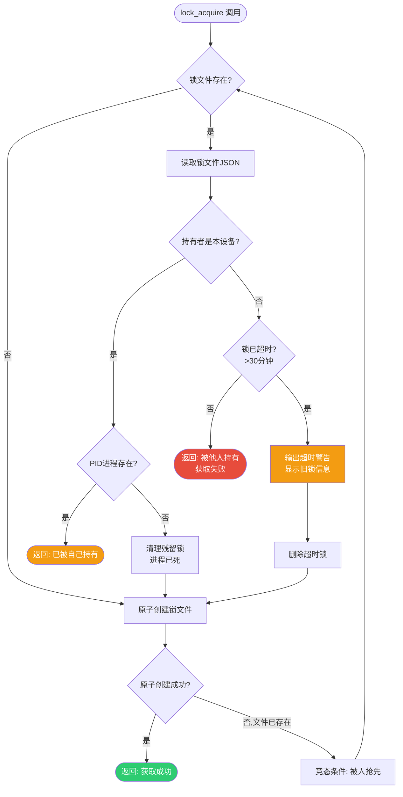

# Git 网盘同步锁机制设计与实现

本文档详细描述百度网盘多设备 Git 同步系统中的分布式锁机制，包括锁的设计原理、文件格式、生命周期、算法伪代码、超时策略及局限性说明。

---

## 1. 为什么需要锁机制

### 1.1 单写者原则

Git 裸仓库本质上**不是为多写者并发设计**的。虽然 Git 本身是分布式版本控制系统，但 `git push` 操作写入裸仓库时存在竞态条件：
- 多个进程同时更新 `refs/heads/<branch>` 可能导致引用丢失
- `objects/pack/` 目录下的 pack 文件并发写入可能损坏对象数据库
- Git 自身的 `.lock` 文件机制依赖本地文件系统的原子操作，无法跨网络同步工作

### 1.2 网盘最终一致性风险

百度网盘等同步工具采用**最终一致性模型**而非强一致性：
- 文件写入本地缓存后需要时间（几秒到几分钟）上传到云端
- 多设备同时 push 时，后同步的版本会静默覆盖先同步的版本
- 网盘客户端没有 Git 语义感知，不会检测并发写入冲突
- 裸仓库的二进制对象文件冲突无法自动合并，直接导致仓库损坏

### 1.3 锁机制的目标

锁机制的核心目标是**在不可靠的最终一致性存储上实现协作纪律**：
- 本地层面：防止同一设备多个终端窗口同时执行 push/sync 操作
- 跨设备层面：通过锁文件同步提供"有人正在操作"的警告信号
- 兜底保护：超时机制防止进程崩溃导致的永久死锁

---

## 2. 锁文件格式定义

锁文件采用 JSON 格式存储在 `locks/` 目录，命名规则为 `<repo-name>.lock.json`。

### 2.1 完整字段定义

| 字段 | 类型 | 必填 | 说明 | 示例 |
|------|------|------|------|------|
| `device_id` | string | ✅ | 设备唯一标识，格式：`<hostname>-<os>-<序号>` | `laptop-win-01` |
| `pid` | number | ✅ | 获取锁的进程 ID | `12345` |
| `acquired_at` | string | ✅ | 锁获取时间，ISO8601 格式带时区偏移 | `2026-07-31T14:30:00+08:00` |
| `operation` | string | ✅ | 正在执行的操作类型：`push`/`pull`/`sync`/`gc`/`bundle` | `push` |
| `hostname` | string | ✅ | 机器主机名（冗余存储便于排查） | `LAPTOP-ABC123` |
| `script_version` | string | ✅ | 获取锁的脚本版本号 | `1.0.0` |
| `comment` | string | ❌ | 可选备注信息 | `紧急热修复推送` |

### 2.2 示例锁文件

```json
{
  "device_id": "work-mac-02",
  "pid": 45678,
  "acquired_at": "2026-07-31T14:30:00+08:00",
  "operation": "push",
  "hostname": "MacBook-Pro.local",
  "script_version": "1.0.0",
  "comment": "release v2.1.0"
}
```

---

## 3. 锁生命周期

```
获取(acquire) → 持有(hold) → 释放(release)
     ↓              ↓             ↑
  原子创建     操作执行期间    正常结束删除
     ↓              ↓
  失败退出      异常崩溃
                    ↓
              超时清理(timeout)
```

### 3.1 获取阶段（Acquire）

- 调用 `lock_acquire <repo> <operation>`
- 以**原子方式**创建锁文件（Bash: `set -o noclobber`，PowerShell: `New-Item -ErrorAction Stop`）
- 如果文件已存在：
  - 检查是否为自己持有（同 device_id + pid 存在）→ 返回已持有状态
  - 检查是否超时 → 自动清理后重试获取
  - 被他人持有且未超时 → 获取失败，返回错误
- 原子创建是保证锁正确性的核心：文件系统保证同一时刻只有一个进程能创建同名文件

### 3.2 持有阶段（Hold）

- 锁获取成功后，执行实际的 Git 操作（push/pull/sync 等）
- **持有锁期间不做任何网盘同步等待检查**——因为锁的目的是阻止其他操作开始，当前操作本身是安全的
- 脚本异常退出（Ctrl+C、kill、断电）可能导致锁文件残留，由超时机制处理

### 3.3 释放阶段（Release）

- 操作完成（无论成功失败）后，**必须**调用 `lock_release <repo>`
- 验证锁确实是自己持有的，防止误删他人的锁
- 删除锁文件
- 锁释放后等待网盘同步完成，其他设备才能看到锁已释放

### 3.4 超时机制（Timeout）

- 默认超时时间：**30 分钟**（可通过环境变量 `GIT_SYNC_LOCK_TIMEOUT` 配置，单位：分钟）
- 任何时候发现锁文件：
  1. 解析 `acquired_at` 时间戳
  2. 与当前时间对比（转换为 epoch 秒数，自动处理时区）
  3. 超过超时阈值 → 判定为超时锁
- 超时锁清理前**必须输出警告信息**到 stderr，包含旧锁持有者信息

---

## 4. 锁的双重作用

### 4.1 本地强锁：防止同设备并发

在**同一台设备**上，锁是真正的强互斥锁：
- 同一时刻只有一个终端/脚本能获取该仓库的锁
- 原子文件创建操作由操作系统保证正确性
- 即使你开 5 个终端窗口同时执行 push，只有第一个能成功
- 这是 100% 可靠的本地保护

### 4.2 跨设备弱信号：警告而非强锁

在**不同设备**之间，锁只是一个**警告信号**，**不是强一致锁**：
- 设备 A 获取锁后，锁文件需要通过网盘同步到设备 B（延迟不确定）
- 设备 B 在同步完成前看不到锁，仍可能获取锁并执行 push
- 锁同步到其他设备后，其他设备的脚本会检测到锁存在并**拒绝操作**
- 这是一种"尽量检测"的协作机制，不是分布式事务级别的强锁

> **重要认知**：跨设备锁的有效性依赖于"操作前检查 + 等待同步"的人工纪律。脚本可以检测冲突，但无法在网盘最终一致性模型下 100% 阻止并发。

---

## 5. 锁算法伪代码

### 5.1 acquire 操作

```
function lock_acquire(repo_name, operation):
    lockfile = SYNC_ROOT + "/locks/" + repo_name + ".lock.json"
    my_device_id = get_or_create_device_id()
    my_pid = get_current_pid()
    now_iso = get_current_iso8601_with_timezone()
    hostname = get_hostname()

    // 第一步：检查现有锁状态
    if file_exists(lockfile):
        existing = read_json(lockfile)
        status = check_lock_status(existing)

        if status == HELD_BY_SELF:
            // 同设备同进程重入（正常，脚本内部可能递归调用）
            return SUCCESS_ALREADY_HELD

        if status == HELD_BY_OTHER:
            // 检查是否超时
            if is_timeout(existing.acquired_at):
                warn("发现超时锁，持有者: " + existing.device_id +
                     ", pid: " + existing.pid +
                     ", 获取时间: " + existing.acquired_at)
                force_remove(lockfile)
                // 清理后继续尝试获取
            else:
                error("锁已被持有: device=" + existing.device_id +
                      ", pid=" + existing.pid +
                      ", operation=" + existing.operation +
                      ", since=" + existing.acquired_at)
                return FAIL_LOCKED

        if status == HELD_BY_SELF_BUT_PID_DEAD:
            // 同设备但进程已死（上次崩溃残留）
            warn("发现本设备残留锁（进程已死），自动清理")
            force_remove(lockfile)
            // 继续尝试获取

    // 第二步：原子创建锁文件
    lock_content = {
        device_id: my_device_id,
        pid: my_pid,
        acquired_at: now_iso,
        operation: operation,
        hostname: hostname,
        script_version: SCRIPT_VERSION
    }

    try:
        atomic_create_file(lockfile, to_json(lock_content))
    catch ATOMIC_CREATE_FAILED:
        // 竞态：刚好被别人抢先了
        error("获取锁失败（竞态条件），请稍后重试")
        return FAIL_RACE_CONDITION

    return SUCCESS
```

### 5.2 release 操作

```
function lock_release(repo_name):
    lockfile = SYNC_ROOT + "/locks/" + repo_name + ".lock.json"

    if not file_exists(lockfile):
        warn("释放锁时文件不存在（可能已被超时清理）")
        return SUCCESS_ALREADY_RELEASED

    existing = read_json(lockfile)
    my_device_id = get_cached_device_id()
    my_pid = get_current_pid()

    // 安全检查：只释放自己持有的锁
    if existing.device_id != my_device_id:
        error("拒绝释放他人的锁！持有者: " + existing.device_id +
              ", 本设备: " + my_device_id)
        return FAIL_NOT_OWNER

    // 同设备但不同pid：警告但允许（可能是同设备其他终端残留）
    if existing.pid != my_pid:
        warn("释放同设备不同进程的锁（持有者pid: " + existing.pid + "）")

    remove_file(lockfile)
    return SUCCESS
```

### 5.3 check 操作

```
function lock_check(repo_name):
    lockfile = SYNC_ROOT + "/locks/" + repo_name + ".lock.json"

    if not file_exists(lockfile):
        print("无锁（可用）")
        return STATUS_UNLOCKED  // 0

    existing = read_json(lockfile)
    print_lock_info(existing)

    my_device_id = get_cached_device_id_or_empty()

    if is_timeout(existing.acquired_at):
        print("状态: 超时（可安全清理或重新获取）")
        return STATUS_TIMEOUT  // 3

    if existing.device_id == my_device_id:
        // 进一步检查pid是否存在
        if pid_exists(existing.pid):
            print("状态: 被本设备持有")
            return STATUS_HELD_BY_SELF  // 1
        else:
            print("状态: 本设备残留锁（进程已退出）")
            return STATUS_TIMEOUT  // 3（进程已死视同超时）

    print("状态: 被其他设备持有")
    return STATUS_HELD_BY_OTHER  // 2
```

### 5.4 force_release 操作

```
function lock_force_release(repo_name, assume_yes=false):
    lockfile = SYNC_ROOT + "/locks/" + repo_name + ".lock.json"

    if not file_exists(lockfile):
        info("锁不存在，无需强制释放")
        return SUCCESS

    existing = read_json(lockfile)
    my_device_id = get_cached_device_id_or_empty()

    print("=== ⚠️  强制解锁警告 ===")
    print("仓库: " + repo_name)
    print("持有者 device_id: " + existing.device_id)
    print("持有者 hostname: " + existing.hostname)
    print("持有者 pid: " + existing.pid)
    print("操作类型: " + existing.operation)
    print("获取时间: " + existing.acquired_at)
    print("已持有: " + calculate_duration(existing.acquired_at) + " 分钟")

    if existing.device_id == my_device_id:
        print("提示: 这是本设备持有的锁")
    else:
        print("⚠️  警告: 这是其他设备持有的锁！")
        print("   强制释放可能导致并发push和仓库损坏！")
        print("   请确认持有者设备确实已离线/崩溃且不再操作！")

    if not assume_yes:
        confirm = input("确认强制释放？(输入 YES 继续): ")
        if confirm != "YES":
            info("用户取消操作")
            return FAIL_CANCELLED

    warn("执行强制释放锁: " + lockfile)
    remove_file(lockfile)
    warn("锁已强制释放。请等待网盘同步完成后再操作。")
    return SUCCESS
```

---

## 6. 超时策略

### 6.1 默认值与配置

| 参数 | 默认值 | 环境变量 | 说明 |
|------|--------|----------|------|
| 锁超时时间 | 30 分钟 | `GIT_SYNC_LOCK_TIMEOUT` | 正常 push 操作不应超过此时间 |
| 检查频率 | 获取锁时检查 | - | 不需要后台轮询，仅在操作前检查 |
| 超时清理前警告 | 必须输出 | - | 包含旧锁全部元信息 |

### 6.2 为什么是 30 分钟？

- 正常 push（即使是大仓库）+ 网盘同步等待通常在 5 分钟内完成
- 30 分钟是足够宽裕的阈值，减少误判超时的概率
- 如果确实需要更长操作（如首次推送大仓库），可临时设置环境变量调大超时
- 超时时间过短（如 5 分钟）容易把正常长操作误判为死锁
- 超时时间过长（如 24 小时）导致崩溃后锁长时间无法自动恢复

### 6.3 超时安全清理流程

```
发现超时锁 → 输出警告（全部锁信息）→ 删除锁文件 → 继续当前操作
     ↓
  [建议] 同时写入日志文件，记录超时事件供排查
```

超时清理是安全的，因为：
1. 超过 30 分钟说明原进程极有可能已经异常终止
2. 如果原进程还在运行，它在操作完成后执行 release 时会发现锁文件不存在，输出警告
3. 最坏情况是两个进程实际并发，这正是锁机制要阻止的情况，但超时锁说明原进程已经"失联"太久

---

## 7. 死锁检测与恢复

### 7.1 什么情况下会出现死锁/锁残留

| 场景 | 本地锁 | 跨设备锁可见性 | 恢复方式 |
|------|--------|----------------|----------|
| Ctrl+C 中断脚本 | ✅ 残留 | 其他设备看到锁 | 自动超时或下次操作检测到pid不存在自动清理 |
| 终端窗口直接关闭 | ✅ 残留 | 其他设备看到锁 | 自动超时 |
| 进程被 kill -9 | ✅ 残留 | 其他设备看到锁 | 自动超时 |
| 系统断电/崩溃 | ✅ 残留 | 重启后锁文件还在本地 | 下次操作检测到pid不存在自动清理 |
| 脚本正常完成但锁文件删除失败（罕见） | ✅ 残留 | 其他设备看到锁 | 自动超时 |
| 持有锁期间设备断网/关机 | ✅ 本地残留 | ⚠️ 锁可能还未同步到云端！其他设备看不到锁 | 设备恢复联网后锁同步上去，可能产生冲突窗口 |
| 锁文件同步到云端前其他设备已开始操作 | ❌ 无锁 | 其他设备看不到锁 | **无法检测**，这是最终一致性的固有局限 |

### 7.2 什么时候需要手动 force-unlock

**手动强制解锁只应在以下场景使用**：

1. ✅ **确认持有者设备已关机且短时间内不会恢复**
   - 例如：公司电脑锁屏关机回家，需要在家里电脑紧急推送

2. ✅ **锁持有者明确告知可以释放**
   - 例如：同事说"我刚才push完了但脚本好像没删锁，你帮我unlock一下"

3. ✅ **锁明显超时且自动清理失效**
   - 例如：锁文件显示的时间是几天前，脚本没有自动清理

**绝对不应该 force-unlock 的场景**：

- ❌ 只是"我想push但是有锁"——先联系持有者确认
- ❌ 锁获取时间在 30 分钟以内——正常操作可能还在进行
- ❌ 不确定持有者是谁，也没确认对方状态
- ❌ 看到有锁就直接强制释放——这会彻底破坏锁机制的保护作用

---

## 8. 为什么锁文件存放在 locks/ 目录而不是 repos/ 目录

### 8.1 架构分离原则

| 设计决策 | 理由 |
|----------|------|
| `repos/<name>.git/` 只放裸仓库本身 | Git 对仓库目录内的文件有自己的一套管理逻辑；混入非Git文件可能导致意外行为 |
| `locks/` 是独立的元数据目录 | 锁是同步机制的元数据，不属于任何一个仓库的内部状态 |
| `.gitignore` 已配置忽略 `locks/*.lock.json` | 锁文件是运行时状态，不应被纳入Git版本控制；`.gitkeep` 保留目录结构 |
| 方便批量管理锁 | 单独目录下可以一眼看到所有仓库的锁状态，不需要遍历 repos/ 下所有裸仓库 |
| 减少网盘同步冲突 | 锁文件与仓库文件分开目录，降低网盘同步时文件操作冲突概率 |
| 权限和备份策略可独立 | 如果将来需要，可以单独为 locks/ 配置不同的备份/日志策略 |

### 8.2 对比：为什么不放在裸仓库内（如 repos/<name>.git/.git-sync-lock）

- ❌ Git 命令可能对 `.git` 目录内的未知文件发出警告
- ❌ 某些 Git 操作（如 `git gc --prune=now`）可能清理"无关"文件
- ❌ 无法一眼从目录结构看出哪些仓库被锁定
- ❌ 裸仓库是"数据本体"，锁是"控制信号"，混在一起违反关注点分离

---

## 9. 局限性说明

> **⚠️ 本节必须认真阅读。锁机制是安全网，不是防弹衣。**

### 9.1 最终一致性的根本限制

网盘同步的最终一致性模型决定了跨设备锁**不可能**做到 100% 可靠：

1. **同步延迟窗口**：设备 A 获取锁到锁文件同步到设备 B 之间有几秒到几分钟的窗口，设备 B 在此期间检测不到锁
2. **锁释放同理**：设备 A 释放锁后，设备 B 在同步完成前仍认为锁存在
3. **操作完成≠同步完成**：push 成功只是写入本地网盘缓存，云端同步完成才真正"轮到"其他设备操作
4. **冲突文件**：极端情况下两个设备同时创建锁文件，网盘可能产生 `锁文件 (冲突副本).json` 这类冲突文件

### 9.2 不能替代的人工纪律

锁机制是辅助手段，**不能完全替代**以下操作纪律：

1. 📋 **同一时间只在一台设备执行 push**
   - 这是最简单、最可靠的原则
   - 开始工作前确认其他设备没有正在进行的推送
   - push 完成后**主动等待网盘同步完成**再在其他设备操作

2. 📋 **长时间不用的设备主动关机/断开网盘同步**
   - 防止"僵尸锁"和"幽灵操作"

3. 📋 **强制解锁前必须人工确认持有者状态**
   - force-unlock 是最后手段，不是常规操作
   - 有疑问时：等 30 分钟超时 > 联系持有者确认 > force-unlock

### 9.3 锁能防什么，不能防什么

| 风险 | 锁能否防护 | 说明 |
|------|-----------|------|
| 同设备多终端并发 push | ✅ 完全防护 | 本地原子操作 100% 可靠 |
| 锁同步后其他设备盲目 push | ✅ 有效防护 | 看到锁的脚本会拒绝操作 |
| 脚本异常退出导致永久死锁 | ✅ 超时自动恢复 | 30分钟超时兜底 |
| 锁同步到云端前其他设备开始操作 | ❌ 无法防护 | 这是最终一致性的物理限制 |
| 网盘冲突文件导致仓库损坏 | ❌ 无法完全防护 | 仍需依赖"单设备操作"纪律 |
| 恶意/误操作 force-unlock | ❌ 无法防护 | 工具会警告，但无法阻止确认后的操作 |

---

## 10. acquire 流程 Mermaid 图



---

## 11. 安全警告

### 11.1 force-unlock 是危险操作

```
╔══════════════════════════════════════════════════════════════╗
║  ⚠️  DANGER: FORCE-UNLOCK 是危险操作！                      ║
║                                                              ║
║  强制释放其他设备持有的锁等同于主动放弃锁机制保护，           ║
║  可能导致：                                                   ║
║  • 两个设备同时push，裸仓库对象数据库损坏                     ║
║  • 引用丢失，某些提交在同步后消失                             ║
║  • Pack文件冲突，仓库无法clone/fsck                           ║
║  • 需要从bundle备份恢复，丢失未备份的提交                     ║
║                                                              ║
║  force-unlock 前必须：                                       ║
║  1. 确认持有者设备确实已离线/崩溃                             ║
║  2. 确认持有者当前没有在执行任何push/sync操作                 ║
║  3. 确认距离上次操作已超过30分钟（或有明确理由）              ║
║  4. 准备好最近的bundle备份以防万一                            ║
╚══════════════════════════════════════════════════════════════╝
```

### 11.2 最佳实践清单

- [ ] push 前先运行 `lock_check`（或脚本自动检查）
- [ ] 看到锁存在时，优先联系持有者而非 force-unlock
- [ ] push 完成后确认锁已释放且网盘同步完成
- [ ] 长时间操作（如大仓库首次push）可临时调大超时时间
- [ ] 紧急情况 force-unlock 后，通知所有协作者"我刚强制解锁了，检查你们的状态"
- [ ] 定期检查 `locks/` 目录，清理异常残留（正常操作不应有残留锁）

### 11.3 额外风险提示（对抗审查补充）

> ⚠️ 以下问题在极端情况下可能导致锁机制失效，必须知晓：

1. **设备时钟不同步风险**：
   - 锁超时判断基于文件中的时间戳，如果设备时钟偏差超过10分钟，可能误判超时
   - 要求所有设备开启 NTP 自动时间同步
   - 虚拟机/WSL 环境特别注意时钟漂移问题

2. **Hostname 冲突风险**：
   - device_id 基于 hostname 生成，多台设备 hostname 相同时会被误判为同一设备
   - 重装系统/克隆虚拟机后务必修改 hostname
   - 公司统一镜像的电脑可能 hostname 重复，首次运行时注意检查

3. **睡眠/唤醒风险**：
   - 笔记本合盖睡眠会导致脚本挂起，锁文件残留但云端可能看不到
   - 唤醒后不要立即操作，先运行 `git-diag` 检查状态
   - 执行同步操作前设置电源为"不睡眠"

4. **锁同步窗口无法消除**：
   - 从物理上无法消除"设备A获取锁→锁同步到云端→设备B看到锁"之间的延迟窗口
   - 锁是协作纪律的辅助工具，不是分布式事务
   - **最可靠的保护永远是：同一时间只在一台设备执行 push**

完整坑点清单见：[11-pitfalls-anti-patterns.md](11-pitfalls-anti-patterns.md)

---

## 相关文件

| 文件 | 路径 | 说明 |
|------|------|------|
| Bash 锁函数库 | `lock-utils.sh` | source 使用的锁函数库 |
| PowerShell 锁模块 | `lock-utils.ps1` | dot-source 使用的锁模块 |
| 强制解锁工具（Bash） | `force-unlock.sh` | 独立命令行工具 |
| 强制解锁工具（PowerShell） | `force-unlock.ps1` | 独立命令行工具 |
| 目录结构规范 | [01-directory-structure.md](01-directory-structure.md) | locks/ 目录初始化 |
| 初始化工作流 | [03-repo-init-workflow.md](03-repo-init-workflow.md) | 设备注册与 device_id |
