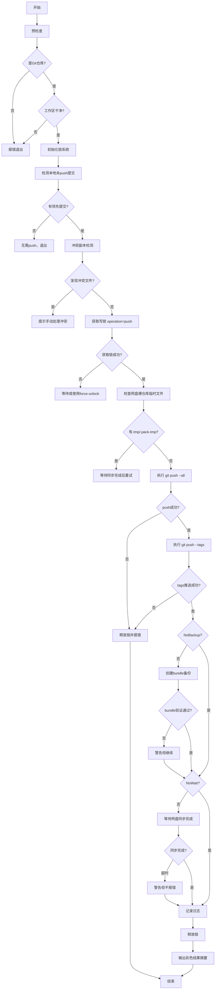
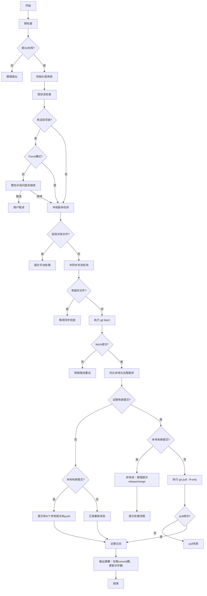

# 05 - 日常同步工作流

## 1. 日常同步原则

网盘 Git 同步是一个多设备共享场景，必须严格遵守以下纪律以避免仓库损坏：

### 1.1 单写者纪律
同一时刻只能有一个设备执行 push 操作。push 前必须获取分布式锁，确保：
- 没有其他设备正在推送
- 网盘裸仓库处于稳定状态
- push 完成后有足够时间等待网盘同步

### 1.2 Push 后等待
Git push 成功只是本地操作完成，网盘客户端需要时间将变更同步到云端。必须等待：
- 网盘目录大小稳定
- 无临时文件（.tmp/.lock/.pack-tmp）
- 连续多次检测指标一致

在等待完成前，其他设备禁止执行 pull/push 操作。

### 1.3 Pull 前检查
执行 pull 前必须：
- 检查是否有其他设备正在 push（锁文件存在则警告）
- 检测网盘裸仓库是否有冲突副本
- 检测是否处于半同步状态（临时文件存在）

---

## 2. Push 流程详解



### Push 流程详细步骤

| 步骤 | 操作 | 说明 |
|------|------|------|
| 1 | 预检查 | 验证是 Git 仓库，工作区干净（无未提交变更） |
| 2 | 锁初始化 | 调用 `lock_init`，确保设备 ID 已生成 |
| 3 | 检测本地提交 | `git log @{u}..HEAD` 检查本地领先提交数 |
| 4 | 冲突副本检测 | 扫描网盘裸仓库是否有 `* (*)*`、`* (冲突版本)*`、`* (来自*)*` 模式文件 |
| 5 | 获取写锁 | `lock_acquire <repo> push`，确保独占写权限 |
| 6 | 半同步检测 | 检查网盘裸仓库下是否有 `.tmp`、`.pack-tmp`、`.lock` 文件 |
| 7 | 推送分支 | `git push <remote> --all` 推送所有分支 |
| 8 | 推送标签 | `git push <remote> --tags` 推送所有标签 |
| 9 | 创建备份 | `git bundle create` 创建时间戳命名的 bundle 文件并 verify |
| 10 | 等待同步 | 轮询网盘裸仓库状态直到稳定（或超时） |
| 11 | 记录日志 | 写入 `logs/sync-YYYYMMDD.log` |
| 12 | 释放锁 | `lock_release <repo>` |
| 13 | 输出摘要 | 显示推送 commit 数、等待时间、备份路径 |

---

## 3. Pull 流程详解



### Pull 流程详细步骤

| 步骤 | 操作 | 说明 |
|------|------|------|
| 1 | 预检查 | 验证是 Git 仓库 |
| 2 | 锁初始化 | 调用 `lock_init`（只读操作，不需要获取写锁） |
| 3 | 锁状态检查 | `lock_check` 检测是否有人在 push，给出警告 |
| 4 | 冲突副本检测 | 同 push 流程 |
| 5 | 半同步检测 | 同 push 流程 |
| 6 | 执行 fetch | `git fetch <remote>` 获取远程最新状态 |
| 7 | 差异对比 | 分别统计远程领先和本地领先的 commit 数 |
| 8 | 决策分支 | - 仅远程领先：`--ff-only` pull<br>- 仅本地领先：提示先 push<br>- 双方都领先：报错提示 rebase/merge |
| 9 | 记录日志 | 写入同步日志 |
| 10 | 输出摘要 | 显示拉取的 commit 数、更新文件数 |

> **注意**：Pull 是只读操作，不需要获取写锁，但必须检测锁状态并向用户发出警告。

---

## 4. Sync 一体化流程

日常使用推荐直接执行 `git-sync`，它会自动按正确顺序执行 pull → push：

```
┌─────────────────────────────────────────────────────────────┐
│                     git-sync 一体化同步                       │
├─────────────────────────────────────────────────────────────┤
│  1. 执行 pull 操作                                           │
│     ├─ 如果远程有新提交且本地无提交 → ff-only pull            │
│     ├─ 如果本地有领先提交 → 仅 fetch，不 pull                 │
│     └─ 如果双方都有提交 → 报错，提示先处理                    │
│                                                             │
│  2. 如果有本地未 push 的提交                                 │
│     └─ 执行完整的 push 流程（获取锁→push→等待→备份）         │
│                                                             │
│  3. 输出最终同步状态摘要                                     │
│     ├─ 本地 HEAD / 远程 HEAD                                │
│     ├─ 领先 commits 数                                      │
│     └─ 落后 commits 数                                      │
│                                                             │
│  4. 异常处理                                                 │
│     └─ 输出清晰的错误信息和下一步操作建议                    │
└─────────────────────────────────────────────────────────────┘
```

---

## 5. 网盘同步等待机制详解

### 5.1 为什么需要等待

Git push 执行完成后，数据只是写入了本地的网盘同步目录。网盘客户端（如百度网盘）需要：
1. 检测文件变更
2. 上传/下载差异文件
3. 在多设备间达成一致
4. 清理临时文件

如果不等待就进行下一次操作，可能导致：
- 读取到半同步状态的损坏仓库
- 产生冲突副本
- pack 文件不完整导致仓库损坏

### 5.2 监测指标

等待循环监测网盘裸仓库的以下指标：

| 指标 | 获取方式 | 说明 |
|------|----------|------|
| 目录总大小 | 递归统计所有文件大小 | 稳定不变说明无写入活动 |
| 最新文件 mtime | 查找最近修改的文件时间戳 | 无新文件被修改 |
| pack 文件数量 | 统计 `objects/pack/*.pack` | pack 文件数稳定 |
| 临时文件数 | 统计 `.tmp/.pack-tmp/.lock` | 应为 0 |

### 5.3 轮询参数

| 参数 | 默认值 | 说明 |
|------|--------|------|
| PollInterval | 2 秒 | 两次检测之间的间隔 |
| StableCount | 5 次 | 连续多少次检测结果完全一致才判定稳定 |
| Timeout | 600 秒（10 分钟） | 最长等待时间，超时仅警告不报错（push 已成功） |

**稳定判定**：连续 `StableCount` 次检测，目录总大小、文件总数、最新 mtime、pack 文件数四项指标完全一致。

### 5.4 等待期间提示

等待过程中会输出：
- 实时 spinner 动画
- 当前已等待时间
- 当前检测到的指标值
- 超时倒计时
- 如果检测到临时文件，提示可能正在同步

---

## 6. --ff-only 策略说明

### 6.1 为什么 pull 使用 --ff-only

`git pull --ff-only` 强制执行快进式合并（fast-forward only），拒绝任何非快进情况。这在网盘同步场景下至关重要：

**问题场景**：
```
远程: A --- B --- C (新提交)
              \
本地:           D (本地新提交，未基于C)
```

如果直接 `git pull`（默认 `--ff` + 可能 merge），Git 会自动创建一个 merge commit：
```
A --- B --- C ------ M (merge commit，自动产生)
              \    /
               D -
```

这会导致：
1. **意外的 merge commit**：用户并未明确要求合并，却产生了合并提交
2. **历史混乱**：线性的提交历史被破坏
3. **同步环路**：merge commit 被 push 后，其他设备 pull 又产生更多问题

### 6.2 --ff-only 的行为

- 如果可以快进（远程领先，本地无新提交）→ 正常 pull，线性更新
- 如果不能快进（双方都有新提交）→ **立即拒绝**，报错退出，强制用户先处理分歧

---

## 7. 非快进情况处理

当远程有新提交而本地也有新提交时（non-fast-forward），按以下流程处理：

### 7.1 推荐流程：rebase（保持线性历史）

```bash
# 1. 先 fetch 获取远程最新状态
git fetch baidu

# 2. 将本地提交 rebase 到远程最新提交之上
git rebase baidu/main

# 3. 如果有冲突，解决冲突后继续
#    编辑冲突文件
git add <resolved-files>
git rebase --continue

# 4. rebase 完成后，现在可以安全 push
git-sync-push -SyncRoot <sync-root>
```

### 7.2 备选流程：merge（保留合并历史）

```bash
# 1. fetch
git fetch baidu

# 2. 合并远程分支（显式创建 merge commit）
git merge baidu/main

# 3. 解决冲突
git add <resolved-files>
git commit

# 4. push
git-sync-push -SyncRoot <sync-root>
```

### 7.3 如果本地提交不需要：reset

```bash
# 放弃本地提交，直接对齐远程（谨慎使用！）
git fetch baidu
git reset --hard baidu/main
```

---

## 8. 日志格式规范

### 8.1 日志位置

日志文件按日期存放在：`<SyncRoot>/logs/sync-YYYYMMDD.log`

例如：`sync-20250731.log`

### 8.2 日志格式

每行是一条记录，使用制表符分隔：

```
<时间戳>\t<设备ID>\t<操作类型>\t<仓库名>\t<结果>\t<附加信息>
```

### 8.3 字段说明

| 字段 | 格式 | 示例 |
|------|------|------|
| 时间戳 | ISO8601 本地时间 | `2025-07-31T14:30:45+08:00` |
| 设备ID | hostname-os-seq | `mypc-win-01` |
| 操作类型 | PUSH / PULL / SYNC | `PUSH` |
| 仓库名 | 目录名 | `my-project` |
| 结果 | SUCCESS / FAILURE / WARNING | `SUCCESS` |
| 附加信息 | key=value 对，逗号分隔 | `commits=3,wait=45s,backup=20250731-143045.bundle` |

### 8.4 日志示例

```
2025-07-31T14:30:45+08:00	mypc-win-01	PUSH	my-project	SUCCESS	commits=3,wait=45s,backup=20250731-143045.bundle
2025-07-31T15:02:18+08:00	laptop-macos-01	PULL	my-project	SUCCESS	commits=3,files_changed=12
2025-07-31T16:45:33+08:00	mypc-win-01	PUSH	my-project	WARNING	commits=1,wait=600s,timeout=true
```

---

## 9. 常见同步问题

### 9.1 Push 被拒（non-fast-forward）

**症状**：
```
error: failed to push some refs to '...'
hint: Updates were rejected because the remote contains work that you do not have locally.
```

**原因**：远程有新提交，本地分支落后于远程。

**解决**：
1. 先执行 `git-sync-pull` 或 `git fetch <remote>`
2. 按第 7 节流程处理非快进（rebase 或 merge）
3. 重新 push

---

### 9.2 同步卡住（等待超时）

**症状**：等待网盘同步超过 10 分钟仍未稳定。

**可能原因**：
- 网盘客户端暂停同步
- 网络中断
- 文件被锁定
- 网盘空间不足

**排查步骤**：
1. 检查网盘客户端状态：是否暂停、是否报错
2. 检查网络连接
3. 检查网盘剩余空间
4. 检查网盘裸仓库是否有大文件正在传输
5. 如果确认网盘已完成同步但脚本误判，可使用 `-NoWait` 参数跳过等待（仅限高级用户）

**注意**：超时只是警告，push 本身已经成功，只是网盘可能未同步完。此时应：
- 不要立即在其他设备操作
- 手动确认网盘同步状态
- 必要时重启网盘客户端

---

### 9.3 Pull 冲突

**症状**：
- 检测到冲突副本文件
- `git pull --ff-only` 报 `non-fast-forward` 错误
- rebase/merge 时出现文件冲突

**解决**：
1. **冲突副本**：检查网盘是否产生了 `* (冲突版本)*` 文件，这种情况通常是因为未遵守单写者纪律导致。需要人工对比两个版本，手动合并后清理冲突文件。
2. **ff-only 拒绝**：按第 7 节流程处理。
3. **文件冲突**：
   ```bash
   # 编辑冲突文件，解决 <<<< ==== >>>> 标记
   git add <resolved-files>
   # rebase 情况
   git rebase --continue
   # merge 情况
   git commit
   ```

---

### 9.4 网络中断恢复

**症状**：push/pull 过程中网络断开，命令失败。

**安全恢复流程**：

1. **Push 中断（在 git push 命令执行期间）**：
   - Git 本身是原子的，push 中断不会导致远程仓库损坏
   - 等待网络恢复后，检查锁是否被释放（`lock_check`）
   - 如果锁仍被持有但进程已不存在，使用 `force-unlock` 清理
   - 重新执行 push 即可（Git 会自动判断哪些对象需要传输）

2. **Pull 中断（在 git fetch/pull 期间）**：
   - fetch 是安全的，重新执行即可
   - 如果 pull 过程中 merge 已开始但中断，使用 `git merge --abort` 回退

3. **锁残留**：
   - 进程崩溃可能导致锁未释放
   - 等待 30 分钟自动超时，或确认无其他设备操作后使用 `force-unlock` 强制释放
