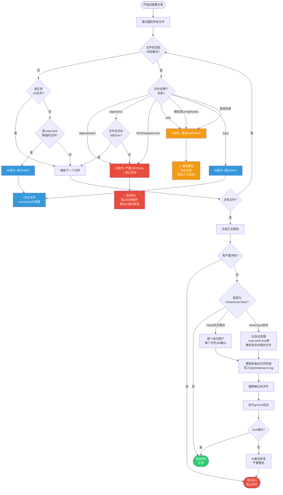

# Git 网盘同步冲突检测与处理

本文档详细描述百度网盘多设备 Git 同步系统中的冲突检测机制，包括百度网盘冲突副本的产生原因、命名规则、对 Git 仓库的危害、检测策略、分级处理方案及安全清理流程。

---

## 1. 什么是百度网盘冲突副本

### 1.1 冲突产生原因

百度网盘采用**最终一致性同步模型**，当多个设备同时修改或创建同一文件时，网盘无法自动合并差异，会自动生成冲突副本以保留所有版本：

| 触发场景 | 说明 |
|----------|------|
| 多设备同时 push | 设备 A 和设备 B 几乎同时向同一裸仓库 push，双方都修改了 `refs/heads/main` 和 `objects/pack/` 下的文件 |
| 同步未完成即操作 | 设备 A push 后未等待网盘同步完成，设备 B 立即开始 push |
| 强制终止同步 | 同步过程中关闭网盘客户端、关机、断网，导致文件传输中断 |
| 大文件传输中断 | pack 文件较大（几十MB以上），传输过程中网络波动导致部分写入 |
| 锁机制失效窗口 | 锁文件同步到云端前的窗口期，其他设备检测不到锁而开始操作 |

### 1.2 冲突副本的本质

冲突副本是百度网盘的**安全兜底机制**——当它检测到同一文件在不同客户端有不同版本且无法判断哪个是"最新"时，不会静默覆盖任何一个版本，而是重命名后保留所有版本。这对普通文档是好事，但对 Git 裸仓库来说是**致命危险**。

---

## 2. 百度网盘冲突文件命名规则

百度网盘冲突副本有多种命名模式，不同版本客户端可能产生不同格式：

### 2.1 数字序号副本（最常见）

```
原始文件名:   pack-1234abcd.pack
冲突副本:     pack-1234abcd (1).pack
              pack-1234abcd (2).pack
              pack-1234abcd (3).pack
```

- 格式：`<原始文件名> (<数字>).<扩展名>`
- 数字从 1 开始递增
- 这是百度网盘桌面客户端最常见的冲突命名方式

### 2.2 冲突版本-用户名-日期格式

```
原始文件名:   HEAD
冲突副本:     HEAD (冲突版本-username-20260731).lock
              main (冲突版本-laptop-win-01-20260731T143022)
```

- 格式：`<原始文件名> (冲突版本-<用户名>-<日期格式>).<扩展名>`
- 日期格式可能是 `YYYYMMDD` 或 `YYYYMMDDTHHMMSS`
- 常见于百度网盘较早版本或企业版

### 2.3 来自设备名格式

```
原始文件名:   config
冲突副本:     config (来自 DESKTOP-ABC123)
              packed-refs (来自 MacBook-Pro.local)
```

- 格式：`<原始文件名> (来自 <设备名>).<扩展名?>`
- 有时扩展名可能被截断或保留

### 2.4 冲突副本标记格式

```
原始文件名:   objects/xx/1234abcd...
冲突副本:     objects/xx/1234abcd... (冲突副本)
```

- 格式：`<原始文件名> (冲突副本)`
- 明确标记为冲突副本

### 2.5 其他变体和特殊情况

| 模式 | 示例 | 说明 |
|------|------|------|
| 临时文件后缀 | `tmp_pack_XXXXXX.tmp` | Git 打包过程中产生的临时文件 |
| pack 临时文件 | `pack-XXXX.pack-tmp` | pack 文件写入过程中的临时文件 |
| Lock 文件残留 | `main.lock (1)` | 引用锁文件的冲突副本 |
| 无扩展名冲突 | `HEAD (1)` | 无扩展名文件的冲突副本 |
| 多重冲突 | `file (1) (2).ext` | 冲突副本本身又产生冲突 |
| 括号转义差异 | `file(1).ext`（无空格） | 某些客户端可能不插入空格 |

---

## 3. Git 对象目录中的冲突副本为什么危险

### 3.1 objects/ 目录的结构

Git 裸仓库的 `objects/` 目录采用 SHA-1 哈希命名：

```
objects/
├── xx/           # 前2位哈希作为目录名
│   └── xxxxx...  # 后38位哈希作为文件名，共40位hex字符
├── pack/
│   ├── pack-<sha1>.pack      # 打包对象文件
│   ├── pack-<sha1>.idx       # pack索引文件
│   └── *.keep                # pack保留标记
└── info/
    └── packs                 # pack文件列表
```

正常 Git 对象文件的文件名是**严格的 40 位十六进制字符**（松散对象）或 `pack-<40位hex>.pack/.idx`。任何不匹配此模式的文件都不是 Git 期望的。

### 3.2 冲突副本导致的具体问题

| 问题场景 | 后果 | 严重程度 |
|----------|------|----------|
| `objects/xx/yyyy... (1)` 存在 | Git 按 SHA-1 路径查找对象时找不到正确文件，报告 `object not found` | 🔴 致命 |
| `objects/pack/pack-xxx (1).pack` 存在 | Git 读取 pack 文件时可能读到冲突副本（损坏数据），或 pack 索引与 pack 文件不匹配 | 🔴 致命 |
| 正确的对象文件被覆盖 | 如果网盘"解决"了冲突但保留了错误版本，对象数据库永久损坏 | 🔴 致命 |
| 冲突副本与原文件并存 | Git 遍历对象目录时可能混淆，`git fsck` 报告大量 dangling 对象或 missing 对象 | 🟠 严重 |

### 3.3 为什么普通文件冲突可以自动合并而 Git 不行

- **普通文档**（Word、txt、图片）：网盘保留两个副本，用户手动选择正确版本即可
- **Git 对象文件**：二进制格式、文件名即内容哈希、文件间有强引用关系，**无法"选一个正确版本"**——需要整个对象数据库的一致性
- **Pack 文件**：单一 pack 文件可能包含数千个对象，部分损坏导致整个 pack 不可读

---

## 4. refs 目录冲突

### 4.1 引用文件冲突

`refs/heads/`、`refs/tags/` 下的文件是引用文件，内容是指向 commit 的 SHA-1：

```
refs/
├── heads/
│   ├── main                  # 正常引用：内容是40位SHA-1
│   ├── main (1)              # 冲突副本：可能是另一台设备的更新
│   └── main.lock             # 正常锁文件（操作中临时存在）
├── tags/
│   └── v1.0.0 (冲突副本)     # tag 冲突
└── remotes/...
```

### 4.2 Lock 文件冲突

```
refs/heads/main (1).lock      # lock文件本身的冲突副本
HEAD.lock (冲突版本-xxx)      # HEAD锁冲突
packed-refs.lock (来自 xxx)   # packed-refs锁冲突
```

- 正常 `.lock` 文件是 Git 原子更新引用时的临时文件，操作完成应立即删除
- 残留的 `.lock` 文件会阻止 Git 更新对应引用
- 冲突副本格式的 `.lock` 文件同样会阻止操作

### 4.3 packed-refs 文件冲突

`packed-refs` 是打包后的引用列表，冲突会导致：
- 部分 tag/branch 丢失
- 引用指向不存在的对象
- `git show-ref` 输出混乱

---

## 5. 检测策略

### 5.1 扫描范围

递归扫描裸仓库（`<repo>.git/`）下的所有文件和目录，特别关注：

| 目录 | 检查重点 |
|------|----------|
| `objects/xx/` | 所有文件名应为 38 位 hex（松散对象） |
| `objects/pack/` | 文件名应为 `pack-<40hex>.pack`/`.idx`/`.keep` |
| `refs/` | 所有路径下不应含括号字符 |
| 根目录 | `HEAD`、`config`、`description`、`packed-refs` 等不应有冲突副本 |
| `logs/` | 日志目录冲突危害性较低但也应检测 |
| `hooks/` | 钩子脚本冲突可能导致异常行为 |

### 5.2 正则匹配模式

冲突检测使用以下正则表达式模式：

```regex
# 1. 数字序号冲突："文件名 (1).ext"、"文件名 (2).ext"
\s\(\d+\)(\.[^.]*)?$

# 2. 中文冲突标记：含"冲突"二字
冲突

# 3. 来自设备标记："文件名 (来自 xxx)"
\s\(来自\s

# 4. 冲突副本标记："文件名 (冲突副本)"
冲突副本

# 5. Git临时文件后缀
\.(tmp|temp|pack-tmp|lock)$
```

### 5.3 排除正常文件（避免误报）

检测时需排除正常 Git 文件，不能简单地"括号即冲突"：

| 正常文件特征 | 判定方法 |
|-------------|----------|
| 松散对象文件 | `objects/xx/` 目录下文件名是**精确 38 位十六进制字符**，且不含括号 |
| pack 文件 | `objects/pack/pack-` 后精确 40 位 hex，`.pack`/`.idx`/`.keep` 后缀 |
| 正常 lock 文件 | `*.lock` 文件且对应无括号的同名文件正在被操作（但残留lock仍需警告） |
| info/exclude 等配置 | `objects/info/` 下的文件按白名单检查 |

### 5.4 特殊关注的临时文件

| 临时文件模式 | 说明 | 安全性 |
|-------------|------|--------|
| `*.tmp` | Git 操作临时文件 | 🟢 正常结束后不应存在，可清理 |
| `*.temp` | 临时文件 | 🟢 可清理 |
| `*.pack-tmp` | pack 写入临时文件 | 🟢 可清理 |
| `*.lock`（不在locks/） | 引用锁残留 | 🟡 需确认无Git进程运行后清理 |
| `tmp_pack_*` | Git创建pack时的临时文件 | 🟢 可清理 |
| `*.keep`（非pack相关） | 异常keep文件 | 🟡 需检查 |

---

## 6. 分级处理

根据冲突文件所在位置和类型，分为三个严重级别：

### 6.1 严重级别（CRITICAL）- 必须停止同步

**判定标准**：
- `objects/pack/` 目录下的任何冲突副本
- `objects/xx/` 目录下文件名不符合 38 位 hex 规则的文件（除 `.keep`、`pack-`、`info/`）
- `HEAD` 文件的冲突副本
- `packed-refs` 文件的冲突副本

**处理要求**：
1. 🛑 **立即停止所有 push/sync 操作**
2. 🛑 **不要尝试自动清理或修复**
3. 📋 **检查最近一次 bundle 备份是否完好**
4. 📋 **从备份恢复仓库，或在未损坏的设备上重新创建裸仓库**
5. 📋 **恢复后执行 `git fsck --full` 验证完整性**

**为什么不能自动修复**：对象数据库冲突意味着已经发生了并发写入，无法判断哪个版本是"正确"的。盲目删除冲突副本可能丢失有效对象，保留则可能读到损坏数据。

### 6.2 警告级别（WARNING）- 需要人工确认

**判定标准**：
- `refs/` 目录下（除 heads/tags 关键引用外）的冲突副本
- `*.lock` 文件（`locks/` 目录外的同步系统锁除外）
- `config`、`description`、`hooks/` 下的冲突副本
- 非关键目录的非 `.tmp`/`.temp` 冲突副本

**处理要求**：
1. ⚠️ 确认没有任何设备正在执行 Git 操作
2. ⚠️ 检查文件修改时间，确定是残留还是正在产生
3. ⚠️ `.lock` 文件确认无 Git 进程后可删除
4. ⚠️ 其他冲突文件建议备份后手动比较版本

### 6.3 提示级别（INFO）- 可手动清理

**判定标准**：
- `logs/` 日志目录的冲突副本（不影响仓库功能）
- `*.tmp`、`*.temp`、`*.pack-tmp` 等临时文件
- `tmp_pack_*` 临时文件
- `hooks/` 下非执行脚本的备份/冲突文件

**处理要求**：
1. ℹ️ 记录到日志
2. ℹ️ `-AutoClean` 模式可自动清理临时文件
3. ℹ️ 日志目录冲突可手动删除

---

## 7. 清理原则与安全流程

### 7.1 铁律：先备份，后清理

**绝对禁止**在没有备份的情况下删除任何冲突文件！

```
清理前必须执行：
1. 整个裸仓库目录完整复制一份到备份位置
   或
2. 至少创建一个新的 bundle 备份：
   git clone --mirror <repo-path> backup.git
   cd backup.git && git bundle create ../repo-backup.bundle --all
```

### 7.2 安全清理流程

```
发现冲突 → 停止所有同步操作
    ↓
评估严重级别
    ↓
[CRITICAL] → 从备份恢复（不要尝试清理）
    ↓
[WARNING/INFO] → 确认无进程操作
    ↓
将要删除的文件列表写入日志 (logs/cleanup-<timestamp>.log)
    ↓
Clean模式：逐个询问确认
AutoClean模式：仅删除确认安全的临时文件
    ↓
删除前备份文件列表（可选择复制到隔离目录而非直接删除）
    ↓
清理后执行 git fsck --full 验证
    ↓
验证通过 → 恢复同步
验证失败 → 从备份恢复，重新评估
```

### 7.3 永远不要盲目删除的情况

- ❌ 任何 `objects/pack/` 下的冲突副本
- ❌ 任何文件名疑似 SHA-1 哈希的冲突副本
- ❌ 不确定修改时间和来源的文件
- ❌ 有 Git 进程运行时的任何 `.lock` 文件
- ❌ 最近几分钟内修改的文件（可能正在同步中）

---

## 8. 预防措施

冲突副本一旦产生，处理成本极高。最佳策略是**预防**：

### 8.1 遵守单写者原则

| 原则 | 说明 |
|------|------|
| 📋 同一时间只在一台设备执行 push | 这是最简单最可靠的规则 |
| 📋 push 前检查锁状态 | 使用 `lock-check` 或 `force-unlock` 检查 |
| 📋 push 后等待同步完成 | 观察网盘客户端状态，等待"同步完成"指示 |
| 📋 不要在多设备上同时打开同一仓库操作 | 即使只做只读操作，某些Git命令也可能写入临时文件 |

### 8.2 同步纪律

1. **push 后等待 30 秒到 2 分钟**（根据文件大小）再在其他设备操作
2. **长时间离开时关闭网盘同步或关机**，防止"僵尸操作"
3. **不要强制 kill Git 进程或关闭网盘客户端**，等待正常完成
4. **定期执行冲突检测**，建议每次 push 前自动运行检测

### 8.3 自动检测集成

冲突检测应集成到同步工作流中：
- push 前：自动运行 `check-conflicts`，发现严重冲突立即中止
- 每日首次操作：全量扫描所有仓库
- 发现 CRITICAL 级别冲突：阻止任何写入操作，强制人工干预

---

## 9. 检测→分级→处理流程 Mermaid 图



---

## 10. 相关文件

| 文件 | 路径 | 说明 |
|------|------|------|
| Bash 冲突检测库 | `check-conflicts.sh` | source 使用的冲突检测函数库，也可独立执行 |
| PowerShell 冲突检测模块 | `check-conflicts.ps1` | dot-source 使用的冲突检测模块，也可独立执行 |
| 锁机制文档 | [04-locking-mechanism.md](04-locking-mechanism.md) | 锁机制原理（冲突预防的第一道防线） |
| 日常同步工作流 | [05-daily-sync-workflow.md](05-daily-sync-workflow.md) | 集成冲突检测的同步流程 |
| 强制解锁工具 | `force-unlock.sh`/`force-unlock.ps1` | 锁残留处理工具 |

---

## 11. 快速参考：命令行用法

```bash
# 扫描单个仓库（默认只报告）
./check-conflicts.sh -RepoName myproject -SyncRoot /path/to/sync

# 直接指定裸仓库路径扫描
./check-conflicts.sh -Path /path/to/repos/myproject.git

# 扫描所有仓库
./check-conflicts.sh -All -SyncRoot /path/to/sync

# 交互式清理（逐个询问）
./check-conflicts.sh -Path /path/to/repo.git -Clean

# 自动清理安全的临时文件
./check-conflicts.sh -All -SyncRoot /path/to/sync -AutoClean
```

```powershell
# PowerShell 用法（参数名相同，大小写不敏感）
.\check-conflicts.ps1 -RepoName myproject -SyncRoot D:\BaiduSync\git-sync
.\check-conflicts.ps1 -Path D:\git-sync\repos\myproject.git -Clean
.\check-conflicts.ps1 -All -SyncRoot D:\BaiduSync\git-sync -AutoClean
```
