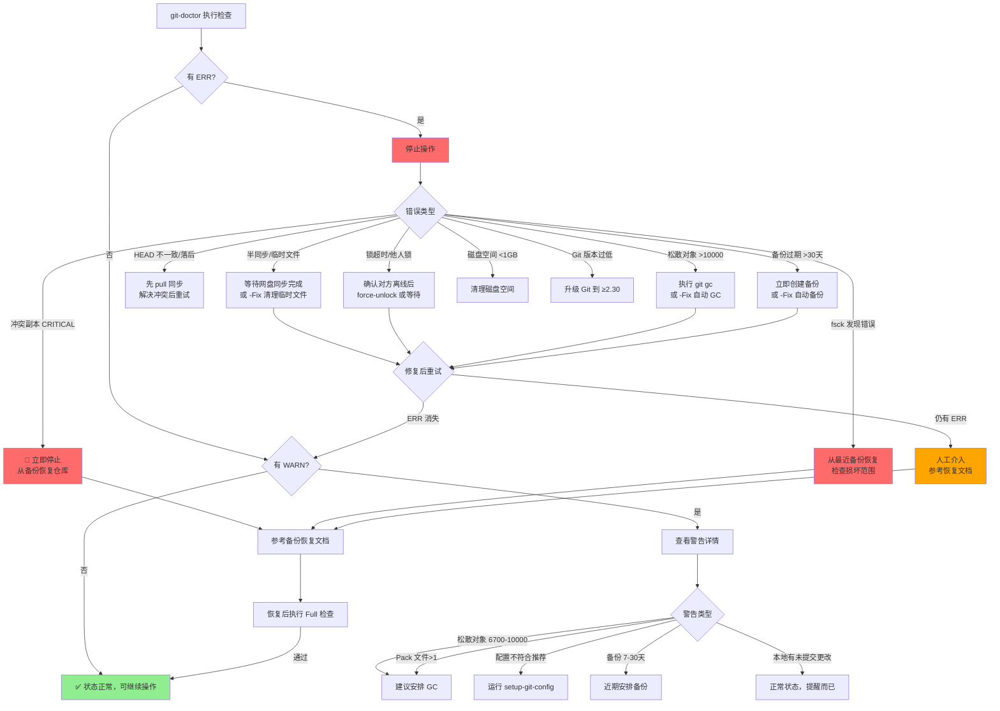
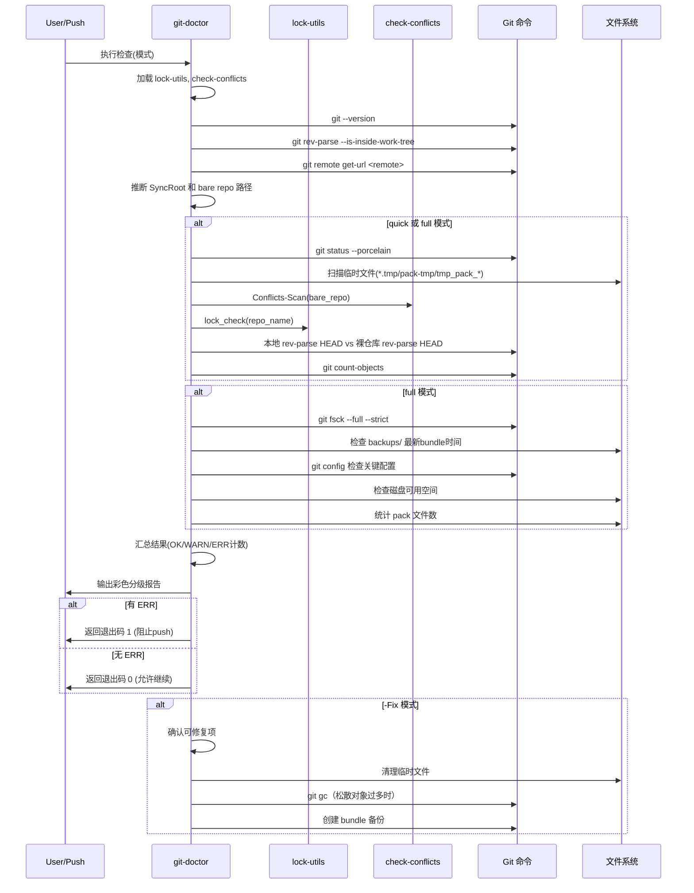

# Git 网盘同步健康检查与诊断

本文档描述百度网盘多设备 Git 同步系统中的健康检查机制，包括定期检查的必要性、检查项分类、三级状态分级、自动修复策略以及问题处理流程。配套工具为 `git-doctor`（`git-doctor.ps1`/`git-doctor.sh`）。

---

## 1. 为什么需要定期健康检查

网盘同步环境下的 Git 仓库面临多种独特风险，这些风险在本地或局域网 Git 工作流中通常不会出现：

### 1.1 静默损坏（Silent Corruption）

| 风险类型 | 说明 | 危害等级 |
|----------|------|----------|
| 部分写入 | 大 pack 文件传输中断，文件只写入了一半 | 致命 |
| 位翻转 | 网盘传输/存储过程中极罕见的数据位错误 | 严重 |
| 对象丢失 | 对象目录下文件因同步冲突被意外删除 | 严重 |
| 引用漂移 | `HEAD` 或 refs 文件被旧版本覆盖 | 严重 |

这些损坏可能**静默存在**很长时间——Git 不会在每次操作时都验证所有对象完整性，直到某次 checkout/fsck 才会暴露。

### 1.2 半同步状态

网盘同步不是原子操作。push 操作涉及多个文件（HEAD、refs、objects/pack/ 等）的写入，这些文件通过网盘同步到其他设备时存在时间差：

- **中间态**：objects 已同步但 refs 未更新 → 仓库暂时"缺提交"
- **反向中间态**：refs 已更新但 objects 尚未同步完成 → 引用指向不存在的对象
- **临时文件残留**：`*.tmp`、`*.pack-tmp`、`tmp_pack_*` 等临时文件因进程崩溃/关机残留

半同步状态下操作仓库极易引发冲突和损坏。

### 1.3 冲突副本积累

百度网盘的冲突副本机制（详见 [06-conflict-detection.md](06-conflict-detection.md)）虽然能防止数据丢失，但：

- 冲突副本本身是异常信号，不应长期存在
- 冲突副本积累说明存在并发操作或同步问题
- `objects/pack/` 下的冲突副本是致命危险信号

### 1.4 资源退化

- **松散对象过多**：小文件数量过多（>6700个）严重影响网盘同步效率
- **Pack 文件碎片化**：多个小 pack 文件而非一个优化的大 pack
- **备份过期**：长期未创建备份，损坏后无法恢复
- **磁盘空间不足**：同步盘空间不足会导致同步失败甚至文件损坏

---

## 2. 检查项分类与说明

### 2.1 完整性检查

| 检查项 | 命令/方法 | 判定标准 | 说明 |
|--------|-----------|----------|------|
| 对象数据库完整性 | `git fsck --full --strict --no-dangling` | 有 error 输出 → ERR | 检查所有对象的连通性和校验和，发现损坏对象 |
| 悬挂对象（dangling） | fsck 输出中的 dangling 行 | 仅 INFO，不影响功能 | 悬挂对象是已失去引用但未被 GC 的对象，通常无害 |

**注意**：fsck 检查仅在 full 模式下执行，因为它需要遍历所有对象，对大仓库可能耗时较长。

### 2.2 Refs 一致性检查

| 检查项 | 方法 | 判定标准 |
|--------|------|----------|
| HEAD 对比 | 本地 `git rev-parse HEAD` vs 裸仓库 `git -C <bare> rev-parse HEAD` | 本地领先 → INFO（本地有未push提交）；本地落后 → WARN；不一致（无法快进）→ ERR |
| 本地分支与远程跟踪 | `git status -sb` 检查分支追踪状态 | 有 ahead/behind 信息正常，出现 "diverged" → WARN |

### 2.3 半同步检测

扫描裸仓库下的临时/中间文件：

| 文件名模式 | 含义 | 严重级别 |
|-----------|------|----------|
| `*.tmp` | 通用临时文件 | ERR |
| `*.pack-tmp` | Pack 文件写入过程中的临时文件 | ERR |
| `*.lock` | Git 操作锁文件（非 locks/ 目录下的） | ERR（非 HEAD.lock/pack-*.lock） |
| `tmp_pack_*` | Git 打包过程临时文件 | ERR |
| `*.keep` | Pack 保护文件（正常情况下应临时存在） | WARN（存在超过10分钟 → ERR） |
| `*.part`、`*.downloading` | 网盘下载临时文件 | ERR |

### 2.4 对象计数检查

| 检查项 | 命令 | 阈值 | 级别 |
|--------|------|------|------|
| 松散对象数 | `git count-objects`（loose 字段） | >6700 | WARN（建议 GC） |
| 松散对象数 | 同上 | >10000 | ERR（必须 GC） |
| Pack 文件数 | 统计 `.git/objects/pack/*.pack` | >1 | WARN（建议 GC 优化） |

### 2.5 冲突副本检测

调用 `check-conflicts` 库进行扫描：

| 分类 | 级别 |
|------|------|
| CRITICAL（objects/pack、HEAD、packed-refs 冲突） | ERR |
| WARNING（refs、config、hooks 冲突） | WARN |
| INFO（临时文件残留） | INFO |

### 2.6 锁状态检查

通过 `lock-utils` 库的 `lock_check` 函数检查：

| 状态 | 级别 | 说明 |
|------|------|------|
| 无锁 | OK | 可安全操作 |
| 本设备持有 | INFO | 当前进程或同设备其他进程持有 |
| 其他设备持有且未超时 | WARN | 等待对方完成 |
| 超时锁 | ERR（需清理） | 持有者崩溃/断网，可安全清理 |
| 本设备残留锁 | ERR（自动清理） | 进程已退出但锁未释放 |

### 2.7 备份健康检查

检查 `backups/<repo-name>/` 目录下最新 `.bundle` 文件的修改时间：

| 备份年龄 | 级别 | 建议 |
|----------|------|------|
| ≤7天 | OK | 备份新鲜 |
| >7天且≤30天 | WARN | 建议执行一次带备份的 push |
| >30天 | ERR | 必须立即创建备份 |
| 无备份 | ERR | 仓库无任何安全网 |

### 2.8 配置检查（full 模式）

检查关键 Git 配置项是否符合推荐值：

| 配置项 | Windows 推荐 | macOS/Linux 推荐 | 错误级别 |
|--------|-------------|------------------|----------|
| `core.autocrlf` | `true` | `input` | WARN |
| `gc.auto` | `6700` | `6700` | WARN |
| `gc.autopacklimit` | `1` | `1` | WARN |
| `core.filemode`（裸仓库） | `false` | `false` | WARN |
| `core.longpaths`（Windows） | `true` | N/A | WARN |

### 2.9 磁盘空间检查（full 模式）

检查 SyncRoot 所在磁盘分区的可用空间：

| 可用空间 | 级别 |
|----------|------|
| ≥5GB | OK |
| <5GB且≥1GB | WARN |
| <1GB | ERR |

### 2.10 Git 版本检查

| 版本 | 级别 |
|------|------|
| ≥2.30.0 | OK |
| <2.30.0 | ERR（部分功能不支持） |

---

## 3. 三级状态定义

| 状态 | 符号 | 颜色 | 含义 | 是否阻止 push | 退出码 |
|------|------|------|------|--------------|--------|
| 通过 | `[OK]` | 绿色 | 检查项正常 | 否 | 0 |
| 警告 | `[WARN]` | 黄色 | 存在风险但不阻塞，建议关注 | 否 | 0（有错误时1） |
| 错误 | `[ERR]` | 红色 | 存在严重问题，必须处理 | 是 | 1 |
| 信息 | `[INFO]` | 灰色/蓝色 | 提示性信息，非问题 | 否 | 0 |

**INFO 级别的典型场景**：
- 悬挂对象（dangling objects）
- 本地有未推送的提交（ahead of remote）
- 本设备自己持有锁

---

## 4. 检查模式

### 4.1 Quick 模式（默认）

每次 push 前自动执行，快速检查高风险项：

| 检查项 | 目的 |
|--------|------|
| Git 版本 | 确保基本兼容性 |
| 仓库有效性 | 确认在 Git 仓库内 |
| 工作区状态 | 有未提交更改时提醒 |
| 半同步检测 | 检测临时文件残留 |
| 冲突副本 | 检测严重冲突 |
| 锁状态 | 防止并发操作 |
| HEAD 对比 | 确认与远程同步状态 |
| 松散对象快速计数 | 极端情况才报错 |

执行时间通常 <5秒。

### 4.2 Full 模式

每周维护或发现异常时执行，全面检查所有项：

- Quick 模式所有项
- fsck 完整性检查
- 备份健康检查
- 配置合规检查
- 磁盘空间检查
- Pack 文件碎片化检查

执行时间取决于仓库大小，可能数十秒到数分钟。

### 4.3 定期检查建议

| 频率 | 模式 | 执行时机 |
|------|------|----------|
| 每次 push 前 | Quick | 自动（git-doctor 被 git-sync-push 调用） |
| 每周一次 | Full | 手动执行或定时任务 |
| 发现异常后 | Full | 手动执行诊断 |
| 跨设备切换前 | Quick | 在另一设备开始工作前 |

---

## 5. 发现问题后的处理流程

### 5.1 决策流程图



### 5.2 常见问题处理指引

| 问题 | 快速处理 | 详细文档 |
|------|----------|----------|
| 发现 `*.tmp`/`*.pack-tmp` 临时文件 | 等待网盘同步完成；如确认无 Git 进程运行，可用 `-Fix` 清理 | - |
| CRITICAL 冲突（objects/pack/HEAD） | **禁止自动清理**，从 `.bundle` 备份恢复 | [06-conflict-detection.md](06-conflict-detection.md) |
| 松散对象过多 | `cd <repo> && git gc --aggressive`，或 `git-doctor -Fix` | - |
| 备份过期 | 执行一次正常 push（会自动创建备份），或 `git-doctor -Fix` | [05-daily-sync-workflow.md](05-daily-sync-workflow.md) |
| 他人持有锁 | 等待对方操作完成；超时可用 `force-unlock`（需确认对方离线） | [04-locking-mechanism.md](04-locking-mechanism.md) |
| HEAD 落后 | 先执行 `git-sync-pull` 拉取最新变更 | [05-daily-sync-workflow.md](05-daily-sync-workflow.md) |
| fsck 错误 | 停止使用该仓库，从最近的 bundle 备份恢复 | - |
| 磁盘空间不足 | 清理网盘同步盘的无关文件，或扩容 | - |

### 5.3 -Fix 自动修复范围

`-Fix` 模式仅修复**安全可自动修复**的问题：

| 问题 | 是否自动修复 | 确认要求 |
|------|-------------|----------|
| `.tmp`/`.pack-tmp`/`tmp_pack_*` 临时文件 | 是 | 需确认无 Git 进程在运行 |
| 非 locks/ 目录下的过期 `.lock` 文件 | 是 | - |
| 松散对象过多（GC） | 是 | 需确认无其他设备在操作 |
| 备份缺失/过期 | 是 | 创建新的 bundle 备份 |
| 冲突副本 CRITICAL | **否** | 必须人工处理，从备份恢复 |
| fsck 发现的对象损坏 | **否** | 必须从备份恢复 |
| HEAD 不一致/分歧 | **否** | 需要人工合并决策 |

---

## 6. git-doctor 工具用法

### 6.1 命令行参数

```
git-doctor.ps1/sh [选项]

选项:
  -RepoPath <path>    本地工作仓库路径（默认 .）
  -SyncRoot <path>    网盘同步根目录（可从 remote 自动推断）
  -RemoteName <name>  Git remote 名称（默认 baidu）
  -Mode <quick|full>  检查模式（默认 quick）
  -All                检查 SyncRoot 下所有已注册仓库
  -Fix                自动修复可安全修复的问题（危险操作需确认）
  -h, --help          显示帮助
```

### 6.2 使用示例

```bash
# 基础：在当前仓库执行快速检查（push前自动执行）
./git-doctor.ps1

# 指定仓库路径
./git-doctor.sh -RepoPath ~/projects/myapp

# 全面检查
./git-doctor.ps1 -Mode full

# 检查同步空间所有仓库
./git-doctor.sh -All -SyncRoot ~/BaiduSync/git-sync

# 检查并自动修复（清理临时文件、GC、创建备份）
./git-doctor.ps1 -Mode full -Fix

# 在 pre-push hook 中调用（阻止有错误的 push）
./git-doctor.sh -Mode quick || exit 1
```

### 6.3 作为库被其他脚本调用

`git-doctor` 同时也是函数库，可被其他脚本 source 后调用：

**PowerShell**:
```powershell
. (Join-Path $PSScriptRoot 'git-doctor.ps1')

# 初始化
$doctorResult = Invoke-GitDoctor -RepoPath '.' -Mode 'quick'
if ($doctorResult.HasErrors) {
    Write-Host "存在错误，阻止push"
    exit 1
}
```

**Bash**:
```bash
SCRIPT_DIR="$(cd "$(dirname "${BASH_SOURCE[0]}")" && pwd)"
source "$SCRIPT_DIR/git-doctor.sh"

# 执行快速检查
if ! git_doctor_check "." "quick"; then
    echo "存在错误，阻止push"
    exit 1
fi
```

---

## 7. 检查执行流程


