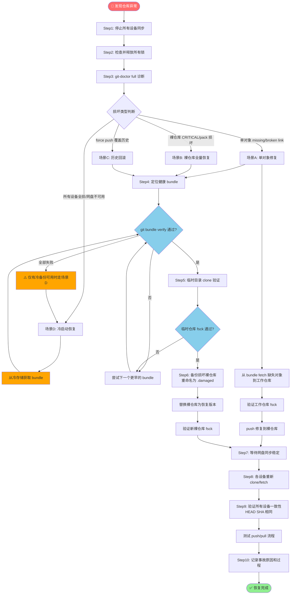
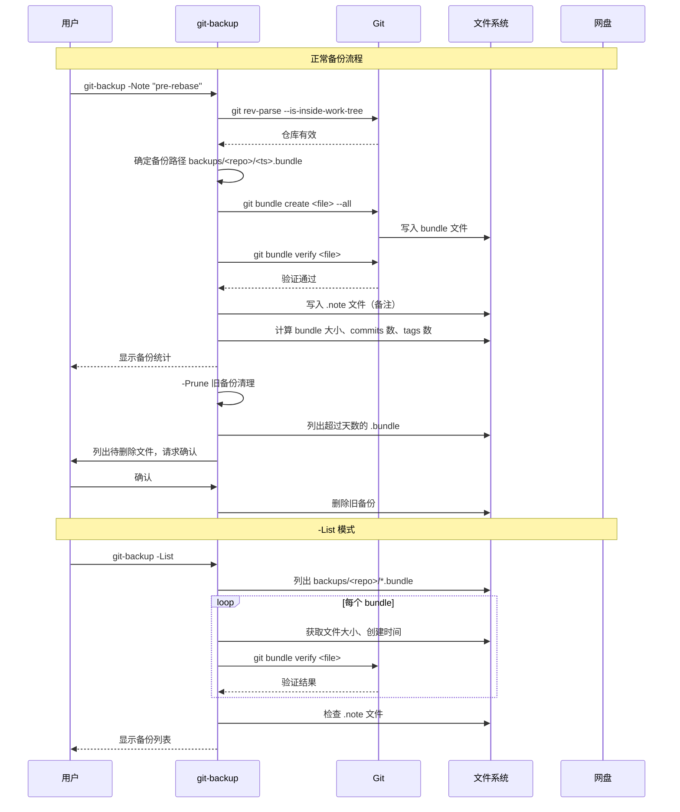

# Git 网盘同步备份与灾难恢复

本文档描述百度网盘多设备 Git 同步系统中的备份策略、`git bundle` 原理、损坏诊断方法以及完整的灾难恢复流程。配套工具为 `git-backup`（`git-backup.ps1`/`git-backup.sh`）。

---

## 1. 为什么需要额外备份

网盘同步不等于备份。理解这一点至关重要：

### 1.1 同步错误会传播到所有设备

网盘同步的核心机制是**双向实时同步**，这意味着任何一台设备上的错误都会迅速传播到所有其他设备：

| 风险场景 | 传播机制 | 后果 |
|----------|----------|------|
| 误执行 `git push --force` | 强制推送覆盖远程历史 → 网盘同步裸仓库 → 其他设备 pull 时获取被覆盖的历史 | 所有设备丢失历史提交 |
| `git filter-repo` 重写历史后误 push | 重写后的对象替换原对象 → 同步传播 | 历史被永久改写 |
| 网盘冲突导致对象文件损坏 | 损坏的 `.pack`/`.idx` 文件同步到所有设备 | 所有设备的仓库都出现对象缺失 |
| GC 过程中断电/崩溃 | 半完成的 GC 状态同步传播 | 所有设备进入半损坏状态 |
| 误删分支后 push | 删除操作同步传播 | 所有设备分支消失 |

**核心原则**：同步 = 镜像复制，备份 = 时间点快照。只有独立于同步链路的快照才能在同步灾难发生时提供回滚能力。

### 1.2 Git reflog 的局限性

Git 的 reflog（引用日志）是本地安全网，但在网盘同步场景下存在严重局限：

| 特性 | 普通工作仓库 | 网盘裸仓库（bare repo） |
|------|-------------|----------------------|
| reflog 默认启用 | ✅ 是 | ❌ **默认关闭**（裸仓库 `core.logAllRefUpdates=false`） |
| reflog 过期时间 | 90天（可配置） | N/A（无 reflog） |
| 可恢复强制 push 前的提交 | ✅ 通过 `HEAD@{n}` | ❌ 裸仓库无记录 |
| 跨设备可用 | ❌ 仅本地 | ❌ 无 |
| 可恢复已删除分支 | ✅ 直到 reflog 过期 | ❌ 无记录 |

即使为裸仓库手动开启 reflog，reflog 本身也是通过网盘同步的——如果 reflog 文件本身在同步中损坏或被错误覆盖，同样无法依赖。

### 1.3 Bundle 文件的不可替代性

`git bundle` 是 Git 原生提供的**单文件离线归档格式**，具有以下关键特性：

- **自包含**：单个 `.bundle` 文件包含归档时所有可达的 Git 对象（commits、trees、blobs、tags）
- **可独立验证**：`git bundle verify` 可在不恢复仓库的情况下验证文件完整性
- **可直接 clone/fetch**：bundle 文件可以像远程仓库一样被 `git clone` 和 `git fetch`
- **与 Git 版本兼容**：bundle 格式向前兼容，旧版本 Git 也能读取新版本创建的 bundle
- **不依赖工作区**：可从裸仓库直接创建 bundle
- **适合冷存储**：单文件便于复制到外部硬盘、云存储等独立介质

---

## 2. git bundle 原理

### 2.1 Bundle 文件结构

Bundle 文件本质上是一个特殊格式的文件，其内部结构类似于 Git 的 pack 文件，但附加了引用信息：

```
.bundle 文件格式
┌─────────────────────────────┐
│  头部（bundle signature）    │  "# v2 git bundle" 或 "# v3 git bundle"
├─────────────────────────────┤
│  引用列表                    │  形如 "<sha1> <refname>" 的行，列出包含的引用
│                             │  如: "a1b2c3d... refs/heads/main"
│                             │      "e4f5g6h... refs/tags/v1.0"
├─────────────────────────────┤
│  分隔线                      │  空行或特定标记
├─────────────────────────────┤
│  Pack 数据流                 │  与 .pack 文件完全相同的二进制 pack 数据
│                             │  包含所有对象（deltified 压缩）
└─────────────────────────────┘
```

### 2.2 Bundle 与 Pack 的区别

| 特性 | `.pack` 文件 | `.bundle` 文件 |
|------|-------------|---------------|
| 引用信息 | ❌ 无，依赖外部 refs | ✅ 内置引用列表 |
| 独立可用 | ❌ 需要放在 `objects/pack/` 下，配合 idx 文件 | ✅ 可独立用于 clone/fetch |
| 增量支持 | ✅ 可做增量 pack（薄 pack） | ✅ 可创建增量 bundle（基于已有 bundle） |
| 校验 | 通过 `.idx` 索引 | `git bundle verify` 内置校验 |
| 用途 | 日常对象存储和网络传输 | 离线备份、邮件传输、sneakernet |

### 2.3 创建与验证命令

```bash
# 创建全量 bundle（包含所有分支和标签）
git bundle create <file.bundle> --all

# 创建仅包含指定分支的 bundle
git bundle create <file.bundle> main develop

# 验证 bundle 完整性
git bundle verify <file.bundle>

# 列出 bundle 中包含的引用
git bundle list-heads <file.bundle>

# 从 bundle 克隆（相当于从远程仓库克隆）
git clone <file.bundle> <target-dir>

# 从 bundle 拉取到现有仓库
git fetch <file.bundle>
```

`git bundle verify` 执行以下检查：
1. 验证文件头格式是否正确
2. 验证 pack 数据的校验和（checksum）
3. 验证所有引用指向的对象确实存在于 pack 中
4. 验证必要的前置提交（prerequisites）是否满足

---

## 3. 备份策略

采用**三层备份策略**，结合自动备份、手动备份和定期全量备份：

### 3.1 自动备份（每次 push）

`git-sync-push` 脚本在每次成功 push 后自动创建 bundle（Task5 已实现）：

- **触发时机**：每次 `git-sync-push` 成功推送分支和标签后
- **备份内容**：全量 `--all`（所有分支和标签）
- **存储位置**：`<SyncRoot>/backups/<repo-name>/<yyyyMMdd-HHmmss>.bundle`
- **自动验证**：创建后立即执行 `git bundle verify`
- **不可跳过**：除非显式指定 `-NoBackup` 参数（不推荐）
- **保留周期**：受自动清理策略管理（默认30天）

### 3.2 手动备份（重大操作前）

在执行以下高风险操作**之前**，必须手动执行备份：

| 操作 | 风险等级 | 备份原因 |
|------|----------|----------|
| `git rebase`（尤其是已推送分支的 rebase） | 高 | 重写历史，可能丢失提交 |
| `git filter-repo` / `git filter-branch` | 极高 | 批量重写历史，不可逆 |
| `git gc --aggressive` | 中 | 重新打包对象，中断会损坏仓库 |
| `git push --force` / `--force-with-lease` | 极高 | 覆盖远程历史 |
| 大版本合并（可能产生大量冲突） | 中 | 合并出错时可快速回滚 |
| 跨设备首次同步大量数据前 | 中 | 同步异常时的安全网 |

使用 `git-backup` 脚本手动创建，并通过 `-Note` 参数记录备份原因：

```bash
# rebase 前备份
./git-backup.ps1 -Note "pre-rebase: 重构 feature/auth 分支"

# filter-repo 前备份（极重要！）
./git-backup.sh -Note "PRE-FILTER-REPO: 清理大文件历史"
```

### 3.3 定期全量备份

自动备份是增量工作流的副产品。定期创建**独立于自动备份链**的全量快照：

| 频率 | 操作 | 存储位置 | 保留策略 |
|------|------|----------|----------|
| 每周 | 手动执行 `git-backup`，在 Note 中标注 `weekly` | 网盘 backups 目录 | 保留最近4周 |
| 每月 | 手动执行 `git-backup`，在 Note 中标注 `monthly`，完成后复制到网盘外独立存储 | 网盘 + 外部硬盘/其他云存储 | **永久保留**（手动标记） |
| 重大里程碑 | 版本发布/项目阶段完成时 | 同上 | 永久保留 |

**永久保留标记方法**：将月度 bundle 文件重命名为 `<yyyyMM>-monthly-永久.bundle`，自动清理脚本会跳过文件名含"永久"或"keep"的文件。

### 3.4 保留策略

| 备份类型 | 保留时长 | 清理方式 |
|----------|----------|----------|
| 日常自动备份（push 后自动创建） | 30天 | `git-backup -Prune 30` 自动清理，或 push 时自动清理 |
| 周度手动备份 | 4周（约30天） | 自动清理时一并处理 |
| 月度标记备份 | 永久 | 文件名含"永久"/"keep"/"monthly"，不被自动清理 |
| 手动 Note 备份（pre-rebase 等） | 操作确认成功后可手动删除 | 人工判断 |

---

## 4. 备份存储位置

### 4.1 主存储：网盘 backups 目录

```
<SyncRoot>/
├── repos/
│   └── <repo-name>.git/       # 裸仓库（同步主数据）
├── backups/
│   └── <repo-name>/
│       ├── 20260731-143022.bundle    # 自动备份
│       ├── 20260731-143022.note      # 备份备注（如有）
│       ├── 20260728-weekly.bundle    # 周度备份
│       └── 20260701-monthly-永久.bundle  # 月度永久备份
├── locks/
├── logs/
└── meta/
```

**优点**：
- 自动同步到所有设备，天然多副本
- 与裸仓库在同一同步空间，管理方便
- 任意设备损坏后，其他设备仍有备份

**缺点**：
- 与主数据在同一同步链路中，如果同步机制本身出问题（如网盘故障、账号被封），备份和主数据可能同时不可用

### 4.2 建议：额外冷备份

对于重要仓库，建议**至少每月一次**将 bundle 文件复制到网盘之外的独立存储：

| 冷存储介质 | 优点 | 操作方式 |
|-----------|------|----------|
| 外部硬盘/U盘 | 完全离线，不受网络影响 | 手动复制月度 bundle |
| 其他云存储（非百度网盘） | 跨平台冗余 | 定期上传 |
| 本地非同步目录 | 简单快速 | 脚本自动复制到 `~/git-backups/` |

**3-2-1 备份原则**：
- **3** 份副本（工作仓库 + 网盘裸仓库 + bundle 备份）
- **2** 种介质（网盘 + 本地/外部存储）
- **1** 份异地（不同云存储或物理分离的硬盘）

---

## 5. 半损坏状态诊断

Git 仓库损坏的严重程度各不相同。正确解读 `git fsck` 输出是判断是否需要恢复的关键。

### 5.1 git fsck 输出错误类型解读

执行 `git fsck --full --strict` 后，可能出现以下输出类型：

| 输出类型 | 示例 | 含义 | 是否错误 | 处理方式 |
|----------|------|------|----------|----------|
| `dangling <type> <sha>` | `dangling commit a1b2c3d...` | 对象存在但无任何引用指向它 | ❌ 不是错误 | 正常现象，GC 后会清理 |
| `unreachable <type> <sha>` | `unreachable blob e4f5g6h...` | 对象从所有引用都不可达 | ❌ 不是错误 | 正常现象，GC 待清理 |
| `missing <type> <sha>` | `missing blob a1b2c3d...` | 引用指向的对象不存在 | ⚠️ **错误** | 需要修复或恢复 |
| `broken link from <sha>` | `broken link from a1b2c3d... to e4f5g6h...` | 对象引用了不存在的其他对象 | ⚠️ **错误** | 需要修复或恢复 |
| `error: <msg>` | `error: packfile .git/objects/pack/pack-xxx.pack does not match index` | 一般性错误 | ⚠️ **错误** | 需要修复或恢复 |
| `fatal: <msg>` | `fatal: loose object a1b2c3d (stored in .git/objects/a1/b2c3d...) is corrupt` | 致命错误，对象损坏 | 🔴 **严重错误** | 必须从备份恢复 |
| `warning: <msg>` | `warning: tree a1b2c3d: hasDot: contains `.` entry` | 警告，通常不影响功能 | ⚠️ 视情况 | 通常可忽略 |
| `sha1 mismatch <sha>` | `sha1 mismatch for a1b2c3d...` | 对象校验和不匹配（位翻转/损坏） | 🔴 **严重错误** | 必须从备份恢复 |

### 5.2 可以安全忽略的输出

以下 fsck 输出**不需要**采取任何修复行动：

```
# 悬挂对象 —— 正常现象，相当于"回收站"里的东西
dangling commit xxxxxxx
dangling blob xxxxxxx
dangling tree xxxxxxx
dangling tag xxxxxxx

# 不可达对象 —— 等待 GC 清理
unreachable commit xxxxxxx
unreachable blob xxxxxxx

# 额外的树条目警告（Windows 特有）
warning: core.protectNTFS is set, ignoring cross-directory renames
```

**这些输出出现的原因**：
- Rebase、amend、reset 等操作遗弃的旧提交
- 添加到暂存区后又 reset 的文件
- 合并过程中产生的中间对象
- GC 尚未清理的过期对象

### 5.3 必须立即处理的错误

出现以下任何输出，**立即停止使用该仓库**，不要尝试 GC、push、pull 等任何写操作：

```
# 对象缺失 —— 引用指向不存在的对象
missing blob xxxxxxx
missing commit xxxxxxx
missing tree xxxxxxx

# 链接断裂 —— 对象间引用关系断裂
broken link from xxxxxxx to xxxxxxx

# Pack 文件损坏
error: packfile ... does not match index
error: index-pack died of signal ...
fatal: packfile ... cannot be accessed

# 对象校验失败 —— 磁盘/传输损坏
fatal: loose object ... is corrupt
sha1 mismatch ...
error: object ... is corrupted

# 引用损坏
error: refs/heads/xxx does not point to a valid object!
fatal: bad object HEAD
```

### 5.4 诊断步骤

```bash
# Step 1: 快速检查（不扫描所有对象）
cd /path/to/repo
git fsck --no-dangling

# Step 2: 全面检查（扫描所有对象完整性）
git fsck --full --strict

# Step 3: 如果裸仓库有问题，指定裸仓库路径
git -C /path/to/bare.git fsck --full --strict

# Step 4: 检查 pack 文件完整性
git verify-pack -v .git/objects/pack/pack-*.idx

# Step 5: 运行 git-doctor 综合诊断
./git-doctor.ps1 -Mode full
```

---

## 6. 从 Bundle 恢复完整流程

根据损坏程度不同，分为四种恢复场景。

### 6.1 场景 A：单对象损坏（局部修复）

**症状**：`git fsck` 报告个别 `missing blob`/`broken link`，但大部分功能正常。

**恢复步骤**：

```bash
# 1. 停止所有设备上对该仓库的操作，在所有设备上暂停网盘同步

# 2. 找到最近的健康 bundle 备份
ls -lt <SyncRoot>/backups/<repo-name>/*.bundle | head -5
# 验证 bundle 本身完好
git bundle verify <recent.bundle>

# 3. 在临时目录从 bundle 克隆
git clone <recent.bundle> /tmp/repo-from-bundle

# 4. 提取缺失对象
# 方法1：从 bundle 提取特定对象（知道缺失 sha 的情况下）
cd /tmp/repo-from-bundle
# 找出对象在 bundle 中的位置，通过 unpack-objects 提取
git rev-list --all --objects | grep <missing-sha>

# 方法2：更简单——将 bundle 作为远程仓库 fetch 缺失对象
cd /path/to/damaged-repo
git fetch <recent.bundle> '+refs/*:refs/backup/*'

# 5. 对象修复后验证
git fsck --full --strict

# 6. 如果修复了工作仓库，push 更新裸仓库
git-sync-push

# 7. 等待网盘同步稳定，通知其他设备 pull
```

> **注意**：单对象修复的复杂度较高。如果不熟悉 Git 对象模型，**建议直接使用场景 B 的全量恢复**，更简单可靠。

### 6.2 场景 B：裸仓库完全损坏（最常见）

**症状**：网盘裸仓库出现 CRITICAL 冲突、pack 损坏、fsck 报 fatal 错误，但本地工作仓库可能完好。

**恢复步骤**：

```bash
# 1. 立即停止所有设备同步
# 在每台设备上：暂停百度网盘同步，不要执行任何 git 操作

# 2. 在所有设备上检查并释放锁
./force-unlock.ps1 -RepoName <repo-name> -Force

# 3. 评估损坏程度
./git-doctor.ps1 -Mode full

# 4. 定位最近的健康 bundle
BACKUP_DIR="<SyncRoot>/backups/<repo-name>"
LATEST_BUNDLE=$(ls -t "$BACKUP_DIR"/*.bundle | head -1)
echo "使用备份: $LATEST_BUNDLE"
git bundle verify "$LATEST_BUNDLE"

# 5. 在临时目录从 bundle 克隆验证
TEMP_DIR=$(mktemp -d)
git clone --bare "$LATEST_BUNDLE" "$TEMP_DIR/recovery.git"
git -C "$TEMP_DIR/recovery.git" fsck --full --strict
# 确认验证通过，记录 branches/tags
git -C "$TEMP_DIR/recovery.git" branch -a
git -C "$TEMP_DIR/recovery.git" tag

# 6. 备份损坏的裸仓库（不要直接删除，以防万一）
BARE_REPO="<SyncRoot>/repos/<repo-name>.git"
mv "$BARE_REPO" "${BARE_REPO}.damaged-$(date +%Y%m%d-%H%M%S)"

# 7. 用恢复的裸仓库替换
mv "$TEMP_DIR/recovery.git" "$BARE_REPO"

# 8. 配置裸仓库（恢复默认配置）
git -C "$BARE_REPO" config core.bare true
git -C "$BARE_REPO" config core.logAllRefUpdates false  # 裸仓库默认关闭reflog

# 9. 验证恢复后的裸仓库
git -C "$BARE_REPO" fsck --full --strict
git -C "$BARE_REPO" for-each-ref  # 列出所有引用确认正确

# 10. 清理临时目录
rm -rf "$TEMP_DIR"

# 11. 如果本地工作仓库比 bundle 更新（bundle 创建后有新提交但未损坏）
# 在本地工作仓库上：
#   git remote set-url baidu "$BARE_REPO"  # 确认 remote 指向正确
#   git-sync-push  # 将本地新提交推送到恢复后的裸仓库

# 12. 等待网盘同步稳定
# 等待所有文件同步完成（无临时文件、文件大小稳定）

# 13. 在其他设备上重新克隆或 fetch
# 方法A：在每个其他设备上重新克隆
git clone "$BARE_REPO" <new-workdir>
# 方法B：如果已有工作仓库，重新设置 remote 并 fetch
git -C <existing-workdir> remote set-url baidu "$BARE_REPO"
git -C <existing-workdir> fetch baidu
git -C <existing-workdir> reset --hard baidu/main  # 谨慎操作！先确认备份

# 14. 在所有设备上验证一致性
git -C "$BARE_REPO" rev-parse HEAD
# 在每台设备的工作仓库中：
git rev-parse HEAD
# 对比 SHA 是否一致
```

### 6.3 场景 C：误操作（force push 覆盖历史）

**症状**：执行了 `git push --force` 错误地覆盖了远程历史，其他设备 pull 后丢失了提交。

**恢复步骤**：

```bash
# 1. 立即通知所有团队成员停止操作该仓库

# 2. 找到 force push 之前创建的 bundle（自动备份或手动备份）
# 自动备份按时间戳命名，找到 force push 时间之前最近的那个
ls -lt <SyncRoot>/backups/<repo-name>/*.bundle

# 3. 从 bundle 恢复到指定 commit
BUNDLE_FILE="<pre-force-push.bundle>"

# 4. 在临时目录中查看 bundle 中的历史
git bundle list-heads "$BUNDLE_FILE"

# 5. 方法1：重置裸仓库到 bundle 的状态（最简单）
git clone --bare "$BUNDLE_FILE" /tmp/recovered.git
# 替换裸仓库（同场景B步骤6-7）

# 6. 方法2：在工作仓库中从 bundle 恢复特定分支
git fetch "$BUNDLE_FILE" <branch-name>:refs/remotes/recovered/<branch-name>
# 查看恢复的分支
git log recovered/<branch-name> --oneline
# 重置到正确的 commit（找到 force push 前的最后一个正确提交）
git reset --hard <correct-commit-sha>
# 重新推送到裸仓库（需要确保不再次出错）
git push --force-with-lease baidu <branch-name>

# 7. 通知其他设备重新 clone 或 reset
```

### 6.4 场景 D：所有设备仓库都损坏（极端灾难）

**症状**：网盘裸仓库损坏，且所有设备上的本地工作仓库也已同步到损坏状态，或设备丢失/硬盘故障。

**恢复前提**：必须有一份**冷存储**的 bundle 文件（外部硬盘、其他云存储等）。如果所有 bundle 都在网盘中且网盘不可用，则无法恢复。

**冷启动恢复步骤**：

```bash
# 1. 获取冷存储的 bundle 文件（从外部硬盘复制、从其他云存储下载）
# 假设文件位于 /mnt/external-drive/myrepo-202607-monthly.bundle

# 2. 验证 bundle
git bundle verify /path/to/cold-storage/<repo>.bundle

# 3. 在本地重建裸仓库
mkdir -p <SyncRoot>/repos
git clone --bare /path/to/cold-storage/<repo>.bundle "<SyncRoot>/repos/<repo-name>.git"

# 4. 重建 backups 目录
mkdir -p "<SyncRoot>/backups/<repo-name>"
# 将冷存储 bundle 复制一份到 backups 目录作为基础
cp /path/to/cold-storage/<repo>.bundle "<SyncRoot>/backups/<repo-name>/cold-recovery-$(date +%Y%m%d-%H%M%S).bundle"

# 5. 如果有比冷备份更新的 bundle（网盘可访问的话），从最新的恢复
# 同场景B步骤4-8

# 6. 配置同步根目录结构（locks、logs、meta）
mkdir -p "<SyncRoot>/locks" "<SyncRoot>/logs" "<SyncRoot>/meta"

# 7. 在本地重新克隆工作仓库
git clone "<SyncRoot>/repos/<repo-name>.git" <workdir>

# 8. 等待网盘同步完成
# 等待所有文件上传到网盘

# 9. 在其他设备上：
# 等待网盘同步完成后，重新克隆工作仓库
```

---

## 7. 紧急恢复 Checklist

按顺序执行，每一步确认后再进行下一步：

### Step 1：停止所有设备的同步操作

- [ ] 在当前设备暂停百度网盘同步
- [ ] 通知其他所有设备的使用者暂停同步
- [ ] 确认没有人正在执行 `git-sync-push`、`git-sync-pull`、`git push`、`git fetch`
- [ ] 等待所有设备上的 Git 进程退出

### Step 2：在所有设备上检查锁文件并释放

- [ ] 在每台设备上执行 `./lock-utils.ps1` 的 `Lock-Check` 检查锁状态
- [ ] 如果有锁，确认持有者是否已停止操作
- [ ] 对残留/超时锁，使用 `./force-unlock.ps1 -RepoName <name> -Force` 释放
- [ ] 确认 `locks/` 目录下无锁文件

### Step 3：运行 git-doctor 评估损坏程度

- [ ] 在一台设备上执行 `./git-doctor.ps1 -Mode full -RepoPath <workdir>`
- [ ] 记录所有 ERR 级别的问题
- [ ] 记录 fsck 输出（如有错误）
- [ ] 确认是单对象损坏/裸仓库损坏/历史覆盖/全损中的哪种场景

### Step 4：定位最近的健康 bundle 备份

- [ ] 列出 `backups/<repo-name>/` 下所有 bundle：`ls -lt *.bundle`
- [ ] 按时间从新到旧，依次 `git bundle verify` 直到找到健康的
- [ ] 如果网盘中所有 bundle 都有问题，检查冷存储位置
- [ ] 记录选中的 bundle 路径和创建时间

### Step 5：在临时目录从 bundle 克隆验证

- [ ] 创建临时目录：`mktemp -d`（Bash）或 `$env:TEMP\recovery-<timestamp>`（PowerShell）
- [ ] 执行 `git clone --bare <bundle> <temp>/repo.git`
- [ ] 执行 `git -C <temp>/repo.git fsck --full --strict` 确认无错误
- [ ] 执行 `git -C <temp>/repo.git branch -a` 和 `git -C <temp>/repo.git tag` 确认分支标签完整
- [ ] 记录验证结果

### Step 6：替换损坏的裸仓库

- [ ] **备份损坏的裸仓库**：重命名为 `<repo>.git.damaged-<timestamp>`（不要直接删除！）
- [ ] 将临时目录中验证过的裸仓库移动到 `repos/<repo-name>.git`
- [ ] 确认裸仓库配置：`core.bare=true`
- [ ] 在新裸仓库上再次执行 `git fsck --full --strict` 确认
- [ ] 如果本地工作仓库比 bundle 更新（有未损坏的新提交），从本地 push 到新裸仓库

### Step 7：在各设备重新 clone 或 fetch

- [ ] 恢复网盘同步，等待所有文件完全同步
- [ ] 等待 sync 稳定（无临时文件、文件大小连续多次检测不变）
- [ ] 在"干净"的设备上：重新 `git clone <bare-repo> <workdir>`
- [ ] 在有本地修改的设备上：先 stash 本地修改，`git fetch` 后 `git reset --hard baidu/main`，再 pop stash（手动解决冲突）
- [ ] 或者：在所有设备上删除旧工作目录，重新 clone

### Step 8：验证所有设备仓库一致性

- [ ] 在裸仓库上：`git -C <bare>.git rev-parse HEAD` 记录 SHA
- [ ] 在每台设备工作仓库上：`git rev-parse HEAD` 确认与裸仓库一致
- [ ] 在每台设备上执行 `git fsck --no-dangling` 确认无错误
- [ ] 在一台设备上做一个测试提交，push 后在其他设备 pull 验证同步流程恢复正常

### Step 9：记录事故原因

- [ ] 记录事故发生的时间线
- [ ] 分析根本原因（force push/同步冲突/磁盘损坏/GC中断/...）
- [ ] 记录使用了哪个 bundle 恢复，恢复耗时
- [ ] 制定预防措施（见下一节）
- [ ] 确认备份策略是否需要调整

---

## 8. 预防措施

最好的恢复是不需要恢复。日常操作中遵循以下原则可大幅降低事故概率：

### 8.1 定期健康检查

```bash
# 每周至少执行一次 full 检查
./git-doctor.ps1 -Mode full

# 跨设备切换工作前执行 quick 检查
./git-doctor.ps1
```

### 8.2 谨慎使用危险命令

| 命令 | 风险 | 安全使用规则 |
|------|------|-------------|
| `git push --force` | 极高 | **禁止**直接 force push 到 baidu remote；必须先备份，使用 `--force-with-lease` 代替 |
| `git push --force-with-lease` | 高 | 先 fetch 确认远程状态，确认后再推送；推送前必须备份 |
| `git rebase` 已推送分支 | 高 | 确保所有协作者知晓；rebase 前备份；rebase 后使用 `--force-with-lease` |
| `git filter-repo` | 极高 | **必须**手动备份并记录 Note；在独立 clone 上操作验证后再替换 |
| `git gc --aggressive` | 中 | 确保无其他进程操作仓库；GC 前备份；GC 后验证 fsck |
| `git reset --hard` 已推送提交 | 中 | 确认本地状态与远程关系；reset 只影响未推送的提交 |

### 8.3 Push 后等待同步完成

- 执行 `git-sync-push` 时不要使用 `-NoWait` 参数（除非明确知道自己在做什么）
- Push 完成后等待脚本报告"网盘同步已稳定"再进行其他操作
- 不要在多台设备上快速连续 push——push 完一台设备，等待同步完成后再在另一台设备操作

### 8.4 重大操作"备份-验证-操作"三步法

```
1. 备份：git-backup -Note "pre-<操作名>: <原因>"
2. 验证：git bundle verify <生成的bundle>
3. 操作：执行 rebase/filter-repo/force-push 等
4. 再次验证：git fsck，git log 确认结果符合预期
5. 确认成功后再删除 pre 备份（可选，建议保留几天）
```

### 8.5 冷备份习惯

- 每月至少一次将最新 bundle 复制到网盘外
- 重大版本发布/项目里程碑时额外创建冷备份
- 定期验证冷备份的可用性（每季度尝试从冷备份恢复一次到临时目录）

---

## 9. 恢复流程图





---

## 10. git-backup 工具用法

详见脚本本身的帮助信息。基本用法示例：

```bash
# 在当前仓库创建备份（默认位置，自动验证）
./git-backup.ps1

# 指定网盘根目录
./git-backup.sh -RepoPath ~/projects/myapp -SyncRoot ~/BaiduSync/git-sync

# 重大操作前备份并记录原因
./git-backup.ps1 -Note "pre-filter-repo: 清理密码历史"

# 自定义输出路径（备份到外部硬盘）
./git-backup.sh -Output /mnt/usb/myrepo-backup.bundle

# 清理超过30天的旧备份
./git-backup.ps1 -Prune 30

# 列出所有已有备份
./git-backup.sh -List

# 创建备份但不验证（不推荐）
./git-backup.ps1 -Verify:$false
```
