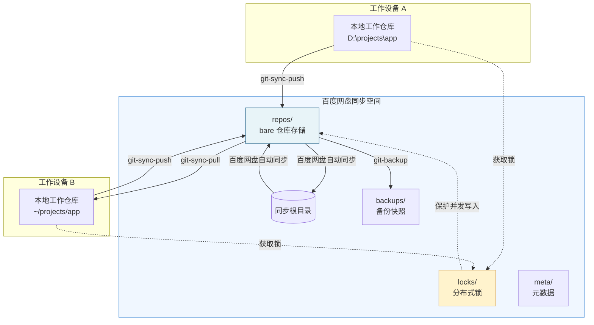

# 基于百度网盘的私有 Git 跨设备同步方案

本方案利用 `git clone --no-local` 硬链接复制技术结合百度网盘文件同步，构建了一套无需自建服务器、零成本的私有 Git 仓库跨设备同步体系。它解决了个人开发者在多台电脑间同步私有代码、避免代码托管平台隐私风险的问题，适合个人开发者、小团队成员、注重代码隐私的技术人员使用，无需公网IP、无需额外服务器费用，开箱即用。

---

> ⚠️ **核心操作原则（必须严格遵守）**
>
> - **单写者原则**：同一时间只在一台设备执行 push 操作，避免并发写入冲突
> - **Push后等待**：push 完成后务必等待百度网盘同步完成（脚本默认自动等待检测）
> - **不要绕过锁**：脚本内置分布式锁机制保护，禁止手动直接操作 `repos/` 目录
> - **定期备份**：每周至少执行一次 `git-doctor full` 健康检查，重大操作前必须先 `git-backup`
> - **出现错误先诊断**：遇到异常不要盲目重试，先用 `git-diag` 诊断问题根因

---

> ```
> ╔══════════════════════════════════════════════════════════════╗
> ║  🚨 DANGER: 重要风险认知（使用前必读）                      ║
> ║                                                              ║
> ║  1. 锁机制是"弱信号"而非强一致锁！                           ║
> ║     跨设备同步有延迟窗口，锁不能100%阻止并发。               ║
> ║     核心纪律仍是：同一时间只在一台设备操作。                 ║
> ║                                                              ║
> ║  2. 网盘中的 backups 目录不是真正的备份！                    ║
> ║     备份和主数据在同一故障域，网盘故障时一起丢失。           ║
> ║     必须每月复制 bundle 到网盘外冷存储。                     ║
> ║                                                              ║
> ║  3. 这不是零维护方案！                                       ║
> ║     需要每周健康检查、每月冷备份、遵守操作纪律。             ║
> ║     做不到这些建议直接用 GitHub/GitLab。                     ║
> ║                                                              ║
> ║  4. 同步路径不要含中文和空格！                               ║
> ║     推荐路径：D:\BaiduSync\git-sync 或 ~/BaiduSync/git-sync ║
> ║                                                              ║
> ║  详细坑点与反模式清单见：11-pitfalls-anti-patterns.md        ║
> ╚══════════════════════════════════════════════════════════════╝
> ```

---

## 🚀 Quick Start（5步快速开始）

### Step 1: 前置条件检查
- Git ≥ 2.30（支持 `--no-local` 参数优化）
- 百度网盘客户端已安装并登录
- 百度网盘同步空间功能已开通

### Step 2: 初始化同步目录
**Windows PowerShell：**
```powershell
.\init-sync-dir.ps1 -SyncPath "D:\BaiduSync\git-sync"
```

**Bash/macOS/Linux：**
```bash
chmod +x init-sync-dir.sh
./init-sync-dir.sh --sync-path ~/BaiduSync/git-sync
```

### Step 3: 配置Git环境
```powershell
# Windows
.\setup-git-config.ps1

# Bash
./setup-git-config.sh
```

### Step 4: 首台设备注册第一个仓库
```powershell
# Windows
.\register-repo.ps1 -LocalRepoPath "D:\projects\my-app" -RepoName "my-app"

# Bash
./register-repo.sh --local-repo-path ~/projects/my-app --repo-name my-app
```

### Step 5: 等待同步完成，在新设备克隆
等待百度网盘同步完成后（可观察同步图标状态），在另一台设备执行：
```powershell
# Windows
.\clone-repo.ps1 -RepoName "my-app" -TargetPath "D:\projects\my-app"

# Bash
./clone-repo.sh --repo-name my-app --target-path ~/projects/my-app
```

### 日常使用
```bash
# 一键同步（自动pull→push一体化）
git-sync
```

---

## 📂 文档索引

| 序号 | 文档 | 说明 |
|------|------|------|
| 1 | [01-directory-structure.md](01-directory-structure.md) | 同步目录结构设计、各目录职责与文件组织规范 |
| 2 | [02-cross-platform-config.md](02-cross-platform-config.md) | Windows/macOS/Linux 跨平台路径配置与环境差异处理 |
| 3 | [03-repo-init-workflow.md](03-repo-init-workflow.md) | 新仓库注册、bare仓库创建、首次注册完整流程详解 |
| 4 | [04-locking-mechanism.md](04-locking-mechanism.md) | 分布式锁实现原理、锁文件格式、死锁预防与强制解锁 |
| 5 | [05-daily-sync-workflow.md](05-daily-sync-workflow.md) | 日常pull/push工作流、同步等待机制、状态检测 |
| 6 | [06-conflict-detection.md](06-conflict-detection.md) | 冲突自动检测原理、冲突场景分类、手动解决流程 |
| 7 | [07-health-check.md](07-health-check.md) | git-doctor健康检查工具使用、常见问题自动修复 |
| 8 | [08-performance-optimization.md](08-performance-optimization.md) | 大仓库优化、同步加速策略、忽略文件配置最佳实践 |
| 9 | [09-backup-recovery.md](09-backup-recovery.md) | 备份策略、灾难恢复流程、仓库损坏修复方法 |
| 10 | [10-troubleshooting.md](10-troubleshooting.md) | 常见问题排查、错误码对照表、诊断流程 |
| 11 | [11-pitfalls-anti-patterns.md](11-pitfalls-anti-patterns.md) | 常见陷阱、反模式识别、避坑指南 |

---

## 🛠️ 脚本工具速查表

| 脚本名 | 平台 | 用途 | 常用示例 |
|--------|------|------|----------|
| `init-sync-dir.ps1/sh` | 全平台 | 初始化同步根目录结构 | `init-sync-dir.ps1 -SyncPath "D:\BaiduSync\git-sync"` |
| `setup-git-config.ps1/sh` | 全平台 | 配置Git全局参数与别名 | `setup-git-config.ps1` |
| `register-repo.ps1/sh` | 全平台 | 注册本地仓库到同步空间 | `register-repo.ps1 -LocalRepoPath "D:\proj\app" -RepoName "app"` |
| `clone-repo.ps1/sh` | 全平台 | 从同步空间克隆仓库到本地 | `clone-repo.ps1 -RepoName "app" -TargetPath "D:\proj\app"` |
| `git-sync-push.ps1/sh` | 全平台 | 安全push并等待网盘同步 | `git-sync-push.ps1` |
| `git-sync-pull.ps1/sh` | 全平台 | 安全pull最新变更 | `git-sync-pull.ps1` |
| `git-sync.ps1/sh` | 全平台 | 一键同步（pull+push） | `git-sync.ps1` |
| `check-conflicts.ps1/sh` | 全平台 | 检测潜在冲突风险 | `check-conflicts.ps1 -RepoName "app"` |
| `git-doctor.ps1/sh` | 全平台 | 仓库健康检查与修复 | `git-doctor.ps1 -Mode full -Fix` |
| `git-backup.ps1/sh` | 全平台 | 创建仓库备份快照 | `git-backup.ps1 -Note "pre-refactor"` |
| `git-diag.ps1/sh` | 全平台 | 问题诊断工具 | `git-diag.ps1` |
| `force-unlock.ps1/sh` | 全平台 | 强制解除锁（紧急情况） | `force-unlock.ps1 -RepoName "app"` |

---

## 📋 日常使用速查

| 场景 | 命令 |
|------|------|
| 日常工作开始前 | `git-sync-pull`（或直接 `git-sync`） |
| 完成工作后 | `git add .` → `git commit -m "msg"` → `git-sync-push`（或直接 `git-sync`） |
| 遇到异常 | `git-diag` |
| 每周维护 | `git-doctor -Mode full -Fix` |
| 重大操作前 | `git-backup -Note "pre-xxx"` |

---

## 🏗️ 架构概览图



---

## ✅ 适用场景与限制

### 适用场景
- 个人多设备私有代码同步（办公电脑 + 家用电脑 + 笔记本）
- 2-5人小团队简单协作
- 无服务器环境下的私有Git仓库方案
- 对代码隐私有高要求，不希望托管到第三方平台

### 不适用场景
- 超过10人的中大型团队协作
- 需要Pull Request/Code Review流程的团队
- 单仓库体积超过10GB的大型项目
- 需要实时多人协作编辑的场景
- 对同步延迟有秒级要求的场景

---

## ❓ FAQ快速入口

**Q: push后另一台设备看不到最新代码怎么办？**
→ 先检查百度网盘是否同步完成（查看同步状态图标），等待几分钟后再执行 `git-sync-pull`，如仍有问题运行 `git-diag` 诊断。详见 [10-troubleshooting.md](10-troubleshooting.md)。

**Q: 提示"仓库被锁定"怎么办？**
→ 这是正常的并发保护机制，确认没有其他设备正在push后，等待5分钟自动释放；如确认是异常死锁，可使用 `force-unlock` 手动解锁。详见 [04-locking-mechanism.md](04-locking-mechanism.md)。

**Q: 如何新增一个仓库到同步？**
→ 在本地仓库目录执行 `register-repo` 命令即可自动注册，详见 [03-repo-init-workflow.md](03-repo-init-workflow.md)。

**Q: 仓库损坏了如何恢复？**
→ 先运行 `git-doctor -Fix` 尝试自动修复，如无法修复使用 `git-backup` 创建的备份快照恢复。详见 [09-backup-recovery.md](09-backup-recovery.md)。

**Q: 同步速度很慢怎么办？**
→ 检查是否提交了大文件，配置好 `.gitignore`，参考 [08-performance-optimization.md](08-performance-optimization.md) 进行优化。

---

## 📚 相关资源

- [Git 进阶 Wiki 总览](../git-advanced-wiki/00-overview.md)
- [git clone 高级用法](../git-advanced-wiki/01-git-clone-advanced.md) - 理解 `--no-local` 硬链接技术原理
