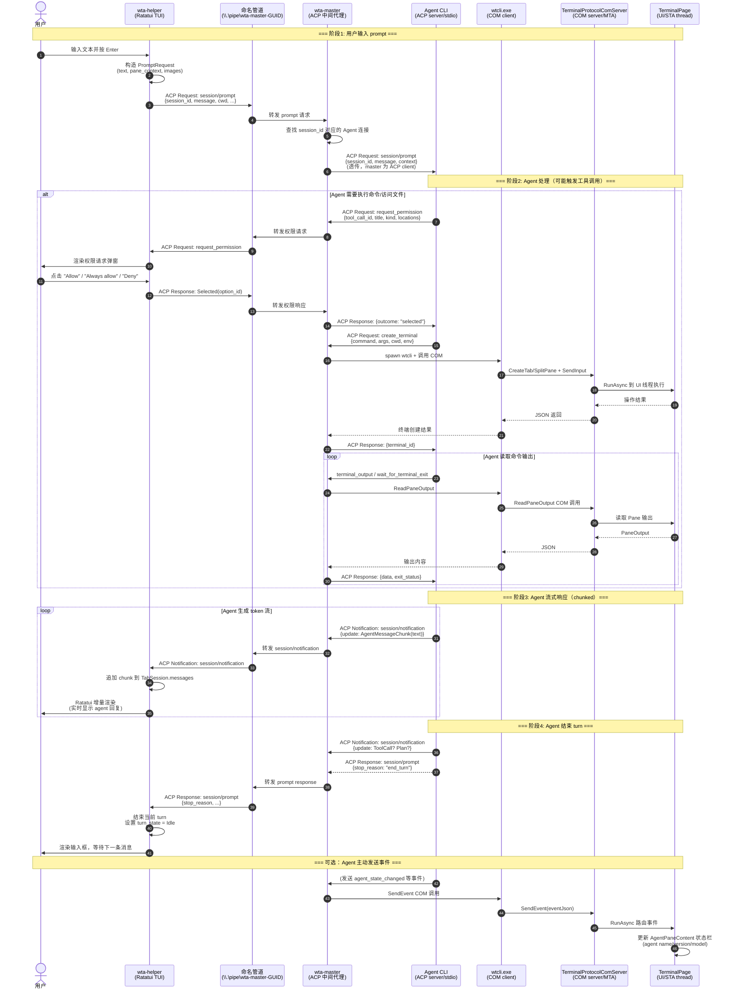

# 第6章 通信协议栈

通信协议栈是 Intelligent Terminal 的核心骨架，负责在 C++ 终端进程、Rust WTA 编排器、Agent CLI 子进程之间建立可靠、安全、分层的跨进程通信通道。整个栈采用三层架构设计，从底层终端 I/O 到高层 JSON-RPC 业务协议逐层封装，每层职责单一、边界清晰。

---

## 6.1 通信协议栈总览

Intelligent Terminal 采用三层协议栈架构，每一层解决不同的通信问题：

| 层级 | 协议 | 传输介质 | 参与方 | 职责 | 序列化格式 |
|------|------|----------|--------|------|------------|
| **L1 终端层** | ConPTY (Windows Pseudo Console) | 匿名管道 (stdio) | wta-helper ↔ Windows 内核 ConPTY | 提供原生控制台输入输出、VT 序列处理、终端仿真 | 原始字节流 + VT/OSC 转义序列 |
| **L2 业务协议层** | ACP (Agent Client Protocol) 1.3.0 | 命名管道 + stdio | wta-helper ↔ wta-master ↔ Agent CLI | Agent 会话管理、prompt/response 流、工具调用、权限请求、终端创建 | JSON-RPC 2.0 |
| **L3 集成层** | WT Protocol (IProtocolServer) | COM (Local Server) | wtcli/wta-master ↔ WindowsTerminal.exe | 窗口/标签/窗格枚举、输出捕获、输入注入、事件订阅 | COM 接口 + BSTR JSON |

### 三层分工对比

| 维度 | ConPTY (L1) | ACP (L2) | COM IProtocolServer (L3) |
|------|-------------|----------|---------------------------|
| 方向 | 双向字节流 | 双向请求/响应/通知 | 双向方法调用 + 事件回调 |
| 信任边界 | 进程内（helper 是 ConPTY 子进程） | 同 Job Object 内进程间 | 跨进程 COM 激活（打包 COM 策略） |
| 主要使用者 | wta-helper TUI (Ratatui) | wta-master、wta-helper、Agent CLI | wtcli.exe、wta-master |
| 发现机制 | CreateProcess 继承句柄 | 命名管道名（GUID） | `WT_COM_CLSID` 环境变量 |
| 典型负载 | VT100/OSC 控制序列、ANSI 颜色 | session/new、session/prompt、AgentMessageChunk | list_panes JSON、SendInput 字符串 |
| 是否流式 | 是（原始 TTY 流） | 是（chunked session/update 通知） | 否（同步方法调用 + 队列化事件） |

> **来源**：[`AGENTS.md` 架构章节](../../../../../external/libs/intelligent-terminal/AGENTS.md#L47-L62)、[`TerminalProtocol.idl`](../../../../../external/libs/intelligent-terminal/src/cascadia/TerminalProtocol/TerminalProtocol.idl#L1-L135)

---

## 6.2 COM IProtocolServer 详解

`IProtocolServer` 是 Windows Terminal 暴露给外部进程的唯一集成表面，基于经典 COM（Classic COM）本地服务器实现，而非 WinRT 服务器。这一选择是为了规避 WinRT MBM（Metadata-Based Marshaling）激活目录中的崩溃问题（0xc0000005 / 0x80010105）。

### 6.2.1 WinRT IDL 定义

接口通过 WinRT IDL（Interface Definition Language）定义，位于 [`TerminalProtocol.idl`](../../../../../external/libs/intelligent-terminal/src/cascadia/TerminalProtocol/TerminalProtocol.idl)：

```idl
// TerminalProtocol.idl:92-134
namespace Microsoft.Terminal.Protocol
{
    // 回调接口 — 客户端（如 wtcli）实现，接收推送事件
    interface IProtocolEventCallback
    {
        void OnEvent(String eventJson);
    }

    // 服务器接口 — WindowsTerminal.exe 实现，wtcli.exe 消费
    // 通过 CoCreateInstance (CLSCTX_LOCAL_SERVER) + 自定义类工厂激活
    // 通过 OpenConsoleProxy proxy/stub 跨进程封送（非 WinRT MBM）
    interface IProtocolServer
    {
        // Meta
        AuthResult Authenticate(String token);
        String GetCapabilities();

        // Queries
        PaneInfo GetActivePane();
        WindowInfo[] ListWindows();
        TabInfo[] ListTabs(UInt64 windowIdFilter);
        PaneInfo[] ListPanes(UInt64 windowIdFilter, UInt32 tabIdFilter);
        PaneOutput ReadPaneOutput(Guid sessionId, String source, Int32 maxLines);
        ProcessStatus GetProcessStatus(Guid sessionId);
        SessionVariable GetSessionVariable(Guid sessionId, String name);
        String GetSettings();

        // Mutations
        TabCreationResult CreateTab(UInt64 windowId, String profile, String commandline, ...);
        TabCreationResult SplitPane(Guid sessionId, String direction, Single size, ...);
        void ClosePane(Guid sessionId);
        void SendInput(Guid sessionId, String text);
        void FocusPane(Guid sessionId);
        void SetSessionVariable(Guid sessionId, String name, String value);

        // Events — 基于回调的推送
        void Subscribe(IProtocolEventCallback callback);
        void Unsubscribe();

        // 客户端发起的事件发布（agent → WT → 监听器）
        void SendEvent(String eventJson);
    }
}
```

IDL 同时定义了多个结构化类型用于跨 COM 边界传递数据：

| 结构体 | 关键字段 | 用途 |
|--------|----------|------|
| `WindowInfo` | WindowId, Title, IsFocused, TabCount | 窗口元数据 |
| `TabInfo` | TabId, WindowId, Title, IsActive, PaneCount | 标签元数据 |
| `PaneInfo` | SessionId(Guid), TabId, WindowId, Title, Profile, IsActive, IsAgentPane, Pid, Rows, Columns, Cwd, Shell, ShellVersion | 窗格完整信息 |
| `PaneOutput` | SessionId, Content, LineCount, Truncated, HasMarks | 窗格输出捕获（支持 OSC 133 marks） |
| `ProcessStatus` | SessionId, State, Pid, ExitCode, HasExitCode | 进程状态查询 |
| `TabCreationResult` | TabId, SessionId, WindowId, Pid | 新建标签/分屏结果 |
| `AuthResult` | Authenticated, ProtocolVersion | 握手结果（当前协议版本 2.2） |

### 6.2.2 Out-of-Process COM Server 与 CLSCTX_LOCAL_SERVER

[`TerminalProtocolComServer::s_StartListening()`](../../../../../external/libs/intelligent-terminal/src/cascadia/WindowsTerminal/TerminalProtocolComServer.cpp#L44-L94) 在专用 MTA（Multi-Threaded Apartment）线程上注册 COM 类工厂：

```cpp
// TerminalProtocolComServer.cpp:59-88
g_comMtaThread = std::thread([&ready, &regHr]() {
    auto coInit = wil::CoInitializeEx(COINIT_MULTITHREADED);

    // Classic-COM class factory (WRL) — 通过 OpenConsoleProxy proxy/stub 封送
    // 不使用 WinRT MBM
    const auto factory = Make<SimpleClassFactory<TerminalProtocolComServer>>();
    // ...
    regHr = CoRegisterClassObject(
        __uuidof(TerminalProtocolComServer),
        unk.Get(),
        CLSCTX_LOCAL_SERVER,       // 本地服务器（跨进程）
        REGCLS_MULTIPLEUSE,
        &g_comRegistration);
    // ...
    WaitForSingleObject(g_comMtaStop.get(), INFINITE);
});
```

关键设计点：

1. **MTA 线程模型**：专用 MTA 线程保持 COM 注册存活，传入 COM 调用在 MTA 工作线程上执行，不阻塞 UI/STA 线程
2. **UI 线程封送**：每个 COM 方法内部通过 `dispatcher.RunAsync()` 封送到 UI 线程查询 XAML 状态，然后 `.get()` 等待结果——因为在 MTA 线程上，`.get()` 不会死锁 UI 线程
3. **品牌化 CLSID**：每个发布品牌（Release/Preview/Canary/Dev）有独立的 CLSID，避免不同渠道版本的 COM 注册冲突

### 6.2.3 WT_COM_CLSID 环境变量发现机制

客户端不需要硬编码 CLSID。Windows Terminal 启动时将当前品牌的 CLSID 写入自身环境变量，并通过 ConPTY 继承传播给所有子进程（包括 wta-master、wta-helper、wtcli、用户 shell）：

```
WT_COM_CLSID={A2E4F6B8-1C3D-4E5F-A6B7-C8D9E0F1A2B3}
```

客户端（wtcli）连接流程：
1. 读取 `WT_COM_CLSID` 环境变量，解析为 GUID
2. 调用 `CoCreateInstance(clsid, nullptr, CLSCTX_LOCAL_SERVER, IID_PPV_ARGS(&server))`
3. 调用 `Authenticate("")` 进行兼容性握手（COM 激活本身是信任边界，此调用不做权限门禁）
4. 调用 `GetCapabilities()` 获取支持的方法列表
5. 开始正常方法调用或 `Subscribe()` 订阅事件

> **来源**：[`tools/wta/README.md` 协议发现章节](../../../../../external/libs/intelligent-terminal/tools/wta/README.md#L95-L108)、[`OVERVIEW.md` WTA ↔ WT (COM)](../../../../../external/libs/intelligent-terminal/tools/wta/OVERVIEW.md#L164-L172)

### 6.2.4 关键方法详解

| 分类 | 方法 | 说明 |
|------|------|------|
| **Meta** | `Authenticate(token)` | 兼容性握手，返回 protocol_version（当前 "2.2"）。COM 激活是信任边界，不做权限门禁 |
| | `GetCapabilities()` | 返回支持的方法名 JSON 数组 |
| **查询** | `GetActivePane()` | 获取最近活跃窗口的当前焦点窗格信息 |
| | `ListWindows()` | 枚举所有顶层窗口，返回 WindowInfo 数组 |
| | `ListTabs(windowIdFilter)` | 枚举标签页，可按 window_id 过滤；0 表示全部窗口 |
| | `ListPanes(windowIdFilter, tabIdFilter)` | 枚举窗格，支持按窗口/标签双重过滤；0 表示不过滤 |
| | `ReadPaneOutput(sessionId, source, maxLines)` | 读取窗格输出。source 可为 `"scrollback"` 或 `"marks"`（OSC 133 prompt marks） |
| | `GetProcessStatus(sessionId)` | 查询窗格中进程的运行状态、PID、退出码 |
| | `GetSessionVariable(sessionId, name)` / `SetSessionVariable()` | 会话变量读写，用于跨进程状态传递 |
| | `GetSettings()` | 读取 settings.json 完整内容 |
| **变更** | `CreateTab(windowId, profile, ...)` | 在指定窗口创建新标签页，返回 TabCreationResult（含新 session_id） |
| | `SplitPane(sessionId, direction, size, ...)` | 在指定窗格分屏（direction: "vertical"/"horizontal"），返回新窗格信息 |
| | `ClosePane(sessionId)` | 关闭指定窗格 |
| | `FocusPane(sessionId)` | 将焦点切换到指定窗格 |
| | `SendInput(sessionId, text)` | 向窗格发送输入文本（注入键盘输入） |
| **事件** | `Subscribe(callback)` | 注册事件回调，开始接收 push 事件。每个连接有独立 4096 事件有界队列 |
| | `Unsubscribe()` | 取消订阅，停止接收事件 |
| | `SendEvent(eventJson)` | 客户端向 WT 发送事件（如 restart、autofix、agent_state_changed 等），WT 广播给所有订阅者 |

### 6.2.5 事件 Fan-out 与背压机制

COM 服务器采用**生产者-消费者模型**处理事件广播，解决 issue #239（慢客户端阻塞 UI 线程）：

- **生产者**（UI/STA 线程上的 VT 事件、COM MTA 线程上的 SendEvent 广播）调用 `_enqueueEvent()` → 入队后立即返回，永不阻塞
- **消费者**（每个订阅者一个 detached MTA 线程）调用 `wait_pop()` → 解析 agile reference → 同步跨进程调用 `sink->OnEvent()`
- **背压策略**：队列满（4096 个事件）时丢弃最旧事件，防止内存无限制增长
- **Agile Reference**：事件 sink 通过 `RoGetAgileReference()` 存储为 agile reference，可在任意公寓（MTA/STA）解析
- **无阻塞 Teardown**：投递线程是 detached 的，通过 `queue.stop()` 通知退出，不 join 避免死锁

事件上行路径（wta-helper → WT → wta-master）：
1. wta-helper 通过 ConPTY 发送特殊 OSC VT 序列（OSC 封装的 JSON）
2. TermControl 接收并触发 `ProtocolVtSequenceReceived` typed_event
3. TerminalPage 将事件转发给 `s_NotifyEventToComClients()`
4. COM 服务器将事件 fan-out 到所有订阅者的有界队列
5. 每个订阅者的投递线程同步调用 `OnEvent()` 回调

> **来源**：[`TerminalProtocolComServer.cpp` 事件投递](../../../../../external/libs/intelligent-terminal/src/cascadia/WindowsTerminal/TerminalProtocolComServer.cpp#L368-L474)、[`TerminalProtocolComServer.h` BoundedDispatchQueue](../../../../../external/libs/intelligent-terminal/src/cascadia/WindowsTerminal/TerminalProtocolComServer.h#L78-L118)

---

## 6.3 ACP (Agent Client Protocol) 1.3.0

ACP（Agent Client Protocol）是 WTA 内部使用的应用层协议，基于 JSON-RPC 2.0，实现了 master/helper 多路复用架构下的 Agent 会话管理。ACP 的核心特点是**双跳通信模型**——wta-master 在其中扮演双重角色。

### 6.3.1 JSON-RPC 2.0 双跳通信

ACP 不是简单的点对点协议，而是由 wta-master 作为中间代理的双跳架构：

```
第一跳 (stdio):  wta-master (ACP client)  ←──JSON-RPC 2.0──→  Agent CLI (ACP server)
第二跳 (pipe):    wta-helper (ACP client)  ←──JSON-RPC 2.0──→  wta-master (ACP agent/server)
```

wta-master 的双重身份：
- **面向 Agent CLI**：master 是 **ACP client**，通过 stdio 连接到 Agent CLI 子进程，发送 `initialize`、`session/new`、`session/prompt` 等请求
- **面向 wta-helper**：master 是 **ACP agent (server)**，通过命名管道接收 helper 的连接，转发请求/响应，推送 `session/update` 通知

这种设计让 Agent CLI 只需支持标准的 ACP stdio 传输（最简单的实现方式），而多 Tab/多窗口/多 helper 的复杂性完全由 master 处理。

### 6.3.2 第一跳：master ↔ Agent CLI (stdio)

当 wta-master 启动时，它会 spawn 配置的 Agent CLI 子进程（如 copilot-cli、claude、gemini 等），通过子进程的 stdin/stdout 建立 ACP 连接：

- **传输**：子进程 stdio（匿名管道继承）
- **master 角色**：ACP Client
- **Agent CLI 角色**：ACP Server
- **连接方向**：master 主动 spawn 子进程，立即开始 ACP 握手
- **生命周期**：Agent CLI 由 master 管理，整个 WT 进程生命周期内复用（除非崩溃重启或切换 Agent）

关键流程：
1. master spawn Agent CLI，设置 `--stdio` 等参数
2. master 发送 `initialize` 请求进行握手
3. Agent CLI 返回能力信息（supported tools、promptCapabilities 等）
4. 多个 helper 可以共享同一个 Agent CLI 连接——master 负责 session 路由
5. master 发送 `authenticate` 请求（如果需要）

### 6.3.3 第二跳：helper ↔ master (named pipe)

每个 wta-helper 进程（对应一个 Agent Pane）通过 Windows 命名管道连接到 wta-master：

- **传输**：Windows Named Pipe（`\\.\pipe\wta-master-<GUID>`）
- **helper 角色**：ACP Client
- **master 角色**：ACP Agent（Server）
- **连接方向**：helper 主动连接，带退避重试
- **生命周期**：每个 helper 一个连接，helper 退出时连接关闭；master 崩溃时 helper 检测并重连

连接建立流程（[`client.rs:1128-1226`](../../../../../external/libs/intelligent-terminal/tools/wta/src/protocol/acp/client.rs#L1128-L1226)）：

```rust
// client.rs:1184-1206 — 带退避重试的管道连接
let mut attempt: u32 = 0;
let pipe = loop {
    match tokio::net::windows::named_pipe::ClientOptions::new().open(&pipe_name) {
        Ok(pipe) => break pipe,
        Err(e) => {
            let raw = e.raw_os_error().unwrap_or(0);
            let retryable = raw == ERROR_FILE_NOT_FOUND || raw == ERROR_PIPE_BUSY;
            if !retryable || attempt as usize >= backoff_ms.len() {
                return Err(/* handshake failed */);
            }
            tokio::time::sleep(Duration::from_millis(backoff_ms[attempt as usize])).await;
            attempt++;
        }
    }
};
```

退避策略：
- 冷启动重试：50ms → 100ms → 200ms → 500ms → 1s → 2s → 5s → 10s → 15s（最长约 60s，等待 npx 适配器）
- 登录后重连：更短的有界重试（50ms → 2s，共约 10s），失败则触发完整 master 重启

### 6.3.4 关键 ACP 消息类型

ACP 消息分为三类：**Request（请求-响应）**、**Notification（通知，无响应）**、**Response（响应）**。以下是核心消息：

| 方向 | 方法 | 类型 | 说明 |
|------|------|------|------|
| Client→Server | `initialize` | Request | 握手初始化，交换协议版本、能力信息、客户端元数据 |
| Client→Server | `authenticate` | Request | 认证（如 device-code 登录） |
| Client→Server | `session/new` | Request | 创建新会话，携带 cwd、_meta（wta pane_session_id、owner_tab_id） |
| Client→Server | `session/load` | Request | 加载历史会话（session resume） |
| Client→Server | `session/prompt` | Request | 发送用户 prompt，返回 stop reason（end_turn/tool_use/max_tokens等） |
| Client→Server | `session/cancel` | Notification | 取消正在进行的 prompt（Ctrl+C） |
| Client→Server | `session/set_model` | Request | 热切换会话模型（不重启） |
| Client→Server | `session/set_mode` | Request | 设置会话模式 |
| Client→Server | `list_sessions` | Request | 列出历史会话 |
| Server→Client | `session/notification` | Notification | **核心流式通知**，承载 Agent 响应 chunk：AgentMessageChunk、AgentThoughtChunk、ToolCall、ToolCallUpdate、Plan |
| Server→Client | `request_permission` | Request | 请求用户授权工具调用（危险操作需确认） |
| Server→Client | `create_terminal` | Request | 请求创建新终端（Agent 运行命令） |
| Server→Client | `terminal_output` | Request | 读取终端输出 |
| Server→Client | `wait_for_terminal_exit` | Request | 等待终端退出，获取退出码 |
| Server→Client | `release_terminal` | Request | 释放终端句柄 |
| Server→Client | `kill_terminal` | Request | 终止终端进程 |
| Server→Client | `read_text_file` / `write_text_file` | Request | 文件读写（经权限模型） |
| Server→Client | `ext/notification` | Notification | 扩展命名空间通知（intellterm.wta/*） |

> **来源**：[`conn.rs` ClientLink/AgentLink 方法定义](../../../../../external/libs/intelligent-terminal/tools/wta/src/protocol/acp/conn.rs#L108-L274)、[`client.rs` WtaClient 实现](../../../../../external/libs/intelligent-terminal/tools/wta/src/protocol/acp/client.rs#L501-L898)

---

## 6.4 ConPTY 层：Windows 伪控制台

ConPTY（Windows Pseudo Console）是协议栈的最底层，为 wta-helper 提供原生控制台环境。wta-helper 不是普通 GUI 应用——它是一个 ConPTY 子进程，其 stdio 直接连接到 Windows 内核的伪控制台对象。

### 6.4.1 ConPTY 在架构中的位置

```
WindowsTerminal.exe
  └── TermControl (XAML 终端控件)
        └── ConptyConnection
              └── ConPTY (Windows 内核伪控制台)
                    └── wta-helper.exe (ConPTY child process)
                          ├── stdin  ← 键盘输入（通过 SendInput/VT序列）
                          ├── stdout → TUI 渲染输出（VT100/Ratatui）
                          └── stderr → 日志输出
```

wta-helper 作为 ConPTY 子进程获得：
- **原生控制台输入**：Windows 将所有键盘事件转换为控制台输入事件，wta-helper 可以像真正的控制台程序一样使用 `ReadConsoleInput` 或 `crossterm` 读取按键
- **VT 序列输出**：wta-helper 使用 Ratatui 库输出 ANSI/VT100 控制序列来渲染 TUI（文本用户界面），ConPTY 将这些序列翻译为 XAML TermControl 可以渲染的格式
- **OSC 上行通道**：wta-helper 可以通过输出特殊的 OSC（Operating System Command）序列向 TermControl 发送带外消息——这正是 WT 事件上行的基础

### 6.4.2 OSC 上行通道：wta-helper → WT 事件桥

VT 协议预留了 OSC（Operating System Command）序列用于带外通信。Windows Terminal 使用私有 OSC 序列承载 wta-helper → WT 方向的事件：

```
OSC <params> ; <JSON payload> ST
```

TermControl 接收到这类特殊 OSC 序列时，不将其渲染为文本，而是触发 `ProtocolVtSequenceReceived` 事件，将 JSON payload 向上传递到 COM 服务器，最终 fan-out 给所有订阅者（主要是 wta-master）。

这种设计的优势：
- 无需额外的管道或套接字，复用已有的 ConPTY 字节流
- 天然跨进程（ConPTY 已处理边界）
- 不破坏正常终端输出——OSC 序列本身不显示在屏幕上

### 6.4.3 为什么 helper 必须是 ConPTY 子进程

wta-helper 选择 ConPTY 作为承载而非独立窗口或管道的原因：
1. **TUI 体验**：Ratatui TUI 需要一个真实的终端环境才能正确渲染（光标移动、颜色、鼠标支持）
2. **Pre-warm 兼容**：stash/restore 只是 XAML 视觉树操作，底层 ConPTY 连接、wta-helper 进程、ACP 会话全部存活
3. **统一 I/O 模型**：wta-helper 使用与普通终端程序相同的 stdio 模型，不需要特殊处理
4. **Shell 集成**：wta-helper 内部可以再 spawn shell（如通过 `create_terminal` ACP 方法），形成终端嵌套

> **来源**：[`AGENTS.md` Per-tab agent pane](../../../../../external/libs/intelligent-terminal/AGENTS.md#L56-L58)、[`05-cpp-integration.md` AgentPaneContent 章节](05-cpp-integration.md#56-agentpanecontentxaml-chrome-包裹)

---

## 6.5 ACP 双跳协议栈图

下图展示了完整的三层协议栈，重点突出 ACP 的双跳通信模型：

```mermaid
flowchart TD
    subgraph Windows_Process["Windows 终端进程 (WindowsTerminal.exe)"]
        direction TB
        subgraph UI_Layer["UI 层 (STA/XAML Thread)"]
            TP[TerminalPage]
            TC[TermControl<br/>XAML 终端控件]
        end
        subgraph COM_Layer["L3 集成层 (MTA Thread Pool)"]
            CS[TerminalProtocolComServer<br/>Classic COM Local Server<br/>CLSCTX_LOCAL_SERVER]
            BDQ[BoundedDispatchQueue<br/>per-subscriber 4K]
        end
        subgraph Singleton["单例管理层"]
            SW[SharedWta<br/>进程单例]
        end
    end

    subgraph Job_Object["Job Object 进程树 (KILL_ON_JOB_CLOSE)"]
        direction TB
        WM["wta-master<br/>(Rust, 进程单例)<br/><b>ACP Client (面向Agent)<br/>ACP Agent/Server (面向Helper)</b>"]
        subgraph Helpers["wta-helper 实例 (N个，每Tab一个)"]
            direction LR
            WH1["wta-helper Pane 1<br/>(Ratatui TUI)<br/><b>ACP Client</b>"]
            WH2["wta-helper Pane 2<br/>(Ratatui TUI)<br/><b>ACP Client</b>"]
            WHN["wta-helper Pane N<br/>(Ratatui TUI)<br/><b>ACP Client</b>"]
        end
        ACLI["Agent CLI<br/>(copilot/claude/gemini/...)<br/><b>ACP Server</b>"]
        ShellCmd["用户 Shell 命令<br/>(cmd/pwsh/bash/wsl)"]
    end

    %% ── L1 ConPTY 层 ──
    TC -.->|"L1: ConPTY<br/>匿名管道 stdio<br/>VT/OSC 字节流"| WH1
    note over TC,WH1:wta-helper 是 ConPTY 子进程<br/>获得原生控制台 I/O

    %% ── L2 ACP 双跳 ──
    PIPE["\\.\pipe\wta-master-&lt;GUID&gt;<br/><b>L2: ACP/JSON-RPC 2.0 (第二跳)</b>"]
    WM -.->|"L2: ACP/JSON-RPC 2.0 (第一跳)<br/>stdio 匿名管道"| ACLI
    WH1 -->|connect + ACP over pipe| PIPE
    WH2 -->|connect + ACP over pipe| PIPE
    WHN -->|connect + ACP over pipe| PIPE
    PIPE --> WM
    note over WM,PIPE:master 在命名管道上充当 ACP Server<br/>接收 helper 的请求/转发 Agent 响应

    %% ── L3 COM 层 ──
    WTCLI["wtcli.exe<br/>(COM Client)"]
    WM -->|"spawn wtcli 子进程"| WTCLI
    WTCLI -->|"L3: COM IProtocolServer<br/>CoCreateInstance<br/>CLSCTX_LOCAL_SERVER"| CS
    CS -->|RunAsync → UI thread| TP
    TP -->|管理| TC
    WM -->|COM 客户端（事件订阅）| CS

    %% ── OSC 上行 ──
    WH1 -->|"OSC JSON VT 序列<br/>ProtocolVtSequenceReceived"| TC
    TC -->|事件 fan-out| CS

    %% ── Agent 命令执行 ──
    ACLI -->|"create_terminal<br/>request_permission"| WM
    WM -->|"terminal_output<br/>wait_for_terminal_exit"| ShellCmd

    %% ── SharedWta spawn master ──
    SW -->|CreateProcessW CREATE_SUSPENDED| WM
    SW -->|AssignProcessToJobObject| Job_Object
    note over SW,Job_Object:SharedWta 管理 master 生命周期<br/>Job Object 保证崩溃时全部清理

    %% ── 样式 ──
    style CS fill:#9cf,stroke:#333,stroke-width:2px
    style WM fill:#ff9,stroke:#333,stroke-width:2px
    style ACLI fill:#f9f,stroke:#333,stroke-width:2px
    style PIPE fill:#9f9,stroke:#333,stroke-width:2px
    style BDQ fill:#fcc,stroke:#333
    style Job_Object fill:#f5f5f5,stroke:#999,stroke-dasharray:5,5
```

### 栈图说明

1. **L1 ConPTY 层**（橙色虚线）：每个 wta-helper 通过 ConPTY 连接到 TermControl，这是 TUI 渲染和 OSC 上行的基础
2. **L2 ACP 双跳**（绿色实线）：
   - **第一跳**：wta-master 通过 stdio 与 Agent CLI 通信（master 是 client）
   - **第二跳**：多个 wta-helper 通过命名管道连接到 master（master 是 server/agent）
   - master 在中间负责 session 路由、消息转发、多路复用
3. **L3 COM 层**（蓝色实线）：wta-master 通过 wtcli.exe 子进程调用 COM 接口，查询/操控 Windows Terminal 状态
4. **事件上行**：wta-helper → OSC VT 序列 → TermControl → COM fan-out → wta-master
5. **Job Object 隔离**：所有 Rust 进程在 Job Object 中，WT 崩溃时 OS 自动清理

---

## 6.6 端到端消息流时序图

下图展示了用户在 wta-helper TUI 中输入 prompt 到接收 Agent 流式响应的完整端到端流程：



### 时序图关键节点说明

1. **Prompt 提交**（1-5步）：用户在 helper TUI 中按 Enter，helper 通过命名管道发送 `session/prompt` 请求给 master，master 透传给 Agent CLI
2. **权限拦截**（7-16步）：如果 Agent 要执行危险操作（写文件、运行命令），会先通过 `request_permission` 请求用户授权，helper 显示权限弹窗等待用户选择
3. **工具调用**（18-30步）：获得授权后，Agent 通过 `create_terminal` 请求创建终端运行命令，master 调用 wtcli → COM 操控 WT，结果回传给 Agent
4. **流式响应**（32-38步）：Agent 生成内容时通过 `session/notification` 持续推送 `AgentMessageChunk`，master 转发给 helper，helper 实时渲染（类似 ChatGPT 打字效果）
5. **Turn 结束**（40-44步）：Agent 返回 `session/prompt` 响应，携带 `stop_reason`，helper 结束当前轮次，恢复输入状态
6. **状态事件**（46-50步）：Agent 可随时通过 COM SendEvent 发送状态更新事件（如 agent_status、autofix_state_changed），驱动 UI 更新

> **来源**：[`client.rs` complete_prompt_request](../../../../../external/libs/intelligent-terminal/tools/wta/src/protocol/acp/client.rs#L244-L304)、[`AGENTS.md` 端到端trace示例](../../../../../external/libs/intelligent-terminal/AGENTS.md#L306-L321)

---

## 6.7 协议安全与权限模型

Intelligent Terminal 的安全模型建立在**多层防御**基础上，COM 激活是第一层信任边界，`request_permission` 流程是用户可见的第二层授权点。

### 6.7.1 COM 激活信任边界

`IProtocolServer` 的安全不是通过 `Authenticate()` 方法中的 token 验证实现的——注释明确说明：

```cpp
// TerminalProtocolComServer.cpp:487-488
// Compatibility handshake only. COM activation is the trust boundary; no
// ITerminalProtocol method is gated on this call.
```

信任基础：
1. **打包 COM 策略**：COM 服务器注册在 Windows Terminal 的 MSIX 包身份下，只有同包内的进程（或被显式授权的进程）才能激活
2. **WT_COM_CLSID 不可伪造**：CLSID 通过 ConPTY 环境变量继承，只有 WT  spawn 的子进程才能获得正确的 CLSID
3. **包身份要求**：`wtcli.exe` 和 `wta.exe` 必须部署在包内（与 WindowsTerminal.exe 同目录），否则 `CoCreateInstance` 会失败并返回 `0x80073D54`（APPMODEL_ERROR_NO_PACKAGE）
4. **不做网络监听**：COM 只监听本地（`CLSCTX_LOCAL_SERVER`），不接受远程连接

### 6.7.2 request_permission 授权流程

Agent 在执行可能有副作用的操作前，必须通过 ACP `request_permission` 方法请求用户明确授权。这是用户可见的安全闸门。

```rust
// client.rs:502-589 — WtaClient::request_permission 实现
async fn request_permission(
    &self,
    args: acp::schema::v1::RequestPermissionRequest,
) -> acp::Result<acp::schema::v1::RequestPermissionResponse> {
    // 1. 解析 tool_call 信息（title、kind、locations）
    let title = args.tool_call.fields.title.unwrap_or_else(|| "Permission requested".to_string());
    let kind_label = tool_call_kind_label(args.tool_call.fields.kind.as_ref());
    let target_hint = tool_call_target(/* locations + raw_input */);

    // 2. 构造 AppEvent::PermissionRequest，发送到 UI 事件循环
    let (resp_tx, resp_rx) = tokio::sync::oneshot::channel();
    let _ = self.state.event_tx.send(AppEvent::PermissionRequest {
        session_id, tool_call_id, description, title,
        kind_label, target, target_is_command, options,
        responder: resp_tx,
    });

    // 3. 同步等待用户响应（阻塞 ACP 分派循环直到用户选择）
    match resp_rx.await {
        Ok(option_id) => Ok(RequestPermissionResponse::new(
            RequestPermissionOutcome::Selected(SelectedPermissionOutcome::new(option_id))
        )),
        Err(_) => Ok(RequestPermissionResponse::new(
            RequestPermissionOutcome::Cancelled
        )),
    }
}
```

权限选项（PermOption）：
- **Allow once**：本次允许，不记忆
- **Always allow**：总是允许同类操作（按 ToolKind 匹配：Read/Edit/Delete/Execute/Fetch/...）
- **Deny**：拒绝本次操作，Agent 收到 cancelled 响应
- **Cancel**：取消整个 turn（等同于用户按 Ctrl+C）

### 6.7.3 ToolKind 分类与图标提示

每个工具调用携带 `ToolKind` 分类，helper 在权限弹窗上显示相应图标，帮助用户快速判断操作类型：

| ToolKind | 图标 | 风险级别 | 典型操作 |
|----------|------|----------|----------|
| `Read` / `Search` / `Move` | → | 低 | 读取文件、搜索、移动文件 |
| `Edit` | ✎ | 中 | 修改文件内容 |
| `Delete` | ✕ | 高 | 删除文件 |
| `Execute` | $ | 高 | 执行 shell 命令 |
| `Fetch` | % | 中 | 网络请求 |
| `Think` / `SwitchMode` / `Other` | (无) | 低 | 内部思考/模式切换 |

> **来源**：[`client.rs:478-488 tool_call_kind_label`](../../../../../external/libs/intelligent-terminal/tools/wta/src/protocol/acp/client.rs#L478-L488)

### 6.7.4 操作目标提取

为了让权限弹窗清晰显示"Agent 要对什么进行操作"，helper 从 `locations` 和 `raw_input` 字段中尽力提取操作目标：

1. 优先从 `locations[].path` 提取文件路径
2. 其次从 `raw_input.path` / `raw_input.file_path` 提取
3. 命令类操作从 `raw_input.command` / `raw_input.commands[]` 提取
4. 超过 200 字符自动截断并追加 `…`
5. 目标与 title 重复时在聊天卡片中隐藏（权限弹窗不隐藏，因为是决策点）

### 6.7.5 安全边界总结

| 层级 | 机制 | 防御目标 |
|------|------|----------|
| L1 OS 层 | Job Object (KILL_ON_JOB_CLOSE) | WT 崩溃时无孤儿进程泄露 |
| L2 COM 层 | 打包 COM 策略 + 包身份要求 | 阻止未授权进程激活 IProtocolServer |
| L3 环境变量 | WT_COM_CLSID 通过 ConPTY 继承 | 阻止外部进程伪造连接 |
| L4 ACP 权限 | request_permission 用户弹窗 | 阻止 Agent 静默执行危险操作 |
| L5 UI 层 | ToolKind 图标 + 目标预览 | 用户能快速识别操作风险 |
| L6 背压 | BoundedDispatchQueue 4K 限制 | 慢客户端/恶意客户端不能 DoS UI 线程 |

---

## 本章导航

- [上一章：C++ 集成层](05-cpp-integration.md)
- [返回目录](README.md)
- [下一章：wtcli 命令参考](07-wtcli-reference.md)
