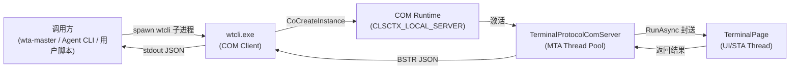

# 第7章 wtcli 命令参考

`wtcli` 是 Windows Terminal Protocol 的官方命令行客户端，提供类 tmux 风格的命令接口来查询和操控 Windows Terminal 的窗口、标签页和窗格。它是所有外部进程（包括 wta-master、Agent CLI、用户脚本）与 Windows Terminal COM 服务器交互的标准入口。

---

## 7.1 wtcli 概述

### 7.1.1 作为 COM Client 的实现原理

`wtcli.exe` 是一个纯 C++ 编写的 Classic COM 本地客户端，通过 `CoCreateInstance(CLSCTX_LOCAL_SERVER)` 连接到 Windows Terminal 的 out-of-process COM 服务器（`TerminalProtocolComServer`）。

**连接流程**：

1. **发现 CLSID**：从 `WT_COM_CLSID` 环境变量读取 COM 类 ID（该变量由 Windows Terminal 启动时注入，通过 ConPTY 继承给所有子进程）
2. **COM 激活**：调用 `CoCreateInstance(clsid, nullptr, CLSCTX_LOCAL_SERVER, IID_PPV_ARGS(&server))` 获取 `ITerminalProtocol` 接口指针
3. **握手认证**：调用 `Authenticate("")` 进行兼容性握手（COM 激活本身是信任边界，此调用不做权限门禁）
4. **能力查询**：调用 `GetCapabilities()` 获取服务器支持的方法列表
5. **方法调用**：将命令行参数映射为 COM 接口调用，结果序列化为 JSON 输出到 stdout



> **源码来源**：[`src/tools/wtcli/main.cpp:71-151 ConnectToTerminal()`](../../../../../external/libs/intelligent-terminal/src/tools/wtcli/main.cpp#L71-L151)、[`src/cascadia/WindowsTerminal/TerminalProtocolComServer.cpp` COM 服务器实现](../../../../../external/libs/intelligent-terminal/src/cascadia/WindowsTerminal/TerminalProtocolComServer.cpp)

### 7.1.2 wtcli 与 wta 的关系

`wta`（Windows Terminal Agent）是 wtcli 的**超集**——它既可以作为 master/helper TUI 运行，也可以作为 CLI helper 直接调用 wtcli 的所有功能：

| 维度 | wtcli.exe | wta.exe (CLI helpers 模式) |
|------|-----------|---------------------------|
| **二进制** | 纯 C++，无 Rust 依赖 | Rust 编写，链接 tokio/serde/clap |
| **COM 调用方式** | 直接调用 COM 接口 | 通过 `CliChannel` 封装，spawn wtcli 子进程 |
| **额外功能** | 无 | resolve-command、hooks、sessions、delegate、probes 等 |
| **输出格式** | `--json` 可选 | `--json` 可选（默认人类可读） |
| **典型用途** | Agent 脚本直接调用、wta 底层通道 | 人类调试、Agent hooks 桥接 |

wta 的 `CliChannel`（[`tools/wta/src/shell/wt_channel/cli_channel.rs`](../../../../../external/libs/intelligent-terminal/tools/wta/src/shell/wt_channel/cli_channel.rs)）是 wta 内部调用 wtcli 的抽象层，负责：
- 解析 wtcli JSON 输出
- 将协议方法名（如 `list_windows`）映射到 wtcli 子命令参数
- 管理 wtcli 子进程生命周期
- 通过 `wtcli listen` 后台任务订阅事件

> **来源**：[`tools/wta/AGENTS.md:22-35 CLI helpers 章节`](../../../../../external/libs/intelligent-terminal/tools/wta/AGENTS.md#L22-L35)、[`doc/wtcli-commands.md:1-11`](../../../../../external/libs/intelligent-terminal/doc/wtcli-commands.md#L1-L11)

### 7.1.3 全局标志

| 标志 | 说明 |
|------|------|
| `--json` | 输出机器可读的 JSON 格式。所有需要解析输出的调用方必须使用此标志 |
| `--skip-authenticate` | 跳过兼容性握手（仅用于测试） |

---

## 7.2 命令分类总览表

wtcli 命令按功能分为六大类，共 17 个子命令：

| 分类 | 命令 | 别名 | COM 方法 | 说明 |
|------|------|------|----------|------|
| **查询类** | `list-windows` | `lsw` | `ListWindows()` | 列出所有终端窗口 |
| | `list-tabs` | `lst` | `ListTabs()` | 列出窗口中的标签页 |
| | `list-panes` | `lsp` | `ListPanes()` | 列出标签页中的窗格 |
| | `active-pane` | — | `GetActivePane()` | 获取当前焦点窗格元数据 |
| | `pane-status` | — | `GetProcessStatus()` | 查询窗格进程状态 |
| | `info` | — | `GetCapabilities()` | 显示连接信息和能力列表 |
| **操作类** | `new-tab` | `neww` | `CreateTab()` | 创建新标签页 |
| | `split-pane` | `splitw` | `SplitPane()` | 分屏 |
| | `kill-pane` | `killp` | `ClosePane()` | 关闭窗格 |
| | `focus-pane` | `focusp` | `FocusPane()` | 切换焦点到指定窗格 |
| **读取类** | `capture-pane` | `capturep` | `ReadPaneOutput()` | 读取窗格滚动缓冲区 |
| | `wait-for` | — | 轮询 `GetProcessStatus()` | 阻塞等待窗格进程退出 |
| **事件类** | `listen` | `mon` | `Subscribe()` | 长连接订阅 COM 事件流 |
| | `send-event` | `se` | `SendEvent()` | 发布 agent_event 封装事件 |
| | `publish` | — | `SendEvent()` | 发布原始 JSON 事件（低级） |
| **输入类** | `send-keys` | `send_input` | `SendInput()` | 向窗格注入键盘输入 |
| **诊断类** | `pipe-id` | — | （读取环境变量） | 输出 WT_COM_CLSID 值 |
| | `set-env` | `setenv` | （读取环境变量） | 输出各 shell 的环境变量设置语句 |
| | `test-pipe` | — | `ListWindows()`+`GetCapabilities()` | 冒烟测试连接 |

> **来源**：[`doc/wtcli-commands.md:26-44 命令表`](../../../../../external/libs/intelligent-terminal/doc/wtcli-commands.md#L26-L44)、[`tools/wta/AGENTS.md:145-157 CLI Helpers 表`](../../../../../external/libs/intelligent-terminal/tools/wta/AGENTS.md#L145-L157)

---

## 7.3 查询类命令

查询类命令用于读取 Windows Terminal 的当前状态，不产生副作用。

### 7.3.1 list-windows (lsw)

列出所有顶层终端窗口。

**用法**：
```bash
wtcli --json list-windows
wtcli lsw
```

**参数**：无

**返回值示例**（`--json`）：
```json
{
  "windows": [
    {
      "window_id": 1,
      "title": "Windows PowerShell",
      "is_focused": true,
      "tabs": 2
    }
  ]
}
```

**字段说明**：
- `window_id`：窗口数字 ID（无符号 64 位整数）
- `title`：窗口标题
- `is_focused`：是否为当前前台窗口
- `tabs`：标签页数量（wta 封装时可能不包含）

**源码来源**：[`src/tools/wtcli/main.cpp:294-304`](../../../../../external/libs/intelligent-terminal/src/tools/wtcli/main.cpp#L294-L304)、[`tools/wta/src/cli/wt.rs:11-15`](../../../../../external/libs/intelligent-terminal/tools/wta/src/cli/wt.rs#L11-L15)

---

### 7.3.2 list-tabs (lst)

列出指定窗口中的标签页。

**用法**：
```bash
wtcli --json list-tabs
wtcli --json list-tabs -w 1
wtcli lst -w 1
```

**参数**：

| 参数 | 短选项 | 类型 | 默认值 | 说明 |
|------|--------|------|--------|------|
| `--window-id` | `-w` | 整数 | 第一个窗口 | 窗口 ID |

**返回值示例**：
```json
{
  "tabs": [
    {
      "tab_id": 1,
      "window_id": 1,
      "title": "PowerShell",
      "is_active": true,
      "panes": 1
    },
    {
      "tab_id": 2,
      "window_id": 1,
      "title": "wta (Copilot)",
      "is_active": false,
      "panes": 1
    }
  ]
}
```

**源码来源**：[`src/tools/wtcli/main.cpp`](../../../../../external/libs/intelligent-terminal/src/tools/wtcli/main.cpp)、[`tools/wta/src/cli/wt.rs:16-27`](../../../../../external/libs/intelligent-terminal/tools/wta/src/cli/wt.rs#L16-L27)

---

### 7.3.3 list-panes (lsp)

列出指定标签页中的窗格。

**用法**：
```bash
wtcli --json list-panes
wtcli --json list-panes -t 2
wtcli --json list-panes -w 1 -t 2
wtcli lsp -t 2
```

**参数**：

| 参数 | 短选项 | 类型 | 默认值 | 说明 |
|------|--------|------|--------|------|
| `--tab-id` | `-t` | 整数/GUID | 第一个标签页 | 标签 ID |
| `--window-id` | `-w` | 整数 | 第一个窗口 | 窗口 ID（配合 tab-id 使用） |

**返回值示例**：
```json
{
  "panes": [
    {
      "session_id": "a1b2c3d4-e5f6-7890-abcd-ef1234567890",
      "tab_id": 1,
      "window_id": 1,
      "title": "Windows PowerShell",
      "profile": "Windows PowerShell",
      "is_active": true,
      "is_agent_pane": false,
      "pid": 12345,
      "size": {
        "rows": 24,
        "columns": 120
      },
      "cwd": "C:\\Users\\user",
      "shell": "pwsh.exe",
      "shell_version": "7.4.0"
    }
  ]
}
```

**关键字段**：
- `session_id`：窗格唯一标识符（GUID），所有其他命令的 `-t` 参数使用此值
- `pid`：窗格中运行的进程 ID
- `is_agent_pane`：是否为 wta-helper 代理窗格
- `size.rows/columns`：窗格尺寸

**源码来源**：[`src/tools/wtcli/main.cpp`](../../../../../external/libs/intelligent-terminal/src/tools/wtcli/main.cpp)、[`tools/wta/src/cli/wt.rs:28-45`](../../../../../external/libs/intelligent-terminal/tools/wta/src/cli/wt.rs#L28-L45)

---

### 7.3.4 active-pane

返回当前获得焦点的窗格元数据。被其他命令用作默认 `-t` 目标的解析逻辑。

**用法**：
```bash
wtcli --json active-pane
```

**参数**：无

**返回值示例**：
```json
{
  "session_id": "a1b2c3d4-e5f6-7890-abcd-ef1234567890",
  "tab_id": 1,
  "window_id": 1,
  "title": "Windows PowerShell",
  "is_active": true,
  "pid": 12345
}
```

**源码来源**：[`tools/wta/src/cli/wt.rs:128-132`](../../../../../external/libs/intelligent-terminal/tools/wta/src/cli/wt.rs#L128-L132)、[`tools/wta/src/cli/wt.rs:291-306 resolve_pane_id()`](../../../../../external/libs/intelligent-terminal/tools/wta/src/cli/wt.rs#L291-L306)

---

### 7.3.5 pane-status

报告窗格中进程的运行状态：PID、状态、退出码。

**用法**：
```bash
wtcli --json pane-status
wtcli --json pane-status -t a1b2c3d4-e5f6-7890-abcd-ef1234567890
```

**参数**：

| 参数 | 短选项 | 类型 | 默认值 | 说明 |
|------|--------|------|--------|------|
| `--target` | `-t` | GUID 字符串 | 活动窗格 | 目标窗格 session_id |

**返回值示例**：

进程运行中：
```json
{
  "session_id": "a1b2c3d4-e5f6-7890-abcd-ef1234567890",
  "state": "running",
  "pid": 12345,
  "exit_code": null,
  "has_exit_code": false
}
```

进程已退出：
```json
{
  "session_id": "a1b2c3d4-e5f6-7890-abcd-ef1234567890",
  "state": "exited",
  "pid": 12345,
  "exit_code": 0,
  "has_exit_code": true
}
```

**状态值**：`running`、`exited`

**源码来源**：[`tools/wta/src/cli/wt.rs:133-141`](../../../../../external/libs/intelligent-terminal/tools/wta/src/cli/wt.rs#L133-L141)、[`tools/wta/src/cli/wt.rs:452-473 format_pane_status()`](../../../../../external/libs/intelligent-terminal/tools/wta/src/cli/wt.rs#L452-L473)

---

### 7.3.6 info

显示 COM 连接信息、协议版本和服务器能力列表。

**用法**：
```bash
wtcli --json info
wtcli info
```

**人类可读输出示例**：
```
Windows Terminal Protocol Info
========================================
  COM CLSID: {A2E4F6B8-1C3D-4E5F-A6B7-C8D9E0F1A2B3}
  Source: WT_COM_CLSID env var

Current Pane (PID 12345):
  Window ID: 1
  Tab ID:    1
  Pane ID:   a1b2c3d4-e5f6-7890-abcd-ef1234567890

Summary:
  Windows: 1, Tabs: 2, Panes: 3
```

**源码来源**：[`tools/wta/src/cli/wt.rs:171-280 run_info_mode()`](../../../../../external/libs/intelligent-terminal/tools/wta/src/cli/wt.rs#L171-L280)

---

## 7.4 操作类命令

操作类命令会改变 Windows Terminal 的状态（创建/关闭窗格、切换焦点）。

### 7.4.1 new-tab (neww)

创建新标签页。

**用法**：
```bash
wtcli --json new-tab
wtcli --json new-tab -c "pwsh" -n "build" -d C:\src
wtcli neww -c "cmd"
```

**参数**：

| 参数 | 短选项 | 类型 | 默认值 | 说明 |
|------|--------|------|--------|------|
| `--command` | `-c` | 字符串 | 默认 profile | 新标签页中运行的命令 |
| `--cwd` | `-d` | 路径字符串 | 用户目录 | 工作目录 |
| `--title` | `-n` | 字符串 | 自动 | 标签页标题 |
| `--profile` | `-p` | 字符串 | 默认 profile | 使用的 profile 名称 |

**返回值示例**：
```json
{
  "tab_id": 3,
  "session_id": "b2c3d4e5-f6a7-8901-bcde-f12345678901",
  "window_id": 1,
  "pid": 67890
}
```

**源码来源**：[`tools/wta/src/cli/wt.rs:46-64`](../../../../../external/libs/intelligent-terminal/tools/wta/src/cli/wt.rs#L46-L64)、[`tools/wta/src/shell/wt_channel/cli_channel.rs:516-546 create_tab 映射`](../../../../../external/libs/intelligent-terminal/tools/wta/src/shell/wt_channel/cli_channel.rs#L516-L546)

---

### 7.4.2 split-pane (splitw)

在指定窗格进行分屏，创建新窗格。

**用法**：
```bash
wtcli --json split-pane
wtcli --json split-pane -t a1b2c3d4-... -d right -s 0.4 -c "tail -f log"
wtcli splitw -h -c "pwsh"
wtcli splitw -v -s 0.5
```

**参数**：

| 参数 | 短选项 | 类型 | 默认值 | 说明 |
|------|--------|------|--------|------|
| `--target` | `-t` | GUID | 活动窗格 | 要分屏的目标窗格 |
| `--direction` | `-d` | 字符串 | `automatic` | 分屏方向：`right`/`left`/`up`/`down`/`auto`/`horizontal`/`vertical` |
| `--horizontal` | `-h` | flag | false | 水平分屏（左右排列，等价于 `-d right`） |
| `--vertical` | `-v` | flag | false | 垂直分屏（上下排列，等价于 `-d down`） |
| `--size` | `-s` | 浮点数 (0.0-1.0) | 0.5 | 新窗格占比 |
| `--command` | `-c` | 字符串 | 默认 profile | 新窗格运行的命令 |
| `--profile` | `-p` | 字符串 | 默认 profile | 使用的 profile |

**返回值示例**：
```json
{
  "session_id": "c3d4e5f6-a7b8-9012-cdef-123456789012",
  "tab_id": 1,
  "window_id": 1,
  "pid": 13579
}
```

> **注意**：wta 的 `spawn_wtcli_split_then_focus()` 会在 split-pane 成功后自动追加一次 `focus-pane` 调用，因为 COM `SplitPane` 默认保持焦点在原窗格（`background=true`）。

**源码来源**：[`tools/wta/src/cli/wt.rs:65-94`](../../../../../external/libs/intelligent-terminal/tools/wta/src/cli/wt.rs#L65-L94)、[`tools/wta/src/shell/wt_channel/cli_channel.rs:201-344 split-then-focus`](../../../../../external/libs/intelligent-terminal/tools/wta/src/shell/wt_channel/cli_channel.rs#L201-L344)

---

### 7.4.3 kill-pane (killp)

关闭指定窗格。

**用法**：
```bash
wtcli kill-pane
wtcli kill-pane -t a1b2c3d4-e5f6-7890-abcd-ef1234567890
wtcli killp -t b2c3d4e5-...
```

**参数**：

| 参数 | 短选项 | 类型 | 默认值 | 说明 |
|------|--------|------|--------|------|
| `--target` | `-t` | GUID | 活动窗格 | 要关闭的窗格 |

**返回值**：无 JSON 输出（成功时静默退出，退出码 0）。

**人类可读输出**：
```
Pane a1b2c3d4-e5f6-7890-abcd-ef1234567890 closed.
```

**源码来源**：[`tools/wta/src/cli/wt.rs:117-127`](../../../../../external/libs/intelligent-terminal/tools/wta/src/cli/wt.rs#L117-L127)

---

### 7.4.4 focus-pane

将焦点切换到指定窗格。

**用法**：
```bash
wtcli focus-pane -t a1b2c3d4-e5f6-7890-abcd-ef1234567890
wtcli focusp -t b2c3d4e5-...
```

**参数**：

| 参数 | 短选项 | 类型 | 默认值 | 说明 |
|------|--------|------|--------|------|
| `--target` | `-t` | GUID | **必填** | 要聚焦的窗格 |

**返回值**：无输出（成功时退出码 0）。

**错误处理**：如果窗格 ID 不存在（COM 返回 `HRESULT_FROM_WIN32(ERROR_NOT_FOUND)` = `0x80070490`），wta 的 `spawn_wtcli_focus_pane_with_callback()` 会识别此错误并将对应会话行标记为 Ended。

**源码来源**：[`tools/wta/src/shell/wt_channel/cli_channel.rs:82-162 spawn_wtcli_focus_pane*`](../../../../../external/libs/intelligent-terminal/tools/wta/src/shell/wt_channel/cli_channel.rs#L82-L162)

---

## 7.5 读取类命令

### 7.5.1 capture-pane (capturep)

读取窗格的滚动缓冲区内容，类似于 tmux 的 `capture-pane -p`。支持 OSC 133 shell 集成标记。

**用法**：
```bash
wtcli --json capture-pane
wtcli --json capture-pane -t a1b2c3d4-... -l 100
wtcli --json capture-pane -t a1b2c3d4-... --last-prompt
wtcli capturep --last-prompt
```

**参数**：

| 参数 | 短选项 | 类型 | 默认值 | 说明 |
|------|--------|------|--------|------|
| `--target` | `-t` | GUID | 活动窗格 | 目标窗格 |
| `--max-lines` | `-l` | 整数 | 200 | 最大捕获行数 |
| `--last-prompt` | — | flag | false | 仅返回最近一次完整的 shell prompt 输出（命令+输出），需要 OSC 133 shell 集成 |

**返回值示例**：
```json
{
  "session_id": "a1b2c3d4-e5f6-7890-abcd-ef1234567890",
  "content": "PS C:\\src> ls\n\n\n    Directory: C:\\src\n\nMode  LastWriteTime  Length Name\n----  -------------  ------ ----\nd---- 2026/8/3 10:00        project\n-a--- 2026/8/3 10:00    123 README.md\n\nPS C:\\src>",
  "line_count": 12,
  "truncated": false,
  "has_marks": true
}
```

**字段说明**：
- `content`：UTF-8 文本内容（可能包含 ANSI/VT 颜色序列）
- `truncated`：是否因 `--max-lines` 限制被截断
- `has_marks`：是否包含 OSC 133 prompt marks

**非 JSON 模式**：直接输出 `content` 字段到 stdout（适合管道）：
```bash
wtcli capture-pane --last-prompt | grep "error"
```

**源码来源**：[`tools/wta/src/cli/wt.rs:95-116`](../../../../../external/libs/intelligent-terminal/tools/wta/src/cli/wt.rs#L95-L116)、[`tools/wta/src/shell/wt_channel/cli_channel.rs:483-504 read_pane_output 映射`](../../../../../external/libs/intelligent-terminal/tools/wta/src/shell/wt_channel/cli_channel.rs#L483-L504)

---

### 7.5.2 wait-for

阻塞轮询 `pane-status` 直到窗格进程退出。

**用法**：
```bash
wtcli wait-for -t a1b2c3d4-...
wtcli wait-for -t a1b2c3d4-... --timeout 60
wtcli wait-for -t a1b2c3d4-... --interval 100 --timeout 300
```

**参数**：

| 参数 | 短选项 | 类型 | 默认值 | 说明 |
|------|--------|------|--------|------|
| `--target` | `-t` | GUID | **必填** | 目标窗格 |
| `--interval` | — | 毫秒 | 500 | 轮询间隔 |
| `--timeout` | — | 秒 | 0（无限等待） | 超时时间 |

**返回值**：超时或进程退出时返回最终的 pane-status JSON。

> **注意**：wta 有自己的 `wait-for` 子命令，它不直接调用 wtcli 的 wait-for，而是在 Rust 中循环调用 `wtcli pane-status` 轮询（参见 [`cli/wt.rs:497-532 run_wait_for()`](../../../../../external/libs/intelligent-terminal/tools/wta/src/cli/wt.rs#L497-L532)）。

**源码来源**：[`doc/wtcli-commands.md:38 wait-for 条目`](../../../../../external/libs/intelligent-terminal/doc/wtcli-commands.md#L38)

---

## 7.6 事件类命令

### 7.6.1 listen (mon)

长运行命令：订阅 COM 事件流，将每个事件以 JSON Lines 格式输出到 stdout，直到 Ctrl+C。

**用法**：
```bash
wtcli --json listen
wtcli --json listen -t a1b2c3d4-...
wtcli --json listen --event "agent.*"
wtcli mon
```

**参数**：

| 参数 | 短选项 | 类型 | 默认值 | 说明 |
|------|--------|------|--------|------|
| `--target` | `-t` | GUID | （所有窗格） | 按 pane_id 过滤事件 |
| `--event` | — | 字符串（支持 `*` 通配符） | （所有类型） | 按事件类型过滤 |

**输出格式**：每行一个 JSON 对象（JSON Lines）。

**事件类型**：

| 事件方法 | 触发时机 |
|----------|----------|
| `agent.*` | Agent 相关事件（agent_state_changed、agent_task_completed 等） |
| `pane_output` | 窗格输出（通过 OSC 上行） |
| `session_added` / `session_removed` | 会话生命周期事件 |
| `autofix_state` | Autofix 状态变更 |
| `pane_closed` | 窗格关闭 |
| `pane_focused` | 窗格获得焦点 |

**事件 JSON 结构**：
```json
{"type":"event","method":"agent_state_changed","params":{"session_id":"a1b2c3d4-...","state":"idle"}}
{"type":"event","method":"intellterm.wta/session_added","params":{"session_id":"...","pane_session_id":"..."}}
```

> **实现细节**：wta 的 `CliChannel::start_reader()` 在后台 tokio task 中 spawn `wtcli --json listen`，逐行解析 JSON 并通过 mpsc channel 分发。

**源码来源**：[`tools/wta/src/cli/wt.rs:573-607 run_listen()`](../../../../../external/libs/intelligent-terminal/tools/wta/src/cli/wt.rs#L573-L607)、[`tools/wta/src/shell/wt_channel/cli_channel.rs:380-417 start_reader()`](../../../../../external/libs/intelligent-terminal/tools/wta/src/shell/wt_channel/cli_channel.rs#L380-L417)、[`src/tools/wtcli/main.cpp:32-67 EventSink`](../../../../../external/libs/intelligent-terminal/src/tools/wtcli/main.cpp#L32-L67)

---

### 7.6.2 send-event (se)

使用 `agent_event` 封装发布事件。设置 `type=event`、`method=agent_event`，将 `-e` 参数填入 `params.event`，`-p` 参数填入 `params.pane_id`。

**用法**：
```bash
wtcli send-event -p 3 -e agent.task.completed '{"exit_code":0}'
wtcli se -e agent.status '{"status":"thinking"}'
```

**参数**：

| 参数 | 短选项 | 类型 | 默认值 | 说明 |
|------|--------|------|--------|------|
| `--pane` | `-p` | GUID | 活动窗格 | 目标窗格 ID |
| `--event` | `-e` | 字符串 | **必填** | 事件名称 |
| 位置参数 | — | JSON 对象 | `{}` | 额外参数 |

> **注意**：此命令目前未被仓库内代码调用，作为外部 Agent 的公共 CLI 表面保留（参见 `doc/specs/llm-agent-event-integration.md`）。

**源码来源**：[`doc/wtcli-commands.md:40 send-event 条目`](../../../../../external/libs/intelligent-terminal/doc/wtcli-commands.md#L40)

---

### 7.6.3 publish

低级逃生舱：直接将原始 JSON 字符串转发给 `IProtocolServer::SendEvent()`，不做任何封装。用于不符合 `agent_event` 格式的事件（如直接路由到 `TerminalPage` 的 `autofix_state`）。

**用法**：
```bash
wtcli publish '{"method":"autofix_state","params":{"state":"ready"}}'
```

**参数**：位置参数，一个完整的 JSON 字符串。

**源码来源**：[`doc/wtcli-commands.md:41 publish 条目`](../../../../../external/libs/intelligent-terminal/doc/wtcli-commands.md#L41)、[`tools/wta/src/app.rs publish_event_blocking()`](../../../../../external/libs/intelligent-terminal/tools/wta/src/app.rs)

---

## 7.7 输入类命令

### 7.7.1 send-keys (send_input)

向窗格注入键盘输入文本。支持 tmux 风格的按键翻译。

**用法**：
```bash
wtcli send-keys -t a1b2c3d4-... "ls -la" Enter
wtcli send-keys --raw -t a1b2c3d4-... "--help"
wtcli send_input -t a1b2c3d4-... C-c
```

**参数**：

| 参数 | 短选项 | 类型 | 默认值 | 说明 |
|------|--------|------|--------|------|
| `--target` | `-t` | GUID | 活动窗格 | 目标窗格 |
| `--raw` | — | flag | false | 绕过 tmux 风格按键翻译，原样发送文本（wta 内部总是使用此标志） |
| 位置参数 | — | 字符串列表 | **必填** | 要发送的按键/文本 |

**按键翻译表**（非 `--raw` 模式）：

| Token | 发送内容 |
|-------|----------|
| `Enter` / `Return` | CR (`\r`) |
| `Tab` | TAB (`\t`) |
| `Escape` / `Esc` | ESC (`\x1b`) |
| `Space` | 空格 |
| `C-a` ~ `C-z` | Ctrl+字母（`\x01` ~ `\x1a`） |
| `Up` / `Down` / `Left` / `Right` | 方向键 VT 序列 |
| 其他文本 | 原样发送 |

> **wta 内部使用注意**：wta 通过 CliChannel 调用 send_input 时总是传递 `--raw --`，避免 Agent 发送的文本（如字面 "Enter"、"C-c"、以 `-` 开头的参数）被错误翻译或解析为标志。`--` 停止 CLI11 选项解析。

**返回值**：
```json
{"ok": true, "session_id": "a1b2c3d4-...", "noop": false}
```

空文本（`--raw ""`）返回 `noop: true` 并短路，不实际 spawn wtcli 进程。

**源码来源**：[`tools/wta/src/shell/wt_channel/cli_channel.rs:603-651 send_input 映射`](../../../../../external/libs/intelligent-terminal/tools/wta/src/shell/wt_channel/cli_channel.rs#L603-L651)

---

## 7.8 诊断类命令

### 7.8.1 pipe-id

发现并输出用于协议路由的 WT COM CLSID。读取 `WT_COM_CLSID` 环境变量。

**用法**：
```bash
wtcli pipe-id
wtcli --json pipe-id
wta pipe-id
```

**返回值**：

JSON 模式：
```json
{
  "connection_id": "{A2E4F6B8-1C3D-4E5F-A6B7-C8D9E0F1A2B3}",
  "env": "WT_COM_CLSID"
}
```

非 JSON 模式：直接输出 GUID 字符串：
```
{A2E4F6B8-1C3D-4E5F-A6B7-C8D9E0F1A2B3}
```

**错误情况**：如果未设置 `WT_COM_CLSID`（不在 Windows Terminal 窗格内运行），返回错误并退出码非 0。

**源码来源**：[`tools/wta/src/cli/wt.rs:534-544 run_pipe_id()`](../../../../../external/libs/intelligent-terminal/tools/wta/src/cli/wt.rs#L534-L544)

---

### 7.8.2 set-env (setenv)

输出各 shell 语法的 `WT_COM_CLSID` 环境变量设置语句。输出设计为由 caller `eval` 或 `Invoke-Expression` 执行，不修改当前进程环境。

**用法**：
```bash
wtcli set-env
wtcli set-env -s powershell | Invoke-Expression
wta set-env -s bash | source /dev/stdin
wtcli setenv -s cmd
wtcli set-env -s fish | source
```

**参数**：

| 参数 | 短选项 | 类型 | 默认值 | 说明 |
|------|--------|------|--------|------|
| `--shell` | `-s` | 字符串 | `bash` | Shell 类型：`bash`/`sh`/`zsh`、`powershell`/`pwsh`/`ps`、`cmd`、`fish` |

**各 shell 输出**：

| Shell | stdout 输出 | 执行方式 |
|-------|-------------|----------|
| bash/sh/zsh | `export WT_COM_CLSID='{GUID}'` | `eval "$(wta set-env)"` |
| powershell/pwsh | `$env:WT_COM_CLSID = '{GUID}'` | `wta set-env -s powershell \| Invoke-Expression` |
| cmd | `set WT_COM_CLSID={GUID}` | for /f 循环或复制粘贴 |
| fish | `set -gx WT_COM_CLSID '{GUID}'` | `wta set-env -s fish \| source` |

> **使用场景**：用于子 shell 未继承 `WT_COM_CLSID` 时的手动恢复。这不是安全边界——参见 `tools/wta/AGENTS.md:166-168`。

**源码来源**：[`tools/wta/src/cli/wt.rs:546-571 run_set_env()`](../../../../../external/libs/intelligent-terminal/tools/wta/src/cli/wt.rs#L546-L571)

---

### 7.8.3 test-pipe

冒烟测试命令：连接 COM 服务器，执行 `list-windows` + `get_capabilities`，打印结果。仅用于诊断。

**用法**：
```bash
wtcli test-pipe
wta test-pipe
```

**输出示例**：
```
Connecting to Windows Terminal protocol...
Connected and authenticated!

list_windows:
{ ... pretty-printed JSON ... }

get_capabilities:
{ ... pretty-printed JSON ... }
```

**源码来源**：[`tools/wta/src/cli/wt.rs:154-168 run_test_pipe()`](../../../../../external/libs/intelligent-terminal/tools/wta/src/cli/wt.rs#L154-L168)

---

## 7.9 wta CLI helper 子命令

`wta.exe` 作为 wtcli 的超集，除了代理上述所有 wtcli 命令外，还提供额外的 CLI helper 子命令。这些命令**不调用 COM 服务器**，而是在本地执行或通过 ACP 通道与 wta-master 通信。

### 7.9.1 resolve-command

本地 PowerShell 命令解析器，识别命令是否存在。用于替换之前的 localhost MCP 工具，返回相同的机器可读结果格式。

**用法**：
```bash
wta --json resolve-command git
wta resolve-command python --shell pwsh.exe --cwd C:\src
```

**参数**：

| 参数 | 短选项 | 类型 | 默认值 | 说明 |
|------|--------|------|--------|------|
| `token`（位置参数） | — | 字符串 | **必填** | 要识别的命令名（不含参数或路径） |
| `--shell` | — | 字符串 | `pwsh.exe` | Shell 类型；PowerShell 会加载用户 profile |
| `--cwd` | — | 路径 | 当前目录 | 工作目录 |

**返回值**：`exists`、`not_found`、`indeterminate`、`unsupported` 之一。

**源码来源**：[`tools/wta/src/cli/mod.rs:29-37`](../../../../../external/libs/intelligent-terminal/tools/wta/src/cli/mod.rs#L29-L37)、[`tools/wta/AGENTS.md:159-162`](../../../../../external/libs/intelligent-terminal/tools/wta/AGENTS.md#L159-L162)

---

### 7.9.2 hooks

管理 wt-agent-hooks 桥接（支持 Copilot / Claude / Gemini / Codex / OpenCode）。

**子命令**：

| 子命令 | 说明 |
|--------|------|
| `hooks install [--cli <name>]` | 安装 hooks（默认所有 CLI） |
| `hooks status [--json]` | 查看各 CLI 的安装状态 |
| `hooks uninstall [--cli <name>]` | 卸载 hooks |

**支持的 CLI**：`copilot`、`claude`、`gemini`、`codex`、`opencode`、`all`（默认）。

**源码来源**：[`tools/wta/src/cli/hooks.rs`](../../../../../external/libs/intelligent-terminal/tools/wta/src/cli/hooks.rs)、[`tools/wta/src/agent_hooks_installer.rs`](../../../../../external/libs/intelligent-terminal/tools/wta/src/agent_hooks_installer.rs)

---

### 7.9.3 sessions

查询 wta-master 注册表中已知的会话。

**子命令**：

| 子命令 | 说明 |
|--------|------|
| `sessions list [--master <pipe>] [--origin <all/shell/agent-pane>]` | 列出会话 |

**origin 过滤**：
- `shell`：仅用户在普通窗格启动的 shell 会话（Class B）
- `agent-pane`：仅 WTA 为 agent pane 创建的会话（Class A）
- `all`：所有会话（默认）

**源码来源**：[`tools/wta/src/cli/sessions.rs`](../../../../../external/libs/intelligent-terminal/tools/wta/src/cli/sessions.rs)

---

### 7.9.4 delegate

在新标签页中打开配置的 delegate agent（fire-and-forget）。

**用法**：
```bash
wta delegate "explain this code"
wta delegate --delegate-agent codex
wta delegate  # 不带 prompt 时以交互模式打开
```

**源码来源**：[`tools/wta/src/cli/delegate.rs`](../../../../../external/libs/intelligent-terminal/tools/wta/src/cli/delegate.rs)

---

### 7.9.5 probes（诊断命令）

这些命令用于 Settings UI 和诊断，spawn 一个 agent CLI 进程执行 ACP 握手，探测信息后退出。

| 子命令 | 说明 |
|--------|------|
| `probe-models --agent <cmd>` | ACP 握手后读取 agent 广告的模型列表 |
| `probe-sessions --agent <cmd>` | 调用 `session/list` 枚举历史会话 |
| `probe-host-sessions --agent <cmd>` | 探测 host 历史记录行 |
| `probe-wsl-sessions [--cli <name>]` | 扫描运行中的 WSL 发行版的会话 |
| `probe-agent-sources --wsl-distro <name>` | 列出 WSL 发行版中安装的 ACP agent |

**源码来源**：[`tools/wta/src/cli/probes.rs`](../../../../../external/libs/intelligent-terminal/tools/wta/src/cli/probes.rs)

---

## 7.10 命令使用示例

### 7.10.1 查找当前活动窗格并捕获输出

```bash
# 获取活动窗格 ID
PANE_ID=$(wtcli --json active-pane | python -c "import sys,json; print(json.load(sys.stdin)['session_id'])")

# 捕获最近一次命令输出
wtcli --json capture-pane -t "$PANE_ID" --last-prompt | jq -r '.content'
```

### 7.10.2 水平分屏并在新窗格运行命令

```bash
# 分屏右侧，占 40%，运行 htop
RESULT=$(wtcli --json split-pane -d right -s 0.4 -c "htop")
NEW_PANE=$(echo "$RESULT" | jq -r '.session_id')

# （可选）聚焦新窗格
wtcli focus-pane -t "$NEW_PANE"
```

### 7.10.3 创建新标签页并等待命令完成

```bash
# 创建新标签页运行构建命令
RESULT=$(wtcli --json new-tab -c "cargo build" -n "build")
BUILD_PANE=$(echo "$RESULT" | jq -r '.session_id')

# 等待构建完成（最多 5 分钟）
wtcli --json wait-for -t "$BUILD_PANE" --timeout 300

# 读取构建输出
wtcli --json capture-pane -t "$BUILD_PANE" -l 500 | jq -r '.content'
```

### 7.10.4 监听所有 agent 事件并过滤

```bash
# 实时监听所有 agent 事件，提取事件类型
wtcli --json listen | jq -r 'select(.type=="event") | "\(.method): \(.params)"'

# 只监听特定窗格的输出
wtcli --json listen -t "$PANE_ID"
```

### 7.10.5 发送按键序列到窗格

```bash
# 在活动窗格运行命令（字面文本）
wtcli send-keys --raw -- "git status"
wtcli send-keys Enter

# 发送 Ctrl+C 中断
wtcli send-keys C-c
```

### 7.10.6 在脚本中设置环境变量（新终端恢复连接）

```powershell
# PowerShell：在新终端中恢复 WT_COM_CLSID
wta pipe-id --json | ConvertFrom-Json | Select-Object -ExpandProperty connection_id | Set-Clipboard
# 在新终端中：
$env:WT_COM_CLSID = Get-Clipboard
```

```bash
# Bash：恢复连接
eval "$(wta set-env -s bash)"
```

### 7.10.7 wta 典型诊断流程

```bash
# 1. 查看连接信息
wta info

# 2. 列出所有窗格
wta --json list-panes | jq '.panes[] | {id: .session_id, title: .title, pid: .pid, active: .is_active}'

# 3. 检查 hooks 安装状态
wta hooks status

# 4. 查看所有会话（包括历史）
wta sessions list --origin all
```

---

## 源码溯源

| 来源 | 内容 |
|------|------|
| [`doc/wtcli-commands.md`](../../../../../external/libs/intelligent-terminal/doc/wtcli-commands.md) | wtcli 官方命令参考（命令表、别名、wta 使用情况） |
| [`tools/wta/AGENTS.md:141-162 CLI Helpers`](../../../../../external/libs/intelligent-terminal/tools/wta/AGENTS.md#L141-L162) | wta CLI helpers 概览表、resolve-command 说明 |
| [`src/tools/wtcli/main.cpp`](../../../../../external/libs/intelligent-terminal/src/tools/wtcli/main.cpp) | wtcli C++ 实现（COM 连接、CLI11 命令定义、EventSink） |
| [`src/cascadia/TerminalProtocol/TerminalProtocol.idl`](../../../../../external/libs/intelligent-terminal/src/cascadia/TerminalProtocol/TerminalProtocol.idl) | COM 接口 IDL 定义 |
| [`tools/wta/src/cli/args.rs`](../../../../../external/libs/intelligent-terminal/tools/wta/src/cli/args.rs) | wta CLI 参数定义（clap derive） |
| [`tools/wta/src/cli/wt.rs`](../../../../../external/libs/intelligent-terminal/tools/wta/src/cli/wt.rs) | wta CLI helper 中 wtcli 命令的 Rust 封装 |
| [`tools/wta/src/shell/wt_channel/cli_channel.rs`](../../../../../external/libs/intelligent-terminal/tools/wta/src/shell/wt_channel/cli_channel.rs) | CliChannel：wta 到 wtcli 的桥接（方法映射、spawn wtcli、事件监听） |
| [`tools/wta/src/cli/mod.rs`](../../../../../external/libs/intelligent-terminal/tools/wta/src/cli/mod.rs) | CLI 命令分发路由 |

---

## 本章导航

- [上一章：通信协议栈](06-protocols.md)
- [返回目录](README.md)
- [下一章：wt-agent-hooks Shell 集成](08-agent-hooks.md)
