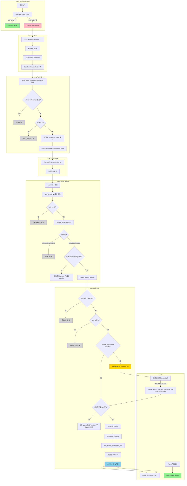

# 第9章 Autofix 自动错误检测与修复

Autofix 是 Intelligent Terminal 的核心智能功能之一，能够自动检测终端命令失败（通过 OSC 133;D 退出码），自动分析错误原因并提供修复建议，用户确认后可一键执行修复命令。Autofix 采用**建议优先**（Suggest-first）模式：自动触发时仅显示检测提示，用户主动激活后才调用 LLM 分析，避免未经用户同意的自动执行。

---

## 9.1 Autofix 功能概述

### 9.1.1 核心定位与设计原则

Autofix 在 WTA 架构中属于**诊断层**，它不直接执行命令，而是：
1. **监听**终端命令执行结果（通过 OSC 133;D 退出码）
2. **分类**错误事件（`classify_wt_event`）
3. **触发** LLM 分析（`maybe_trigger_autofix`）
4. **展示**修复建议（通过底部状态栏和 Agent 窗格）
5. **执行**用户确认的修复命令

**关键设计原则**：

| 原则 | 实现方式 |
|------|----------|
| **非侵入式** | 默认仅显示 Detected 提示，用户需主动点击或按热键才触发 LLM 分析 |
| **逐标签隔离** | 每个标签页独立维护 Autofix 状态，后台标签的失败不会干扰前台标签的修复 |
| **冷启动安全** | ACP session 未 Connected 时直接 drop 事件，不崩溃不重试 |
| **Pre-warmed** | 每个新标签页预启动 helper 进程，stashed pane 上的 Autofix 立即可用 |
| **手动优先** | `/fix` 斜杠命令支持手动触发，可附加提示词引导诊断方向 |

### 9.1.2 状态机模型

Autofix 采用四状态底部状态栏模型：

```
Idle ──→ Detected ──→ Pending ──→ Review
  ↑          │           │           │
  └──────────┴───────────┴───────────┘
              (用户取消 / 成功退出 / Esc)
```

| 状态 | 含义 | 用户可见表现 |
|------|------|-------------|
| **Idle** | 无待处理错误 | 底部状态栏无诊断图标 |
| **Detected** | 检测到命令失败（退出码≠0），尚未调用 LLM | 底部显示可点击的错误提示 pill，热键 Ctrl+Alt+. |
| **Pending** | LLM 正在分析中 | 底部显示"Analyzing…"加载状态 |
| **Review** | 分析完成，修复建议已在 Agent 窗格中 | Agent 窗格关闭时显示"打开查看"提示；窗格已打开时回到 Idle |

> **源码来源**：[`tools/wta/src/app/autofix.rs:54-82 AutofixBarSnapshot 枚举`](../../../../../external/libs/intelligent-terminal/tools/wta/src/app/autofix.rs#L54-L82)

---

## 9.2 检测管线完整流程

Autofix 的完整触发链路跨越 PowerShell Shell Integration → TerminalCore → TerminalPage → COM server → wtcli listen → WTA 事件分类 → Autofix 状态机七个阶段：

### 9.2.1 阶段详解

**阶段 1：Shell 发送退出码（OSC 133;D）**

当 PowerShell 中命令执行完毕时，Shell Integration 注入的 post-command 钩子发送 FinalTerm OSC 133 序列：

- 成功：`ESC ] 133 ; D ; 0 ST`（退出码 0）
- 失败：`ESC ] 133 ; D ; 1 ST`（退出码 ≠ 0）

PowerShell Shell Integration 默认启用（`autoMarkPrompts=true`），通过 `PowerShellShellIntegration.h` 注入。

**阶段 2：TerminalCore 解析 VT 序列**

TerminalCore 在 `adaptDispatch.cpp` 中处理 OSC 序列：
1. 识别 `osc:133;D;<exitcode>` 格式
2. 解析退出码整数
3. 调用 `EndCurrentCommand(error=exitcode!=0)`
4. 将退出码存储到 `ScrollbarData.exitCode`，category 设为 `Error`（非 0）或 `Success`（0）

**阶段 3：TerminalPage 接收 VtSequenceReceived 事件**

TerminalPage 在注册到 TermControl 的回调中拦截 VT 序列：
1. 识别 OSC 133 序列（`isOsc133` 路径）
2. 检查全局设置 `EffectiveAutoErrorDetectionEnabled()`：用户关闭错误检测则直接 return，不转发
3. 构造 JSON 事件：`{method:"vt_sequence", params:{pane_id, tab_id, sequence:"osc:133;D;1"}}`
4. 通过 `ProtocolVtSequenceReceived` 事件抛出

> **源码来源**：[`src/cascadia/TerminalApp/TerminalPage.cpp:5884-5912 vt_sequence 事件构造`](../../../../../external/libs/intelligent-terminal/src/cascadia/TerminalApp/TerminalPage.cpp#L5884-L5912)

**阶段 4：COM Server 桥接**

`TerminalProtocolComServer` 订阅 `ProtocolVtSequenceReceived` 事件，通过命名管道将 JSON 转发给 `wtcli listen` 进程。COM server 作为 WT 和 WTA helper 之间的跨进程桥。

**阶段 5：wtcli listen → WTA 事件分发**

`wtcli listen` 接收管道数据，解析为 WTA 事件。WTA 主循环在 `app_events.rs` 的 WT 事件处理器中：
1. 验证事件标签匹配：`notification.tab_id` 必须等于 `self.owner_tab_id`，不匹配则 drop（跨标签事件过滤）
2. 调用 `classify_wt_event()` 进行事件分类
3. 根据 severity 决定后续动作

**阶段 6：classify_wt_event 事件分类**

`classify_wt_event` 是纯函数，将 WT 协议事件映射为 `WtNotification`：
- `connection_state: connected/failed/closed` → Informational/Critical/Actionable
- `vt_sequence: osc:133;D;<code>`：
  - exit_code == 0 → 静默（acknowledged=true，不显示）
  - exit_code != 0 → Actionable，summary="Command failed (exit N)"
- 其他 VT 序列 → 静默抑制

> **源码来源**：[`tools/wta/src/app.rs:645-781 classify_wt_event`](../../../../../external/libs/intelligent-terminal/tools/wta/src/app.rs#L645-L781)

**阶段 7：maybe_trigger_autofix 触发 Autofix**

仅当满足以下条件时才进入 Autofix 管线：
1. `notification.severity` 是 `Critical` 或 `Actionable`
2. `method == "vt_sequence"`（`connection_state: closed/failed` 仅显示 banner，不触发 Autofix）

`maybe_trigger_autofix` 调用 `trigger_autofix_inner(notification, false)`（`forced=false` 表示非用户强制触发）。

---

## 9.3 Autofix 数据流管线图



> **关键节点说明**：灰色菱形为 drop 点（事件静默丢弃），黄色为 Detected 建议模式，蓝色为 Pending 分析中，绿色为最终状态。

---

## 9.4 前置条件

Autofix 可靠工作依赖三个前置条件，缺一不可：

### 9.4.1 PowerShell Shell Integration 启用

- **配置项**：`autoMarkPrompts`（默认 `true`）
- **作用**：在每个命令后自动发送 OSC 133;A/B/C/D 序列，标记命令生命周期边界
- **失败表现**：没有 Shell Integration 时，退出码无法通过 VT 序列传递，Autofix 只能依赖文本启发式（低置信度，不自动触发）
- **cmd.exe 限制**：cmd.exe 没有 post-command 钩子机制，无法发送 OSC 133;D，Autofix 在 cmd.exe 中**不自动触发**

### 9.4.2 Helper ACP session 状态为 Connected

- **关键检查**：`trigger_autofix_inner` 第一行：`if self.state != ConnectionState::Connected { return; }`
- **含义**：helper 进程必须已与 ACP server 建立连接，能够发送 prompt 给 Agent
- **连接状态来源**：通过 `connection_state: connected` WT 事件驱动

> **源码来源**：[`tools/wta/src/app/autofix.rs:97-99 Connected 状态检查`](../../../../../external/libs/intelligent-terminal/tools/wta/src/app/autofix.rs#L97-L99)

### 9.4.3 wtcli 在 PATH 上

- **hook 脚本依赖**：`send-event.ps1` 通过 `wtcli send-event` 转发 Agent 钩子事件
- **helper 启动依赖**：TerminalPage 通过 wtcli.exe 路径启动 helper 进程
- **失败表现**：wtcli 不在 PATH 时，Agent 钩子事件无法发送，但 OSC 133 路径仍可工作（通过 COM 桥）

### 9.4.4 全局开关检查

两个独立的用户可配置开关控制 Autofix 行为：

| 开关 | 位置 | 作用 |
|------|------|------|
| `EffectiveAutoErrorDetectionEnabled()` | C++ 全局设置 | 完全关闭错误检测：OSC 133 序列不转发给 WTA，Detected pill 不显示 |
| `autofix_enabled` | WTA per-helper 设置 | 自动建议开关：关闭时仅显示 Detected pill，不自动调用 LLM（需用户手动激活） |

---

## 9.5 Pre-warmed helper 如何让 stashed pane 上的 autofix 工作

### 9.5.1 问题背景

早期设计中，helper 进程仅在用户首次打开 Agent 窗格（`Ctrl+Shift+.`）时才启动。这意味着：
- 新标签页打开后立即运行一个失败命令
- Autofix 尝试触发时 helper 还未启动，ACP session 未 Connected
- 事件被 drop，用户看不到任何错误提示
- Autofix 在"用户从未打开过 Agent 窗格"的标签页上完全失效

### 9.5.2 Pre-warming 机制

Pre-warming 在 `TabManagement.cpp::_InitializeTab` 的低优先级 dispatcher tick 中执行：

```
新标签页创建
  ↓
_InitializeTab
  ↓ (低优先级 DispatcherQueue 延迟执行)
deferred walk:
  ├─ 检查是否已有 AgentPaneContent（跨窗口拖入的标签页已有）
  ├─ 若 agentLeavesSeen == 0 → _AutoCreateHiddenAgentPaneShared(autoStash=true)
  └─ 若已有 → _UpdateBottomBarState（刷新已有缓存状态）
```

关键代码逻辑（[`src/cascadia/TerminalApp/TabManagement.cpp:348-386`](../../../../../external/libs/intelligent-terminal/src/cascadia/TerminalApp/TabManagement.cpp#L348-L386)）：
- `autoStash=true`：创建后立即 stash，用户看不到 Agent 窗格
- helper 进程在后台启动，conpty 已连接
- ACP session 建立，状态变为 Connected
- 从标签页打开的**第一毫秒**起 Autofix 就可用

### 9.5.3 stash/restore 机制

- Agent 窗格创建后立即通过 `Tab::StashAgentPane` 隐藏
- 用户按 `Ctrl+Shift+.` / `Ctrl+Shift+/` 或点击底部栏按钮时，仅执行 stash/restore 切换，无需重新启动 helper
- Pre-warmed 状态下，切换 Agent 窗格是即时的（<16ms），没有 conpty 启动延迟

---

## 9.6 Cold start 期间失败的 drop 策略

### 9.6.1 早期返回（early return）点

`trigger_autofix_inner` 在进入实质性逻辑前有两个关键的早期返回：

1. **ACP Connected 检查**（行 97-99）：
   ```rust
   if self.state != ConnectionState::Connected {
       return;
   }
   ```
   - 触发时机：wta 启动后、helper 启动后、但 ACP session 尚未完成握手期间
   - 行为：静默 return，无日志（高频路径）
   - 设计理由：冷启动期间的命令失败是预期内的，用户还没开始真正工作；不重试是因为 ACP 连接完成后，后续命令的失败会被正常检测

2. **tab_id 缺失检查**（行 122-132）：
   ```rust
   let target_tab_id = match notification.tab_id.clone() {
       Some(t) => t,
       None => {
           tracing::warn!(...,"dropping autofix: notification missing tab_id");
           return;
       }
   };
   ```
   - 触发时机：旧版本 WT 构建未在 vt_sequence 事件中传递 tab_id
   - 行为：打 warn 日志后 return
   - 设计理由：没有 tab_id 无法路由到正确的 per-tab ACP session，回退到 self.tab_id 会把修复发送到 WTA 恰好聚焦的标签页（错误路由）

> **源码来源**：[`tools/wta/src/app/autofix.rs:96-132 早期返回`](../../../../../external/libs/intelligent-terminal/tools/wta/src/app/autofix.rs#L96-L132)

### 9.6.2 Cold start 时间窗口

典型冷启动时间线（从 WT 窗口打开到 Autofix 完全就绪）：

| 时间点 | 事件 | Autofix 状态 |
|--------|------|-------------|
| T+0ms | WT 窗口创建，wta-master 启动 | 不可用（state != Connected） |
| T+50ms | 首个标签页 _InitializeTab 触发，pre-warm 启动 helper | 不可用（helper 启动中） |
| T+150ms | helper conpty 初始化完成，ACP 握手开始 | 不可用 |
| T+200-500ms | ACP session Connected 事件到达 | **就绪** |

在 T+0 到 T+~500ms 窗口内运行的失败命令会被静默 drop。这是故意的设计选择——窗口刚打开时用户通常还在看环境，不会运行关键命令。

### 9.6.3 忙时 drop 策略

除了冷启动，还有两种忙时 drop 情况：

1. **同标签已有 turn 在飞，且是不同 pane**（行 198-208）：
   - 场景：Pane A 的错误正在分析中，Pane B 又失败了
   - 行为：打 info 日志后 drop
   - 用户操作：可以按 Esc 取消当前 Autofix，重新触发

2. **autosuggest 关闭且非 forced**（行 139-157）：
   - 场景：用户关闭了"自动建议"开关
   - 行为：不调用 LLM，仅显示 Detected pill
   - 这不是"失败 drop"，而是降级到建议模式

---

## 9.7 /fix slash command 手动触发

### 9.7.1 命令语法

```
/fix [hint text]
```

- 无参数：对当前活动终端窗格的最近输出运行 Autofix 诊断
- 带 hint：hint 文本作为额外 steer 附加到 prompt 后，引导 Agent 诊断方向
  - 示例：`/fix the path looks wrong`
  - 示例：`/fix check node version compatibility`

### 9.7.2 与自动触发的差异

| 维度 | `maybe_trigger_autofix`（自动） | `/fix`（手动） |
|------|-------------------------------|----------------|
| **触发信号** | OSC 133;D 退出码 ≠ 0 | 用户在 Agent 窗格输入命令 |
| **notification** | 有 WtNotification（含 pane_id、summary） | 无 failing-pane notification |
| **source_pane** | 明确：notification.pane_id | 延迟绑定：ACP client task 解析活动工作窗格 |
| **底部状态栏** | 显示 Detected/Pending/Review pill | **不显示**——结果直接在 Agent 聊天中展示 |
| **forced 参数** | false（受 autosuggest 开关控制） | true（绕过 autosuggest 开关，直接调用 LLM） |
| **tab_id** | notification.tab_id（事件携带） | self.tab_id（当前活动标签） |
| **busy 处理** | 同 pane 重发 Pending / 不同 pane drop | 显示"请先用 /stop"系统消息，拒绝提交 |

> **源码来源**：[`tools/wta/src/app.rs:4377-4448 cmd_fix 实现`](../../../../../external/libs/intelligent-terminal/tools/wta/src/app.rs#L4377-L4448)

### 9.7.3 Late-binding 机制

手动 `/fix` 提交时 source pane 尚未确定（`source_pane_id` 是 `self.source_session_id.clone()`，可能为 None），采用延迟绑定：

1. `cmd_fix` 提交 prompt 时 `target_pane_id` 设为 source_session_id（可能 None）
2. ACP client task 异步解析当前活动工作窗格
3. 解析完成后发送 `AppEvent::PromptTargetResolved` 事件
4. `apply_prompt_target_resolved` 将真实 pane_id 回填到 `prompt.context.target_pane_id`
5. 修复卡片执行时 `Send.parent` 用真实 pane_id，确保 send-keys 发送到正确窗格

这确保了即使在 prompt 飞行期间用户切换了窗格，执行目标仍然是解析时的活动窗格（提交时的快照）。

> **源码来源**：[`tools/wta/src/app.rs:4450-4501 apply_prompt_target_resolved`](../../../../../external/libs/intelligent-terminal/tools/wta/src/app.rs#L4450-L4501)

### 9.7.4 Generation 机制

`/fix` 也会 bump `tab.autofix.generation`（行 4412）：
- 新 `/fix` 使旧的 in-flight 响应失效（stale chunk 被 drop）
- 防止用户快速连续输入多个 `/fix` 时旧响应污染新 turn

---

## 9.8 autofix_state 事件路由

### 9.8.1 事件格式

Autofix 状态变化通过 `autofix_state` 协议事件从 WTA 发送到 C++，事件格式：

```json
{
  "type": "event",
  "method": "autofix_state",
  "params": {
    "state": "detected|pending|review|cleared",
    "pane_id": "<pane-guid>",
    "tab_id": "<tab-stable-id>",
    "summary": "Command failed (exit 1)",
    "hotkey_hint": "Ctrl+Alt+.",
    "fix_preview": "...",
    "suggestion_title": "..."
  }
}
```

- `state` 必填，其他字段按状态可选
- `tab_id` 必填：C++ 用它路由到正确标签页的 AgentPaneContent
- 缺少 `tab_id` 时事件 fan out 到所有标签页（last-write-wins，向后兼容）

> **源码来源**：[`tools/wta/src/app/autofix.rs:509-565 send_bar_event`](../../../../../external/libs/intelligent-terminal/tools/wta/src/app/autofix.rs#L509-L565)

### 9.8.2 Per-tab 投影规则

WTA 维护 per-tab 状态，但底部状态栏是**窗口级**UI，一次只显示**活动标签页**的状态：

1. `set_bar_snapshot` 先将 snapshot 存入目标 tab 的 `autofix.bar_snapshot`
2. **仅当**`target_tab_id == self.active_tab_key()` 时才通过 `send_bar_event` 发送给 C++
3. 标签切换时，`project_active_tab_state` 重新发送新活动标签的缓存 snapshot

这保证了：
- 后台标签的 Autofix 状态变化不会打扰前台用户
- 用户切换到后台标签时，底部栏立即显示该标签的待处理状态

### 9.8.3 C++ 端接收与路由

`TerminalPage::OnAutofixStateChanged`（[`TerminalPage.cpp:4497-4570`](../../../../../external/libs/intelligent-terminal/src/cascadia/TerminalApp/TerminalPage.cpp#L4497-L4570)）处理入站事件：

1. 解析 JSON，提取 state/pane_id/tab_id/summary 等字段
2. 字符串 state 映射到 `AgentPaneContent::AutofixState` 枚举：
   - `"pending"` → `Pending`（并触发 `ErrorDetected` 遥测）
   - `"review"` → `Review`
   - `"detected"` → `Detected`
   - `"cleared"` / 其他 → `Idle`
3. 路由：
   - 有 `tab_id`：`_FindTabByStableId` 找到对应 tab → `FindAgentPaneContent` → `ApplyAutofixState`
   - 无 `tab_id`：遍历 `_tabs`，fan out 到所有标签页

### 9.8.4 Trigger-echo 门控

PowerShell 在每个 `OSC 133;D` 后约 1ms 立即发送 `OSC 133;A`（prompt start）。如果不加处理，这个 A 会被当作"用户继续输入了"信号，立即清除刚设置的 Detected/Pending 状态。

**trigger_echo_pane 机制**：
1. D 驱动的状态设置时，将 `trigger_echo_pane` 设为 failing pane_id
2. 收到 OSC 133;A 时，检查是否是 echo pane：
   - 是：消费 echo 标志，**不**清除状态，返回 false
   - 否：这是真正的用户前进，清除 Autofix 状态
3. echo 标志在状态回到 Idle 时也清除

> **源码来源**：[`tools/wta/src/app_events.rs:1694-1714 effective_prompt_start 计算`](../../../../../external/libs/intelligent-terminal/tools/wta/src/app_events.rs#L1694-L1714)

---

## 9.9 边界情况与常见问题

### 9.9.1 cmd.exe / WSL bash / SSH 场景

| Shell | OSC 133 支持 | Autofix 表现 |
|-------|-------------|-------------|
| **PowerShell** | ✅ 默认启用 | 完整支持，Certain 置信度 |
| **cmd.exe** | ❌ 无 post-command 钩子 | 不自动触发；仅文本启发式（Low 置信度） |
| **WSL bash**（带 bash integration） | ✅ 需手动启用 | 支持，同 PowerShell |
| **SSH 远程会话** | ⚠️ 取决于远端 shell | 远端 shell 发送的 OSC 133 穿透 SSH 即可工作 |
| **TUI 应用**（vim/htop 等） | ❌ 接管终端输入 | OSC 133 不发送，Autofix 不触发（正确行为） |

### 9.9.2 快速连续失败

场景：用户快速连续运行多个失败命令（每个都带非 0 退出码）。

行为：
- 同一 pane 内：新失败刷新 summary 文本，重新 arm trigger_echo_pane，但**不**重新提交 LLM turn（已有 turn 在飞）
- 不同 pane：新失败被 drop，info 日志记录 `skipping autofix: previous turn still in-flight`
- 用户可以 Esc 取消当前分析，重新触发新错误的 Autofix

### 9.9.3 Agent CLI 自身的工具失败

Agent CLI（Claude/Copilot 等）运行的工具失败通过 `PostToolUseFailure` hook 事件通知，**不**走 OSC 133 路径。这是因为：
- Agent 运行工具时 shell 被 Agent 占用，不会发送 shell integration marks
- hook 路径在 Agent 会话（Class A）中处理，有自己的错误展示
- `maybe_trigger_autofix` 仅响应 `method == "vt_sequence"`，不处理 hook 事件

### 9.9.4 窗格 / 标签关闭时的状态清理

- 窗格关闭：`connection_state: closed` 事件触发，但 `method != "vt_sequence"` 所以不进入 Autofix，仅显示 banner
- 标签关闭：tab_sessions 中对应条目被移除，所有未完成 Autofix 自然丢弃
- 用户按 Esc：调用 `emit_autofix_state_cleared`，回到 Idle

### 9.9.5 常见排障

| 症状 | 排查方向 |
|------|---------|
| 命令失败但底部栏无任何反应 | 1) 确认是 PowerShell（cmd.exe 不支持）<br>2) 检查设置中"自动错误检测"是否开启<br>3) 查看 wta 日志中是否有 `dropping autofix: notification missing tab_id`<br>4) 确认 helper ACP 已 Connected（`wta-ensure-host.log` 搜索 connection_state） |
| 底部显示 Detected pill 但点击无反应 | 1) 检查 `autofix_enabled` 设置<br>2) 确认 Agent 已登录<br>3) 查看是否已有 turn 在飞（`system.busy_use_stop` 消息） |
| 新标签页第一个失败命令无反应 | Pre-warm 冷启动窗口（~500ms），属于预期行为 |
| 修复建议发送到了错误窗格 | 检查 stale generation 日志——旧 `/fix` 的响应被新的取代是正常的 |
| Detected pill 自己消失了 | trigger-echo 门控正常工作；如果立即消失说明 PowerShell 没发 A 或有其他 OSC 133;A 来源 |

### 9.9.6 遥测事件

Autofix 相关的关键遥测：

| 事件 | 触发时机 |
|------|---------|
| `ErrorDetected` | C++ 收到 `"pending"` autofix_state（LLM 分析开始） |
| `ErrorFixResolved` | Armed 状态下 pane 收到 exit 0（用户自行解决了问题） |

遥测日志可在 Windows Event Viewer 或 WT 诊断日志中查看。

---

## 源码溯源

| 来源 | 内容 |
|------|------|
| [`tools/wta/src/app.rs:645-781 classify_wt_event`](../../../../../external/libs/intelligent-terminal/tools/wta/src/app.rs#L645-L781) | WT 事件分类函数，OSC 133;D 退出码解析 |
| [`tools/wta/src/app/autofix.rs:87-288 trigger_autofix_inner`](../../../../../external/libs/intelligent-terminal/tools/wta/src/app/autofix.rs#L87-L288) | Autofix 核心触发逻辑，状态机，early return |
| [`tools/wta/src/app/autofix.rs:302-503`](../../../../../external/libs/intelligent-terminal/tools/wta/src/app/autofix.rs#L302-L503) | emit_autofix_state_* 系列函数，状态发射 |
| [`tools/wta/src/app/autofix.rs:509-565 send_bar_event`](../../../../../external/libs/intelligent-terminal/tools/wta/src/app/autofix.rs#L509-L565) | autofix_state 事件 JSON 构造 |
| [`tools/wta/src/app_events.rs:1596-1730`](../../../../../external/libs/intelligent-terminal/tools/wta/src/app_events.rs#L1596-L1730) | WT 事件分发、跨标签过滤、trigger-echo 门控 |
| [`tools/wta/src/app.rs:4377-4501 /fix 命令`](../../../../../external/libs/intelligent-terminal/tools/wta/src/app.rs#L4377-L4501) | cmd_fix 和 apply_prompt_target_resolved（手动触发 + late-binding） |
| [`src/cascadia/TerminalApp/TerminalPage.cpp:5884-5912`](../../../../../external/libs/intelligent-terminal/src/cascadia/TerminalApp/TerminalPage.cpp#L5884-L5912) | vt_sequence 事件构造与 ProtocolVtSequenceReceived 抛出 |
| [`src/cascadia/TerminalApp/TerminalPage.cpp:4497-4570 OnAutofixStateChanged`](../../../../../external/libs/intelligent-terminal/src/cascadia/TerminalApp/TerminalPage.cpp#L4497-L4570) | C++ 端 autofix_state 接收与路由 |
| [`src/cascadia/TerminalApp/TabManagement.cpp:226-386`](../../../../../external/libs/intelligent-terminal/src/cascadia/TerminalApp/TabManagement.cpp#L226-L386) | Pre-warmed helper 创建（_InitializeTab deferred walk） |
| [`src/cascadia/TerminalApp/AgentPaneContent.h/.cpp`](../../../../../external/libs/intelligent-terminal/src/cascadia/TerminalApp/AgentPaneContent.h) | per-tab AutofixState 缓存、ApplyAutofixState |
| [`tools/wta/src/app/autofix.rs:1-82`](../../../../../external/libs/intelligent-terminal/tools/wta/src/app/autofix.rs#L1-L82) | 模块文档、TabAutofixState 和 AutofixBarSnapshot 类型定义 |
| [`tools/wta/terminal-acp-shell-integration.md`](../../../../../external/libs/intelligent-terminal/tools/wta/terminal-acp-shell-integration.md) | OSC 133 shell integration 详细规范 |

---

## 本章导航

- [上一章：wt-agent-hooks Shell 集成](08-agent-hooks.md)
- [返回目录](README.md)
- [下一章：构建系统](10-build-system.md)
