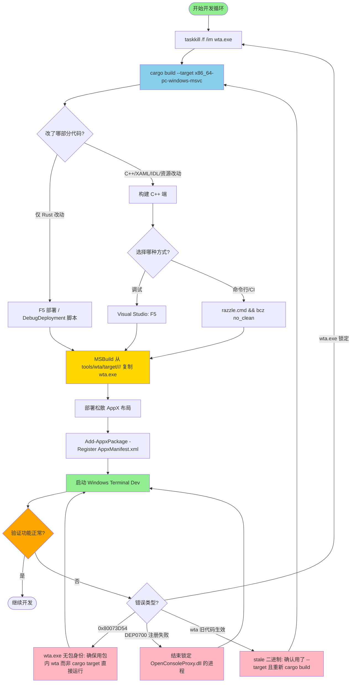

# 第10章 构建系统与开发环境

Intelligent Terminal 采用**双构建系统**架构：Rust WTA 代理组件使用 Cargo，C++ Windows Terminal 应用使用 MSBuild/Visual Studio。两者独立构建但产物相互依赖——C++ 打包项目会自动从 Cargo 输出目录复制 `wta.exe` 到包内。理解这两个构建系统的协作方式和常见陷阱是高效开发的关键。

---

## 10.1 双构建系统概述

### 10.1.1 架构分工

| 组件 | 语言 | 构建系统 | 输出位置 | 负责范围 |
|------|------|----------|----------|---------|
| **WTA (Windows Terminal Agent)** | Rust | Cargo | `tools/wta/target/<triple>/<profile>/` | wta-master、wta-helper、wtcli、Agent 协议处理 |
| **Windows Terminal (C++ 端)** | C++/XAML | MSBuild / Visual Studio | `src/cascadia/CascadiaPackage/bin/<arch>/<config>/AppX/` | UI、COM 服务器、终端渲染、XAML 页面、打包清单 |

> **关键协作点**：`CascadiaPackage.wapproj` 通过 `<Content>` 项规则自动从 Cargo 的显式 target 目录（而非默认 target 目录）复制 `wta.exe` 到 MSIX 包布局中。这是为什么必须显式传递 `--target` 参数的根本原因。

### 10.1.2 构建顺序原则

1. **始终先构建 WTA（Rust）**：C++ MSBuild 在打包阶段需要 `wta.exe` 存在
2. **增量构建可独立**：仅改 Rust 代码 → 只需 `cargo build` + F5 部署；仅改 C++ 代码 → 只需 F5
3. **首次构建需完整走一遍**：两个构建系统都需要初始化依赖

---

## 10.2 前置环境要求

### 10.2.1 必需组件

| 组件 | 最低版本 | 安装说明 |
|------|---------|---------|
| **Windows 10 SDK** | 10.0.22621.0+ | Visual Studio Installer 中勾选 |
| **Visual Studio 2022** | 17.x（推荐 2022 或更高） | 需要两个工作负载：<br>• Desktop development with C++<br>• Universal Windows Platform development |
| **C++ UWP 工具（Latest MSVC）** | 随 VS 版本 | 打开 `OpenConsole.slnx` 时 VS 会提示"Install extra components"，点击 Install 自动安装 |
| **Rust 工具链** | stable（通过 rustup） | https://rustup.rs/ 安装，仓库会自动 pin 版本 |
| **LLVM/Clang** | 10.0.0+ | 用于代码格式化；NuGet 包自动恢复，无需手动安装 |

### 10.2.2 首次启动 Visual Studio 配置

打开 `OpenConsole.slnx` 后必须进行两处关键调试配置：

1. **设置启动项目**：右键 `CascadiaPackage` → Set as Startup Project
2. **调试器类型设置**：右键 `CascadiaPackage` → Properties → Debug：
   - **Application process** → `Native Only`
   - **Background task process** → `Native Only`

> ⚠️ **坑点**：不设置 Native Only 调试器会导致混合模式调试启动失败，F5 直接报错退出。

### 10.2.3 代码格式化配置（可选但推荐）

在 PowerShell 中执行以下命令获取 clang-format.exe：

```powershell
Import-Module .\tools\OpenConsole.psm1
Set-MsBuildDevEnvironment
Get-Format
```

然后在 Visual Studio 中：
Tools → Options → Text Editor → C++ → Formatting → 勾选 "Use custom clang-format.exe file" → 选择 `packages/clang-format.win-x86.10.0.0/tools/clang-format.exe`

---

## 10.3 WTA (Rust) 构建

### 10.3.1 标准构建命令

```powershell
# Debug 构建（开发时用）
cargo build --target x86_64-pc-windows-msvc --manifest-path tools/wta/Cargo.toml

# Release 构建（打包时用）
cargo build --release --target x86_64-pc-windows-msvc --manifest-path tools/wta/Cargo.toml
```

输出位置：`tools/wta/target/x86_64-pc-windows-msvc/debug/wta.exe`（Debug）或对应 release 目录。

### 10.3.2 为什么必须显式 `--target`？

这是**最容易踩的坑**，0.7.0.0 和 0.7.0.1 两个版本都在这里栽过跟头。

**原因**：`CascadiaPackage.wapproj` 中的 `<Content>` 项规则优先查找**显式 target 目录**下的 `wta.exe`：
```
tools/wta/target/<triple>/<profile>/wta.exe    ← MSBuild 优先找这里
tools/wta/target/<profile>/wta.exe              ← 仅作为 fallback
```

如果你只运行 `cargo build`（不带 `--target`），Rust 会写入默认目录 `tools/wta/target/debug/wta.exe`。如果之前曾用 `--target` 构建过，显式目录下会残留一个**旧的 stale 二进制**，MSBuild 会静默打包这个旧版本，你的新代码根本不会生效。

**安全规则**：**任何时候构建 wta.exe 都必须带上 `--target x86_64-pc-windows-msvc`**，即使是开发机默认 triple 就是这个也不例外。

### 10.3.3 构建前先杀进程

如果之前的 wta.exe 正在运行，`cargo build` 链接阶段会报告文件锁定错误：

```powershell
# 先杀残留进程，再构建
taskkill /f /im wta.exe 2>$null; cargo build --target x86_64-pc-windows-msvc --manifest-path tools/wta/Cargo.toml
```

---

## 10.4 Terminal (C++) 构建

有两种方式构建 C++ 端：Visual Studio F5（推荐调试时用）或命令行 razzle + bcz。

### 10.4.1 Visual Studio F5 方式（日常开发推荐）

1. 确认已完成 10.2.2 的配置（启动项目 + 调试器类型）
2. 选择平台：**x64**（或 ARM64）
3. 按 **F5**

F5 会自动：
- 增量构建所有修改过的 C++ 项目
- 从 Cargo 显式 target 目录复制 `wta.exe` 到包布局
- 部署松散布局（loose layout）到开发环境
- 启动 Windows Terminal (Dev) 并附加调试器

### 10.4.2 命令行方式（CI/快速全量构建）

使用 razzle.cmd 环境初始化脚本 + bcz 构建命令：

**Cmd.exe 方式**：
```cmd
.\tools\razzle.cmd
bcz
```

**PowerShell 方式**（单行）：
```powershell
cmd.exe /c "tools\razzle.cmd && bcz no_clean"
```

| 命令 | 说明 |
|------|------|
| `razzle.cmd` | 初始化 MSBuild 环境变量（PATH、INCLUDE、LIB 等） |
| `bcz` | 完整构建（Clean + Build） |
| `bcz no_clean` | 增量构建（推荐日常使用，更快） |
| `bcz rel no_clean` | Release 增量构建 |
| `bx` | 仅构建 Terminal 包（不构建完整解决方案） |

输出位置：`bin/x64/Debug/` 或对应 Release/ARM64 目录。

### 10.4.3 可用的 PowerShell 模块函数

```powershell
Import-Module .\tools\OpenConsole.psm1
Set-MsBuildDevEnvironment

Invoke-OpenConsoleBuild    # 构建解决方案
Invoke-OpenConsoleTests    # 运行测试（默认单元测试）
Start-OpenConsole          # 从输出目录启动 Openconsole.exe
Debug-OpenConsole          # 启动 Openconsole.exe 并附加调试器
Invoke-CodeFormat          # 用 clang-format 格式化所有 C++ 文件
```

---

## 10.5 构建流程图



> **流程说明**：蓝色为 Rust 构建，黄色为 C++/MSBuild 构建，红色为常见错误修复路径，绿色为开始/结束节点。

---

## 10.6 Safe Debug deployment 脚本

当你修改了 C++、XAML、IDL、wtcli.exe、manifest、资源或混合改动后，需要重新部署包。此时推荐使用专用的安全部署脚本，而不是直接重新 F5 或手动运行 Add-AppxPackage。

### 10.6.1 脚本路径与用法

```powershell
.\build\scripts\Invoke-IntelligentTerminalDebugDeployment.ps1 `
    -AppxRecipePath src\cascadia\CascadiaPackage\bin\x64\Debug\CascadiaPackage.build.appxrecipe
```

**前提**：先完成一次 Debug 构建（VS F5 或 `bcz no_clean`），确保 `.build.appxrecipe` 文件已生成。

### 10.6.2 脚本做了什么？

这个脚本比直接重新 F5 更安全，因为它：

1. **验证身份**：只针对 dev-sideload 包（`IntelligentTerminal_rd9vj3e6a2mbr`），不会碰普通 Windows Terminal
2. **精确匹配进程**：只关闭从该 Debug 布局目录运行的进程，不会误伤其他终端
3. **优雅关闭 + 超时强杀**：先尝试 `CloseMainWindow()` 优雅关闭，10秒超时后才 force kill
4. **自动重启**：如果部署前 IT 在运行，部署后自动重新启动
5. **不动普通 WT**：永远不会关闭名为 `WindowsTerminal` 但不在该布局路径下的进程

### 10.6.3 常用参数

| 参数 | 作用 |
|------|------|
| `-WhatIf -Verbose` | 预览模式：只显示会关闭哪些进程，不实际操作 |
| `-NoForce` | 优雅关闭失败时直接报错而非强杀进程 |
| `-NoRestart` | 部署后不自动重启 IT |
| `-CloseTimeoutSeconds 10` | 调整优雅关闭超时（默认10秒） |

### 10.6.4 什么时候不要用这个脚本？

**仅改 wta.exe 时不要用全量部署**——直接 `cargo build` 然后 F5 即可（或者 wta hot-refresh 流程，如果已实现）。全量部署会终止所有 Agent 会话和窗格，成本更高。注意：`wt-agent-hooks` 等静态资源改动**不算** wta.exe-only 改动，需要全量部署。

---

## 10.7 Package identity & COM 要求

### 10.7.1 为什么需要包身份？

`TerminalProtocolComServer`（COM 服务器）是在 Terminal 的**包身份**下注册的。`wtcli.exe` 和 `wta.exe` 调用 `CoCreateInstance` 激活这个 COM 服务器时，自身也必须具有**匹配的包身份**，否则激活会被 Windows AppModel 拒绝。

这就是为什么：
- `wta.exe` 必须部署在包内（紧邻 `WindowsTerminal.exe`），而不是从 cargo target 目录直接运行
- `_DetectWtaPath()` 优先查找同目录下的 `wta.exe`，只有找不到时才回退到开发构建路径

### 10.7.2 0x80073D54 错误诊断

**错误码含义**：`APPMODEL_ERROR_NO_PACKAGE` — 进程没有包身份。

**典型症状**：
- Autofix 完全不工作（底部栏无任何反应）
- Agent 窗格无法连接
- `wtcli list-panes` 等命令失败

**排查步骤**：

1. 查看诊断日志：
   ```powershell
   Get-Content $env:TEMP\wta-ensure-host.log -Wait
   ```
   搜索 `0x80073D54` 关键字

2. 确认运行的是哪个 wta.exe：
   ```powershell
   Get-Process wta | Select-Object Id, Path
   ```
   - 正确路径应该类似：`...\src\cascadia\CascadiaPackage\bin\x64\Debug\AppX\wta.exe`
   - 错误路径：`...\tools\wta\target\x86_64-pc-windows-msvc\debug\wta.exe`（直接从 cargo 目录运行）

3. 修复方法：
   - 不要直接双击运行 cargo 输出目录下的 wta.exe
   - 确保通过 F5 或 DebugDeployment 脚本启动
   - 如果 SharedWta 错误加载了非包内 wta，先杀 wta.exe 再重新部署

---

## 10.8 完整开发循环

这是日常开发中最常用的标准循环，记住这 3 步即可：

```
┌─────────────────────────────────────────────────────────┐
│  1. 杀 wta.exe 进程（避免链接锁定）                     │
│     taskkill /f /im wta.exe                             │
├─────────────────────────────────────────────────────────┤
│  2. 构建 Rust WTA（必须带 --target）                     │
│     cargo build --target x86_64-pc-windows-msvc         │
│       --manifest-path tools/wta/Cargo.toml              │
├─────────────────────────────────────────────────────────┤
│  3. Visual Studio F5（构建 C++ + 部署 + 启动调试）       │
│     （命令行替代：razzle.cmd && bcz no_clean）           │
└─────────────────────────────────────────────────────────┘
```

### 10.8.1 不同改动类型的快速路径

| 改动内容 | 需要做什么 |
|---------|-----------|
| **仅 Rust 代码**（wta 内部逻辑、autofix、ACP 协议） | 步骤 1 → 2 → F5（F5 只做部署，不重编 C++） |
| **仅 C++ 代码**（TerminalPage、渲染、COM 服务器） | F5（不需要重新 cargo build，只要 wta.exe 已存在） |
| **XAML/IDL/资源修改** | F5（XBF 生成和 IDL 编译会自动处理） |
| **wtcli.exe 修改** | cargo build → 全量部署（DebugDeployment 脚本或 F5） |
| **wt-agent-hooks 修改** | 全量部署（这不是 wta.exe-only 改动） |
| **Cargo.toml 依赖变更** | 步骤 1 → 2（cargo 会自动处理依赖）→ F5 |

> 💡 **增量构建速度**：小的 Rust 改动 cargo build 只需几秒；C++ 增量构建 F5 通常 10-30 秒；全量清理构建可能需要 5-10 分钟。

---

## 10.9 常见构建问题

### 10.9.1 wta.exe 被锁定无法编译

**症状**：`cargo build` 链接阶段报错：`error: linking with `link.exe` failed: ... Access is denied.`

**原因**：旧的 wta.exe 进程还在运行（作为 helper 或 master），链接器无法写入新文件。

**解决**：
```powershell
taskkill /f /im wta.exe
```
如果仍然锁定，检查是否有 `WindowsTerminal.exe`（Dev）还在运行——Dev 终端的进程树里会有 wta helper。关闭 Dev 终端窗口后重试。

### 10.9.2 DEP0700: Registration of the app failed

**症状**：VS F5 部署时报错 `DEP0700: Registration of the app failed. [0x80073CF6]` 或类似错误。

**常见原因**：`OpenConsoleProxy.dll` 被其他终端包锁定了（之前的 Dev 安装残留、旧版本 WT 进程）。

**诊断和修复**：

1. 用 PowerShell 获取详细错误：
   ```powershell
   Add-AppxPackage -register "src\cascadia\CascadiaPackage\bin\x64\Debug\AppX\AppxManifest.xml"
   ```

2. 如果提示 activity ID，运行：
   ```powershell
   Get-AppPackageLog -ActivityID <your-activity-id>
   ```

3. 常见根因：packaged COM 条目无法删除，提示 access denied。
   - 打开 `C:\ProgramData\Microsoft\Windows\AppRepository\Packages\` 下对应包目录
   - 用 File Locksmith（PowerToys）或 Process Explorer 查看谁锁定了 `OpenConsoleProxy.dll`
   - 结束所有锁定进程后重新部署

### 10.9.3 新改的 Rust 代码没生效

**症状**：明明改了代码也重新 cargo build 了，但跑起来还是旧行为。

**排查清单**：
1. ✅ 构建时带了 `--target x86_64-pc-windows-msvc` 吗？（没有的话 MSBuild 可能打包了 stale 二进制）
2. ✅ 构建前杀了旧 wta.exe 吗？（旧进程没退出会一直用旧代码）
3. ✅ F5 重新部署了吗？（cargo build 只编译，必须重新部署才能把新 wta.exe 复制到包布局）
4. ✅ 检查 AppX 目录下 wta.exe 的时间戳：
   ```powershell
   Get-Item src\cascadia\CascadiaPackage\bin\x64\Debug\AppX\wta.exe | Select-Object LastWriteTime
   ```
   这个时间应该是你刚 cargo build 的时间。

### 10.9.4 NuGet/vcpkg 依赖缺失

**症状**：第一次构建报大量头文件找不到、链接错误。

**解决**：NuGet 和 vcpkg 依赖在构建时会自动恢复。如果没恢复：
1. 确认 Visual Studio 安装了 .NET desktop development workload（NuGet 需要）
2. 在 VS 中右键解决方案 → Restore NuGet Packages
3. 或者删除 `packages/` 目录后重新构建

### 10.9.5 MSB3030: AIAgents.xaml.g.h not found

**症状**：构建 TerminalAppLib 时找不到生成的 XAML 头文件。

**原因**：项目构建顺序有问题，Settings.Editor 还没生成 XBF 文件。

**解决**：使用 `_build_msix_x64.cmd` 或 `_build_msix_arm64.cmd` 包装脚本，它们会先预构建 Settings.ModelLib 和 Settings.Editor；或者在 VS 中单独先构建 `Microsoft.Terminal.Settings.Editor` 项目。

---

## 10.10 MSIX 打包与自解压 EXE 安装程序

分发 Intelligent Terminal 有两种格式：MSIX ZIP（打包版，带包身份）和自解压 EXE（便携版，无包身份）。

### 10.10.1 MSIX ZIP 打包版

**输出**：`artifacts/local-installer/intelligent-terminal-<version>-<arch>-msix.zip`

**ZIP 内容结构**：
```
intelligent-terminal-<version>-<arch>-msix.zip
├── IntelligentTerminalDev.cer                    # 开发签名证书
├── CascadiaPackage_<version>_<arch>.msix         # 签名的 Terminal MSIX
├── Dependencies/
│   └── <arch>/Microsoft.UI.Xaml.2.8.appx         # XAML 框架依赖
├── Install-Msix.ps1                              # 安装脚本（导入证书 + 安装包）
└── fre-test-reset.ps1                            # FRE 重置工具（重复测试用）
```

**构建步骤**（Release 打包）：

```powershell
# 0. 先升级版本号（改两个文件）
#    src/cascadia/CascadiaPackage/Package-Dev.appxmanifest → Identity Version
#    _sign_msix.cmd → 版本字符串

# 1. 构建 Release WTA（必须带 --target，两个架构）
cargo build --release --target x86_64-pc-windows-msvc --manifest-path tools/wta/Cargo.toml
cargo build --release --target aarch64-pc-windows-msvc --manifest-path tools/wta/Cargo.toml

# 2. 构建 MSIX（x64 必须先跑完，再跑 ARM64，串行！）
.\build_msix_x64.cmd
.\build_msix_arm64.cmd

# 3. 签名
.\sign_msix.cmd

# 4. 组装 ZIP
powershell -File build\scripts\assemble-msix-zip.ps1 -Version 0.X.X.X -Arch x64
powershell -File build\scripts\assemble-msix-zip.ps1 -Version 0.X.X.X -Arch ARM64
```

> ⚠️ **串行构建警告**：x64 和 ARM64 必须**串行**构建，不能并行。它们共享 `Generated Files/` 下的 XAML 文件，并行会出现 `WMC9999 — being used by another process` 竞争错误。

**安装**：解压 ZIP → 右键用 PowerShell 运行 `Install-Msix.ps1`。首次安装需要管理员权限导入证书，之后无需管理员。

### 10.10.2 自解压 EXE 便携版

便携版不使用 MSIX，没有包身份，直接解压到 `%LOCALAPPDATA%\Programs\IntelligentTerminal\`。适合快速分发、无需安装的场景。

**输出**：`artifacts/local-installer/intelligent-terminal-<version>-<arch>-<config>-setup.exe`

**构建命令**：

```powershell
# 完整构建（从源码构建 Terminal MSIX 再打包）
.\build\scripts\New-WtaLocalInstaller.ps1 -Platform x64 -Configuration Release -BuildTerminal

# 使用已有 MSIX（跳过 Terminal 重编）
.\build\scripts\New-WtaLocalInstaller.ps1 -Platform x64 -Configuration Release

# 连 wta 都不重编
.\build\scripts\New-WtaLocalInstaller.ps1 -Platform x64 -Configuration Release `
    -SkipWtaBuild -WtaExePath tools\wta\target\x86_64-pc-windows-msvc\release\wta.exe
```

**便携版做了什么**：
1. 提取已构建的 MSIX 内容到临时布局
2. 构建静态 CRT 链接的 release wta.exe
3. 注入 wta.exe、wtcli.exe、prompt 模板
4. 构建 Rust bootstrap EXE
5. 组装为自解压文件：bootstrap + install.cmd + payload.zip

**安装**：直接运行 `-setup.exe`，它会自解压并自动运行安装脚本。安装到 `%LOCALAPPDATA%\Programs\IntelligentTerminal\`，不需要管理员权限。支持 `/quiet`（静默安装）、`/nopath`（不加 PATH）、`/noshortcuts`（不创建快捷方式）参数。

### 10.10.3 两种格式对比

| 维度 | MSIX ZIP（打包版） | 自解压 EXE（便携版） |
|------|------------------|-------------------|
| 包身份 | ✅ 有（完整 COM 支持） | ❌ 无（日志回退到 `%LOCALAPPDATA%\IntelligentTerminal`） |
| 安装方式 | Add-AppxPackage | 解压到目录 |
| 管理员权限 | 首次导入证书需要 | 不需要 |
| COM 激活 | ✅ 完整支持 | ⚠️ 受限（0x80073D54 会出现） |
| Autofix/Agent 功能 | ✅ 完整可用 | ⚠️ 功能受限 |
| 推荐场景 | 开发团队日常使用、正式分发 | 快速测试、便携使用、无 UWP 开发环境的机器 |

---

## 源码溯源

| 来源 | 内容 |
|------|------|
| [`AGENTS.md:323-403 Build 章节`](../../../../../external/libs/intelligent-terminal/AGENTS.md#L323-L403) | 双构建系统说明、--target 参数原因、包身份与 COM 要求、标准开发循环 |
| [`doc/building.md`](../../../../../external/libs/intelligent-terminal/doc/building.md) | OpenConsole 构建指南、razzle/bcz 命令、PowerShell 模块函数、DEP0700 错误排查、MSBuild 命令行参数 |
| [`doc/quick-start-local-dev.md`](../../../../../external/libs/intelligent-terminal/doc/quick-start-local-dev.md) | 快速开始指南、首次环境要求、F5 配置、改代码后的操作速查表 |
| [`doc/building-installer.md`](../../../../../external/libs/intelligent-terminal/doc/building-installer.md) | MSIX 打包完整步骤、版本号升级、自解压 EXE 构建流程、两种格式对比 |
| [`build/scripts/Invoke-IntelligentTerminalDebugDeployment.ps1`](../../../../../external/libs/intelligent-terminal/build/scripts/Invoke-IntelligentTerminalDebugDeployment.ps1) | 安全 Debug 部署脚本实现、进程匹配逻辑、参数说明 |
| [`tools/wta/src/runtime_paths.rs:1-101`](../../../../../external/libs/intelligent-terminal/tools/wta/src/runtime_paths.rs#L1-L101) | 包身份检测、0x80073D54 错误处理逻辑、运行时路径回退机制 |

---

## 本章导航

- [上一章：Autofix 自动错误检测与修复](09-autofix.md)
- [返回目录](README.md)
- [下一章：日志与调试](11-logging-debugging.md)
