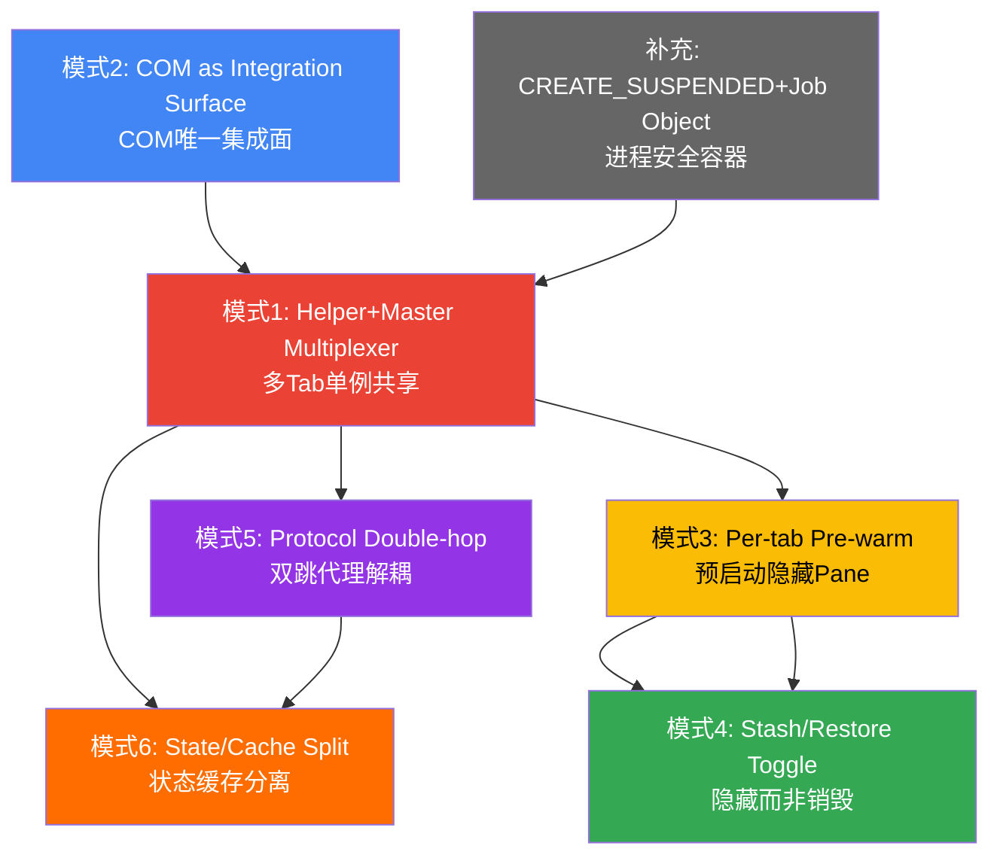

# 🔍 E阶段（萃取）- 可复用设计模式库

本章是R-I-E-A学习链路的**E阶段（萃取）**核心产出，基于前12章对Intelligent Terminal架构的完整理解，提炼出6+1个可复用的架构设计模式。这些模式不仅适用于终端AI集成场景，也可迁移到其他需要多进程协作、跨语言集成、低延迟UI交互的桌面应用开发中。

---

## 模式1：Helper+Master Multiplexer（多Tab/多窗口单例Agent CLI共享模式）

### 模式名称
Helper+Master Multiplexer（Helper+Master多路复用器模式）

### 问题背景

在多Tab/多窗口场景下集成AI Agent面临三重矛盾：

1. **资源开销矛盾**：每个Tab/窗口独立启动Agent CLI进程（如Copilot/Claude/Gemini，npx冷启动30s+）导致N个Pane产生2N个进程（N个UI + N个Agent），内存占用线性增长
2. **架构不对称矛盾**：Windows Terminal是单进程多窗口架构（`WindowEmperor → AppHost[]`），COM服务器是per-process单例；如果wta是per-window单例，多窗口会产生多个独立wta进程，必须额外添加窗口过滤逻辑防止事件串扰
3. **崩溃隔离矛盾**：单例wta进程崩溃会导致所有Tab的Agent功能失效，而per-tab独立进程又无法共享Agent CLI连接

M3-M6阶段尝试"单例wta + 匿名管道 + DuplicateHandle"方案时遇到根本技术障碍：跨进程ConPTY输入不可行——`CreatePseudoConsole`不向conpty子进程外暴露slave HANDLE，对端进程只能读到原始VT字节，无法获得结构化`INPUT_RECORD`，需要手写VT→KeyEvent解析器，无法支持方向键、Ctrl组合、IME、Bracketed Paste、鼠标等完整控制台语义。

> **来源**：[Multi-window-agent-pane.md §问题背景](../../../../../external/libs/intelligent-terminal/doc/specs/Multi-window-agent-pane.md#L108-L140)

### 解决方案

采用**双层进程拓扑**：per-tab Helper进程 + per-process Master单例进程 + 单个共享Agent CLI。

```
Windows Terminal (单进程多窗口)
    └── SharedWta (C++单例，引用计数生命周期)
         └── wta-master (Rust单例，ACP Mux)
              ├── Agent CLI (单例共享，stdio ACP)
              ├── wta-helper #1 (Tab 1, ConPTY子进程, TUI)
              ├── wta-helper #2 (Tab 2, ConPTY子进程, TUI)
              └── wta-helper #N (Tab N, ConPTY子进程, TUI)
```

进程数量公式：**N个Agent Pane ⇒ N个wta-helper + 1个wta-master + 1个Agent CLI**，而非传统方案的N+N。

### 核心步骤

1. **C++侧单例管理**：`SharedWta`采用magic static单例，使用引用计数管理master生命周期——第一个Pane `AcquirePane()`时spawn，最后一个Pane `ReleasePane()`时通过Job Object终止
2. **CREATE_SUSPENDED竞态防护**：创建master进程时使用`CREATE_SUSPENDED`标志，先放入Job Object再`ResumeThread()`，防止微秒级窗口中WT崩溃导致进程泄漏
3. **Master作为透明代理**：wta-master不持有UI状态、不渲染TUI、不存储聊天历史，仅做ACP消息路由和SessionId→Helper映射
4. **Helper作为ConPTY子进程**：每个wta-helper作为标准ConPTY子进程spawn，复用Windows Terminal几十年控制台生态积累（crossterm按键解析、IME、Bracketed Paste、鼠标SGR）
5. **SessionId原子路由**：master在`session/new`响应返回给helper**之前**原子性插入`SessionId→HelperRoute`映射，消除竞态窗口
6. **崩溃故障域隔离**：单个Helper崩溃只影响一个Tab；Master崩溃时所有Helper进入`transport_lost`状态但不退出，支持`/restart`恢复

### 源码位置

| 组件 | 文件路径 | 关键实现 |
|------|----------|----------|
| SharedWta单例 | [`src/cascadia/TerminalApp/SharedWta.cpp`](../../../../../external/libs/intelligent-terminal/src/cascadia/TerminalApp/SharedWta.cpp) | 引用计数、Job Object、CREATE_SUSPENDED、崩溃检测 |
| Master Mux核心 | [`tools/wta/src/master/mod.rs`](../../../../../external/libs/intelligent-terminal/tools/wta/src/master/mod.rs) | ACP多路复用、Session路由、Agent CLI池化 |
| Helper入口 | [`tools/wta/src/helper/mod.rs`](../../../../../external/libs/intelligent-terminal/tools/wta/src/helper/mod.rs) | Helper启动、TUI初始化、管道连接 |
| 多窗口管理 | [`src/cascadia/WindowsTerminal/WindowEmperor.cpp`](../../../../../external/libs/intelligent-terminal/src/cascadia/WindowsTerminal/WindowEmperor.cpp) | Monarch模式、跨窗口Tab拖拽 |

### 适用场景

- 单宿主进程包含多个独立UI面板（Tab/Pane/窗口），需要共享昂贵的后端服务（LLM推理、数据库连接、硬件资源）
- UI面板需要完整的终端/控制台交互语义（键盘、鼠标、IME），无法跨进程转发原始输入
- 故障隔离要求高——单个面板崩溃不能影响其他面板
- 后端服务启动成本高（冷启动>1s），per-panel启动不可接受

### 反模式警示

> **🚫 反模式1：在Master中持有UI/会话状态**
>
> Master必须保持无状态（仅做路由）。如果在Master中存储聊天历史、UI状态、权限弹窗上下文，会导致：
> - Helper崩溃重连时状态不一致
> - 跨Helper状态污染（Tab A的对话泄露到Tab B）
> - Master复杂度爆炸，从简单Mux变成胖服务，崩溃面扩大
>
> **正确做法**：所有会话状态、聊天历史、TUI状态都在Helper进程的`TabSession`中，Master只维护`SessionId→HelperRoute`路由表。

> **🚫 反模式2：忽略ConPTY输入技术障碍，强行跨进程转发输入**
>
> 不要尝试通过`DuplicateHandle`复制ConPTY slave HANDLE给单例wta来读取输入——这在Windows上根本不可行：
> - `CreatePseudoConsole`不向子进程外暴露slave HANDLE
> - 只能读到原始VT字节，无法获得`INPUT_RECORD`结构
> - 需要手写VT解析器，无法支持IME/Bracketed Paste/鼠标/方向键
> - 这是M3-M6阶段验证过的死路，不要重蹈覆辙
>
> **正确做法**：让Helper成为ConPTY直接子进程，在Helper进程内使用crossterm读取结构化输入。

> **🚫 反模式3：不使用Job Object，手动递归kill子进程**
>
> 不要在master退出时手动遍历子进程列表kill——容易漏掉孙进程（Agent CLI spawn的子进程），导致孤儿进程泄漏。
>
> **正确做法**：使用Windows Job Object + `JOB_OBJECT_LIMIT_KILL_ON_JOB_CLOSE`，OS保证Job句柄关闭时所有进程树自动终止。

### 迁移验证

从per-window单例迁移到Helper+Master架构的验证清单：

1. **资源验证**：打开5个Agent Pane，任务管理器中确认只有1个wta-master + 1个Agent CLI + 5个wta-helper
2. **崩溃隔离验证**：任务管理器kill一个wta-helper，确认其他Pane继续正常工作，C++侧自动respawn新helper
3. **跨窗口拖拽验证**：拖拽Tab到新窗口，确认Agent会话历史保留（通过`tab_renamed`事件rebind）
4. **竞态验证**：快速连续打开10个Pane，确认不会spawn多个master（引用计数正确）
5. **泄漏验证**：关闭所有Pane后等待2s，确认所有wta进程已退出（Job Object生效）

---

## 模式2：COM as Integration Surface（COM作为唯一进程间集成面）

### 模式名称
COM as Integration Surface（COM作为唯一进程间集成面模式）

### 问题背景

跨进程集成宿主应用（Windows Terminal）时面临选择困境：

1. **自定义IPC的诱惑**：容易想到"定义一个简单的JSON协议，用命名管道/套接字通信"
2. **WinRT的陷阱**：Windows提供WinRT作为现代IPC，但WinRT MBM（Metadata-Based Marshaling）激活目录存在已知崩溃问题（0xc0000005 / 0x80010105）
3. **封送复杂度**：自定义IPC需要手动处理类型序列化、跨公寓封送、生命周期管理、版本兼容
4. **发现机制**：客户端如何定位服务端点？硬编码管道名？注册表？环境变量？

Intelligent Terminal早期版本考虑过多种方案，最终选择经典COM作为唯一集成表面。

> **来源**：[TerminalProtocolComServer.cpp 头部注释](../../../../../external/libs/intelligent-terminal/src/cascadia/WindowsTerminal/TerminalProtocolComServer.cpp#L1-L43)

### 解决方案

**使用经典COM（Classic COM）Local Server（`CLSCTX_LOCAL_SERVER`）作为宿主应用暴露给外部进程的唯一集成表面，不发明自定义IPC，不使用WinRT MBM。**

- 接口通过WinRT IDL定义（获得结构序列化、代码生成的好处）
- 但注册为经典COM类工厂（WRL `SimpleClassFactory`），通过OpenConsoleProxy proxy/stub封送，避开WinRT MBM崩溃
- 客户端通过`WT_COM_CLSID`环境变量发现CLSID，无需硬编码
- COM激活本身作为信任边界（包身份要求），不依赖`Authenticate()` token

### 核心步骤

1. **IDL定义接口**：在`TerminalProtocol.idl`中定义`IProtocolServer`（服务器）和`IProtocolEventCallback`（客户端回调），以及所有结构化类型（WindowInfo/TabInfo/PaneInfo等）
2. **品牌化CLSID**：每个发布品牌（Release/Preview/Canary/Dev）使用独立CLSID，避免不同渠道版本COM注册冲突；CLSID通过`WT_COM_CLSID`环境变量传递
3. **MTA线程模型**：在专用MTA线程上调用`CoRegisterClassObject`注册类工厂，COM调用在MTA工作线程执行，不阻塞UI/STA线程
4. **UI线程封送**：COM方法内部通过`dispatcher.RunAsync()`封送到UI线程查询/操作XAML状态，然后`.get()`等待结果——MTA线程上`.get()`不会死锁STA
5. **Agile Reference存储回调**：客户端sink通过`RoGetAgileReference(AGILEREFERENCE_DEFAULT)`存储为agile reference，可在任意公寓解析
6. **有界队列背压**：每个订阅者维护独立的4K有界FIFO队列，事件入队立即返回；detached MTA线程排出队列同步调用`OnEvent`，慢客户端不阻塞UI
7. **包身份信任边界**：COM激活时Windows自动验证包身份，只有同包内（或被显式授权）的进程才能CoCreateInstance成功

### 源码位置

| 组件 | 文件路径 | 关键实现 |
|------|----------|----------|
| COM服务器 | [`src/cascadia/WindowsTerminal/TerminalProtocolComServer.cpp`](../../../../../external/libs/intelligent-terminal/src/cascadia/WindowsTerminal/TerminalProtocolComServer.cpp) | MTA注册、BoundedDispatchQueue、AgileReference、事件fan-out |
| COM服务器头文件 | [`src/cascadia/WindowsTerminal/TerminalProtocolComServer.h`](../../../../../external/libs/intelligent-terminal/src/cascadia/WindowsTerminal/TerminalProtocolComServer.h) | _DeliveryState、s_maxQueuedEvents=4096 |
| IDL接口定义 | [`src/cascadia/TerminalProtocol/TerminalProtocol.idl`](../../../../../external/libs/intelligent-terminal/src/cascadia/TerminalProtocol/TerminalProtocol.idl) | IProtocolServer、IProtocolEventCallback、所有结构体 |
| wtcli客户端 | [`src/cascadia/WtClient/WtClient.cpp`](../../../../../../external/libs/intelligent-terminal/src/cascadia/WtClient/WtClient.cpp) | CoCreateInstance、WT_COM_CLSID读取、方法调用 |

### 适用场景

- Windows桌面应用需要向外部进程暴露可编程接口（查询状态、执行操作、订阅事件）
- 宿主是已有UI线程（STA/XAML）的应用，需要在后台线程处理跨进程调用
- 需要支持多客户端同时连接，且慢客户端不能阻塞宿主UI
- 需要企业级安全边界（包身份、GPO策略控制）

### 反模式警示

> **🚫 反模式1：在UI线程（STA）上直接处理COM调用**
>
> 如果COM对象注册在STA（UI线程），跨进程调用会排队到UI线程消息循环。一个慢客户端（或恶意客户端）的同步`OnEvent`回调会阻塞整个UI线程，导致窗口冻结。
>
> **正确做法**：在专用MTA线程注册COM，每个订阅者使用独立队列+独立投递线程，COM方法内部通过RunAsync封送到UI，入队操作永不阻塞。

> **🚫 反模式2：使用无界事件队列**
>
> 事件广播使用无界队列（或直接同步调用所有订阅者），一个卡住的客户端会导致：
> - 内存无限增长（队列溢出）
> - 所有后续事件被阻塞（队头阻塞）
> - UI线程冻结（如果广播路径经过UI）
>
> **正确做法**：使用固定容量有界队列（4096），满时丢弃最旧事件，背压但不阻塞；detached投递线程持有自己的`shared_ptr`，不join避免重入死锁。

> **🚫 反模式3：硬编码CLSID，多品牌共用一个GUID**
>
> Release/Preview/Canary/Dev版本使用相同CLSID会导致：
> - 并行安装时COM注册互相覆盖
> - wtcli连接到错误版本的WT实例
> - 调试时无法区分不同渠道的服务器
>
> **正确做法**：每个品牌独立CLSID，编译时通过`WT_BRANDING_*`宏选择，运行时通过环境变量`WT_COM_CLSID`传递给客户端。

> **🚫 反模式4：使用WinRT MBM而非经典COM**
>
> WinRT进程外服务器使用MBM（Metadata-Based Marshaling），在Windows激活目录中存在已知崩溃bug，表现为0xc0000005访问冲突或0x80010105 RPC_E_FAULT。
>
> **正确做法**：接口用WinRT IDL定义（获得代码生成好处），但注册为经典COM Local Server，使用自定义proxy/stub（OpenConsoleProxy）封送。

### 迁移验证

从自定义IPC迁移到COM集成面的验证清单：

1. **多客户端验证**：同时启动5个wtcli subscribe，确认事件广播到所有客户端，kill一个不影响其他
2. **慢客户端验证**：一个wtcli在OnEvent中sleep 10s，确认WT UI不冻结，其他客户端继续接收事件
3. **背压验证**：快速产生10000个事件，确认内存稳定（队列满后丢弃旧事件），wtcli断开重连后正常
4. **品牌隔离验证**：并行安装Release和Canary，确认各自wtcli连接到正确的COM服务器
5. **安全验证**：从非包进程（如cmd直接启动的wtcli）尝试CoCreateInstance，确认返回APPMODEL_ERROR_NO_PACKAGE

---

## 模式3：Per-tab Pre-warm（预启动隐藏Pane实现零延迟激活+后台功能）

### 模式名称
Per-tab Pre-warm（每Tab预启动隐藏Pane模式）

### 问题背景

按需启动AI Pane存在双重体验问题：

1. **激活延迟**：用户按Ctrl+Shift+.打开Agent Pane时才启动——需要spawn ConPTY → spawn wta-helper → helper连接master → ACP握手 → TUI渲染，整个过程1-3秒，用户感知明显卡顿
2. **后台功能不可用**：Autofix等被动检测功能需要helper进程运行才能监听命令失败事件；如果用户从未打开过Agent Pane，打开新Tab运行命令出错时Autofix完全无法工作

> **来源**：[TabManagement.cpp pre-warm注释](../../../../../external/libs/intelligent-terminal/src/cascadia/TerminalApp/TabManagement.cpp#L226-L240)

### 解决方案

**每个新终端Tab创建时，自动在后台spawn一个wta-helper进程，并立即stash（隐藏）。Helper完成启动、ACP握手、事件订阅全部在后台进行，用户无感知。**

```
用户打开新Tab
    ↓ (低优先级dispatcher tick)
AutoCreateHiddenAgentPane(autoStash=true)
    ├─ AcquirePane() → 确保master运行
    ├─ 创建ConptyConnection → spawn wta-helper --start-stashed
    ├─ 包装为AgentPaneContent（带36px chrome）
    ├─ SplitPane加入Tab的Pane树
    └─ 立即StashAgentPane() → 从XAML视觉树隐藏
        (ConPTY、helper进程、ACP连接全部存活，后台运行)

用户按Ctrl+Shift+.
    ↓
RestoreStashedAgentPane() → 仅XAML视觉unhide → 即时显示
    (无需启动进程、无需握手、会话已就绪)
```

关键：pre-warm不是"提前创建UI然后显示"，而是"提前启动整个进程栈并隐藏"——底层ConPTY连接、wta-helper进程、ACP会话、事件订阅全部在后台存活运行。

### 核心步骤

1. **低优先级触发**：pre-warm不在Tab构造函数中同步执行，而是通过`DispatcherQueue::TryEnqueue`在低优先级tick中延迟触发，不阻塞Tab打开的UI响应
2. **--start-stashed标志**：helper命令行传递`--start-stashed`，告知helper Pane启动时处于隐藏状态；helper完成ACP连接但不主动触发某些UI动画
3. **autoStash=true**：helper Pane创建SplitPane加入Pane树后，**立即**调用`StashAgentPane()`从XAML视觉树移除（但Pane对象、ConPTY连接、helper进程全部保留）
4. **初始化条件检查**：仅当`agentLeavesSeen == 0`（新建普通终端Tab，非跨窗口拖拽带入的Tab）时触发pre-warm
5. **跳过持久化**：pre-warmed agent pane**不**序列化到保存的窗口布局——重启WT时管道名失效、`owner_tab_id`不存在，持久化会导致"幽灵pane"连接到死管道

### 源码位置

| 组件 | 文件路径 | 关键实现 |
|------|----------|----------|
| Pre-warm触发 | [`src/cascadia/TerminalApp/TabManagement.cpp`](../../../../../external/libs/intelligent-terminal/src/cascadia/TerminalApp/TabManagement.cpp#L226-L380) | _InitializeTab中低优先级触发、_AutoCreateHiddenAgentPaneShared |
| Stash实现 | [`src/cascadia/TerminalApp/Tab.cpp`](../../../../../external/libs/intelligent-terminal/src/cascadia/TerminalApp/Tab.cpp#L2530-L2592) | StashAgentPane、HidePane、焦点恢复 |
| Restore实现 | [`src/cascadia/TerminalApp/Tab.cpp`](../../../../../external/libs/intelligent-terminal/src/cascadia/TerminalApp/Tab.cpp#L2605-L2660) | RestoreStashedAgentPane、显式FocusPane |
| 持久化过滤 | [`src/cascadia/TerminalApp/Pane.cpp`](../../../../../external/libs/intelligent-terminal/src/cascadia/TerminalApp/Pane.cpp#L146-L162) | 序列化时折叠agent leaf，避免持久化死连接 |
| Helper start-stashed | [`tools/wta/src/helper/config.rs`](../../../../../external/libs/intelligent-terminal/tools/wta/src/helper/config.rs) | --start-stashed命令行标志解析 |

### 适用场景

- UI面板启动成本高（进程启动、网络连接、握手协议），但需要即时可用的体验
- 面板有后台被动功能（事件监听、状态监控、自动修复），需要在用户主动打开前就运行
- 面板是"可选增强"而非"默认可见"，大多数用户不会主动打开但打开时期望零延迟
- 面板进程内存开销可接受（wta-helper约10-20MB，在现代系统上可忽略）

### 反模式警示

> **🚫 反模式1：同步pre-warm阻塞Tab打开**
>
> 在Tab的构造函数或`_Initialize`同步路径中创建agent pane和spawn helper，会导致Tab打开明显变慢——用户感知是"新建Tab卡顿"。
>
> **正确做法**：pre-warm在低优先级DispatcherQueue tick中触发，Tab先显示终端内容，agent pane在后台静默启动。

> **🚫 反模式2：pre-warmed pane持久化到窗口布局**
>
> 如果将pre-warmed agent pane序列化到保存的窗口布局，重启WT时会尝试重新连接到上次的master管道名（已失效），产生"幽灵pane"挂在死连接上，helper不断重连失败打日志。
>
> **正确做法**：Pane序列化时，如果split的一个子节点是agent leaf，只序列化另一个子节点（折叠split）；重启后每个恢复的Tab自动触发新的pre-warm。

> **🚫 反模式3：pre-warmed但helper不连接master（延迟连接）**
>
> 只spawn helper进程但延迟连接master，直到用户第一次toggle才建立ACP连接——这样Autofix等后台功能仍然不可用，且第一次toggle仍有握手延迟。
>
> **正确做法**：pre-warmed helper立即完成完整启动流程（连接master、ACP initialize、订阅WT事件），只是UI不显示。

> **🚫 反模式4：所有Tab无条件pre-warm，忽略跨窗口拖拽**
>
> 跨窗口拖拽Tab时，目标窗口`_InitializeTab`也会触发pre-warm，但拖拽过来的Tab已经带着自己的agent pane——重复pre-warm会产生多余的helper进程。
>
> **正确做法**：检查`agentLeavesSeen`计数器，只有新建Tab（计数为0）才触发pre-warm。

### 迁移验证

从按需启动迁移到Per-tab Pre-warm的验证清单：

1. **零延迟验证**：新建Tab后立即按Ctrl+Shift+.，确认Agent Pane即时显示（无spinner/加载等待）
2. **后台功能验证**：新建Tab后不打开Agent Pane，直接运行一个会失败的命令（如`nonexistent-command`），确认Autofix banner出现
3. **进程验证**：新建3个Tab但不打开Agent Pane，任务管理器确认3个wta-helper进程已在运行
4. **持久化验证**：打开3个Tab（含pre-warmed pane），保存窗口布局，关闭WT重开，确认没有wta进程残留；恢复的Tab自动pre-warm新helper
5. **跨窗口拖拽验证**：拖拽Tab到新窗口，确认不产生重复helper（目标窗口不pre-warm已带pane的Tab）

---

## 模式4：Stash/Restore Toggle（隐藏而非销毁，保留会话状态）

### 模式名称
Stash/Restore Toggle（Stash/Restore切换模式：隐藏而非销毁）

### 问题背景

Agent Pane的toggle（打开/关闭）如果采用"关闭即销毁"模型，会导致：

1. **会话丢失**：每次toggle销毁helper进程 → ACP会话终止 → 聊天历史丢失
2. **重复启动开销**：每次打开都要重新spawn helper、连接master、建立ACP会话——即使有pre-warm，stash期间断开重连也会丢失流式响应
3. **Autofix中断**：stash期间helper终止，无法监听命令失败事件，Autofix停止工作
4. **跨toggle状态断裂**：toggle过程中如果有in-flight请求（正在流式响应），销毁会导致响应中断、状态不一致

> **来源**：[AGENTS.md Pre-warming & Stash](../../../../../external/libs/intelligent-terminal/AGENTS.md#L74-L92)

### 解决方案

**Agent Pane的toggle（Ctrl+Shift+.）采用stash（隐藏）/restore（恢复）模型而非destroy/create模型。Stash只从XAML视觉树移除Pane，底层ConPTY连接、wta-helper进程、ACP会话、聊天历史、in-flight请求全部保留。**

```
用户按Ctrl+Shift+.（Pane可见时）
    ↓
StashAgentPane()
    ├─ FindAgentPane()查找当前agent pane
    ├─ parent->HidePane(agentPane) → 从Grid children移除（不销毁Pane对象）
    └─ 焦点移到兄弟终端Pane（延迟dispatcher，等XAML布局完成）
    (ConPTY、helper进程、ACP连接、聊天历史全部存活)
    (helper继续在后台接收WT事件、处理Autofix)

用户按Ctrl+Shift+.（Pane stashed时）
    ↓
RestoreStashedAgentPane()
    ├─ parent->RestorePane(agentPane) → 重新加入XAML视觉树
    └─ _rootPane->FocusPane(agentPane) → 显式聚焦agent pane的TermControl
    (无需启动任何进程，无需重新连接，会话历史完整)
    (如果有in-flight流式响应，恢复后继续显示chunk)
```

真正的销毁只发生在：用户关闭Tab、Ctrl+C×2主动关闭、helper崩溃（C++侧判断原因后决定是否respawn）。

### 核心步骤

1. **HidePane而非ClosePane**：stash调用`Pane::HidePane()`，从Grid children集合移除但保留Pane对象引用、不关闭ConPTY连接、不终止conpty子进程
2. **XAML焦点恢复**：HidePane后XAML焦点悬空，需要通过低优先级`DispatcherQueue::TryEnqueue`延迟聚焦兄弟TermControl——刚re-parent的元素同步Programmatic焦点会静默丢失
3. **RestorePane显式聚焦**：RestorePane清空再重建Grid children，XAML焦点同样悬空，必须显式调用`FocusPane()`，否则所有快捷键被吞
4. **Root pane保护**：如果agent pane是root pane（整个Tab只有agent pane，无兄弟终端），stash是no-op——无法隐藏唯一的leaf
5. **pane_open状态同步**：stash/restore通过WT事件（OSC VT序列）通知helper，helper更新`TabSession.pane_open`状态，但**不**改变ACP连接状态
6. **真正关闭路径区分**：Tab关闭、Ctrl+C×2是真正销毁路径，走正常的ConPTY关闭→helper EOF→master清理路由→不触发respawn

### 源码位置

| 组件 | 文件路径 | 关键实现 |
|------|----------|----------|
| Stash实现 | [`src/cascadia/TerminalApp/Tab.cpp`](../../../../../external/libs/intelligent-terminal/src/cascadia/TerminalApp/Tab.cpp#L2530-L2592) | StashAgentPane、HidePane、延迟焦点恢复 |
| Restore实现 | [`src/cascadia/TerminalApp/Tab.cpp`](../../../../../external/libs/intelligent-terminal/src/cascadia/TerminalApp/Tab.cpp#L2605-L2660) | RestoreStashedAgentPane、显式FocusPane |
| Pane Hide/Restore | [`src/cascadia/TerminalApp/Pane.cpp`](../../../../../external/libs/intelligent-terminal/src/cascadia/TerminalApp/Pane.cpp) | HidePane、RestorePane、视觉树操作 |
| Toggle action | [`src/cascadia/TerminalApp/AppActionHandlers.cpp`](../../../../../external/libs/intelligent-terminal/src/cascadia/TerminalApp/AppActionHandlers.cpp#L1636-L1770) | _HandleOpenAgentPane、_OpenOrReuseAgentPane统一入口 |
| Helper pane_open | [`tools/wta/src/app/tab_state.rs`](../../../../../external/libs/intelligent-terminal/tools/wta/src/app/tab_state.rs) | TabSession.pane_open字段 |

### 适用场景

- 面板是"临时查看/交互"而非"用完即弃"的——用户频繁toggle打开查看、关闭继续工作
- 面板持有会话状态（聊天历史、编辑内容、运行中任务），销毁重建成本高
- 面板有后台持续功能（事件监听、自动操作），即使不可见也需要运行
- toggle频率高（用户可能几分钟内多次开关），每次重建不可接受

### 反模式警示

> **🚫 反模式1：toggle时销毁helper，依赖pre-warm重建**
>
> 即使有pre-warm，销毁helper再重启新helper会导致：
> - 聊天历史丢失（新helper是全新TabSession）
> - in-flight流式响应中断（Agent CLI仍在生成但helper已死，master丢弃chunk）
> - ACP会话在Agent CLI侧成为orphan，占用资源
> - 第二次toggle时看到的是全新会话而非之前的状态
>
> **正确做法**：toggle = stash/restore，永远不主动销毁helper进程。

> **🚫 反模式2：stash后忘记恢复焦点**
>
> HidePane后XAML焦点悬空，不手动聚焦兄弟Pane会导致：
> - 键盘输入无响应（没有焦点元素接收KeyDown）
> - 快捷键不工作
> - 用户以为应用卡死
>
> 同样，RestorePane后不聚焦agent pane会导致快捷键被吞。
>
> **正确做法**：Hide/Restore后都通过低优先级dispatcher延迟显式`FocusPane()`。

> **🚫 反模式3：stash时关闭ConPTY或断开ACP**
>
> 从视觉树移除Pane时"顺手"关闭ConPTY连接或断开ACP管道——这相当于变相销毁，丢失所有后台能力。
>
> **正确做法**：stash只操作XAML视觉树，不碰ConPTY、进程、连接；helper继续完整运行。

> **🚫 反模式4：不区分"主动关闭"和"意外断开"**
>
> helper断开（ConPTY EOF）可能是用户主动关闭Tab/Ctrl+C×2，也可能是崩溃。如果一律respawn，用户主动关闭后pane会自动"复活"。
>
> **正确做法**：C++侧跟踪关闭原因——主动关闭路径（Tab关闭、ReleasePane）设置标记抑制respawn；意外断开才触发`emit_restart_agent_pane`。

### 迁移验证

从destroy/create迁移到Stash/Restore的验证清单：

1. **状态保留验证**：在Agent Pane中输入一段长对话，toggle关闭再打开，确认聊天历史完整保留
2. **流式响应验证**：Agent正在流式回复时toggle关闭，等几秒再toggle打开，确认回复继续（没有丢失中间chunk）
3. **后台Autofix验证**：stash Agent Pane，在终端运行失败命令，确认Autofix仍然检测到并在restore后显示建议
4. **焦点验证**：toggle stash后键盘输入正常到达终端；toggle restore后键盘输入正常到达Agent Pane输入框
5. **主动关闭验证**：Ctrl+C×2主动关闭Pane，确认helper进程退出，不自动重启；Tab关闭后所有进程清理

---

## 模式5：Protocol Double-hop（helper↔master↔agent双跳代理解耦）

### 模式名称
Protocol Double-hop（协议双跳代理解耦模式）

### 问题背景

多Helper共享单个Agent CLI时，Agent端协议实现面临复杂性爆炸：

1. **多会话路由**：Agent CLI需要知道有多少个Helper连接、每个Session属于哪个Helper、如何将`session_notification`路由回正确的Helper
2. **传输适配**：Agent CLI与master之间是stdio（最简单的子进程通信），但Helper与master之间是命名管道；Agent CLI不需要理解Windows命名管道
3. **能力协商缓存**：每个Helper连接都要做一次完整的ACP initialize握手，Agent CLI重复返回相同的capabilities
4. **孤儿会话处理**：Helper断开（Tab关闭）时，Agent CLI侧的会话如果不清理会泄漏；但Agent CLI不一定能感知Helper断开

直接让每个Helper直连Agent CLI不可行——Agent CLI是第三方实现（Copilot/Claude/Gemini），无法修改其代码支持多路复用。

> **来源**：[OVERVIEW.md ACP双跳架构](../../../../../external/libs/intelligent-terminal/tools/wta/OVERVIEW.md#L104-L130)

### 解决方案

**wta-master扮演双重代理角色，实现协议双跳：**

- **第一跳（master→agent）**：master作为ACP Client通过stdio连接Agent CLI（master是client，agent是server）
- **第二跳（helper→master）**：master作为ACP Agent/Server通过命名管道接受Helper连接（helper是client，master是agent）

```
┌─────────────┐         ┌─────────────┐         ┌─────────────┐
│   Helper    │         │   Master    │         │  Agent CLI  │
│  (client)   │         │  (双角色)    │         │  (server)   │
└──────┬──────┘         └──────┬──────┘         └──────┬──────┘
       │                       │                       │
       │  ACP (named pipe)    │  ACP (stdio)          │
       │  helper=client       │  master=client        │
       │  master=agent/server │  agent=server         │
       │◄────第二跳──────────►│◄────第一跳───────────►│
       │                       │                       │
       │  session/new         │  session/new          │
       │──────────────────────>──────────────────────>│
       │<──────────────────────<──────────────────────│
       │  session_id (原子记录路由)                    │
       │                       │                       │
       │  session/prompt      │  session/prompt       │
       │──────────────────────>──────────────────────>│
       │                       │                       │
       │                       │  session_notification│
       │                       │  (chunk streaming)   │
       │  session_notification │<──────────────────────│
       │<──────────────────────│                       │
       │  (按SessionId查路由)   │                       │
```

Agent CLI完全感知不到有多个Helper——它只看到一个ACP client（master），按照标准stdio ACP实现即可。所有多路复用、路由、缓存逻辑都在master中。

### 核心步骤

1. **master双重身份**：
   - 面向Agent CLI：master是`acp::Client`，通过stdio字节流连接
   - 面向Helper：master是`acp::Agent`，通过命名管道字节流提供服务
   - 使用`conn.rs`兼容层的`ClientLink`/`AgentLink`抽象统一两种角色

2. **initialize拦截与缓存**：
   - Helper发送`initialize`时，master**不**转发给Agent
   - master解析`_meta.wta`确定agent选择，调用`get_or_spawn_agent()`懒加载对应Agent CLI
   - 返回Agent的`cached_init_resp`给Helper（第一个Helper完成握手后缓存，后续Helper直接返回缓存）

3. **new_session原子路由记录**：
   - 转发`new_session`到Agent，**在响应返回Helper之前**原子性插入`session_to_helper`映射
   - 防止Agent在响应前就发送`session_notification`导致"unknown SessionId"丢包

4. **load_session预注册路由**：
   - `load_session`的SessionId在请求中已知，在发送给Agent**之前**就预注册路由
   - 解决"resume时Agent立即burst回放历史chunk"的竞态

5. **prompt非阻塞转发**：
   - `session/prompt`使用`prompt_forwarding`非阻塞转发（注册on_response callback）
   - **不能**直接`await`转发——await会阻塞dispatch循环，导致Agent中途的`request_permission`无法读回，造成跨循环死锁

6. **背压控制**：
   - `session_notification`使用`try_send`到Helper的有界通道（容量1024），**不await**
   - 队列满时丢弃chunk + 日志限流（开始warn + 恢复info），绝不阻塞Agent I/O循环
   - 阻塞Agent I/O会冻结所有共享该master的Helper

7. **Orphan Session快速rebind**：
   - Helper断开但共享Agent CLI仍加载着该会话时，记录到`orphaned_sessions`
   - 新Helper `load_session`时如果命中orphan，直接rebind路由，不重新发`session/load`（Agent会返回"already loaded"错误）

8. **终端/文件请求反向转发**：
   - Agent的`create_terminal`/`request_permission`/`read_text_file`等请求**不**在master执行
   - master通过SessionId找到对应Helper，转发给Helper的`AgentLink`
   - Helper在TUI中显示权限弹窗、通过ShellManager执行终端操作

### 源码位置

| 组件 | 文件路径 | 关键实现 |
|------|----------|----------|
| Master双角色 | [`tools/wta/src/master/mod.rs`](../../../../../external/libs/intelligent-terminal/tools/wta/src/master/mod.rs) | HelperHandler（面向Helper的ACP agent）、MasterClient（面向Agent的ACP client） |
| ACP连接兼容层 | [`tools/wta/src/protocol/acp/conn.rs`](../../../../../external/libs/intelligent-terminal/tools/wta/src/protocol/acp/conn.rs) | ClientLink、AgentLink、spawn_client、spawn_agent、byte_streams抽象 |
| 路由原子性 | [`tools/wta/src/master/mod.rs:1061-1075`](../../../../../external/libs/intelligent-terminal/tools/wta/src/master/mod.rs#L1061-L1075) | new_session响应前插入路由 |
| 背压控制 | [`tools/wta/src/master/mod.rs:513-665`](../../../../../external/libs/intelligent-terminal/tools/wta/src/master/mod.rs#L513-L665) | session_notification try_send、丢包限流、consecutive_drops |
| Orphan处理 | [`tools/wta/src/master/mod.rs:2666-2684`](../../../../../external/libs/intelligent-terminal/tools/wta/src/master/mod.rs#L2666-L2684) | serve_helper断开清理、orphaned_sessions记录 |
| ACP Client SDK | [`tools/wta/src/protocol/acp/client.rs`](../../../../../external/libs/intelligent-terminal/tools/wta/src/protocol/acp/client.rs) | WtaClient、prompt_forwarding、ACP协议实现 |

### 适用场景

- 多个UI客户端（面板/窗口/连接）需要共享同一个后端服务进程，且后端服务无法修改以支持多路复用
- 后端服务只支持最简单的stdio/单连接传输（如LLM CLI适配器、Legacy命令行工具）
- 后端与前端之间存在双向流式通信（请求→流式响应→中途反向请求权限）
- 需要在中间层实现路由、缓存、背压、会话恢复等横切关注点

### 反模式警示

> **🚫 反模式1：Helper直连Agent CLI，master仅做命名管道转发**
>
> 如果master只是透明管道（不解析ACP、不做路由），让Helper直接与Agent CLI对话：
> - Agent CLI看到多个client连接，需要自己实现多路复用（第三方Agent做不到）
> - initialize握手每个Helper都要执行一次，重复开销
> - Agent的`request_permission`不知道该发给哪个Helper
>
> **正确做法**：master终止ACP协议，作为双跳代理——Agent只看到一个client，master解析所有消息做路由。

> **🚫 反模式2：prompt转发使用await，阻塞dispatch循环**
>
> ```rust
> // ❌ 错误：await转发prompt
> let resp = self.agent.prompt(args).await?;
> // 问题：在等待响应期间，Agent发来的request_permission无法被处理
> // 因为dispatch循环被await阻塞，形成死锁
> ```
>
> **正确做法**：使用非阻塞callback注册模式：
> ```rust
> // ✅ 正确：非阻塞转发，注册on_response callback
> self.prompt_forwarding(args, |result| { ... });
> // dispatch循环继续处理其他消息（包括Agent反向请求）
> ```

> **🚫 反模式3：session_notification使用send().await阻塞**
>
> Helper管道慢/卡住时，`send().await`会阻塞Agent CLI的I/O读循环，导致：
> - Agent无法发送更多chunk（写缓冲满）
> - Agent无法读取新请求（读循环阻塞）
> - **所有共享该Agent的Helper冻结**——队头阻塞蔓延到整个系统
>
> **正确做法**：使用`try_send` + 有界队列 + 丢包；队列满时丢弃最旧chunk，打日志限流，绝不阻塞。

> **🚫 反模式4：initialize直转发，不缓存**
>
> 每个Helper的initialize都转发给Agent，导致：
> - Agent收到重复initialize（ACP协议要求initialize只调用一次）
> - 每次都要等Agent响应，增加Helper连接延迟
> - Agent状态可能混乱
>
> **正确做法**：master拦截initialize，解析agent选择后spawn agent，缓存init resp直接返回。

### 迁移验证

双跳代理架构验证清单：

1. **多会话验证**：打开3个Agent Pane，各发一个prompt，确认每个Pane只收到自己的响应（不串流）
2. **流式竞态验证**：快速连续`session/new` + `session/prompt`，确认没有"unknown SessionId"错误（原子路由生效）
3. **背压验证**：在Helper的ACP写端故意sleep模拟慢客户端，确认其他Pane继续正常接收响应（不阻塞）
4. **权限请求验证**：Pane 1触发工具调用需要权限时，权限弹窗只出现在Pane 1，不出现在Pane 2
5. **Orphan rebind验证**：打开Pane A建立会话→关闭Pane A→立即在Pane B `/sessions`中恢复该会话，确认不需要重新spawn Agent CLI，会话历史完整

---

## 模式6：Package-private State/Cache Split（持久状态与临时缓存分离存储）

### 模式名称
Package-private State/Cache Split（包私有状态/缓存分离存储模式）

### 问题背景

多进程架构中状态存储容易出现两类问题：

1. **所有状态都塞内存**：临时缓存（如initialize响应、host_list短TTL缓存）和持久状态（会话历史、配置）都放在进程内存中，进程崩溃全部丢失
2. **缓存污染持久层**：把可重建的缓存数据写入磁盘/持久化，导致：
   - 缓存失效时残留脏数据
   - 版本升级时缓存格式不兼容导致崩溃
   - 持久化文件膨胀，包含大量可重建数据
3. **无明确生命周期边界**：什么数据应该持久化？什么数据可以随时丢弃？什么数据跨进程重启需要保留？边界模糊导致bug。

Intelligent Terminal运行时数据目录包含多种数据，生命周期差异显著。

> **来源**：[AGENTS.md 运行时数据布局](../../../../../external/libs/intelligent-terminal/AGENTS.md#L178-L288)

### 解决方案

**按照生命周期和可重建性，明确分离三类存储：持久状态（State）、临时缓存（Cache）、进程内状态（In-memory），每类有明确的存储位置、生命周期和清理策略。**

| 类别 | 存储位置 | 生命周期 | 丢失影响 | 示例 |
|------|----------|----------|----------|------|
| **持久状态 (State)** | `%LocalCache%\IntelligentTerminal\STATE\*.jsonl` | WT版本升级保留，用户手动删除才清理 | 丢失 = 用户数据丢失（会话历史） | `agent-pane-sessions.jsonl`、`settings.json` |
| **临时缓存 (Cache)** | `%LocalCache%\Intelligent Terminal\Cache\<pkgver>\*` | per-version目录，3天轮转，可随时删除 | 丢失 = 可重建（重新计算/重新拉取） | `prompts\` 缓存的prompt模板、wsl标题seed |
| **进程内状态** | wta-master/wta-helper进程内存 | 进程生命周期，崩溃/restart丢失 | 丢失 = 运行时状态（路由表、连接），自动重建 | `session_to_helper`路由表、`cached_init_resp`、`host_list_cache`短TTL缓存 |
| **日志** | `%LocalCache%\Intelligent Terminal\logs\<pkgver>\*` | per-version目录，3天轮转 | 丢失 = 无法调试，不影响功能 | tracing日志文件、stderr日志 |

关键原则：**持久状态只保存"用户产生/不可重建"的数据；缓存保存"可从其他来源重新获取"的数据；进程内状态保存"运行时临时计算结果"。**

### 核心步骤

1. **per-version目录隔离**：
   - Cache和logs使用`<pkgver>`子目录（如`Cache\1.22.3344.0\`）
   - 新版本启动使用全新目录，旧版本残留数据不影响新版本
   - 3天轮转自动清理旧版本目录

2. **STATE根目录稳定路径**：
   - 持久状态放在版本无关的STATE目录（`LocalState\`或`IntelligentTerminal\`）
   - 版本升级保留，提供前向兼容读取
   - 如`agent-pane-sessions.jsonl`跨版本保留会话历史

3. **OnceLock/OnceCell单例缓存**：
   - 进程内一次性初始化数据（如Agent的`cached_init_resp`）使用`OnceLock`/`OnceCell`
   - 只写一次，之后只读无锁读取；进程重启自然消失
   - 不同Agent的缓存通过`AgentCmdKey`在HashMap中索引，`OnceLock`提供并发安全的竞态保护

4. **短TTL内存缓存**：
   - 频繁访问但变化不频繁的数据（如`host_list_cache`）使用`(Instant, Option<Arc<[SessionInfo]>>)`元组
   - TTL 2秒，过期自动重新查询
   - 不写入磁盘，不跨进程共享

5. **JSONL追加式会话存储**：
   - 会话历史使用`.jsonl`（JSON Lines）格式追加写入
   - 每行一个完整事件记录，崩溃时不损坏已有数据
   - 启动时顺序读取重建会话索引

6. **Drop guard自动清理**：
   - `master-pipe.txt`等运行时发现文件通过`MasterPipeDiscoveryGuard`的Drop trait自动清理
   - 进程正常退出时自动删除；崩溃时残留文件由下次启动清理（不影响正确性）

7. **日志分层与轮转**：
   - Rust tracing日志按模块分级（master/helper/acp_client可独立设置级别）
   - per-version目录避免新旧版本日志混合
   - 3天自动轮转，防止磁盘占用无限增长

### 源码位置

| 组件 | 文件路径 | 关键实现 |
|------|----------|----------|
| 运行时路径 | [`tools/wta/src/paths.rs`](../../../../../../external/libs/intelligent-terminal/tools/wta/src/paths.rs) | STATE根目录、Cache目录、logs目录计算 |
| 会话持久化 | [`tools/wta/src/session_registry.rs`](../../../../../external/libs/intelligent-terminal/tools/wta/src/session_registry.rs) | agent-pane-sessions.jsonl读写、JSONL追加 |
| Master缓存 | [`tools/wta/src/master/mod.rs:120-327`](../../../../../external/libs/intelligent-terminal/tools/wta/src/master/mod.rs#L120-L327) | MasterStateInner中cached_init_resp(OnceLock)、host_list_cache(2s TTL) |
| Pipe发现文件 | [`tools/wta/src/master/mod.rs:1808-2034`](../../../../../external/libs/intelligent-terminal/tools/wta/src/master/mod.rs#L1808-L2034) | MasterPipeDiscoveryGuard Drop实现 |
| Agent stderr日志 | [`tools/wta/src/master/mod.rs`](../../../../../external/libs/intelligent-terminal/tools/wta/src/master/mod.rs) | AgentStderrLog per-key日志文件 |
| 日志配置 | [`tools/wta/src/logging.rs`](../../../../../external/libs/intelligent-terminal/tools/wta/src/logging.rs) | tracing初始化、per-version日志目录 |

### 适用场景

- 多进程桌面应用，包含用户产生数据、临时计算缓存、运行时连接状态等多种生命周期数据
- 需要支持版本升级（新版本不能被旧版本缓存搞崩溃）
- 崩溃恢复要求高——某些数据不能丢，某些数据丢了能自动重建
- 磁盘占用需要可控（日志/缓存不能无限增长）

### 反模式警示

> **🚫 反模式1：缓存数据写入持久化目录**
>
> 将initialize响应、host列表、prompt模板缓存等可重建数据写入STATE持久化目录：
> - 版本升级时缓存格式变化导致解析失败，崩溃或数据错乱
> - 用户删除缓存需要手动找文件，"清除缓存"功能难以实现
> - 持久化目录膨胀，包含大量无价值数据
>
> **正确做法**：缓存放入per-version Cache目录，可随时删除不影响用户数据。

> **🚫 反模式2：跨进程共享内存缓存**
>
> 使用共享内存、内存映射文件让Helper共享master的缓存：
> - 增加同步复杂度（需要跨进程锁）
> - Helper/master版本不一致时二进制格式不兼容
> - 崩溃时共享内存可能残留损坏状态
>
> **正确做法**：Helper从master获取数据（ACP协议），master是缓存的唯一权威来源；Helper进程内可短暂缓存但不持久化。

> **🚫 反模式3：不使用OnceLock/OnceCell，手动判断Option::is_none**
>
> ```rust
> // ❌ 错误：手动检查+插入有竞态
> if self.cached_init.is_none() {
>     self.cached_init = Some(fetch_init().await?);
> }
> self.cached_init.as_ref().unwrap()
> // 两个并发任务可能同时进入None分支，重复fetch_init
> ```
>
> **正确做法**：使用`OnceLock`/`OnceCell`，`get_or_init`/`get_or_try_init`提供无竞态的一次性初始化。

> **🚫 反模式4：会话历史使用单个JSON文件存储**
>
> 将所有会话历史序列化为一个大JSON数组，启动时全部加载，退出时全部写回：
> - 崩溃时写了一半导致整个文件损坏（JSON截断无效）
> - 会话多了启动变慢（全量加载）
> - 写入时需要全量序列化，CPU/IO开销大
>
> **正确做法**：使用JSONL（JSON Lines）追加格式，每行一条完整事件；启动时顺序读取重建索引，写入只需append。

> **🚫 反模式5：运行时pid/管道名等发现信息持久化**
>
> 将master管道名、wta pid等运行时信息写入磁盘并在重启后复用：
> - 重启后进程已死，管道名失效
> - 新wta进程生成新的管道名
> - 连接死管道导致不断重连失败
>
> **正确做法**：运行时发现信息通过环境变量（WT_COM_CLSID）、命令行参数（--master <pipe>）传递，master-pipe.txt在退出时通过Drop guard自动清理。

### 迁移验证

状态/缓存分离验证清单：

1. **版本升级验证**：升级WT版本后，确认旧版本Cache/Logs目录保留但新版本不读取；STATE目录中会话历史正常加载
2. **缓存删除验证**：手动删除整个Cache目录，重启WT确认功能正常（缓存自动重建），不崩溃
3. **崩溃恢复验证**：kill wta-master进程，重启后STATE中会话历史可恢复；进程内状态（路由表）自动重建
4. **磁盘占用验证**：使用3天后检查Cache/Logs目录，确认旧版本目录已清理，磁盘占用稳定
5. **并发安全验证**：同时触发两个Helper的initialize，确认Agent CLI只spawn一次（OnceCell生效，无重复spawn）

---

## 补充模式：CREATE_SUSPENDED + Job Object Containment（进程创建安全容器模式）

### 模式名称
CREATE_SUSPENDED + Job Object Containment（挂起创建+Job Object容器模式）

### 问题背景

spawn子进程并放入Job Object存在微秒级竞态窗口：

1. `CreateProcessW`成功后子进程立即开始执行指令
2. 在`AssignProcessToJobObject`调用之前如果父进程崩溃
3. 子进程已经在运行但不在Job Object中
4. `KILL_ON_JOB_CLOSE`无法覆盖这个子进程 → 孤儿进程泄漏

这是一个极端但真实的bug窗口——在高频崩溃场景或Job Object配置错误时容易复现。

> **来源**：[SharedWta.cpp CREATE_SUSPENDED注释](../../../../../external/libs/intelligent-terminal/src/cascadia/TerminalApp/SharedWta.cpp#L319-L324)

### 解决方案

使用`CREATE_SUSPENDED`标志创建子进程，在挂起状态下完成所有"放入容器"操作后再`ResumeThread`：

1. `CreateProcessW(CREATE_SUSPENDED)` → 子进程创建但主线程挂起，不执行任何指令
2. `CreateJobObjectW()` + `SetInformationJobObject(JOB_OBJECT_LIMIT_KILL_ON_JOB_CLOSE)` → 创建并配置Job
3. `AssignProcessToJobObject(job, process)` → 将挂起的子进程放入Job
4. `RegisterWaitForSingleObject()` → 注册进程退出等待回调（必须在Resume前设置）
5. 任一步失败 → `TerminateProcess(process, 1)` 立即终止，防止泄漏
6. 全部成功 → `ResumeThread(thread)` → 子进程开始执行

### 核心步骤

- 始终以`CREATE_SUSPENDED`创建需要放入Job Object的子进程
- 在ResumeThread之前完成所有安全配置：Job分配、退出回调注册、句柄继承设置
- 失败路径必须TerminateProcess——挂起的进程不会自己退出
- 父进程退出时（正常或崩溃），Job句柄关闭 → OS自动终止Job内所有进程（包括孙进程）

### 源码位置

[`src/cascadia/TerminalApp/SharedWta.cpp:_SpawnLocked()`](../../../../../external/libs/intelligent-terminal/src/cascadia/TerminalApp/SharedWta.cpp#L244-L433)

### 反模式警示

> **🚫 反模式1：正常创建进程后再AssignProcessToJobObject**
>
> ```cpp
> // ❌ 有竞态窗口
> CreateProcessW(..., &pi);  // 子进程立即运行
> AssignProcessToJobObject(hJob, pi.hProcess);  // 如果这行之前崩溃...
> // 子进程已经在运行，不在Job中 → 孤儿
> ```
>
> **正确做法**：必须CREATE_SUSPENDED → Assign → Resume。

---

## 模式关系总览

6个核心模式形成一个相互支撑的架构模式语言：



### 模式依赖关系

| 模式 | 依赖模式 | 被依赖模式 |
|------|----------|-----------|
| Helper+Master Multiplexer | CREATE_SUSPENDED+Job Object、COM Integration | Double-hop、Pre-warm、State/Cache Split |
| COM as Integration Surface | （底层基础设施） | Helper+Master |
| Per-tab Pre-warm | Helper+Master（需要master单例存在） | Stash/Restore |
| Stash/Restore Toggle | Pre-warm、Helper+Master | （用户体验层） |
| Protocol Double-hop | Helper+Master | State/Cache Split |
| State/Cache Split | Helper+Master、Double-hop | （数据层基础） |
| CREATE_SUSPENDED+Job Object | （OS层基础设施） | Helper+Master |

---

## 可迁移性评估

| 模式 | Windows专属依赖 | 迁移到其他平台难度 | 替代方案 |
|------|----------------|-------------------|---------|
| Helper+Master Multiplexer | ConPTY（可用pty.c/pty4j替代） | ⭐⭐ 中等 | Unix PTY + Unix域套接字 |
| COM as Integration Surface | COM (Windows专属) | ⭐⭐⭐⭐ 高 | D-Bus(Linux)、XPC(macOS)、gRPC+Unix Socket |
| Per-tab Pre-warm | 无（通用UI模式） | ⭐ 低 | 适用于所有GUI框架 |
| Stash/Restore Toggle | 无（通用UI模式） | ⭐ 低 | 适用于所有GUI框架 |
| Protocol Double-hop | 无（通用架构模式） | ⭐ 低 | 适用于所有多路代理场景 |
| State/Cache Split | 无（通用存储模式） | ⭐ 低 | 适用于所有应用 |
| CREATE_SUSPENDED+Job Object | Windows Job Object | ⭐⭐⭐ 中 | Linux cgroups/PR_SET_PDEATHSIG、macOS bootstrap |

> **核心洞察**：6个模式中4个是平台无关的通用架构模式，只有COM集成和Job Object是Windows平台专属；Helper+Master的ConPTY依赖可通过Unix PTY移植。

---

## 本章导航

- [上一章：配置与设置详解](12-configuration.md)
- [返回目录](README.md)
