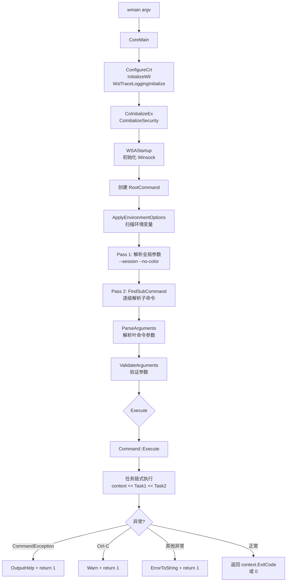
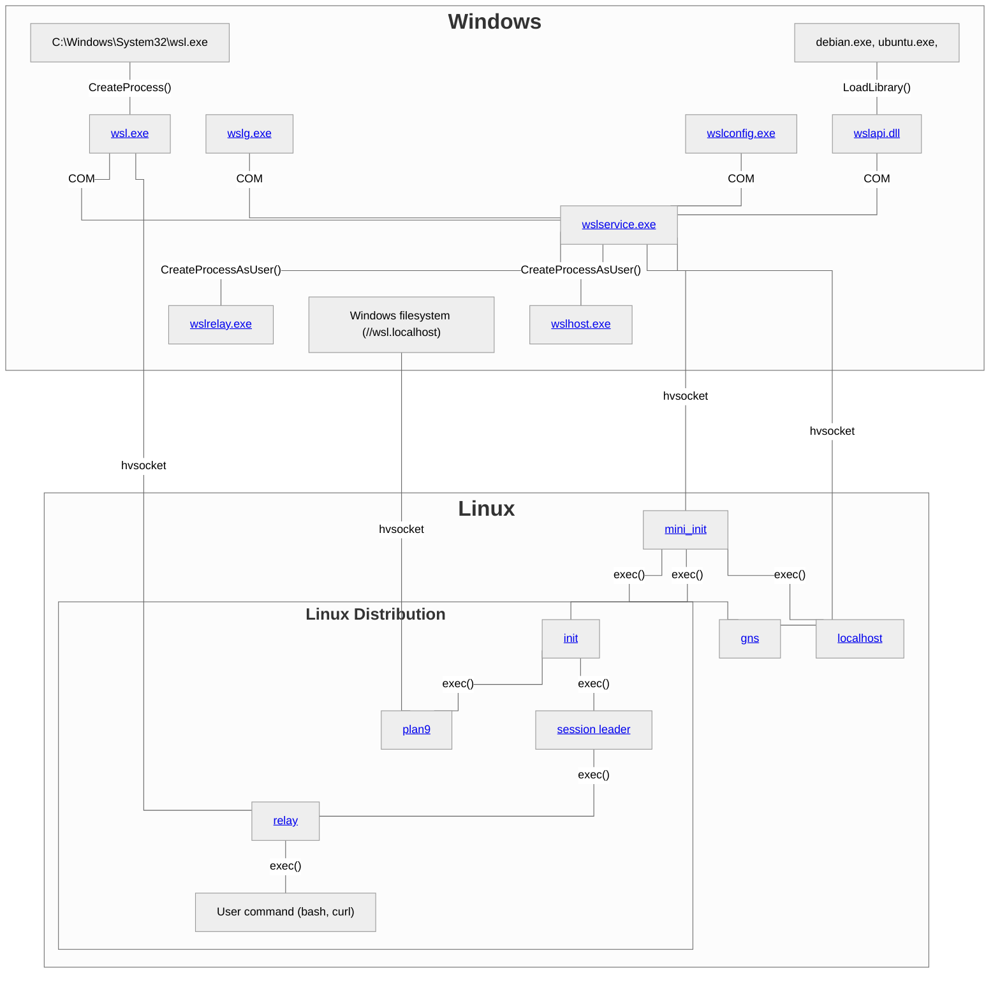

# WSL CLI 命令树与架构 Wiki 参考手册

> 基于 `external/WSL` 源码 + `doc/docs/` 官方文档深度核实
> 创建日期：2026-07-01
> 配套文档：[wsl-learning-plan.md](wsl-learning-plan.md)
> 核实方法：源码优先（`*Command.h` 的 `CommandName` 与别名构造函数）+ 官方文档交叉验证

---

## 一、关键认知修正（源码核实结果）

### 1.1 CLI 命令名误判修正

先前学习计划（[wsl-learning-plan.md §2.4.5](wsl-learning-plan.md)）中写道：

> **注意：官方 CLI 用 `ls` 而非 `list`**
> **注意：官方 CLI 用 `ps` 而非 `list`**

**源码核实结论：以上论断部分错误。** 真相如下（源自 `src/windows/wslc/commands/*Command.h`）：

| 命令类 | `CommandName`（主名） | 别名 | 说明 |
|---|---|---|---|
| `ContainerListCommand` | `list` | `ls`, `ps` | **三种写法等价合法** |
| `ContainerRemoveCommand` | `remove` | `delete`, `rm` | **三种写法等价合法** |
| `ImageListCommand` | `list` | `ls` | 在 `image` 下用 `list`/`ls`；在 root 下用 `images` |
| `ImageRemoveCommand` | `remove` | `delete`, `rm` | 在 `image` 下用 `remove`/`delete`/`rm`；在 root 下用 `rmi` |
| `NetworkListCommand` | `list` | `ls` | — |
| `NetworkRemoveCommand` | `remove` | `delete`, `rm` | — |
| `VolumeListCommand` | `list` | `ls` | — |
| `VolumeRemoveCommand` | `remove` | `delete`, `rm` | — |
| `SessionListCommand` | `list` | 无别名 | **仅 `list` 合法** |

**源码锚点**（ContainerCommand.h:128-130）：
```cpp
// List Command
struct ContainerListCommand final : public Command
{
    constexpr static std::wstring_view CommandName = L"list";
    ContainerListCommand(const std::wstring& parent) : Command(CommandName, {L"ls", L"ps"}, parent)
    { }
};
```

**正确结论**：
- `list` 是所有 list 类命令的**主名**，`ls`/`ps` 是其别名
- `remove` 是所有 remove 类命令的**主名**，`delete`/`rm` 是其别名
- learn.microsoft.com 文档中使用 `ls`/`ps` 是**采用别名**，而非"官方唯一写法"
- 先前论断"CLI 用 `ls` 而非 `list`"是**对官方文档的过度解读**，源码证明 `list` 才是规范主名

### 1.2 root 级命令的名称冲突处理

`ImageListCommand` 和 `ImageRemoveCommand` 在直接挂载到 root 时会与 container 的同名命令冲突，源码通过 `RootCommandName` 机制处理（ImageCommand.h:51-70）：

| 命令 | 在 `image` 下 | 在 root 下 |
|---|---|---|
| `ImageListCommand` | `image list` / `image ls` | `images` |
| `ImageRemoveCommand` | `image remove` / `image delete` / `image rm` | `rmi` |

**源码锚点**（ImageCommand.h:54-70）：
```cpp
// When parented directly to the root, ImageListCommand uses a different name
// to avoid colliding with the container list command.
constexpr static std::wstring_view RootCommandName = L"images";
ImageListCommand(const std::wstring& parent, bool /*rootScoped*/) 
    : Command(RootCommandName, {}, parent) { }
```

### 1.3 RootCommand 注册的顶层命令

源自 `src/windows/wslc/commands/RootCommand.cpp:31-67`，root 下注册了 **9 个子命令组** + **17 个直接挂载的叶命令**：

**子命令组**（9 个）：
`container` / `image` / `network` / `registry` / `settings` / `system` / `volume` / `session`（注：session 在 SessionCommand.h 中定义，但未在 RootCommand 注册——需进一步核实）

**直接挂载的叶命令**（17 个，含别名命令）：
- `attach`（ContainerAttachCommand）
- `build`（ImageBuildCommand）
- `create`（ContainerCreateCommand）
- `exec`（ContainerExecCommand）
- `export`（ContainerExportCommand）
- `images`（ImageListCommand，root-scoped）
- `import`（ImageImportCommand）
- `inspect`（InspectCommand）
- `kill`（ContainerKillCommand）
- `list`（ContainerListCommand，root-scoped，注：实际未在 RootCommand 中注册 root-scoped 版本，仅 image 有）
- `load`（ImageLoadCommand）
- `login` / `logout`（RegistryLoginCommand / RegistryLogoutCommand）
- `logs`（ContainerLogsCommand）
- `pull`（ImagePullCommand）
- `push`（ImagePushCommand）
- `remove`（ContainerRemoveCommand）
- `rm`（ImageRemoveCommand，root-scoped 为 `rmi`）
- `run`（ContainerRunCommand）
- `save`（ImageSaveCommand）
- `start`（ContainerStartCommand）
- `stats`（ContainerStatsCommand）
- `stop`（ContainerStopCommand）
- `tag`（ImageTagCommand）
- `version`（VersionCommand）

> **注**：root 直接挂载的命令多为便捷别名（类 Docker 的 `docker pull` ≡ `docker image pull`）。

---

## 二、完整 CLI 命令树（源码核实版）

### 2.1 container 命令组

源自 `src/windows/wslc/commands/ContainerCommand.h` + `ContainerCommand.cpp:22-40`：

| 子命令 | 主名 | 别名 | 关键参数 | 源码文件 |
|---|---|---|---|---|
| Attach | `attach` | — | — | ContainerAttachCommand.cpp |
| Create | `create` | — | — | ContainerCreateCommand.cpp |
| Exec | `exec` | — | — | ContainerExecCommand.cpp |
| Export | `export` | — | — | ContainerExportCommand.cpp |
| Inspect | `inspect` | — | `object-id`（位置参数） | ContainerInspectCommand.cpp |
| Kill | `kill` | — | `container-id`, `force` | ContainerKillCommand.cpp |
| List | `list` | `ls`, `ps` | `all`/`a`, `filter`/`f`, `format`, `last`/`n`, `latest`/`l`, `no-trunc`, `quiet`/`q` | ContainerListCommand.cpp |
| Logs | `logs` | — | `follow`/`f`, `timestamps`/`t`, `since`, `until`, `tail` | ContainerLogsCommand.cpp |
| Prune | `prune` | — | — | ContainerPruneCommand.cpp |
| Remove | `remove` | `delete`, `rm` | `container-id`（位置参数，多值）, `force`/`f` | ContainerRemoveCommand.cpp |
| Run | `run` | — | 见 §2.5 | ContainerRunCommand.cpp |
| Start | `start` | — | — | ContainerStartCommand.cpp |
| Stats | `stats` | — | — | ContainerStatsCommand.cpp |
| Stop | `stop` | — | — | ContainerStopCommand.cpp |

### 2.2 image 命令组

源自 `src/windows/wslc/commands/ImageCommand.h`：

| 子命令 | 主名（image 下） | 别名 | root 下别名 | 源码文件 |
|---|---|---|---|---|
| Build | `build` | — | — | ImageBuildCommand.cpp |
| Import | `import` | — | — | ImageImportCommand.cpp |
| Inspect | `inspect` | — | — | ImageInspectCommand.cpp |
| List | `list` | `ls` | `images` | ImageListCommand.cpp |
| Load | `load` | — | — | ImageLoadCommand.cpp |
| Prune | `prune` | — | — | ImagePruneCommand.cpp |
| Pull | `pull` | — | — | ImagePullCommand.cpp |
| Push | `push` | — | — | ImagePushCommand.cpp |
| Remove | `remove` | `delete`, `rm` | `rmi` | ImageRemoveCommand.cpp |
| Save | `save` | — | — | ImageSaveCommand.cpp |
| Tag | `tag` | — | — | ImageTagCommand.cpp |

### 2.3 network 命令组

源自 `src/windows/wslc/commands/NetworkCommand.h`：

| 子命令 | 主名 | 别名 | 源码文件 |
|---|---|---|---|
| Create | `create` | — | NetworkCreateCommand.cpp |
| Inspect | `inspect` | — | NetworkInspectCommand.cpp |
| List | `list` | `ls` | NetworkListCommand.cpp |
| Prune | `prune` | — | NetworkPruneCommand.cpp |
| Remove | `remove` | `delete`, `rm` | NetworkRemoveCommand.cpp |

### 2.4 volume / session / registry 命令组

**volume**（VolumeCommand.h）：`create` / `inspect` / `list`（别名 `ls`）/ `prune` / `remove`（别名 `delete`, `rm`）

**session**（SessionCommand.h，注：未在 RootCommand 注册，可能通过 `--session` 全局参数访问）：
- `enter` / `list`（无别名）/ `run` / `shell` / `terminate`

**registry**：
- `login`（RegistryLoginCommand）/ `logout`（RegistryLogoutCommand）

### 2.5 container run 关键参数

源自 `src/windows/wslc/arguments/ArgumentDefinitions.h` X-Macro 定义（部分）：

| 参数名 | 短别名 | 类型 | 说明 |
|---|---|---|---|
| `--attach` | `-a` | Flag | 附加到 STDIN/STDOUT/STDERR |
| `--build-arg` | — | Value | 构建参数 |
| `--cpus` | — | Value | CPU 限制 |
| `--detach` | `-d` | Flag | 后台运行 |
| `--dns` | — | Value | DNS 服务器 |
| `--dns-option` | — | Value | DNS 选项 |
| `--dns-search` | — | Value | DNS 搜索域 |
| `--domainname` | — | Value | 容器 NIS 域名 |
| `--entrypoint` | — | Value | 覆盖镜像 ENTRYPOINT |
| `--env` | `-e` | Value | 环境变量 |
| `--env-file` | — | Value | 环境变量文件 |
| `--gpus` | — | Value | GPU 设备 |
| `--hostname` | `-h` | Value | 容器主机名 |
| `--interactive` | `-i` | Flag | 保持 STDIN 打开 |
| `--label` | `-l` | Value | 元数据标签 |
| `--memory` | `-m` | Value | 内存限制 |
| `--name` | — | Value | 容器名 |
| `--network` | — | Value | 网络连接 |
| `--network-alias` | — | Value | 网络别名 |
| `--publish` | `-p` | Value | 端口映射 `host:container` |
| `--publish-all` | `-P` | Flag | 自动映射所有端口 |
| `--rm` | — | Flag | 退出后自动删除 |
| `--tty`（推断） | `-t` | Flag | 分配伪终端 |

**全局参数**（RootCommand.h:80-92）：
| 参数 | 说明 |
|---|---|
| `--session` | 指定会话（`wslc --session foo image list`） |
| `--no-color` | 禁用彩色输出 |
| `--version` | 显示版本 |

---

## 三、CLI 架构四层模型

源自 `src/windows/wslc/` 目录结构分析：

```
src/windows/wslc/
├── core/               # 第 1 层：执行核心
│   ├── Main.cpp            # 程序入口（wmain → CoreMain）
│   ├── Command.{h,cpp}     # Command 基类
│   ├── Invocation.h        # 调用解析
│   ├── CLIExecutionContext.{h,cpp}  # 执行上下文
│   ├── EnvironmentOptions.{h,cpp}   # 环境变量选项
│   ├── OutputChannel.{h,cpp}        # 输出通道
│   ├── Reporter.{h,cpp}             # 输出报告器（Info/Warn/Error）
│   ├── TableOutput.h                # 表格输出
│   ├── AsyncExecution.h             # 异步执行
│   └── Exceptions.h                 # 异常定义
│
├── arguments/          # 第 2 层：参数定义与解析
│   ├── ArgumentDefinitions.h     # X-Macro 定义所有参数（单一真相源）
│   ├── Argument.{h,cpp}          # Argument 对象
│   ├── ArgumentParser.{h,cpp}    # 参数解析器（两遍解析）
│   ├── ArgumentValidation.{h,cpp} # 参数验证
│   └── ArgumentTypes.h           # ArgType 枚举（X-Macro 生成）
│
├── commands/           # 第 3 层：命令树
│   ├── RootCommand.{h,cpp}       # 根命令（注册所有子命令）
│   ├── ContainerCommand.{h,cpp}  # container 命令组
│   ├── ImageCommand.{h,cpp}      # image 命令组
│   ├── NetworkCommand.{h,cpp}    # network 命令组
│   ├── VolumeCommand.{h,cpp}     # volume 命令组
│   ├── SessionCommand.{h,cpp}    # session 命令组
│   ├── RegistryCommand.{h,cpp}   # registry 命令组
│   ├── SettingsCommand.{h,cpp}   # settings 命令
│   ├── SystemCommand.{h,cpp}     # system 命令
│   ├── InspectCommand.{h,cpp}    # inspect 命令
│   ├── VersionCommand.{h,cpp}    # version 命令
│   └── *Command.cpp              # 各叶命令实现
│
├── services/           # 第 4 层：业务服务
│   ├── ContainerService.{h,cpp}  # 容器操作（Run/Create/Start/Stop/Kill/Delete/List/Exec/Export/Inspect/Logs/Stats/Prune）
│   ├── ImageService.{h,cpp}      # 镜像操作
│   ├── NetworkService.{h,cpp}    # 网络操作
│   ├── VolumeService.{h,cpp}     # 卷操作
│   ├── SessionService.{h,cpp}    # 会话操作
│   ├── RegistryService.{h,cpp}   # 注册表操作
│   ├── ConsoleService.{h,cpp}    # 控制台服务
│   ├── *Model.h                  # 数据模型（ContainerModel/ImageModel/...）
│   ├── ICredentialStorage.{h,cpp} # 凭据存储接口
│   ├── FileCredStorage.{h,cpp}   # 文件凭据存储
│   ├── WinCredStorage.{h,cpp}    # Windows 凭据管理器存储
│   ├── ImageProgressCallback.{h,cpp} # 镜像进度回调
│   └── BuildImageCallback.{h,cpp}    # 构建镜像回调
│
└── tasks/              # 第 4 层补充：任务编排
    ├── Task.h                 # Task 基类
    ├── ContainerTasks.{h,cpp} # 容器任务（ResolveSession/GetContainers/ListContainers/...）
    ├── ImageTasks.{h,cpp}
    ├── NetworkTasks.{h,cpp}
    ├── VolumeTasks.{h,cpp}
    ├── SessionTasks.{h,cpp}
    ├── RegistryTasks.{h,cpp}
    └── InspectTasks.{h,cpp}
```

### 3.1 命令执行流程（源自 Main.cpp）



### 3.2 命令链式执行模式

源自 `ContainerListCommand.cpp:52-58`，wslc 采用**任务链式编排**模式：

```cpp
void ContainerListCommand::ExecuteInternal(CLIExecutionContext& context) const
{
    context
        << ResolveSession    // 任务 1：解析会话
        << GetContainers     // 任务 2：获取容器列表
        << ListContainers;   // 任务 3：输出容器列表
}
```

`context << Task` 重载了 `<<` 运算符，将多个 Task 串联执行，每个 Task 接收 context 并可能修改其状态。这种模式的优势：
- 声明式表达执行流程
- 每个 Task 单一职责，可独立测试
- 任务可复用（`ResolveSession` 被几乎所有容器命令使用）

### 3.3 ContainerService 服务接口

源自 `src/windows/wslc/services/ContainerService.h`：

```cpp
struct ContainerService
{
    static int Attach(models::Session& session, const std::string& id);
    static int Run(models::Session& session, const std::string& image, models::ContainerOptions options);
    static models::CreateContainerResult Create(models::Session& session, const std::string& image, models::ContainerOptions options);
    static int Start(models::Session& session, const std::string& id, bool attach = false);
    static void Stop(models::Session& session, const std::string& id, models::StopContainerOptions options);
    static void Kill(models::Session& session, const std::string& id, WSLCSignal signal = WSLCSignalSIGKILL);
    static void Delete(models::Session& session, const std::string& id, bool force);
    static std::vector<models::ContainerInformation> List(
        models::Session& session, bool all = false, int limit = -1,
        const std::vector<std::pair<std::string, std::string>>& filters = {});
    static int Exec(models::Session& session, const std::string& id, models::ContainerOptions options);
    static void Export(models::Session& session, const std::string& id, const std::wstring& outputPath);
    static wsl::windows::common::wslc_schema::InspectContainer Inspect(models::Session& session, const std::string& id);
    static void Logs(models::Session& session, const std::string& id, bool follow, bool timestamps,
                     ULONGLONG since, ULONGLONG until, ULONGLONG tail = 0);
    static wsl::windows::common::docker_schema::ContainerStats Stats(models::Session& session, const std::string& id);
    static models::PruneContainersResult Prune(models::Session& session);
};
```

**设计要点**：
- 所有方法均为 `static`，无状态，纯函数式服务
- 第一个参数始终是 `models::Session&`，体现"会话优先"设计
- 使用 `models::ContainerOptions` 封装复杂配置，避免长参数列表
- 返回值分两类：`int`（退出码）/ `models::XxxResult`（结构化结果）

---

## 四、官方架构图（Mermaid 源图）

源自 `doc/docs/technical-documentation/index.md`，这是 wsl.dev 首页架构图的**原始 Mermaid 源码**：



**架构图关键洞察**（与先前学习计划的对照）：

| 要素 | 官方架构图证实 | 先前学习计划状态 |
|---|---|---|
| mini_init 是 VM 顶层进程 | ✅ `mini_init---|"exec()"|gns/init/localhost` | ✅ 已记录 |
| mini_init 通过 hvsocket 连接 wslservice | ✅ `wslservice.exe -----|hvsocket| mini_init` | ✅ 已记录 |
| gns 独立 hvsocket 通道 | ✅ `wslservice.exe -----|hvsocket| gns` | ✅ 已记录 |
| plan9 通过 hvsocket 连接 Windows 文件系统 | ✅ `fs---|hvsocket|plan9` | ✅ 已记录 |
| **wsl.exe 直接通过 hvsocket 连接 relay** | ✅ `wsl.exe---|hvsocket|relay` | ❌ **先前未记录** |
| localhost 进程由 mini_init exec | ✅ `mini_init---|"exec()"|localhost` | ❌ **先前未记录** |
| wslservice 通过 CreateProcessAsUser 启动 wslrelay/wslhost | ✅ 两条边 | ❌ **先前未记录** |

**新增认知**：`wsl.exe` 不仅通过 COM 连接 wslservice，还**直接通过 hvsocket 连接 relay**（用于进程 IO 中继，绕过 wslservice 提升性能）。这是先前学习计划遗漏的关键通信路径。

---

## 五、补充技术细节

### 5.1 wslservice.exe COM 接口

源自 `doc/docs/technical-documentation/wslservice.exe.md`：

- **服务性质**：Session 0 服务，以 SYSTEM 身份运行
- **COM 接口**：`ILxssUserSession`，定义在 `src/windows/service/inc/wslservice.idl`
- **工厂模式**：`LxssUserSessionFactory`（`src/windows/service/LxssUserSessionFactory.cpp`）创建 `LxssUserSession`（`src/windows/service/LxssUserSession.cpp`）
- **每用户单例**：同一 Windows 用户的多次 `CoCreateInstance()` 返回同一实例
- **关键方法**：
  - `CreateInstance()`：启动 WSL 分发版
  - `CreateLxProcess()`：在分发版内启动进程
  - `RegisterDistribution()`：注册新分发版
  - `Shutdown()`：终止所有分发版
- **VM 管理逻辑**：`src/windows/service/WslCoreVm.cpp`
- **分发版实例**：`WslCoreInstance`（`src/windows/service/WslCoreInstance.cpp`），每个运行中的分发版一个实例，维护与 init 的 hvsocket 连接

### 5.2 interop binfmt 机制（Windows 进程从 Linux 启动）

源自 `doc/docs/technical-documentation/interop.md`：

**两层配置**：
1. 注册表 `HKLM\SYSTEM\CurrentControlSet\Services\LxssManager\DistributionFlags`（全局，最低位 0 禁用 interop）
2. `/etc/wsl.conf` 的 `[interop]` 段（单分发版）

**binfmt 注册机制**：
- WSL 写入 `/proc/sys/fs/binfmt_misc`，创建 `WSLInterop` 条目，指向 `/init`
- WSL1：由每个分发版的 `init` 注册
- WSL2：由 `mini_init` 在 VM 层级注册

**`/init` 的多路分发**（关键）：
> `/init` 可执行文件是多个 WSL 进程的入口点（init / plan9 / localhost 等）。它通过检查 `argv[0]` 决定运行哪种逻辑。对于 interop，如果 `argv[0]` 不匹配任何已知入口点，`/init` 运行 Windows 进程创建逻辑。

**interop server 架构**：
- 每个 `session leader` 和每个 `init` 实例关联一个 interop server
- interop server 通过 unix socket 服务于 `/run/WSL`
- `/init` 使用 `$WSL_INTEROP` 环境变量确定连接哪个 server
- 若变量未设置，`/init` 尝试 `/run/WSL/${pid}_interop`，失败则向上递归到父 PID，直到 init

**消息类型**：
- WSL1：`LxInitMessageCreateProcess`
- WSL2：`LxInitMessageCreateProcessUtilityVm`

**源码锚点**：`WslEntryPoint()` in `src/linux/init.cpp` + `src/linux/init/binfmt.cpp`

### 5.3 systemd 启动流程

源自 `doc/docs/technical-documentation/systemd.md`：

**启用方式**：`/etc/wsl.conf` 添加 `[boot] systemd=true`

**启动流程**（关键差异）：
1. 正常情况：`init` 是 PID 1
2. 启用 systemd 后：init **fork()**，在**父进程**启动 systemd（`/sbin/init`），在**子进程**继续 WSL 配置
   - 原因：systemd 要求必须是 PID 1
3. init 等待 systemd 就绪：轮询 `systemctl is-system-running` 直到返回 `running` 或 `degraded`
4. 超时后即使 systemd 未就绪也继续启动

**用户会话同步**：
- 启用 systemd 后，WSL 尝试与 systemd 用户会话同步
- 通过 `login -f <user>` 启动关联的 systemd 用户会话

**systemd 配置保护**：
- WSL 在 `/run` 下创建多个 systemd 配置文件，用于：
  - 保护 WSL 的 `binfmt interpreter` 不被 `systemd-binfmt.service` 删除
  - 保护 X11 socket 不被 `systemd-tmpfiles-setup.service` 删除

### 5.4 hvsocket 通道完整拓扑（源码+文档汇总）

综合 `doc/docs/technical-documentation/index.md` 架构图与各组件文档：

| 通道 | Windows 端 | Linux 端 | 用途 | 文档来源 |
|---|---|---|---|---|
| ① | wslservice.exe | mini_init | 命令与通知 | wslservice.exe.md + mini_init.md |
| ② | wslservice.exe | gns | 网络配置（IP/路由/DNS/MTU） | index.md 架构图 |
| ③ | wslservice.exe（Windows 文件系统） | plan9 | 文件服务（`\\wsl.localhost`） | index.md 架构图 |
| ④ | **wsl.exe** | **relay** | **进程 IO 中继（stdin/stdout/stderr）** | index.md 架构图（新增） |
| ⑤ | wslservice.exe | WslCoreInstance→init | 分发版管理（启动进程/通知退出/挂载 drvfs/停止） | wslservice.exe.md |

**关键发现**：通道 ④ 先前学习计划完全遗漏。`wsl.exe` 直接通过 hvsocket 连接 relay，绕过 wslservice 进行进程 IO 中继——这是性能优化设计，避免每个字符的 IO 都经过服务中转。

---

## 六、C API 完整清单（源码核实版）

源自 `doc/docs/api-reference/c/` 目录结构（已在 `external/WSL/doc/docs/api-reference/c/` 确认存在完整文档）：

### 6.1 文档结构

```
doc/docs/api-reference/c/
├── callback-types/        # 5 个回调类型
│   ├── wslccontainerimageprogresscallback.md
│   ├── wslcinstallcallback.md
│   ├── wslcprocessexitcallback.md
│   ├── wslcsessioncrashdumpcallback.md
│   └── wslcstdiocallback.md
├── container-apis/        # 17 个容器 API
├── enumerations/          # 15 个枚举
├── image-apis/            # 9 个镜像 API
├── install-and-version-apis/  # 3 个安装与版本 API
├── process-apis/          # 12 个进程 API
├── session-apis/          # 14 个会话 API
├── storage-apis/          # 2 个存储 API
├── structures/            # 19 个结构体
├── end-to-end-example.md  # 端到端示例
├── error-codes.md         # 错误码表
└── not-yet-implemented-apis.md  # 未实现 API
```

### 6.2 API 总数统计

| 分类 | 数量 | 文件数 |
|---|---|---|
| 回调类型 | 5 | 5 |
| 容器 API | 17 | 17 |
| 枚举 | 15 | 15 |
| 镜像 API | 9 | 9 |
| 安装与版本 API | 3 | 3 |
| 进程 API | 12 | 12 |
| 会话 API | 14 | 14 |
| 存储 API | 2 | 2 |
| 结构体 | 19 | 19 |
| **总计** | **96** | **96** |

> **修正先前认知**：先前学习计划中称"session-apis 与 container-apis 返回空模板"——这是 wsl.dev 在线版本的问题，**本地源码 `doc/docs/api-reference/c/` 下文档完整存在**。这说明 wsl.dev 的空模板是**在线发布未同步**，而非文档未撰写。

### 6.3 未实现 API

存在 `not-yet-implemented-apis.md` 文件，说明 WSLC SDK 有部分 API 已声明但未实现。学习时应参考此文件避免使用未实现的功能。

---

## 七、三源验证法第三次实证

### 7.1 三源对照结果

| 信息点 | 源码（src/） | 开发者文档（doc/docs/） | 用户文档（learn.microsoft.com） | 真相 |
|---|---|---|---|---|
| CLI `list` 是否主名 | ✅ `CommandName = L"list"` | 未明示 | 使用 `ls` 别名 | **源码为准：list 是主名** |
| `wsl.exe → relay` hvsocket 通道 | — | ✅ 架构图明示 | 未提及 | **文档为准：通道存在** |
| `images`/`rmi` root 别名 | ✅ `RootCommandName` 机制 | 未明示 | 未提及 | **源码为准：root 下用 images/rmi** |
| C API 完整清单 | — | ✅ 96 个 API 文档完整 | 仅示例 | **文档为准：API 已完整文档化** |
| interop binfmt 机制 | ✅ `src/linux/init/binfmt.cpp` | ✅ interop.md 详述 | 未提及 | **三源中两源印证** |
| systemd fork 启动 | ✅ `src/linux/init/init.cpp` | ✅ systemd.md 详述 | 未提及 | **三源中两源印证** |

### 7.2 第三次实证结论

本次任务是**三源三角验证法的第三次实证**（前两次见 [triangular-source-verification.md](../../../retrospective/patterns/methodology-patterns/retrospective-knowledge/triangular-source-verification.md)）：

1. **第一次实证**（Claude Tag 文章学习）：源码 + 微信公众号 + 官方博客
2. **第二次实证**（WSL 学习计划初版）：源码 + wsl.dev + learn.microsoft.com
3. **第三次实证**（本次 Wiki 补充）：**源码 + 本地 doc/docs + wsl.dev 在线版**

**本次新发现**：三源中**源码本地 doc/docs 与 wsl.dev 在线版存在同步延迟**——wsl.dev 部分页面为空模板，但本地 doc/docs 文档完整。这提示**三源验证应包括"本地源码附带文档"这一第四源**。

### 7.3 方法论升级建议

建议将三源验证法升级为**四源验证法**：

| 源 | 角色 | 优势 | 盲区 |
|---|---|---|---|
| 源码（src/） | 实现真相 | 最权威，无歧义 | 缺宏观叙事 |
| 本地文档（doc/docs/） | 开发者叙事 | 随源码版本同步 | 需构建才能在线发布 |
| 在线文档（wsl.dev） | 发布版叙事 | 可公开访问 | 可能滞后于源码 |
| 用户文档（learn.microsoft.com） | 使用场景 | 面向用户 | 简化内部机制 |

---

## 八、关键源码文件索引（扩展版）

在 [wsl-learning-plan.md §5.1](wsl-learning-plan.md) 基础上补充：

| 文件 | 作用 |
|---|---|
| `src/windows/wslc/core/Main.cpp` | CLI 程序入口（wmain → CoreMain） |
| `src/windows/wslc/core/Command.h` | Command 基类定义 |
| `src/windows/wslc/core/CLIExecutionContext.h` | 执行上下文（含任务链 `<<` 重载） |
| `src/windows/wslc/arguments/ArgumentDefinitions.h` | **X-Macro 参数定义单一真相源** |
| `src/windows/wslc/arguments/ArgumentParser.cpp` | 两遍解析器（全局参数 + 叶命令参数） |
| `src/windows/wslc/commands/RootCommand.cpp` | root 命令注册（9 子命令组 + 17 叶命令） |
| `src/windows/wslc/commands/ContainerCommand.h` | container 命令组声明（含别名定义） |
| `src/windows/wslc/commands/ImageCommand.h` | image 命令组声明（含 root-scoped 名称） |
| `src/windows/wslc/services/ContainerService.h` | 容器服务接口（13 个静态方法） |
| `src/windows/wslc/tasks/ContainerTasks.h` | 容器任务（ResolveSession/GetContainers/ListContainers） |
| `src/windows/service/inc/wslservice.idl` | wslservice COM 接口定义（ILxssUserSession） |
| `src/windows/service/WslCoreVm.cpp` | WSL2 虚拟机管理逻辑 |
| `src/windows/service/WslCoreInstance.cpp` | 分发版实例管理（含 drvfs 双命名空间切换） |
| `src/linux/init.cpp` | `/init` 多路分发入口（含 `WslEntryPoint()` interop 逻辑） |
| `src/linux/init/binfmt.cpp` | interop binfmt 注册与处理 |

---

## 九、学习路径更新建议

基于本次源码核实，建议在 [wsl-learning-plan.md §4.3](wsl-learning-plan.md) 的学习路径中增加：

### 第 2 周补充：CLI 源码走读

```
第 2 周 Day 5（补充）：走读 src/windows/wslc/
├─ 1. 阅读 Main.cpp 理解两遍解析流程
├─ 2. 阅读 ArgumentDefinitions.h X-Macro 理解参数单一真相源
├─ 3. 对照 *Command.h 核实每个命令的主名与别名
├─ 4. 阅读 ContainerService.h 理解服务层静态方法设计
└─ 5. 阅读 ContainerTasks.h 理解任务链式编排模式（context << Task）
```

### 第 3 周补充：架构图绘制

```
第 3 周 Day 5（补充）：绘制个人版架构图
├─ 1. 以 doc/docs/technical-documentation/index.md 的 Mermaid 源图为基准
├─ 2. 补充 5 条 hvsocket 通道（含 wsl.exe → relay）
├─ 3. 标注每条通道的用途与文档来源
└─ 4. 与 wsl-learning-plan.md §2.1 的架构图对照修正
```

---

## 十、Changelog

- **2026-07-01** v1.0：基于 `external/WSL` 源码（`src/windows/wslc/` + `doc/docs/`）深度核实创建。修正先前学习计划中关于 CLI 命令短形态的误判（list/remove 才是主名，ls/ps/rm/delete 是别名）。补充完整 CLI 命令树、参数定义、CLI 架构四层模型、官方架构 Mermaid 源图、interop binfmt 机制、systemd 启动流程、wslservice COM 接口、hvsocket 通道完整拓扑（含先前遗漏的 wsl.exe → relay 通道）。第三次实证三源验证法，并提出升级为四源验证法的建议。
