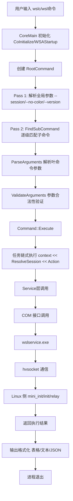

# CLI 完整命令参考

WSL 提供两套 CLI 工具：传统的 `wsl.exe`（发行版管理）和新的 `wslc.exe`（容器管理，preview阶段）。本章基于 WSL 源码核实，提供完整命令参考。

> **状态说明**：`wslc.exe` 容器 CLI 目前处于 **preview** 阶段，正式 GA 计划在 2026 年秋季。preview 期间可能有不兼容变更。

## 1. 关键认知修正（源码核实结论）

在开始命令参考之前，必须纠正一个常见误解：**`list`/`remove` 才是命令主名，`ls`/`ps`/`rm`/`delete` 是别名**。

经 WSL 源码（`src/windows/wslc/commands/*Command.h`）核实：

| 命令类 | 主名（CommandName） | 别名 | 说明 |
|--------|---------------------|------|------|
| ContainerListCommand | `list` | `ls`, `ps` | 三种写法等价合法 |
| ContainerRemoveCommand | `remove` | `delete`, `rm` | 三种写法等价合法 |
| ImageListCommand | `list` | `ls` | image子组下用`list`/`ls`；root下用`images` |
| ImageRemoveCommand | `remove` | `delete`, `rm` | image子组下用`remove`/`rm`；root下用`rmi` |
| NetworkListCommand | `list` | `ls` | — |
| NetworkRemoveCommand | `remove` | `delete`, `rm` | — |
| VolumeListCommand | `list` | `ls` | — |
| VolumeRemoveCommand | `remove` | `delete`, `rm` | — |
| SessionListCommand | `list` | 无别名 | **仅 `list` 合法** |

> **重要**：learn.microsoft.com 文档中使用 `ls`/`ps` 是采用别名，而非"官方唯一写法"。源码证明 `list` 才是规范主名。

### root 级命令名称冲突处理

`image list` 和 `image remove` 在直接挂载到 root 时会与 container 同名命令冲突，源码通过 `RootCommandName` 机制处理：

| 命令 | 在 `image` 子组下 | 在 root 下（便捷命令） |
|------|-------------------|----------------------|
| 列出镜像 | `wslc image list` / `wslc image ls` | `wslc images` |
| 删除镜像 | `wslc image remove` / `wslc image rm` | `wslc rmi` |

## 2. wsl.exe 命令参考（传统发行版管理）

`wsl.exe` 是用户最常用的入口，用于 WSL 发行版的安装、管理和运行。

| 命令 | 短选项 | 用途 |
|------|--------|------|
| `--install` | — | 安装 WSL 可选组件和默认发行版 |
| `--update` | — | 更新 WSL 组件 |
| `--unregister <Distro>` | — | 注销并删除指定发行版 |
| `--list` | `-l` | 列出已安装的发行版 |
| `--list --verbose` | `-l -v` | 列出详细信息（状态、版本） |
| `--list --running` | — | 仅列出正在运行的发行版 |
| `--list --online` | `-l -o` | 列出可在线安装的发行版 |
| `--set-default <Distro>` | `-s <Distro>` | 设置默认发行版 |
| `--set-default-version <Version>` | — | 设置新发行版的默认 WSL 版本（1或2） |
| `--set-version <Distro> <Version>` | — | 转换指定发行版的 WSL 版本 |
| `--shutdown` | — | 立即终止所有运行的发行版和 WSL 虚拟机 |
| `--terminate <Distro>` | `-t <Distro>` | 终止指定发行版 |
| `--mount <Disk>` | — | 在 WSL 2 中挂载物理或虚拟磁盘 |
| `--unmount` | — | 卸载磁盘 |
| `--export <Distro> <FileName>` | — | 将发行版导出为 tar 文件 |
| `--import <Distro> <InstallLocation> <FileName>` | — | 导入 tar 文件为新发行版 |
| `--status` | — | 显示 WSL 状态（默认版本、内核版本等） |
| `--version` | `-v` | 显示 WSL 版本信息 |
| `--exec <Command>` | `-e <Command>` | 执行指定命令，不使用默认 Shell |
| `--distribution <Distro>` | `-d <Distro>` | 指定运行的发行版 |
| `--user <UserName>` | `-u <UserName>` | 以指定用户运行 |
| `--cd <Directory>` | — | 设置工作目录 |
| `--manage <Distro>` | — | 管理发行版的高级选项 |
| `--debug-shell` | — | 进入 WSL 2 调试 Shell（根命名空间） |

### 常用 wsl.exe 示例

```powershell
# 列出所有发行版（详细模式）
wsl -l -v

# 运行指定发行版的指定用户
wsl -d Ubuntu-24.04 -u root

# 在 WSL 中执行单个命令
wsl ls -la /home

# 关闭所有 WSL 实例（用于重启）
wsl --shutdown

# 查看 WSL 版本和状态
wsl --version
wsl --status
```

## 3. wslc.exe 容器 CLI 命令树（preview）

`wslc.exe` 是 WSL 新增的类 Docker 容器管理 CLI，用于操作 OCI 容器。

### 3.1 子命令组概览

wslc 包含 9 个子命令组：

| 子命令组 | 功能 |
|---------|------|
| `container` | 容器生命周期管理（run/start/stop/exec/...） |
| `image` | 镜像管理（pull/push/build/...） |
| `network` | 网络管理 |
| `volume` | 数据卷管理 |
| `session` | 会话管理 |
| `registry` | 镜像仓库登录/登出 |
| `settings` | 设置管理 |
| `system` | 系统管理 |
| `version` | 版本信息 |

### 3.2 container 子命令组

| 子命令 | 主名 | 别名 | 关键参数 |
|--------|------|------|---------|
| 附加到运行中容器 | `attach` | — | — |
| 创建容器 | `create` | — | 同 run 参数（不启动） |
| 在容器中执行命令 | `exec` | — | `-it` 交互模式 |
| 导出容器 | `export` | — | 容器ID、输出路径 |
| 查看容器详情 | `inspect` | — | object-id（位置参数） |
| 强制终止容器 | `kill` | — | 容器ID、`--force` |
| 列出容器 | `list` | `ls`, `ps` | `-a/--all`、`-f/--filter`、`-q/--quiet` |
| 查看容器日志 | `logs` | — | `-f/--follow`、`-t/--timestamps`、`--tail` |
| 清理停止的容器 | `prune` | — | — |
| 删除容器 | `remove` | `delete`, `rm` | 容器ID（多值）、`-f/--force` |
| 创建并启动容器 | `run` | — | 见 §5 关键参数表 |
| 启动已停止容器 | `start` | — | — |
| 容器资源统计 | `stats` | — | 实时资源使用 |
| 停止运行中容器 | `stop` | — | 容器ID |

### 3.3 image 子命令组

| 子命令 | 主名（image下） | 别名 | root 下便捷命令 |
|--------|----------------|------|----------------|
| 构建镜像 | `build` | — | `wslc build` |
| 导入镜像 | `import` | — | `wslc import` |
| 查看镜像详情 | `inspect` | — | `wslc inspect` |
| 列出镜像 | `list` | `ls` | `wslc images` |
| 从文件加载镜像 | `load` | — | `wslc load` |
| 清理未使用镜像 | `prune` | — | — |
| 拉取镜像 | `pull` | — | `wslc pull` |
| 推送镜像 | `push` | — | `wslc push` |
| 删除镜像 | `remove` | `delete`, `rm` | `wslc rmi` |
| 保存镜像到文件 | `save` | — | `wslc save` |
| 给镜像打标签 | `tag` | — | `wslc tag` |

### 3.4 其他子命令组简要说明

- **network**：`create` / `inspect` / `list`（别名 `ls`）/ `prune` / `remove`（别名 `delete`, `rm`）
- **volume**：`create` / `inspect` / `list`（别名 `ls`）/ `prune` / `remove`（别名 `delete`, `rm`）
- **session**：`enter` / `list`（无别名）/ `run` / `shell` / `terminate`
- **registry**：`login` / `logout`
- **settings** / **system**：系统配置和管理
- **version**：显示版本信息

### 3.5 root 级便捷命令

为方便使用，常用叶命令直接挂载到 root（类似 Docker 习惯）：
`attach` / `build` / `create` / `exec` / `export` / `images` / `import` / `inspect` / `kill` / `load` / `login` / `logout` / `logs` / `pull` / `push` / `remove` / `rmi` / `run` / `save` / `start` / `stats` / `stop` / `tag` / `version`

## 4. CLI 架构四层模型

wslc 采用清晰的四层架构设计：

```
src/windows/wslc/
├── core/          # 第1层：执行核心（入口、命令基类、上下文、异常）
├── arguments/     # 第2层：参数定义与解析（X-Macro单一真相源）
├── commands/      # 第3层：命令树（RootCommand + 各子命令组）
└── services/      # 第4层：业务服务（COM调用wslservice）
```

各层职责：
- **core层**：程序入口、Command基类、执行上下文、输出报告、异常处理
- **arguments层**：所有参数的X-Macro定义、两遍参数解析（全局参数→子命令参数）、参数验证
- **commands层**：RootCommand注册、子命令分发、任务链式编排（`context << Task1 << Task2`）
- **services层**：静态无状态服务方法，通过COM接口调用wslservice完成实际操作

### 命令执行流程



**任务链式执行模式**（源码示例）：

```cpp
void ContainerListCommand::ExecuteInternal(CLIExecutionContext& context) const
{
    context
        << ResolveSession
        << GetContainers
        << ListContainers;
}
```

每个 Task 单一职责、可复用、可独立测试，通过 `<<` 运算符串联执行。

## 5. container run 关键参数

`wslc container run` 是最常用的命令，以下是常用参数：

| 参数名 | 短别名 | 类型 | 说明 |
|--------|--------|------|------|
| `--name` | — | 值 | 指定容器名称 |
| `--rm` | — | 标志 | 容器退出后自动删除 |
| `--interactive` | `-i` | 标志 | 保持 STDIN 打开（交互模式） |
| `--tty` | `-t` | 标志 | 分配伪终端（通常与 -i 连用为 -it） |
| `--detach` | `-d` | 标志 | 后台运行容器 |
| `--cpus` | — | 值 | CPU 核数限制 |
| `--memory` | `-m` | 值 | 内存限制（如 512m、1g） |
| `--volume` | `-v` | 值 | 挂载数据卷（`host:container`） |
| `--publish` | `-p` | 值 | 端口映射（`hostPort:containerPort`） |
| `--env` | `-e` | 值 | 设置环境变量 |
| `--env-file` | — | 值 | 从文件读取环境变量 |
| `--workdir` | `-w` | 值 | 设置工作目录 |
| `--entrypoint` | — | 值 | 覆盖镜像默认 ENTRYPOINT |
| `--network` | — | 值 | 指定网络连接 |
| `--hostname` | `-h` | 值 | 设置容器主机名 |
| `--gpus` | — | 值 | GPU 设备配置 |
| `--dns` | — | 值 | DNS 服务器 |
| `--label` | `-l` | 值 | 添加元数据标签 |

## 6. 使用示例

### 6.1 镜像操作

```bash
# 拉取镜像
wslc pull docker.io/library/ubuntu:24.04
wslc pull docker.io/library/nginx:latest

# 列出镜像（四种等价写法）
wslc image list
wslc image ls
wslc images

# 删除镜像
wslc image rm ubuntu:24.04
wslc rmi ubuntu:24.04
```

### 6.2 容器基本操作

```bash
# 运行交互式容器（退出后自动删除）
wslc run --rm -it ubuntu:24.04 /bin/bash

# 后台运行 Nginx 并映射端口
wslc run -it --rm -d -p 8080:80 --name web nginx

# 查看容器列表（三种等价写法）
wslc container list
wslc container ls
wslc container ps
wslc container list -a    # 包含停止的容器

# 在运行中的容器内执行命令
wslc container exec web ls -la /usr/share/nginx/html

# 查看容器日志
wslc container logs -f web

# 停止并删除容器
wslc container stop web
wslc container rm web
```

### 6.3 资源限制示例

```bash
# 限制 2 CPU、1GB 内存
wslc run -it --rm --cpus 2 --memory 1g ubuntu:24.04

# 挂载数据卷
wslc run -it --rm -v C:\my-data:/data ubuntu:24.04 ls /data

# 环境变量
wslc run -it --rm -e MY_VAR=hello ubuntu:24.04 bash -c 'echo $MY_VAR'
```

### 6.4 全局参数

```bash
# 指定会话
wslc --session mysession image list

# 禁用彩色输出
wslc --no-color container ls

# 查看版本
wslc --version
```

---

本章涵盖了 WSL 两套 CLI 的完整参考。下一章我们将深入探讨 WSL 的核心架构与进程模型。

---

← [上一章：快速开始](02-quickstart.md) | [返回目录](README.md) | [下一章：核心架构与进程模型](04-architecture.md) →
