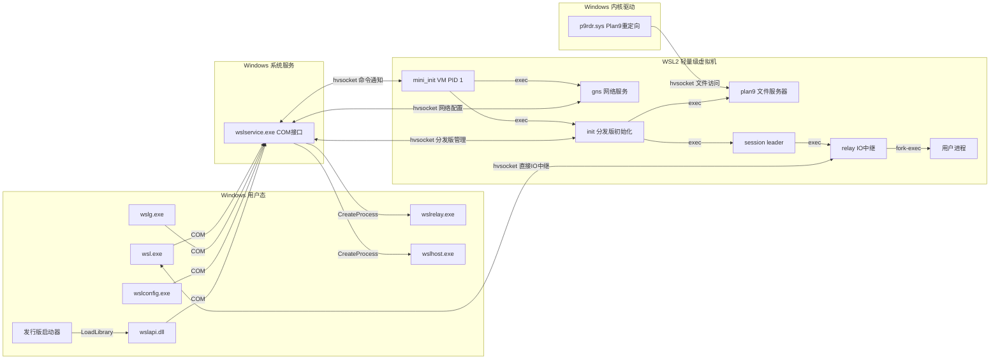
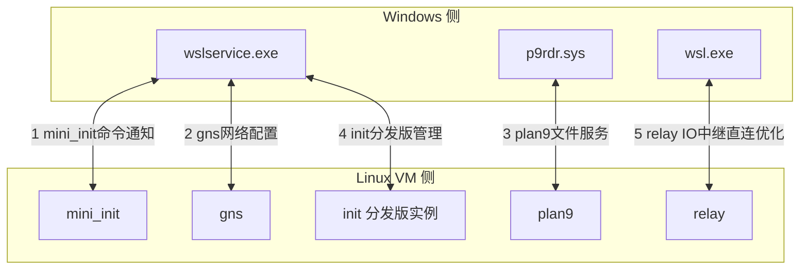

# 核心架构与进程模型

## 1. WSL2 三层架构概览

WSL2 采用经典的三层虚拟化架构：

| 层级 | 组件 | 运行环境 | 职责 |
|---|---|---|---|
| **L1 用户态** | wsl.exe、wslservice.exe 等 | Windows 用户态 | CLI 入口、服务管理、API 封装 |
| **L2 内核态（虚拟化）** | Windows Hypervisor 虚拟化层 | Windows 内核 | 轻量级虚拟机管理、hvsocket 通信 |
| **L3 Linux 内核** | Linux 内核 + mini_init/init 等进程 | WSL2 轻量级 VM | Linux 系统调用兼容、分发版运行时 |

---

## 2. Windows 侧组件

| 组件 | 类型 | 职责 |
|---|---|---|
| `wsl.exe` | CLI 入口 | 用户命令行接口，通过 COM 调用 wslservice，直接通过 hvsocket 连接 relay 进行 IO 中继 |
| `wslservice.exe` | 系统服务 | 核心服务（Session 0，SYSTEM 身份），COM 接口 `ILxssUserSession`，管理 VM 生命周期与分发版实例 |
| `wslg.exe` | GUI 支持 | Linux GUI 应用（X11/Wayland）的 Windows 侧代理 |
| `wslconfig.exe` | 配置工具 | 全局 WSL2 配置（`.wslconfig` 设置） |
| `wslrelay.exe` | IO 中继辅助 | wslservice 通过 `CreateProcessAsUser()` 启动，辅助 IO 中继 |
| `wslhost.exe` | WSLg 主机 | WSLg 主机侧进程 |
| `wslapi.dll` | API 库 | 公共 WSL API，供发行版启动器（ubuntu.exe 等）调用 |
| `p9rdr.sys` | 内核驱动 | Plan9 重定向驱动，注册 `\\wsl$` 和 `\\wsl.localhost` UNC 路径，实现 Windows 访问 Linux 文件系统 |

---

## 3. Linux 侧五大核心进程详解

| 进程名 | 职责 | 启动方式 | 源码位置 |
|---|---|---|---|
| **mini_init** | WSL2 VM 顶层进程（PID 1）：挂载 /proc/sys/dev、配置日志/tty、连接 wslservice 两条 hvsocket 通道（命令+通知）、启动 gns、维护 VM（内存回收/调试 shell/IO 同步/文件系统扩容/磁盘格式化） | 内核启动完成后执行 `/init` | `src/linux/init/mini_init` |
| **init** | 分发版初始化：每分发版独立 mount/pid/UTS namespace，挂载 /proc/sys/dev、配置 cgroups、注册 binfmt（interop）、解析 /etc/wsl.conf、启动 systemd（可选）、挂载 drvfs、配置 wslg；通过 `argv[0]` 多路分发（`/init` 或 `/mount.drvfs`） | mini_init 收到 `LxMiniInitMessageLaunchInit` 后启动 | `src/linux/init/init.cpp` |
| **plan9** | Plan9 文件服务器：通过 hvsocket 向 Windows 暴露分发版文件系统，支撑 `\\wsl$` 和 `\\wsl.localhost` 访问 | init 启动 | `src/linux/init/plan9.cpp` |
| **gns** | Guest Network Service：通过独立 hvsocket 通道接收 wslservice 网络配置（接口 IP、路由、DNS、MTU）；启用 DNS 隧道时响应 DNS 请求 | mini_init 启动 | `src/linux/init/GnsEngine.cpp` + `src/windows/service/exe/GnsChannel.cpp` |
| **relay** | IO 中继进程：创建多个 hvsocket 通道（stdin/stdout/stderr/终端尺寸/退出通知）；fork() 后**父进程**负责中继 IO，**子进程** exec() 用户程序 | session leader 收到 `LxInitMessageCreateProcessUtilityVm` 后创建 | 技术文档 relay.md |
| **session leader** | 会话首进程，负责创建用户进程上下文，是 relay 的父进程 | init 收到 `LxInitMessageCreateSession` 后创建 | 技术文档 session-leader.md |

---

## 4. 核心通信机制

### 4.1 COM（组件对象模型）

COM（Component Object Model，组件对象模型）是 Windows 原生进程间通信机制。WSL 中所有用户态工具（wsl.exe/wslg.exe/wslconfig.exe/wslapi.dll）都通过 COM 接口 `ILxssUserSession` 与 wslservice.exe 通信。

- **接口定义**：`src/windows/service/inc/wslservice.idl`
- **工厂模式**：`LxssUserSessionFactory` 创建 `LxssUserSession` 实例
- **每用户单例**：同一 Windows 用户多次 `CoCreateInstance()` 返回同一实例

### 4.2 hvsocket（虚拟机套接字）

hvsocket（Hyper-V Socket，虚拟机套接字）是 Windows Hypervisor 提供的跨 VM 套接字通信机制，是 Windows 侧与 Linux VM 侧的唯一通信通道。

### 4.3 Mermaid 图 1：WSL2 整体组件架构图

---

## 5. hvsocket 通道拓扑

WSL2 共使用 **5+ 条独立 hvsocket 通道**，每条通道有明确的端点和用途：

| 通道编号 | Windows 端点 | Linux 端点 | 方向 | 用途 |
|---|---|---|---|---|
| 1 | wslservice.exe | mini_init | 双向 | mini_init 命令通道：启动分发版、挂载磁盘、导入/导出、弹出 VHD |
| 2 | wslservice.exe | gns | 双向 | gns 网络通道：接口 IP、路由、DNS、MTU 配置，DNS 隧道 |
| 3 | p9rdr.sys（Windows 文件系统） | plan9 | Linux→Windows | plan9 文件通道：Windows 通过 `\\wsl.localhost` 访问 Linux 文件 |
| 4 | wslservice.exe | init（WslCoreInstance） | 双向 | init 命令通道：创建会话、创建进程、终止实例、重挂载 drvfs |
| 5 | **wsl.exe** | **relay** | 双向 | relay IO 通道：stdin/stdout/stderr/终端尺寸/退出通知（**性能优化：绕过 wslservice 直接中继**） |

> **关键发现**：通道 5 是 wsl.exe → relay 的**直接 IO 中继通道**，先前学习计划遗漏。此设计避免每个字符 IO 都经过 wslservice 中转，是 WSL2 交互性能高的关键。

### Mermaid 图 2：hvsocket 5+ 通道拓扑图

---

## 6. 关键消息列表

### 6.1 mini_init 命令通道关键消息（wslservice → mini_init）

| 消息 | 用途 | 定义位置 |
|---|---|---|
| `LxMiniInitMessageLaunchInit` | 挂载 VHD + 启动新分发版 | `src/shared/inc/lxinitshared.h` |
| `LxMiniInitMessageMount` | 挂载磁盘到 `/mnt/wsl`（`wsl --mount`） | `src/shared/inc/lxinitshared.h` |
| `LxMiniInitMessageImport` | 导入分发版 | `src/shared/inc/lxinitshared.h` |
| `LxMiniInitMessageExport` | 导出分发版 | `src/shared/inc/lxinitshared.h` |
| `EJECT_VHD_MESSAGE` | 弹出磁盘 | `src/shared/inc/lxinitshared.h` |

### 6.2 init 命令通道关键消息（wslservice → init）

| 消息 | 用途 | 定义位置 |
|---|---|---|
| `LxInitMessageInitialize` | 配置分发版 | `src/shared/inc/lxinitshared.h` |
| `LxInitMessageCreateSession` | 创建 session leader | `src/shared/inc/lxinitshared.h` |
| `LxInitMessageTerminateInstance` | 终止分发版 | `src/shared/inc/lxinitshared.h` |
| `LxInitMessageRemountDrvfs` | 动态切换 drvfs 命名空间（提权/非提权） | `src/shared/inc/lxinitshared.h` |
| `LxInitMessageCreateProcessUtilityVm` | 创建用户进程（通过 relay） | `src/shared/inc/lxinitshared.h` |

---

## 7. 源码文件锚点

| 文件路径 | 作用 |
|---|---|
| `src/linux/init/mini_init/` | mini_init（VM 顶层进程）源码 |
| `src/linux/init/init.cpp` | 分发版 init 主入口（含 argv[0] 多路分发、systemd fork 启动） |
| `src/linux/init/plan9.cpp` | Plan9 文件服务器实现 |
| `src/linux/init/GnsEngine.cpp` | GNS 网络配置引擎（Linux 侧） |
| `src/linux/init/drvfs.cpp` | DrvFs 挂载实现 |
| `src/linux/init/binfmt.cpp` | interop binfmt 注册与处理 |
| `src/windows/service/exe/WslCoreInstance.cpp` | WslCoreInstance 分发版实例管理（含 drvfs 双命名空间切换） |
| `src/windows/service/exe/GnsChannel.cpp` | GNS 网络通道（Windows 侧） |
| `src/windows/service/WslCoreVm.cpp` | WSL2 虚拟机管理逻辑 |
| `src/windows/service/inc/wslservice.idl` | wslservice COM 接口（ILxssUserSession）定义 |

---

← [上一章：CLI 完整命令参考](03-cli-reference.md) | [返回目录](README.md) | [下一章：文件系统互操作](05-filesystem-interop.md) →
