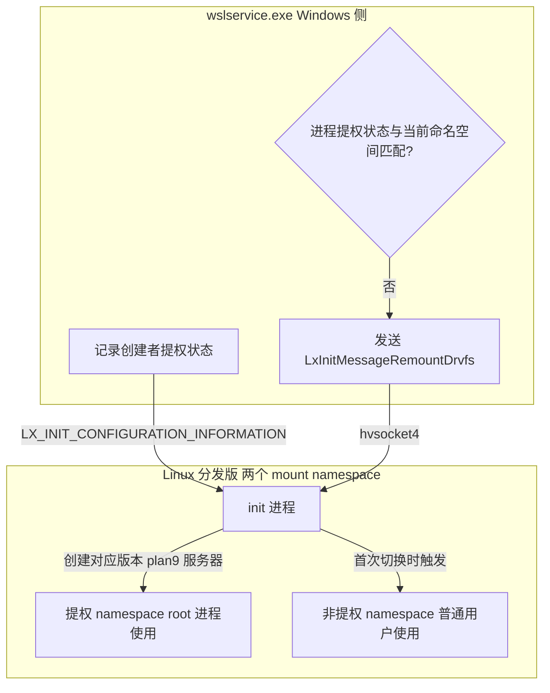

# 文件系统互操作

## 1. 概述

WSL2 实现了 Windows 与 Linux 文件系统的双向互操作，通过两套独立的机制支撑跨系统文件访问：

| 方向 | 访问方式 | 底层文件系统 | 性能 |
|---|---|---|---|
| **Windows → Linux** | UNC 路径 `\\wsl.localhost\<distro>\` | Plan9 文件协议 | 原生 Linux IO 性能（快） |
| **Linux → Windows** | DrvFs 挂载点 `/mnt/c`、`/mnt/d` | DrvFs / Plan9 / virtio-plan9 / virtiofs | 跨 VM 网络文件系统（较慢） |

**核心组件协作**：
- Windows 侧 `p9rdr.sys`（Plan9 重定向驱动）通过 hvsocket 连接 Linux 侧 plan9 服务器
- Linux 侧 `/init` 通过 `argv[0]` 多路分发，同时承担 init 进程、mount.drvfs 挂载器、interop 启动器等角色

---

## 2. Windows 访问 Linux 文件

### 2.1 UNC 路径访问

从 Windows 资源管理器、命令行或应用程序访问 Linux 文件系统，使用以下 UNC 路径：

| 路径格式 | 说明 | 兼容性 |
|---|---|---|
| `\\wsl.localhost\<distroname>\` | **推荐格式** | WSL2（Windows 10 1903+） |
| `\\wsl$\<distroname>\` | 旧格式 | WSL1/WSL2 兼容 |

```powershell
# PowerShell/CMD 中访问 Ubuntu 分发版文件
dir \\wsl.localhost\Ubuntu\home\

# 打开当前 WSL 目录
explorer.exe .
```

### 2.2 底层机制流程


**关键步骤**：
1. `p9rdr.sys` 在内核态注册 `\\wsl.localhost\` 和 `\\wsl$\` 两个 UNC 前缀
2. 路径首次访问时，驱动通过 COM 调用 wslservice.exe 请求启动对应分发版
3. wslservice 通过 hvsocket 1 通知 mini_init 启动分发版 init
4. init 启动 plan9 服务器（通过 hvsocket 3 暴露给 Windows）
5. p9rdr.sys 建立与 plan9 的 hvsocket 连接，后续文件请求直接通过此通道转发

### 2.3 性能建议与注意事项

✅ **推荐做法**：
- 频繁 IO 的代码项目文件放在 Linux 文件系统中（如 `~/projects/`）
- 从 Windows 访问使用 `\\wsl.localhost\<distro>\`，性能优于 `/mnt/c` 反向访问

❌ **禁止做法**：
- **不要通过 Windows 编辑器直接修改 Linux 文件系统中的文件**（如通过 `\\wsl$\` 用 VS Code/Notepad++ 保存）
- 可能导致：文件权限损坏、扩展属性丢失、文件锁定问题、inotify 事件丢失

> **正确做法**：在 Linux 中使用 `code .` 启动 VS Code Remote-WSL，通过 WSL 扩展编辑文件。

---

## 3. Linux 访问 Windows 文件

### 3.1 DrvFs 默认挂载

DrvFs 是 WSL 用于访问 Windows 驱动器的文件系统，默认自动挂载所有 Windows 驱动器到 `/mnt` 下：

```bash
# 查看已挂载的 Windows 驱动器
ls -la /mnt/
# 输出示例：c  d  e  wsl

# 访问 C 盘用户目录
cd /mnt/c/Users/
ls -la
```

### 3.2 手动挂载

除了自动挂载，也可以手动挂载 Windows 驱动器或网络共享：

```bash
# 创建挂载点
sudo mkdir -p /tmp/my-c-drive

# 手动挂载 C 盘
sudo mount -t drvfs C: /tmp/my-c-drive

# 挂载网络共享（SMB）
sudo mount -t drvfs '\\server\share' /mnt/share

# 卸载
sudo umount /tmp/my-c-drive
```

### 3.3 底层机制

DrvFs 挂载由 `/init` 通过 `argv[0]` 多路分发实现：

1. `/usr/sbin/mount.drvfs` 是一个符号链接，指向 `/init`
2. 当执行 `mount -t drvfs` 时，内核调用 mount.drvfs
3. `/init` 检查 `argv[0]`，发现是 `mount.drvfs` 后运行 `MountDrvfsEntry()`
4. `MountDrvfsEntry()` 通过 hvsocket 4 与 wslservice 通信，请求访问 Windows 文件系统

**源码位置**：`src/linux/init/drvfs.cpp`

### 3.4 文件系统类型选项

根据 `.wslconfig` 配置，DrvFs 可使用不同的底层协议：

| 协议 | 适用场景 | 性能 |
|---|---|---|
| `drvfs` | WSL1 原生 | - |
| `plan9` | WSL2 默认（9P 协议） | 标准 |
| `virtio-plan9` | virtio 加速 9P | 较好 |
| `virtiofs` | virtio-fs（最新） | 最好 |

配置示例（`%USERPROFILE%\.wslconfig`）：
```ini
[wsl2]
# 可选：drvfs/plan9/virtio-plan9/virtiofs
kernelCommandLine = "init=/init"
```

### 3.5 /etc/wsl.conf automount 配置

通过 `/etc/wsl.conf` 的 `[automount]` 段配置 DrvFs 自动挂载行为：

```ini
[automount]
enabled = true
root = /mnt/
options = "metadata,umask=22,fmask=11"
mountFsTab = true
```

| 选项 | 说明 | 默认值 |
|---|---|---|
| `enabled` | 是否自动挂载 Windows 驱动器 | `true` |
| `root` | 自动挂载根目录 | `/mnt/` |
| `options` | DrvFs 挂载选项（逗号分隔） | - |
| `mountFsTab` | 是否处理 `/etc/fstab` | `true` |

---

## 4. 提权/非提权双 Mount 命名空间

### 4.1 设计背景

WSL2 在分发版内区分两类 Linux 进程：
- **提权进程**：以 root 身份运行（或通过 sudo 提权）
- **非提权进程**：以普通用户身份运行

由于 Windows 安全模型的限制，两类进程访问 Windows 文件时需要不同的权限上下文。

### 4.2 双命名空间实现

WSL2 的解决方案是维护**两套独立的 mount namespace**，分别为提权和非提权进程提供不同的 Windows 文件访问视图：



### 4.3 工作流程

1. **分发版创建时**：wslservice 通过 `LX_INIT_CONFIGURATION_INFORMATION` 消息告知 init 创建者的提权状态
2. **初始挂载**：init 根据创建者状态挂载对应版本（提权/非提权）的 DrvFs
3. **首次切换**：当首次在**另一命名空间**创建进程时（如普通用户首次 sudo），wslservice 检测到状态不匹配
4. **重挂载触发**：wslservice 向 init 发送 `LxInitMessageRemountDrvfs` 消息
5. **双命名空间就绪**：init 挂载另一套命名空间，后续进程根据提权状态自动进入对应 namespace

**源码位置**：
- Windows 侧：`src/windows/service/exe/WslCoreInstance.cpp`
- Linux 侧：`src/linux/init/drvfs.cpp`

---

## 5. 文件权限映射

### 5.1 默认权限映射

Windows 文件系统（NTFS）不原生支持 Linux 权限模型，DrvFs 默认按以下规则映射：

- 文件所有者：当前 WSL 用户
- 默认权限：`755`（目录）/`644`（文件）
- 可通过 `umask`、`fmask`、`dmask` 挂载选项修改默认值

### 5.2 metadata 选项（推荐启用）

启用 `metadata` 挂载选项后，DrvFs 支持在 Windows 文件上存储 Linux 扩展属性，从而支持完整的 `chmod`、`chown` 操作：

```ini
# /etc/wsl.conf
[automount]
options = "metadata,umask=22,fmask=11"
```

启用后可以在 `/mnt/c` 下正常使用：
```bash
chmod 600 /mnt/c/Users/you/secret.txt
chown youruser:youruser /mnt/c/project/file.sh
```

### 5.3 大小写敏感

Windows 文件系统默认大小写不敏感，WSL 提供配置选项：

```ini
# /etc/wsl.conf
[automount]
options = "case=off"  # 或 on/force
```

| 值 | 说明 |
|---|---|
| `off` | 大小写不敏感（默认） |
| `on` | 大小写敏感（逐目录启用） |
| `force` | 所有挂载目录强制大小写敏感 |

---

## 6. 互操作命令执行（binfmt 机制）

### 6.1 直接运行 Windows 程序

WSL 允许在 Linux 终端中直接运行 Windows 可执行文件（`.exe`、`.bat`、`.cmd` 等）：

```bash
# 启动记事本
notepad.exe

# 用资源管理器打开当前目录
explorer.exe .

# 运行 Windows 命令
cmd.exe /c "dir C:\\"
powershell.exe -Command "Get-Process"

# 打开网址
start https://example.com
```

**路径自动转换**：
- WSL 自动将 Linux 路径转换为 Windows 路径（如 `/mnt/c/Users` → `C:\Users`）
- 当前工作目录自动映射
- Windows 进程的 stdin/stdout/stderr 连接到 Linux 终端

### 6.2 底层 binfmt_misc 机制

WSL 通过 Linux 内核的 `binfmt_misc` 机制实现 Windows PE 文件的识别和执行：


**关键细节**：
1. WSL（WSL2 由 mini_init，WSL1 由 init）在 `/proc/sys/fs/binfmt_misc/WSLInterop` 注册 PE 格式识别规则，解释器指向 `/init`
2. 当执行 PE 文件时，内核调用 `/init`
3. `/init` 检查 `argv[0]` 不匹配 init/plan9/mount.drvfs 等已知入口，进入 interop 逻辑
4. `/init` 通过 `$WSL_INTEROP` 环境变量定位 unix socket（默认 `/run/WSL/<pid>_interop`），向上递归查找直到 init
5. 每个 session leader 和每个 init 实例关联一个 interop server，通过 hvsocket 4 转发请求到 wslservice
6. wslservice 在 Windows 侧创建进程，通过 hvsocket 中继 IO

### 6.3 wsl.conf interop 配置

```ini
# /etc/wsl.conf
[interop]
enabled = true
appendWindowsPath = true
```

| 选项 | 说明 | 默认值 |
|---|---|---|
| `enabled` | 是否启用 interop（禁止后无法运行 .exe） | `true` |
| `appendWindowsPath` | 是否将 Windows PATH 追加到 Linux $PATH | `true` |

**禁用 Windows PATH 污染**：设置 `appendWindowsPath = false` 可避免 Linux 中出现大量 Windows 命令，适合需要纯净 Linux 环境的场景。

---

## 7. 性能优化建议

| 场景 | 推荐做法 | 原因 |
|---|---|---|
| **代码开发/编译** | 项目放在 Linux 文件系统 `~/projects/` | 原生 ext4 性能，避免跨 VM IO 开销 |
| **从 Windows 访问 Linux 文件** | 使用 `\\wsl.localhost\<distro>\` | Plan9 协议性能优于 DrvFs 反向访问 |
| **大文件读写** | 放在同系统内操作 | 跨文件系统有网络协议开销 |
| **Git 仓库** | 放在 Linux 文件系统 | 权限/符号链接/大小写敏感完整支持 |
| **Docker/容器** | 使用 WSL2 后端 + Linux 文件系统 | 容器原生性能最佳 |

**性能对比参考**：
- Linux 文件系统内操作：原生速度（基准 100%）
- `\\wsl.localhost\` 从 Windows 访问：约 60-80% 原生速度
- `/mnt/c/` 从 Linux 访问：约 20-40% 原生速度（小文件 IO 更慢）

---

## 8. 常见问题

### Q1: /mnt/c 下文件权限不正确，chmod 不生效？

**原因**：默认未启用 metadata 选项，DrvFs 使用固定权限映射。

**解决方案**：在 `/etc/wsl.conf` 添加 `options = "metadata"`，然后 `wsl --shutdown` 重启分发版。

### Q2: 文件名大小写问题，无法区分 File.txt 和 file.txt？

**原因**：Windows 默认大小写不敏感。

**解决方案**：在 `/etc/wsl.conf` 设置 `options = "case=force"`，或用 `fsutil.exe file setCaseSensitiveInfo <目录> enable` 逐目录启用。

### Q3: /mnt/c 访问速度极慢，npm/git 操作卡顿？

**原因**：跨 VM DrvFs 开销大，小文件 IO 性能差。

**解决方案**：将项目迁移到 Linux 文件系统（`~/projects/`），从 Windows 通过 `\\wsl.localhost\` 访问。

### Q4: Linux 中运行 .exe 提示 "command not found"？

**原因**：interop 被禁用，或 Windows PATH 未追加。

**检查**：
1. 确认 `/etc/wsl.conf` 中 `[interop] enabled = true`
2. 确认 `appendWindowsPath = true`，或使用绝对路径（如 `/mnt/c/Windows/System32/notepad.exe`）
3. 重启分发版：`wsl --shutdown`

### Q5: Windows 编辑器修改 Linux 文件后权限损坏？

**原因**：通过 `\\wsl$\` 直接编辑不保留 Linux 扩展属性。

**解决方案**：使用 VS Code Remote-WSL（在 Linux 中运行 `code .`），它通过 WSL 扩展正确处理文件元数据。

---

## 9. 源码文件锚点

| 文件路径 | 作用 |
|---|---|
| `src/linux/init/plan9.cpp` | Plan9 文件服务器实现（支撑 `\\wsl.localhost`） |
| `src/linux/init/drvfs.cpp` | DrvFs 挂载实现（含双命名空间切换） |
| `src/linux/init/binfmt.cpp` | interop binfmt 注册与 Windows 进程启动 |
| `src/linux/init/init.cpp` | `/init` 多路分发入口（argv[0] 检测） |
| `src/windows/service/exe/WslCoreInstance.cpp` | WslCoreInstance（分发版实例，含 RemountDrvfs 逻辑） |
| `src/windows/driver/p9rdr/` | p9rdr.sys Plan9 重定向驱动（Windows 内核） |

---

← [上一章：核心架构与进程模型](04-architecture.md) | [返回目录](README.md) | [下一章：WSL Container API](06-wslc-api.md) →
