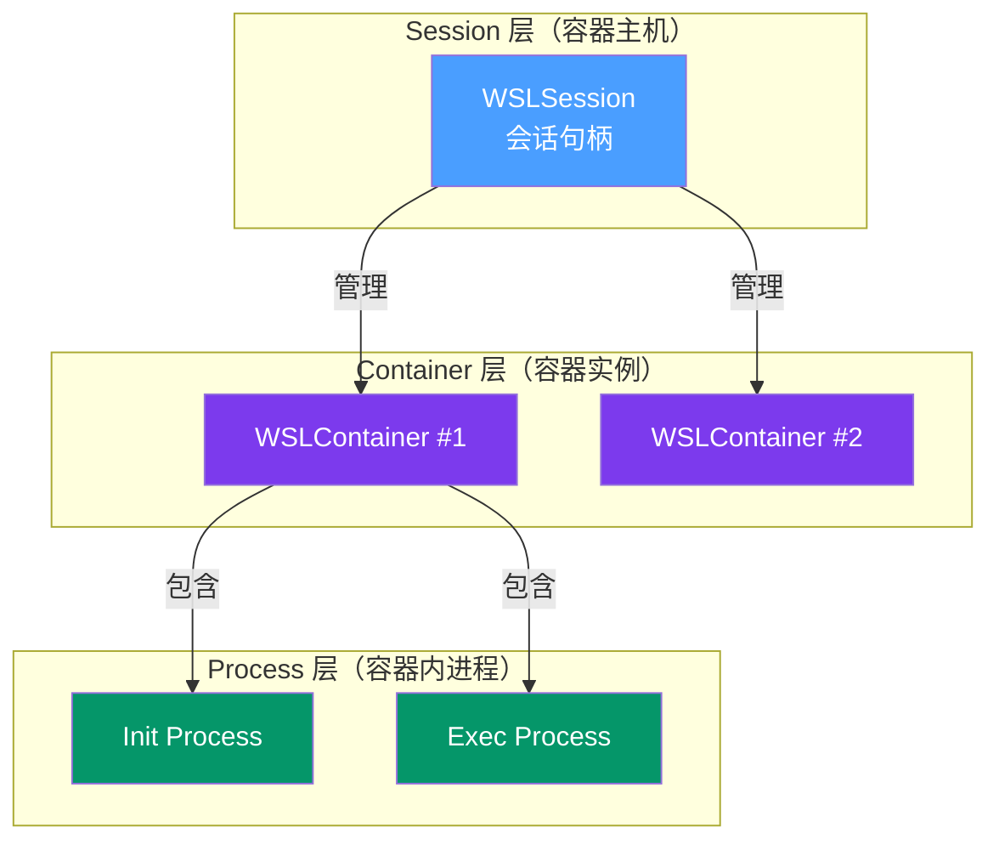
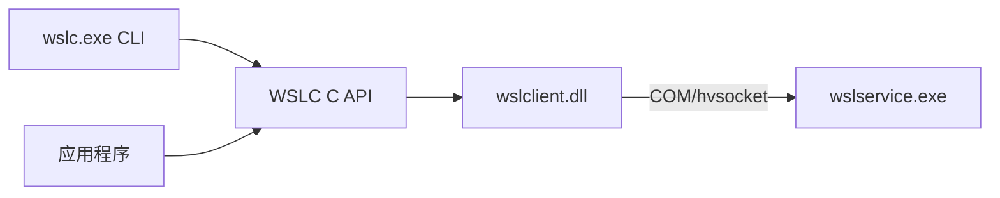
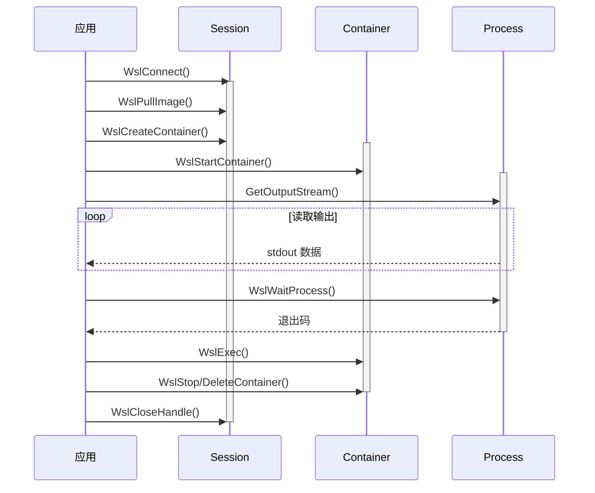

# WSL Container API 三语言编程接口

> ⚠️ **Preview 状态**：当前 WSLC 处于 **preview** 阶段，GA 计划 **2026 年秋季**。preview 期间 API 可能有不兼容变更，仅用于可行性评估，不要部署到生产环境。

## 1. WSLC 概述与三层模型

WSL Container API (WSLC) 是编程控制 WSL 容器生命周期的原生 API，提供与 wslc.exe CLI 等价的能力，支持从应用程序中直接创建、管理、销毁 WSL 容器。

### 1.1 三层对象模型

WSLC 遵循 **Session → Container → Process** 三层嵌套对象模型：



| 对象 | 职责 |
|---|---|
| **Session** | 容器主机：管理镜像仓库、创建/列出/终止容器，一个 Session 可包含多个 Container |
| **Container** | 容器实例：启动/停止/删除容器、在容器内执行命令，包含一个 Init Process + 多个 Exec Process |
| **Process** | 容器内 Linux 进程：读写 stdin/stdout/stderr、等待退出、发送信号、调整终端大小 |

### 1.2 与 Docker API 对比

| 特性 | WSLC | Docker Engine API |
|---|---|---|
| 运行时 | 原生集成 WSL2 轻量级 VM | 独立 Docker daemon |
| 镜像标准 | 兼容 OCI/Docker 镜像 | OCI 标准 |
| API 稳定性 | C ABI 稳定层 | REST API 版本化 |
| Windows 集成 | 原生 hvsocket/COM 通信 | TCP/named pipe |

### 1.3 三语言 SDK 支持

| 语言 | 接口形式 | 资源管理 | 错误处理 |
|---|---|---|---|
| **C** | `wsl/client/api.h` + `wsl/client/wsl.h`，链接 `wslclient.lib` | 手动 `WslCloseHandle()` | HRESULT + `GetErrorInfo()` |
| **C++** | `wsl/client/wsl.hpp` idiomatic RAII 包装 | RAII 自动（`UniqueSession`/`UniqueContainer`/`UniqueProcess`） | `tl::expected` / 异常 |
| **C#** | NuGet `Microsoft.WSL.Container.Client`，命名空间 `Wsl.Client` | `IDisposable` + `using` | `try-catch` + 异步 `Task` |

C API 是唯一稳定的 ABI 边界，C++/C# 均为其上层投影。

---

## 2. API 核心能力与方法总览

### 2.1 Session 层方法

| 功能 | C API | C++ API | C# API |
|---|---|---|---|
| 连接会话 | `WslConnect()` | `Session::Connect()` | `Session.ConnectAsync()` |
| 检测容器环境 | `WslIsContainerEnvironment()` | `Session::IsContainerEnvironment()` | `Session.IsContainerEnvironment` |
| 列出容器/进程 | `WslListContainers/ListContainerProcesses()` | `ListContainers/ListContainerProcesses()` | `ListContainersAsync/ListContainerProcessesAsync()` |
| 创建容器 | `WslCreateContainer()` | `Session::CreateContainer()` | `Session.CreateContainer()` |
| 拉取/列出/推送镜像 | `WslPull/List/PushImage()` | `Pull/List/PushImage()` | `Pull/List/PushImageAsync()` |
| 加载/保存/标记/构建/导入镜像 | `WslLoad/Save/Tag/Build/ImportImage()` | `Load/Save/Tag/Build/ImportImage()` | `Load/Save/Tag/Build/ImportImageAsync()` |

### 2.2 Container 层方法

| 功能 | C API | C++/C# 方法 |
|---|---|---|
| 附加/启动/停止/强杀 | `WslAttach/Start/Stop/KillContainer()` | `Attach/Start/Stop/Kill()` |
| 执行命令 | `WslContainerExec()` | `Exec()` |
| 删除/导出 | `WslDelete/ExportContainer()` | `Delete/Export()` |
| inspect/日志/统计/端口 | `WslInspect/Logs/Stats/PortContainer()` | `Inspect/Logs/Stats/Port()` |
| 获取 Init Process | `WslGetContainerInitProcess()` | `GetInitProcess()` / `InitProcess` |

### 2.3 Process 层方法

| 功能 | C API | C++/C# 方法 |
|---|---|---|
| 等待进程退出 | `WslWaitProcess()` | `Wait()` / `WaitForExitAsync()` |
| 关闭句柄 | `WslCloseHandle()` | RAII 析构 / `Dispose()` |
| 获取输入/输出流 | `WslGetProcessInput/OutputStream()` | `InputStream()` / `OutputStream` |
| 调整终端大小 | `WslResizeProcess()` | `Resize()` / `ResizeAsync()` |

### 2.4 Global 便捷函数（wsl/client/wsl.h）

| 功能 | C API |
|---|---|
| 一站式创建并启动 | `WslCreateContainer()` |
| 一站式运行容器并等待 | `WslRunContainer()` |
| 一站式拉取镜像 | `WslPullContainerImage()` |
| 一站式运行镜像并等待 | `WslRunContainerImageAndWait()` |

---

## 3. C API（稳定 ABI 层）

### 3.1 使用方式

```c
#include <wsl/client/api.h>
#include <wsl/client/wsl.h>
#pragma comment(lib, "wslclient.lib")
#pragma comment(lib, "ole32.lib")
```

**关键类型**：`WSLSession`、`WSLContainer`、`WSLProcess` 为不透明句柄，必须通过 `WslCloseHandle()` 手动释放。
**错误处理**：返回 `HRESULT`，用 `SUCCEEDED()`/`FAILED()` 判断；详细错误通过 `PWSTR* errorMessage` 输出，用 `CoTaskMemFree()` 释放。
**运行时依赖**：`wslclient.dll` 位于 `%SystemRoot%\System32`。

### 3.2 端到端示例

```c
#include <windows.h>
#include <stdio.h>
#include <wsl/client/api.h>

#pragma comment(lib, "wslclient.lib")
#pragma comment(lib, "ole32.lib")

int main()
{
    CoInitializeEx(nullptr, COINIT_MULTITHREADED);

    WSLSession session = nullptr;
    HRESULT hr = WslConnect(L"demo-session", nullptr, &session);
    if (FAILED(hr)) { CoUninitialize(); return 1; }

    const wchar_t* argv[] = { L"/bin/echo", L"Hello from WSLC C API!" };
    WSL_CONTAINER_SETTINGS settings = {};
    settings.size = sizeof(settings);
    settings.image = L"docker.io/library/alpine:latest";
    settings.name = L"hello-c";
    settings.initProcess.argv = argv;
    settings.initProcess.argc = 2;

    WSLContainer container = nullptr;
    PWSTR err = nullptr;
    hr = WslCreateContainer(session, &settings, &container, &err);
    if (FAILED(hr)) {
        wprintf(L"Create failed: %s\n", err ? err : L"unknown");
        if (err) CoTaskMemFree(err);
        WslCloseHandle(session); CoUninitialize(); return 1;
    }

    WslStartContainer(container, 0, &err);

    WSLProcess initProc = nullptr;
    WslGetContainerInitProcess(container, &initProc);
    HANDLE outH = nullptr;
    WslGetProcessOutputStream(initProc, &outH);

    char buf[4096]; DWORD n;
    while (ReadFile(outH, buf, sizeof(buf)-1, &n, nullptr) && n > 0) {
        buf[n] = '\0'; printf("%s", buf);
    }

    WslWaitProcess(initProc, INFINITE);
    DWORD exitCode; WslGetProcessExitCode(initProc, &exitCode);
    printf("Exit code: %lu\n", exitCode);

    CloseHandle(outH);
    WslCloseHandle(initProc);
    WslStopContainer(container, WSL_SIGTERM, 10000, nullptr);
    WslDeleteContainer(container, 0, nullptr);
    if (err) CoTaskMemFree(err);
    WslCloseHandle(container);
    WslCloseHandle(session);
    CoUninitialize();
    return 0;
}
```

---

## 4. C++ API（Idiomatic 层）

头文件 `wsl/client/wsl.hpp` 提供 RAII 风格包装：`UniqueSession`/`UniqueContainer`/`UniqueProcess` 自动管理生命周期，支持 `tl::expected<T, HRESULT>` 或异常模式，iostream 风格 IO，move-only 语义。

### 4.1 C ↔ C++ 类型映射

| C 句柄 | C++ RAII 类型 |
|---|---|
| `WSLSession` | `UniqueSession` |
| `WSLContainer` | `UniqueContainer` |
| `WSLProcess` | `UniqueProcess` |

### 4.2 端到端示例

```cpp
#include <wsl/client/wsl.hpp>
#include <iostream>

using namespace wsl::client;

int main()
{
    CoInitializeEx(nullptr, COINIT_MULTITHREADED);

    try {
        auto session = Session::Connect(L"demo-session").value();

        ContainerSettings settings;
        settings.image = L"docker.io/library/alpine:latest";
        settings.name = L"hello-cpp";
        settings.initProcess.argv = { L"/bin/echo", L"Hello from C++ WSLC!" };

        auto container = session.CreateContainer(settings).value();
        container.Start().value();

        auto proc = container.GetInitProcess().value();
        auto& out = proc.OutputStream();
        std::string line;
        while (std::getline(out, line)) std::cout << line << '\n';

        proc.Wait(std::chrono::seconds(30));
        std::cout << "Exit code: " << proc.ExitCode() << '\n';

        container.Stop(std::chrono::seconds(10));
        container.Delete();
    } catch (const WslException& e) {
        std::wcerr << L"Error: " << e.What() << L'\n';
    }

    CoUninitialize();
    return 0;
}
```

---

## 5. C# API（.NET 绑定层）

通过 NuGet 安装：`dotnet add package Microsoft.WSL.Container.Client`，命名空间 `Wsl.Client`。提供原生 `async/await` Task API、`IDisposable`/`IAsyncDisposable` 资源管理、标准 `Stream` IO、`IAsyncEnumerable<T>` 流式列表。

### 5.1 端到端示例

```csharp
using System;
using System.Text;
using System.Threading.Tasks;
using Wsl.Client;

class Program
{
    static async Task Main()
    {
        await using var session = await Session.ConnectAsync("demo-session");
        await session.PullImageAsync("docker.io/library/alpine:latest");

        var settings = new ContainerSettings("docker.io/library/alpine:latest")
        {
            Name = "hello-csharp",
            InitProcess = new ProcessSettings
            {
                CmdLine = new[] { "/bin/sh", "-c", "echo Hello from C# WSLC! && uname -a" }
            }
        };
        await using var container = session.CreateContainer(settings);

        container.OutputReceived += data =>
            Console.Write(Encoding.UTF8.GetString(data.Span));
        await container.StartAsync();

        await using var proc = container.InitProcess;
        await proc.WaitForExitAsync();
        Console.WriteLine($"\nExit code: {proc.ExitCode}");

        await container.StopAsync(TimeSpan.FromSeconds(10));
        await container.DeleteAsync();
    }
}
```

---

## 6. 使用注意事项与最佳实践

### 6.1 资源管理

| 语言 | 释放方式 | 遗漏后果 |
|---|---|---|
| C | 显式 `WslCloseHandle()` | 句柄泄漏、容器残留、VM 资源占用 |
| C++ | `UniqueXxx` 离开作用域自动释放 | 无（使用 RAII 类型时） |
| C# | `using` / `await using` | 无（正确使用 using 时） |

**释放顺序**：Process → Container → Session（子对象先于父对象释放）。

### 6.2 错误处理

| 语言 | 方式 | 推荐模式 |
|---|---|---|
| C | `HRESULT` + `IErrorInfo` | 每次调用检查 `FAILED(hr)`，`goto cleanup` 统一释放 |
| C++ | `tl::expected` 或异常 | 库代码用 `expected`，小工具可用异常 |
| C# | `try-catch (WslException)` | 所有异步 `await`，外层统一 catch |

### 6.3 ABI 兼容性与 CLI 关系

- **C API 是唯一稳定的 ABI 边界**，C++/C# 绑定随 SDK 版本演化
- wslc.exe CLI 与 WSLC API 调用同一底层实现（wslclient.dll → wslservice.exe）：



CLI 适合脚本和交互使用，API 适合应用程序深度集成。

---

## 7. API 调用流程

### 7.1 容器生命周期时序



### 7.2 标准流程步骤

1. **Connect**：建立会话连接
2. **PullImage**：拉取 OCI 镜像（本地已有可跳过）
3. **CreateContainer**：配置并创建容器
4. **StartContainer**：启动容器（自动创建 Init Process）
5. **IO 交互**：通过 Stream 读写 stdin/stdout/stderr
6. **WaitProcess**：等待进程退出，获取退出码
7. **Close/Stop/Delete**：按 Process → Container → Session 顺序清理资源

---

← [上一章：文件系统互操作](05-filesystem-interop.md) | [返回目录](README.md) | [下一章：网络、配置与systemd](07-network-config-systemd.md) →
