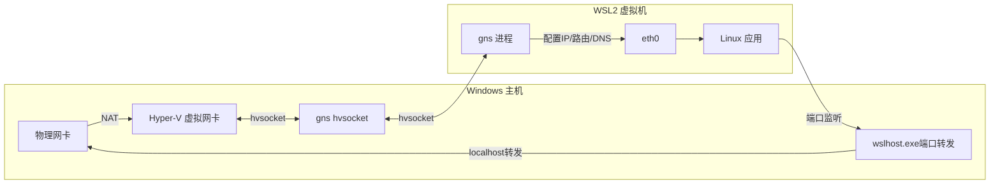
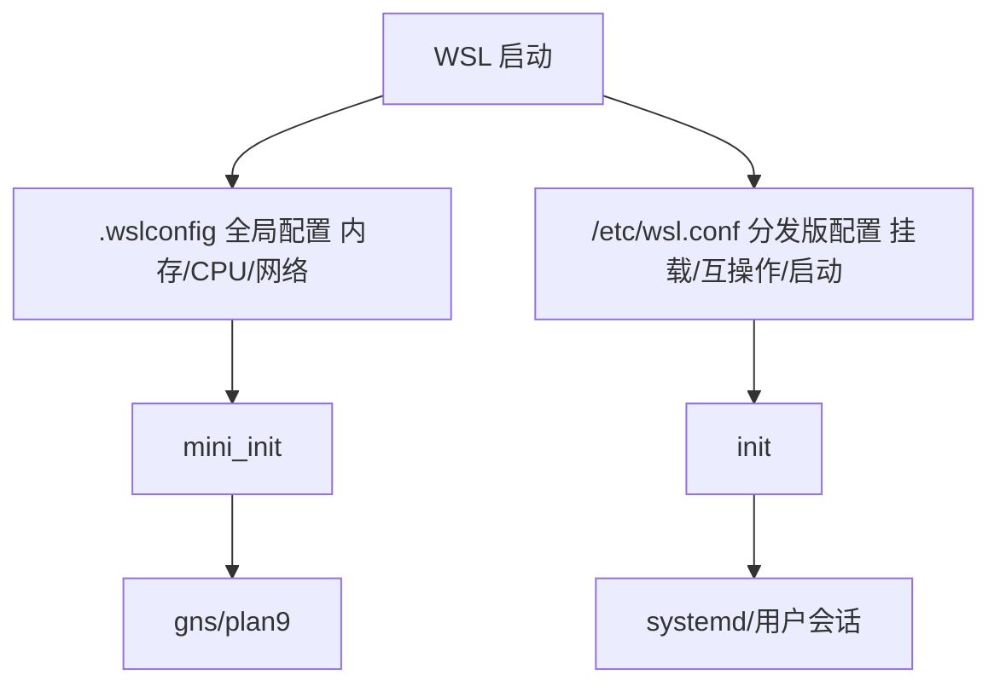
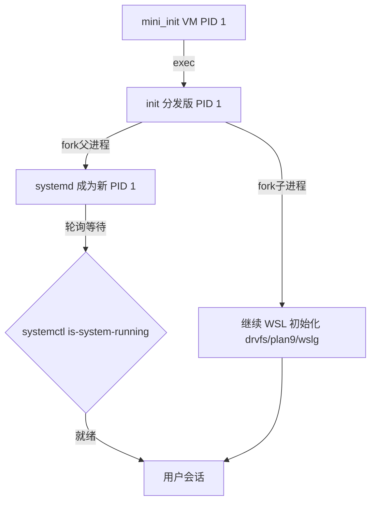

# 网络、配置管理与systemd

本文档介绍 WSL2 的网络架构、配置文件体系以及 systemd 支持的详细用法。

---

## 一、WSL2 网络

### 1.1 网络架构

WSL2 默认使用 NAT 网络架构，核心组件：

- **gns（Guest Network Service）**：由 `mini_init` 启动的网络配置进程，通过独立 hvsocket 通道与 Windows 侧 `wslservice.exe` 通信，负责配置 VM 网卡 IP、路由表、DNS、MTU
- **wslhost.exe**：Windows 侧进程，负责 localhost 端口自动转发
- **Hyper-V 虚拟交换机**：WSL2 网络底层基于 Hyper-V 虚拟化



### 1.2 网络模式

在 `.wslconfig` 的 `[wsl2]` 段通过 `networkingMode` 配置三种网络模式：

| 模式 | 值 | 适用版本 | 特点 |
|---|---|---|---|
| NAT 模式 | `nat` | 所有版本 | 默认模式，VM 有独立虚拟网卡和 IP（172.x.x.x），通过 NAT 访问外网 |
| 镜像模式 | `mirrored` | Win11 22H2+ | 镜像 Windows 网络栈，共享同一 IP 和端口空间，兼容 VPN/防火墙 |
| 无网络 | `none` | - | 禁用网络 |

**配置示例**：
```ini
[wsl2]
networkingMode=mirrored
```

**NAT vs Mirrored 对比**：
- NAT：独立子网，Windows 自动转发 localhost 端口，局域网需手动配置 portproxy
- Mirrored：共享网络栈，无需端口转发，Windows 防火墙规则直接生效，VPN 环境推荐

### 1.3 端口转发

**NAT 模式默认转发**：WSL 中监听的端口自动映射到 Windows localhost：
```bash
python3 -m http.server 8000
# Windows 浏览器直接访问 http://localhost:8000
```

**手动端口转发（局域网访问）**：
```powershell
# 管理员 PowerShell
wsl hostname -I  # 查询 WSL IP
netsh interface portproxy add v4tov4 listenport=8080 listenaddress=0.0.0.0 connectport=8080 connectaddress=<WSL_IP>
netsh interface portproxy show all  # 查看规则
netsh interface portproxy delete v4tov4 listenport=8080 listenaddress=0.0.0.0  # 删除
New-NetFirewallRule -DisplayName "WSL 8080" -Direction Inbound -LocalPort 8080 -Protocol TCP -Action Allow
```

> **注意**：WSL2 IP 每次重启可能变化，手动规则需更新。Mirrored 模式无需此操作。

### 1.4 DNS 配置

**默认行为**：gns 自动生成 `/etc/resolv.conf`，nameserver 指向 Windows 虚拟网关。

**自定义 DNS**：
1. 编辑 `/etc/wsl.conf`：
```ini
[network]
generateResolvConf=false
```
2. 手动配置 resolv.conf：
```bash
sudo unlink /etc/resolv.conf
echo "nameserver 8.8.8.8" | sudo tee /etc/resolv.conf
echo "nameserver 114.114.114.114" | sudo tee -a /etc/resolv.conf
```
3. `wsl --shutdown` 重启生效。

**DNS 隧道（Win11）**：解决 VPN 环境 DNS 失效问题：
```ini
[wsl2]
dnsTunneling=true
```

### 1.5 防火墙与常见问题

**防火墙集成**：NAT 模式由 Hyper-V 防火墙控制入站流量；Mirrored 模式下 Windows 防火墙规则直接生效。可通过 `.wslconfig` 的 `firewall=true` 开关控制。

**WSLg**：GUI 应用通过 `WESTON_RDP` 环境变量连接 Windows RDP 服务器，实现显示/音频/剪贴板共享。

| 问题现象 | 解决方案 |
|---|---|
| WSL 完全无法联网 | `wsl --shutdown` 重启；检查 Hyper-V 虚拟网卡 |
| VPN 下 DNS 失效 | 启用 `dnsTunneling=true` 或切换 Mirrored 模式 |
| 局域网无法访问 WSL | 配置 `netsh interface portproxy` 或用 Mirrored 模式 |
| 端口被占用 | Mirrored 模式端口共享，更换端口或停止 Windows 程序 |

---

## 二、配置管理（wsl.conf & .wslconfig）

### 2.1 配置文件层级

| 配置文件 | 位置 | 作用范围 | 加载时机 |
|---|---|---|---|
| `/etc/wsl.conf` | Linux 分发版内 | 单分发版独立配置 | 分发版启动时 init 解析 |
| `.wslconfig` | `%UserProfile%\.wslconfig` | 全局，所有 WSL2 分发版 | VM 启动时 mini_init 解析 |



### 2.2 wsl.conf 配置参考

INI 格式，包含以下 section：

**[automount] 自动挂载**

| Key | 默认值 | 说明 |
|---|---|---|
| `enabled` | `true` | 是否自动挂载 Windows 驱动器（`/mnt/c` 等） |
| `root` | `/mnt/` | 驱动器挂载根目录 |
| `options` | `metadata,umask=22,fmask=11` | DrvFs 挂载选项 |
| `mountFsTab` | `true` | 是否处理 `/etc/fstab` |

**[network] 网络**

| Key | 默认值 | 说明 |
|---|---|---|
| `generateResolvConf` | `true` | 自动生成 `/etc/resolv.conf` |
| `generateHosts` | `true` | 自动生成 `/etc/hosts` |
| `hostname` | Windows 主机名 | WSL 主机名 |

**[interop] Windows 互操作**

| Key | 默认值 | 说明 |
|---|---|---|
| `enabled` | `true` | 支持启动 Windows 进程 |
| `appendWindowsPath` | `true` | 将 Windows PATH 追加到 WSL PATH |

> **禁用 Windows PATH 污染**：设置 `appendWindowsPath=false`。

**[boot] 启动**

| Key | 默认值 | 说明 |
|---|---|---|
| `command` | - | 启动时以 root 执行的命令 |
| `systemd` | `false` | 启用 systemd |

**[user] 用户**

| Key | 默认值 | 说明 |
|---|---|---|
| `default` | 创建时设置 | 默认登录用户名 |

### 2.3 .wslconfig 配置参考

**[wsl2] 核心配置**

| Key | 默认值 | 说明 |
|---|---|---|
| `memory` | 内存50%或8GB | VM 内存上限（如 `4GB`） |
| `processors` | 全部逻辑核心 | vCPU 核心数 |
| `swap` | 内存25% | 交换空间大小，`0` 禁用 |
| `swapFile` | `%USERPROFILE%\AppData\Local\Temp\swap.vhdx` | 交换文件路径 |
| `localhostForwarding` | `true` | localhost 端口转发 |
| `kernel` | 内置内核 | 自定义内核路径 |
| `nestedVirtualization` | `true` | 嵌套虚拟化 |
| `networkingMode` | `nat` | `nat`/`mirrored`/`none` |
| `dnsTunneling` | `false` | DNS 隧道 |
| `firewall` | `true` | Windows 防火墙集成 |
| `autoProxy` | `false` | 自动使用 Windows 代理 |

**完整示例**：
```ini
[wsl2]
memory=8GB
processors=4
swap=4GB
networkingMode=mirrored
dnsTunneling=true
firewall=true
autoProxy=true

[experimental]
autoMemoryReclaim=gradual
sparseVhd=true
```

**[experimental] 实验性功能**

| Key | 默认值 | 说明 |
|---|---|---|
| `autoMemoryReclaim` | `disabled` | 内存回收：`disabled`/`gradual`/`dropcache` |
| `sparseVhd` | `false` | 稀疏 VHD，自动缩小虚拟磁盘 |
| `bestEffortDnsParsing` | `false` | 兼容异常 DNS 响应 |

### 2.4 配置生效与查看

修改配置后必须重启生效：
```powershell
wsl --shutdown
wsl  # 重新启动
```

查看当前配置：
```powershell
wsl --status  # 显示版本与运行时信息
```

---

## 三、systemd 支持

systemd 是现代 Linux 的初始化系统，WSL 从 0.67 版本开始支持。

### 3.1 启用 systemd

**步骤 1**：编辑 `/etc/wsl.conf`：
```bash
sudo tee /etc/wsl.conf << 'EOF'
[boot]
systemd=true
EOF
```

**步骤 2**：在 PowerShell 中重启：
```powershell
wsl --shutdown
wsl
```

### 3.2 验证运行

```bash
ps --no-headers -o comm 1  # 应输出 systemd
systemctl is-system-running  # running 或 degraded
systemctl list-unit-files --type=service  # 列出服务
```

### 3.3 systemd 与 init 的关系



**关键要点**：
- `mini_init` 仍是 VM 顶层 PID 1
- init 进程 fork()：父进程 exec systemd（要求 PID 1），子进程继续 WSL 初始化
- init 轮询等待 systemd 就绪
- 启用后启动时间会增加

### 3.4 服务管理

启用后可直接用 `systemctl`：
```bash
sudo systemctl start docker
sudo systemctl enable docker  # 开机自启
sudo systemctl status docker
sudo systemctl restart ssh
journalctl -u docker  # 查看服务日志
systemctl list-units --type=service  # 列出运行中服务
```

常用服务：docker、ssh、nginx、snapd 等均可直接管理。

### 3.5 限制与常见问题

**已知限制**：
- 不支持 systemd-nspawn
- cgroupv1 功能有限（WSL2 默认 cgroupv2）
- 部分硬件相关 systemd 模块被禁用
- systemd-resolved 可能与 WSL DNS 管理冲突（配合 `generateResolvConf=false` 使用）

**常见问题**：

| 问题 | 解决方案 |
|---|---|
| 启动变慢 | 禁用不需要的服务：`sudo systemctl disable <service>` |
| Docker Desktop 冲突 | 使用系统包 docker.io，或在 Docker Desktop 中启用 WSL2 引擎 |
| DNS 异常 | `generateResolvConf=false` 手动配置，或启用 `dnsTunneling` |
| 旧发行版不兼容 | 升级到 Ubuntu 22.04+、Debian 12+ |

---

## 参考链接

- [WSL 官方配置文档](https://learn.microsoft.com/windows/wsl/wsl-config)
- [WSL 网络模式](https://learn.microsoft.com/windows/wsl/networking)
- [WSL systemd 支持](https://learn.microsoft.com/windows/wsl/systemd)
- [wsl.dev 技术文档](https://wsl.dev/technical-documentation/)

---

← [上一章：WSL Container API](06-wslc-api.md) | [返回目录](README.md) | [下一章：调试诊断与开发环境](08-debugging-dev-env.md) →
