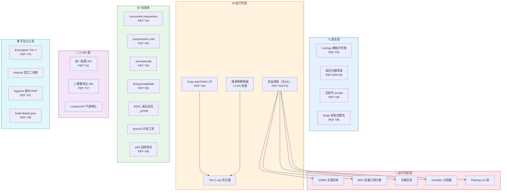
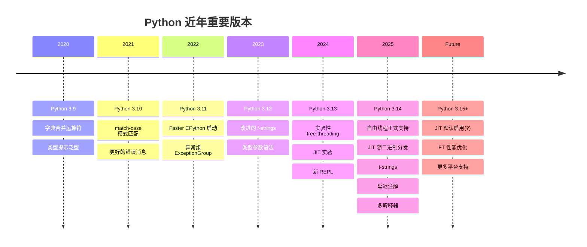

# Python 3.14 + CPython 源码深度指南 — 概述

> 一句话摘要：Python 3.14 是自 Python 3.0 以来最具变革性的版本——自由线程（无 GIL）正式进入官方支持阶段、Copy-and-Patch JIT 随官方二进制分发、t-strings 模板字符串、延迟注解求值、多解释器标准库支持、Zstandard 压缩内建等重磅特性同时落地。本教程以官方文档和 [CPython v3.14.0 源码](https://github.com/python/cpython/tree/v3.14.0) 为根基，从语言特性、内部架构到迁移实战系统讲解。

---

## 1. 教程介绍

Python 3.14 于 **2025 年 10 月 7 日**正式发布，代号"Free-Threaded Python"。这个版本标志着 Python 语言和 CPython 解释器进入了一个全新的阶段。

自 Python 3.0（2008年）以来，Python 核心团队一直在渐进式改进语言和运行时，但从未像 3.14 这样在**同一版本中同时引入五重架构级变革**：

1. **自由线程（Free-Threading / 无 GIL）**：PEP 703 的实现完成，PEP 779 正式将其标记为受支持的构建模式（非默认，但不再是实验性）
2. **Copy-and-Patch JIT 编译器**：macOS/Windows 官方二进制内置实验性 JIT，通过 `PYTHON_JIT=1` 启用
3. **延迟注解求值**（PEP 649/749）：从根本上解决前向引用问题，`from __future__ import annotations` 开始弃用
4. **t-strings 模板字符串**（PEP 750）：自 f-strings（3.6）以来最重要的字符串语法扩展
5. **多解释器标准库支持**（PEP 734）：`concurrent.interpreters` 让真正的多核并行成为标准库一等公民

除此之外，Zstandard 压缩进入标准库（PEP 784）、尾调用解释器带来 3-5% 性能提升、REPL 默认语法高亮、asyncio 内省工具、pdb 远程调试、增量 GC（3.14.5 回退）、C API 重大重构（PEP 741）……这个版本的变化密度前所未有。

本教程的独特价值在于：**不只讲"怎么用"，还讲"为什么"和"怎么实现的"**。每个重要特性都会追溯到 CPython 源码中的具体实现文件和关键函数，帮助读者从使用者视角自然过渡到理解内部原理。

### 源码引用约定

本教程中涉及 CPython 源码的引用使用以下格式：

- **相对路径**：如 [Python/ceval.c](https://github.com/python/cpython/blob/v3.14.0/Python/ceval.c) 表示 CPython 源码树中该路径的文件
- **行号引用**：格式为 `[Python/ceval.c#L100-L200](https://github.com/python/cpython/blob/v3.14.0/Python/ceval.c#L100-L200)`
- **GitHub 链接**：所有源码路径均附带 v3.14.0 tag 的 GitHub 链接，可直接点击查看源码
- 如有本地 CPython 源码检出，可将相对路径映射到本地目录进行交叉验证

---

## 2. 目标受众

本教程面向以下读者，每个角色给出了建议阅读路径：

| 角色 | 典型需求 | 建议阅读章节 |
|------|---------|-------------|
| **应用开发者** | 了解 3.14 新语法、新模块、性能改进，掌握迁移要点 | 00→01→04→05→09→10→11→12 |
| **库作者** | 理解类型注解变化、C API 变更、自由线程兼容性 | 00→01→02→04→07→09→10→12 |
| **C 扩展开发者** | 掌握 C API 重构、Limited API 变更、自由线程适配 | 00→02→03→06→07→09 |
| **源码学习者/贡献者** | 理解 CPython 内部架构、JIT、GC、对象系统 | 00→02→03→06→07→08→12 |
| **技术决策者** | 评估升级成本与收益、了解自由线程/JIT 成熟度 | 00→02→03→09→10→12 |

> **前置知识**：假设读者具备 Python 3.10+ 编程基础，了解基本的类型注解、asyncio 概念；C 扩展和源码架构章节需要基础的 C 语言知识。

---

## 3. Python 3.14 版本演进对比

Python 3.12→3.13→3.14 是一个连续的架构革命周期，以下是三个版本的核心变化对比：

| 维度 | Python 3.12 | Python 3.13 | Python 3.14 |
|------|------------|------------|------------|
| **GIL** | 标准 GIL | 实验性 free-threading build | 自由线程正式支持（PEP 779） |
| **JIT** | 无 | 无（copy-and-patch JIT 开发中） | 实验性 JIT 随官方二进制分发 |
| **解释器** | 传统 switch-case | 传统 + 特化优化 | 新增尾调用解释器（3-5% 提升） |
| **Garbage Collection** | 分代 GC | 分代 GC | 增量 GC（3.14.0-3.14.4），3.14.5 回退分代 GC |
| **注解** | `from __future__ import annotations` 可选 | 同上 | 延迟注解求值（PEP 649/749），future annotations 弃用 |
| **字符串** | f-strings 改进 | f-strings 嵌套引号 | t-strings 模板字符串（PEP 750） |
| **多解释器** | C API 级别 | 有限支持 | `concurrent.interpreters` 标准库（PEP 734） |
| **压缩** | zlib/bz2/lzma | 同上 | +Zstandard（PEP 784） |
| **REPL** | 传统 REPL | 实验性新 REPL | 新 REPL 默认（语法高亮+自动补全） |
| **C API** | 稳定 | 逐步隐藏内部结构 | PEP 741 统一配置 API，Limited API 进一步不透明化 |
| **平台** | 传统平台 | 实验性 WASI | Emscripten Tier 3 官方支持，Android 官方二进制 |

> **关键结论**：Python 3.12→3.14 完成了从"渐进改良"到"架构重构"的跨越。如果你在 3.12/3.13 上没有急迫的升级理由，3.14 值得你认真评估——它不仅是特性最多的版本，也是未来 Python 并行计算生态的起点。

---

## 4. 章节导航

本教程共 14 章，从总览到实战循序渐进：

| 章节 | 标题 | 内容概要 | 难度 |
|------|------|---------|------|
| 00 | [概述](00-overview.md)（当前页） | 版本背景、目标受众、核心特性全景、章节导航 | ⭐ |
| 01 | [语言新特性](01-language-features.md) | t-strings、延迟注解、无括号 except、finally 警告、内置函数变更、字节码变更 | ⭐⭐ |
| 02 | [自由线程（无 GIL）深度解析](02-free-threading.md) | PEP 703/779、QSBR、BRC、关键区段、mimalloc、线程安全模型、C扩展兼容 | ⭐⭐⭐ |
| 03 | [JIT 编译器与新执行模型](03-jit-interpreter.md) | Tier 1 特化、Tier 2 uop 优化器、Copy-and-Patch JIT、尾调用解释器 | ⭐⭐⭐ |
| 04 | [新模块详解](04-new-modules.md) | annotationlib、concurrent.interpreters、string.templatelib、compression.zstd | ⭐⭐ |
| 05 | [标准库重大改进](05-stdlib-improvements.md) | REPL、asyncio、pathlib、pdb、uuid、argparse、json、unittest 等 | ⭐⭐ |
| 06 | [CPython 源码架构总览](06-cpython-architecture.md) | 目录结构、三层头文件、解释器循环、对象系统、GC、内存分配、PEG 解析器 | ⭐⭐⭐ |
| 07 | [C API 与扩展开发](07-c-api-changes.md) | PEP 741/757、Limited API 变更、自由线程适配、废弃/移除 API | ⭐⭐⭐ |
| 08 | [构建系统与平台支持](08-build-platform.md) | 构建选项、官方二进制新特性、平台支持变化、签名变更 | ⭐⭐ |
| 09 | [迁移指南](09-migration-guide.md) | 废弃 API 对照表、行为变更注意事项、C 扩展迁移 checklist | ⭐⭐ |
| 10 | [实战示例](10-practical-examples.md) | t-strings SQL 构建、FT 基准测试、多解释器并行、zstd 压缩、pdb 远程调试 | ⭐⭐ |
| 11 | [FAQ 与排障](11-faq-troubleshooting.md) | 安装/兼容性/性能 FAQ、已知问题、调试技巧 | ⭐⭐ |
| 12 | [总结与资源](12-summary-resources.md) | 十大变革速记、分角色学习路径、源码速查表、延伸阅读 | ⭐ |
| 13 | [官方文档四大支柱导览](13-official-docs-roadmap.md) | tutorial/library/extending/howto 四支柱全景 + 与 3.14 章节映射、分角色官方文档阅读路径 | ⭐ |
| — | [📋 速查卡片](python314-cheatsheet.html) | 单页 HTML 可视化速查，16 个 PEP、五大特性、迁移表、源码映射 | ⭐ |
| — | [🗺️ 学习路径规划](learning-path.md) | 四阶段递进学习模型、五角色专属路径、分天练习任务、自测清单 | ⭐ |

---

## 5. Python 3.14 新特性全景图

> **架构解读**：Python 3.14 的变革从语言层贯穿到平台层。语言层（t-strings、延迟注解）面向所有 Python 开发者；运行时层（自由线程、JIT）是性能革命的核心，其实现依赖 QSBR/BRC/mimalloc 等底层基础设施；标准库新增模块直接服务于新特性；C API 层的重构为扩展作者提供新接口同时收紧内部访问；平台层扩展了 Python 的部署边界。

---

## 6. 核心 PEPs 一览

Python 3.14 的主要特性由以下 PEPs（Python Enhancement Proposals）定义：

| PEP | 标题 | 状态 | 章节 |
|-----|------|------|------|
| [PEP 649](https://peps.python.org/pep-0649/) | Deferred Evaluation of Annotations | Final | 01, 04 |
| [PEP 703](https://peps.python.org/pep-0703/) | Making the Global Interpreter Lock Optional in CPython | Accepted (Phase 2) | 02 |
| [PEP 734](https://peps.python.org/pep-0734/) | Multiple Interpreters in the Stdlib | Accepted | 04 |
| [PEP 739](https://peps.python.org/pep-0739/) | Python Build Information | Final | 08 |
| [PEP 741](https://peps.python.org/pep-0741/) | Python Configuration C API | Final | 07 |
| [PEP 744](https://peps.python.org/pep-0744/) | JIT Compilation as an Official Feature | Draft | 03 |
| [PEP 749](https://peps.python.org/pep-0749/) | Annotating Well-Known Declarations | Final | 01, 04 |
| [PEP 750](https://peps.python.org/pep-0750/) | Template Strings (t-strings) | Accepted | 01, 04 |
| [PEP 757](https://peps.python.org/pep-0757/) | C API for Importing Python Longs | Final | 07 |
| [PEP 758](https://peps.python.org/pep-0758/) | Bracket-less except* and except Expressions | Accepted | 01 |
| [PEP 761](https://peps.python.org/pep-0761/) | Deprecating PGP Signatures for CPython Releases | Accepted | 08 |
| [PEP 765](https://peps.python.org/pep-0765/) | Warning about Control Flow in finally | Accepted | 01 |
| [PEP 768](https://peps.python.org/pep-0768/) | Safe External Debugger Interfaces | Final | 05, 07 |
| [PEP 776](https://peps.python.org/pep-0776/) | Emscripten as a Supported Platform | Accepted | 08 |
| [PEP 779](https://peps.python.org/pep-0779/) | Free-Threaded Python as a Supported Platform | Accepted | 02 |
| [PEP 784](https://peps.python.org/pep-0784/) | Adding Zstandard to the Standard Library | Accepted | 04 |

---

## 7. 关键版本信息

| 属性 | 值 |
|------|-----|
| **版本号** | Python 3.14.0 |
| **发布日期** | 2025-10-07 |
| **源码仓库** | [github.com/python/cpython](https://github.com/python/cpython) |
| **源码 Tag** | [v3.14.0](https://github.com/python/cpython/tree/v3.14.0) |
| **官方文档（中文）** | [docs.python.org/zh-cn/3.14/](https://docs.python.org/zh-cn/3.14/) |
| **官方文档（英文）** | [docs.python.org/3.14/](https://docs.python.org/3.14/) |
| **What's New** | [What's New in Python 3.14](https://docs.python.org/3.14/whatsnew/3.14.html) |
| **自由线程模式** | 正式支持（非默认构建），运行时 `PYTHON_GIL=0` 或 `python3.14t` |
| **JIT** | 实验性，官方二进制包含，`PYTHON_JIT=1` 启用 |
| **尾调用解释器** | opt-in 构建选项 `--with-tail-call-interp` |
| **最低 C 编译器** | 支持 C11 |
| **Autoconf 要求** | 2.72 |

> ⚠️ **重要提示**：增量垃圾回收（Incremental GC）在 3.14.0-3.14.4 版本中引入，但因生产环境内存压力报告，在 **3.14.5 版本中已回退**为 3.13 式分代 GC。本教程会标注相关内容的版本差异。

---

## 8. Python 版本时间线

---

- 上一章：本章为教程概述（00）
- [下一章：语言新特性](01-language-features.md) →
