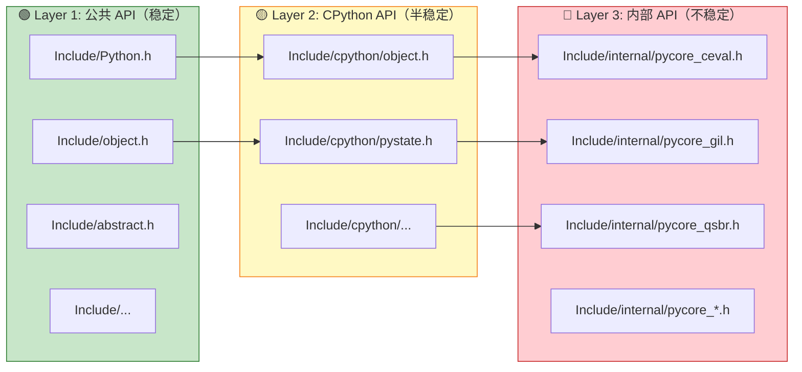
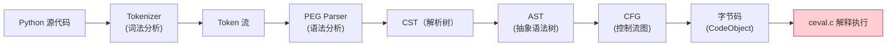
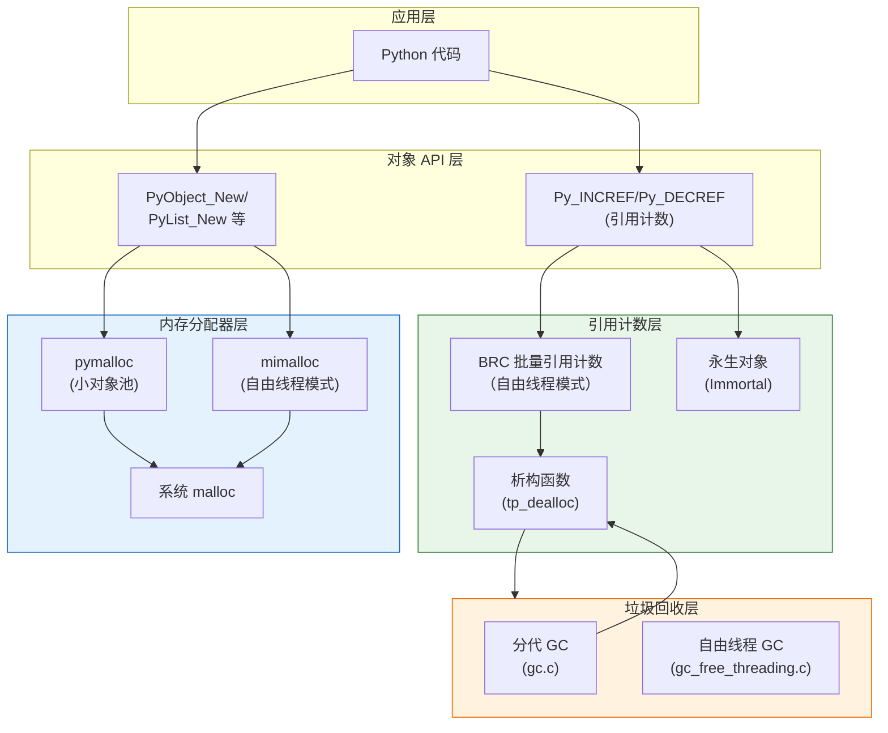
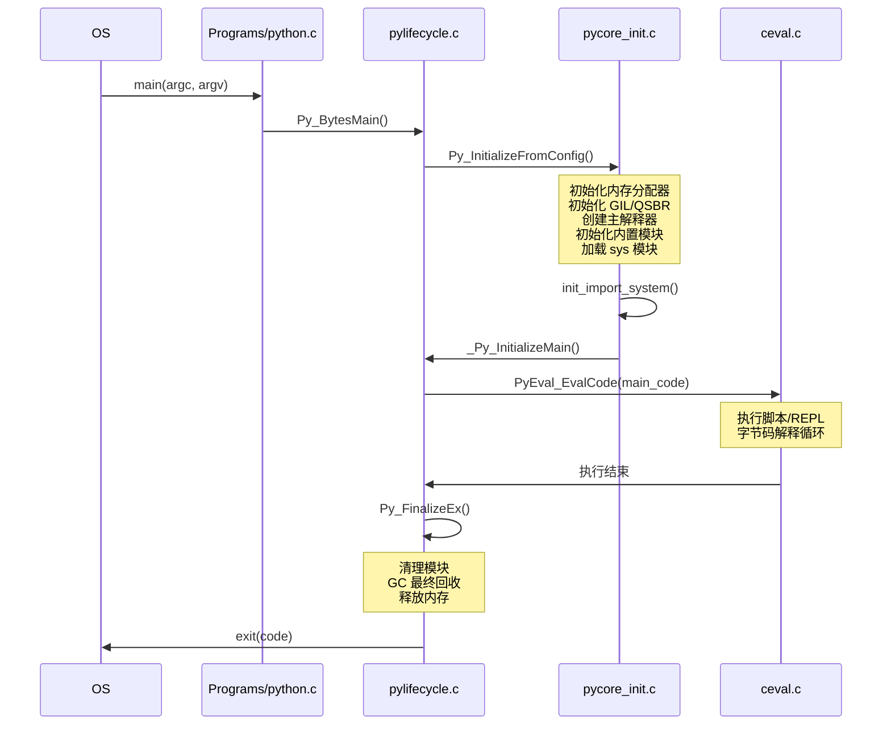

# CPython 源码架构总览

理解 CPython 的源码架构是深入理解 Python 3.14 新特性（自由线程、JIT、延迟注解等）的基础。本章带你从顶层目录结构出发，逐层深入 CPython 的核心运行时、对象系统、编译器、GC 和内存管理。

---

## 1. 顶层目录结构

CPython 源码树（v3.14.0）的顶层目录：

```mermaid
graph TB
    ROOT["cpython/"]

    ROOT --> INC["Include/<br/>头文件（公共 API）"]
    ROOT --> INTC["Include/cpython/<br/>CPython API"]
    ROOT --> INTI["Include/internal/<br/>内部 API（pycore_*.h）"]
    ROOT --> LIB["Lib/<br/>Python 标准库"]
    ROOT --> MOD["Modules/<br/>C 扩展模块"]
    ROOT --> OBJ["Objects/<br/>内置对象类型"]
    ROOT --> PYC["Python/<br/>核心运行时"]
    ROOT --> PAR["Parser/<br/>PEG 解析器"]
    ROOT --> GRA["Grammar/<br/>语法定义"]
    ROOT --> DOC["Doc/<br/>文档（rst）"]
    ROOT --> PROG["Programs/<br/>可执行程序入口"]
    ROOT --> TOOLS["Tools/<br/>构建/开发工具"]
    ROOT --> IDOC["InternalDocs/<br/>内部设计文档"]
    ROOT --> MISC["Misc/<br/>杂项"]
    ROOT --> PC["PC/<br/>Windows 平台支持"]
    ROOT --> PCBUILD["PCbuild/<br/>Windows 构建"]

    style PYC fill:#ffcdd2,stroke:#c62828,stroke-width:2px
    style OBJ fill:#fff3e0,stroke:#ef6c00
    style INC fill:#e3f2fd,stroke:#1565c0
    style PAR fill:#e8f5e9,stroke:#2e7d32
```



| 目录 | 用途 | 核心文件/子目录 |
|------|------|---------------|
| [Include/](https://github.com/python/cpython/tree/v3.14.0/Include) | 公共头文件（稳定 API） | Python.h、object.h、abstract.h |
| [Include/cpython/](https://github.com/python/cpython/tree/v3.14.0/Include/cpython) | CPython 特定 API | cpython/object.h、cpython/pystate.h |
| [Include/internal/](https://github.com/python/cpython/tree/v3.14.0/Include/internal) | 内部 API（不对外稳定） | pycore_ceval.h、pycore_gil.h、pycore_qsbr.h |
| [Lib/](https://github.com/python/cpython/tree/v3.14.0/Lib) | Python 标准库（纯 Python） | os.py、json/、asyncio/、concurrent/、annotationlib.py |
| [Modules/](https://github.com/python/cpython/tree/v3.14.0/Modules) | C 扩展模块（内置+可选） | _io/、_sre.c、_ssl.c、_zstd/、_interpretersmodule.c |
| [Objects/](https://github.com/python/cpython/tree/v3.14.0/Objects) | 内置类型实现 | listobject.c、dictobject.c、intobject.c、typeobject.c |
| [Python/](https://github.com/python/cpython/tree/v3.14.0/Python) | 核心运行时 | ceval.c、compile.c、gc.c、pylifecycle.c、jit.c、qsbr.c |
| [Parser/](https://github.com/python/cpython/tree/v3.14.0/Parser) | PEG 解析器 | pegen.c、parser.c、tokenizer.c |
| [Grammar/](https://github.com/python/cpython/tree/v3.14.0/Grammar) | 语法定义 | python.gram |
| [Programs/](https://github.com/python/cpython/tree/v3.14.0/Programs) | 可执行入口 | python.c |
| [Tools/](https://github.com/python/cpython/tree/v3.14.0/Tools) | 构建工具 | jit/、cases_generator/、peg_generator/ |
| [InternalDocs/](https://github.com/python/cpython/tree/v3.14.0/InternalDocs) | 内部设计文档 | jit.md、qsbr.md、tier2.md |

---

## 2. 三层头文件体系

CPython 的头文件分为三层，构成清晰的 API 边界：



| 层次 | 路径 | 稳定性 | 使用对象 | 示例 |
|------|------|--------|---------|------|
| **公共 API** | `Include/*.h` | 稳定（Limited API 跨版本兼容） | C 扩展作者、嵌入 Python 的应用 | `PyObject`, `PyList_New()`, `PyArg_ParseTuple()` |
| **CPython API** | `Include/cpython/*.h` | CPython 特定，跨小版本可能变 | 需要 CPython 特定功能的 C 扩展 | `_PyList_ITEMS()`, `PyInterpreterState` |
| **内部 API** | `Include/internal/pycore_*.h` | 不稳定，任何版本都可能变 | CPython 核心开发者 | `_PyFrame_SetLastI()`, `_PyQSBRState` |

> **原则**：C 扩展开发者应该只使用 Layer 1（Limited API）或 Layer 2。Layer 3 的 API 仅在 CPython 内部使用，没有版本兼容性保证。

### Limited API

Limited API 是 Python 提供的版本稳定的 C API 子集，使用这些 API 编译的扩展可以在不同 Python 版本之间二进制兼容（不需要重新编译）。

```c
// 定义 Py_LIMITED_API 来只使用 Limited API
#define Py_LIMITED_API 0x030e0000  // 3.14+
#include <Python.h>
```

---

## 3. 核心运行时（Python/ 目录）

### 解释器循环：[Python/ceval.c](https://github.com/python/cpython/blob/v3.14.0/Python/ceval.c)

`ceval.c` 是 CPython 的"心脏"——包含字节码解释器的主循环。Python 3.14 的 ceval.c 支持两种分派方式：

1. **传统 switch-case/computed goto**：经典实现
2. **尾调用解释器**（`--with-tail-call-interp`）：每个 opcode 是独立函数，通过尾调用跳转

核心函数 `_PyEval_EvalFrameDefault()`：

```c
// Python/ceval.c（概念性简化）
PyObject* _PyEval_EvalFrameDefault(PyThreadState *tstate, 
                                   _PyInterpreterFrame *frame, int throwflag) {
    // 从 frame 中获取字节码
    _Py_CODEUNIT *next_instr = frame->instr_ptr;
    
    for (;;) {
        // 1. 静默点（QSBR）
        _Py_qsbr_quiescent(tstate);
        
        // 2. 取下一条指令
        _Py_CODEUNIT word = *next_instr++;
        uint8_t opcode = _Py_OPCODE(word);
        uint8_t oparg = _Py_OPARG(word);
        
        // 3. 分派执行（tail-call 模式下由 DISPATCH 宏处理）
        switch (opcode) {
            case TARGET(LOAD_FAST): { ...; DISPATCH(); }
            case TARGET(BINARY_ADD): { ...; DISPATCH(); }
            // ... 200+ opcodes
        }
    }
}
```

### GIL 实现：[Python/ceval_gil.c](https://github.com/python/cpython/blob/v3.14.0/Python/ceval_gil.c)

GIL 的实现在单独文件中（之前嵌入在 ceval.c 中）：
- 周期性检查（`eval_breaker`）决定是否释放 GIL
- 自由线程模式下不使用此文件
- 包含 GIL 获取/释放/等待逻辑

### 编译器：[Python/compile.c](https://github.com/python/cpython/blob/v3.14.0/Python/compile.c)

将 AST 编译为字节码：
- `PyAST_Compile()` — AST → CodeObject
- 基本块构建、控制流分析、寄存器分配
- 字节码优化（常量折叠、死代码消除）
- t-strings/annotations 的字节码生成

### GC：三种实现

| 模式 | 文件 | 说明 |
|------|------|------|
| GIL 模式 GC | [Python/gc.c](https://github.com/python/cpython/blob/v3.14.0/Python/gc.c) | 分代 GC，STW（stop-the-world） |
| GIL 模式（备选） | [Python/gc_gil.c](https://github.com/python/cpython/blob/v3.14.0/Python/gc_gil.c) | GIL 专用优化 |
| 自由线程 GC | [Python/gc_free_threading.c](https://github.com/python/cpython/blob/v3.14.0/Python/gc_free_threading.c) | 无锁 GC，使用 QSBR |

> ⚠️ **注意**：增量 GC（Incremental GC）在 3.14.0-3.14.4 中引入，但因内存问题在 3.14.5 回退为分代 GC。

### 生命周期管理：[Python/pylifecycle.c](https://github.com/python/cpython/blob/v3.14.0/Python/pylifecycle.c)

- `Py_Initialize()` / `Py_Finalize()` — 解释器初始化/销毁
- 多解释器支持（PEP 734 相关）
- 内存分配器初始化（pymalloc/mimalloc）
- GIL 创建/销毁

### 状态管理：[Python/pystate.c](https://github.com/python/cpython/blob/v3.14.0/Python/pystate.c)

- `PyInterpreterState` — 解释器状态（每个子解释器一个）
- `PyThreadState` — 线程状态（每个线程一个）
- 线程局部存储（TLS）

### JIT 运行时：[Python/jit.c](https://github.com/python/cpython/blob/v3.14.0/Python/jit.c)

Copy-and-Patch JIT 核心：
- Stencil 管理
- 运行时补丁（patching）
- 去优化（deoptimization）

### Tier 2 优化器：[Python/optimizer.c](https://github.com/python/cpython/blob/v3.14.0/Python/optimizer.c) + [optimizer_analysis.c](https://github.com/python/cpython/blob/v3.14.0/Python/optimizer_analysis.c)

- Trace 记录
- uop 序列构建
- 优化 passes（常量折叠、类型传播）

### 自由线程基础设施

| 文件 | 功能 |
|------|------|
| [Python/qsbr.c](https://github.com/python/cpython/blob/v3.14.0/Python/qsbr.c) | QSBR 无锁回收 |
| [Python/brc.c](https://github.com/python/cpython/blob/v3.14.0/Python/brc.c) | 批量引用计数 |
| [Python/critical_section.c](https://github.com/python/cpython/blob/v3.14.0/Python/critical_section.c) | 关键区段 |
| [Python/parking_lot.c](https://github.com/python/cpython/blob/v3.14.0/Python/parking_lot.c) | Parking Lot 锁原语 |
| [Python/specialize.c](https://github.com/python/cpython/blob/v3.14.0/Python/specialize.c) | 自适应特化（Tier 1） |

### 导入系统：[Python/import.c](https://github.com/python/cpython/blob/v3.14.0/Python/import.c)

- 模块缓存（`sys.modules`）
- 导入查找器/加载器机制
- 包初始化
- 子解释器模块隔离

---

## 4. 对象系统（Objects/ 目录）

所有 Python 对象都在 `Objects/` 目录中实现。

### 对象基础：[Objects/object.c](https://github.com/python/cpython/blob/v3.14.0/Objects/object.c)

```c
// 所有 Python 对象的基础结构（Include/object.h）
typedef struct _object {
    _PyObject_HEAD_EXTRA  // 调试用双向链表指针
    Py_ssize_t ob_refcnt; // 引用计数
    PyTypeObject *ob_type; // 指向类型对象
} PyObject;
```

### 类型系统：[Objects/typeobject.c](https://github.com/python/cpython/blob/v3.14.0/Objects/typeobject.c)

- `PyTypeObject` 类型对象实现
- 元类（metaclass）机制
- MRO（方法解析顺序）
- 槽位（slots）机制
- 描述符协议

### 内置类型文件映射表

| 类型 | 文件 | 类型对象名 |
|------|------|-----------|
| int / bool | [Objects/longobject.c](https://github.com/python/cpython/blob/v3.14.0/Objects/longobject.c) | `PyLong_Type` |
| float | [Objects/floatobject.c](https://github.com/python/cpython/blob/v3.14.0/Objects/floatobject.c) | `PyFloat_Type` |
| str | [Objects/unicodeobject.c](https://github.com/python/cpython/blob/v3.14.0/Objects/unicodeobject.c) | `PyUnicode_Type` |
| bytes | [Objects/bytesobject.c](https://github.com/python/cpython/blob/v3.14.0/Objects/bytesobject.c) | `PyBytes_Type` |
| bytearray | [Objects/bytearrayobject.c](https://github.com/python/cpython/blob/v3.14.0/Objects/bytearrayobject.c) | `PyByteArray_Type` |
| list | [Objects/listobject.c](https://github.com/python/cpython/blob/v3.14.0/Objects/listobject.c) | `PyList_Type` |
| tuple | [Objects/tupleobject.c](https://github.com/python/cpython/blob/v3.14.0/Objects/tupleobject.c) | `PyTuple_Type` |
| dict | [Objects/dictobject.c](https://github.com/python/cpython/blob/v3.14.0/Objects/dictobject.c) | `PyDict_Type` |
| set/frozenset | [Objects/setobject.c](https://github.com/python/cpython/blob/v3.14.0/Objects/setobject.c) | `PySet_Type` |
| function | [Objects/funcobject.c](https://github.com/python/cpython/blob/v3.14.0/Objects/funcobject.c) | `PyFunction_Type` |
| code | [Objects/codeobject.c](https://github.com/python/cpython/blob/v3.14.0/Objects/codeobject.c) | `PyCode_Type` |
| frame | [Objects/frameobject.c](https://github.com/python/cpython/blob/v3.14.0/Objects/frameobject.c) | `PyFrame_Type` |
| module | [Objects/moduleobject.c](https://github.com/python/cpython/blob/v3.14.0/Objects/moduleobject.c) | `PyModule_Type` |
| type | [Objects/typeobject.c](https://github.com/python/cpython/blob/v3.14.0/Objects/typeobject.c) | `PyType_Type` |
| property | [Objects/descrobject.c](https://github.com/python/cpython/blob/v3.14.0/Objects/descrobject.c) | `PyProperty_Type` |
| method | [Objects/classobject.c](https://github.com/python/cpython/blob/v3.14.0/Objects/classobject.c) | `PyMethod_Type` |
| generator | [Objects/genobject.c](https://github.com/python/cpython/blob/v3.14.0/Objects/genobject.c) | `PyGen_Type` |
| Interpolation | [Objects/interpolationobject.c](https://github.com/python/cpython/blob/v3.14.0/Objects/interpolationobject.c) | `PyInterpolation_Type` |
| Template | [Objects/stringtemplateobject.c](https://github.com/python/cpython/blob/v3.14.0/Objects/stringtemplateobject.c) | `PyTemplate_Type` |
| AnnotationValue | [Objects/annotationobject.c](https://github.com/python/cpython/blob/v3.14.0/Objects/annotationobject.c) | — |

### 内存分配：[Objects/obmalloc.c](https://github.com/python/cpython/blob/v3.14.0/Objects/obmalloc.c)

- pymalloc：Python 的内存池分配器（小对象 < 512 字节）
- Arena/pool/block 三层架构
- 自由线程模式下使用 mimalloc（[Objects/mimalloc/](https://github.com/python/cpython/tree/v3.14.0/Objects/mimalloc)）

### 槽位机制：[Objects/slots.c](https://github.com/python/cpython/blob/v3.14.0/Objects/slots.c)（或在 typeobject.c 中）

Python 的"运算符重载"通过类型槽位实现。例如 `__add__` 对应 `nb_add` 槽位：

```c
// Include/cpython/object.h 中定义的槽位
typedef struct {
    // 数值操作
    binaryfunc nb_add;      // __add__
    binaryfunc nb_subtract; // __sub__
    // ...
    // 序列操作
    lenfunc sq_length;      // __len__
    // ...
    // 映射操作
    lenfunc mp_length;      // __len__
    binaryfunc mp_subscript; // __getitem__
    // ...
} PyNumberMethods;
```

---

## 5. 解析器与编译器

### PEG 解析器：[Parser/](https://github.com/python/cpython/tree/v3.14.0/Parser)

Python 3.9+ 使用 PEG（Parsing Expression Grammar）解析器替代了传统的 LL(1) 解析器：

| 文件 | 功能 |
|------|------|
| [Parser/pegen.c](https://github.com/python/cpython/blob/v3.14.0/Parser/pegen.c) | PEG 解析器引擎 |
| [Parser/parser.c](https://github.com/python/cpython/blob/v3.14.0/Parser/parser.c) | 解析器入口（自动生成） |
| [Parser/tokenizer.c](https://github.com/python/cpython/blob/v3.14.0/Parser/tokenizer.c) | 词法分析器（tokenizer） |
| [Parser/string_parser.c](https://github.com/python/cpython/blob/v3.14.0/Parser/string_parser.c) | f-string/t-string 解析 |

### 语法定义：[Grammar/python.gram](https://github.com/python/cpython/blob/v3.14.0/Grammar/python.gram)

Python 语法的 PEG 定义文件。例如 t-strings 和 except 语法：

```
// 简化示例：except 子句（PEP 758 无括号）
except_clause[as_alias_allowed*]:
    | 'except' expression+ star_expressions ',' expression a=as_name? { ... }
    | 'except' expression+ a=as_name? { ... }

// t-strings
tstring:
    | tstring_start tstring_part* tstring_end { ... }
```

### AST 与 ASDL

AST 节点定义在 [Parser/Python.asdl](https://github.com/python/cpython/blob/v3.14.0/Parser/Python.asdl)（Zephyr ASDL 格式），自动生成 C 结构体。

编译流程：



---

## 6. 内存管理架构



### 内存分配层级

1. **小对象（< 512B）**：pymalloc 池分配（arena → pool → block）
2. **大对象**：直接调用系统 malloc
3. **自由线程模式**：小对象和大对象优先使用 mimalloc

### 垃圾回收

CPython 同时使用两种 GC 机制：
1. **引用计数**（主要）：对象引用数归零时立即释放
2. **分代/循环 GC**（辅助）：定期扫描检测循环引用

在自由线程模式下，GC 使用 QSBR 机制实现无锁扫描。

---

## 7. CPython 启动流程



---

## 8. 数据流向：从代码到执行

```python
# 示例代码：x = a + b
```

执行过程中涉及的关键组件：

1. **Parser/tokenizer.c**：将源代码 token 化为 `NAME('x') OP('=') NAME('a') OP('+') NAME('b') NEWLINE`
2. **Parser/pegen.c**：根据 `python.gram` 规则解析为 AST
3. **Python/ast.c**：构建 AST 节点 `Assign(targets=[Name('x')], value=BinOp(left=Name('a'), op=Add(), right=Name('b')))`
4. **Python/compile.c**：编译为字节码：
   ```
   LOAD_NAME a
   LOAD_NAME b
   BINARY_ADD
   STORE_NAME x
   ```
5. **Python/ceval.c**：逐条执行字节码：
   - `LOAD_NAME a` → 在命名空间中查找 `a`，推入栈
   - `LOAD_NAME b` → 同上
   - `BINARY_ADD` → 弹出两个值，调用 `a->ob_type->tp_as_number->nb_add(a, b)`，推入结果
   - `STORE_NAME x` → 弹出结果，存入命名空间
6. （如果循环变热）**Python/specialize.c**：`BINARY_ADD` 特化为 `BINARY_ADD_INT`
7. （如果更热）**Python/optimizer.c**：生成 uop 序列并优化
8. （如果更热）**Python/jit.c**：Copy-and-Patch 编译为机器码执行

---

## 9. 源码阅读建议

### 入门路径

1. **从程序入口开始**：[Programs/python.c](https://github.com/python/cpython/blob/v3.14.0/Programs/python.c) → `Py_BytesMain()` → `Py_InitializeFromConfig()`
2. **理解对象模型**：[Include/object.h](https://github.com/python/cpython/blob/v3.14.0/Include/object.h) 和 [Objects/object.c](https://github.com/python/cpython/blob/v3.14.0/Objects/object.c)
3. **理解一个简单类型**：[Objects/longobject.c](https://github.com/python/cpython/blob/v3.14.0/Objects/longobject.c)（int 实现）
4. **理解解释器循环**：[Python/ceval.c](https://github.com/python/cpython/blob/v3.14.0/Python/ceval.c) 中的 `_PyEval_EvalFrameDefault()`
5. **理解 dict**：[Objects/dictobject.c](https://github.com/python/cpython/blob/v3.14.0/Objects/dictobject.c)（最复杂的内置类型之一）
6. **理解自由线程**：[InternalDocs/qsbr.md](https://github.com/python/cpython/blob/v3.14.0/InternalDocs/qsbr.md) → [Python/qsbr.c](https://github.com/python/cpython/blob/v3.14.0/Python/qsbr.c)
7. **理解 JIT**：[InternalDocs/jit.md](https://github.com/python/cpython/blob/v3.14.0/InternalDocs/jit.md) → [Python/jit.c](https://github.com/python/cpython/blob/v3.14.0/Python/jit.c)

### 关键 InternalDocs

CPython 3.14 提供了高质量的内部设计文档：

| 文档 | 主题 |
|------|------|
| [InternalDocs/qsbr.md](https://github.com/python/cpython/blob/v3.14.0/InternalDocs/qsbr.md) | QSBR 无锁回收设计 |
| [InternalDocs/jit.md](https://github.com/python/cpython/blob/v3.14.0/InternalDocs/jit.md) | Copy-and-Patch JIT 设计 |
| [InternalDocs/tier2.md](https://github.com/python/cpython/blob/v3.14.0/InternalDocs/tier2.md) | Tier 2 uop 优化器设计 |
| [InternalDocs/garbage_collector.md](https://github.com/python/cpython/blob/v3.14.0/InternalDocs/garbage_collector.md) | 垃圾回收器设计 |

---

## 10. 本章小结

| 组件 | 核心文件 | 职责 |
|------|---------|------|
| 解释器循环 | [Python/ceval.c](https://github.com/python/cpython/blob/v3.14.0/Python/ceval.c) | 字节码执行、尾调用解释器 |
| 编译器 | [Python/compile.c](https://github.com/python/cpython/blob/v3.14.0/Python/compile.c) | AST → 字节码 |
| 对象系统 | [Objects/](https://github.com/python/cpython/tree/v3.14.0/Objects) | 内置类型实现 |
| 类型系统 | [Objects/typeobject.c](https://github.com/python/cpython/blob/v3.14.0/Objects/typeobject.c) | PyTypeObject、MRO、槽位 |
| GC | [Python/gc.c](https://github.com/python/cpython/blob/v3.14.0/Python/gc.c) | 分代/循环垃圾回收 |
| 内存分配 | [Objects/obmalloc.c](https://github.com/python/cpython/blob/v3.14.0/Objects/obmalloc.c) | pymalloc/mimalloc |
| 解析器 | [Parser/pegen.c](https://github.com/python/cpython/blob/v3.14.0/Parser/pegen.c) | PEG 语法解析 |
| 语法定义 | [Grammar/python.gram](https://github.com/python/cpython/blob/v3.14.0/Grammar/python.gram) | Python 语法 |
| 自由线程 | [Python/qsbr.c](https://github.com/python/cpython/blob/v3.14.0/Python/qsbr.c) 等 | QSBR/BRC/关键区段 |
| JIT | [Python/jit.c](https://github.com/python/cpython/blob/v3.14.0/Python/jit.c) | Copy-and-Patch JIT |

理解 CPython 架构后，下一章将聚焦 **C API 变更**，这对 C 扩展开发者至关重要。

---

- [上一章：标准库重大改进](05-stdlib-improvements.md) ←
- [下一章：C API 与扩展开发](07-c-api-changes.md) →
