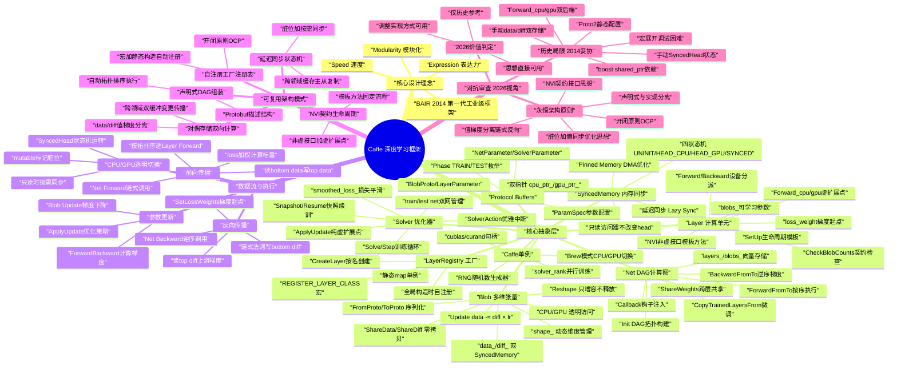

# Caffe 深度学习框架架构深度分析

> 通过七概念方法论（R-复盘/I-洞察/E-萃取/V-对抗审查）系统性分析 BVLC Caffe 框架的核心架构，提炼可跨领域迁移的设计模式。

## 一、概述

Caffe（Convolutional Architecture for Fast Feature Embedding）是 Berkeley AI Research (BAIR) 于2014年发布的第一代工业级开源深度学习框架。核心设计理念：expression（表达力）、speed（速度）、modularity（模块化）。本分析从架构师视角出发，聚焦核心抽象层次与设计模式，不涉及算法调优或具体模型训练。

源码根目录：[caffex](file:///d:/spaces/SpecWeave/external/chaos/caffe/caffex)

## 核心架构思维导图

## 二、核心抽象层次（从底向上）

### 2.1 SyncedMemory：CPU/GPU 透明内存同步
[syncedmem.hpp](file:///d:/spaces/SpecWeave/external/chaos/caffe/caffex/include/caffe/syncedmem.hpp#L57-L91)

SyncedMemory 是 Caffe 最底层的内存抽象，封装了 CPU 主机内存与 GPU 设备内存之间的同步管理。其核心设计是一个**四状态机**：

- **UNINITIALIZED**：初始状态，内存未分配
- **HEAD_AT_CPU**：最新数据在 CPU 端，GPU 副本过期或不存在
- **HEAD_AT_GPU**：最新数据在 GPU 端，CPU 副本过期或不存在
- **SYNCED**：CPU 和 GPU 数据一致，两端均为最新

核心机制：
- **双指针设计**：`cpu_ptr_` 和 `gpu_ptr_` 分别持有两端内存地址，由 `own_cpu_data_`/`own_gpu_data_` 标记所有权
- **延迟同步（Lazy Sync）**：只有在访问非最新端数据时才触发 `to_cpu()` 或 `to_gpu()` 拷贝，避免不必要的数据传输
- **访问器语义区分**：`cpu_data()/gpu_data()` 为只读访问，不改变 head 状态；`mutable_cpu_data()/mutable_gpu_data()` 为写访问，自动将 head 标记为对应设备并使另一端过期
- **Pinned Memory 优化**：GPU 模式下使用 `cudaMallocHost` 分配页锁定内存，加速 DMA 传输

### 2.2 Blob：多维张量与数据/梯度对偶存储
[blob.hpp](file:///d:/spaces/SpecWeave/external/chaos/caffe/caffex/include/caffe/blob.hpp#L23-L278)

Blob 是 Caffe 的基本计算单元，封装了多维数组的存储、形状管理与序列化。核心特征：

- **data_/diff_ 双 SyncedMemory**：每个 Blob 内部持有两个 SyncedMemory 对象——`data_` 存储前向传播的激活值/参数值，`diff_` 存储反向传播的梯度值。这一对偶设计完美契合深度学习中**值-梯度**对称的计算需求
- **Shape 管理**：通过 `shape_`（vector<int>）存储任意维度的张量形状，支持 `Reshape()` 动态调整形状（只增容不释放，避免频繁分配释放），`count()` 返回元素总数，支持负索引的 `CanonicalAxisIndex()`
- **CPU/GPU 访问器**：提供 `cpu_data()/gpu_data()/mutable_cpu_data()/mutable_gpu_data()` 等访问器，转发到内部 SyncedMemory 的对应方法，对上层完全透明
- **序列化支持**：`FromProto()`/`ToProto()` 与 BlobProto 消息互转，支持模型权重的保存与加载
- **ShareData/ShareDiff**：支持 Blob 间数据共享，通过 shared_ptr 重置指针实现零拷贝权重共享
- **数学运算辅助**：`asum_data()/asum_diff()/sumsq_data()/sumsq_diff()/scale_data()/scale_diff()` 提供常用范数计算和缩放操作
- **Update() 方法**：执行 `data -= diff * lr` 的参数更新，是梯度下降的原子操作

### 2.3 Layer：计算单元的契约式设计
[layer.hpp](file:///d:/spaces/SpecWeave/external/chaos/caffe/caffex/include/caffe/layer.hpp#L32-L476)

Layer 是 Caffe 的计算单元抽象，采用经典的**NVI（Non-Virtual Interface）模板方法模式**实现契约式设计：

- **SetUp 生命周期（非虚函数，模板方法）**：[layer.hpp:67-73](file:///d:/spaces/SpecWeave/external/chaos/caffe/caffex/include/caffe/layer.hpp#L67-L73) 定义了标准初始化流程：`CheckBlobCounts()` → `LayerSetUp()` → `Reshape()` → `SetLossWeights()`，子类不可覆盖此流程
- **Forward/Backward 模板方法**：[layer.hpp:126-127](file:///d:/spaces/SpecWeave/external/chaos/caffe/caffex/include/caffe/layer.hpp#L126-L127) 和 [layer.hpp:150-152](file:///d:/spaces/SpecWeave/external/chaos/caffe/caffex/include/caffe/layer.hpp#L150-L152) 为非虚内联函数，统一处理 Reshape、设备分派（switch(Caffe::mode())）、loss 加权计算，子类只需实现 `Forward_cpu/gpu` 和 `Backward_cpu/gpu` 虚函数
- **虚扩展点**：`LayerSetUp()`（层特定初始化）、`Reshape()`（纯虚，输出形状推断）、`Forward_cpu()`（纯虚）、`Forward_gpu()`（默认fallback到CPU）、`Backward_cpu()`（纯虚）、`Backward_gpu()`（默认fallback到CPU）
- **契约函数**：通过 `ExactNumBottomBlobs()/MinBottomBlobs()/MaxBottomBlobs()/ExactNumTopBlobs()/MinTopBlobs()/MaxTopBlobs()/EqualNumBottomTopBlobs()/AutoTopBlobs()` 等虚函数声明输入输出契约，`CheckBlobCounts()` 在 SetUp 时自动验证
- **loss_weight 机制**：[layer.hpp:389-403](file:///d:/spaces/SpecWeave/external/chaos/caffe/caffex/include/caffe/layer.hpp#L389-L403) 在 SetUp 时将 loss_weight 写入 top blob 的 diff_ 区域，作为反向传播梯度的起点（上游梯度初始值），Forward 时通过点积计算标量 loss
- **参数管理**：`blobs_` 向量存储层的可学习参数（权重、偏置），`param_propagate_down_` 控制每个参数是否需要梯度

### 2.4 Net：声明式DAG计算图
[net.hpp](file:///d:/spaces/SpecWeave/external/chaos/caffe/caffex/include/caffe/net.hpp#L24-L340)

Net 将多个 Layer 连接成有向无环图（DAG），负责网络拓扑构建与按序执行：

- **layers_/blobs_ 向量**：`layers_` 存储网络中所有层的 shared_ptr，`blobs_` 存储所有中间激活 blob（含参数 blob），通过 `layer_names_/blob_names_` 和对应的 index map 按名查找
- **DAG 拓扑构建 Init()**：从 NetParameter 解析层定义，通过 `AppendTop()`/`AppendBottom()` 建立 blob 名称到实际存储的映射，`available_blobs` 集合追踪当前可用的中间结果，自动处理扇入扇出
- **按序执行**：`ForwardFromTo(start, end)` 按拓扑顺序从 start 层到 end 层依次调用 Forward，`BackwardFromTo(start, end)` 逆序调用 Backward；`Forward()`/`Backward()` 默认执行全网络
- **ShareWeights 权重共享**：[net.hpp:100](file:///d:/spaces/SpecWeave/external/chaos/caffe/caffex/include/caffe/net.hpp#L100) 通过 ParamSpec 的 name 字段实现跨层参数共享，共享底层 SyncedMemory
- **Callback 钩子机制**：[net.hpp:231-253](file:///d:/spaces/SpecWeave/external/chaos/caffe/caffex/include/caffe/net.hpp#L231-L253) 提供 `before_forward_/after_forward_/before_backward_/after_backward_` 回调注入点，支持在执行前后插入自定义逻辑（如调试、计时、快照）
- **参数管理**：`params_` 收集所有可学习参数，`learnable_params_` 过滤出需要更新的参数（考虑共享与 lr_mult=0），`params_lr_/params_weight_decay_` 存储每个参数的学习率和权重衰减系数
- **CopyTrainedLayersFrom**：支持从预训练模型拷贝权重，用于微调（fine-tuning）

### 2.5 Solver：优化策略与训练循环
[solver.hpp](file:///d:/spaces/SpecWeave/external/chaos/caffe/caffex/include/caffe/solver.hpp#L42-L134)

Solver 封装优化算法与训练循环，是训练流程的入口：

- **Solve/Step 训练循环**：`Solve()` 是训练主入口，循环调用 `Step(iters)` 执行指定次数的迭代；每次迭代执行 ForwardBackward → ApplyUpdate
- **ApplyUpdate 纯虚函数**：[solver.hpp:98](file:///d:/spaces/SpecWeave/external/chaos/caffe/caffex/include/caffe/solver.hpp#L98) 是优化策略的扩展点，不同求解器（SGD、Adam、RMSProp等）通过覆盖此方法实现具体的参数更新规则
- **Snapshot/Resume 快照**：`Snapshot()` 保存模型权重（.caffemodel）和求解器状态（.solverstate），`Restore()` 从快照恢复继续训练，支持训练中断后无缝续训
- **SolverAction 回调**：[solver.hpp:21-33](file:///d:/spaces/SpecWeave/external/chaos/caffe/caffex/include/caffe/solver.hpp#L21-L33) 通过 `action_request_function_` 支持外部请求 STOP 或 SNAPSHOT（如 Ctrl+C 信号处理），优雅中断训练
- **train/test net 管理**：`net_` 是训练网络，`test_nets_` 是多个测试网络，`TestAll()/Test()` 定期在测试集上评估
- **Callback 钩子**：[solver.hpp:78-89](file:///d:/spaces/SpecWeave/external/chaos/caffe/caffex/include/caffe/solver.hpp#L78-L89) 提供 `on_start()/on_gradients_ready()` 回调点，支持学习率调度、日志记录等扩展
- **损失平滑**：`smoothed_loss_` 对损失做指数移动平均，稳定显示

### 2.6 LayerRegistry：自注册工厂
[layer_factory.hpp](file:///d:/spaces/SpecWeave/external/chaos/caffe/caffex/include/caffe/layer_factory.hpp#L56-L137)

LayerRegistry 实现了经典的**自注册工厂模式**，无需修改工厂代码即可扩展新层：

- **静态 map 单例**：[layer_factory.hpp:61-64](file:///d:/spaces/SpecWeave/external/chaos/caffe/caffex/include/caffe/layer_factory.hpp#L61-L64) `Registry()` 返回函数内静态的 `CreatorRegistry`（map<string, Creator>）单例，程序启动时自动初始化
- **LayerRegisterer 构造时自注册**：[layer_factory.hpp:117-124](file:///d:/spaces/SpecWeave/external/chaos/caffe/caffex/include/caffe/layer_factory.hpp#L117-L124) 注册器类的构造函数调用 `AddCreator()`，利用全局静态变量在 main() 之前构造的特性实现自动注册
- **REGISTER_LAYER_CLASS 宏**：[layer_factory.hpp:131-137](file:///d:/spaces/SpecWeave/external/chaos/caffe/caffex/include/caffe/layer_factory.hpp#L131-L137) 一行代码完成类的注册——自动生成 Creator 函数并为 float/double 两种类型分别实例化注册器
- **REGISTER_LAYER_CREATOR 宏**：支持自定义工厂函数（用于需要多后端选择的层，如 Convolution 层选择 cuDNN 实现）
- **CreateLayer 工厂方法**：[layer_factory.hpp:75-84](file:///d:/spaces/SpecWeave/external/chaos/caffe/caffex/include/caffe/layer_factory.hpp#L75-L84) 根据 LayerParameter 中的 type 字符串查找 Creator 并构造 Layer 实例，类型不存在时给出友好错误提示和已知类型列表

### 2.7 Caffe 单例：全局运行时环境
[common.hpp](file:///d:/spaces/SpecWeave/external/chaos/caffe/caffex/include/caffe/common.hpp#L102-L189)

Caffe 类是线程局部的单例，持有全局运行时状态：

- **Brew 模式切换**：`mode_` 成员（CPU/GPU 枚举）通过 `set_mode()` 全局切换，所有 Layer 的 Forward/Backward 通过 `Caffe::mode()` 查询当前设备
- **RNG 随机数生成器**：`random_generator_` 封装 boost RNG（CPU）和 curand（GPU），提供统一的随机数接口；`set_random_seed()` 支持设置随机种子保证可复现性
- **cuBLAS/cuRAND 句柄**：GPU 模式下持有 `cublas_handle_` 和 `curand_generator_`，避免每次调用都创建销毁
- **并行训练支持**：`solver_count_/solver_rank_/multiprocess_` 支持数据并行多卡训练，`root_solver()` 判断是否为主进程（用于日志、快照等只执行一次的操作）
- **线程局部存储**：使用 "thread local" 语义，每个线程有独立的 Caffe 实例，避免多线程竞争

### 2.8 Protocol Buffers：声明式配置驱动
[caffe.proto](file:///d:/spaces/SpecWeave/external/chaos/caffe/caffex/src/caffe/proto/caffe.proto)

Caffe 使用 Google Protocol Buffers（proto2）作为所有配置的序列化格式，实现声明式配置驱动：

- **BlobProto**：[caffe.proto:10-22](file:///d:/spaces/SpecWeave/external/chaos/caffe/caffex/src/caffe/proto/caffe.proto#L10-L22) Blob 的序列化格式，含 shape、data、diff 字段，支持 float/double 精度
- **LayerParameter**：[caffe.proto:326-349](file:///d:/spaces/SpecWeave/external/chaos/caffe/caffex/src/caffe/proto/caffe.proto#L326-L349) 层配置，包含 name、type、bottom、top、loss_weight、param、blobs 等通用字段，以及各种层的 xxx_param 扩展字段（如 ConvolutionParameter、PoolingParameter）
- **NetParameter**：[caffe.proto:64-96](file:///d:/spaces/SpecWeave/external/chaos/caffe/caffex/src/caffe/proto/caffe.proto#L64-L96) 网络配置，包含 name、input、layer 列表、state、force_backward 等
- **SolverParameter**：[caffe.proto:102-258](file:///d:/spaces/SpecWeave/external/chaos/caffe/caffex/src/caffe/proto/caffe.proto#L102-L258) 求解器配置，包含 net、train_net、test_net、base_lr、lr_policy、max_iter、momentum、weight_decay、snapshot 等优化超参数
- **ParamSpec**：[caffe.proto:299-320](file:///d:/spaces/SpecWeave/external/chaos/caffe/caffex/src/caffe/proto/caffe.proto#L299-L320) 参数规格，含 name（权重共享）、lr_mult、decay_mult、share_mode
- **Phase 枚举**：[caffe.proto:268-271](file:///d:/spaces/SpecWeave/external/chaos/caffe/caffex/src/caffe/proto/caffe.proto#L268-L271) TRAIN/TEST 两阶段，通过 NetStateRule 实现条件包含/排除层
- **NetState/NetStateRule**：[caffe.proto:273-295](file:///d:/spaces/SpecWeave/external/chaos/caffe/caffex/src/caffe/proto/caffe.proto#L273-L295) 支持按 phase、level、stage 灵活配置网络结构，实现一个 prototxt 多场景复用
- **xxx_param 扩展**：每种 Layer 类型有自己的 Param 消息（约50+种），通过 protobuf 的扩展机制注册到 LayerParameter

## 三、数据流与执行机制

### 3.1 前向传播数据流

前向传播的调用链为：`Net::Forward(&loss)` → `ForwardFromTo(0, layers_.size()-1)` → 按拓扑顺序逐层调用 `Layer::Forward(bottom, top)`

Layer::Forward 内部执行流程：[layer.hpp:413-446](file:///d:/spaces/SpecWeave/external/chaos/caffe/caffex/include/caffe/layer.hpp#L413-L446)
1. 调用 `Reshape(bottom, top)` 根据输入形状调整输出形状
2. `switch (Caffe::mode())` 分派到设备实现
   - CPU 模式：调用 `Forward_cpu(bottom, top)`，读 bottom[*]->cpu_data()，计算写 top[*]->mutable_cpu_data()
   - GPU 模式：调用 `Forward_gpu(bottom, top)`，读 bottom[*]->gpu_data()，计算写 top[*]->mutable_gpu()
3. loss 加权计算：遍历所有 top blob，如果该 top 有非零 loss_weight（已在 SetLossWeights 中写入 diff 区），则通过 `caffe_cpu_dot/gpu_dot` 计算 data 与 loss_weight 的点积，累加到总 loss 中返回

关键设计：loss_weight 被巧妙地存储在 top blob 的 diff_ 中，既作为前向计算 loss 的权重，又作为反向传播的梯度起点（上游梯度初始值），实现了"损失层即梯度源"的统一抽象。

### 3.2 反向传播梯度链

反向传播的调用链为：`Net::Backward()` → `BackwardFromTo(layers_.size()-1, 0)` → 逆拓扑序逐层调用 `Layer::Backward(top, propagate_down, bottom)`

Layer::Backward 内部执行流程：[layer.hpp:448-462](file:///d:/spaces/SpecWeave/external/chaos/caffe/caffex/include/caffe/layer.hpp#L448-L462)
1. `switch (Caffe::mode())` 分派到设备实现
   - CPU 模式：调用 `Backward_cpu(top, propagate_down, bottom)`
   - GPU 模式：调用 `Backward_gpu(top, propagate_down, bottom)`
2. Backward 实现中：读 `top[*]->cpu_diff()/gpu_diff()`（上游传来的梯度），通过链式法则计算：
   - 写 `bottom[*]->mutable_cpu_diff()/mutable_gpu_diff()`（传给下游的梯度，受 propagate_down 标志控制）
   - 写 `blobs_[i]->mutable_cpu_diff()/mutable_gpu_diff()`（参数梯度，用于参数更新）
3. 梯度起点：损失层的 SetLossWeights 已经将 loss_weight 写入 top diff，这是整个反向传播链式法则的初始梯度（∂L/∂y = loss_weight，通常为 1）

关键设计：`propagate_down` 向量控制是否需要对每个 bottom 计算梯度，Net 自动分析哪些 bottom 不需要反传（如数据层输入、不需要梯度的分支），跳过不必要计算，节省资源。

### 3.3 参数更新

参数更新的调用链为：`Solver::Step(iters)` → 每次迭代：
1. `net_->ForwardBackward()` 完成前向+反向，所有参数 blob 的 diff_ 已填入梯度
2. 调用回调 `on_gradients_ready()`（学习率调度器在此更新学习率）
3. `ApplyUpdate()` 执行实际参数更新，具体更新规则由子类实现（SGD、Adam等）
4. SGD 等求解器最终调用 `net_->Update()` → 遍历每个可学习参数 blob，调用 `blob->Update()`

Blob::Update() 是参数更新的原子操作：`data -= diff * lr`（在 SyncedMemory 上执行数学运算，自动处理 CPU/GPU 同步）。整个过程中，学习率（lr_mult）、权重衰减（decay_mult）等超参数在 Net 层面预先应用到 diff 上，Blob 只关心最朴素的梯度下降更新。

### 3.4 CPU/GPU透明切换

SyncedMemory 的状态机保证了 CPU/GPU 切换对 Layer 实现者完全透明：

- 当 Layer 调用 `mutable_cpu_data()` 获取写指针时，head 被标记为 HEAD_AT_CPU，下次 GPU 访问自动触发 `to_gpu()` 同步
- 当 Layer 调用 `cpu_data()` 获取只读指针时，如果当前 head 是 HEAD_AT_GPU，则自动触发 `to_cpu()` 同步后返回
- 当状态为 SYNCED 时，任意一端访问都不需要拷贝
- UNINITIALIZED 状态首次访问时自动分配内存

Layer 实现者完全不需要关心数据当前在哪一端、是否需要拷贝，只需通过访问器获取指针即可使用。状态转移和数据同步完全由 SyncedMemory 内部封装。

## 四、可复用架构模式库

### 模式1：延迟同步状态机（Lazy Sync State Machine）

**触发场景**：当系统需要维护同一数据在多个存储/计算位置（如 CPU/GPU、内存/磁盘、缓存/主存）的副本，且数据传输成本较高时。

**核心结构**：
1. 定义一个枚举表示"哪个位置持有最新数据"（head）
2. 为每个位置维护独立的指针/句柄
3. 提供两类访问器：只读访问器（不改变 head）和可写访问器（将 head 标记为当前位置）
4. 只读访问时若目标位置不是 head，触发同步拷贝；可写访问时标记其他位置过期
5. 状态通常包括：未初始化、head 在 A、head 在 B、已同步

**Caffe 证据**：SyncedMemory [syncedmem.hpp:57-91](file:///d:/spaces/SpecWeave/external/chaos/caffe/caffex/include/caffe/syncedmem.hpp#L57-L91) 定义了四状态（UNINITIALIZED/HEAD_AT_CPU/HEAD_AT_GPU/SYNCED），通过 cpu_data()/mutable_cpu_data()/gpu_data()/mutable_gpu_data() 访问器自动触发 to_cpu()/to_gpu() 同步。

**反模式**：
- 每次访问都双向同步（eager sync），造成不必要的数据传输开销
- 不区分只读/可写访问，导致只读访问也污染状态
- 在业务代码中手动管理同步时机，容易遗漏导致脏数据
- 缺乏所有权标记，导致重复释放或内存泄漏

**跨领域迁移**：
- Web 前端与后端状态同步（本地缓存与服务器）
- 数据库主从复制的读写分离
- 多 Tier 缓存系统（L1/L2/L3/内存/磁盘）
- 编辑器的内存文档与磁盘文件同步
- 游戏引擎中 CPU 物理计算与 GPU 渲染数据的同步

### 模式2：自注册工厂注册表（Self-Registering Factory Registry）

**触发场景**：当系统需要支持可插拔扩展，新增实现类时不希望修改工厂或核心代码（满足开闭原则 OCP），且能通过字符串/标识符动态创建实例时。

**核心结构**：
1. 一个模板化的工厂类，内部维护静态的「标识符→创建函数」映射（map）
2. 映射通过函数内局部静态变量初始化（Meyers' Singleton），避免初始化顺序问题
3. 一个注册器（Registerer）类，其构造函数向工厂映射中添加条目
4. 一个宏，在每个具体实现类的编译单元中定义一个静态注册器实例，利用全局静态对象在 main() 之前构造的特性完成自注册
5. 工厂的 Create 方法根据标识符查找创建函数并实例化对象

**Caffe 证据**：LayerRegistry [layer_factory.hpp:56-113](file:///d:/spaces/SpecWeave/external/chaos/caffe/caffex/include/caffe/layer_factory.hpp#L56-L113) 提供 Registry() 单例、AddCreator()、CreateLayer()；LayerRegisterer [layer_factory.hpp:117-124](file:///d:/spaces/SpecWeave/external/chaos/caffe/caffex/include/caffe/layer_factory.hpp#L117-L124) 在构造时注册；REGISTER_LAYER_CLASS 宏 [layer_factory.hpp:131-137](file:///d:/spaces/SpecWeave/external/chaos/caffe/caffex/include/caffe/layer_factory.hpp#L131-L137) 为 float/double 双精度自动生成注册代码。

**反模式**：
- 工厂类中维护大段 switch-case 或 if-else，每新增类型都要修改工厂
- 手动在初始化函数中调用注册，忘记调用则类型"丢失"
- 注册映射使用全局变量，遭遇静态初始化顺序问题（static initialization order fiasco）
- 注册失败时静默失败，创建时才发现类型未知

**跨领域迁移**：
- IDE/编辑器的插件系统
- 游戏引擎的组件/节点类型注册
- 序列化框架的类型解析器
- Web 框架的路由注册与中间件
- 测试框架的测试用例自动发现
- 依赖注入容器的类型绑定

### 模式3：对偶存储双向计算（Dual Storage for Bidirectional Computation）

**触发场景**：当计算过程天然具有"正向-反向"对偶结构（如函数求值与梯度计算、编码与解码、编译中的前向类型推断与反向检查），且正向和反向共享同一组"位置"但流动方向不同时。

**核心结构**：
1. 每个计算单元持有两份对偶存储：一份存储正向流动的值（value/activation/data），一份存储反向流动的值（gradient/cotangent/diff）
2. 正向计算读取前序单元的值，写入本单元的值
3. 反向计算读取后序单元的梯度，写入本单元的梯度和参数的梯度
4. 两份存储在物理上独立、在逻辑上对偶，使用相同的形状/索引方式
5. 对偶结构天然支持链式组合，无需额外的"梯度tape"或"Wengert list"

**Caffe 证据**：Blob [blob.hpp:270-271](file:///d:/spaces/SpecWeave/external/chaos/caffe/caffex/include/caffe/blob.hpp#L270-L271) 内部持有 data_ 和 diff_ 两个 SyncedMemory；Forward 读 bottom data 写 top data（[layer.hpp:419](file:///d:/spaces/SpecWeave/external/chaos/caffe/caffex/include/caffe/layer.hpp#L419)），Backward 读 top diff 写 bottom diff 和 param diff（[layer.hpp:454](file:///d:/spaces/SpecWeave/external/chaos/caffe/caffex/include/caffe/layer.hpp#L454)）；loss_weight 写入 top diff 作为反向起点（[layer.hpp:399-400](file:///d:/spaces/SpecWeave/external/chaos/caffe/caffex/include/caffe/layer.hpp#L399-L400)）。

**反模式**：
- 正向和反向使用完全不同的数据结构，转换成本高
- 梯度存储在外部独立结构（如全局map），与值的生命周期不同步
- 在计算图节点上动态分配/释放梯度内存，造成内存碎片
- 不区分值和梯度的访问方式，导致误用

**跨领域迁移**：
- 自动微分/可微编程系统（PyTorch autograd、JAX）
- 渲染中的光线追踪（正向相机光线与反向光源光线）
- 编译器的数据流分析（前向可达定义 + 反向活跃变量）
- 概率编程中的前向采样与反向推断
- 电子电路仿真（节点电压与支路电流的对偶）
- 响应式编程中的值传播与变更通知反向传播

### 模式4：NVI契约生命周期（Non-Virtual Interface Contract Lifecycle）

**触发场景**：当框架需要定义稳定的算法骨架和生命周期流程，允许子类扩展特定步骤但不允许修改整体流程（模板方法模式的强化版），并需要在基类中统一处理横切关注点时。

**核心结构**：
1. 基类将公共接口方法定义为**非虚函数**（public non-virtual），这是 NVI 的核心
2. 非虚接口方法内部实现固定流程骨架，按固定顺序调用若干步骤
3. 可扩展的步骤定义为 **private/protected 虚函数**，子类覆盖这些步骤提供自定义行为
4. 基类统一在非虚接口中处理横切关注点：参数校验、日志、缓存、同步、设备分派、状态管理等
5. 契约检查函数（如输入输出数量检查）在基类流程中自动执行，子类只需通过虚函数声明契约

**Caffe 证据**：Layer::SetUp [layer.hpp:67-73](file:///d:/spaces/SpecWeave/external/chaos/caffe/caffex/include/caffe/layer.hpp#L67-L73) 是非虚函数，固定执行 CheckBlobCounts→LayerSetUp→Reshape→SetLossWeights；Layer::Forward [layer.hpp:413-446](file:///d:/spaces/SpecWeave/external/chaos/caffe/caffex/include/caffe/layer.hpp#L413-L446) 是非虚函数，统一处理 Reshape、switch(mode) 设备分派、loss 点积计算；子类只实现 Forward_cpu/Forward_gpu/Backward_cpu/Backward_gpu 等私有虚函数；ExactNumBottomBlobs 等契约虚函数由 CheckBlobCounts 自动验证。

**反模式**：
- 将所有方法定义为 public virtual，子类可以任意覆盖流程甚至破坏基类不变量
- 基类不提供流程骨架，每个子类重复实现相同的前/后置处理
- 没有契约检查，错误只在运行时深处以晦涩方式暴露
- 横切关注点（日志、计时、错误处理）散落在各个子类实现中

**跨领域迁移**：
- UI 框架的组件生命周期（create→mount→render→update→unmount）
- 游戏引擎的 MonoBehaviour 生命周期（Awake→Start→Update→OnDestroy）
- 构建系统的 Task 执行流程（依赖检查→准备→执行→收尾）
- Web 框架的中间件管道与 Handler 生命周期
- 测试框架的 fixture 生命周期（setUp→test→tearDown）
- ORM 框架的模型钩子（beforeSave→save→afterSave）

### 模式5：声明式DAG组装（Declarative DAG Assembly）

**触发场景**：当计算/处理流程可以表示为有向无环图（DAG），节点是处理单元、边是数据依赖，且希望通过配置文件而非硬编码来定义和修改图结构时。

**核心结构**：
1. 一个统一的配置格式（protobuf/JSON/YAML/DSL）声明节点列表和连接关系
2. 每个节点声明其输入（依赖）和输出（产物）的名称，而非内存地址/指针
3. 组装器（Assembler/Builder）解析配置，通过名称查找建立节点间的实际连接
4. 自动按拓扑顺序执行，无需人工指定执行顺序
5. 支持条件包含/排除节点（根据阶段、模式等）
6. 节点间的中间产物统一由容器管理，节点只声明依赖不关心数据存放位置

**Caffe 证据**：NetParameter [caffe.proto:64-96](file:///d:/spaces/SpecWeave/external/chaos/caffe/caffex/src/caffe/proto/caffe.proto#L64-L96) 通过 repeated LayerParameter 声明层列表；每个 LayerParameter 含 bottom/top 名称列表；Net::Init() 通过 AppendTop/AppendBottom [net.hpp:258-267](file:///d:/spaces/SpecWeave/external/chaos/caffe/caffex/include/caffe/net.hpp#L258-L267) 利用 available_blobs 集合解析名称引用建立连接；FilterNet [net.hpp:224-225](file:///d:/spaces/SpecWeave/external/chaos/caffe/caffex/include/caffe/net.hpp#L224-L225) 根据 NetStateRule 过滤层；Callback 钩子支持在不修改核心执行代码的情况下扩展行为。

**反模式**：
- 硬编码节点连接关系，修改流程需要重新编译
- 用户手动管理执行顺序，容易引入循环依赖或顺序错误
- 节点直接持有其他节点的指针/引用，耦合度高
- 缺乏条件配置能力，不同场景需要复制多份配置
- 中间数据由节点自行管理，内存生命周期混乱

**跨领域迁移**：
- 现代深度学习框架（TensorFlow/PyTorch/ONNX）的计算图
- 数据处理管道（ETL/Airflow/Prefect/DAG 调度器）
- CI/CD 流水线定义（GitHub Actions/Jenkins Pipeline/GitLab CI）
- 编译器的 IR Pass 流水线
- 依赖注入容器的服务依赖图
- 音视频处理滤镜图（GStreamer/FFmpeg filtergraph）
- 工作流引擎与 BPM 系统

## 五、对抗审查：历史局限 vs 永恒原则

### 5.1 历史局限性设计（2014年技术条件的妥协）

1. **手动 SyncedHead 状态管理**：需要开发者理解四状态机的语义，mutable_xxx/xxx 访问器区分不直观，状态标记错误会导致隐式同步开销或脏数据。2026 年的方案通常使用智能指针+写时复制（COW）、或直接使用统一内存（UM/Managed Memory）由硬件/驱动管理一致性。

2. **宏展开静态注册**：REGISTER_LAYER_CLASS 宏通过全局静态变量构造时注册，依赖 C++ 静态初始化顺序的模糊保证；静态注册的类型无法在运行时卸载，不支持动态加载插件（.so/.dll）。现代 C++ 更推荐使用显式注册函数或模块加载器。

3. **手动 data/diff 双存储**：每个 Blob 显式维护 data_ 和 diff_ 两个 SyncedMemory，新增对偶量（如二阶导、动量、方差）需要修改 Blob 类本身。现代自动微分框架通过 Variable/Tensor 类统一管理值与任意数量的梯度槽（gradient slots）。

4. **Forward_cpu/gpu 手动双后端**：每个运算需要写两遍几乎相同的实现（CPU和GPU），代码冗余度高，容易引入后端不一致 bug。现代方案（如 TVM、MLIR、Triton、CUDA Graphs）使用统一中间表示自动生成多后端代码，或使用单源编译器（如 SYCL、HIP）。

5. **Proto2 文本静态 DAG**：网络结构通过 prototxt 静态声明，不支持控制流（循环、条件分支），所有层的拓扑在初始化时固定；RNN/LSTM 需要静态展开为有限步长。2026 年的主流框架都支持动态图（define-by-run）和静态控制流算子。

6. **boost::shared_ptr 依赖**：Caffe 大量使用 boost::shared_ptr（[common.hpp:4](file:///d:/spaces/SpecWeave/external/chaos/caffe/caffex/include/caffe/common.hpp#L4)、[common.hpp:79](file:///d:/spaces/SpecWeave/external/chaos/caffe/caffex/include/caffe/common.hpp#L79)），而 C++11 标准已引入 std::shared_ptr；选择 boost 是出于 2014 年 CUDA 编译器对 C++11 支持不完善的妥协。现代项目应使用标准库智能指针。

### 5.2 永恒架构原则（2026年仍然成立）

1. **脏位+懒同步思想**：SyncedMemory 的"按需同步"而非"即时同步"思想，在缓存一致性、分布式一致性、前端状态管理中都是核心原则。写时标记脏、读时按需同步，是最小化传输成本的通用优化策略。

2. **开闭原则 OCP**：LayerRegistry 自注册工厂完美体现了"对扩展开放，对修改关闭"——新增 75+ 种 Layer 不需要修改任何核心框架代码，只需新增 .cpp/.hpp 文件加一个 REGISTER_LAYER_CLASS 宏。这一原则在现代插件架构中仍然是黄金法则。

3. **值/梯度分离与链式反向**：Blob 的 data/diff 对偶存储、反向传播按逆拓扑链式计算梯度，这一设计精确映射了**反向模式自动微分（reverse-mode AD）**的数学本质。所有现代深度学习框架（PyTorch、TensorFlow、JAX）尽管实现细节不同，但核心抽象依然是"值 + 梯度 + 链式法则"。

4. **NVI 契约接口思想**：非虚接口模式将"什么是不变的流程骨架"和"什么是可变的扩展点"严格分离，基类统一处理横切关注点（设备分派、形状检查、loss计算），子类只关心核心算法。这是框架设计中保证健壮性和可演进性的核心手段。

5. **声明式与实现分离**：通过 prototxt 声明网络结构而非代码硬编码，将"做什么"（what）与"怎么做"（how）分离，使得网络结构的修改不需要重新编译、可以由非程序员（算法工程师、研究员）定义，也便于可视化、自动优化、模型交换。这一原则在云原生（Kubernetes YAML）、基础设施即代码（Terraform）中已成为工业标准。

### 5.3 2026年价值判定

**直接可用的模式思想**：
- 懒同步状态机模式（可直接应用于多端数据同步场景）
- 自注册工厂模式（核心思想直接可用，宏替换为更现代的机制即可）
- NVI 契约生命周期模式（现代 C++/Java/Go 中依然是框架设计的标准手法）
- 声明式 DAG 组装思想（配置驱动、按名连接、自动拓扑排序）

**调整实现方式后可用的模式**：
- 对偶存储双向计算：核心的"值-梯度"对偶思想永恒，但实现上应使用更灵活的多槽位梯度存储而非固定双存储；动态图场景下结合 tape 机制使用
- CPU/GPU 透明切换：统一内存、跨平台编译器（SYCL/HIP）、MLIR 等技术可以减少手写双后端的工作量，但"访问器封装同步"的接口设计思想依然适用
- protobuf 配置驱动：具体序列化格式可替换为 JSON/YAML/TOML 或自定义 DSL，但"声明式配置 + 代码生成/反射"的模式依然成立

**基本过时仅历史参考的设计**：
- C++ 宏驱动的静态注册（在支持动态链接和反射的语言中已被更优雅的机制取代）
- 固定 data/diff 双 Blob 存储（现代框架支持任意阶微分和多个优化器状态槽）
- 手动 Forward_cpu/Forward_gpu 双份实现（编译器自动生成多后端是趋势）
- 完全静态 DAG（现代应用需要动态控制流，即使是静态图编译器也在引入控制流算子）

### 5.4 采纳的模式修正

基于2026年技术视角，对Caffe经典模式提出以下修正建议：

1. **延迟同步增加显式 sync**：除了 mutable_/const 访问器隐式标记脏位，增加显式 `sync()`/`mark_clean()` 方法，让调用者可以在预知需要两端数据时主动触发同步，避免隐式同步发生在关键路径；同时提供 `head()` 查询接口方便调试。

2. **对偶存储补充术语建议**：使用更通用的术语（如 `value`/`gradient` 或 `forward`/`adjoint`）替代 data/diff，降低新上手用户的认知门槛；梯度存储设计为可扩展的 map 或 vector，支持动量、二阶矩、一阶矩等多个优化器状态，而非固定两个槽位。

3. **工厂模式补充显式注册建议**：保留自注册的便捷性，同时提供显式 `Register()` 函数调用方式，支持动态加载/卸载插件；使用 type_id 或字符串_view 替代裸字符串做 key，减少拼写错误；增加 `IsRegistered()` 查询接口。

4. **声明式DAG补充动态控制流边界**：在声明式配置中增加控制流节点原语（If、While、For、Switch/Merge），支持有限形式的动态行为而非全部展开；提供命令式（define-by-run）和声明式（define-and-run）两种模式的桥接，让用户在易用性和性能间权衡。

## 六、总结与启示

Caffe 作为第一代工业级深度学习框架，其 Blob-Layer-Net-Solver 四层抽象精准映射了深度学习的本质——张量（Blob）在计算单元（Layer）构成的有向图（Net）上流动，通过反向传播的链式法则更新参数，由求解器（Solver）驱动训练循环。这一抽象层次划分深刻影响了后续所有框架：TensorFlow、PyTorch、MXNet、PaddlePaddle 等尽管在动态图、自动微分、多后端支持等方面有重大演进，但核心的"张量-算子-图-优化器"四层结构依然与 Caffe 一脉相承。

许多2014年的具体实现方式在2026年已被新技术取代——boost 库被 C++ 标准库取代，手写双后端被编译器自动代码生成取代，静态 protobuf DAG 被动态计算图取代，手动状态管理被统一内存和智能指针取代。但其背后的架构原则——**关注点分离**（SyncedMemory 管理内存、Blob 管理张量、Layer 管理计算、Net 管理连接、Solver 管理优化）、**契约式设计**（NVI 固定扩展点、契约函数自动验证）、**开闭原则**（自注册工厂零修改扩展）、**配置驱动**（声明式 prototxt 定义网络）、**懒同步优化**（脏位标记+按需拷贝）——仍然是现代系统设计的基石。这些原则超越了深度学习领域，适用于任何需要模块化、可扩展、高性能的软件系统。

Caffe 的历史局限也提供了宝贵的教训：框架设计必须为未来的演进留出空间——固定的双存储无法适配多优化器状态，完全静态图无法支持动态控制流，宏静态注册无法支持动态插件。优秀的架构不仅要解决当前问题，更要在核心抽象上提供足够的弹性，让未来的需求可以在不颠覆核心模型的前提下被接纳。

## 附录：文件统计

| 分类 | 路径 | 数量 |
|------|------|------|
| Layer实现 | src/caffe/layers/ | 75个.cpp |
| 核心头文件 | include/caffe/ | 80+个.hpp |
| 工具程序 | tools/ | 8个 |
| Protobuf消息 | caffe.proto | 12+个核心message |
