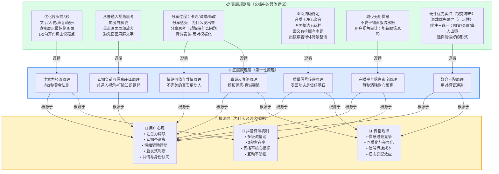
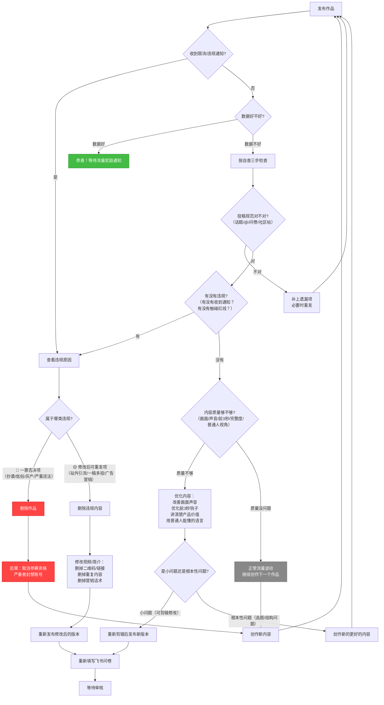
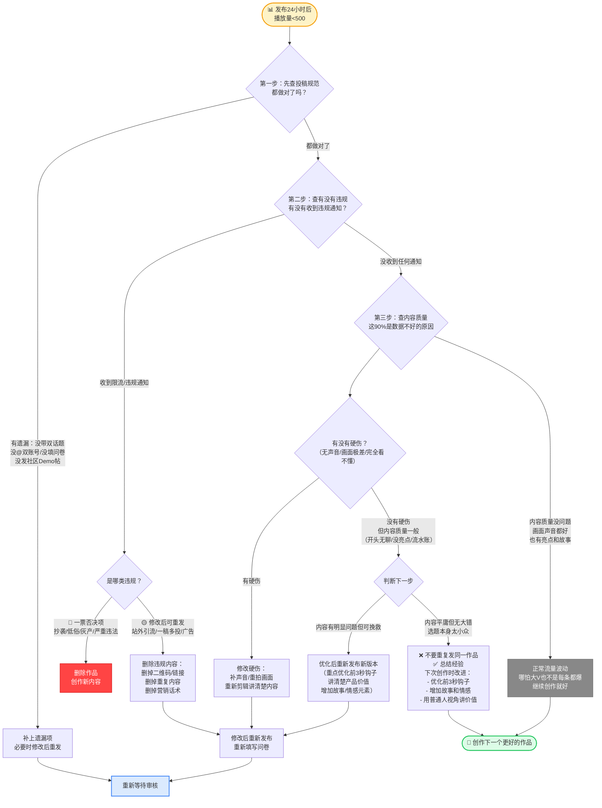

# 抖音人气赛道创作指南深度分析
## ——基于第一性原理的vibecoding内容传播方法论

> 本文基于《抖音人气赛道创作指南 - TRAEAI创造力大赛》官方文档，运用"学习+洞察+第一性原理"方法论进行系统性深度解读。不仅梳理参赛规则和创作技巧，更从心理学、传播学、算法机制角度拆解短视频传播的底层逻辑，提炼可迁移的内容创作方法论。

---

## 📋 执行摘要（核心结论速览）

**赛事核心规则**：必须先在TRAE官方社区初赛专区提交Demo帖，再在抖音发布带双话题（#vibecoding大赏 #traeai创造力大赛）并@双账号（@TRAE.ai @抖音科技）的图文/视频，最后填写飞书问卷，审核1-3个工作日后单条最高可获5W流量激励。征集期至2026年7月15日23:59。

**最重要的3个发现**：
1. **前3秒决定生死**：抖音多级流量池机制中，3秒留存率是第一道关卡——划走成本为零，必须用文字/人物/声音/配乐在3秒内给出足够强的价值信号
2. **真诚反套路是终极差异化**：当所有人都做到了画面清晰、声音清楚、前3秒有亮点（60分合格线），决定能否脱颖而出的是你的真实故事、独特思考和真诚表达——这些是无法被模板化的
3. **文化共鸣是最高维度**：130万赞的"诗云"证明，百万赞级别的作品需要超越功能/工具层面，进入文化/哲学层面，击中集体潜意识、创造敬畏感

**创作者最该记住的3个行动建议**：
1. **从情绪共鸣出发找选题，不要从技术出发**——"我自己需要解决XX痛点"比"我会XX技术能做XX"更容易做出爆款
2. **每一秒都要通过用户视角审计**——删掉这一秒，观众是否会少获得什么？如果不会，就删掉
3. **先完成再完美，先发布再迭代**——你的第一个作品可能数据不好，但不发第一个就永远不会有第二个；数据反馈比闭门优化有效100倍

**关键数据速览**：
- 抖音征集期：2026.06.16 – 2026.07.15 23:59
- 问卷链接：https://bytedance.larkoffice.com/share/base/form/shrcnzp18Sdf6XQxm8wGPPXDt4b
- 审核周期：1-3个工作日，通过抖音站内信通知
- 流量激励：单条最高5W

---

## 一、赛事概览与投稿规则

### 1.1 关键时间节点

| 项目 | 详情 |
|---|---|
| **整体赛程** | 2026年6月16日 00:00 - 2026年8月22日 23:59（北京时间） |
| **抖音征集期** | 2026.06.16 – 2026.07.15 23:59 |
| **参赛平台** | TRAE官方中文社区（TRAE AI创造力大赛专区） |
| **开发工具要求** | 全程使用 TRAE Work 或 TRAE IDE（国际版/中国版均可） |

### 1.2 参与流程（先社区后抖音的双重门槛）

> ⚠️ **必须同时满足以下两个条件，否则不计入抖音人气榜**：
> 1. 已通过大赛报名
> 2. 在TRAE官方社区初赛专区完成提交符合要求的Demo帖
>
> 仅在抖音发视频、未在TRAE官方社区提交参赛作品的，即使数据表现较好也不符合评审要求，相关获奖资格顺延至下一位合规作品。

完整参赛流程：

```
步骤1：使用TRAE Work/IDE开发作品
   ↓
步骤2：在TRAE官方中文社区初赛专区提交符合要求的Demo帖（必须先完成此步）
   ↓
步骤3：在抖音发布作品图文/视频（带双话题+双@，标题以「VibeCoding大赏」开头）
   ↓
步骤4：填写飞书问卷提交作品信息
   ↓
步骤5：等待1-3个工作日审核，通过抖音站内信查收通知
```

### 1.3 抖音发布要求（话题、@、标题、选题）

| 要求项 | 具体内容 |
|---|---|
| **话题标签** | `#vibecoding大赏` `#traeai创造力大赛`（两个都要有！） |
| **@账号** | @TRAE.ai @抖音科技（两个都要@！） |
| **标题建议** | 以「VibeCoding大赏」开头（更容易被官方看到） |
| **选题方向** | 必须与参赛作品一致；为具体创意作品；**禁止**：原理解析、资讯解读、课程教学等非创意类作品 |
| **投稿形式** | 图文 & 视频均可 |

**信息增量4个分享方向**（从"普通人为什么感兴趣"角度思考）：

| 方向 | 内容说明 | 是否必备 |
|---|---|---|
| **分享作品** | 介绍功能、亮点、使用场景 | ✅ **必备** |
| **分享过程** | 记录从灵感到落地的路径，讲讲中间经历过的卡壳、试错和反复修改 | 可选 |
| **分享感受** | 为什么你会想把这个作品发出来 | 可选 |
| **分享思考** | 这个作品背后，你真正想解决的是什么问题 | 可选 |

### 1.4 激励机制与提交流程

| 项目 | 详情 |
|---|---|
| **流量奖励** | 审核通过后单条最高可获得 **5W流量资源**；优质作品有机会获得更多激励 |
| **审核标准** | 从【呈现效果和内容质量】等角度进行综合审核 |
| **审核周期** | 填写问卷后，官方将在 **1-3个工作日内** 完成审核与流量激励发放 |
| **通知方式** | 审核通过后，通过 **抖音站内信** 通知激励发放结果 |
| **问卷链接** | [TRAE AI 创造力大赛抖音人气通道作品收集](https://bytedance.larkoffice.com/share/base/form/shrcnzp18Sdf6XQxm8wGPPXDt4b) |

---

## 二、内容质量标准与常见问题

### 2.1 四类常见问题（画面/声音/结构/信息）

#### 呈现效果问题

| 问题类别 | 具体表现 |
|---|---|
| **画面差** | - 手机直接拍摄屏幕，镜头晃动不稳定<br>- 录屏画面脏乱差有遮挡<br>- 整体无主体<br>- 随意截图拼凑几张图片<br>- 截图有大量文字，完全看不清<br>- 整体缺少排版，无主体 |
| **音质差** | - 无声音<br>- 有杂音<br>- 爆音<br>- 卡顿<br>- 严重影响用户理解信息 |

#### 内容质量问题

| 问题类别 | 具体表现 |
|---|---|
| **内容散碎** | - 创作欠缺重点<br>- 散碎无重点<br>- 流水账式记录<br>- 欠缺必要的内容设计 |
| **缺信息量** | - 产品本身无重大更新，每条视频相似度特别高<br>- 缺乏新的信息增量、个人思考和见解<br>- 仅展示局部画面（简单点击交互、录屏写代码、局部截图）<br>- 无旁白解说或无文字介绍<br>- 未清晰、完整地体现作品功能/亮点/体验或开发过程<br>- 观众看完一头雾水<br>- 信息有误<br>- 作品内容宣传虚假科技原理、封建迷信等内容 |

### 2.2 反面问题→正面标准对照表

| 维度 | 反面问题表现 | 正面质量标准 |
|---|---|---|
| **画面质量** | 晃动、脏乱、无主体、遮挡 | 画面清晰稳定、整洁无遮挡、主体明确 |
| **声音质量** | 无声音、杂音、爆音、卡顿 | 声音清晰、无杂音、音量稳定 |
| **内容结构** | 散碎、流水账、无重点 | 有重点、有结构、有设计 |
| **信息增量** | 无增量、局部展示、信息错误 | 信息完整、有增量、有个人思考、信息准确 |

### 2.3 问题严重等级区分（致命/质量/加分）

#### 🔴 致命问题（一票否决）

- ❌ **无声音**：完全没有声音，严重影响信息传递
- ❌ **信息错误**：宣传虚假科技原理、封建迷信等内容
- ❌ **内容违法违规**：违反平台规则或法律法规的内容

#### 🟡 质量问题（影响观看体验，需改进）

- ⚠️ **画面晃动**：手机直接拍摄屏幕导致镜头不稳定
- ⚠️ **画面脏乱/有遮挡**：录屏画面杂乱、有logo/字幕长时间遮挡
- ⚠️ **声音有杂音/爆音/卡顿**：音质问题影响理解
- ⚠️ **内容散碎/流水账**：缺乏重点和内容设计
- ⚠️ **缺信息量**：仅展示局部画面、无旁白介绍、无新信息增量
- ⚠️ **截图拼凑/文字不清**：随意截图、缺少排版、文字看不清

#### 🟢 加分项（提升内容质量）

- ✨ **真人出镜**：主体人物穿着得体整洁自然，拍摄背景整洁
- ✨ **有个人故事**：分享从灵感到落地的过程，包括卡壳、试错和修改经历
- ✨ **有思考深度**：分享作品背后想解决的问题、个人见解和思考
- ✨ **有明确看点**：内容有吸引力，用户愿意看完
- ✨ **有真实作品展示**：完整展示作品功能、亮点和使用体验
- ✨ **有传播价值**：内容真诚，非模版化、套路化
- ✨ **画面衔接自然**：不同画面之间过渡流畅

---

## 三、第一性原理：短视频传播底层逻辑 ⭐核心章节

> 本部分是整份报告的思想核心。我们不满足于复述"应该做什么"，而是追问"为什么这些规则有效"——只有理解底层逻辑，创作者才能在具体场景中灵活变通，而非机械套用模板。

### 3.1 创作调整建议解析

#### 调整呈现方式：按作品类型匹配最优媒介

呈现方式的选择不是随意的审美偏好，而是一个**媒介匹配问题**——什么样的产品特征，需要用什么样的感官通道来最快、最准确地传递给观众。底层判断标准是：**该产品的核心卖点通过哪种感官最容易被感知？**

**1. 硬件类：优先实拍**

硬件产品的核心价值在于物理形态、质感、灯光效果、运动状态——这些都是**视觉冲击力**的载体。一张实拍照片/一段实拍视频能在0.5秒内传递"这东西酷不酷"，而文字描述可能需要10句话。素材剪辑和录屏用于补充开发过程，但不应替代实拍成为主画面。

**2. 游戏类：优先录屏**

游戏的核心价值是**可玩性（playability）**——操作反馈、画面流畅度、关卡设计、交互体验。这些只有在实际游玩中才能体现。不是随便录一段就行，要录**最精彩的片段**——高光时刻、神操作、有趣的bug、意外的结果。

**3. 软件类：三种形式的选择逻辑**

| 形式 | 适用人群 | 核心策略 | 底层逻辑 |
|---|---|---|---|
| **图文** | 不擅长视频制作的人 | 首图用AI生图/GitHub截图/产品截图，必须有排版有主题；简介写详细文案 | 图文降低了视频制作的门槛，但**信息密度要求更高**——首图必须承担"前3秒钩子"的功能 |
| **电脑录屏/素材剪辑** | 懂视频剪辑的人 | 不要平铺直叙流水账；加旁白解说；重点画面做局部放大；避免密密麻麻文字 | 录屏天然容易陷入"流水账陷阱"，必须通过剪辑人为制造节奏 |
| **第一/三人称拍摄** | 重交互产品 | 人物和产品同框，体现真实的交互场景 | 当产品核心价值是"人如何使用它"时，纯录屏无法展示**具身交互感** |

> **关键洞察**：三种形式不是"高低之分"而是"适配之分"。选择的标准是：**你能用哪种形式把产品的核心卖点传递得最清晰、最有冲击力，就选哪种。**

#### 增加信息增量：从"展示作品"到"立体叙事"

四个分享方向构成了一个**由表及里、由物到人**的叙事层次：

```
分享作品（What）→ 分享过程（How）→ 分享感受（Why-emotion）→ 分享思考（Why-meaning）
   最外层            中间层            情感层              意义层
   必备基础          增加厚度          建立共鸣            提升深度
```

- **分享作品（必备层）**：底线——必须告诉观众这个东西是什么、能干什么、亮点在哪
- **分享过程（叙事层）**：卡壳、试错、反复修改是**黄金素材**——制造张力、拉近距离、提供价值
- **分享感受（情感层）**：情绪是**内容传播的货币**——理性信息让人点头，情绪体验让人点赞、评论、转发
- **分享思考（意义层）**：从"做了一个东西"升华到"为什么做这个东西"——让内容从"有趣"变成"有分量"

#### 视频结构优化：算法逻辑与叙事逻辑的统一

**前3秒：生死线的科学**

| 元素 | 作用 | 对应心理机制 |
|---|---|---|
| **文字** | 直接传递信息，0阅读门槛 | 视觉系统对文字的处理速度极快 |
| **人物** | 建立情感连接，人脸是最吸引注意力的视觉刺激 | 大脑有专门的梭状回面孔区（FFA）处理人脸 |
| **声音** | 建立听觉期待，音乐/人声激活情绪 | 听觉系统比视觉系统更快唤起情绪反应 |
| **配乐** | 建立氛围基调，暗示内容情绪色彩 | 音乐直接作用于边缘系统 |

推荐结构：**产品亮点 → 完整功能展示和体验 → 开发过程和思考**

```
时间轴：0s────3s───────────────────────视频结束
        │      │                        │
心理阶段：钩子 → 价值确认 → 深度参与 → 情感连接
        │      │           │            │
内容层：亮点展示 功能体验    开发过程    思考感受
        │      │           │            │
算法层：3秒留存 完播率启动   互动触发    评论转发
```

#### 减少无用信息：用户视角的信息审计

核心思维转换：**从创作者视角切换到观众视角**。创作者视角下每一个片段都是有意义的，但观众视角下评判标准只有一个：**这一帧/这一秒，给我传递了什么新信息？**

核心原则：**每一秒都要通过"观众信息获取测试"——如果删掉这一秒，观众是否会少获得什么？如果不会，就删掉。**

### 3.2 七大底层原理

每个原理包含：是什么→为什么有效（心理学/传播学/经济学支撑）→对应规则→可推广场景。

#### 1. 注意力经济原理（前3秒黄金法则）

**是什么**：在信息过载的环境中，注意力是最稀缺的资源。用户刷抖音时处于"高速扫描模式"，每一条内容只有约3秒窗口证明自己值得被继续观看。

**为什么有效**：
- **用户滑动决策的成本收益分析**：划走成本几乎为零，继续看需要持续投入时间和认知资源——内容必须在前3秒给出足够强的"收益信号"
- **抖音算法的流量池机制**：初始流量池200-500播放，3秒留存率是第一道关卡——这一关过不了，后面指标再好也没机会
- **注意力衰减曲线**：人对新刺激的注意力高度集中在前几秒，之后呈指数衰减

**对应规则**：优化片头前3秒，直接展示最惊艳画面，1-2句开门见山说亮点

**可推广场景**：短视频/直播、广告、演讲开场、PPT第一页、邮件标题、App启动页、面试前30秒、书籍封面

---

#### 2. 认知负荷与信息转译原理（普通人视角·打破知识诅咒）

**是什么**：专业领域创作者容易陷入"知识的诅咒"——一旦知道了某个知识，就无法想象不知道它的人是什么感受。"普通人视角"不是"降智"，而是**主动进行信息转译**：把专业术语翻译成普通人能理解、能共情、能感知价值的表达。

**为什么有效**：
- **知识的诅咒（Curse of Knowledge）**：掌握信息的人会系统性高估他人对该信息的理解程度
- **认知负荷理论（Cognitive Load Theory）**：人的工作记忆容量有限（约4±2个信息块），超过容量理解就会失败——需要降低外在负荷、管理内在负荷、增加相关负荷
- **转译不是简化，而是共情锚点**：用观众已经熟悉的事物来解释新事物——不说"这是一个基于LLM的多轮对话agent"，而说"你可以跟它像跟朋友聊天一样让它帮你做事"

**对应规则**：从普通人视角思考，加旁白解说，重点画面局部放大，避免密密麻麻文字

**可推广场景**：技术写作、产品设计（Don't Make Me Think）、科普传播、教学、销售Pitch、跨部门沟通、管理汇报、医疗沟通

---

#### 3. 情绪价值与共情原理（不完美的真实更动人）

**是什么**：纯功能展示传递实用价值，但传播需要**情绪价值**——理性让人认同，情绪让人行动（点赞、评论、转发）。特别地，不完美的真实（卡壳、试错、挣扎）比精心包装的完美更能引发共鸣，因为**可关联性（relatability）**是共情的基础。

**为什么有效**：
- **情绪是社交传播的核心驱动力**：Jonah Berger在《疯传》中指出，高唤醒情绪（敬畏、愤怒、焦虑、兴奋）促进传播；"我做了一个很酷的工具"传播力低，"我为了解决自己的痛点折腾了两周"传播力高
- **瑕疵效应（Pratfall Effect）**：一个有能力的人犯小错误反而比完美无缺更受欢迎——完美产生距离感，不完美产生可关联性
- **身份认同与"我也是"时刻**：当观众看到创作者的挣扎时产生认同感，这是评论区活跃的核心驱动力
- **叙事传输（Narrative Transportation）**：当故事足够真实有情感时，观众沉浸其中，对信息接受度更高、信任度更高

**对应规则**：分享过程（卡壳试错）、分享感受、分享思考，真诚表达反对模板化

**可推广场景**：品牌营销、个人IP打造、故事讲述、社交传播、领导力、用户体验设计、客户服务、亲密关系

---

#### 4. 质量信号传递原理（表面功夫是信任基石）

**是什么**：当用户无法直接判断内容质量时，他们会通过**可观察的信号**（画质、音质、排版、整洁度）来推断不可观察的质量。这些"表面功夫"不是虚荣，而是**信任建立的第一块基石**。

**为什么有效**：
- **信号传递理论（Signaling Theory）**：在信息不对称情况下，拥有信息的一方通过发送可观察的"信号"证明质量——信号必须有成本才能可信（画质清晰需要时间精力投入）
- **启发式判断（Heuristic Processing）**：用户处于"认知吝啬鬼"模式，用心理捷径快速判断——画面晃动→"没认真做"，排版整洁→"很用心"
- **首因效应与晕轮效应**：第一印象对后续评价有不成比例的巨大影响；一个方面的正面印象会泛化到其他方面

**对应规则**：画面清晰、音质干净、排版整洁、出镜得体

**可推广场景**：简历设计、产品包装、网站UI设计（0.05秒形成可信度判断）、面试着装、论文格式、餐厅环境、邮件格式、App图标、店铺装修

---

#### 5. 完播率与信息密度原理（每秒消耗耐心预算）

**是什么**：抖音算法的核心指标是完播率——每一秒内容都在消耗用户的**耐心预算**，而耐心预算是有限的。冗余信息消耗预算却不提供价值，会导致用户中途退出。必须追求**信息密度最大化**——每秒都要给用户新的信息、新的刺激、新的价值。

**为什么有效**：
- **完播率——算法的核心货币**：完播率是最综合的内容质量指标——3秒留存只反映开头，点赞只反映认同，完播率反映"从头到尾是否足够吸引人"
- **耐心预算模型**：视频开始时用户给你初始预算（基于前3秒钩子强度），每一秒无聊内容扣钱，每一秒精彩内容存钱，账户透支用户就划走
- **信息密度 vs 视频时长**：短不是目的，密才是——30秒全是废话的完播率远低于2分钟信息密度极高的视频

**对应规则**：减少无用信息，不要流水账，用户视角审计

**可推广场景**：演讲/TED Talk、写作（字字珠玑）、产品设计（最少交互原则）、UI/UX设计、沟通表达（电梯演讲）、会议效率、广告创意、代码编写（最好的代码是没有代码）、教学设计

---

#### 6. 媒介匹配原理（用对感官通道）

**是什么**：不同的媒介形式激活不同的感官通道，具有不同的信息带宽和情感表达力。选择呈现方式时，核心原则是**媒介特性与产品卖点的最佳匹配**——硬件的视觉冲击力需要实拍，游戏的可玩性需要录屏，重交互产品需要真人同框。

**为什么有效**：
- **媒介即信息（The Medium is the Message）**：Marshall McLuhan经典命题——媒介本身比内容更深刻影响接收方式：实拍擅长视觉美感/物理真实感，录屏擅长功能逻辑/使用体验，图文擅长结构化信息/深度思考，真人出镜擅长情感/信任/代入感
- **模态适配效应（Modality Effect）**：空间信息→视觉通道最优，时序信息→视觉+听觉双通道最优，情感信息→人脸+声音通道最优，抽象概念→文字/语言通道最优
- **比较优势与能力边界**：不要选"理论上最好"的形式，选"你能做好的"形式——图文做好了传播力远超过粗糙视频

**对应规则**：硬件实拍、游戏录屏、软件三选一（图文/录屏/真人出镜），选你能做好的形式

**可推广场景**：营销渠道选择、教学方式选择、工作汇报选择、社交方式选择、新闻载体选择、产品原型选择、简历形式选择

---

#### 7. 真诚反套路原理（模板保底·真诚突破）

**是什么**：当一种"成功模板"被广泛复制后，模板本身就会失效——观众对套路化内容产生**审美疲劳和信任免疫**。真正有传播力的内容基于**真诚表达、个人思考和真实创意**——模板可以保底，但只有真诚才能突破。

**为什么有效**：
- **套路识别与审美疲劳**：人脑的"模式识别"机制看多了同类内容会产生习惯化反应——对重复刺激响应递减
- **真诚是无法伪造的信号**：功能可以复制，过程可以模仿，但**你为什么做这个东西**、**你遇到了什么独特困境**、**你真正在乎什么**是独一无二的
- **反同质化竞争**：当所有人都达到60分合格线，决定谁能脱颖而出的不再是"不犯错"，而是**差异化**——你的真实故事和独特思考
- **准社会交往（Parasocial Interaction）**：观众与创作者形成"我好像认识这个人"的感觉，基础是**感知到的真实性**——觉得在演就无法建立，觉得真实就产生信任

**对应规则**：真诚表达、个人思考、不鼓励模板化套路化

**可推广场景**：个人品牌/IP、品牌营销、内容创业、人际交往、领导力、产品设计（有灵魂的产品）、艺术创作、恋爱关系

---

### 3.3 底层原理Mermaid关系图



---

## 四、作品类型差异化创作策略

### 4.1 三大类型策略（硬件/游戏/软件）

#### 硬件类作品：实拍为王

硬件90%的感染力来自**动态光影和物理运动**，绝对不要只用代码截图展示。

**实拍具体要求**：
- **光线**：优先自然光（窗边柔光）；45度侧光最有质感；避免逆光、顶光、暗光
- **角度**：至少拍3个角度——斜45度（立体感）、特写（细节质感）、工作状态角度（运动/发光）
- **背景**：纯色背景（白墙/黑布/木纹桌面），干净无杂物
- **运镜**：固定机位优先（三脚架/手机支架/摞几本书垫高）；缓慢推拉展示细节；绝对不要手持边走边拍
- **演示**：必须展示产品在工作/运动中的状态——LED要亮起来、机械臂要动起来、从静止→启动→工作→效果的完整过程

**素材剪辑/录屏正确用法**：实拍产品运行画面 → 切3-5秒代码/电路设计画面 → 切回实拍，配旁白说明；代码素材只作为辅助，不要占主画面。

---

#### 游戏类作品：录屏展示可玩性

游戏的核心价值是**可玩性（playability）**，只有录屏能捕捉操作反馈、画面流畅度、关卡设计、交互体验。

**录屏具体要求**：
- **片段选择**：只录最精彩的高光片段——神操作、有趣的bug、意外结果、通关瞬间；提前玩几遍标记好精彩时刻再录
- **开头策略**：第一帧就进入精彩画面——直接放最炫的技能、最有趣的瞬间；不要铺垫、不要启动过程、不要主菜单
- **画质设置**：分辨率至少1080p；帧率优先60fps；关闭游戏内多余UI（FPS计数器、调试信息）；开最高画质录
- **反应叠加**：可以开摄像头录真实反应（表情、笑声）；反应窗口放在角落（1/4大小以内），不要挡住游戏主画面

**剪辑要点**：
1. 大刀阔斧剪无聊片段——加载、过场、等待、菜单、重复死亡都剪掉；宁可30秒全是精华，不要3分钟有2分半无聊
2. 关键处强化引导——神操作加0.5秒慢动作，重要细节局部放大，加字幕/箭头引导
3. 解说配合节奏——不说废话（"我现在跳一下"观众看得见），说亮点（"这里我发现了一个隐藏通道"）

---

### 4.2 软件类三形式选择（图文/录屏/真人出镜）

#### a) 图文形式：视频小白的最优解

**首图选择策略**（决定80%点击率）：

| 首图类型 | 适用场景 | 制作要点 |
|---|---|---|
| **AI生图** | 概念型/工具类产品 | 用核心概念/使用场景生成有视觉冲击力的图；画面中心有明确焦点；加大字标题不超过10个字 |
| **GitHub截图** | 有一定star数的开源项目 | 截README顶部，确保项目名、star数、一句话介绍清晰可见；加箭头/红圈突出star数 |
| **产品截图** | 界面美观、功能直观的产品 | 截最惊艳的核心功能界面；界面上要有真实内容（不要空状态）；加局部放大展示亮点 |

**图片排版顺序**：
```
第1张：封面首图（钩子）
第2-3张：核心功能展示（一图一个功能）
第4-5张：亮点功能细节（局部放大/特写）
第6-7张：开发过程（代码截图/花絮）
第8张（可选）：总结/号召行动
```

**简介文案模板**：
```
【第一句：钩子】"我做了一个可以自动整理旅行照片并生成游记的AI工具，上传照片一键出片"
【中间：2-3个核心亮点】"✨ 亮点1：AI自动识别场景和人物分类；✨ 亮点2：一键生成游记长图；✨ 亮点3：自动生成旅行视频配BGM"
【结尾：开发故事】"上个月旅行回来几百张照片懒得整理，一怒之下用Trae花了3天做了这个工具，虽然还有bug但自己用着挺爽。分享给大家～"
【话题标签】#vibecoding大赏 #traeai创造力大赛
```

---

#### b) 电脑录屏/素材剪辑：懂剪辑的进阶选择

**旁白解说要点**：
- AI配音完全可以接受（剪映AI配音免费方便）；选自然声音，语速1.1-1.2倍
- **绝对不要念操作步骤**——不说"我现在点击这个按钮"，要说"这个功能可以帮你自动整理所有照片，比手动快10倍"
- 语速适中（180-220字/分钟），重点地方放慢加重，适当留白

**局部放大技巧**（最有用但最容易被忽略）：
- 点击重要按钮、展示小细节/彩蛋、关键反馈出现、代码核心片段时需要放大
- 用关键帧动画缓慢放大再缓慢缩小，不要突然跳转
- 放大1.5-2倍足够看清，停留2-3秒让观众看清

**避免密密麻麻文字雷区**：
- 能不说代码就不说代码；必须展示时只放3-5行核心逻辑，用高亮点标注，语音解释
- 绝对不要出现大段文字、整页README、一长串配置文件

**剪辑节奏控制**：开场钩子≤3秒，单个功能展示3-5秒，代码/开发镜头2-3秒点到为止，转场0.3-0.5秒用简单淡入淡出/硬切，BGM用轻节奏纯音乐音量调小（-20db）

---

#### c) 第一/三人称拍摄：重交互产品的必选项

**必须真人出镜的产品类型**：手势控制类、语音交互类、AR/VR/MR体验类、体感设备/可穿戴设备、需要在真实场景中使用的产品。原因：**交互的乐趣在于"人做动作→产品给出反馈"的完整链路**，必须人和产品同框。

**人物产品同框构图（三分法）**：人物在画面一侧（左1/3或右1/3），产品操作在另一侧（占2/3画面），人物视线看向产品引导观众视线。

**画面要素**：人物穿纯色得体衣服，背景用整洁白墙/书架/干净桌面，面向窗户/光源让光线均匀打在脸上（不要顶光/逆光），相机和眼睛平齐或稍高。

**真实交互拍摄要点**：就像平时自己用一样操作，允许自然小停顿和小失误（"哦等一下"、点错了笑着改过来显得真实），表情要有情绪变化（惊喜时可以笑、思考时可以自然皱眉），不要全程面无表情也不要太夸张像主播带货。

**低成本设备建议**：手机用后置摄像头+三脚架固定（几十块），花几十块买领夹麦克风（音质质的飞跃），自然光不好就买几十块环形补光灯。

---

### 4.3 快速决策矩阵表

| 作品类型 | 推荐呈现形式 | 核心卖点 | 3个最关键技巧 | 最常见致命错误 | 适合什么人 |
|---|---|---|---|---|---|
| **硬件类** | 🎬 实拍为主+素材辅助 | 视觉冲击力 | 1.光线充足角度多样<br/>2.必须展示动态工作状态<br/>3.固定机位稳定 | 只用代码截图<br/>手机翻拍屏幕<br/>产品静止不动 | ✅ 所有人 |
| **游戏类** | 🎮 录屏为主+反应辅助 | 可玩性 | 1.只录高光精彩片段<br/>2.第一帧就进精彩画面<br/>3.剪掉所有无聊等待 | 全程流水账从启动录<br/>录菜单不录玩法<br/>画质糊帧率低 | 🎬 懂基础剪辑 |
| **软件类-图文** | 🖼️ 图文 | 功能完整度 | 1.首图必须有视觉冲击<br/>2.图片有叙事顺序<br/>3.文案按钩子→亮点→故事 | 首图模糊/是代码截图<br/>图片随便堆无排版<br/>文案只说"我做了XX" | 🟢 视频小白 |
| **软件类-录屏** | 🖥️ 电脑录屏+旁白+剪辑 | 功能体验流畅度 | 1.解说讲价值不念操作<br/>2.关键地方局部放大<br/>3.每个镜头≤5秒 | 平铺直叙流水账<br/>满屏文字/代码<br/>无解说纯录屏 | 🎬 懂视频剪辑 |
| **软件类-真人** | 📹 真人+产品同框 | 交互体验代入感 | 1.三分法构图人1/3产品2/3<br/>2.外接领夹麦<br/>3.自然操作不要演 | 背景脏乱差<br/>声音差有杂音<br/>表演生硬像背书 | 🎮 重交互产品 |

### 4.4 呈现形式选择决策树（Mermaid）

```mermaid
flowchart TD
    Start(["🚀 开始：我要发作品了"]) --> Q1{"你的作品是什么类型？"}
    Q1 -->|"硬件类<br/>(有物理实体/能动/能发光)"| A1["🎬 实拍为主+素材辅助<br/><br/>✅ 不用想了，硬件必须实拍<br/>✅ 重点拍动态工作状态<br/>✅ 代码素材只作为辅助"]
    Q1 -->|"游戏类<br/>(能玩/有交互/有关卡)"| A2["🎮 录屏为主+反应辅助<br/><br/>✅ 不要从启动开始录<br/>✅ 只剪最精彩的高光片段<br/>✅ 可以加你的真实反应"]
    Q1 -->|"软件类<br/>(网页/App/工具/AI应用)"| Q2{你的产品是否重交互？<br/>核心玩法是"人怎么用它"吗？}
    Q2 -->|"是：手势控制/语音交互<br/>AR/VR/体感设备/真实场景用"| A3["📹 第一/三人称拍摄<br/><br/>✅ 人物产品同框（三分法构图）<br/>✅ 必须外接领夹麦<br/>✅ 自然操作不要演<br/>✅ 可以画中画同步展示屏幕"]
    Q2 -->|"否：纯工具类Web应用<br/>后台系统/普通软件"| Q3{"你擅长视频剪辑吗？<br/>(会用剪映/PR加旁白剪片段)"}
    Q3 -->|"是：会剪辑/愿意花时间做后期"| A4["🖥️ 电脑录屏+旁白+后期剪辑<br/><br/>✅ 写好解说词再录<br/>✅ 关键地方局部放大<br/>✅ 不要念操作步骤，要讲价值<br/>✅ 控制节奏不要流水账"]
    Q3 -->|"否：完全不会剪/不想学剪辑<br/>想快速出内容"| A5[🖼️ 图文形式<br/><br/>✅ 做一张有冲击力的首图<br/>✅ 图片按"封面→功能→细节→过程"排序<br/>✅ 文案按"钩子→亮点→故事"写<br/>✅ 这不是退而求其次，图文做好了传播力超强]
    style Start fill:#dbeafe,stroke:#3b82f6,stroke-width:2px
    style A1 fill:#dcfce7,stroke:#22c55e,stroke-width:2px
    style A2 fill:#dcfce7,stroke:#22c55e,stroke-width:2px
    style A3 fill:#dcfce7,stroke:#22c55e,stroke-width:2px
    style A4 fill:#dcfce7,stroke:#22c55e,stroke-width:2px
    style A5 fill:#dcfce7,stroke:#22c55e,stroke-width:2px
    style Q1 fill:#fef3c7,stroke:#f59e0b,stroke-width:2px
    style Q2 fill:#fef3c7,stroke:#f59e0b,stroke-width:2px
    style Q3 fill:#fef3c7,stroke:#f59e0b,stroke-width:2px
```

> **最后一句提醒**：选择形式的唯一标准是——你能用哪种形式把产品的核心卖点传递得最清晰、最有冲击力，就选哪种。图文不低级，真人出镜也不高级，在你能力范围内做到最好比追求完美形式但做得一塌糊涂强得多。

---

## 五、优质案例创作模式提炼

> 本部分从优质案例中提炼可复制的创作模式。不逐个分析每个案例，而是按模式归类后剖析典型案例，揭示"为什么这些作品能火"的底层逻辑。

### 5.1 九大可复制创作模式

每个模式：核心公式→关键要素→典型案例→可复制要点

---

#### 模式一：文化共鸣+穷尽式创意（顶流模式）⭐⭐⭐⭐⭐

**核心公式**：`深层文化母题 × 穷尽式宏大叙事 × 星空/宇宙级视觉奇观 = 现象级爆款（百万赞级）`

**成功关键要素**：
1. 击中集体文化基因（汉字、诗词、成语、历史——所有人有认知有情感连接）
2. "穷尽一切可能性"的宏大叙事——构建"XX宇宙"，制造哲学层面震撼
3. 精确数字制造冲击力（32,657位诗人、933,857首诗——具体数字比"很多"有说服力）
4. 星空/宇宙背景承载宏大感，视觉与概念统一
5. 一句哲学升华的slogan（"世界所有伟大作品都在其中"）

**典型案例**：诗云（130万赞）

诗云是本次分析中唯一突破百万赞的现象级作品，精准踩中文化传播所有高爆点：汉字是中国人最底层文化基因，"穷尽每一种可能"制造认知敬畏感（Awe是高唤醒情绪中传播力最强的），精确数字把"宏大"从抽象变可感知，星空背景匹配"无限浩瀚"概念，slogan把作品从工具提升到哲学层面。

**可复制要点**：
1. 找一个所有人都懂、都有情感连接的文化母题（汉字、诗词、成语、美食、节日、地名）
2. 思考"如果穷尽这个领域所有可能性会怎样"——构建"XX宇宙"
3. 统计/估算出精确数字（有多少个XX、涵盖多少内容）
4. 用匹配概念的视觉风格呈现（宏大→星空/宇宙、传统→水墨/国风）
5. 写一句有哲学高度的slogan，把作品从工具提升到概念
6. 前3秒直接抛出最震撼概念+数字+视觉，不要铺垫

---

#### 模式二：视觉奇观+数据可视化 ⭐⭐⭐⭐

**核心公式**：`海量结构化数据 × 地理/空间映射 × 精心设计的美学呈现 = 视觉冲击爆款（10-20万赞级）`

**成功关键要素**：
1. 数据本身有规模感（一万家足球俱乐部，不是一百家——规模本身就是冲击力）
2. 空间/地理映射直觉性（排布在英国轮廓中→观众一眼理解地理分布）
3. 色彩编码信息层次（不同球队不同颜色——既美观又传递信息）
4. 3D/动态效果增强沉浸感
5. "群被挤爆"这类社交证明（真实用户反应比自吹自擂有说服力）

**典型案例**：足球俱乐部地图（19万赞）、mineradio（16万赞）

足球俱乐部地图用"一万家"数字制造震撼，地理可视化让球迷看到伦敦密集、北部分布产生文化认同；mineradio用3D可视化把"听"音乐变成"看"音乐，创造新感官体验，"群被挤爆"是最强口碑。

**可复制要点**：
1. 收集/生成足够大规模数据集（至少1000+条目）
2. 找直观空间映射方式（地理地图、星空、时间轴、关系图）
3. 用色彩/大小/形状编码信息但不要过度复杂
4. 加入动态/3D效果增强冲击力
5. 标题突出数字："一万家XX""我把所有XX做成了XX"
6. 有真实用户反馈（群挤爆、服务器挂了）一定要放文案里

---

#### 模式三：实用工具+情绪锚点 ⭐⭐⭐⭐

**核心公式**：`全民/圈层真实痛点 × 季节性/即时性情绪共鸣 × 零门槛即刻可用 = 高传播爆款（5-20万赞级）`

**成功关键要素**：
1. 解决真痛点不是伪需求（高考志愿——千万考生当下最焦虑的事）
2. 情绪锚点精准卡位（高考放榜在即的季节性焦虑、"我自己需要"的真诚个人痛点）
3. 从个人工具到用户产品——"最初是个人工具，后发现普通人真正需要"这个叙事本身有真诚感
4. 即刻可用降低门槛（填分就能用、记体重就能用）
5. 本土元素增强代入感（中国地图背景——一眼知道是给中国考生用的）

**典型案例**：高考志愿模拟器（6.8万赞）、减肥小程序、观鸟记录

高考志愿模拟器卡位高考放榜时间点，痛点足够痛（人生重大决策），中国地图0.5秒降低认知门槛，焦虑情绪驱动转发；减肥小程序"我自己需要"的起源故事比"我发现大家需要"真诚100倍。

**可复制要点**：
1. 从你自己真实痛点出发——"我需要什么"比"我觉得别人需要什么"更靠谱
2. 有时效性（高考、毕业季、求职季）一定要卡在时间点发布
3. 标题直接说解决什么问题："高考志愿模拟器""帮你记录喝了什么"
4. 首屏/首图直接展示核心功能界面，让观众0.5秒知道是干什么的
5. 如果是从个人工具发展来的，一定要讲这个故事
6. 不要做大而全，解决一个具体痛点就够了

---

#### 模式四：真人出镜+真实场景+痛点解决 ⭐⭐⭐

**核心公式**：`接地气人设 × 真实生活场景 × 现场解决具体痛点 = 高信任高互动爆款`

**成功关键要素**：
1. 人设清晰有共鸣（"忙里偷闲的打工人"、"去南极旅游崩溃的旅行者"——普通人能代入）
2. 场景真实不做作（旅行碎片时间、真实南极旅行经历——不是办公室摆拍）
3. 痛点具体可感知（旅行没时间干活、被南极信息淹没——观众能想象"我在那个场景也会遇到"）
4. 真人与产品同框（人脸建立信任，产品展示功能）
5. 情绪钩子开头（"用旅行碎片时间帮我干活""去了趟南极差点崩溃"——不是"大家好我做了一个XX"）

**典型案例**：牛马Agent、南极网站

牛马Agent用"牛马"这个打工人自嘲词汇精准打工人共鸣，"旅行碎片时间干活"是无数打工人真实经历，"碎片时间"是核心洞察；南极网站"去了趟南极差点崩溃"情绪钩子开头，真实经历自带说服力。

**可复制要点**：
1. 找一个你真实经历过的痛点场景（旅行时、加班时、搬家时、备考时）
2. 开头直接说情绪/场景，不要说"大家好我做了一个XX"
3. 真人出镜，拿着/用着你的产品——不要只拍屏幕
4. 背景要和场景匹配
5. 人设要接地气——"打工人""旅行者""懒人"，不要塑造"大神"人设
6. 演示要自然，像平时用这个产品一样，不要像拍广告

---

#### 模式五：游戏化+历史/IP重构 ⭐⭐⭐⭐

**核心公式**：`经典历史/文化IP × "如果"平行历史假设 × 游戏化交互体验 = 话题型爆款`

**成功关键要素**：
1. 选择大众熟知的历史/IP（崇祯、三国、西游记——不需要解释背景）
2. "如果"假设制造悬念（"大明还能救吗？"——历史爱好者看到就想点进来试试）
3. 游戏化交互而非静态展示——不是读历史，是"玩历史"，玩家选择改变历史走向
4. 视觉氛围匹配IP调性（战场背景、古装男子——画面直接传递历史战争氛围）
5. 悬念式标题——用问句做标题激发好奇心和挑战欲

**典型案例**：崇祯模拟器

崇祯"无力回天"的历史标签天然带悲剧张力和挑战性，"大明还能救吗？"是历史圈长期争论的问题，平行历史的"what if"叙事是穿越小说永恒主题，玩家会分享通关/失败经历形成UGC二次传播。

**可复制要点**：
1. 选大众熟知的历史人物/IP/文学作品——越知名越好
2. 找到那个IP最有戏剧性的"what if"问题
3. 做成可交互游戏/模拟器——让用户真的能"做选择"
4. 视觉风格匹配IP（历史→古风、科幻→赛博）
5. 标题用问句，直接抛出最有悬念的问题
6. 设计多种结局激发挑战欲和分享欲

---

#### 模式六：个人故事+用户增长 ⭐⭐⭐

**核心公式**：`真实个人需求起源 × 从0到N的增长数据 × 第一人称情感叙事 = 共情型中爆款`

**成功关键要素**：
1. 数字说话最有力（"从0用户到8000名用户""10万人用过"——具体数字比"很多人用"有说服力100倍）
2. 成长弧光完整（从0开始→遇到困难→迭代→用户增长——符合叙事传输理论）
3. 第一人称视角真诚（"我做了一个减脂小程序"——用"我"的视角，不是第三方客观介绍）
4. 社会证明建立信任（8000用户、10万人用过——比功能介绍可信）
5. 萌系/人格化设计增强记忆点（玄猫宠物形象——宠物天然增加喜爱度）

**典型案例**：pixpet（0→8000用户）、记录喝什么（10万人用过）

pixpet"从0到8000"是经典创业成长故事，玄猫形象让产品从工具变成陪伴小伙伴，Lv.100游戏化设计激发成就感和分享欲；记录喝什么"10万人用过我写的App是什么体验？"设问式标题既是数字展示又是好奇心钩子。

**可复制要点**：
1. 标题里一定要放数字："从0到XX用户""XX人用过我做的XX"
2. 用第一人称讲你的故事：为什么做、最初什么样、遇到什么困难、怎么慢慢有用户的
3. 展示真实用户反馈/数据截图——不要空口说白话
4. 如果产品有形象（小猫、小狗、卡通人物）一定要放出来——萌即正义
5. 不要吹牛逼——真实数字（哪怕只有100个用户）比虚假"几十万用户"更打动人
6. 讲"我学到了什么""用户给了我什么反馈"——成长型心态更讨喜

---

#### 模式七：兴趣社群垂直工具 ⭐⭐⭐

**核心公式**：`高粘性垂直圈层 × 精准到牙齿的功能 × 圈层文化符号 = 圈层爆款（圈内高互动）`

**成功关键要素**：
1. 圈层越垂直越好（不要做"给所有人用的工具"，做"给观鸟者用的工具"——越垂直用户越精准，互动率越高）
2. 功能戳中圈层痛点（观鸟需要"批量识别+图鉴收集"，开发者需要"快捷短语+翻译"——每个功能都是圈层内人懂、圈外人不需要的）
3. 圈层视觉符号（多张鸟类图片、文件列表、MIT License——圈层内"暗号"，懂的人一眼就懂）
4. 开源/开放增强信任（MIT License——技术圈信任符号）
5. 可复用/可适配增加价值（"可适配其他Agent"——说明不是一次性玩具）

**典型案例**：剪切板工具、观鸟记录、旅行Skill

剪切板工具直接定位"每天写大量代码的开发者"，三个功能（剪切板历史、快捷短语、翻译）直击痛点不贪多；观鸟记录功能完全匹配观鸟场景，多张鸟类图片不需要文字解释观鸟者就懂。

**可复制要点**：
1. 选一个你自己就在其中的垂直圈层——你自己是用户才知道真痛点
2. 标题直接说圈层："给开发者的XX""观鸟爱好者的XX"
3. 功能列3-5个就够，每一个都精准击中圈层痛点
4. 用圈层熟悉的视觉符号
5. 如果是开源的一定要放开源协议标识——技术圈信任徽章
6. 不要试图"破圈"——先服务好圈层内的人，他们自然会帮你传播

---

#### 模式八：AI赋能经典/传统内容 ⭐⭐⭐

**核心公式**：`经典/传统内容IP × AI技术重构 × 交互/动态化升级 = 反差感爆款`

**成功关键要素**：
1. 经典内容本身有群众基础（257万字长篇小说、Logo/图标——人们熟悉的内容）
2. AI带来之前不可能的体验（257万字做成交互书——人工几乎不可能；截图转矢量动画——传统动画成本极高）
3. 从静态到动态/交互升级（书从"读"变"交互探索"，图标从"静态"变"动画"——AI让老内容有新体验）
4. 可视化展示AI能力（人物关系图、场景插画——直观展示"AI把文字变成了什么"）
5. Skill化降低使用门槛（"通过Skill让Logo动起来"——不是复杂教程，是装上就能用）

**典型案例**：世界最长小说交互书（257万字）、截图转矢量动画skill

257万字小说做成交互书——数字本身有冲击力，人物关系图解决读长篇记不住人的痛点，场景插画把文字变画面，新旧反差制造传播点；截图转矢量动画Skill让"Logo动起来"门槛从专业动画师降到会用AI工具，前后对比（静态→动态）直接展示价值。

**可复制要点**：
1. 找一个经典、人们熟悉但体验"原始"的内容形态（长文本、静态图片、老照片、传统艺术）
2. 思考"AI能让这个东西产生什么之前不可能的体验"——交互？动效？可视化？自动生成？
3. 重点展示"之前vs之后"对比——反差感就是传播点
4. 如果能做成Skill/一键生成工具最好——降低使用门槛
5. 标题突出"AI让XX变成了XX"
6. 尊重原作版权——最好用公版内容

---

#### 模式九：轻量化情感/纪念工具 ⭐⭐⭐

**核心公式**：`普世情感场景（旅行/生活/回忆） × 收集/记录属性 × 治愈系美学设计 = 轻量治愈系爆款`

**成功关键要素**：
1. 情感场景普世（旅行票根、拍照姿势——所有人都有旅行经历、都有拍照需求，不需要教育用户）
2. 收集/记录属性激发收藏欲（27张票根、姿势相机配台词——收集是人类本能）
3. 数字制造记忆点（"探索了12座城市、27张票根"——具体数字让作品有个人故事感）
4. 美学设计治愈（好看、有温度、让人想分享的小产品）
5. 低门槛轻量化（不需要复杂设置，打开就能用——记录一张票根、选一个姿势拍照都是举手之劳）

**典型案例**：旅行票根（12城27票根）、姿势相机

旅行是永恒社交话题，票根是回忆具象化载体（"我的27张票根"比"我去了12个城市"更有情感温度），收集欲驱动使用和分享；姿势相机解决"不知道摆什么姿势"全民痛点，台词增加社交趣味性，线条动画简洁直观。

**可复制要点**：
1. 选一个所有人都经历过的情感场景——旅行、拍照、吃饭、纪念日、朋友聚会
2. 把场景中最有"仪式感"或"纪念意义"的物件/动作数字化
3. 设计好看界面——治愈系、清新、温暖、复古，美学是这类产品核心竞争力
4. 加入收集/成就元素——多少张票根、多少个姿势、多少天记录
5. 天然适合分享——"看我的旅行票根""我用这个姿势拍了照"
6. 功能要轻——一个核心功能做到极致就好

---

### 5.2 诗云130万赞顶流逻辑深度解析

诗云与其他作品（19万、16万、6.8万）之间存在**量级差异**——不是"做得更好一点"，而是**维度差异**。爆款内容金字塔：

```
┌─────────────────────────────────────────┐
│  文化/哲学层（诗云）                     │  100万+赞
│  "世界所有伟大作品都在其中"             │
│  触动集体潜意识，创造敬畏感             │
├─────────────────────────────────────────┤
│  体验/情绪层（足球地图、mineradio）      │  10-20万赞
│  视觉奇观、新鲜体验、强情绪共鸣         │
├─────────────────────────────────────────┤
│  功能/工具层（高考模拟器、其他工具）     │  1-10万赞
│  解决具体痛点，实用有用                 │
└─────────────────────────────────────────┘
```

**顶流四个核心密码**：

| 维度 | 诗云（130万） | 足球俱乐部地图（19万） | 高考志愿模拟器（6.8万） |
|---|---|---|---|
| **共鸣范围** | 全体中国人（文化基因） | 足球迷+泛体育爱好者 | 高考生+家长（季节性） |
| **情绪类型** | 敬畏感（Awe，最高唤醒） | 惊喜、震撼 | 焦虑 relief |
| **叙事层次** | 哲学层面（无限、可能性） | 体验层面（视觉冲击） | 功能层面（解决问题） |
| **传播动力** | 文化认同+哲学思考+自发传播 | 视觉震撼+圈层分享 | 实用需求+季节性传播 |
| **长尾效应** | 永久传播（文化话题不过时） | 中长尾（视觉内容耐看） | 短长尾（高考后数据陡降） |

诗云的成功不可简单复制，但它指明方向：**百万赞级别作品一定超越"工具"层面，进入"文化"或"哲学"层面**。

### 5.3 爆款内容的三个维度（文化/哲学层>体验/情绪层>功能/工具层）

**关键洞察**：
- **视觉奇观类（19万、16万）比纯工具类（6.8万）天花板更高**——"好看/酷炫"的受众比"解决某个具体问题"的受众多得多
- **无时效性作品比季节性作品生命周期长**——高考模拟器只有高考前后一两个月有流量，足球地图和mineradio任何时候看到都觉得酷
- **社交货币属性决定传播半径**——"这个东西酷，我要分享给朋友看"比"这个东西有用，我存着自己用"传播半径大得多

**所有高赞作品的7个共性**：
1. **前3秒有强钩子**：震撼视觉、情绪标题、数字冲击
2. **零认知门槛**：不需要解释"这是什么"——观众0.5秒内理解
3. **情绪先于功能**：先让你"哇"，再告诉你"这是什么/能干什么"
4. **有具体数字**：数字比形容词有说服力
5. **视觉/概念有"奇观感"**：要么视觉奇观（星空、3D、密密麻麻地图），要么概念奇观（穷尽所有汉字、救大明、257万字交互化）
6. **真诚不装**：要么"我自己需要所以做了"，要么"我对这个主题真的热爱"——观众能感受到真诚
7. **有传播点/分享理由**："这个太酷了给朋友看""正好解决我的问题存下来""太好笑/太震撼了转发"

### 5.4 选题分级建议（S/A/B/C级）

#### 🥇 S级选题：文化共鸣+穷尽式创意（百万赞潜力）

**推荐方向**：汉字宇宙、成语宇宙、诗词宇宙、姓氏宇宙（诗云变体）、中国美食地图、唐诗宋词星空、中国历史时间轴、成语接龙穷尽。

**为什么是S级**：击中集体文化基因，受众是全体中国人，敬畏感是最强传播情绪，生命周期永久。

---

#### 🥈 A级选题：视觉奇观+数据可视化（10-50万赞潜力）

**推荐方向**：专业领域数据可视化（大学分布、编程语言谱系、电影关系图）、3D音乐/音频可视化、城市探索地图、游戏/动漫/影视宇宙可视化、姓氏/地名/方言地理分布可视化。

**为什么是A级**：视觉冲击力强，泛受众都能欣赏，"酷"是硬通货不挑时间。

---

#### 🥉 B级选题：实用工具+情绪锚点（5-20万赞潜力）

**推荐方向**：季节性工具（毕业季简历模拟器、求职季面试模拟、节日贺卡生成）、个人痛点工具（你每天用的小工具、追星打榜记录、追剧记录）、垂直兴趣工具（摄影参数记录、桌游计分、手办收藏管理）。

**为什么是B级**：受众精准互动率高，卡位时间点容易爆，但天花板比S/A级低。

---

#### 🏅 C级选题：其他模式（1-10万赞潜力，稳扎稳打）

**推荐方向**：真人出镜+真实场景、游戏化+历史/IP重构、个人故事+用户增长、AI赋能经典内容、轻量化情感工具。

**为什么是C级**：更依赖创作者个人特质或已有积累，但做好了也能出不错成绩。

---

#### ⚠️ 选题避坑指南

以下方向很难出高赞：
1. ❌ 纯技术展示无产品——普通观众不关心你用什么技术
2. ❌ 大而全平台类产品——大而全等于没有重点
3. ❌ 没有视觉亮点的纯后台工具——短视频很难展示
4. ❌ 自嗨型作品——一定要有"普通人视角"
5. ❌ 过时季节性内容——时间点错了一切都错了
6. ❌ 纯模仿没有差异化——观众为什么要看你的？

#### 🎯 一句话选题心法

> **找一个所有人都懂的母题（文化/痛点/场景），用AI做一件之前没人做过或做不到的事，在前3秒用最震撼的视觉/数字/情绪砸到观众脸上。**

不要从"我会什么技术"出发，从"观众会为什么停留、为什么惊叹、为什么转发"出发。

---

## 六、审核红线与避坑指南

> 合规是一切的底线。本部分系统梳理7类审核红线、澄清4个常见误区、提供违规处理流程图，帮助创作者避开所有"致命坑"。

### 6.1 七类审核问题分级（🔴一票否决 vs 🟡可修改重发）

| 违规类型 | 具体行为 | 严重等级 | 后果 | 正确做法 |
|---|---|---|---|---|
| **抄袭/搬运/侵权** | 作品非原创；未经授权使用第三方素材（肖像、音乐、字体、影视剧片段等） | 🔴 一票否决 | 取消参赛资格，作品下架，严重者封禁账号；侵权可能面临法律追责 | 坚持原创；BGM用抖音音乐库；字体用免费商用字体；用他人内容必须获授权 |
| **低俗内容** | 含性暗示、性挑逗；低俗歌舞；恶搞色情；嫖娼/招嫖/内涵段子 | 🔴 一票否决 | 作品直接下架，账号可能封禁，取消资格 | 内容健康积极，不打色情擦边球 |
| **灰色产业链** | 推广诈骗APP、骚扰电话、违规营销、黑灰产相关 | 🔴 一票否决 | 账号封禁，移交相关部门，永久取消资格 | 绝不涉及黑灰产，只推广合法合规作品 |
| **其他严重违法违规** | 违反法律法规；标题党/封面党夸大收益；展示诱导模仿危险行为 | 🔴 一票否决 | 视情节：作品下架、限流、账号封禁、取消资格 | 遵守法律法规；标题封面与内容一致；不夸大收益不诱导模仿 |
| **站外引流** | 口播/标题/文案/简介/评论区放网址、下载链接、二维码、GitHub、微信、店铺，或用营销话术招徕用户 | 🟡 修改后可重发 | 该条不符合激励条件，删违规内容后可重发；反复违规升级处罚 | 不放任何外链/二维码/微信号；引导只说"在TRAE社区"或"抖音内搜索" |
| **一稿多投** | 同一条重复发一个账号；同一内容发多个账号；产品无重大更新换标题/封面/镜头顺序反复发 | 🟡 修改后可重发 | 重复内容流量受影响，该条不符合激励；删重复后发新内容 | 同一作品只发一次；重大更新（v1.0→v2.0）才可重发且说明更新内容 |
| **广告营销** | 含硬广、软广、好物推荐、强营销话术；过度吹捧或贬低产品；非商单念广告词 | 🟡 修改后可重发 | 该条不符合激励条件，删营销内容后可重发 | 商单必须走星图；非商单客观介绍，不说"全网第一""最好用""秒杀XX" |

### 6.2 六大高频踩坑点特别提醒

#### 1. 二维码/外链引流——开发者第一大死因

**典型踩坑**：视频放GitHub二维码/链接说"源码在这里"、简介放个人网站、评论区置顶"加我微信进群"、口播"百度搜XX就能找到"。

**为什么容易踩**：开发者天然习惯"开源放GitHub""官网放链接"，但抖音严格禁止任何站外引流。

**正确做法**：视频/简介/评论区绝对不放任何形式链接/二维码/微信号；不口播引导站外；引导只说"在TRAE社区搜我的作品""抖音内搜索"；源码链接放TRAE社区帖子里，抖音只做内容展示。

---

#### 2. 重复投稿——以为"多发多曝光"反而被限流

**典型踩坑**：同一个作品今天发明天换标题再发、产品没更新只是重新剪辑镜头顺序又发、同一个作品发主账号+小号+朋友账号、把一个作品拆成多个碎片发。

**为什么容易踩**：误以为"多发就有更多流量"，实际上平台算法识别重复内容，重复投稿不仅不给流量还降低账号权重。

**正确做法**：同一作品不要重复发布（哪怕换标题封面也不行）；产品有**重大更新**（核心功能新增、版本大迭代）才可重发且明确说明"v2.0更新了XX"；一个账号只发一次，不要多账号重复发。

---

#### 3. 未授权素材——小心侵权投诉

**典型踩坑**：BGM随便用流行歌（非抖音库）、用影视剧片段/动漫截图/游戏画面、字体用微软雅黑/方正字体（商用需授权）、网上随便找图片图标、AI配音用名人声音模型、视频拍到路人清晰正脸无授权。

**正确做法**：BGM只用抖音音乐库；字体用思源黑体/思源宋体/站酷免费字体/阿里巴巴普惠体；图片用自己拍的或Unsplash/Pexels免费可商用；AI配音用通用声音不用名人；尽量不拍路人，拍到打码或征得同意；影视剧/动漫/游戏片段最好不用。

---

#### 4. 代码展示泄露敏感信息

**典型踩坑**：录屏时不小心拍到API Key/密钥/密码、配置文件数据库密码直接展示、.env文件一闪而过、终端命令历史有敏感信息。

**正确做法**：录屏前检查所有打开文件/终端确保无敏感信息；用环境变量管理敏感信息不硬编码；密钥位置用"YOUR_API_KEY_HERE"占位符；录完逐帧检查；浏览器书签栏/历史记录/打开标签页也要检查。

---

#### 5. 标题党/封面党——夸大其词反被限流

**典型踩坑**：标题"震惊！我用AI写了个秒杀所有APP的神器"、封面放夸张表情包/美女图/猎奇图和内容无关、说"用了这个工具赚了一百万""三天涨粉十万"、用"史上最强""全网第一""宇宙首发"极限词。

**正确做法**：标题封面和内容一致是什么就说什么；用真实产品界面/真实使用场景做封面；客观描述不用夸张词汇；有吸引力但不欺骗——"我做了个帮你填志愿的工具"比"震惊！高考神器"好；不夸大收益。

---

#### 6. 商单未走星图——广告营销违规

**正确做法**：商单（收钱、收赞助推广）必须通过星图平台下单再发布；非商单客观介绍不吹不黑不说广告词；不做"好物推荐""种草"类内容除非走星图。

### 6.3 四个常见误区深度澄清

#### 误区1：多发就一定有更多流量？❌

抖音算法**不奖励堆量**：
1. 内容同质化降低账号权重——发10条低质量不如认真做1条高质量
2. 算法奖励"稀缺性"和"用户反馈"不是"数量"——流量池赛马机制，数据好才推
3. "持续创作"≠"高频发烂内容"——每周认真做1个好作品比每天发1条流水账强

**一句话**：发10条烂内容不如认真做1条好内容。堆量不仅没用还可能起反作用。

---

#### 误区2：只要带了比赛话题填了表格就能拿流量？❌

话题和填表只是**入场券**不是**流量通行证**：
- 带话题+填表格=报名成功（获得评审资格）
- 不违规=通过初审（不会直接刷掉）
- 质量达标=通过复审获得流量（画面声音内容完整有增量）

**一句话**：话题是门票，合规是底线，质量才是拿到流量的通行证。

---

#### 误区3：发一点碎片过程也算有效投稿？❌

一条合格视频观众看完应该能回答三个问题：
1. **这是什么？**——知道你做了个什么东西，是干什么用的
2. **它有什么亮点/用？**——知道酷在哪/有用在哪/解决什么问题
3. **我为什么要看/转？**——有情绪点（哇/哈哈/感动/有用），有看完或转发理由

过程内容能发但要"过程即内容"而不是"过程碎片"：
- ✅ 好的："我花了72小时把全中国足球俱乐部做成一张地图"（过程+结果+数字）
- ❌ 不好的：一张代码截图配文"今天写代码"（碎片没头没尾）

**一句话**：要么展示成品，要么讲好故事。碎片不是内容，只是素材。

---

#### 误区4：投稿后数据一般没被推荐就是被限流了？❌

90%以上"数据不好"都不是被限流，是**内容本身质量不够/不匹配用户喜好**。理性自查三步（按顺序）：

1. **先查投稿规范**：双话题带了吗？双账号@了吗？问卷填了吗？社区Demo帖发了吗？标题以"VibeCoding大赏"开头了吗？——没做对就补上，不是限流是没按规则来
2. **再查有没有违规**：收到限流/违规通知了吗？有站外引流吗？有未授权素材吗？有一稿多投吗？有营销话术吗？——抖音违规一定会发站内信，不存在"偷偷限流"
3. **最后查内容质量（90%原因）**：画面稳定清晰吗？声音清楚吗？前3秒有钩子吗？内容完整吗？有信息增量吗？太技术化普通人看不懂吗？标题封面吸引人吗？——质量问题不要怪限流，优化内容

**一句话**：没收到违规通知就不是限流。90%数据不好都是内容不够好，先从自己找原因，优化内容比抱怨限流有用100倍。

### 6.4 违规处理流程图（Mermaid）



**最后提醒**：
1. 合规不是束缚是保护——遵守规则才能安心创作安心拿流量
2. 不确定能不能发就不要发——多一事不如少一事，不要侥幸
3. 真诚是最大的合规——不抄不骗不引流不夸大，真诚展示作品分享过程就不会有大问题
4. 违规了就改——🟡类违规不是世界末日，改了重发就好

---

## 七、创作行动指南与发布Checklist 📋实用工具

> 这是最实用、最能直接拿来用的部分。把前面所有内容整合成一套从0到1的完整行动手册——照着做就行。

### 7.1 从0到1十步创作全流程

每步：做什么+怎么做+注意事项+预计时间

---

#### 第1步：作品完成后确定选题方向（10分钟）

**做什么**：确认作品已完成可正常运行，明确抖音要展示的具体作品
**怎么做**：①确认已在TRAE社区初赛专区提交Demo帖（参赛前提）；②用一句话说清"我做了一个能XX的XX"；③确认选题是具体创意作品
**注意**：❌不要发教程/资讯内容；✅要发你自己做的具体产品/应用/游戏/硬件

---

#### 第2步：选择呈现形式（5分钟）

**做什么**：根据作品类型和能力选最合适形式
**怎么做**：看决策树回答三个问题：硬件/游戏/软件？软件是否重交互？会不会视频剪辑？选实拍/录屏/图文/真人出镜
**注意**：✅图文不是退而求其次；❌不要强迫自己用理论上最好但做不好的形式

---

#### 第3步：内容策划（4层信息增量）（20-30分钟）

**做什么**：构思分享内容确保不是流水账有信息增量
**怎么做**：按4层结构梳理（必备层必须有，其他层尽量加）：
- 📌 **必备层**：作品功能（干什么的）、作品亮点（最酷3点）、使用场景（谁什么时候用）
- 💬 **叙事层**（强烈建议加）：灵感来源、卡壳经历、试错过程
- ❤️ **情感层**（建议加）：为什么想发出来、做的时候什么感受
- 🌟 **意义层**（可选）：想解决什么问题、对这个方向的思考
**注意**：❌不要只展示"我写了代码"；✅开发过程的"不完美"反而更真实更动人

---

#### 第4步：脚本/大纲设计（视频20-30分钟/图文10-15分钟）

**做什么**：设计内容结构确保节奏合理重点突出
**怎么做**：
- **视频版（15-60秒）**：0-3秒钩子→3-15秒产品亮点+核心功能→15-40秒更多细节+开发小故事→40-60秒个人感受+引导互动
- **图文版（6-9张图）**：图1封面→图2-4核心功能→图5-6亮点细节→图7-8开发过程→图9总结感受
- 建议写简单解说词脚本（哪怕只是关键词）不要临场发挥
**注意**：❌不要开头5秒还在"大家好我是XXX"；✅前3秒决定生死

---

#### 第5步：拍摄/录制（30-60分钟）

**做什么**：按标准拍摄/录制素材
**怎么做**：
- **通用要求**：画面稳定（三脚架固定绝对不要手持晃）、环境整洁（背景干净不要在床上/杂物桌上拍）、光线充足（优先窗边自然光45度侧光）、声音清晰（有条件外接领夹麦）
- **分类型**：硬件拍动态工作状态多拍角度；游戏只录高光第一帧就进精彩；软件录屏开专注模式关通知鼠标不要乱晃；真人出镜三分法构图穿着得体自然操作
**注意**：❌绝对不要手机翻拍屏幕（摩尔纹反光色差）；❌不要昏暗环境拍；❌录屏前检查有没有敏感信息；✅多录几条备用

---

#### 第6步：后期剪辑（新手1-2小时/熟练30-60分钟）

**做什么**：剪辑素材、加旁白/字幕/BGM、做局部放大、调节奏
**怎么做**：
- **必备**：大刀阔斧剪（3秒没新信息就剪）、加旁白（讲价值不讲操作）、关键处局部放大（1.5-2倍停留2-3秒）、加字幕（只放说的话放屏幕下方不挡内容）
- **加分**：BGM用抖音库轻节奏纯音乐调小（-20db）不盖人声、转场用简单淡入淡出/硬切、精彩瞬间加0.5秒慢动作
- **图文**：裁剪统一尺寸（3:4或9:16竖版）、关键处加箭头/红圈标注、一张图一个目的
**注意**：❌绝对不要满屏文字/代码；❌不要BGM盖过人声；❌不要加花哨片尾

---

#### 第7步：发布准备（15-20分钟）

**做什么**：写标题、做封面、加话题、@账号
**怎么做**：
- **标题**：建议以"VibeCoding大赏"开头，结构"VibeCoding大赏｜我做了一个能XX的XX"，真实有吸引力不夸大
- **封面**：用视频最惊艳一帧或产品核心界面截图，可加大字标题（≤10字），清晰有冲击力不杂乱
- **话题**（两个必须有）：#vibecoding大赏 #traeai创造力大赛
- **@账号**（两个必须@）：@TRAE.ai @抖音科技
- **简介**（图文尤其重要）：第一句钩子→中间2-3个亮点→结尾开发故事，口语化像和朋友聊天
**注意**：❌不要用极限词；❌封面不要用无关猎奇图；✅话题@都要带齐

---

#### 第8步：合规自查（10分钟）

**做什么**：对照审核红线逐项检查
**怎么做**：用Checklist逐项打勾，重点检查：有没有链接/二维码/微信号/GitHub？BGM是不是抖音库？代码有没有敏感信息？有没有重复发？有没有营销话术？画面声音过关吗？
**注意**：❌不要侥幸；❌不要觉得"放个GitHub链接怎么了"；✅不确定就不要发

---

#### 第9步：发布后填写飞书问卷（5分钟）

**做什么**：发布抖音后立即填问卷
**怎么做**：①抖音点分享→复制链接；②打开问卷链接；③准确填写抖音作品链接、TRAE社区昵称（和Demo帖一致）、作品名称/简介；④提交
**注意**：❌不填问卷官方看不到；❌不要填错昵称；❌不要等几天再填——发布后立即填；✅填完截图保存

---

#### 第10步：关注1-3个工作日内站内信通知（1-3天等待）

**做什么**：等待审核结果关注站内信
**怎么做**：每天看1-2次抖音站内信（消息→通知）；审核通过流量奖励自动到账；未通过看原因修改后重发（🟡类）；数据不好不要急着说"被限流"先自查
**注意**：❌不要发完就不管；❌不要发完1小时看数据不好就删；✅审核通过继续创作下一个

### 7.2 内容结构模板

#### 🎬 视频版（15-60秒四阶段）

```
━━━━━━━━━━━━━━━━━━━━━━━━━━━━━━━━━━━━━━━━
0-3秒（钩子期——决定划不划走）
━━━━━━━━━━━━━━━━━━━━━━━━━━━━━━━━━━━━━━━━
  □ 画面：直接展示产品最惊艳/最有视觉冲击力的画面
         （不要logo、不要加载、不要"大家好"）
  □ 声音：1-2句话开门见山——
         "我做了一个能XX的XX"
  □ 文字：大字幕点明核心卖点（不超过10个字）

━━━━━━━━━━━━━━━━━━━━━━━━━━━━━━━━━━━━━━━━
3-15秒（价值确认期——知道这东西有用吗）
━━━━━━━━━━━━━━━━━━━━━━━━━━━━━━━━━━━━━━━━
  □ 完整展示核心功能和使用体验
  □ 旁白解说亮点，不要念操作步骤
  □ 重点功能处局部放大
  □ 节奏：每个镜头3-5秒，讲完就切

━━━━━━━━━━━━━━━━━━━━━━━━━━━━━━━━━━━━━━━━
15-40秒（深度展示期——觉得"哇好酷/好有用"）
━━━━━━━━━━━━━━━━━━━━━━━━━━━━━━━━━━━━━━━━
  □ 展示更多功能细节/使用场景
  □ 分享1-2个开发小故事：
     - 卡壳经历："这个地方我卡了3小时最后发现是小bug"
     - 突破瞬间："突然想到可以这样做当时就跳起来了"
     - 有趣bug："AI生成了一个特别搞笑的错误我都笑疯了"
  □ 不要流水账，挑最有意思1-2个点讲

━━━━━━━━━━━━━━━━━━━━━━━━━━━━━━━━━━━━━━━━
40-60秒（情感连接期——愿意点赞评论）
━━━━━━━━━━━━━━━━━━━━━━━━━━━━━━━━━━━━━━━━
  □ 分享做这个作品的初衷/感受/思考：
     "上个月旅行回来几百张照片懒得整理一怒之下做了这个"
  □ 引导互动：
     "你们觉得这个有用吗？"
     "你最想用它做什么？"
  □ 不要说"求点赞求关注"——太生硬自然引导就好
```

---

#### 🖼️ 图文版（首图+6-9图+三段文案）

```
━━━━━━━━━━━━━━━━━━━━━━━━━━━━━━━━━━━━━━━━
首图（封面——决定80%点击率）
━━━━━━━━━━━━━━━━━━━━━━━━━━━━━━━━━━━━━━━━
  □ 有视觉冲击力的AI生图/GitHub截图/产品截图
  □ 有排版有主题，不是随意拼凑
  □ 文字清晰可读，大字标题不超过10个字
  □ 禁止：模糊截图、密密麻麻代码、无排版拼凑图、纯黑底白字

━━━━━━━━━━━━━━━━━━━━━━━━━━━━━━━━━━━━━━━━
图片顺序（6-9张图，一张图一个目的）
━━━━━━━━━━━━━━━━━━━━━━━━━━━━━━━━━━━━━━━━
  □ 图1：封面（吸引点击——这是什么？酷不酷？）
  □ 图2-4：核心功能展示（2-3张最酷功能截图，一图一个功能）
  □ 图5-6：亮点功能细节（局部放大/特写，展示贴心设计/彩蛋）
  □ 图7-8：开发过程（代码截图/GitHub/有趣瞬间/卡壳地方）
  □ 图9：成果总结/个人感受/引导互动

━━━━━━━━━━━━━━━━━━━━━━━━━━━━━━━━━━━━━━━━
简介文案（有结构）
━━━━━━━━━━━━━━━━━━━━━━━━━━━━━━━━━━━━━━━━
  □ 第一句：一句话钩子
     "我用TRAE做了一个能自动整理旅行照片并生成游记的AI工具"
  □ 中间：2-3个核心功能亮点（带简单说明）
     "✨ 亮点1：AI自动识别照片场景和人物分类整理
      ✨ 亮点2：一键生成游记长图直接发朋友圈
      ✨ 亮点3：自动生成旅行视频配BGM和转场"
  □ 结尾：开发故事/个人感受
     "上个月旅行回来几百张照片懒得整理，一怒之下用Trae花了3天做了这个，虽然还有bug但自己用着挺爽。分享给大家～"
  □ 话题标签（必须有）：#vibecoding大赏 #traeai创造力大赛
  □ @账号（必须有）：@TRAE.ai @抖音科技
```

### 7.3 发布前Checklist（checkbox格式）

所有必选项✅全部满足才能发，加分项✨做到越多越容易拿流量。

---

#### ✅ 必选项（不满足就不要发——一票否决）

**📋 前置条件（4项）**
- [ ] 已在TRAE社区初赛专区提交Demo帖（参赛前提！）
- [ ] 作品是参赛期间用TRAE开发的或有重大更新
- [ ] 作品可以正常运行不是半成品/只有截图
- [ ] 选题是具体创意作品不是原理解析/教学/资讯

**📋 发布格式（4项）**
- [ ] 标题包含"VibeCoding大赏"（建议开头就用）
- [ ] 带了两个话题标签：#vibecoding大赏 #traeai创造力大赛（两个都要有！）
- [ ] @了两个账号：@TRAE.ai @抖音科技（两个都要@！）
- [ ] 图文或视频均可，内容与作品一致不是挂羊头卖狗肉

**📋 合规红线（7项——碰了就白做）**
- [ ] **无站外引流**：视频/简介/评论区无二维码、无GitHub链接、无微信号、无下载链接、无任何网址
- [ ] **非抄袭/搬运/侵权**：作品原创；BGM来自抖音音乐库；字体免费商用；图片/素材已获授权
- [ ] **无低俗/色情/灰产内容**：无性暗示、无擦边球、无诈骗/黑灰产
- [ ] **无硬广/软广/营销话术**：非商单（商单走星图）；无"全网第一""最好用""秒杀XX"极限词；不夸大收益
- [ ] **无敏感信息泄露**：代码/终端/配置文件中无API Key、密钥、密码
- [ ] **无一稿多投**：第一次发布，没在本账号/其他账号发过相同内容
- [ ] **无标题党/封面党**：标题封面与内容一致，不夸大不欺骗不用无关猎奇图

**📋 内容质量底线（8项——质量不过关拿不到流量）**
- [ ] 画面清晰稳定，不晃动、不糊、不黑
- [ ] 有声音（不是静音），清晰无杂音/爆音，音量合适
- [ ] 背景整洁，没有脏乱差环境入镜
- [ ] 不是流水账，有内容设计、有重点、有结构
- [ ] 完整展示作品功能/亮点，不只是局部截图/写代码录屏
- [ ] 有旁白解说或文字介绍，普通观众能看懂"这是什么、能干什么"
- [ ] 信息准确无误，无虚假宣传、无夸大其词
- [ ] 前3秒有内容，不是"大家好我今天做了个XX"无聊开头

---

#### ✨ 加分项（做到更容易获得激励——尽量多做）

**🎬 内容质量加分（6项）**
- [ ] ✨ 前3秒有强钩子：直接展示最惊艳画面+一句话说明
- [ ] ✨ 真人出镜（穿着得体、背景整洁、表达自然不生硬）
- [ ] ✨ 分享开发过程中的卡壳/试错/有趣经历（真实"不完美"更打动人）
- [ ] ✨ 分享做作品的个人感受和思考（为什么做、什么心情、什么想法）
- [ ] ✨ 用普通人视角讲清楚"能干什么、对我有什么用"，不是纯技术自嗨
- [ ] ✨ 有真实使用场景演示（不是只在界面点来点去，展示"谁在什么情况下怎么用"）

**🎞️ 剪辑制作加分（5项）**
- [ ] ✨ 画面衔接自然有剪辑节奏（每个镜头≤5秒，无聊片段都剪了）
- [ ] ✨ 关键地方有局部放大，观众能看清细节
- [ ] ✨ 旁白解说自然流畅，讲价值不讲操作步骤
- [ ] ✨ 封面/首图有视觉冲击力让人想点进来
- [ ] ✨ BGM用抖音音乐库与内容氛围匹配，音量不盖人声

**💬 文案互动加分（2项）**
- [ ] ✨ 简介文案写得详细生动，有钩子、有亮点、有故事
- [ ] ✨ 结尾有自然互动引导（不是生硬"求点赞求关注"）

### 7.4 数据不好时的优化决策树（Mermaid）

发布24小时后播放量<500？不要上来就说"被限流了"，跟着这棵树一步步自查：



**重要提醒**：
- 抖音违规一定会发站内信通知，不存在"偷偷限流不告诉你"，没收到通知就不是限流
- 90%以上数据不好都是内容质量问题，不要怪平台先从自己找原因
- 不要重复发同一作品——堆量没用质量才重要，认真做下一个比反复发同一个强

---

## 八、洞见：AI时代的内容传播思考 ⭐思想升华

> 前面七个任务从规则、标准、原理、策略、案例、红线、流程七个维度系统拆解了创作方法论——但方法论回答"怎么做"，本部分回答"为什么做"以及"在更宏大视角下这意味着什么"。

### 8.1 开发者身份的三重跃迁（写代码→做产品→做内容）

把vibecoding放在更长时间轴上看，我们正在经历开发者身份的三重跃迁：

**第一重：开发者=写代码的人。** 最熟悉的身份——用代码实现功能，关注架构、性能、可维护性，评价标准"代码写得好不好"。核心能力是技术实现。

**第二重：vibecoding时代=开发者做产品。** AI把开发门槛降到前所未有的低度——不会写代码的人借助TRAE也能几小时做出可运行App。核心价值从"实现"转移到"定义"——定义做什么、为谁做、解决什么问题。产品sense取代代码能力成为更稀缺能力。

**第三重：参加抖音人气赛道=开发者做内容。** 最容易被忽视也最具颠覆性的一跃。不仅要做出来还要讲出来、传播出去——需要理解普通人认知方式、找到情绪共鸣点、前3秒抓住注意力、把技术语言翻译成大众语言。这不再是工程问题，而是传播问题、叙事问题、共情问题。

这三重身份需要的能力几乎完全正交——代码能力强不代表产品sense好，产品sense好不代表会讲故事。但AI时代残酷现实是：**只具备第一重能力的人价值会被AI快速稀释。**

当AI能写80%代码时，"会写代码"不再是护城河，"知道该写什么代码"才是；当AI能帮你实现几乎任何功能时，"做得出"不再是壁垒，"为什么做这个"和"怎么让人知道"才是。诗云130万赞的秘密不在于代码多复杂——任何有经验开发者用AI几天就能做出类似东西——而在于击中了"汉字+诗词+穷尽可能性"这个文化母题。这个选题判断、概念提炼是AI替代不了的。

**我的判断**：AI时代最稀缺的能力不是技术能力、不是产品能力，而是**"转译能力"**——把技术可能性翻译成人类能感知、能共情、能传播的意义的能力。这是连接能力：一端连接技术可能性，另一端连接人类共同情感和文化基因。谁能在这两端建立最强连接，谁就在vibecoding时代胜出。

### 8.2 技术转译是共情而非降智

文档反复强调"普通人视角"，很多开发者第一反应是抵触——"为什么要把技术讲得那么肤浅？""这不是迎合低级趣味吗？"

这种抵触恰恰暴露了"知识的诅咒"有多深。

技术转译从来不是"把复杂东西变简单"（那叫简化），技术转译是"在你知道的和观众知道的之间架一座桥"（那叫共情）。高考志愿模拟器不讲推荐算法怎么实现，讲"千万考生的焦虑"——这不是降智，是找到共情锚点：每个经历过高考的人都懂"差一分可能差一个学校"的焦虑。减肥小程序不讲数据模型和机器学习，讲"我自己需要一个能坚持的工具"——这不是肤浅，是把产品起源拉回到最真实人性：每个人都想变好但每个人都挣扎过。

为什么"卡壳、试错、反复修改"这种"不完美"内容反而更有传播力？心理学叫**瑕疵效应（Pratfall Effect）**——有能力的人展示适度不完美反而比完美无缺更有亲和力。但更深层原因是：**完美是距离感来源，不完美是连接感入口。**

展示一帆风顺成功时观众看到"他好厉害我做不到"——产生仰视和距离；展示卡壳两天最后发现蠢bug时观众看到"原来他也会犯这种错和我一样"——产生认同和连接。

这对开发者思维方式是根本性颠覆。我们被训练成"展示最好结果"——代码要优雅、demo要流畅、发布要完美。但内容传播逻辑恰恰相反：**真实挣扎比完美表演更动人，因为挣扎是人类共通体验，完美不是。**

好的技术转译本质回答一个问题："如果我是完全不懂技术的人，我为什么要关心这个东西？"答案永远不在技术里，而在人的情感、需求和困境里。

### 8.3 AI原生应用的传播特征：情绪价值是新的差异化

分析高赞案例后一个清晰规律浮现：**纯技术展示几乎没有传播力，"情绪价值+实用工具"结合才是爆款公式。**

"我用AI写了个XX算法"——没人看。"我因为自己减肥总是坚持不下来花了两周做了个小程序中间差点放弃"——有人看有人点赞有人评论"我也是这样"。

"我做了个分布式缓存系统性能提升200%"——没人关心。"去南极旅游被信息淹没差点崩溃于是写了个网站把南极装了进去"——有人关心有人转发有人说"太真实了"。

这种差异指向深刻变化：**当AI让开发成本趋近于零时，功能本身不再构成差异化。**

思考趋势：几个月前做能跑的AI应用还需要相当技术能力；现在借助TRAE任何人几小时能做出工具；几个月后门槛会更低。当"做一个能用的工具"变得像"写一篇公众号文章"一样简单，什么能让作品脱颖而出？

不是功能——你能做的别人用AI也能做而且可能更快更好。
不是技术——技术栈、架构、算法在AI面前快速商品化。
不是体验——AI辅助设计已能产出不错UI/UX，体验差异化在收窄。

**真正差异化来自三个维度**：
- **情绪共鸣**：产品回应了什么人类共同情感？焦虑（高考）、自我提升（减肥）、乡愁（旅行票根）、好奇（崇祯模拟器）、敬畏（诗云）……
- **个人故事**："我自己需要所以做了"永远比"我觉得大家需要"更真诚更打动人
- **文化认同**：诗云130万赞不是因为功能比6.8万赞高考模拟器强19倍，而是击中全体中国人文化基因

这就是为什么提出"维度差异论"：功能/工具层解决"有没有用"天花板1-10万赞；体验/情绪层解决"好不好玩/酷不酷"天花板10-20万赞；文化/哲学层解决"这意味着什么"天花板百万赞。**当功能不再稀缺，意义成为最后的护城河。**

AI能帮你做功能、做体验，但不能替你生活、替你感受、替你找到"只有你能讲出来的故事"。这是人类创作者最后的也是最深的护城河。

### 8.4 "作品即内容，内容即作品"新范式

传统产品开发和营销是分离两个阶段：先花几个月埋头做产品，做完再想"怎么推广"——写文案、做海报、拍视频、找渠道。产品是产品，营销是营销，二者是先后关系、主次关系。

vibecoding时代正在颠覆这个范式。

文档信息增量四个方向：分享作品（What）、分享过程（How）、分享感受（Why-emotion）、分享思考（Why-meaning）。最容易被忽视的是"分享过程"——从灵感到落地路径、卡壳试错、反复修改。这些在开发者看来是"副产品"甚至"失败记录"的东西，在内容传播中却是最珍贵素材。

这意味着根本性转变：**开发过程本身就是内容素材，不是做完产品之后才"额外"去做内容。**

- 你遇到bug卡了两天——这不是需要隐藏的失败，这是内容里最有张力的冲突点
- 凌晨三点突然想通关键设计——这不是工作日常，这是故事里的"顿悟时刻"
- AI给你生成意想不到搞笑bug——这不是需要修复的错误，这是能让评论区笑翻的彩蛋
- 从简陋原型迭代到精致成品——这不是"早期版本不要给人看"，这是最完整成长叙事

我把这个范式叫做**"开发即叙事"**：你每一次commit、每一次debug、每一次"啊原来是这样"都在为最终内容积累素材。这不是增加工作量——不需要"额外"做什么，只需要开发过程中有一点"内容意识"：遇到有趣瞬间截个图录个屏，卡壳时记两句话当时心情，突破时记录那种兴奋。

这个范式还有更深含义：**vibecoding时代开发者不再只是产品创造者，也是产品叙事主角。** 观众看你视频不只是看你做了什么产品，也是在看"一个人如何用AI把想法变成现实"——这个过程本身就有感染力。这也是为什么真人出镜、分享感受思考能大幅提升传播效果：观众消费产品同时也在消费你的故事、你的成长、你的真实。

对工作方式具体启发：开发时随手记录（截图、简短笔记、录屏片段），不要等做完再回忆——回忆会失真，当时情绪反应才最真实。commit message可以写得更有人味——不只是"fix bug"，可以写"卡了3小时终于找到这个蠢bug了😂"——这些做内容时都是金子。

### 8.5 五条核心认知建议

Task 7给出了30+项实操Checklist，但Checklist回答"怎么做对"。以下五条是更高维度认知框架，回答"怎么想清楚"。

---

#### 建议一：不要从技术出发找选题，从情绪共鸣出发找选题

"我会XX技术能做个什么？"——这是工程师思维，大概率做出自嗨型作品。

"最近什么事让我特别焦虑/兴奋/感动/愤怒？我能不能用AI做个东西回应它？"——这是创作者思维，大概率做出能打动人的作品。

高考志愿模拟器不是从"我会推荐算法"出发，是从"千万考生填志愿时焦虑"出发；诗云不是从"我会NLP生成"出发，是从"汉字诗词是中国人文化基因"出发；减肥小程序不是从"我会数据可视化"出发，是从"我自己减肥总是坚持不下来"出发。

技术是工具不是起点。起点永远是人的情感和处境。

---

#### 建议二：做完不是终点，讲好故事才是

很多开发者心态是"我把东西做出来就行了，酒香不怕巷子深"。在vibecoding赛道上这个心态是致命的。

每天大量作品被创作出来，抖音内容以秒为单位更新。你不讲故事观众就划走；你讲不好故事再好产品也没人看到。这不是"营销"，这是"让你作品有机会被看到的基本能力"。

而且"讲故事"不是"吹牛逼"——讲你为什么做、遇到什么困难、怎么解决的、做完什么感受，这些都是真实的。真诚讲你的故事比任何营销技巧都有效。

---

#### 建议三：真诚是最高级的算法——当你纠结时问自己"如果我刷到这个视频，我会看完吗？"

所有技巧——前3秒钩子、局部放大、旁白节奏、信息密度——都可以归结为一个终极问题：**如果你自己是刷抖音的普通用户，刷到自己这条内容你会看完吗？你会点赞吗？你会转发吗？**

这个问题看似简单但90%创作者没真正问过自己。一旦从创作者视角切换到观众视角很多问题立刻有答案：
- 开头3秒展示代码——你自己刷到满屏代码会停下来看吗？
- 5分钟流水账录屏——你自己会看完5分钟操作录屏吗？
- 全是技术术语没解说——你自己能听懂那些术语吗？
- 结尾"求点赞求关注"——你自己看到这种话会点赞吗？

你自己感受就是最好质量检测器。不要骗自己"虽然我觉得无聊但别人可能喜欢"——你自己都看不下去的东西别人大概率也看不下去。

---

#### 建议四：先完成再完美，先发布再迭代

完美主义是创作者最大敌人。"我再优化一下画面""我再加个功能""我再改改文案"——这些"再一下"结果往往是永远发不出来。

"不要追求完美先完成再完美。"你的第一个作品大概率不会爆——没关系，诗云130万赞作者也不是第一次发视频就爆。但你不发第一个就永远不会有第二个第三个。

发布之后根据数据反馈迭代比发布前反复修改效率高100倍。数据不会骗你——完播率低说明开头不够吸引人，点赞率低说明情绪共鸣不够，评论少说明没有互动点。这些反馈是关起门优化永远得不到的。

---

#### 建议五：做"小而真"，不做"大而假"

"我要做一个改变世界的平台"——这种雄心壮志很好但在抖音上大概率没人看。

"我做了一个帮自己记录每天喝了什么的小App，现在有10万人用过"——这种小而真实故事反而打动人。

"小"不是问题，"假"才是问题。一个解决你自己真实痛点的小工具远比一个臆想出来的"大平台"有传播力。因为"真"是能被感知的——观众看得到你说"我自己需要"时的真诚，也看得到你说"我觉得大家需要"时的空洞。

从一个真实小痛点开始，做到足够好，讲好你的故事——这比任何宏大叙事都有效。

### 8.6 展望：意义竞争是人类最后的护城河

最后把视角拉到最远。

AI编程工具进化速度是指数级的。今天用TRAE几小时做一个App，半年后可能几十分钟，一年后可能描述一句话生成完整产品。当开发门槛趋近于零，当"做一个App/游戏/网站"变得像"发一条朋友圈"一样简单，什么样的作品能在内容海洋中不被淹没？

诗云130万赞给了答案：**不是技术最强的赢，不是功能最多的赢，而是击中文化母题、制造情绪共振的赢。**

我看到未来内容竞争三个层次，越往上越难被AI替代：

**底层：功能竞争——"这个工具有没有用"。** 最基础层次但也是AI最容易攻陷层次。当任何人几小时能做出"有用"工具时功能本身不再构成竞争力。这个层次作品会快速同质化，就像今天计算器、天气App、待办清单——大家做的都差不多没人记得住谁做了什么。

**中层：体验竞争——"好不好用、好不好看、好不好玩"。** AI辅助设计已能产出不错UI/UX，但好体验仍需要品味和判断力。这个层次竞争会持续一段时间但AI设计能力也在快速进化——终有一天"做出好看界面"会像"写出能跑代码"一样简单。

**上层：意义竞争——"为什么做这个、它回应了什么人类共同情感/问题/文化记忆"。** 这是人类最后的护城河。诗云之所以130万赞不是1.3万赞，不是因为比其他工具"更有用"或"更好看"，而是因为回应了更深层问题："如果汉字穷尽所有可能会是什么样子？"——这个问题里有对文化的敬畏、对创造的惊叹、对无限的想象。这些是AI无法替你感受、替你思考、替你选择的。

这指向终极问题：**vibecoding终局是什么？是人人都是开发者，还是人人都是创作者？**

我的答案是后者。当AI把开发变成基础能力（就像今天人人都会写字），"开发者"身份本身会消融——就像今天没人会因为"会写字"自称为"写字者"。但"创作者"不会消融——因为创作核心从来不是技术实现，而是观察、感受、思考和表达。一个会用AI编程工具但对人没有感知、对文化没有理解、对情感没有共鸣的人做不出诗云这样作品；一个不会写代码但对人处境有深刻洞察、能找到文化共鸣点、能讲好故事的人在AI帮助下反而可能做出爆款。

vibecoding最终要解放的不是代码而是创造力——它让每个人都有能力把自己想法、感受、故事变成可交互产品。当技术不再是障碍剩下的就是纯粹人的比拼：你观察世界的眼睛有多敏锐，你感受他人的心灵有多柔软，你讲述故事的能力有多动人。

这既是最好消息也是最坏消息。最好消息：技术门槛消失了每个人都有机会。最坏消息：最后的竞争是你作为完整人的竞争——你的阅历、情感深度、文化素养、对世界理解，这些才是你真正无法被AI替代的核心竞争力。

从这个意义上说vibecoding不只是开发方式变革，它是一场关于"人何以为人"重新定义——当AI能做所有"技能层面"事，剩下就是那些让我们成为人的东西：情感、故事、文化、意义。

**去创造，去感受，去连接——这才是vibecoding时代最核心的能力。**

---

## 九、附录：快速参考卡

### 9.1 关键信息速查

| 项目 | 内容 |
|---|---|
| 抖音征集期 | 2026.06.16 – 2026.07.15 23:59 |
| 话题标签 | #vibecoding大赏 #traeai创造力大赛（两个都要有！） |
| 必须@ | @TRAE.ai @抖音科技（两个都要@！） |
| 标题建议 | 以"VibeCoding大赏"开头，格式：VibeCoding大赏｜我做了一个能XX的XX |
| 问卷链接 | https://bytedance.larkoffice.com/share/base/form/shrcnzp18Sdf6XQxm8wGPPXDt4b |
| 审核周期 | 1-3个工作日 |
| 流量激励 | 单条最高5W |
| 通知方式 | 抖音站内信 |
| 参赛前提 | 必须先在TRAE官方社区初赛专区提交Demo帖！ |
| BGM来源 | 只用抖音音乐库内音乐（其他来源可能侵权） |
| 免费商用字体 | 思源黑体、思源宋体、站酷免费字体、阿里巴巴普惠体 |

### 9.2 相关规范引用

- 本文分析基于：抖音人气赛道创作指南（飞书文档）
- 分析方法论：学习+洞察+第一性原理
- 七大原理速记：
  - 🔴 注意力经济：你只有3秒钟证明自己值得被看——把最好放在最前面
  - 🟠 认知负荷转译：不要说你懂的，说观众能懂的——用他的语言说话
  - 🟡 情绪价值共情：完美让人仰视，真实让人靠近——分享你的挣扎和热爱
  - 🟢 质量信号传递：用户没义务深入了解你——画面声音就是你的简历
  - 🔵 信息密度：每一秒都要有存在理由——对观众没用就删掉
  - 🟣 媒介匹配：什么产品用什么载体——用最擅长感官通道说话
  - ⚪ 真诚反套路：所有人都60分的时候，你的真实才是唯一差异化
