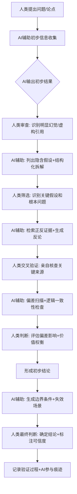

# AI时代的第一性原理：人机协同的思维增强

> ⚠️ **偏差提示**：本文在撰写过程中存在双重偏差风险——作者既对第一性原理思维有长期研究投入，又对AI辅助工具有实际使用经验，可能存在"寻找AI与第一性原理结合点"的确认偏差。同时，当前大模型技术发展极快，本文关于"AI能做什么"的判断可能在6-12个月内过时。本文不做"AI将彻底改变思维方式"或"AI无法真正辅助深度思考"的绝对化宣称，仅基于2026年中期的技术现状做审慎分析。读者应保持独立判断，尤其注意第7章"认知陷阱"和第8章"局限性说明"中讨论的问题。

## 1. 引言：AIGC时代为什么第一性原理思维既更重要又更困难

在 [适用边界研究](16-boundary-conditions.md) 和 [认知科学基础](13-cognitive-science-foundations.md) 中，我们系统讨论了第一性原理思维的认知机制、适用条件和训练方法。但自2022年底ChatGPT发布以来，一个根本性的变量进入了思维领域：生成式人工智能（AIGC/大语言模型）正在以前所未有的深度和广度参与人类的认知过程。🟡

这一变化带来了一个悖论性的局面：

**第一，第一性原理思维变得前所未有地重要。** 🟢
- AIGC本质上是"超级类比机器"——它通过学习万亿级别的文本数据，能在毫秒间生成看似合理的类比、模仿任何风格、总结现有知识。当类比生成的成本趋近于零、内容供给无限丰富时，能够穿透类比、质疑假设、回到基本原理的能力，就成为人类认知中最稀缺、最不可替代的部分。
- 信息环境正在被AI生成内容淹没。过去，"多数人说的"或"看起来合理的"内容至少经过了人类大脑的某种过滤；现在，AI可以批量生产看似严谨但充满幻觉的内容。在这样的环境中，不依赖表面合理性、能够从基本原理出发独立判断的能力，不仅是思维质量问题，更是信息生存问题。
- AI擅长在现有范式内做优化组合，但不擅长真正质疑范式本身。当整个行业都在用AI做渐进式改进时，能从第一原理出发重新定义问题的人，将获得更大的不对称优势。

**第二，第一性原理思维变得前所未有地困难。** 🟢
- 人类天生是认知吝啬鬼（认知吝啬鬼原则），当有一个"看起来很聪明"的AI工具随时可以给出答案时，启动高能耗的System 2进行深度推理的动机进一步降低。
- AI生成内容的"流畅性错觉"——错误信息和正确信息一样通顺、一样有"权威感"——使得验证成本大幅上升。过去你需要主动去图书馆找资料，现在你需要主动去验证AI给你的"答案"。
- AI幻觉的隐蔽性极强——它会编造不存在的引用、虚构看似合理的逻辑链、甚至伪造学术论文DOI，这些虚构内容往往恰好符合你的预期，进一步强化确认偏差。

这一悖论构成了我们研究AI时代第一性原理思维的出发点：AI既不是第一性原理的终结者，也不是万能增强器，它是一个**能力放大器**——既能放大你的第一性原理思维能力，也能放大你的认知偏差和思维懒惰。🟢 关键在于理解人机分工的边界，建立有效的协同框架，同时警惕新的认知陷阱。

本文将系统探讨：AI时代来源验证面临什么新挑战？AI能在哪些环节增强对抗性审查？人类和AI各自的比较优势是什么？有哪些新的认知陷阱需要防控？以及如何建立人-AI协同的第一性原理实践框架。

---

## 2. AIGC时代来源验证面临的新挑战

[对抗性审查协议](00-adversarial-review-protocol.md) 中定义的五维验证流程，在AIGC时代面临全新的挑战。这些挑战不是原有问题的量变，而是质变——它们从根本上改变了信息生态的运作方式。🟢

### 2.1 幻觉问题（Hallucination）：虚构事实的规模化生产

大模型最根本的问题是"幻觉"——它会以极其自信的语气陈述完全虚构的事实、数据、引用和来源。🔴 这不是bug，而是当前大模型架构的固有特性：
- 大模型的生成机制是"预测下一个token"，它的目标是产生语法和语义上"看起来合理"的文本，而非陈述事实真相。
- 幻觉内容往往被包裹在流畅的叙事中，带有精确的数字、具体的细节、甚至虚构的DOI或URL，使其极具欺骗性。
- 更危险的是"可信幻觉"——AI编造的内容恰好符合你的认知预期或愿望，你会毫无防备地接受它。

> 🟡 **现状评估（2026年中）**：主流大模型（GPT-4o、Claude 3、Gemini等）的幻觉率在事实性问题上约为5-15%，在专业领域或冷门知识上可达30%以上。检索增强生成（RAG）能显著降低但无法完全消除幻觉。"AI从不撒谎"或"AI的幻觉问题已解决"都是错误宣称。

### 2.2 虚构引用：伪造学术背书

这是幻觉问题中对学术研究和第一性原理思考危害最大的一类：🟡
- AI会编造不存在的论文标题、作者、期刊、DOI号，这些虚构引用格式完美、看起来极其真实。
- 更隐蔽的是"半真半假"引用——论文确实存在，但内容被歪曲或张冠李戴；或者作者确实存在，但从未说过AI声称的那句话。
- 在对抗性审查中，我们要求关键事实至少2个独立来源交叉验证，但AI可以一次性给你生成5个"独立"的虚构来源，每个都看起来很可信。

> **典型案例**：2023-2024年有多起法律案件中，律师使用ChatGPT准备诉状，结果提交了6个完全虚构的判例，这些判例有合理的案号、法院名称、判决日期，甚至判决摘要看起来都很专业，直到对方律师去核实才发现全部是AI编造的。🔴

### 2.3 内容规模化生成：信息环境的信噪比危机

AIGC使得内容生产的边际成本趋近于零，这带来了信息生态的根本性变化：🟡
- 过去，生产一篇看起来专业的文章需要人类作者数小时甚至数天的工作；现在AI可以在几分钟内生成数百篇。
- 搜索引擎、学术预印本平台、社交媒体正在被AI生成内容淹没。过去我们默认"能被搜索到的内容至少有一定人类审核门槛"，现在这一假设已经不成立。
- 第一性原理思考的第一步是"收集事实"，但现在你收集到的"事实"可能有相当比例是AI批量生成的幻觉内容，而且你很难区分。
- 这导致了一个悖论：可用的信息越多，找到可信信息的成本反而越高。

### 2.4 深度伪造：多模态内容的真实性危机

多模态AI的发展使得虚假内容不再局限于文本：🟡
- AI可以生成完全不存在的人物照片、伪造视频、克隆声音，且检测难度越来越大。
- 对于第一性原理思考者来说，这意味着"眼见为实"这一古老认知准则进一步失效——你看到的图片、视频、录音可能都是AI生成的。
- 更危险的是"选择性伪造"——内容主体是真实的，但关键细节被篡改，这种篡改最难检测也最具误导性。

> 🟡 **现状评估**：2026年的深度伪造技术已能做到普通用户无法用肉眼分辨。专业检测工具存在，但检测能力和伪造能力正在进行军备竞赛，没有永久可靠的检测方法。

### 2.5 回声室效应的算法放大：个性化偏见增强

AI推荐算法和生成式AI的结合，使得认知偏差的放大变得系统化：🔵
- AI擅长学习你的偏好，然后生成你想听的内容，进一步强化你的现有信念。
- 当你用AI辅助研究时，它往往会给你"符合你预期"的答案和来源，而不是挑战你假设的相反证据——确认偏差被算法系统性放大。
- 不同的人用同一个AI问同一个问题，如果AI知道他们的立场，可能会给出截然不同的答案，进一步加剧观点极化。
- 第一性原理思考要求主动寻找反证，但AI（默认情况下）往往是反证的敌人而非朋友。

### 2.6 风格模仿带来的权威错觉

AI可以完美模仿任何作者的写作风格——从学术论文到费曼的通俗讲解风格，再到马斯克的推文风格：🟡
- 内容的可信度不再与风格挂钩——一篇看起来像《Nature》论文风格的文章可能完全是AI编造的。
- 这摧毁了我们长期依赖的一个认知启发式："看起来专业/权威的内容更可能是可信的"。在AI时代，这个启发式比以往任何时候都更危险。
- 更微妙的是，AI可以模仿"批判性思维风格"——它会写出"让我们从正反两方面看"、"这里需要注意几个偏差"这样的句子，让你误以为它在进行批判性思考，实际上它只是在模仿批判性思考的语言模式。

---

## 3. AI辅助对抗性审查的增强模式

承认AI带来的新挑战，并不意味着我们只能拒绝AI。相反，如果正确使用，AI可以显著增强对抗性审查的多个环节。关键是要明确：**AI是审查的工具和助手，不是审查的替代者；它负责规模化处理人类不擅长的机械性工作，人类负责价值判断、质疑和最终把关。** 🟢

我们按照 [对抗性审查协议](00-adversarial-review-protocol.md) 的五维框架，逐一分析AI能增强什么、不能增强什么。

### 3.1 AI辅助事实核查与交叉验证

**当前已能做到（🟢 较成熟）**：
1. **快速文献检索与初筛**：AI可以在几秒钟内检索学术数据库，帮你找到某个主题的相关论文列表，按引用数、发表时间、期刊影响因子筛选。这比人类手动检索快10-100倍。
   - ⚠️ **注意**：AI可能会遗漏关键论文，或把不相关论文加进来，人类必须二次核查。
2. **引用格式核查**：AI可以快速检查一篇文章中的引用格式是否正确，DOI是否能解析，作者和期刊名称是否匹配。这能发现一部分低级虚构引用。
3. **文本相似度检测**：AI可以快速比对两段文本是否相似，帮助检测抄袭、洗稿，或追踪某个观点的原始出处。
4. **已知事实数据库核对**：对于常识性事实（如"水的沸点是多少"、"爱因斯坦哪年提出相对论"），AI（配合RAG）可以快速给出答案并标注来源，尽管仍需验证。

**未来可能做到（🟡 发展中）**：
- 自动化"三角验证"：给定一个事实主张，AI自动从多个独立来源检索证据，比对一致性，标记矛盾点，生成验证报告初稿。
- 实时来源可信度评估：AI自动评估一个URL/期刊/作者的历史可信度，给出可信度评分。
- 多模态事实核查：自动检测图片/视频是否为AI生成，是否被篡改。

**AI绝对不能做（🔴 红线）**：
- ❌ 把AI说的"这是真的"当作验证完成——AI本身的判断也可能是幻觉。
- ❌ 依赖AI提供的来源而不亲自点击去看——AI可以给你一个看起来完美的DOI，但那个DOI可能根本不存在。
- ❌ 让AI独立完成关键事实的最终验证——最终验证必须由人类完成，AI只能做初步筛选和标记可疑点。

### 3.2 AI辅助偏差检测

**当前已能做到（🔵 可用但不完美）**：
1. **文本中的偏差模式识别**：AI可以扫描一段论证，识别一些明显的偏差信号：
   - 是否只引用了支持结论的来源，没有反对意见？
   - 语言是否带有强烈情绪化色彩？
   - 是否使用了"所有"、"永远"、"绝对"这类非黑即白的词汇？
   - 是否存在人身攻击或诉诸权威而非诉诸证据？
2. **立场倾向分析**：给定一个作者或出版物，AI可以基于历史内容分析其大致立场倾向（自由派/保守派、技术乐观/技术悲观、支持/反对某个理论），帮助你在阅读时识别立场偏向。
3. **反向提问生成**：你可以让AI"扮演魔鬼代言人"，针对你的论证提出反对意见、寻找逻辑漏洞、生成反例。这能弥补人类自己找反证时的"选择性失明"。
   - ⚠️ **注意**：AI生成的反论可能是稻草人谬误（故意歪曲你的观点然后攻击），人类需要判断这些反对意见是否真的有力。

**未来可能做到（🟡 发展中）**：
- 个性化偏差预警：AI了解你的认知习惯后，可以提醒你"你在这个问题上倾向于确认偏差，建议看看XX来源的反对观点"。
- 论证结构可视化：AI自动画出论证的逻辑结构图，标记哪里是前提、哪里是结论、哪里存在跳跃或循环。
- 跨文档矛盾检测：AI自动比对你收集的多个来源之间的观点矛盾和事实不一致。

**AI绝对不能做（🔴 红线）**：
- ❌ 认为AI能完全识别偏差——最危险的偏差是AI和你共享的偏差，它根本意识不到这是偏差。
- ❌ 让AI代替你做"是否有偏差"的最终判断——偏差识别本质上需要元认知能力，当前AI不具备真正的元认知。
- ❌ 因为AI"没检测到偏差"就认为内容没有偏差——没有检测到不代表不存在。

### 3.3 AI辅助假设列举与结构化拆解

**当前已能做到（🟢 较成熟）**：
1. **结构化拆解辅助**：给定一个问题，AI可以帮你生成MECE（相互独立、完全穷尽）的拆解框架，列出可能的子问题、影响因素、维度划分。这比人类从零开始想更全面，能避免遗漏明显的维度。
   - ⚠️ **注意**：AI生成的拆解框架可能包含不必要的维度，或遗漏关键的隐性维度，需要人类筛选和调整。
2. **假设显性化**：你可以让AI"列出这个论证背后隐含的所有假设"——人类往往意识不到自己论证中的隐性假设，AI可以帮你把它们摆到台面上。
   - 🟢 这是AI特别有价值的一个用途：人类思考时的假设大部分是内隐的，把它们显性化是第一性原理思考的关键一步，AI能显著加速这一过程。
3. **"五个为什么"追问**：AI可以不知疲倦地连续追问"为什么"，直到你触及更根本的层面——人类往往问两三个为什么就停下了，AI可以继续追问下去。
4. **跨领域类比启发**：如 [适用边界研究](16-boundary-conditions.md) 中所说，类比是创新灵感的重要来源。AI可以快速从数十个领域中寻找结构相似的问题和解决方案，给你提供远距类比的灵感。
   - ⚠️ **注意**：类比只是灵感起点，不是答案，必须用第一性原理检验类比的适用性边界。

**未来可能做到（🟡 发展中）**：
- 可视化拆解树：AI自动生成交互式的问题拆解树，支持实时调整、补充、重新组织。
- 假设可信度排序：AI不仅列出假设，还基于现有证据初步评估每个假设的可信度，标记哪些是硬约束、哪些是惯例假设、哪些最值得质疑。
- 隐性假设自动挖掘：AI分析你的历史写作/思考记录，识别你个人思维中反复出现的、可能是你自己都没意识到的默认假设。

**AI绝对不能做（🔴 红线）**：
- ❌ 把AI生成的拆解框架当作"完整列表"——AI的训练数据来自已有知识，它很难列出真正突破性的、挑战范式的新维度。
- ❌ 不加批判地接受AI列出的假设——它可能列出不重要的假设而遗漏真正关键的假设。
- ❌ 让AI替你判断"哪个是最根本的假设"——这需要价值判断和对问题的深度理解，AI做不到。

### 3.4 AI辅助反事实推理与边界测试

**当前已能做到（🔵 可用但不完美）**：
1. **边界条件探索**：你可以让AI"如果X假设不成立，会发生什么？"、"这个结论在什么条件下会失效？"——AI可以快速生成多种反事实场景，帮助你测试论证的鲁棒性。
2. **极端情况推演**：AI可以帮你推演"如果这个变量取极端值，结果会怎样？"——这能帮你发现正常情况下被忽略的失效模式。
3. **敏感性分析辅助**：对于定量模型，AI可以帮你识别哪些参数对结果影响最大，建议优先验证哪些敏感参数。

**未来可能做到（🟡 发展中）**：
- 自动化压力测试：AI系统性地测试一个论证在各种可能的参数组合、边界条件、反常场景下是否仍然成立，生成失效模式报告。
- 历史反事实推演：基于历史数据，AI推演"如果当时发生了X而不是Y，历史会如何发展"，帮助你检验因果推断的可靠性。

**AI绝对不能做（🔴 红线）**：
- ❌ 相信AI对未来的预测——AI没有真正的远见，它的"预测"本质上是基于历史数据的模式匹配，在范式转换时会完全失效。
- ❌ 把AI生成的反事实场景当作"所有可能场景"——AI的想象力受限于训练数据，它很难想象真正的Black Swan事件。

### 3.5 人-AI协作的审查工作流程

基于以上分析，我们可以设计一个AI增强的对抗性审查工作流程，作为 [对抗性审查协议](00-adversarial-review-protocol.md) 的AI时代补充：🟢

**关键原则**：
1. **人在环路中（Human-in-the-loop）**：每一步AI输出后必须有人类审查环节，AI永远不做最终判断。
2. **AI处理规模，人类处理质量**：让AI做检索、整理、列举这些机械性工作，把人类的认知资源集中在判断、质疑、价值选择上。
3. **AI生成的所有内容默认存疑**：无论AI输出看起来多么合理，都先假设它可能是错的，直到你验证过。
4. **全程记录AI参与**：明确标注哪些部分是AI生成的、哪些部分是人类验证过的，不要把AI的工作冒充成人类独立思考的结果。

---

## 4. AI辅助来源验证的方法论框架与工作流程

针对AI时代的来源验证挑战，我们需要在原有五维验证基础上，增加专门的AI内容验证维度。以下是一个可操作的工作流程：

### 4.1 第一步：溯源核查（无论内容来自人类还是AI）

🟢 **对任何声称是"事实"的内容，首先问：这个说法的原始来源是什么？**

1. **如果是AI给你的内容**：
   - 要求AI提供具体来源：作者、标题、发表期刊/出版物、年份、页码、DOI/URL。
   - 如果AI提供了DOI/URL，必须亲自点击去看——不要只看AI给的摘要。
   - 如果AI说"这是常识"或"众所周知"，要求它给出具体出处——"常识"往往是"我找不到来源但觉得应该是对的"的代名词。
   - 如果AI无法提供可验证的来源，或者提供的来源无法访问/不存在，直接标记为🟡待验证，不要当作事实使用。

2. **特别警惕"完美引用"**：
   - 如果AI给你的引用格式完美、细节齐全，反而要更小心——编造完美的假引用比编造有瑕疵的假引用更容易让人上当。
   - 抽查引用：随机选择1-2个AI提供的引用，亲自去核实内容是否真的支持AI的说法——即使是真实存在的论文，AI也可能歪曲其结论。

### 4.2 第二步：可信度分层验证

🟢 根据内容的重要性，采用不同强度的验证策略：

| 内容重要性 | 验证要求 | AI角色 |
|-----------|---------|--------|
| **非核心背景信息**（如历史日期、通用概念定义） | 至少1个一级来源验证，或2个独立二级来源交叉验证 | AI检索来源，人类快速核查 |
| **核心论据/关键事实** | 至少2个独立一级来源交叉验证，最好其中一个是非英文来源（避免AI训练数据偏差） | AI做初步检索和筛选，人类必须亲自阅读原始来源 |
| **支撑结论的关键数据** | 必须追溯到原始研究/数据集，检查数据采集方法、样本量、统计方法，亲自核查数据是否真的支持结论 | AI只能辅助定位原始数据，人类做全部验证工作 |
| **反直觉/争议性主张** | 要求至少3个独立来源，且必须包含反对观点的来源，亲自阅读正反双方的论证 | AI帮你找到反对来源，人类评估双方论证强度 |

### 4.3 第三步：AI输出的"幻觉检测"检查清单

🟢 每次使用AI辅助研究后，过一遍这个检查清单：

- [ ] AI有没有提供具体、可验证的来源？
- [ ] 我有没有亲自核查至少20%的关键引用？
- [ ] 有没有看起来"太完美"、太符合我预期的内容？（这类内容最可能是可信幻觉）
- [ ] 我有没有让AI提供反对观点和反例？
- [ ] 我有没有区分"AI说的"和"已经被验证的事实"？
- [ ] 对于专业领域内容，我有没有用领域知识检查AI的说法是否合理？
- [ ] 我有没有记录哪些内容是AI生成的、哪些是我验证过的？

### 4.4 第四步：对抗性prompting技巧

🟢 如何向AI提问能显著降低被误导的概率：

1. **要求不确定性标注**：不要问"X是什么原因？"，而是问"关于X的原因，学术界有哪些主要理论？每个理论的证据强度如何？存在什么争议？哪些是共识哪些是推测？"
2. **强制要求来源**：每次提问都加上"请为你说的每个事实主张提供具体来源，包括作者、年份、出版物，如果是论文请提供DOI"。
3. **主动要求反证**：加上"请同时提供反对这个观点的证据和论据，以及这个观点可能不成立的情况"。
4. **不要让AI做总结性判断**：不要问"这个理论对不对？"，而是问"支持这个理论的主要证据是什么？反对的主要证据是什么？双方各自的弱点是什么？"——判断留给你自己。
5. **多模型交叉验证**：对于重要问题，用2-3个不同厂商的大模型分别提问，比对它们的回答——如果它们在同一个事实上说法不一致，那这个事实肯定需要验证。
6. **"我不知道"鼓励**：告诉AI"如果你不确定或者不知道，就直接说不知道，不要编造内容"——这能降低但无法消除幻觉。

---

## 5. 第一性原理思维与AI推理能力的互补关系

要建立有效的人机协同，首先要诚实地理解人类和AI各自的比较优势——不是谁比谁"更聪明"，而是能力结构完全不同，适合不同类型的认知任务。🟢

### 5.1 人类的核心优势（当前AI真正不具备的能力）

这些能力是当前大模型架构（基于统计模式匹配的transformer）在原理上就不具备的，不是靠更多数据或更大模型能解决的：🔵

1. **价值判断与目标设定** 🟢
   - 人类能决定"什么是重要的"、"我们应该追求什么目标"、"为了这个目标值得付出什么代价"。
   - AI可以告诉你如何高效实现一个目标，但它不能告诉你这个目标是否值得追求。第一性原理思考最终是为价值服务的——判断哪些问题值得深入、哪些"原理"真正重要，这是人类独有的能力。

2. **根本问题定义** 🟢
   - 第一性原理思考的第一步也是最难的一步：定义正确的问题。爱因斯坦说"如果我有一小时解决问题，我会花55分钟定义问题，5分钟解决问题"。
   - AI可以帮你解决你给它的问题，但它不能真正理解"你真正应该问的问题是什么"——它只能在你给定的问题框架内工作。识别"我们问错了问题"是突破性创新的起点，这需要对情境的深刻理解和直觉，AI做不到。

3. **质疑基本前提的勇气与洞察力** 🟢
   - AI的训练数据来自现有知识，它本质上是"现有知识的统计平均"，它天然倾向于共识性观点。
   - 真正的第一性原理突破往往来自质疑所有人都认为"理所当然"的基本前提——从"时间是绝对的"到"火箭必须一次性使用"。这种质疑需要对常识的反叛、对"皇帝的新装"的敏感，以及承受被认为是疯子的勇气，这些都不是AI具备的品质。

4. **真正的理解与因果直觉** 🔵
   - 尽管大模型能生成看似深刻的分析，但认知科学家和哲学家的主流共识是：当前AI并不真正"理解"它在说什么——它掌握的是统计相关性，不是因果理解。
   - 人类能基于对世界的具身理解（作为物理世界中的实体拥有的因果经验），判断一个论证"在物理上是否合理"、"在因果上是否说得通"——这种物理直觉和因果直觉是AI没有的。
   - 这就是为什么AI会生成"如果把鸽子放大到100倍它能载客飞行"这类看起来合理但物理上荒谬的内容——它不理解物理世界的因果约束。

5. **创造性假设生成（真正新颖的）** 🔵
   - AI可以组合已有想法生成"新"组合，但真正颠覆性的假设——那些在现有知识框架中完全没有先例的想法——目前还是人类的专属领域。
   - 爱因斯坦的相对论、量子力学的哥本哈根解释、达尔文的自然选择，这些想法在提出时与当时的所有共识都矛盾，AI无法从统计平均中产生这种极端的离群值。

6. **元认知与对自身无知的觉察** 🟡
   - 人类能意识到"我不知道什么"、"我的理解可能有盲区"——这种"知道自己不知道"的元认知能力是苏格拉底式智慧的核心。
   - AI不知道自己什么时候不知道——它会对任何问题都生成一个流畅的答案，即使它完全不了解这个领域。它没有真正的"不确定性感受"，只有被训练出来的"看起来不确定"的语言模式。

### 5.2 AI的核心优势（人类不擅长且难以规模化的能力）

这些是AI在当前（2026年）已经明显超越人类的能力，是我们应该主动让AI承担的工作：🟢

1. **规模化信息检索与处理** 🟢
   - AI可以在几秒钟内阅读数千篇论文摘要，提取关键信息，这是人类一生都做不到的规模。
   - 它可以跨语言检索——你不懂俄语、日语、德语的论文，AI可以帮你快速获取内容要点。
   - 它不知疲倦——可以连续几个小时做文献整理工作而不会注意力下降。

2. **多源交叉对比与模式识别** 🟢
   - 给定50个来源，AI可以快速比对它们之间的一致点、矛盾点、差异点，生成结构化的对比表格。
   - 它可以在海量数据中发现人类察觉不到的统计模式——当然，发现的模式是相关性还是因果性需要人类判断。

3. **结构化输出与组织** 🟢
   - AI擅长把混乱的信息整理成清晰的结构：大纲、表格、流程图、检查清单。
   - 它可以按照你指定的任何框架重新组织内容，确保MECE、逻辑清晰、格式统一。
   - 这对第一性原理思考中的"拆解"和"显性化"步骤特别有价值——人类的思考往往是混乱跳跃的，AI可以帮你把它整理成结构化的形式。

4. **穷尽枚举可能性** 🔵
   - 人类思考时容易陷入路径依赖，只想到几种最明显的可能性。
   - AI可以系统地列出某个问题的数十种可能维度、假设、影响因素、解决方案，确保你不会因为认知局限而漏掉重要选项。
   - 当然，列出的可能性中大部分是没用的，需要人类筛选，但"不要漏掉重要可能性"本身就很有价值。

5. **中立的"魔鬼代言人"** 🟢
   - 人类很难真正有力地反对自己相信的观点——心理抗拒、确认偏差、自我防御都会让我们的自我批判打折扣。
   - AI没有自我，它可以不带情绪地生成针对你的论证的反对意见，不管你喜不喜欢。
   - 它不会因为冒犯你而退缩，也不会因为你是权威就不敢质疑——这使得它成为比人类同事更"冷酷"的批评者（当然，前提是你正确引导它这么做）。

6. **认知卸载** 🟢
   - 如 [认知科学基础](13-cognitive-science-foundations.md) 中所说，人类工作记忆容量极其有限（7±2组块）。
   - AI可以作为"外部工作记忆"——你可以把拆解树、假设列表、证据摘要都交给AI记住和维护，把你的工作记忆解放出来用于真正的深度推理。
   - 这就像纸和笔对数学的作用——纸不帮你思考，但它帮你记住中间结果，让你能处理更复杂的计算。

### 5.3 人机分工的基本原则

基于以上比较优势分析，第一性原理思考中的人机分工应该遵循以下原则：🟢

| 任务类型 | 主导方 | AI辅助 |
|---------|-------|--------|
| 决定研究什么问题、什么问题重要 | 🧑 人类 | AI可以提供建议，但最终决定权在人类 |
| 定义问题边界、质疑问题本身 | 🧑 人类 | AI可以提供不同的问题表述方式 |
| 列举可能的隐含假设 | 🤝 人机协作 | AI生成初步列表，人类筛选和补充关键假设 |
| 识别哪些假设是惯例、哪些是硬约束 | 🧑 人类 | AI可以提供相关信息和类比，但最终判断需要人类对领域的理解 |
| 大规模文献检索与初步整理 | 🤖 AI | 人类提供方向和关键词，审查AI的检索结果 |
| 交叉验证来源一致性 | 🤝 人机协作 | AI做初步比对，标记矛盾点，人类深入核查 |
| 生成反对意见和反例 | 🤖 AI | 人类评估这些反对意见的力度，不是稻草人 |
| 从基本原理逻辑演绎 | 🧑 人类 | AI可以帮你检查每一步逻辑是否有跳跃，记录推导过程 |
| 价值判断与权衡取舍 | 🧑 人类 | AI可以列出不同选择的利弊，但不能替你做权衡 |
| 最终结论与可信度判断 | 🧑 人类 | AI可以提供决策支持信息，但最终判断必须是人类的 |

> 🟢 **核心洞察**：AI最适合做"拓展可能性空间"的工作——列出更多选项、更多来源、更多反例、更多维度；人类最适合做"收缩可能性空间"的工作——判断什么是重要的、什么是相关的、什么是正确的、什么是值得追求的。AI做广度，人类做深度；AI做加法，人类做减法。

---

## 6. AI时代的认知陷阱

AI是强大的工具，但也是危险的工具。使用AI辅助第一性原理思考时，有几个新的认知陷阱特别需要警惕——这些陷阱在AI时代之前不存在，或者影响没有这么大。🟡

### 6.1 过度依赖AI（"认知外包"退化）

**陷阱描述**：你慢慢习惯了让AI帮你思考、帮你找资料、帮你拆解问题，最后你自己的第一性原理思维能力因为长期不用而退化。🔴
- 就像你长期依赖GPS导航后，自己认路的能力会下降一样；你长期依赖AI思考，深度思考的能力也会下降。
- 一开始你是"用AI辅助思考"，慢慢变成"让AI替我思考"，最后你甚至无法独立完成最简单的第一性原理分析。
- 更隐蔽的是"技能拐杖效应"：你觉得自己能力增强了（因为有AI帮忙），实际上你独立思考的能力在萎缩——一旦AI不可用，你会发现自己比以前更差。

**防控策略**：
- 🟢 定期做"无AI练习"——每做3个AI辅助的分析，就做1个完全不用AI的分析，保持独立思考能力。
- 不要在简单问题上用AI——如果你自己15分钟能想清楚的问题，不要找AI，把AI留给真正复杂的问题。
- 先独立思考，再用AI补充——先用自己的脑子想20-30分钟，形成初步的假设和拆解，然后再打开AI看它有什么补充。不要一开始就问AI，那样你永远只是在AI给的框架里打转。

### 6.2 自动化偏见（Automation Bias）

**陷阱描述**：人类有一种系统性倾向：过度相信自动化系统的输出，即使有明显的矛盾证据也倾向于接受AI的答案。🟡
- 航空业很早就发现了这个问题：当自动驾驶系统给出错误指令时，飞行员往往会盲从系统，即使自己的仪表显示系统错了，导致事故。
- 在AI时代，这种偏见表现为："AI这么说的，应该没错"、"这个回答看起来很专业，应该是对的"——你降低了审查标准，因为你默认AI是客观准确的。
- 更糟的是，AI的表达总是自信流畅的，这种语气上的自信会进一步强化你的信任——它从来不说"我可能错了"（除非你特意要求），总是用权威的口吻陈述一切。

**防控策略**：
- 🟢 反转默认假设：默认AI是错的，除非证明它是对的；而不是默认AI是对的，除非证明它是错的。
- 对AI的输出比对人类的输出保持更高的怀疑标准——人类会犹豫、会说"我不确定"、会承认自己不知道，AI不会，所以更需要警惕。
- 如果AI的说法和你的直觉/领域知识矛盾，永远相信你的直觉——先假设AI错了，去验证，而不是反过来。

### 6.3 幻觉的隐蔽性："流畅的谎言"最难识别

**陷阱描述**：AI幻觉最危险的地方不是它会说错，而是它说错的时候和说对的时候看起来一模一样——一样流畅、一样自信、一样有细节。🔴
- 人类撒谎时通常会有信号：犹豫、细节少、眼神闪躲、故事太完美或太不完美。AI没有这些信号——它的谎言和真话在表现形式上完全没有区别。
- 研究表明，即使是AI领域的专家，也无法可靠地仅通过文本判断一段内容是不是AI幻觉——这不像识别垃圾邮件那样有明显特征。
- 最危险的是"符合预期的幻觉"：AI编造的内容恰好印证了你已有的信念，你会欣然接受，根本不会想到去验证。

**防控策略**：
- 🟢 关键事实必须溯源——无论看起来多么可信，只要是核心论据，必须亲自核查原始来源。
- 建立"验证预算"：对于重要的分析，预留20-30%的时间专门用于验证AI给出的事实。不要把所有时间都花在生成内容上，验证同样重要。
- 主动寻找"不合理之处"：读AI输出时，专门问自己"这里有没有什么地方感觉不对？有没有太巧了？有没有违背常识或领域知识？"——对可疑点零容忍，必须验证。

### 6.4 表面复杂性错觉："看起来深刻"不等于真的深刻

**陷阱描述**：AI可以生成极其复杂、术语密集、看起来非常"深刻"的分析，但这些分析可能完全是空洞的套话组合。🟡
- 它擅长使用学术语言、引用时髦理论、构建复杂的分类框架——形式上完美符合"深度分析"的所有外在特征，但内容上可能没有任何真正的洞见。
- 人类有一种"启发式偏差"：认为越复杂、越难懂、术语越多的内容越深刻。AI完美利用了这一偏差——它可以把最简单的道理说得像量子场论一样复杂，让你觉得"哇好深刻"，实际上什么新东西都没有。
- 第一性原理思考的本质是"穿透复杂性看到简单的本质"，但AI可以帮你制造更多复杂性，让你觉得自己在深度思考，实际上只是在制造概念迷宫。

**防控策略**：
- 🟢 费曼测试：能不能用简单的语言、用具体的例子，把你从AI那里学到的东西解释给一个聪明人听？如果解释不清楚，说明你（和AI）根本没理解。
- 追问"那又怎样？"：对于AI给出的每个"洞见"，连续问几个"那又怎样？这能推出什么具体结论？这改变了什么？"——真正的洞见有具体的推论和实践意义，空洞的套话经不起这样的追问。
- 警惕"正确的废话"：如果AI说的话放在哪里都对、不提供任何具体信息、无法被证伪，那它就是废话，不管听起来多么深刻。

### 6.5 认知同质性：所有人得到同一个"答案"

**陷阱描述**：如果所有人都用类似的大模型、类似的prompt、类似的思维框架辅助思考，会导致认知多样性的丧失——大家都得到类似的结论、类似的想法、类似的错误。🟡
- 第一性原理突破往往来自异端——来自想法与众不同的人。如果AI把所有人的思考都拉向统计平均，真正颠覆性的想法会更少出现。
- 你以为自己在"独立思考"，实际上你只是在AI的隐含引导下，沿着训练数据中的共识路径前进——你和其他用AI的人会得出非常相似的结论，还以为这是"客观真相"。
- 这是一种新型的"群体思维"——不是群体压力导致的，而是算法导致的。

**防控策略**：
- 🟢 刻意引入异质性：对于重要问题，不要只看AI的答案，去读那些"古怪"的来源、边缘的观点、过时的旧书、不同学科的异类学者。
- 多模型、多prompt、多轮对话：不要用一个AI问一次就完事，用不同的AI、用极端化的prompt（如"故意唱反调，给出最离经叛道的分析"）、用不同的提问方式，看看会不会得到不同的结果。
- 保留"无AI思考时间"：在打开AI之前，先写下你自己独立思考的结论——然后再看AI怎么说，对比差异，而不是让AI的答案先入为主。

### 6.6 责任分散："AI这么建议的"

**陷阱描述**：当决策出错时，你可以把责任推给AI——"是AI让我这么做的"、"AI分析说这个方案最好"——这会削弱你的责任感和审慎性。🟡
- 第一性原理思考要求你为自己的推理和结论负责——因为你自己从基本原理推导过，你知道为什么相信这个结论。
- 如果结论是在AI辅助下得出的，你很容易放松对自己的要求——"反正有AI帮忙，出错也不是我一个人的问题"——这种心态会让你不那么认真地审查推理过程。

**防控策略**：
- 🟢 最终结论必须用你自己的话重新写一遍——不要复制粘贴AI的话。用自己的话重述的过程，就是你真正理解和负责的过程。
- 明确记录：哪些判断是你自己的，哪些是AI建议但你同意的，哪些是你不同意AI但AI提出了有价值的观点。
- 永远记住：你用AI辅助思考，但思考的责任完全在你——AI不能替你负责，功劳是你的，错误也是你的。

---

## 7. 人-AI协同的第一性原理实践框架

基于以上分析，我们提出一个AI增强的第一性原理思维实践框架。这个框架不是替代 [方法论框架](08-methodology-framework.md) 中的六步流程，而是为每一步提供AI增强策略和陷阱防控。🟢

### 步骤0：准备阶段——建立人机协作规则

在开始任何AI辅助分析之前，先明确：
1. **本次分析中AI的角色是什么？** 是仅做文献检索？还是辅助拆解？还是生成反论？提前明确边界，不要让AI越界。
2. **哪些步骤你完全不用AI？** 建议至少"问题定义"和"最终判断"这两步完全独立完成。
3. **验证计划是什么？** 预留多少时间做验证？哪些事实必须亲自核查？

### 步骤1：定义问题（🧑 人类主导，完全不用AI）

- 关上AI，拿出纸和笔（或打开空白文档），用自己的话写下：
  - 我真正要解决的问题是什么？
  - 为什么这个问题重要？
  - 如果我解决了这个问题，会改变什么？
  - 我现在对这个问题的初步直觉是什么？
  - 我有哪些先入为主的信念可能影响判断？
- 🔴 这一步绝对不要一开始就问AI"我应该怎么思考XX问题"——那会让AI的框架代替你的问题定义。
- 完成这一步后，你可以打开AI，让它"列出3-5种不同的方式来表述这个问题，以及每种表述方式隐含的假设"——用它来挑战你的问题定义，但不要让它代替你定义问题。

### 步骤2：识别并列举假设（🤝 人机协作）

1. **人类先独立列举**：不看任何资料，用自己的脑子列出所有你能想到的这个问题背后的假设——花15-20分钟，能列多少列多少。
2. **AI补充列举**：然后让AI"针对[你的问题]，列出所有可能的隐含假设，包括那些被所有人当作常识的、没有人会质疑的假设——越反常规越好，不要判断它们对不对，先列出来"。
3. **合并与筛选**：把你的列表和AI的列表合并，划掉重复的，然后逐个问：
   - 这个假设真的成立吗？有什么证据？
   - 如果这个假设不成立，会发生什么？
   - 这个假设是物理硬约束，还是只是惯例/文化/路径依赖？
   - 哪些假设是最值得质疑的？
4. **AI辅助检验**：让AI针对你标记的"最值得质疑的3-5个假设"，提供正反两方面的证据和来源——你亲自核查关键来源。

### 步骤3：拆解到基本原理（🤝 人机协作）

1. **人类先独立拆解**：尝试自己把问题拆解到最基本的组成部分——物理定律、人性基本特征、数学约束、系统基本属性。
2. **AI辅助结构化**：把你的初步拆解给AI，让它"帮我把这个拆解整理成MECE的结构化框架，看看有没有遗漏的重要维度，有没有重叠的部分"。
3. **跨领域类比启发**：让AI"这个问题的结构在其他哪些领域（如生物学、物理学、经济学、计算机科学）出现过？那些领域是怎么解决类似问题的？"——但记住类比只是灵感，不是答案。
4. **人类最终判断**：哪些原理是真正基本的、不可再分的？哪些只是中间层抽象？哪些原理在这个具体场景下成立？这一步必须由人类判断。

### 步骤4：从头重构解决方案（🧑 人类主导，AI辅助）

1. **人类先独立构思**：如果没有任何现有方案、没有任何路径依赖，纯粹从基本原理出发，理想的解决方案是什么样的？
2. **AI辅助拓展**：让AI"基于这些基本原理，有哪些可能的解决方案方向？尽可能多地列出，不要考虑可行性，不要考虑现有惯例，越疯狂越好"。
3. **人类筛选与整合**：从所有可能方向中，筛选出真正符合基本原理、有意义的方向，整合成具体方案。
4. **AI辅助边界测试**：让AI"这个方案在什么条件下会失效？可能有什么意外后果？有哪些风险？"——人类评估这些风险是否可接受、是否可控。

### 步骤5：验证与迭代（🤝 人机协作）

1. **AI辅助生成验证计划**：让AI"我需要验证这个结论/方案，应该收集哪些证据？做什么实验？找什么类型的反例？可能的失效信号是什么？"
2. **人类执行验证**：亲自收集证据、核查来源、寻找反证。对于关键事实，不要依赖AI收集的证据。
3. **AI辅助偏差扫描**：把你的论证给AI，让它"扫描这个论证中可能存在的认知偏差：确认偏差、锚定效应、过度自信、幸存者偏差等等。哪些地方逻辑有跳跃？哪些地方我可能在一厢情愿？"
4. **人类最终修正**：基于验证结果和偏差扫描，修正你的结论。

### 步骤6：明确边界与不确定性（🧑 人类主导）

1. 最后，关上AI，自己写下：
   - 我对这个结论有多大信心？（用百分比表示，不要说"很有信心"这种模糊的话）
   - 什么证据会让我改变想法？
   - 这个结论在什么条件下成立？什么条件下不成立？
   - 我可能在哪里错了？最大的风险是什么？
   - 哪些是我知道的，哪些是我不知道的，哪些是我以为我知道但其实可能错的？
2. 你可以让AI帮你把这些整理得更清晰，但内容必须是你自己的判断。

---

## 8. 局限性说明

在结束前，我们必须诚实地说明本文视角的局限性，以及AI技术本身的根本边界——这既是第一性原理思维的要求，也是对技术保持审慎的必要态度。🟢

### 8.1 本文的偏差与局限

1. **技术快速迭代风险** 🔴：本文基于2026年中期的大模型技术水平写作。大模型领域发展极快，本文中关于"AI当前能做什么、不能做什么"的判断可能在1-2年内就过时——某些"未来可能做到"的事情可能很快实现，而某些我们以为"AI永远做不到"的事情也可能有突破。读者需要根据阅读时的技术现状重新评估。

2. **个人经验外推风险** 🔵：本文关于如何使用AI辅助思考的建议，基于作者个人的使用经验和认知科学的一般原理，但个体差异极大——对一个人有效的方法，对另一个人可能无效甚至有害。没有"对所有人最优"的人机协作模式，你需要在实践中摸索适合自己的方式。

3. **英文训练数据偏差** 🟡：当前主流大模型的训练数据以英文为主，中文和其他语言的内容覆盖不足，非英语学术圈的研究成果可能被系统性低估。这意味着AI在非英语语境下的事实核查能力更弱，幻觉率可能更高。

4. **没有讨论监管和伦理维度** 🟡：本文仅从个人认知实践的角度讨论AI辅助思考，没有涉及更宏观的问题：AI内容监管、信息生态治理、算法偏见的社会影响、AI时代的认知公平等。这些问题同样重要，但超出了本文的范围。

### 8.2 当前大模型（2026年）的根本局限

无论AI发展多快，基于当前架构（统计学习、transformer、自回归生成）的大模型有几个根本局限，这些局限不是靠扩大模型规模或增加数据就能完全解决的：🔵

1. **没有真正的理解**：如前所述，大模型掌握的是符号之间的统计关联，不是对物理世界和人类社会的因果理解。它可以谈论"重力"，但它没有体验过重力；它可以谈论"正义"，但它没有正义感。这种"理解"的缺失意味着在需要真正因果推理的场景下，它可能会犯人类绝对不会犯的荒谬错误。

2. **知识截止日期问题**：大模型的知识有截止日期（如GPT-4o知识截止到2024年中），它不知道截止日期之后发生的事情，除非通过RAG实时检索。即使有RAG，它也无法理解真正最新的、还没有被写入文字的进展。第一性原理思考往往面向未来，而AI的知识本质上是关于过去的。

3. **无法真正质疑训练数据的根本范式**：大模型的"世界观"是训练数据中所有观点的统计平均。它可以质疑个别观点，但它无法真正挑战训练数据中最根本的共识——那些所有人都信以为真、所以几乎没有人写文章反对的前提。而真正的第一性原理突破恰恰需要质疑这些最根本的前提。

4. **没有真正的自主性和意图**：AI没有自己的目标，它不会真正"想"要发现真相，也不会"想"要挑战什么。它只是在响应你的prompt生成文本。质疑基本前提需要内在的动力——对现状的不满、对真理的渴求、证明别人错了的野心——这些都是人类独有的动机，AI没有。

5. **推理能力的天花板**：尽管AI在很多推理任务上表现惊人，但研究表明，它在需要多步骤深层推理、反事实思维、真正新颖的问题解决上，能力仍然有限，而且经常会在长推理链中犯"注意力漂移"错误——前面的步骤正确，后面慢慢偏了，最后得出错误结论。

### 8.3 AI不是万能药，也不是洪水猛兽

最后，我们需要避免两种极端态度：🟢

**一种极端是技术万能论**："有了AI，我们不需要自己思考了"、"AI比人类聪明，听AI的就对了"、"第一性原理思维已经过时了"。这种态度既错误又危险——它低估了人类认知的独特价值，也低估了AI的固有缺陷。把思考完全外包给AI，最终会导致认知能力的退化和判断力的丧失。

**另一种极端是AI拒绝论**："AI都是幻觉，完全不能用"、"用AI思考就是作弊"、"真正的思考必须完全靠人脑"。这种态度同样错误——它无视AI作为工具的巨大价值，就像拒绝使用计算器因为"真正的数学必须心算"一样。纸和笔、印刷术、搜索引擎、计算机——历史上每一次认知工具的革命都曾引发类似的恐惧，但最终那些善用新工具的人获得了巨大的认知优势。

**平衡的视角是**：
- AI是认知工具，不是认知主体——它是锤子和望远镜，不是建筑师和天文学家。
- 工具能放大你的能力，也能放大你的缺陷——如果你本身有很强的第一性原理思维能力，AI会让你更强；如果你本身不擅长批判性思考，AI会让你更自信地犯错。
- 第一性原理思维在AI时代不是变得不重要了，而是变得更重要了——当所有人都有AI这个"超级类比器"时，能穿透类比、质疑前提、回到基本原理的能力，是人类认知最后的护城河，也是最有价值的能力。

---

## 9. 进一步研究方向

本研究只是AI时代第一性原理思维的初步探索，还有很多方向值得更深入研究：

### 9.1 短期可实践方向

1. **AI辅助审查的prompt工程优化**：系统研究什么样的prompt能最有效地让AI生成高质量的反论、减少幻觉、避免共识偏差，建立经过验证的prompt库。
2. **人机协作流程的实证检验**：在练习题和真实问题中对比"纯人类思考"vs"AI辅助思考"的结果质量，看看AI到底在哪些环节真的有帮助，哪些环节反而降低质量。
3. **AI幻觉检测技巧库**：收集各类AI幻觉的实际案例，总结识别幻觉的实用技巧和信号。
4. **将AI增强整合到现有训练体系**：更新 [练习题](12-exercises.md)，增加"AI辅助思考"和"识别AI幻觉"的专项练习。

### 9.2 中期研究方向

1. **不同领域的AI辅助最佳实践差异**：物理、工程、商业、社会科学、艺术等不同领域，第一性原理思考的方式不同，AI的最佳使用方式也可能不同——需要分别研究。
2. **认知外包的量化影响研究**：长期使用AI辅助思考到底会对人类的独立思考能力产生多大影响？是增强还是削弱？什么使用模式能最大化增强、最小化削弱？这需要纵向的实证研究。
3. **人-AI协作的界面设计**：什么样的工具界面最能支持第一性原理思考而不是阻碍它？现有的ChatGPT式对话界面可能不是最优的。
4. **AI对突破性创新的影响**：AI是增加还是减少了真正颠覆性的第一性原理突破？这需要对AI时代前后的创新模式做对比研究。

### 9.3 长期开放性问题

1. **如果AGI真的实现了，第一性原理思维对人类还有意义吗？** 如果有一天AI真的能理解、能质疑前提、能做真正的因果推理，人类思考的独特价值在哪里？
2. **第一性原理思维本身会不会被AI自动化？** 有没有可能AI最终能独立完成完整的第一性原理分析，从定义问题到质疑前提到重构方案？如果能，那意味着什么？
3. **认知多样性的未来**：当所有人都用类似的AI辅助思考时，如何保护认知多样性？如何避免所有人都被AI拉向同一个"最优解"？
4. **教育的变革**：在AI能做大部分信息处理和模式匹配的时代，教育应该如何改革？是更强调第一性原理思维和批判性思考，还是有其他更重要的能力需要培养？
5. **"理解"的本质**：如果AI表现得好像它理解了，而且在所有任务上都和人类理解得一样好甚至更好，那么它是不是真的"理解"了？这个哲学问题对AI时代的第一性原理思维有根本的影响。

---

## 结语

回到最初的悖论：在AI时代，第一性原理思维既更重要又更困难。

它更重要，是因为：AI让类比和优化变得廉价，让内容生产变得无限，让"看起来合理"变得无处不在——在这样的世界里，能穿透表象、质疑前提、回到基本原理的能力，是区分真正的洞见和精致的废话、区分独立判断和算法回声、区分人类和机器的关键。

它更困难，是因为：AI给了我们一个随时可用的"思考拐杖"，它的答案流畅、自信、看起来聪明，让我们更容易放弃费力的深度思考；AI幻觉隐蔽而危险，验证成本大幅上升；算法推荐和个性化生成让我们更容易困在自己的回声室里。

但这不是一个我们可以选择"用不用AI"的时代——AI已经在那里了，信息环境已经永久改变了，假装它不存在是自欺欺人。真正的选择是：你是做AI的主人，还是做AI的奴隶？你是有意识地、有策略地使用AI作为增强你第一性原理思维的工具，还是无意识地让AI代替你思考、把你的认知能力外包出去？

 [认知科学基础](13-cognitive-science-foundations.md) 告诉我们，第一性原理思维本质上是反直觉的、高能耗的、需要主动控制的——在AI时代，这一点没有改变，反而更突出了。AI能帮你处理机械性的认知劳动，但它不能代替你做最困难、最人性的部分：决定关心什么、质疑什么、相信什么、追求什么。

最终，AI时代的第一性原理思维，是一种"增强的自主性"——善用AI的规模和速度，但永远把最终的判断权、质疑权、价值选择权掌握在人类手中。就像望远镜没有让天文学家失业，反而让他们能看得更远；计算器没有让数学家失业，反而让他们能探索更复杂的问题——AI也不会让第一性原理思考者失业，反而会让真正擅长第一性原理思考的人，能在更高的维度、更大的规模上发挥他们的能力。

但前提是，你必须首先成为一个真正的第一性原理思考者——不是依赖AI帮你思考，而是你自己能思考，然后用AI让你的思考走得更远。

---

*本文档是第一性原理后续研究方向的第三个成果，系统探讨了AI时代第一性原理思维面临的新挑战、人机协同的可能性框架、以及需要警惕的认知陷阱。文档可信度自评：人机分工框架与认知陷阱部分🟢A级（基于认知科学共识和现有AI能力的分析），AI当前能力评估🔵B级（基于2026年中技术现状，存在快速过时风险），未来预测部分🟡C级（推测性判断，不确定性很高），关于AGI的讨论🟡D级（长期开放性问题，无确定答案）。本文与[08-methodology-framework.md](08-methodology-framework.md)、[00-adversarial-review-protocol.md](00-adversarial-review-protocol.md)、[13-cognitive-science-foundations.md](13-cognitive-science-foundations.md)、[16-boundary-conditions.md](16-boundary-conditions.md)共同构成"方法论-审查-认知-边界-AI时代"的完整体系。*
