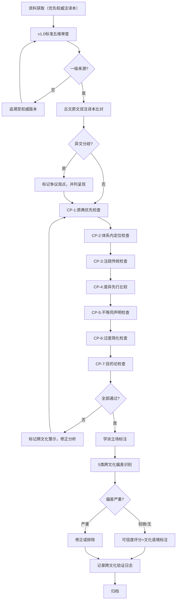

# 跨文化对抗性审查标准与"反向语义漂移"防御机制

> 本协议在[v1.0对抗性审查标准](../00-adversarial-review-protocol.md)基础上针对跨文化比较场景进行适配，核心新增"反向语义漂移"防御机制——防止以西方概念框架生硬套用东方思想。v1.0的来源分级、可信度评分、五维验证流程、异常标记规范全部复用，本章仅定义跨文化场景特有的扩展规则。

---

## 0. 阶段0：跨文化概念扫描（本项目必做，优先级高于所有资料搜集）

> 基于v1.1跨领域概念扫描经验扩展为跨文化版本。本项目涉及中西方两大哲学传统，必须在所有资料搜集前完成。

### 0.1 核心概念双向扫描清单

| 西方概念（v1.0） | 待考察的中方对应概念 | 语义漂移风险等级 | 初步审查要点 |
|-----------------|---------------------|------------------|-------------|
| First Principles（第一性原理/第一原理） | 道、本、理、原 | ⚠️ 极高 | 避免直接等同；"道"兼具本体论、生成论、规律论多重含义，不可简化为"第一原理" |
| Fundamental Truth（根本真理） | 诚、自然、真如 | ⚠️ 高 | "诚"兼具本体论与伦理维度，"自然"意为"自己如此"而非自然界 |
| Axiom（公理/自明原理） | 故、理、类 | 🟡 中 | 墨家"故""理""类"是逻辑范畴但与亚里士多德三段论结构不同 |
| Reasoning from fundamentals（从根本推理） | 格物致知、即物穷理、致良知 | ⚠️ 高 | 朱王异同是儒家内部重大分歧，不可笼统归为"推理方法" |
| Logical deduction（逻辑演绎） | 因明、三支作法 | ⚠️ 高 | 因明学是宗教论辩逻辑，与形式逻辑目的、结构均有差异 |
| Non-analogical thinking（反类比思维） | 无为、破执 | 🟡 中 | "无为"是不妄为而非不作为；"破执"是解构认知执著而非反类比 |

### 0.2 概念使用约定

1. **禁止直接等同声明**：不得使用"X就是中国的第一性原理"这类表述
2. **先呈现本义，再比较**：每个中方概念先以其自身思想体系语境解释，再讨论与西方概念的异同
3. **标注文化语境**：所有比较性陈述必须标注"在XX意义上""从XX角度看"等限定语
4. **保留差异优先**：比较时先列差异，再列共性——差异是跨文化对话的价值所在
5. **术语原文保留**：核心概念首次出现时保留原文（如"道（Dao）"），不强行翻译

### 0.3 术语表规划

- 预留15%总工作量用于术语对齐与概念对照表
- 所有核心概念需在最终术语表中提供：本义、体系内功能、与西方概念的对应/不对应说明

---

## 1. "反向语义漂移"防御机制（本项目核心创新）

### 1.1 什么是"反向语义漂移"

v1.0中"跨领域语义漂移"指同一术语在不同领域含义不同。本项目面临的是更隐蔽的反向风险：

**反向语义漂移定义**：以A文化的概念框架、分类体系、问题意识为默认标准，去切割、套释、重构B文化的思想，导致B文化概念的本源性含义被扭曲、遮蔽或简化，最终制造出"X文化早已有Y"的虚假对应。

**典型表现**：
- "道家的'道'就是古希腊的'逻各斯'"——忽略道的生成论、实践性维度
- "墨家三表法就是科学实证方法"——忽略三表法的历史经验维度与圣王取法预设
- "朱熹'格物致知'就是经验主义认识论"——忽略儒家伦理本位的认知指向
- "佛教因明学就是亚里士多德逻辑学"——忽略因明的宗教解脱论目的

### 1.2 "反向语义漂移"七级防御检查清单

所有概念分析完成后必须逐一通过以下检查：

| 检查点 | 审查问题 | 通过标准 |
|--------|---------|---------|
| **CP-1：原典优先检查** | 该概念的解释是否先引用原典原文，再进行比较？ | 原典引用在前，比较分析在后，原典引文不少于比较性文字的1/3 |
| **CP-2：体系内定位检查** | 是否先说明了该概念在其自身思想体系中的功能定位，再与西方比较？ | 概念的体系内角色（本体论/认识论/方法论/修养论）已明确说明 |
| **CP-3：注疏传统检查** | 是否参考了该概念的本土注疏传统（如王弼注《老子》、朱熹注《大学》），而非仅用现代西方哲学框架解读？ | 至少引用1种权威古注，明确标注注家与注本 |
| **CP-4：差异先行检查** | 比较分析时是否先列举差异点，再列举共性？ | 差异点列举不少于3条，共性点列举放在差异点之后 |
| **CP-5：不等同声明检查** | 是否明确声明"该概念不能简单等同于西方的X概念"或类似限定？ | 每个核心概念均有明确的不等同声明与边界说明 |
| **CP-6：过度简化检查** | 是否避免将复杂概念简化为单一对应（如"道=规律"）？ | 核心概念至少说明2-3个不同维度的含义，不做单一本化 |
| **CP-7：目的论检查** | 是否考虑了该概念在其原生体系中的实践目的（如道家的修身境界、儒家的成圣目标、佛教的解脱目的），而非仅作纯理论比较？ | 概念的实践指向已说明，不脱离其修身/解脱/治国等原初目的 |

### 1.3 "反向语义漂移"标记规范

发现潜在反向语义漂移风险时使用以下标记：

```markdown
> **🌏 跨文化警示**：此处"[中方概念]"与西方"[西方概念]"存在表面相似性，但在[具体维度，如本体论预设/实践目的/方法论结构]上有根本差异。详见[具体分析位置]。避免直接等同。
```

### 1.4 诠释自觉原则

CP防御体系不反对一切当代诠释，而是反对**无意识的时代错置**。必须区分以下两种情况：

| 类型 | 定义 | 是否允许 | 标注要求 |
|------|------|---------|---------|
| **无意识的时代错置** | 用现代/西方概念框架硬套古代思想，声称"古已有之"而不说明这是自己的诠释 | ❌ 禁止 | 不允许，需通过CP防御识别并修正 |
| **有意识的诠释创新** | 明确意识到这是从当代视角对古代概念的引申应用，不声称"古人就是这么想的" | ✅ 允许 | 必须明确标注为"当代诠释"或"引申应用"，并说明与本义的差异 |

**诠释自觉声明格式**：
```markdown
> **💡 当代诠释说明**：以下对"[概念]"的应用是基于当代[XX领域]视角的引申诠释，
> 并非该概念在[原典/原生传统]中的原始含义。原义参见[具体章节]，
> 此处是在承认差异的前提下进行的创造性转化。
```

**关键原则**：
1. **所有诠释都是时代性的**：不存在"完全还原原意"的诠释，本协议提供的是"更严谨的工具"而非"终极答案"
2. **本义优先于引申**：必须先说明概念的原初含义和语境，再讨论引申应用
3. **不声称"古已有之"**：禁止"老子早就说过""墨子是最早的科学家"这类时代错置的宣称
4. **功能相似≠历史影响**：平行比较基于功能相似性，不预设历史传播或影响关系

### 1.5 CP适用层级（裁剪指南）

CP-1至CP-7不是必须全部执行的刚性检查清单，应根据产出物的公开级别和目的进行裁剪：

| 产出物层级 | 必做CP | 可跳过CP | 说明 |
|-----------|--------|---------|------|
| **个人思考笔记** | CP-5（不等同意识） | CP-1/2/3/4/6/7 | 个人思考不需要完整流程，但必须有"不简单等同"的基本意识 |
| **内部分享/讨论稿** | CP-1+CP-4+CP-5 | CP-2/3/6/7 | 内部分享讨论需要原典支撑、差异先于共性，但学派分歧注疏传统可简化 |
| **知识档案/团队共享** | CP-1/2/4/5/6 | CP-3可简化（至少引用一种权威注本）、CP-7需说明实践目的 | 团队共享的知识档案需要较完整的防御 |
| **公开发表/正式报告** | CP-1至CP-7全部 | 无 | 公开产出必须完整走七级防御，这是学术严谨性和知识可信度的基本要求 |

**裁剪决策原则**：
- 产出物影响范围越大，CP检查要求越严格
- 当内容可能被引用/传播时，必须提升CP级别
- 不确定时按"公开发表"标准执行

---

## 2. 古文引用验证标准

### 2.1 权威注译本优先规则

**一级来源（Gold Standard for Classical Texts）**：
- **原文版本**：优先使用中华书局、上海古籍出版社、人民出版社等权威出版社的点校本
- **古注本**：优先选用历史上公认的权威注本（如王弼《老子注》、郭象《庄子注》、朱熹《四书章句集注》、孙诒让《墨子间诂》）
- **现代权威注译**：优先选用该领域公认学者的注译本（如陈鼓应《老子注译及评介》《庄子今注今译》、楼宇烈《王弼集校释》）

**二级来源**：
- 中国哲学书电子化计划（ctext.org）——需与纸质权威版本比对后引用
- 知名学者学术论文中的引用
- 大学公开课程讲义

**三级来源**：
- 网络百科、自媒体文章、个人博客——仅作线索，必须追溯至权威版本验证

### 2.2 双注译本比对要求

- **核心概念原文**：必须至少比对2个独立权威注译本，确认原文文字、句读、释义无重大分歧
- **存在异文时**：若不同版本有文字差异或句读分歧，使用"争议观点"标记列出不同版本
- **关键引文**：需标注书名、篇章、版本（如"《道德经》第一章，王弼本，陈鼓应注译第53页"）

### 2.3 古文引用格式规范

```markdown
> **原文**：[古文原文]
> **出处**：《[书名]》[篇章名]，[版本/注家]，[页码（如有）]
> **今译**：[现代汉语译文，采用权威注译本译文]
> **注疏参考**：[如有重要分歧，列出不同注家解读]
```

---

## 3. 学派立场标注规范

### 3.1 学派内部分歧标注

中国哲学各流派内部存在重大分歧，必须明确标注：

| 流派 | 必须标注的核心分歧 |
|------|------------------|
| 道家 | 老子/庄子差异；老庄学与黄老学差异；道教与道家哲学的区别 |
| 儒家 | 汉学/宋学差异；程朱理学/陆王心学差异；朱熹"即物穷理"vs王阳明"致良知" |
| 墨家 | 前期墨家/后期墨家（墨辩）差异；"墨离为三"的派别分化 |
| 佛教因明 | 古因明/新因明差异；陈那/法称体系差异；因明在汉传/藏传中的不同发展 |

### 3.2 立场标注格式

```markdown
> **⚖️ 学派立场差异**：关于"[概念/命题]"，不同学派/注家有不同解读：
> - [立场A，代表人物/注本]：[核心观点]
> - [立场B，代表人物/注本]：[核心观点]
> - 本档案采用[立场A/B/并列呈现]，原因：[说明选择理由，无明确理由则并列呈现]。
```

### 3.3 历史演变标注

核心概念若有明显历史演变，需简要说明：
- 概念在创始人那里的原始含义
- 后续重要注家/学派的重新诠释
- 当代学术讨论中的争议点

---

## 4. 跨文化认知偏差检查清单

在v1.0的10类认知偏差基础上，增加5类跨文化研究特有偏差：

| 偏差名称 | 定义 | 跨文化比较中的典型表现 | 识别方法 | 防控措施 |
|----------|------|------------------------|----------|----------|
| **西方中心偏差** | 默认西方概念框架、分类体系、问题意识是普遍标准，非西方思想只是西方的"例证"或"先兆" | "X是东方的Y"（Y是西方概念）；只找与西方相似的内容，忽略差异；按西方哲学分类硬割中国思想（本体论/认识论/美学三分法套用） | 检查是否所有比较都是"中→西"单向对应；检查是否使用西方哲学分类体系时不加反思 | 差异先行比较法；中国哲学概念体系自足性说明；双向比较（不仅"中对应西"，也"西对应中"的反身性考察） |
| **东方主义偏差** | 将东方思想浪漫化、神秘化、本质化，塑造"东方智慧"的刻板印象 | 渲染"东方直觉vs西方理性""东方整体vs西方分析"的二元对立；将道家/禅宗解读为"反理性神秘主义"；忽略中国哲学内部的逻辑传统（墨家、因明） | 检查是否存在"东方独特智慧"这类本质化表述；检查是否忽略了中国哲学中的理性/逻辑传统 | 具体分析每个概念，拒绝笼统的"东方/西方"二元标签；纳入墨家逻辑、因明学等理性传统；承认各文化内部多样性 |
| **文化挪用偏差** | 脱离原文化语境抽取概念为己所用，不顾其原生实践目的 | 将"无为"解读为"躺平"；将禅宗公案解读为"思维跳脱"用于商业创新；抽取哲学概念用于成功学 | 检查概念解读是否脱离其修身/解脱/治国等原初实践语境；检查是否将哲学概念工具化、功利化 | 先完整说明概念的原初实践目的与语境；明确标注"在XX语境下可引申理解为..."；不将概念简化为成功学工具 |
| **时代错置偏差** | 将现代问题意识投射回古代思想家，用现代概念过度诠释 | "老子的生态智慧""墨子的民主思想""王阳明的主体性哲学"——将当代观念反套古人 | 检查古人是否真的讨论了该问题；检查概念的历史语境是否被尊重 | 历史语境优先；明确区分"本义"与"现代引申义"；引申讨论明确标注为"当代诠释"而非"原意" |
| **反向格义偏差** | 用西方哲学概念系统对译中国哲学概念，导致概念含义被系统性扭曲 | 用"metaphysics（形而上学）"格义"玄学"，用"logic（逻辑）"格义"名学"，用"ethics（伦理学）"格义"名教" | 检查核心概念的翻译是否经过严格辨析；检查是否依赖"X就是中国的Y"的简单对应 | 核心概念保留原名加音译；先解释概念本义，再讨论与西方概念的可对应性与不可对应性；参考学界关于"反向格义"问题的专门讨论 |

---

## 5. 来源验证日志模板（跨文化适配版）

在v1.0日志模板基础上增加以下字段：

| 新增字段 | 说明 |
|----------|------|
| 文献类型 | 原典/古注/现代注译/学术研究/网络资源 |
| 版本信息 | 出版社、出版年份、点校者/注译者、ISBN（如适用） |
| 异文比对记录 | 比对的其他注译本列表、是否存在异文/句读分歧 |
| 反向语义漂移审查 | CP-1至CP-7检查结果，是否存在风险 |
| 学派立场标注 | 该资料代表的学派立场（如适用） |
| 文化语境说明 | 该资料的写作时代、立场倾向、跨文化解读注意事项 |

---

## 6. 跨文化审查执行流程



---

## 附录：跨文化审查快速检查清单

在完成每个概念的分析后，请确认：

### 概念扫描阶段
- [ ] 是否已完成0.1节核心概念双向扫描，标记高风险概念？
- [ ] 是否遵循0.2节概念使用约定（禁止直接等同、先本义后比较等）？
- [ ] 术语表任务是否已预留工作量？

### 反向语义漂移防御
- [ ] CP-1：原典引用在前，比较分析在后？
- [ ] CP-2：概念在自身体系内的功能已说明？
- [ ] CP-3：已参考权威古注传统，不仅用现代框架解读？
- [ ] CP-4：差异点列举先于共性点，差异点≥3条？
- [ ] CP-5：已明确不等同声明与边界？
- [ ] CP-6：核心概念说明多维度含义，未单一本化？
- [ ] CP-7：概念的原初实践目的已说明？

### 古文引用
- [ ] 关键原文已比对≥2个权威注译本？
- [ ] 引用格式符合2.3节规范（原文/出处/今译/注疏）？
- [ ] 异文/句读分歧已标记为争议观点？

### 学派立场
- [ ] 流派内部分歧已标注（如朱王异同、老/庄差异）？
- [ ] 核心概念的历史演变已简要说明？

### 跨文化偏差
- [ ] 已检查西方中心、东方主义、文化挪用、时代错置、反向格义5类偏差？
- [ ] 无本质化的"东方/西方"二元对立表述？
- [ ] 已纳入墨家逻辑、因明学等理性传统，未将东方简化为"直觉/神秘"？

### 日志记录
- [ ] 跨文化适配版验证日志已完整记录（含文献类型/版本/异文比对/CP检查/学派立场字段）？
